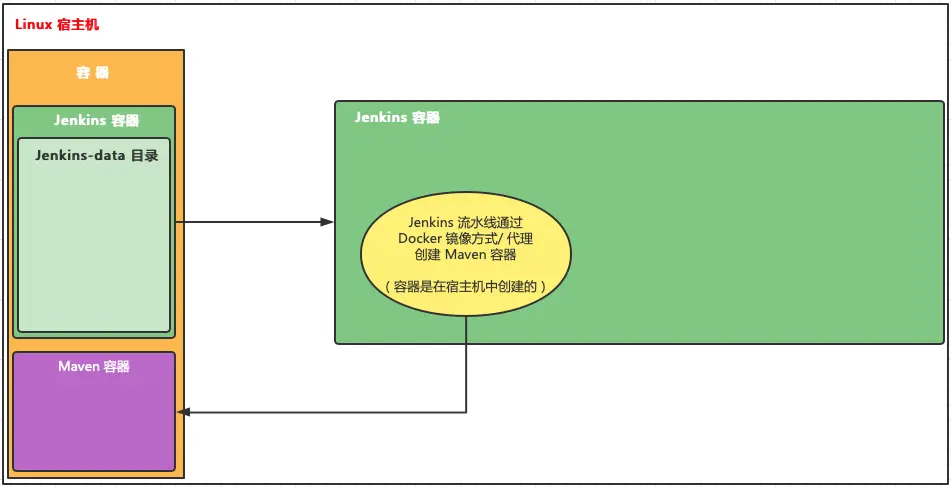
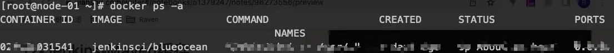
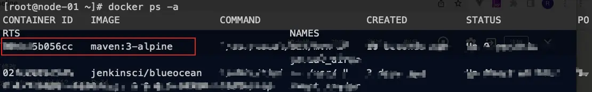
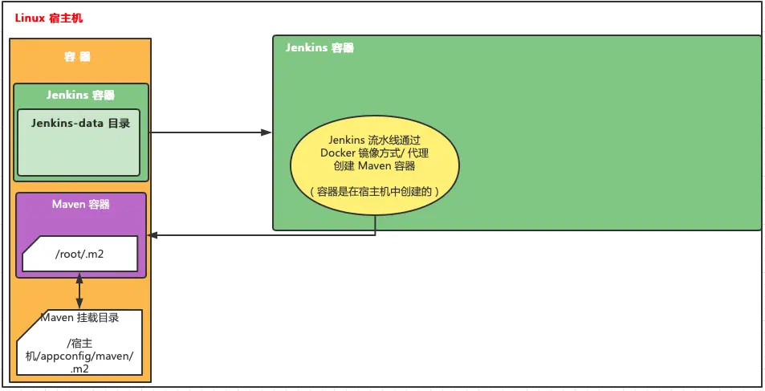

# Jenkins-Maven缓存

# 一、使用Maven打包


```php
pipeline {
    // 任何代理
    agent any

    //  执行任务在这里
    stages {
        // 环境检测
        stage('Check') {
            steps {
                // 当前所在位置
                sh 'pwd && ls -alh'
                echo'环境检查'
                //  当前可用的环境信息
                sh 'printenv'
                sh  'java --version'
                sh  'git --version'
                sh  'docker version'
            }
        }
        //  阶段1
        stage('Build') {
            agent {
                docker {
                    image 'maven:3-alpine'
                }
            }
            steps {
                // 当前所在位置
                sh 'pwd && ls -alh'
                echo'编译项目'
                //  当前可用的环境信息
                sh 'printenv'
                sh  'mvn -v'
                // 使用 mvn 打包
                sh 'mvn clean package -Dmaven.test.skip=true'
            }
        }
        //  阶段2
        stage('Test'){
            steps {
                // 当前所在位置
                sh 'pwd && ls -alh'
                echo '测试项目'
                //  当前可用的环境信息
                sh 'printenv'
            }
        }
        //  阶段3
        stage('Deploy') {
            steps {
                // 当前所在位置
                sh 'pwd && ls -alh'
                echo '部署项目'
                //  当前可用的环境信息
                sh 'printenv'
            }
        }
    }
}
```

> 当pipeline在阶段1中引入Maven环境，并使用命令 mvn clean package -Dmaven.test.skip=true 来打包时，发现特别慢。原因在于需要从官方仓库来下载jar包，而且每次都很慢，如果可以缓存这些jar包，那么速度就会更快

# 二、Jenkins引入Maven环境原理Jenkins引入Maven环境原理.png

> Jenkins中引入Maven环境（任何环境）都是Jenkins自动创建一个Maven容器，该阶段的所有任务都会在该Maven容器中执行，当任务完成后，这个Maven容器会自动删除

- 

  

  1、在没有执行Maven打包命令时，docker 的容器情况

  

  只有一个Jenkins容器.png

- 

  

  2、执行Maven打包命令时

  

  临时的Maven容器.png

- 

  

  3、Maven容器任务完成

  

  临时的Maven容器自动移除.png

##### 小结：Jenkins的pipeline多环境多容器的原理就是通用编码来引入docker，从而可以通过docker来创建不同的容器

# 三、Maven缓存

> 打包慢的原因主要是因为每次构建时都需要下载jar包，只需要把用到的jar包缓存起来就可以决绝这个问题。就想在本机安装Maven的时候我们会配置setting.xml路径一样

## [方式一：容器的缓存数据](https://links.jianshu.com/go?to=https://www.jenkins.io/zh/doc/book/pipeline/docker/%23%E5%AE%B9%E5%99%A8%E7%9A%84%E7%BC%93%E5%AD%98%E6%95%B0%E6%8D%AE)

- 在指定Docker镜像的时候，把需要缓存目录挂载到宿主机中


```dart
pipeline {
    agent {
        docker {
            image 'maven:3-alpine'
            args '-v $HOME/.m2:/root/.m2'
        }
    }
    stages {
        stage('Build') {
            steps {
                sh 'mvn -B'
            }
        }
    }
}
```



image.png

## 方式二：缓存目录挂载到Jenkins的Jenkins-data中（推荐）

> 无论使用方式一还是方式二都可以实现缓存。但是方式一存在不太方便Jenkins迁移，如果要迁移Jenkins时，要修改缓存在宿主机中的位置或者需要修改Jenkinsfile。而方式二是把缓存目录放在Jenkins-data中，这样如果要迁移Jenkins时只需要将Jenkins-data中的缓存目录迁移到新宿主机就👌

# 1、更换阿里云

> 默认是从Maven中央仓库下载，这样下载的表慢，更改为从阿里云下载

- 1、settings.xml


```xml
<?xml version="1.0" encoding="UTF-8"?>

<!--
Licensed to the Apache Software Foundation (ASF) under one
or more contributor license agreements.  See the NOTICE file
distributed with this work for additional information
regarding copyright ownership.  The ASF licenses this file
to you under the Apache License, Version 2.0 (the
"License"); you may not use this file except in compliance
with the License.  You may obtain a copy of the License at

    http://www.apache.org/licenses/LICENSE-2.0

Unless required by applicable law or agreed to in writing,
software distributed under the License is distributed on an
"AS IS" BASIS, WITHOUT WARRANTIES OR CONDITIONS OF ANY
KIND, either express or implied.  See the License for the
specific language governing permissions and limitations
under the License.
-->

<!--
 | This is the configuration file for Maven. It can be specified at two levels:
 |
 |  1. User Level. This settings.xml file provides configuration for a single user,
 |                 and is normally provided in ${user.home}/.m2/settings.xml.
 |
 |                 NOTE: This location can be overridden with the CLI option:
 |
 |                 -s /path/to/user/settings.xml
 |
 |  2. Global Level. This settings.xml file provides configuration for all Maven
 |                 users on a machine (assuming they're all using the same Maven
 |                 installation). It's normally provided in
 |                 ${maven.conf}/settings.xml.
 |
 |                 NOTE: This location can be overridden with the CLI option:
 |
 |                 -gs /path/to/global/settings.xml
 |
 | The sections in this sample file are intended to give you a running start at
 | getting the most out of your Maven installation. Where appropriate, the default
 | values (values used when the setting is not specified) are provided.
 |
 |-->
<settings xmlns="http://maven.apache.org/SETTINGS/1.0.0"
          xmlns:xsi="http://www.w3.org/2001/XMLSchema-instance"
          xsi:schemaLocation="http://maven.apache.org/SETTINGS/1.0.0 http://maven.apache.org/xsd/settings-1.0.0.xsd">
  <!-- localRepository
   | The path to the local repository maven will use to store artifacts.
   |
   | Default: ${user.home}/.m2/repository
  <localRepository>/path/to/local/repo</localRepository>
  -->
  <localRepository>/root/.m2</localRepository>

  <!-- interactiveMode
   | This will determine whether maven prompts you when it needs input. If set to false,
   | maven will use a sensible default value, perhaps based on some other setting, for
   | the parameter in question.
   |
   | Default: true
  <interactiveMode>true</interactiveMode>
  -->

  <!-- offline
   | Determines whether maven should attempt to connect to the network when executing a build.
   | This will have an effect on artifact downloads, artifact deployment, and others.
   |
   | Default: false
  <offline>false</offline>
  -->

  <!-- pluginGroups
   | This is a list of additional group identifiers that will be searched when resolving plugins by their prefix, i.e.
   | when invoking a command line like "mvn prefix:goal". Maven will automatically add the group identifiers
   | "org.apache.maven.plugins" and "org.codehaus.mojo" if these are not already contained in the list.
   |-->
  <pluginGroups>
    <!-- pluginGroup
     | Specifies a further group identifier to use for plugin lookup.
    <pluginGroup>com.your.plugins</pluginGroup>
    -->
  </pluginGroups>

  <!-- proxies
   | This is a list of proxies which can be used on this machine to connect to the network.
   | Unless otherwise specified (by system property or command-line switch), the first proxy
   | specification in this list marked as active will be used.
   |-->
  <proxies>
    <!-- proxy
     | Specification for one proxy, to be used in connecting to the network.
     |
    <proxy>
      <id>optional</id>
      <active>true</active>
      <protocol>http</protocol>
      <username>proxyuser</username>
      <password>proxypass</password>
      <host>proxy.host.net</host>
      <port>80</port>
      <nonProxyHosts>local.net|some.host.com</nonProxyHosts>
    </proxy>
    -->
  </proxies>

  <!-- servers
   | This is a list of authentication profiles, keyed by the server-id used within the system.
   | Authentication profiles can be used whenever maven must make a connection to a remote server.
   |-->
  <servers>
    <!-- server
     | Specifies the authentication information to use when connecting to a particular server, identified by
     | a unique name within the system (referred to by the 'id' attribute below).
     |
     | NOTE: You should either specify username/password OR privateKey/passphrase, since these pairings are
     |       used together.
     |
    <server>
      <id>deploymentRepo</id>
      <username>repouser</username>
      <password>repopwd</password>
    </server>
    -->

    <!-- Another sample, using keys to authenticate.
    <server>
      <id>siteServer</id>
      <privateKey>/path/to/private/key</privateKey>
      <passphrase>optional; leave empty if not used.</passphrase>
    </server>
    -->
  </servers>

  <!-- mirrors
   | This is a list of mirrors to be used in downloading artifacts from remote repositories.
   |
   | It works like this: a POM may declare a repository to use in resolving certain artifacts.
   | However, this repository may have problems with heavy traffic at times, so people have mirrored
   | it to several places.
   |
   | That repository definition will have a unique id, so we can create a mirror reference for that
   | repository, to be used as an alternate download site. The mirror site will be the preferred
   | server for that repository.
   |-->
  <!--
  <mirrors>
     mirror
     | Specifies a repository mirror site to use instead of a given repository. The repository that
     | this mirror serves has an ID that matches the mirrorOf element of this mirror. IDs are used
     | for inheritance and direct lookup purposes, and must be unique across the set of mirrors.
     |
    <mirror>
      <id>mirrorId</id>
      <mirrorOf>repositoryId</mirrorOf>
      <name>Human Readable Name for this Mirror.</name>
      <url>http://my.repository.com/repo/path</url>
    </mirror>
  </mirrors>
  -->
  <mirrors>
  <mirror>
  <id>ali maven</id>
  <name>aliyun maven</name>
  <url>https://maven.aliyun.com/repository/public/</url>
  <mirrorOf>central</mirrorOf>
  </mirror>
  <mirror>
  <id>ui</id>
  <mirrorOf>central</mirrorOf>
  <name>Human Readable Name for this Mirror.</name>
  <url>http://uk.maven.org/maven2/</url>
  </mirror>
  <mirror>
  <id>ibiblio</id>
  <mirrorOf>central</mirrorOf>
  <name>Human Readable Name for this Mirror.</name>
  <url>http://mirrors.ibiblio.org/pub/mirrors/maven2/</url>
  </mirror>

  <mirror>
  <id>jboss-public-repository-group</id>
  <mirrorOf>central</mirrorOf>
  <name>JBoss Public Repository Group</name>
  <url>http://repository.jboss.org/nexus/content/groups/public</url>
  </mirror>
  <!--访问慢的网址放入到后面-->
  <mirror>
  <id>CN</id>
  <name>OSChina Central</name>
  <url>http://maven.oschina.net/content/groups/public/</url>
  <mirrorOf>central</mirrorOf>
  </mirror>
  <mirror>
  <id>net-cn</id>
  <mirrorOf>central</mirrorOf>
  <name>Human Readable Name for this Mirror.</name>
  <url>http://maven.net.cn/content/groups/public/</url>
  </mirror>
  <mirror>
  <id>JBossJBPM</id>
  <mirrorOf>central</mirrorOf>
  <name>JBossJBPM Repository</name>
  <url>https://repository.jboss.org/nexus/content/repositories/releases/</url>
  </mirror>
  </mirrors>

  <!-- profiles
   | This is a list of profiles which can be activated in a variety of ways, and which can modify
   | the build process. Profiles provided in the settings.xml are intended to provide local machine-
   | specific paths and repository locations which allow the build to work in the local environment.
   |
   | For example, if you have an integration testing plugin - like cactus - that needs to know where
   | your Tomcat instance is installed, you can provide a variable here such that the variable is
   | dereferenced during the build process to configure the cactus plugin.
   |
   | As noted above, profiles can be activated in a variety of ways. One way - the activeProfiles
   | section of this document (settings.xml) - will be discussed later. Another way essentially
   | relies on the detection of a system property, either matching a particular value for the property,
   | or merely testing its existence. Profiles can also be activated by JDK version prefix, where a
   | value of '1.4' might activate a profile when the build is executed on a JDK version of '1.4.2_07'.
   | Finally, the list of active profiles can be specified directly from the command line.
   |
   | NOTE: For profiles defined in the settings.xml, you are restricted to specifying only artifact
   |       repositories, plugin repositories, and free-form properties to be used as configuration
   |       variables for plugins in the POM.
   |
   |-->
  <profiles>
    <!-- profile
     | Specifies a set of introductions to the build process, to be activated using one or more of the
     | mechanisms described above. For inheritance purposes, and to activate profiles via <activatedProfiles/>
     | or the command line, profiles have to have an ID that is unique.
     |
     | An encouraged best practice for profile identification is to use a consistent naming convention
     | for profiles, such as 'env-dev', 'env-test', 'env-production', 'user-jdcasey', 'user-brett', etc.
     | This will make it more intuitive to understand what the set of introduced profiles is attempting
     | to accomplish, particularly when you only have a list of profile id's for debug.
     |
     | This profile example uses the JDK version to trigger activation, and provides a JDK-specific repo.
    <profile>
      <id>jdk-1.4</id>

      <activation>
        <jdk>1.4</jdk>
      </activation>

      <repositories>
        <repository>
          <id>jdk14</id>
          <name>Repository for JDK 1.4 builds</name>
          <url>http://www.myhost.com/maven/jdk14</url>
          <layout>default</layout>
          <snapshotPolicy>always</snapshotPolicy>
        </repository>
      </repositories>
    </profile>
    -->

    <!--
     | Here is another profile, activated by the system property 'target-env' with a value of 'dev',
     | which provides a specific path to the Tomcat instance. To use this, your plugin configuration
     | might hypothetically look like:
     |
     | ...
     | <plugin>
     |   <groupId>org.myco.myplugins</groupId>
     |   <artifactId>myplugin</artifactId>
     |
     |   <configuration>
     |     <tomcatLocation>${tomcatPath}</tomcatLocation>
     |   </configuration>
     | </plugin>
     | ...
     |
     | NOTE: If you just wanted to inject this configuration whenever someone set 'target-env' to
     |       anything, you could just leave off the <value/> inside the activation-property.
     |
    <profile>
      <id>env-dev</id>

      <activation>
        <property>
          <name>target-env</name>
          <value>dev</value>
        </property>
      </activation>

      <properties>
        <tomcatPath>/path/to/tomcat/instance</tomcatPath>
      </properties>
    </profile>
    -->

    <profile>
      <id>jdk-1.8</id>
      <activate>
        <activation>true</activation>
        <jdk>1.8</jdk>
      </activate>
      <properties>
        <maven.compiler.source>1.8</maven.compiler.source>
        <maven.compiler.target>1.8</maven.compiler.target>
        <maven.compiler.compilerVersion>1.8</maven.compiler.compilerVersion>
      </properties>
    </profile>
     
  </profiles>

  <!-- activeProfiles
   | List of profiles that are active for all builds.
   |
  <activeProfiles>
    <activeProfile>alwaysActiveProfile</activeProfile>
    <activeProfile>anotherAlwaysActiveProfile</activeProfile>
  </activeProfiles>
  -->
</settings>
```

- 2、在执行Maven打包时使用 -s 来指定 settings.xml


```groovy
stage('Build') {
    agent {
        docker {
            image 'maven:3-alpine'
        }
    }
    steps {
        // 当前所在位置
        sh 'pwd && ls -alh'
        echo'编译项目'
        //  当前可用的环境信息
        sh 'printenv'
        sh  'mvn -v'
        // 使用 mvn 打包
        // 使用 -s 来指定 maven 的 settings.xml（放到 jenkins_home 中）
        sh 'mvn clean package -s "/var/jenkins_home/appConfig/maven/settings.xml" -Dmaven.test.skip=true'
    }
}
```


从阿里云下载.png

# 2、缓存jar包

> 把jar包挂载到宿主机，同时在settings.xml 中指定容器的jar包位置

- 1、在Jenkinsfile中指定jar挂载目录


```groovy
//  阶段1
stage('Build') {
    agent {
        docker {
            image 'maven:3-alpine'
            // 缓存jar包
            args '-v maven-repo:/root/.m2'
        }
    }
    steps {
        // 当前所在位置
        sh 'pwd && ls -alh'
        echo'编译项目'
        //  当前可用的环境信息
        sh 'printenv'
        sh  'mvn -v'
        // 使用 mvn 打包
        // 使用 -s 来指定 maven 的 settings.xml（放到 jenkins_home 中）
        sh 'mvn clean package -s "/var/jenkins_home/appConfig/maven/settings.xml" -Dmaven.test.skip=true'
    }
}
```

- 2、settings.xml指定容器的jar位置


```xml
<localRepository>/root/.m2</localRepository>
```

