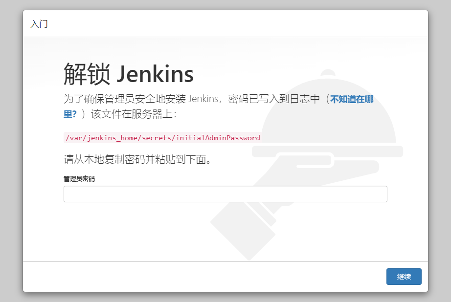
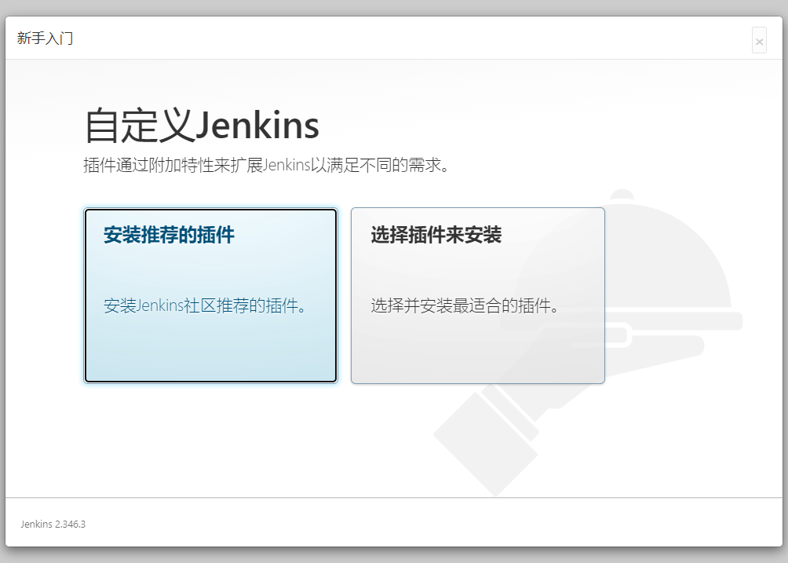
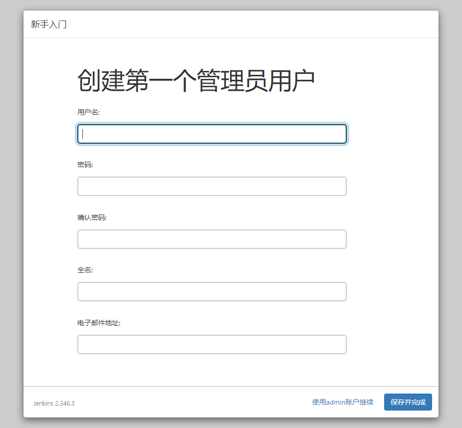
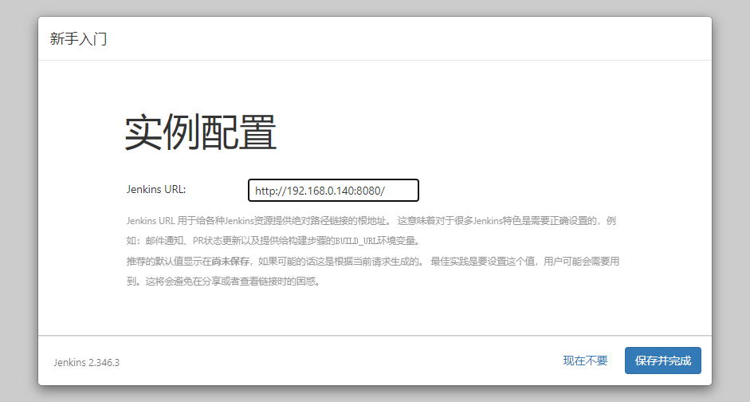
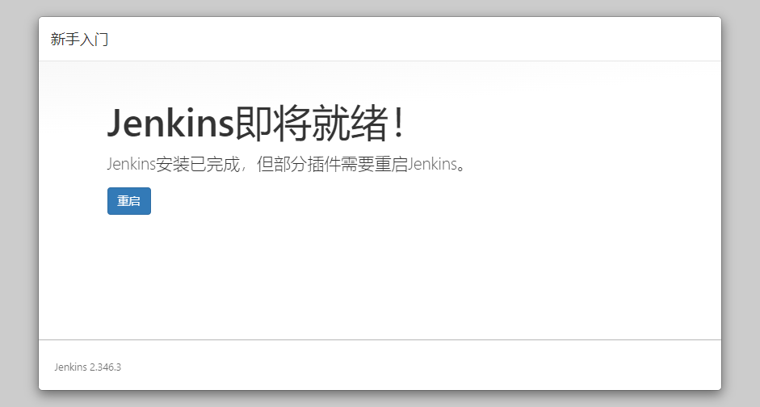
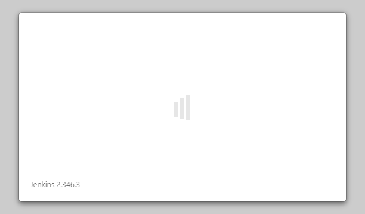
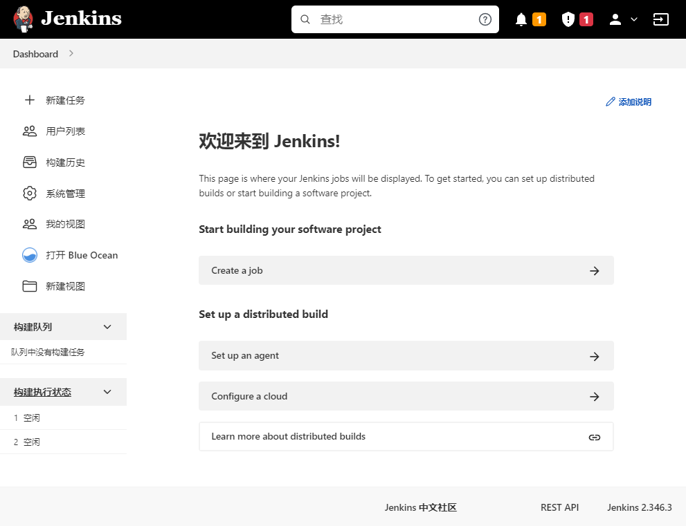
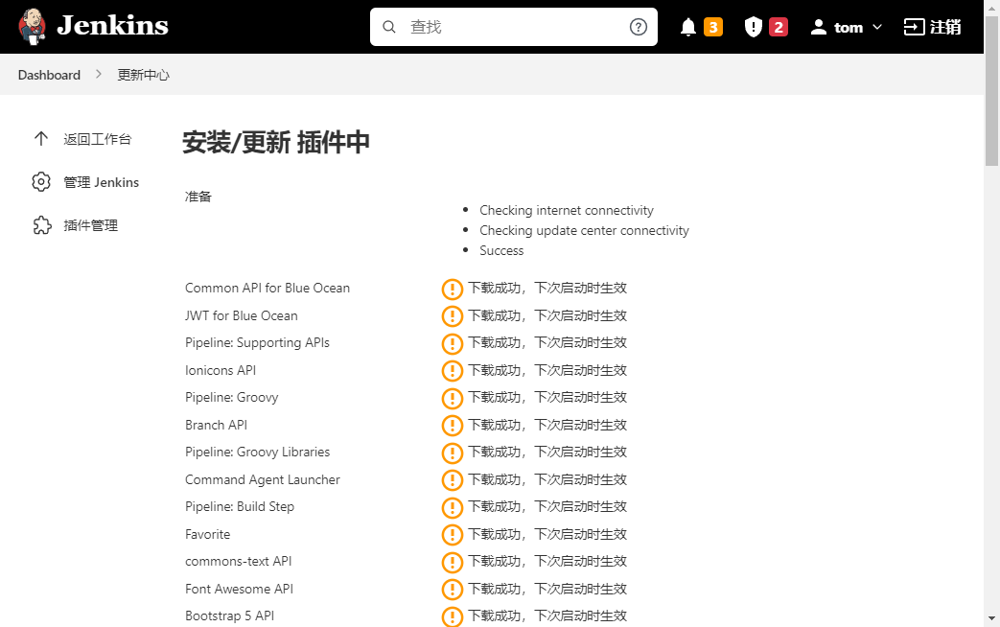

# Jenkins配置

安装完成后打开jenkins的web控制台 http://192.168.0.140:8080/



需要找到解锁密码

如果是docker中安装的, 因为已经将jenkins home 挂载到外面了, 所以只需要找到卷挂载路径即可

```shell
docker volume ls
```

```shell
root@ubuntu-dev:~/tmp# docker volume ls
DRIVER    VOLUME NAME
local     jenkins-data
```

```shell
docker volume inspect jenkins-data
```

```json
[
    {
        "CreatedAt": "2023-08-05T08:26:21Z",
        "Driver": "local",
        "Labels": null,
        "Mountpoint": "/var/lib/docker/volumes/jenkins-data/_data",
        "Name": "jenkins-data",
        "Options": null,
        "Scope": "local"
    }
]
```

```shell
cd /var/lib/docker/volumes/jenkins-data/_data
```

```shell
root@ubuntu-dev:/var/lib/docker/volumes/jenkins-data/_data# ls
config.xml                      identity.key.enc                  nodeMonitors.xml  secret.key.not-so-secret  users
copy_reference_file.log         jenkins.telemetry.Correlator.xml  nodes             secrets                   war
hudson.model.UpdateCenter.xml   jobs                              plugins           updates
hudson.plugins.git.GitTool.xml  logs                              secret.key        userContent
```

```shell
cat secrets/initialAdminPassword
```

可以看到密码:

```shell
root@ubuntu-dev:/var/lib/docker/volumes/jenkins-data/_data# cat secrets/initialAdminPassword
067cc5139e0147b08f062daf6ea9f50c
```


或者通过查看容器日志的方式查看

查看容器的名称或者id

```shell
docker ps
```

```shell
root@ubuntu-dev:~# docker ps
CONTAINER ID   IMAGE                 COMMAND                  CREATED          STATUS          PORTS                                                                                      NAMES
5c17fd2ae6e8   jenkinsci/blueocean   "/sbin/tini -- /usr/…"   41 seconds ago   Up 40 seconds   0.0.0.0:8080->8080/tcp, :::8080->8080/tcp, 0.0.0.0:50000->50000/tcp, :::50000->50000/tcp   jenkins
```

如果设置了容器的名字可以直接通过容器的名称查看日志

```shell
docker logs jenkins
```

或者

```shell
docker logs 5c17fd2ae6e8
```

日志部分如下:

```shell
Jenkins initial setup is required. An admin user has been created and a password generated.
Please use the following password to proceed to installation:

067cc5139e0147b08f062daf6ea9f50c

This may also be found at: /var/jenkins_home/secrets/initialAdminPassword

*************************************************************
```

可在日志中看到密码


在页面中输入密码即可


2 自定义jenkins

前面在页面中输入密码后页面自动跳转到这个页面



jenkins 的特点就是jenkins的插件系统, jenkins的功能扩展都是通过安装jenkins的插件进行的. 这里点击 `安装推荐的插件`

进入插件安装的页面, 此时jenkins会自动安装插件. 插件安装完成后会自动弹出账号设置页:



这个根据自身的需要设置, 作为测试,这里开启账号 tom / 123456




点击 `保存并完成`



点击 `重启`



进入Jenkins首页





http://192.168.0.140:8080/updateCenter/





2、重启jenkins
http://192.168.0.140:8080/restart


