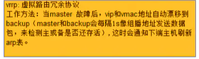
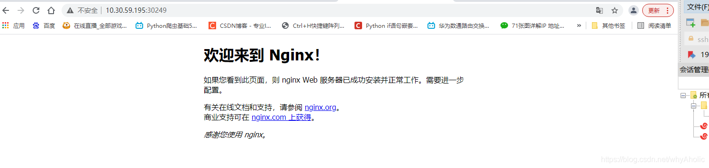

# kubeadm部署高可用k8s集群-keepalived+haproxy

## 介绍

### 高可用性：

通常来描述一个系统经过专门的设计，从而减少停工时间，而保持其服务的高度可用性。


### keepalived:

Keepalived是Linux下一个轻量级别的高可用解决方案,主要是通过虚拟路由冗余来实现高可用功能,，通过VRRP（Vritrual Router Redundancy Protocol,虚拟路由冗余协议)解决静态路由出现的单点故障问题，实现网络不间断稳定运行。


### VRRP协议与工作原理



VRRP可以将两台或者多台物理路由器设备虚拟成一个虚拟路由，这个虚拟路由器通过虚拟IP（一个或者多个)对外提供服务，而**在虚拟路由器内部十多个物理路由器协同工作，同一时间只有一台物理路由器对外提供服务，这台物理路由设备被成为：主路由器（Master角色)**，一般情况下Master是由选举算法产生，它拥有对外服务的虚拟IP，提供各种网络功能，如：ARP请求，ICMP数据转发等，而且**其它的物理路由器不拥有对外的虚拟IP，也不提供对外网络功能，仅仅接收MASTER的VRRP状态通告信息，这些路由器被统称为“BACKUP的角色”**，当主路由器失败时，处于BACKUP角色的备份路由器将重新进行选举，产生一个新的主路由器进入MASTER角色，继续提供对外服务，整个切换对用户来说是完全透明的。


每个虚拟路由器都有一个唯一的标识号，称为VRID，一个VRID与一组IP地址构成一个虚拟路由器，在VRRP协议中，所有的报文都是通过IP多播方式发送的，而在一个虚拟路由器中，只有处于Master角色的路由器会一直发送VRRP数据包，处于BACKUP角色的路由器只会接受Master角色发送过来的报文信息，用来监控Master运行状态，一般不会发生BACKUP抢占的情况，除非它的优先级更高，而当MASTER不可用时，BACKUP也就无法收到Master发过来的信息，于是就认定Master出现故障，接着多台BAKCUP就会进行选举，优先级最高的BACKUP将称为新的MASTER，这种选举角色切换非常之快，因而保证了服务的持续可用性。


haproxy
HAProxy提供高可用性、负载均衡以及基于TCP和HTTP应用的代理，支持虚拟主机，它是免费、快速并且可靠的一种解决方案。根据官方数据，其最高极限支持10G的并发。


HAProxy特别适用于那些负载特大的web站点， 这些站点通常又需要会话保持或七层处理。HAProxy运行在当前的硬件上，完全可以支持数以万计的并发连接。并且它的运行模式使得它可以很简单安全的整合进您当前的架构中， 同时可以保护你的web服务器不被暴露到网络上。


Haproxy 并不是 web 服务器,haproxy通过反向代理方式实现WEB均衡负载。但其配置简单，拥有非常不错的服务器健康检查功能还有专门的系统状态监控页面，当其代理的后端服务器出现故障,HAProxy会自动将该服务器摘除，故障恢复后再自动将该服务器加入.


## 集群部署准备

### 一、部署环境说明

操作系统 CentOS7.x-86_x64
2GB或更多RAM，2个CPU或更多CPU，硬盘30GB或更多
可以访问外网，需要拉取镜像，如果服务器不能上网，需要提前下载镜像并导入节点
禁止swap分区

| 角色 / 主机名    | ip地址       |
| ---------------- | ------------ |
| master / master1 | 10.30.59.193 |
| master / master2 | 10.30.59.194 |
| node / node1     | 10.30.59.195 |
| 虚拟ip（vip）/ - | 10.30.59.196 |


### 二、所有节点关闭防火墙和seliux

```shell
systemctl stop firewalld
systemctl disable firewalld


setenforce 0    #临时
sed -i 's/enforcing/disabled/' /etc/selinux/config   #永久
```


### 三、所有节点禁止swap分区

```shell
swapoff -a        # 临时
sed -ri 's/.*swap.*/#&/' /etc/fstab    # 永久
```


### 三、所有节点修改主机名和hosts文件

```shell
hostnamectl set-hostname <主机名>

cat >> /etc/hosts << EOF
10.30.59.196    master.k8s.io   k8s-vip
10.30.59.193    master01.k8s.io master1
10.30.59.194    master02.k8s.io master2
10.30.59.195    node01.k8s.io   node1
EOF
```


### 四、所有节点配置内核参数开启路由转发

```shell
cat << EOF | tee /etc/sysctl.d/k8s.conf
net.ipv4.ip_forward = 1
net.bridge.bridge-nf-call-ip6tables = 1
net.bridge.bridge-nf-call-iptables = 1
EOF
```

```shell
modprobe br_netfilter  #加载 br_netfilter 模块到内核
sysctl -p /etc/sysctl.d/k8s.conf   #生效配置文件
```


### 五、所有节点时间同步

```shell
yum install ntpdate -y
ntpdate time.windows.com
```


## 所有master节点部署keepalived

### 一、安装相关包和keepalived

```shell
yum install -y conntrack-tools libseccomp libtool-ltdl
yum install -y keepalived
```


### 二、配置master节点相关配置

master1节点配置

```shell
cat > /etc/keepalived/keepalived.conf <<EOF 
! Configuration File for keepalived

global_defs {         #全局定义部分
   router_id k8s      #Keepalived服务器的路由标识，自定义
}

vrrp_script check_haproxy {        #定义vrrp脚本
    script "killall -0 haproxy"    #要执行的命令
    interval 3                    #脚本调用时间
    weight -2                      #根据权重值调整vrrp实例的优先级，默认为0
    fall 10                        #需要失败多少次，vrrp才进行角色状态切换(从正常切换为fault)
    rise 2                         #需要成功多少次，vrrp才进行角色状态切换(从fault切换为正常)
}

vrrp_instance VI_1 {
    state MASTER               #指定Master或者BACKUP，必须大写
    interface ens192           #监听的实际网口
    virtual_router_id 51       #组播ID，取值在0-255之间，用来区分多个instance的VRRP组播， 同一网段中该值不能重复，并且同一个vrrp实例使用唯一的标识。
    priority 250               #权重值，数字越大优先级越高，谁的优先级高谁就是master，该项取值范围是1-255（在此范围之外会被识别成默认值100）
    advert_int 1               #发送组播包的间隔时间，默认为1秒
    authentication {  
        auth_type PASS         #认证，认证类型有PASS和AH（IPSEC）。
        auth_pass ceb1b3ec013d66163d6ab    #密码，同一vrrp实例MASTER与BACKUP 使用相同的密码才能正常通信
    }
    virtual_ipaddress {
        10.30.59.196            #vip地址
    }
    track_script {
        check_haproxy
    }

}
EOF
```


master2配置

```shell
cat > /etc/keepalived/keepalived.conf <<EOF 
! Configuration File for keepalived

global_defs {
   router_id k8s
}

vrrp_script check_haproxy {
    script "killall -0 haproxy"
    interval 3
    weight -2
    fall 10
    rise 2
}

vrrp_instance VI_1 {
    state BACKUP 
    interface ens192
    virtual_router_id 51
    priority 200
    advert_int 1
    authentication {
        auth_type PASS
        auth_pass ceb1b3ec013d66163d6ab
    }
    virtual_ipaddress {
        10.30.59.196
    }
    track_script {
        check_haproxy
    }

}
EOF
```


### 三、 启动keepalived并检查

```shell
systemctl enable keepalived
systemctl start  keepalived

[root@master1 ~]# ip a s ens192
2: ens192: <BROADCAST,MULTICAST,UP,LOWER_UP> mtu 1500 qdisc mq state UP group default qlen 1000
    link/ether 00:50:56:a0:d7:ad brd ff:ff:ff:ff:ff:ff
    inet 10.30.59.193/25 brd 10.30.59.255 scope global noprefixroute ens192
       valid_lft forever preferred_lft forever
    inet 10.30.59.196/32 scope global ens192         #看到此vip后，尝试停掉master1的keepalived服务，查看vip是否能漂移到master2，并且重新启动master1的keepalived服务，查看vip是否能正常漂移回来，能漂移回来，证明配置没有问题。
       valid_lft forever preferred_lft forever
    inet6 fe80::250:56ff:fea0:d7ad/64 scope link 
       valid_lft forever preferred_lft forever
```


## 所有master节点部署haproxy

### 一、安装haproxy

```shell
yum install -y haproxy
```

### 二、配置

两台master节点的配置均相同，配置中声明了后端代理的两个master节点服务器，指定了haproxy运行的端口为16443等，因此16443端口为集群的入口。

```shell
cat > /etc/haproxy/haproxy.cfg << EOF
#---------------------------------------------------------------------
# Global settings
#---------------------------------------------------------------------
global
    # to have these messages end up in /var/log/haproxy.log you will
    # need to:
    # 1) configure syslog to accept network log events.  This is done
    #    by adding the '-r' option to the SYSLOGD_OPTIONS in
    #    /etc/sysconfig/syslog
    # 2) configure local2 events to go to the /var/log/haproxy.log
    #   file. A line like the following can be added to
    #   /etc/sysconfig/syslog
    #
    #    local2.*                       /var/log/haproxy.log
    #
    log         127.0.0.1 local2
    
    chroot      /var/lib/haproxy
    pidfile     /var/run/haproxy.pid
    maxconn     4000
    user        haproxy
    group       haproxy
    daemon 
       
    # turn on stats unix socket
    stats socket /var/lib/haproxy/stats
#---------------------------------------------------------------------
# common defaults that all the 'listen' and 'backend' sections will
# use if not designated in their block
#---------------------------------------------------------------------  
defaults
    mode                    http
    log                     global
    option                  httplog
    option                  dontlognull
    option http-server-close
    option forwardfor       except 127.0.0.0/8
    option                  redispatch
    retries                 3
    timeout http-request    10s
    timeout queue           1m
    timeout connect         10s
    timeout client          1m
    timeout server          1m
    timeout http-keep-alive 10s
    timeout check           10s
    maxconn                 3000
#---------------------------------------------------------------------
# kubernetes apiserver frontend which proxys to the backends
#--------------------------------------------------------------------- 
frontend kubernetes-apiserver
    mode                 tcp
    bind                 *:16443
    option               tcplog
    default_backend      kubernetes-apiserver    
#---------------------------------------------------------------------
# round robin balancing between the various backends
#---------------------------------------------------------------------
backend kubernetes-apiserver
    mode        tcp
    balance     roundrobin
    server      master01.k8s.io   10.30.59.193:6443 check
    server      master02.k8s.io   10.30.59.194:6443 check
#---------------------------------------------------------------------
# collection haproxy statistics message
#---------------------------------------------------------------------
listen stats
    bind                 *:1080
    stats auth           admin:awesomePassword
    stats refresh        5s
    stats realm          HAProxy\ Statistics
    stats uri            /admin?stats
EOF
```


### 三、启动haproxy并检查

```shell
systemctl start haproxy
systemctl enable haproxy

[root@master1 ~]# netstat -lntup|grep haproxy
tcp        0      0 0.0.0.0:1080            0.0.0.0:*               LISTEN      9581/haproxy        
tcp        0      0 0.0.0.0:16443           0.0.0.0:*               LISTEN      9581/haproxy        
udp        0      0 0.0.0.0:60065           0.0.0.0:*                           9580/haproxy   

[root@master2 ~]# netstat -lntup|grep haproxy
tcp        0      0 0.0.0.0:1080            0.0.0.0:*               LISTEN      9555/haproxy        
tcp        0      0 0.0.0.0:16443           0.0.0.0:*               LISTEN      9555/haproxy        
udp        0      0 0.0.0.0:42214           0.0.0.0:*                           9554/haproxy
```


## 所有节点安装docker

### 一、安装

```shell
wget https://mirrors.aliyun.com/docker-ce/linux/centos/docker-ce.repo -O /etc/yum.repos.d/docker-ce.repo
yum -y install docker-ce-18.06.1.ce-3.el7
systemctl enable docker && systemctl start docker
docker --version
```

### 二、配置

```shell
cat > /etc/docker/daemon.json << EOF
{
  "registry-mirrors": ["https://b9pmyelo.mirror.aliyuncs.com"],
  "exec-opts": ["native.cgroupdriver=systemd"]
}
EOF
```

### 三、启动

```shell
systemctl daemon-reload
systemctl restart docker
```


## 所有节点安装kubeadm,kubelet和kubectl

### 一、添加阿里云k8s的yum源

```shell
cat > /etc/yum.repos.d/kubernetes.repo << EOF
[kubernetes]
name=Kubernetes
baseurl=https://mirrors.aliyun.com/kubernetes/yum/repos/kubernetes-el7-x86_64
enabled=1
gpgcheck=0
repo_gpgcheck=0
gpgkey=https://mirrors.aliyun.com/kubernetes/yum/doc/yum-key.gpg https://mirrors.aliyun.com/kubernetes/yum/doc/rpm-package-key.gpg
EOF
```


### 二、安装

```shell
yum install -y kubelet-1.16.3 kubeadm-1.16.3 kubectl-1.16.3
```


### 三、启动

```shell
systemctl enable kubelet       #设置开机自启，不启动。
```


## 部署Kubernetes Master

### 一、创建kubeadm配置文件

在具有vip的master上操作，这里为master1

```shell
[root@master1 ~]#mkdir -p /usr/local/kubernetes/manifests 
[root@master1 ~]#cd /usr/local/kubernetes/manifests/
[root@master1 manifests]#vi kubeadm-config.yaml
apiServer:
  certSANs:
    - master1
    - master2
    - master.k8s.io
    - 10.30.59.196
    - 10.30.59.193
    - 10.30.59.194
    - 127.0.0.1
  extraArgs:
    authorization-mode: Node,RBAC
  timeoutForControlPlane: 4m0s
apiVersion: kubeadm.k8s.io/v1beta1
certificatesDir: /etc/kubernetes/pki
clusterName: kubernetes
controlPlaneEndpoint: "master.k8s.io:16443"
controllerManager: {}
dns: 
  type: CoreDNS
etcd:
  local:    
    dataDir: /var/lib/etcd
imageRepository: registry.aliyuncs.com/google_containers
kind: ClusterConfiguration
kubernetesVersion: v1.16.3
networking: 
  dnsDomain: cluster.local  
  podSubnet: 10.244.0.0/16
  serviceSubnet: 10.1.0.0/16
scheduler: {}
```


### 二、初始化集群

```shell
[root@master1 ~]# kubeadm init --config /usr/local/kubernetes/manifests/kubeadm-config.yaml --ignore-preflight-errors=all
[init] Using Kubernetes version: v1.16.3
[preflight] Running pre-flight checks
[preflight] Pulling images required for setting up a Kubernetes cluster
[preflight] This might take a minute or two, depending on the speed of your internet connection
[preflight] You can also perform this action in beforehand using 'kubeadm config images pull'
[kubelet-start] Writing kubelet environment file with flags to file "/var/lib/kubelet/kubeadm-flags.env"
[kubelet-start] Writing kubelet configuration to file "/var/lib/kubelet/config.yaml"
[kubelet-start] Activating the kubelet service
[certs] Using certificateDir folder "/etc/kubernetes/pki"
[certs] Generating "ca" certificate and key
[certs] Generating "apiserver" certificate and key
[certs] apiserver serving cert is signed for DNS names [master1 kubernetes kubernetes.default kubernetes.default.svc kubernetes.default.svc.cluster.local master.k8s.io master1 master2 master.k8s.io] and IPs [10.1.0.1 10.30.59.193 10.30.59.196 10.30.59.193 10.30.59.194 127.0.0.1]
[certs] Generating "apiserver-kubelet-client" certificate and key
[certs] Generating "front-proxy-ca" certificate and key
[certs] Generating "front-proxy-client" certificate and key
[certs] Generating "etcd/ca" certificate and key
[certs] Generating "etcd/server" certificate and key
[certs] etcd/server serving cert is signed for DNS names [master1 localhost] and IPs [10.30.59.193 127.0.0.1 ::1]
[certs] Generating "etcd/peer" certificate and key
[certs] etcd/peer serving cert is signed for DNS names [master1 localhost] and IPs [10.30.59.193 127.0.0.1 ::1]
[certs] Generating "etcd/healthcheck-client" certificate and key
[certs] Generating "apiserver-etcd-client" certificate and key
[certs] Generating "sa" key and public key
[kubeconfig] Using kubeconfig folder "/etc/kubernetes"
[endpoint] WARNING: port specified in controlPlaneEndpoint overrides bindPort in the controlplane address
[kubeconfig] Writing "admin.conf" kubeconfig file
[endpoint] WARNING: port specified in controlPlaneEndpoint overrides bindPort in the controlplane address
[kubeconfig] Writing "kubelet.conf" kubeconfig file
[endpoint] WARNING: port specified in controlPlaneEndpoint overrides bindPort in the controlplane address
[kubeconfig] Writing "controller-manager.conf" kubeconfig file
[endpoint] WARNING: port specified in controlPlaneEndpoint overrides bindPort in the controlplane address
[kubeconfig] Writing "scheduler.conf" kubeconfig file
[control-plane] Using manifest folder "/etc/kubernetes/manifests"
[control-plane] Creating static Pod manifest for "kube-apiserver"
[control-plane] Creating static Pod manifest for "kube-controller-manager"
[control-plane] Creating static Pod manifest for "kube-scheduler"
[etcd] Creating static Pod manifest for local etcd in "/etc/kubernetes/manifests"
[wait-control-plane] Waiting for the kubelet to boot up the control plane as static Pods from directory "/etc/kubernetes/manifests". This can take up to 4m0s
[apiclient] All control plane components are healthy after 35.511922 seconds
[upload-config] Storing the configuration used in ConfigMap "kubeadm-config" in the "kube-system" Namespace
[kubelet] Creating a ConfigMap "kubelet-config-1.16" in namespace kube-system with the configuration for the kubelets in the cluster
[upload-certs] Skipping phase. Please see --upload-certs
[mark-control-plane] Marking the node master1 as control-plane by adding the label "node-role.kubernetes.io/master=''"
[mark-control-plane] Marking the node master1 as control-plane by adding the taints [node-role.kubernetes.io/master:NoSchedule]
[bootstrap-token] Using token: 90ja1s.sl3ycgtv08gc53xn
[bootstrap-token] Configuring bootstrap tokens, cluster-info ConfigMap, RBAC Roles
[bootstrap-token] configured RBAC rules to allow Node Bootstrap tokens to post CSRs in order for nodes to get long term certificate credentials
[bootstrap-token] configured RBAC rules to allow the csrapprover controller automatically approve CSRs from a Node Bootstrap Token
[bootstrap-token] configured RBAC rules to allow certificate rotation for all node client certificates in the cluster
[bootstrap-token] Creating the "cluster-info" ConfigMap in the "kube-public" namespace
[addons] Applied essential addon: CoreDNS
[endpoint] WARNING: port specified in controlPlaneEndpoint overrides bindPort in the controlplane address
[addons] Applied essential addon: kube-proxy

Your Kubernetes control-plane has initialized successfully!

To start using your cluster, you need to run the following as a regular user:

  mkdir -p $HOME/.kube
  sudo cp -i /etc/kubernetes/admin.conf $HOME/.kube/config
  sudo chown $(id -u):$(id -g) $HOME/.kube/config

You should now deploy a pod network to the cluster.
Run "kubectl apply -f [podnetwork].yaml" with one of the options listed at:
  https://kubernetes.io/docs/concepts/cluster-administration/addons/

You can now join any number of control-plane nodes by copying certificate authorities 
and service account keys on each node and then running the following as root:

  kubeadm join master.k8s.io:16443 --token 90ja1s.sl3ycgtv08gc53xn \
    --discovery-token-ca-cert-hash sha256:b0be10e6a98c3976a7f5671110c4aece3011f1c49b893a913f422cfcee250f28 \
    --control-plane 	  

Then you can join any number of worker nodes by running the following on each as root:

kubeadm join master.k8s.io:16443 --token 90ja1s.sl3ycgtv08gc53xn \
    --discovery-token-ca-cert-hash sha256:b0be10e6a98c3976a7f5671110c4aece3011f1c49b893a913f422cfcee250f28 
```


### 三、配置环境变量，使用kubectl工具

```shell
[root@master1 ~]# mkdir -p $HOME/.kube
[root@master1 ~]# sudo cp -i /etc/kubernetes/admin.conf $HOME/.kube/config
[root@master1 ~]# sudo chown $(id -u):$(id -g) $HOME/.kube/config
```


### 四、查看集群状态

```shell
[root@master1 ~]# kubectl get cs
NAME                 AGE
scheduler            <unknown>
controller-manager   <unknown>
etcd-0               <unknown>
[root@master1 ~]# kubectl get pods -n kube-system
NAME                              READY   STATUS    RESTARTS   AGE
coredns-58cc8c89f4-24d24          0/1     Pending   0          5m12s
coredns-58cc8c89f4-sjx64          0/1     Pending   0          5m12s
etcd-master1                      1/1     Running   0          4m46s
kube-apiserver-master1            1/1     Running   0          4m45s
kube-controller-manager-master1   1/1     Running   1          5m46s
kube-proxy-x7vgb                  1/1     Running   0          5m12s
kube-scheduler-master1            1/1     Running   0          4m43s
```

kubectl get cs显示`<unknown>`是一个1.16版本已知的bug。


### 五、安装集群网络

（一）从官方地址获取到flannel的yaml

```shell
[root@master1 manifests]# mkdir flannel
[root@master1 manifests]# cd flannel/
[root@master1 flannel]# wget -c https://raw.githubusercontent.com/coreos/flannel/master/Documentation/kube-flannel.yml
```


（二）安装

```shell
[root@master1 flannel]# kubectl apply -f kube-flannel.yml 
podsecuritypolicy.policy/psp.flannel.unprivileged created
clusterrole.rbac.authorization.k8s.io/flannel created
clusterrolebinding.rbac.authorization.k8s.io/flannel created
serviceaccount/flannel created
configmap/kube-flannel-cfg created
daemonset.apps/kube-flannel-ds created
```

（三）检查

```shell
[root@master1 flannel]# kubectl get pods -n kube-system
NAME                              READY   STATUS    RESTARTS   AGE
coredns-58cc8c89f4-24d24          1/1     Running   0          10m
coredns-58cc8c89f4-sjx64          1/1     Running   0          10m
etcd-master1                      1/1     Running   0          9m38s
kube-apiserver-master1            1/1     Running   0          9m37s
kube-controller-manager-master1   1/1     Running   1          10m
kube-flannel-ds-lrtzc             1/1     Running   0          52s
kube-proxy-x7vgb                  1/1     Running   0          10m
kube-scheduler-master1            1/1     Running   0          9m35s
```


## master2节点加入集群

### 一、复制密钥及相关文件

```shell
ssh root@10.30.59.194 mkdir -p /etc/kubernetes/pki/etcd
scp /etc/kubernetes/admin.conf root@10.30.59.194:/etc/kubernetes
scp /etc/kubernetes/pki/{ca.*,sa.*,front-proxy-ca.*} root@10.30.59.194:/etc/kubernetes/pki
scp /etc/kubernetes/pki/etcd/ca.* root@10.30.59.194:/etc/kubernetes/pki/etcd
```


### 二、 master2加入集群

问题
解决：执行加入集群的命令，报错拒绝连接到vip，请在master1节点重启keepalived服务

```shell
kubeadm join master.k8s.io:16443 --token 90ja1s.sl3ycgtv08gc53xn \
    --discovery-token-ca-cert-hash sha256:b0be10e6a98c3976a7f5671110c4aece3011f1c49b893a913f422cfcee250f28 \
    --control-plane 	
```

如果找不到token，执行以下命令

```shell
kubeadm token create --print-join-command
```

在master2上执行join命令，需要带上参数–control-plane表示把master控制节点加入集群

```shell
[root@master2 ~]#  kubeadm join master.k8s.io:16443 --token 90ja1s.sl3ycgtv08gc53xn     --discovery-token-ca-cert-hash sha256:b0be10e6a98c3976a7f5671110c4aece3011f1c49b893a913f422cfcee250f28     --control-plane 
[preflight] Running pre-flight checks
[preflight] Reading configuration from the cluster...
[preflight] FYI: You can look at this config file with 'kubectl -n kube-system get cm kubeadm-config -oyaml'
[preflight] Running pre-flight checks before initializing the new control plane instance
[preflight] Pulling images required for setting up a Kubernetes cluster
[preflight] This might take a minute or two, depending on the speed of your internet connection
[preflight] You can also perform this action in beforehand using 'kubeadm config images pull'
[certs] Using certificateDir folder "/etc/kubernetes/pki"
[certs] Generating "etcd/server" certificate and key
[certs] etcd/server serving cert is signed for DNS names [master2 localhost] and IPs [10.30.59.194 127.0.0.1 ::1]
[certs] Generating "etcd/peer" certificate and key
[certs] etcd/peer serving cert is signed for DNS names [master2 localhost] and IPs [10.30.59.194 127.0.0.1 ::1]
[certs] Generating "etcd/healthcheck-client" certificate and key
[certs] Generating "apiserver-etcd-client" certificate and key
[certs] Generating "front-proxy-client" certificate and key
[certs] Generating "apiserver-kubelet-client" certificate and key
[certs] Generating "apiserver" certificate and key
[certs] apiserver serving cert is signed for DNS names [master2 kubernetes kubernetes.default kubernetes.default.svc kubernetes.default.svc.cluster.local master.k8s.io master1 master2 master.k8s.io] and IPs [10.1.0.1 10.30.59.194 10.30.59.196 10.30.59.193 10.30.59.194 127.0.0.1]
[certs] Valid certificates and keys now exist in "/etc/kubernetes/pki"
[certs] Using the existing "sa" key
[kubeconfig] Generating kubeconfig files
[kubeconfig] Using kubeconfig folder "/etc/kubernetes"
[endpoint] WARNING: port specified in controlPlaneEndpoint overrides bindPort in the controlplane address
[kubeconfig] Using existing kubeconfig file: "/etc/kubernetes/admin.conf"
[kubeconfig] Writing "controller-manager.conf" kubeconfig file
[kubeconfig] Writing "scheduler.conf" kubeconfig file
[control-plane] Using manifest folder "/etc/kubernetes/manifests"
[control-plane] Creating static Pod manifest for "kube-apiserver"
[control-plane] Creating static Pod manifest for "kube-controller-manager"
[control-plane] Creating static Pod manifest for "kube-scheduler"
[check-etcd] Checking that the etcd cluster is healthy
[kubelet-start] Downloading configuration for the kubelet from the "kubelet-config-1.16" ConfigMap in the kube-system namespace
[kubelet-start] Writing kubelet configuration to file "/var/lib/kubelet/config.yaml"
[kubelet-start] Writing kubelet environment file with flags to file "/var/lib/kubelet/kubeadm-flags.env"
[kubelet-start] Activating the kubelet service
[kubelet-start] Waiting for the kubelet to perform the TLS Bootstrap...
[etcd] Announced new etcd member joining to the existing etcd cluster
[etcd] Creating static Pod manifest for "etcd"
[etcd] Waiting for the new etcd member to join the cluster. This can take up to 40s
{"level":"warn","ts":"2021-06-17T20:45:28.699+0800","caller":"clientv3/retry_interceptor.go:61","msg":"retrying of unary invoker failed","target":"passthrough:///https://10.30.59.194:2379","attempt":0,"error":"rpc error: code = DeadlineExceeded desc = context deadline exceeded"}
[upload-config] Storing the configuration used in ConfigMap "kubeadm-config" in the "kube-system" Namespace
[mark-control-plane] Marking the node master2 as control-plane by adding the label "node-role.kubernetes.io/master=''"
[mark-control-plane] Marking the node master2 as control-plane by adding the taints [node-role.kubernetes.io/master:NoSchedule]

This node has joined the cluster and a new control plane instance was created:

* Certificate signing request was sent to apiserver and approval was received.
* The Kubelet was informed of the new secure connection details.
* Control plane (master) label and taint were applied to the new node.
* The Kubernetes control plane instances scaled up.
* A new etcd member was added to the local/stacked etcd cluster.

To start administering your cluster from this node, you need to run the following as a regular user:

	mkdir -p $HOME/.kube
	sudo cp -i /etc/kubernetes/admin.conf $HOME/.kube/config
	sudo chown $(id -u):$(id -g) $HOME/.kube/config

Run 'kubectl get nodes' to see this node join the cluster.
```


### 三、配置环境变量，使用kubectl工具

```shell
[root@master2 ~]# mkdir -p $HOME/.kube
[root@master2 ~]# sudo cp -i /etc/kubernetes/admin.conf $HOME/.kube/config
[root@master2 ~]# sudo chown $(id -u):$(id -g) $HOME/.kube/config
```


### 四、检查

```shell
[root@master1 ~]# kubectl get nodes
NAME      STATUS   ROLES    AGE     VERSION
master1   Ready    master   24m     v1.16.3
master2   Ready    master   3m17s   v1.16.3

[root@master2 ~]# kubectl get nodes
NAME      STATUS   ROLES    AGE     VERSION
master1   Ready    master   23m     v1.16.3
master2   Ready    master   2m16s   v1.16.3
```


## node加入集群

```shell
[root@node1 ~]# kubeadm join master.k8s.io:16443 --token 90ja1s.sl3ycgtv08gc53xn     --discovery-token-ca-cert-hash sha256:b0be10e6a98c3976a7f5671110c4aece3011f1c49b893a913f422cfcee250f28 
[preflight] Running pre-flight checks
[preflight] Reading configuration from the cluster...
[preflight] FYI: You can look at this config file with 'kubectl -n kube-system get cm kubeadm-config -oyaml'
[kubelet-start] Downloading configuration for the kubelet from the "kubelet-config-1.16" ConfigMap in the kube-system namespace
[kubelet-start] Writing kubelet configuration to file "/var/lib/kubelet/config.yaml"
[kubelet-start] Writing kubelet environment file with flags to file "/var/lib/kubelet/kubeadm-flags.env"
[kubelet-start] Activating the kubelet service
[kubelet-start] Waiting for the kubelet to perform the TLS Bootstrap...

This node has joined the cluster:
* Certificate signing request was sent to apiserver and a response was received.
* The Kubelet was informed of the new secure connection details.

Run 'kubectl get nodes' on the control-plane to see this node join the cluster.
```

### 问题

```shell
[root@master1 ~]# kubeadm init --config /usr/local/kubernetes/manifests/kubeadm-config.yaml 
[init] Using Kubernetes version: v1.16.3
[preflight] Running pre-flight checks


执行加入的命令，但是卡在【peflight】，请再master1节点重启keepalived服务。
```

### 检查

```shell
[root@master1 ~]# kubectl get nodes
NAME      STATUS   ROLES    AGE     VERSION
master1   Ready    master   28m     v1.16.3
master2   Ready    master   6m46s   v1.16.3
node1     Ready    <none>   114s    v1.16.3
```

### 测试集群

```shell
[root@master1 ~]# kubectl create deployment nginx --image=nginx
deployment.apps/nginx created
[root@master1 ~]# kubectl expose deployment nginx --port=80 --type=NodePort
service/nginx exposed
[root@master1 ~]# kubectl get pod,svc
NAME                         READY   STATUS              RESTARTS   AGE
pod/nginx-86c57db685-4xc7g   0/1     ContainerCreating   0          12s

NAME                 TYPE        CLUSTER-IP     EXTERNAL-IP   PORT(S)        AGE
service/kubernetes   ClusterIP   10.1.0.1       <none>        443/TCP        11h
service/nginx        NodePort    10.1.231.125   <none>        80:30249/TCP   6s
```



