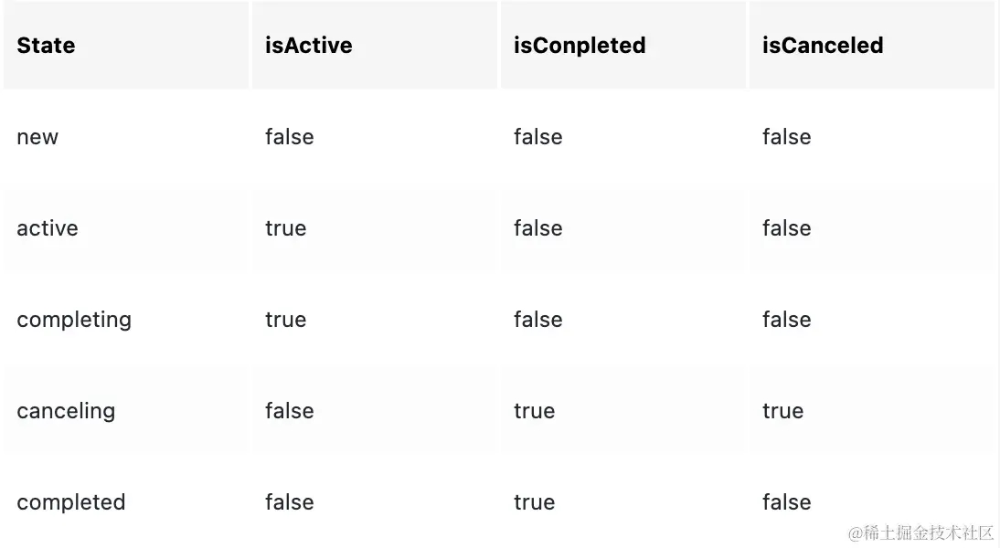

# Android协程代替Handler使用示例详解

 更新时间：2024年01月31日 09:37:22  作者：xiangzhihong  

这篇文章主要为大家介绍了Android 协程代替Handler使用示例详解,有需要的朋友可以借鉴参考下,希望能够有所帮助,祝大家多多进步,早日升职加薪

**−**

##### 目录

- [引言](https://www.jb51.net/program/314725gvt.htm#_label0)
- [什么是协程](https://www.jb51.net/program/314725gvt.htm#_label1)
- [使用协程代替 Handler](https://www.jb51.net/program/314725gvt.htm#_label2)
- [在Android中使用协程](https://www.jb51.net/program/314725gvt.htm#_label3)
- [运行协程](https://www.jb51.net/program/314725gvt.htm#_label4)


## 引言

在 Android 开发中，我们经常需要处理异步任务，例如网络请求、数据库访问、耗时计算等等。为了在处理异步任务时能够方便地更新 UI，Android 提供了 Handler 类。然而，在使用 Handler 时，我们需要处理一些繁琐的问题，例如线程间通信和内存泄漏。为了简化这些问题，Google 在 Android 3.0 引入了 AsyncTask 类，但它仍然有一些限制。最近，Kotlin 官方推出了 Kotlin 协程，它是一种轻量级的线程框架，可以在 Android 开发中替代 Handler 和 AsyncTask，并提供更加简洁和强大的异步编程体验。


## 什么是协程

协程是一种轻量级的线程框架，它允许开发者以顺序的方式编写异步代码，而无需关心线程的管理和同步问题。协程的概念最早出现在 Erlang 语言中，后来被其他编程语言引入。Kotlin 协程是基于 JVM 的一种协程实现，它允许开发者以同步的方式编写异步代码，并且可以与现有的异步框架（例如 Retrofit、Room 等）很好地集成。

使用协程的好处主要有以下几点：

- 简化异步代码：协程允许我们以顺序的方式编写异步代码，而不是嵌套的回调函数或者复杂的线程管理代码。
- 避免回调地狱：使用协程，我们可以将异步任务的逻辑写在一个连续的代码块中，而不是多个回调函数中，提高代码的可读性和可维护性。
- 更好的错误处理：协程提供了异常处理机制，可以很方便地捕获和处理异步任务中的异常。
- 更好的性能：协程使用非阻塞的方式执行异步任务，可以更好地利用系统资源，提高应用的性能。
- 更好的 UI 交互：协程允许我们在主线程中执行异步任务，从而方便地更新 UI。


## 使用协程代替 Handler

在 Android 中，我们经常需要在子线程中执行一些耗时的任务，然后在主线程中更新 UI。使用 Handler，我们可以很方便地实现这个功能。然而，使用 Handler 时，我们需要处理一些繁琐的问题，例如线程间通信和内存泄漏。现在，我们可以使用协程来简化这些问题。

首先，我们需要添加协程库的依赖。在项目的 build.gradle 文件中，加入以下代码：

```
dependencies {
    implementation 'org.jetbrains.kotlinx:kotlinx-coroutines-android:1.6.1'
}
```

接下来，我们可以在任何一个函数中创建一个协程。在 Kotlin 中，我们使用 suspend 修饰符来声明一个挂起函数，它可以在协程中被调用。在协程中，我们可以使用 launch 函数来启动一个新的协程，并在其中执行一些异步任务。

下面是官方一个使用协程替代 Handler 的示例代码：

```
fun main(args: Array<String>) {
    launch(CommonPool) {
        delay(1000L) 
        println("World!") 
    }
    println("Hello,")
    Thread.sleep(2000L)
}
/* 
运行结果: ("Hello,"会立即被打印, 1000毫秒之后, "World!"会被打印)
Hello, 
World!
*/
```

此处解释一下delay方法:

在协程里delay方法作用等同于线程里的sleep, 都是休息一段时间, 但不同的是delay不会阻塞当前线程, 而像是设置了一个闹钟, 在闹钟未响之前, 运行该协程的线程可以被安排做了别的事情, 当闹钟响起时, 协程就会恢复运行.


## 在Android中使用协程

在Android中使用协程需要引入如下两个库：

```
implementation "org.jetbrains.kotlinx:kotlinx-coroutines-core:1.6.1"
implementation "org.jetbrains.kotlinx:kotlinx-coroutines-android:1.6.1"
```

官方建议有生命周期的类继承 CoroutineSocpe，这样就能让全部协程跟着生命周期结束。

```
MainActivity : AppCompatActivity(), CoroutineScope by MainScope(){
    override fun onDestroy(){
        super.onDestory()
        cancel()
     }
}
```

在村庄UI逻辑类中使用：

```
class MainActivityFacede : CoroutineScope {
    private val job = Job()
    override val coroutineContext: CoroutineContext
        get() = Dispatchers.Main + job
    fun destroy() {
        job.cancel()
    }
}
```


## 运行协程

Android有两种运行协程，分别是launch与async。下面我们来说一下它们的一些区别：

- aunch 没有返回值，或者说返回只是 job ,能够知道任务的状态，却不能携带返回结果。
- async 有返回值，也就是返回的是 Deferred ,它是继承的 job ，所有job有的，它都有，还具备了job没有的携带数据回来的能力。
- launch 可以用来运行不需要操作结果的协程（如文件删除，创建等）
- async 可以用来运行异步耗时任务并且需要返回值的任务（网络请求，数据库操作，文件读写等）。

以下是Job和Deferred的生命周期说明。



以下是一个使用示例：

```
private suspend fun getWebTime(): Long {
    var result = RequeastTest.getInstance().start()
    val name = Thread.currentThread().name
    if (!coroutines.contains(name)) {
        coroutines.add(name)
    }
    return result
}
launch() {
    //do sth
    var time = withContext(Dispather.IO){
        getWebTime()
    }
    //update UI
}
launch {
    var deferred = async(Dispather.IO) {
        //发起网络请求..
        getWebTime()
    }
    //do sth ...
    var value = deferred.await()
    //do sth...
}
```

可以看到，我们使用了两个新的东西Dispather和suspend。

Dispther可以理解为是一个协程调度器，用来调度协程跑到哪个线程中。Dispather 可以在 launch、async 等启动协程时，指定在哪个线程里面运行，也可以在协程中，使用 withContext(Dispather.) 来切换线程,使用 withContext 切换线程时，有返回值。

Suspend是协程里面唯一一个修饰符，用来修改函数的，表明函数是一个挂起函数，协程编译器会在编译期间进行CPS变换，去做一些不可描述的事情。用suspend修饰的函数，只能在协程体和同样使用 suspend 修饰的函数中调用。

另外，我们还可以同时进行多个网络请求，并在全部请求完毕之后进行数据整理，统一渲染界面，如下所示。

```
launch {
    var userInfoDeferred = async {
        //获取用户基本信息
        getUserInfo(aid)
    }
    var userTeamsDeferred = async{
        //获取用户团队..
        getUserTeams(aid)
    }
    var userOrgsDeferred =  async {
        //获取用户组织机构
        getUserOrgs(aid)
    }
    var userInfo = userInfoDeferred.await()
    var userTeams = userTeamsDeferred.await()
    var userOrgsDeferred = userOrgsDeferred.await()
    //渲染UI 
}
```

事实上，对于协程的简单理解与使用，协程到底是什么, 很难给出具体的定义, 就算能给出具体定义, 也会非常抽象难以理解的。另一方面, 协程可以说是编译器的能力, 因为协程并不需要操作系统和硬件的支持(线程需要), 是编译器为了让开发者写代码更简单方便, 提供了一些关键字, 并在内部自动生成了一些支持型代码。

总的来说，协程就是一种轻量级的线程框架，它允许开发者以顺序的方式编写异步代码。并且，相比传统的 Handler 和 AsyncTask编程，协程能够更好的利用系统资源，提高代码的可读性和可维护性。