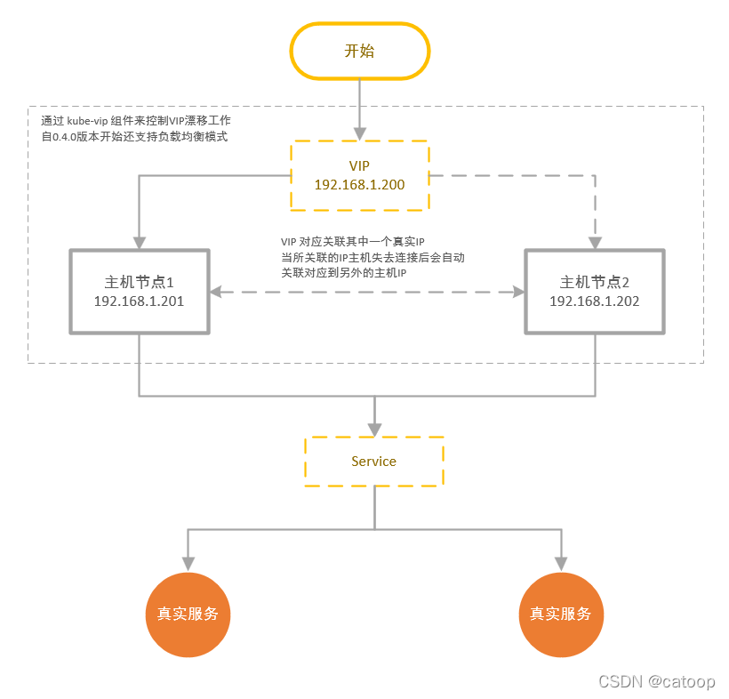

# k8s 之 kube-vip

如题，vip 顾名思义 虚拟 IP，从应用场景上来讲，kube-vip 实现的最终结果就是我们常说的 Keepalived 高可用方案。



kube-vip 部署
一、参数配置

```bash
export VIP=192.168.1.213
export INTERFACE=lo
export KVVERSION=v0.4.0
```

VIP是虚拟IP地址，和主机同一个网段，且未被占用
INTERFACE是主机的网络接口名称，例如 lo、ens192、eth0 等
KVVERSION是你需要部署的kube-vip的版本号，可以到github查看最新版的版本号，例如v0.4.0
二、生成yaml清单文件
1.创建命令快捷别名

以下两种方式二选一执行

```bash
# 1.containerd 方式
alias kube-vip="ctr run --rm --net-host ghcr.io/kube-vip/kube-vip:$KVVERSION vip /kube-vip"
```

```bash
# 2.docker 方式
alias kube-vip="docker run --network host --rm ghcr.io/kube-vip/kube-vip:$KVVERSION"
```


2.生成yaml清单文件

```yaml
mkdir -p /opt/soft/kube-vip && cd $_
kube-vip manifest daemonset \
    --interface $INTERFACE \
    --vip $VIP \
    --controlplane \
    --services \
    --inCluster \
    --taint \
    --bgp \
    --localAS 65000 \
    --bgppeers 192.168.1.211:65000::false,192.168.1.212:65000::false | tee kube-vip-ds.yaml
```

下载rbac.yaml

```bash
curl -o rbac.yaml https://kube-vip.io/manifests/rbac.yaml
```

其中 211、212 为实际主机IP，上面的 VIP=213 变量为虚拟机IP。


3.修改生成的清单文件

a) routeID在BGP广播的所有主机中，每个都应该是唯一的，
我们通过修改生成的kube-vip.yaml文件添加参数自动获取主机网络接口的IP地址来作为这个唯一的ID

b) 添加参数，其值为主机网络接口名称，可以查看的命令很多，例如：ip a

```
- name: bgp_routerinterface
  value: "ens192"
```

官方说这个不配置也支持自动识别网络接口了，我不确定，有兴趣的可以不配置验证一下，这里我还是手工设定了。


c) 修改yaml文件中的image为自己的私服地址，以我的私服为例：

```bash
image: harbor.yourdomain.com/dockerhub_proxy/plndr/kube-vip:v0.4.0
```

注：因为我们是使用DaemonSet方式部署的Pod，所以可以这样做。


三、应用发布yaml清单文件
以下两种方式选择一种即可

1.浏览器登录rancher后，进入local集群后，通过导入yaml文件的方式发布这2个配置文件

2.或者在k3s-rancher主机上执行命令

```bash
kubectl apply -f rbac.yaml
kubectl apply -f kube-vip-ds.yaml
```


官网资料
https://kube-vip.io/
https://kube-vip.io/install_daemonset/
https://github.com/kube-vip/kube-vip
https://kube-vip.io/architecture/