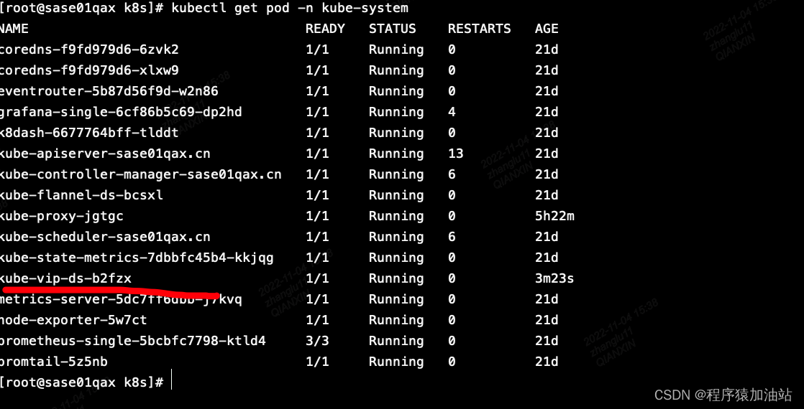

# K8S LoadBalancer kube-vip 部署

kube-vip 端口
kube-vip 端口：6443
服务 端口：443，8443
部署须知：
如果没有云厂商LB 服务，且想实现vip 访问，基于k8s LoadBalancer 的方式，可以使用kube-vip 来实现
查看环境是否安装了kube-vip：



kube-vip部署
kube-vip 介绍
vip 顾名思义 虚拟 IP，从应用场景上来讲，kube-vip 实现的最终结果就是我们常说的 Keepalived 高可用方案。


部署：
本次部署kube-vip 是通过DaemoneSet 的 ARP 方式来部署。

方式一：通过现有yaml 文件部署
kube-vip-ds.yaml

```yaml
apiVersion: apps/v1
kind: DaemonSet
metadata:
  creationTimestamp: null
  labels:
    app.kubernetes.io/name: kube-vip-ds
    app.kubernetes.io/version: v0.5.0
  name: kube-vip-ds
  namespace: kube-system
spec:
  selector:
    matchLabels:
      app.kubernetes.io/name: kube-vip-ds
  template:
    metadata:
      creationTimestamp: null
      labels:
        app.kubernetes.io/name: kube-vip-ds
        app.kubernetes.io/version: v0.5.0
    spec:
      affinity:
        nodeAffinity:
          requiredDuringSchedulingIgnoredDuringExecution:
            nodeSelectorTerms:
            - matchExpressions:
              - key: node-role.kubernetes.io/master
                operator: Exists
            - matchExpressions:
              - key: node-role.kubernetes.io/control-plane
                operator: Exists
      containers:
      - args:
        - manager
        env:
        - name: vip_arp
          value: "true"
        - name: port
          value: "6443"
        - name: vip_interface
          value: eth0  # 主机的网卡
        - name: vip_cidr
          value: "32"
        - name: cp_enable
          value: "true"
        - name: cp_namespace
          value: kube-system
        - name: vip_ddns
          value: "false"
        - name: svc_enable
          value: "true"
        - name: vip_leaderelection
          value: "true"
        - name: vip_leaseduration
          value: "5"
        - name: vip_renewdeadline
          value: "3"
        - name: vip_retryperiod
          value: "1"
        - name: prometheus_server
          value: :2112
        - name: address
          value: "10.90.41.20" #设置vip
        image: ghcr.io/kube-vip/kube-vip:v0.5.0
        imagePullPolicy: IfNotPresent
        name: kube-vip
        resources: {}
        securityContext:
          capabilities:
            add:
            - NET_ADMIN
            - NET_RAW
      hostNetwork: true
      serviceAccountName: kube-vip
      tolerations:
      - effect: NoSchedule
        operator: Exists
      - effect: NoExecute
        operator: Exists
  updateStrategy: {}
status:
  currentNumberScheduled: 0
  desiredNumberScheduled: 0
  numberMisscheduled: 0
  numberReady: 0
```


rbac.yaml

```bash
piVersion: v1
kind: ServiceAccount
metadata:
  name: kube-vip
  namespace: kube-system
---
apiVersion: rbac.authorization.k8s.io/v1
kind: ClusterRole
metadata:
  annotations:
    rbac.authorization.kubernetes.io/autoupdate: "true"
  name: system:kube-vip-role
rules:
  - apiGroups: [""]
    resources: ["services", "services/status", "nodes", "endpoints"]
    verbs: ["list","get","watch", "update"]
  - apiGroups: ["coordination.k8s.io"]
    resources: ["leases"]
    verbs: ["list", "get", "watch", "update", "create"]
---
kind: ClusterRoleBinding
apiVersion: rbac.authorization.k8s.io/v1
metadata:
  name: system:kube-vip-binding
roleRef:
  apiGroup: rbac.authorization.k8s.io
  kind: ClusterRole
  name: system:kube-vip-role
subjects:
- kind: ServiceAccount
  name: kube-vip
  namespace: kube-system
```

执行命令安装：

```bash
kubectl apply -f rbac.yaml
kubectl apply -f kube-vip-ds.yaml
```

#方式二：通过运行kube-vip命令生成yaml 文件部署
1、创建命令快捷别名：

```bash
alias kube-vip="docker run --network host --rm ghcr.io/kube-vip/kube-vip:$KVVERSION"
```

2、生成yaml清单文件

```yaml
kube-vip manifest daemonset \
    --interface $INTERFACE \
    --address $VIP \
    --inCluster \
    --taint \
    --controlplane \
    --services \
    --arp \
    --leaderElection | tee kube-vip-ds.yaml
```

执行命令安装：

```bash
kubectl apply -f rbac.yaml  # rbac 文件用预先生成的就可以
kubectl apply -f kube-vip-ds.yaml
```


查看keub-vip是否安装成功：


status 为Running 状态即安装成功


修改 服务 service
```bash
# 执行以下命令：
kubectl edit svc service-name
# 在spec 中增加 loadBalancerIP：vip
```

