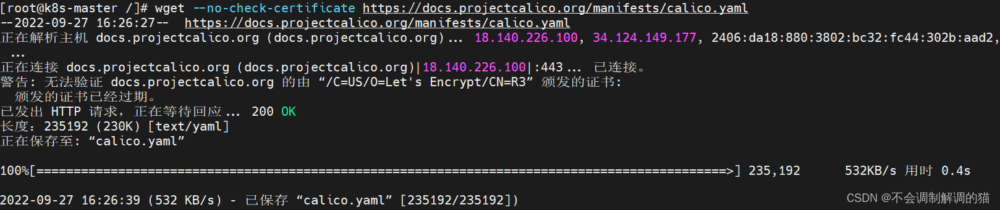

# 云原生 | Kubernetes - k8s集群搭建（kubeadm）（持续收录报错中）

5月前作者：不会调制解调的猫分类： [博客文章](https://www.yii666.com/blog.html)阅读(455)原文[违法举报](https://www.yii666.com/jubao.html?jubaourl=https%3A%2F%2Fwww.yii666.com%2Fblog%2F371436.html)

**目录**文章来源地址https://www.yii666.com/blog/371436.html

前置

1.实现效果

2.环境准备

3.系统初始化

关闭防火墙

关闭 selinux

关闭 swap

主机名

配置hosts

将桥接的 IPv4 流量传递到 iptables 的链

时间同步

部署Master节点 

所有节点安装 Docker/kubeadm/kubelet

部署 Kubernetes Master

0.初始化报错合集 

Unfortunately, an error has occurred:    timed out waiting for the condition

This error is likely caused by:    - The kubelet is not running    - The kubelet is unhealthy due to a misconfiguration of the node in some way (required cgroups disabled)

If you are on a systemd-powered system, you can try to troubleshoot the error with the following commands:    - 'systemctl status kubelet'    - 'journalctl -xeu kubelet'

Additionally, a control plane component may have crashed or exited when started by the container runtime.To troubleshoot, list all containers using your preferred container runtimes CLI.Here is one example how you may list all running Kubernetes containers by using crictl:    - 'crictl --runtime-endpoint unix:///var/run/containerd/containerd.sock ps -a | grep kube | grep -v pause'    Once you have found the failing container, you can inspect its logs with:    - 'crictl --runtime-endpoint unix:///var/run/containerd/containerd.sock logs CONTAINERID'error execution phase wait-control-plane: couldn't initialize a Kubernetes clusterTo see the stack trace of this error execute with --v=5 or higher

\--------------------------------------------------------------------------------------------------------------------------

[preflight] Running pre-flight checkserror execution phase preflight: [preflight] Some fatal errors occurred:    [ERROR CRI]: container runtime is not running: output: time="2022-09-27T11:34:39+08:00" level=fatal msg="unable to determine runtime API version: rpc error: code = Unavailable desc = connection error: desc = \"transport: Error while dialing dial unix /var/run/containerd/containerd.sock: connect: no such file or directory\"", error: exit status 1[preflight] If you know what you are doing, you can make a check non-fatal with `--ignore-preflight-errors=...`To see the stack trace of this error execute with --v=5 or higher

\--------------------------------------------------------------------------------------------------------------------------

[preflight] Running pre-flight checkserror execution phase preflight: [preflight] Some fatal errors occurred:    [ERROR FileAvailable--etc-kubernetes-manifests-kube-apiserver.yaml]: /etc/kubernetes/manifests/kube-apiserver.yaml already exists    [ERROR FileAvailable--etc-kubernetes-manifests-kube-controller-manager.yaml]: /etc/kubernetes/manifests/kube-controller-manager.yaml already exists    [ERROR FileAvailable--etc-kubernetes-manifests-kube-scheduler.yaml]: /etc/kubernetes/manifests/kube-scheduler.yaml already exists    [ERROR FileAvailable--etc-kubernetes-manifests-etcd.yaml]: /etc/kubernetes/manifests/etcd.yaml already exists    [ERROR Port-10250]: Port 10250 is in use[preflight] If you know what you are doing, you can make a check non-fatal with `--ignore-preflight-errors=...`To see the stack trace of this error execute with --v=5 or higher

\--------------------------------------------------------------------------------------------------------------------------

1.使用 kubectl 工具

2.加入节点**文章来源地址:https://www.yii666.com/blog/371436.html**

error execution phase preflight: [preflight] Some fatal errors occurred:    [ERROR FileAvailable--etc-kubernetes-kubelet.conf]: /etc/kubernetes/kubelet.conf already exists    [ERROR Port-10250]: Port 10250 is in use    [ERROR FileAvailable--etc-kubernetes-pki-ca.crt]: /etc/kubernetes/pki/ca.crt already exists[preflight] If you know what you are doing, you can make a check non-fatal with `--ignore-preflight-errors=...`To see the stack trace of this error execute with --v=5 or higher

\--------------------------------------------------------------------------------------------------------------------------

[preflight] Running pre-flight checkserror execution phase preflight: [preflight] Some fatal errors occurred:    [ERROR CRI]: container runtime is not running: output: time="2022-09-27T15:34:07+08:00" level=fatal msg="unable to determine runtime API version: rpc error: code = Unavailable desc = connection error: desc = \"transport: Error while dialing dial unix /var/run/containerd/containerd.sock: connect: no such file or directory\"", error: exit status 1[preflight] If you know what you are doing, you can make a check non-fatal with `--ignore-preflight-errors=...`To see the stack trace of this error execute with --v=5 or higher

\--------------------------------------------------------------------------------------------------------------------------

[preflight] Running pre-flight checks    [WARNING Hostname]: hostname "k8s-node1" could not be reached    [WARNING Hostname]: hostname "k8s-node1": lookup k8s-node1 on 114.114.114.114:53: no such hosterror execution phase preflight: [preflight] Some fatal errors occurred:    [ERROR CRI]: container runtime is not running: output: time="2022-09-27T15:30:29+08:00" level=fatal msg="unable to determine runtime API version: rpc error: code = Unavailable desc = connection error: desc = \"transport: Error while dialing dial unix /var/run/containerd/containerd.sock: connect: no such file or directory\"", error: exit status 1[preflight] If you know what you are doing, you can make a check non-fatal with `--ignore-preflight-errors=...`To see the stack trace of this error execute with --v=5 or higher

\--------------------------------------------------------------------------------------------------------------------------

3.安装 Pod 网络插件

error: error parsing calico.yaml: error converting YAML to JSON: yaml: line 206: mapping values are not allowed in this context

\--------------------------------------------------------------------------------------------------------------------------

测试 kubernetes 集群

------


## 前置

## 1.实现效果

> - 在所有节点上安装 Docker 和 kubeadm
> - 部署 Kubernetes Master
> - 部署容器网络插件
> - 部署 Kubernetes Node，将节点加入 Kubernetes 集群中
> - 部署 Dashboard Web 页面，可视化查看 Kubernetes 资源

------


## 2.环境准备


这里用的机器是之前搭建 zk 、 kafka 、 hadoop 和 canal 的集群机器，直接拿来用了。需要查看配置的话可以查看之前的博客：

Zookeeper - 本地安装与参数配置

Zookeeper - 集群搭建 + 群起集群脚本

Kafka + Zookeeper + Hadoop 集群配置

Hadoop3.x - 本地安装 + 完全分布式安装 + 集群配置 + xsync分发脚本 (解决root用户启动Hadoop集群的报错问题)

Canal + MySQL + Zookeeper + Kafka 数据实时同步

| 角色       | IP              |
| ---------- | --------------- |
| k8s-master | 192.168.150.102 |
| k8s-node1  | 192.168.150.103 |
| k8s-node2  | 192.168.150.104 |

------


## 3.系统初始化

### 关闭防火墙

```
systemctl stop firewalld
systemctl disable firewalld
```


### 关闭 selinux

临时：

```
setenforce 0
```

永久： 网址:yii666.com

```
sed -i 's/enforcing/disabled/' /etc/selinux/config
```


### 关闭 swap

临时：

```
swapoff -a
```

永久：

```
sed -ri 's/.*swap.*/#&/' /etc/fstab
```


### 主机名

这里把之前的Hadoop主机名改掉：

```
hostnamectl set-hostname k8s-master
hostnamectl set-hostname k8s-node1
hostnamectl set-hostname k8s-node2
```


### 配置hosts

在 k8s-master 上进行配置：

```
cat >> /etc/hosts << EOF
192.168.150.102 k8s-master
192.168.150.103 k8s-node1
192.168.150.104 k8s-node2
EOF
```


### 将桥接的 IPv4 流量传递到 iptables 的链

这里说白了就是让所有的流量都要从k8s这里过，k8s需要看到所有的流量走向：网址:yii666.com<

```
cat > /etc/sysctl.d/k8s.conf << EOF
net.bridge.bridge-nf-call-ip6tables = 1
net.bridge.bridge-nf-call-iptables = 1
EOF
```

生效：

```
sysctl --system
```


### 时间同步

```
yum install -y ntpdate
ntpdate time.windows.com
```

------


## 部署Master节点 

### 所有节点安装 Docker/kubeadm/kubelet

Docker：

```
wget https://mirrors.aliyun.com/docker-ce/linux/centos/docker-ce.repo -O /etc/yum.repos.d/docker-ce.repo
yum -y install docker-ce-18.06.1.ce-3.el7
systemctl enable docker && systemctl start docker
```

添加 yum 源：

```
cat > /etc/yum.repos.d/kubernetes.repo << EOF
[kubernetes]
name=Kubernetes
baseurl=https://mirrors.aliyun.com/kubernetes/yum/repos/kubernetes-el7-x86_64
enabled=1
gpgcheck=0
repo_gpgcheck=0
gpgkey=https://mirrors.aliyun.com/kubernetes/yum/doc/yum-key.gpg
https://mirrors.aliyun.com/kubernetes/yum/doc/rpm-package-key.gpg
EOF
```

安装 kubeadm ， kubelet 和 kubectl ：

```
yum install -y kubelet-1.25.0 kubeadm-1.25.0 kubectl-1.25.0
```

开机自启： 

```
systemctl enable kubelet
```


### 部署 Kubernetes Master

在 k8s-master（192.168.150.102） 上执行：

```
kubeadm init \
--apiserver-advertise-address=192.168.150.102 \
--image-repository registry.aliyuncs.com/google_containers \
--kubernetes-version v1.25.0 \
--service-cidr=10.96.0.0/12 \
--pod-network-cidr=10.244.0.0/16
```

> 注意：随着版本更新，请注意这里的 --kubernetes-version 与之前所安装的' kubelet kubeadm kubectl '版本一致

> 参数说明：
>
> 
>
> --apiserver-advertise-address=192.168.150.102              
>
> master主机的IP地址，例如我的Master主机的IP是：192.168.150.102
>
> 
>
> --image-repository=registry.aliyuncs.com/google_containers    
>
> 镜像地址，由于国外地址无法访问，故使用的阿里云仓库地址：registry.aliyuncs.com/google_containers
>
> 
>
> --kubernetes-version=v1.25.2                            
>
> 下载的k8s软件版本号
>
> 
>
> --service-cidr=10.96.0.0/12                              
>
> 参数后的IP地址直接就套用10.96.0.0/12 ,以后安装时也套用即可，不要更改
>
> 
>
> --pod-network-cidr=10.244.0.0/16                        
>
> k8s内部的pod节点之间网络可以使用的IP段，不能和service-cidr写一样，如果不知道怎么配，就先用这个10.244.0.0/16

效果如下：


------


## 0.初始化报错合集 

### Unfortunately, an error has occurred:     timed out waiting for the condition

### This error is likely caused by:     - The kubelet is not running     - The kubelet is unhealthy due to a misconfiguration of the node in some way (required cgroups disabled)

### If you are on a systemd-powered system, you can try to troubleshoot the error with the following commands:     - 'systemctl status kubelet'     - 'journalctl -xeu kubelet'

### Additionally, a control plane component may have crashed or exited when started by the container runtime. To troubleshoot, list all containers using your preferred container runtimes CLI. Here is one example how you may list all running Kubernetes containers by using crictl:     - 'crictl --runtime-endpoint unix:///var/run/containerd/containerd.sock ps -a | grep kube | grep -v pause'     Once you have found the failing container, you can inspect its logs with:     - 'crictl --runtime-endpoint unix:///var/run/containerd/containerd.sock logs CONTAINERID' error execution phase wait-control-plane: couldn't initialize a Kubernetes cluster To see the stack trace of this error execute with --v=5 or higher


恭喜你初始化失败了，开始吧。

首先确认你的 kubelet 已经跑起来了，别是 stop ：

```
systemctl status kubelet.service
```


查看日志：

```
journalctl -xeu kubelet
```

内容过多只截了一部分，这里的主要意思是拿不到节点：


确保版本号一致：

```
yum list | grep kube
```


若版本号不一致则 remove 掉，然后重新下载： 

```
yum remove -y kubeadm.x86_64 kubectl.x86_64 kubelet.x86_64
```

重新下载，这里的 -1.25.0 改成自己要下载的版本：

```
yum install -y kubelet-1.25.0 kubeadm-1.25.0 kubectl-1.25.0
```

### --------------------------------------------------------------------------------------------------------------------------

------


### [preflight] Running pre-flight checks error execution phase preflight: [preflight] Some fatal errors occurred:     [ERROR CRI]: container runtime is not running: output: time="2022-09-27T11:34:39+08:00" level=fatal msg="unable to determine runtime API version: rpc error: code = Unavailable desc = connection error: desc = \"transport: Error while dialing dial unix /var/run/containerd/containerd.sock: connect: no such file or directory\"" , error: exit status 1 [preflight] If you know what you are doing, you can make a check non-fatal with `--ignore-preflight-errors=...` To see the stack trace of this error execute with --v=5 or higher


**安装了containerd看这里**

```
rm -rf /etc/containerd/config.toml
systemctl restart containerd
```


**没有安装containerd看这里**

 三台机器都需要安装 

```
yum install containerd  jq -y
containerd config default > /etc/containerd/config.toml
systemctl enable --now containerd
vim /etc/containerd/config.toml
```

把这里改掉：


```
sandbox_image = "registry.aliyuncs.com/google_containers/pause:3.6"
```


保存退出后重启一下：

```
systemctl restart containerd.service
```

### --------------------------------------------------------------------------------------------------------------------------

------


### [preflight] Running pre-flight checks error execution phase preflight: [preflight] Some fatal errors occurred:     [ERROR FileAvailable--etc-kubernetes-manifests-kube-apiserver.yaml]: /etc/kubernetes/manifests/kube-apiserver.yaml already exists     [ERROR FileAvailable--etc-kubernetes-manifests-kube-controller-manager.yaml]: /etc/kubernetes/manifests/kube-controller-manager.yaml already exists     [ERROR FileAvailable--etc-kubernetes-manifests-kube-scheduler.yaml]: /etc/kubernetes/manifests/kube-scheduler.yaml already exists     [ERROR FileAvailable--etc-kubernetes-manifests-etcd.yaml]: /etc/kubernetes/manifests/etcd.yaml already exists     [ERROR Port-10250]: Port 10250 is in use [preflight] If you know what you are doing, you can make a check non-fatal with `--ignore-preflight-errors=...` To see the stack trace of this error execute with --v=5 or higher


```
kubeadm reset
```

然后重新初始化即可。

### --------------------------------------------------------------------------------------------------------------------------

------


## 1.使用 kubectl 工具

```
mkdir -p $HOME/.kube
sudo cp -i /etc/kubernetes/admin.conf $HOME/.kube/config
sudo chown $(id -u):$(id -g) $HOME/.kube/config
kubectl get nodes
```


------


## 2.加入节点


把这句话复制下来，然后直接在 Master 执行，并发现报错（这里是演示一下报错）。

### error execution phase preflight: [preflight] Some fatal errors occurred:     [ERROR FileAvailable--etc-kubernetes-kubelet.conf]: /etc/kubernetes/kubelet.conf already exists     [ERROR Port-10250]: Port 10250 is in use     [ERROR FileAvailable--etc-kubernetes-pki-ca.crt]: /etc/kubernetes/pki/ca.crt already exists [preflight] If you know what you are doing, you can make a check non-fatal with `--ignore-preflight-errors=...` To see the stack trace of this error execute with --v=5 or higher


 原因是加入节点的这个操作应该在 node 节点中进行，而不是在 Master 中执行。把它复制到另外两台机器中运行，效果如下：


默认token有效期为24小时，当过期之后，该token就不可用了。这时就需要重新创建token，可以直接使用命令快捷生成：

```
kubeadm token create --print-join-command
```

### --------------------------------------------------------------------------------------------------------------------------


可能出现的报错：

### [preflight] Running pre-flight checks error execution phase preflight: [preflight] Some fatal errors occurred:     [ERROR CRI]: container runtime is not running: output: time="2022-09-27T15:34:07+08:00" level=fatal msg="unable to determine runtime API version: rpc error: code = Unavailable desc = connection error: desc = \"transport: Error while dialing dial unix /var/run/containerd/containerd.sock: connect: no such file or directory\"" , error: exit status 1 [preflight] If you know what you are doing, you can make a check non-fatal with `--ignore-preflight-errors=...` To see the stack trace of this error execute with --v=5 or higher


这里报错的原因是 node节点中的 containerd 存在问题，按照上文修改即可。

### --------------------------------------------------------------------------------------------------------------------------


其它报错：

### [preflight] Running pre-flight checks     [WARNING Hostname]: hostname "k8s-node1" could not be reached     [WARNING Hostname]: hostname "k8s-node1": lookup k8s-node1 on 114.114.114.114:53: no such host error execution phase preflight: [preflight] Some fatal errors occurred:     [ERROR CRI]: container runtime is not running: output: time="2022-09-27T15:30:29+08:00" level=fatal msg="unable to determine runtime API version: rpc error: code = Unavailable desc = connection error: desc = \"transport: Error while dialing dial unix /var/run/containerd/containerd.sock: connect: no such file or directory\"" , error: exit status 1 [preflight] If you know what you are doing, you can make a check non-fatal with `--ignore-preflight-errors=...` To see the stack trace of this error execute with --v=5 or higher


去机器上配置一下 hosts 文件即可：

```
vim /etc/hosts
```


### --------------------------------------------------------------------------------------------------------------------------

加入成功，然后回到 Master 节点中再去看一眼： 

```
kubectl get nodes
```


------


## 3.安装 Pod 网络插件

```
wget --no-check-certificate https://docs.projectcalico.org/manifests/calico.yaml
```



然后咱们需要去修改一下配置：

```
vim calico.yaml
```

修改这里的ip，注意格式对齐，不然会报错（可以看下面）： 


```
kubectl apply -f calico.yaml
```


```
kubectl get pods -n kube-system
```

启动可能比较慢，多等一会即可： 


 这里可能出现的报错：

### error: error parsing calico.yaml: error converting YAML to JSON: yaml: line 206: mapping values are not allowed in this context


问题在于上面的配置文件格式不对，注意两行的 name 和 value 是对齐的，千万不要多空格！

### --------------------------------------------------------------------------------------------------------------------------

------


## 测试 kubernetes 集群

```
kubectl get cs
```


在 Kubernetes 集群中创建一个 pod，验证是否正常运行：

```
kubectl create deployment nginx --image=nginx
kubectl expose deployment nginx --port=80 --type=NodePort
```


```
kubectl get pod,svc
```


最终访问的时候助力此处图中的端口号，比如我这里访问（node ip加上图中的端口号）：*文章地址https://www.yii666.com/blog/371436.html*

```
http://192.168.150.103:31341/
```


完成 


**版权声明：**本文内容来源于网络，版权归原作者所有，此博客不拥有其著作权，亦不承担相应法律责任。文本页已经标记具体来源原文地址，请点击原文查看来源网址,站内文章以及资源内容站长不承诺其正确性，如侵犯了您的权益，请联系站长如有侵权请联系站长，将立刻删除

**分享到：**