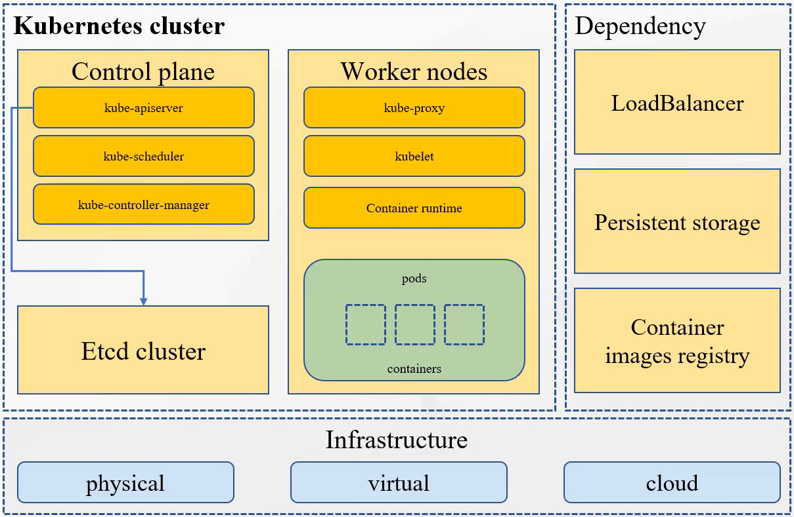
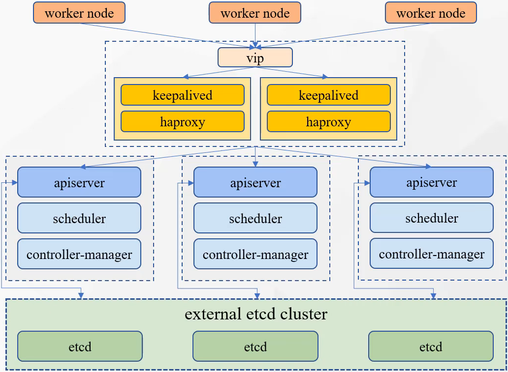
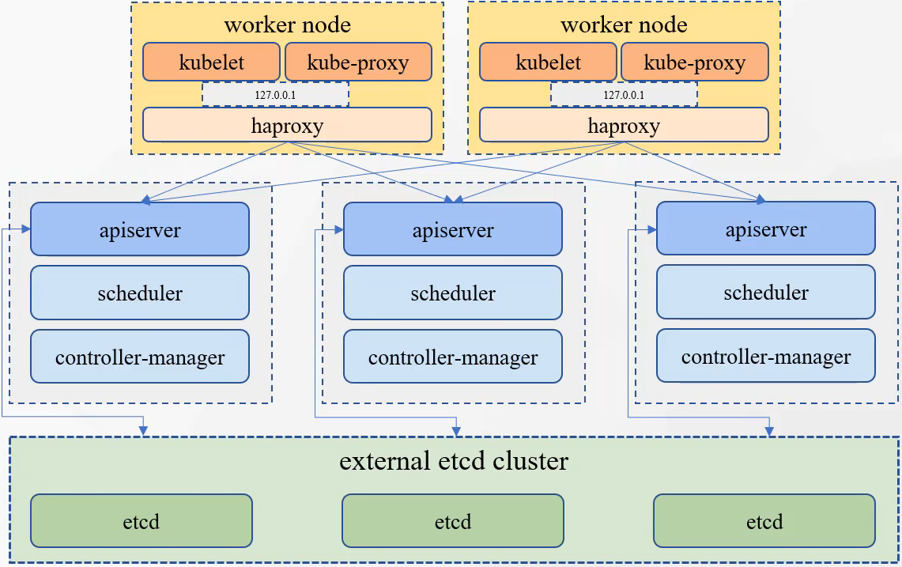

## 使用KubeKey快速搭建k8s高可用集群

常用的安装方式

1 kubeadmin kops kubespray

2 kubekey


节点规划

这里使用虚拟机，网络模式使用桥接模式

| 名称         | 节点角色      | 公网ip        | 内网ip        | 账号        | cpu  | 内存(G) | 磁盘(G) |
| ------------ | ------------- | ------------- | ------------- | ----------- | ---- | ------- | ------- |
| k8s-master01 | master / etcd | 192.168.0.151 | 192.168.0.151 | root/123456 | 2    | 4       | 32      |
| k8s-master02 | master / etcd | 192.168.0.152 | 192.168.0.152 | root/123456 | 2    | 4       | 32      |
| k8s-master03 | master / etcd | 192.168.0.153 | 192.168.0.153 | root/123456 | 2    | 4       | 32      |
| k8s-worker01 | worker        | 192.168.0.161 | 192.168.0.161 | root/123456 | 8    | 16      | 32      |
| k8s-worker02 | worker        | 192.168.0.162 | 192.168.0.162 | root/123456 | 8    | 16      | 32      |


部署生产环境的集群需要：

1 选择合适单独部署工具

比如：kubeadmin/kops/Kubespray/kubekey，有些会自动部署容器运行时（docker/containerd），有些不会


2 管理证书


3 为apiserver配置负载均衡器

集群一般都是多个（奇数个）控制平面，也就是master节点，每个master节点上都有apiserver，worker节点连接master节点时，需要通过负载均衡器，以负载平衡的方式连接多个apiserver， kubeadmin不包含这个步骤，需要手动搭建。


4 etcd服务 

etcd储存了k8s集群的所有信息，所以k8s集群要高可用，etcd必须要高可用。kubeadmin 无法做到**外置**并且**备份**etcd，需要手动操作


5 创建多个控制平面（多个master）

在第一个节点上执行init操作，其他的节点通过join指令加入


6 跨区域

异地容灾备份，需要集群部署到不同的区域。需要大规模集群才能实现这一步，一般不是很有不要。


7 持续管理集群

集群部署之后，需要对集群进行维护，例如：更新证书，集群升级，增删节点


使用KubeKey：

https://www.kubesphere.io/zh/docs/v3.3/installing-on-linux/introduction/kubekey/

https://github.com/kubesphere/kubekey


KubeKey的优点：

1 KubeKey使用go语言开发，高效，速度快，灵活，依赖很少，不需要提前准备配置和安装环境

2 支持多种安装选项： 

​	1 简单部署 all-in-one 

​	2 高可用集群

安装结果

​	1 仅安装k8s或者k3s

​	2 同时安装k8s或者k3s + KubeSphere


3 自动化，多节点并行安装，提高安装效率

4 使用方式简单

5 代码可扩展，方便二次开发


节点最小要求：

2核cpu

4G内存

20GB存储


操作系统要求：

1 所有节点可ssh访问

2 所有节点时钟同步

3 所有节点 sudo /curl/openssl 可以使用

4 所有节点关闭selinux或者设置为宽容模式

https://github.com/kubesphere/kubekey/blob/master/docs/turn-off-SELinux.md

How to turn off SELinux

turn off SELinux

```bash
# Edit the configuration
sed -i 's/SELINUX=enforcing/SELINUX=disabled/g' /etc/selinux/config
#restart the system  
reboot
# check SELinux
getenforce
```

Edit the configuration file /etc/selinux/config, change SELINUX= to SELINUX=disabled, then restart the system, SELinux will be disabled

Temporarily shut down SELinux

```
# Temporarily closing SELinux is to switch between enforcing and permissive modes
setenforce 0 #Switch to tolerance mode
setenforce 1 #Switch to mandatory mode
# check SELinux
getenforce
```

Temporary shutdown enforcing, invalid after restarting the system


5 所有节点关闭防火墙或者设置网络访问策略

https://github.com/kubesphere/kubekey/blob/master/docs/network-access.md

## Network Access

If your network configuration uses an firewall，you must ensure infrastructure components can communicate with each other through specific ports that act as communication endpoints for certain processes or services.

| services       | protocol       | action | start port | end port | comment                                 |
| -------------- | -------------- | ------ | ---------- | -------- | --------------------------------------- |
| ssh            | TCP            | allow  | 22         |          |                                         |
| etcd           | TCP            | allow  | 2379       | 2380     |                                         |
| apiserver      | TCP            | allow  | 6443       |          |                                         |
| calico         | TCP            | allow  | 9099       | 9100     |                                         |
| bgp            | TCP            | allow  | 179        |          |                                         |
| nodeport       | TCP            | allow  | 30000      | 32767    |                                         |
| master         | TCP            | allow  | 10250      | 10258    |                                         |
| dns            | TCP            | allow  | 53         |          |                                         |
| dns            | UDP            | allow  | 53         |          |                                         |
| local-registry | TCP            | allow  | 5000       |          | offline environment                     |
| local-apt      | TCP            | allow  | 5080       |          | offline environment                     |
| rpcbind        | TCP            | allow  | 111        |          | use NFS                                 |
| ipip           | IPENCAP / IPIP | allow  |            |          | calico needs to allow the ipip protocol |


下载KubeKey

```
export KKZONE=cn
```

```bash
curl -sfL https://get-kk.kubesphere.io | VERSION=v3.0.7 sh -
```

这里版本通过 VERSION=v3.0.7 设置，取值可以是 [github](https://github.com/kubesphere/kubekey) 上任意的release版本。

下载下来是一个名为 `kk` 的二进制可执行文件，可以执行：

```
./kk version --show-supported-k8s
```

查看能使用 KubeKey 安装的所有受支持的 Kubernetes 版本。

复制kk可执行文件到 /usr/bin , 这样可以在任意目录使用kk

```bash
 cp ./kk /usr/bin/kk
```


KubeKey的简单使用

创建集群

```bash
./kk create cluster --with-kubernetes v1.21.5 --with-kubesphere v3.2.0
```


删除集群

```bash
./kk delete cluster
```


升级集群

```bash
./kk upgrade --with-kubernetes v1.22.1
```


KubeKey的高级使用

创建KubeKey的配置文件

```bash
./kk create config -f config.yaml
```

默认生成配置如下：

```yaml
apiVersion: kubekey.kubesphere.io/v1alpha2
kind: Cluster
metadata:
  name: sample
spec:
  hosts:
  - {name: node1, address: 172.16.0.2, internalAddress: 172.16.0.2, user: ubuntu, password: "Qcloud@123"}
  - {name: node2, address: 172.16.0.3, internalAddress: 172.16.0.3, user: ubuntu, password: "Qcloud@123"}
  roleGroups:
    etcd:
    - node1
    control-plane:
    - node1
    worker:
    - node1
    - node2
  controlPlaneEndpoint:
    ## Internal loadbalancer for apiservers
    # internalLoadbalancer: haproxy

    domain: lb.kubesphere.local
    address: ""
    port: 6443
  kubernetes:
    version: v1.23.10
    clusterName: cluster.local
    autoRenewCerts: true
    containerManager: docker
  etcd:
    type: kubekey
  network:
    plugin: calico
    kubePodsCIDR: 10.233.64.0/18
    kubeServiceCIDR: 10.233.0.0/18
    ## multus support. https://github.com/k8snetworkplumbingwg/multus-cni
    multusCNI:
      enabled: false
  registry:
    privateRegistry: ""
    namespaceOverride: ""
    registryMirrors: []
    insecureRegistries: []
  addons: []
```

完整的配置参考： https://github.com/kubesphere/kubekey/blob/release-2.2/docs/config-example.md

```yaml
apiVersion: kubekey.kubesphere.io/v1alpha2
kind: Cluster
metadata:
  name: sample
spec:
  hosts:
  - {name: node1, address: 172.16.0.2, internalAddress: 172.16.0.2, port: 8022, user: ubuntu, password: "Qcloud@123"} # Assume that the default port for SSH is 22. Otherwise, add the port number after the IP address. If you install Kubernetes on ARM, add "arch: arm64". For example, {...user: ubuntu, password: Qcloud@123, arch: arm64}.
  - {name: node2, address: 172.16.0.3, internalAddress: 172.16.0.3, password: "Qcloud@123"}  # For default root user.
  - {name: node3, address: 172.16.0.4, internalAddress: 172.16.0.4, privateKeyPath: "~/.ssh/id_rsa"} # For password-less login with SSH keys.
  roleGroups:
    etcd:
    - node1 # All the nodes in your cluster that serve as the etcd nodes.
    master:
    - node1
    - node[2:10] # From node2 to node10. All the nodes in your cluster that serve as the master nodes.
    worker:
    - node1
    - node[10:100] # All the nodes in your cluster that serve as the worker nodes.
  controlPlaneEndpoint:
    internalLoadbalancer: haproxy #Internal loadbalancer for apiservers. [Default: ""]
    domain: lb.kubesphere.local
    address: ""      # The IP address of your load balancer.
    port: 6443
  system:
    ntpServers: #  The ntp servers of chrony.
      - time1.cloud.tencent.com
      - ntp.aliyun.com
      - node1 # Set the node name in `hosts` as ntp server if no public ntp servers access.
    timezone: "Asia/Shanghai"
  kubernetes:
    version: v1.21.5
    imageRepo: kubesphere
    containerManager: docker # Container Runtime, support: containerd, cri-o, isula. [Default: docker]
    clusterName: cluster.local
    autoRenewCerts: true # Whether to install a script which can automatically renew the Kubernetes control plane certificates. [Default: false]
    masqueradeAll: false  # masqueradeAll tells kube-proxy to SNAT everything if using the pure iptables proxy mode. [Default: false].
    maxPods: 110  # maxPods is the number of Pods that can run on this Kubelet. [Default: 110]
    nodeCidrMaskSize: 24  # The internal network node size allocation. This is the size allocated to each node on your network. [Default: 24]
    proxyMode: ipvs  # Specify which proxy mode to use. [Default: ipvs]
    featureGates: # enable featureGates, [Default: {"ExpandCSIVolumes":true,"RotateKubeletServerCertificate": true,"CSIStorageCapacity":true, "TTLAfterFinished":true}]
      CSIStorageCapacity: true
      ExpandCSIVolumes: true
      RotateKubeletServerCertificate: true
      TTLAfterFinished: true
    ## support kata and NFD
    # kata:
    #   enabled: true
    # nodeFeatureDiscovery
    #   enabled: true
  etcd:
    type: kubekey  # Specify the type of etcd used by the cluster. When the cluster type is k3s, setting this parameter to kubeadm is invalid. [kubekey | kubeadm | external] [Default: kubekey]
    ## The following parameters need to be added only when the type is set to external.
    ## caFile, certFile and keyFile need not be set, if TLS authentication is not enabled for the existing etcd.
    # external:
    #   endpoints:
    #     - https://192.168.6.6:2379
    #   caFile: /pki/etcd/ca.crt
    #   certFile: /pki/etcd/etcd.crt
    #   keyFile: /pki/etcd/etcd.key
  network:
    plugin: calico
    calico:
      ipipMode: Always  # IPIP Mode to use for the IPv4 POOL created at start up. If set to a value other than Never, vxlanMode should be set to "Never". [Always | CrossSubnet | Never] [Default: Always]
      vxlanMode: Never  # VXLAN Mode to use for the IPv4 POOL created at start up. If set to a value other than Never, ipipMode should be set to "Never". [Always | CrossSubnet | Never] [Default: Never]
      vethMTU: 0  # The maximum transmission unit (MTU) setting determines the largest packet size that can be transmitted through your network. By default, MTU is auto-detected. [Default: 0]
    kubePodsCIDR: 10.233.64.0/18
    kubeServiceCIDR: 10.233.0.0/18
  registry:
    registryMirrors: []
    insecureRegistries: []
    privateRegistry: ""
    namespaceOverride: ""
    auths: # if docker add by `docker login`, if containerd append to `/etc/containerd/config.toml`
      "dockerhub.kubekey.local":
        username: "xxx"
        password: "***"
        skipTLSVerify: false # Allow contacting registries over HTTPS with failed TLS verification.
        plainHTTP: false # Allow contacting registries over HTTP.
        certsPath: "/etc/docker/certs.d/dockerhub.kubekey.local" # Use certificates at path (*.crt, *.cert, *.key) to connect to the registry.
  addons: [] # You can install cloud-native addons (Chart or YAML) by using this field.

---
apiVersion: installer.kubesphere.io/v1alpha1
kind: ClusterConfiguration
metadata:
  name: ks-installer
  namespace: kubesphere-system
  labels:
    version: v3.1.0
spec:
  persistence:
    storageClass: ""        # If there is no default StorageClass in your cluster, you need to specify an existing StorageClass here.
  authentication:
    jwtSecret: ""           # Keep the jwtSecret consistent with the Host Cluster. Retrieve the jwtSecret by executing "kubectl -n kubesphere-system get cm kubesphere-config -o yaml | grep -v "apiVersion" | grep jwtSecret" on the Host Cluster.
  local_registry: ""        # Add your private registry address if it is needed.
  etcd:
    monitoring: false       # Enable or disable etcd monitoring dashboard installation. You have to create a Secret for etcd before you enable it.
    endpointIps: localhost  # etcd cluster EndpointIps. It can be a bunch of IPs here.
    port: 2379              # etcd port.
    tlsEnable: true
  common:
    redis:
      enabled: false
    openldap:
      enabled: false
    minioVolumeSize: 20Gi # Minio PVC size.
    openldapVolumeSize: 2Gi   # openldap PVC size.
    redisVolumSize: 2Gi # Redis PVC size.
    monitoring:
      endpoint: http://prometheus-operated.kubesphere-monitoring-system.svc:9090 # Prometheus endpoint to get metrics data.
    es:   # Storage backend for logging, events and auditing.
      # elasticsearchMasterReplicas: 1   # The total number of master nodes. Even numbers are not allowed.
      # elasticsearchDataReplicas: 1     # The total number of data nodes.
      elasticsearchMasterVolumeSize: 4Gi   # The volume size of Elasticsearch master nodes.
      elasticsearchDataVolumeSize: 20Gi    # The volume size of Elasticsearch data nodes.
      logMaxAge: 7                     # Log retention time in built-in Elasticsearch. It is 7 days by default.
      elkPrefix: logstash              # The string making up index names. The index name will be formatted as ks-<elk_prefix>-log.
      basicAuth:
        enabled: false
        username: ""
        password: ""
      externalElasticsearchUrl: ""
      externalElasticsearchPort: ""
  console:
    enableMultiLogin: true  # Enable or disable simultaneous logins. It allows different users to log in with the same account at the same time.
    port: 30880
  alerting:                # (CPU: 0.1 Core, Memory: 100 MiB) It enables users to customize alerting policies to send messages to receivers in time with different time intervals and alerting levels to choose from.
    enabled: false         # Enable or disable the KubeSphere Alerting System.
    # thanosruler:
    #   replicas: 1
    #   resources: {}
  auditing:                # Provide a security-relevant chronological set of records，recording the sequence of activities happening on the platform, initiated by different tenants.
    enabled: false         # Enable or disable the KubeSphere Auditing Log System. 
  devops:                  # (CPU: 0.47 Core, Memory: 8.6 G) Provide an out-of-the-box CI/CD system based on Jenkins, and automated workflow tools including Source-to-Image & Binary-to-Image.
    enabled: false             # Enable or disable the KubeSphere DevOps System.
    jenkinsMemoryLim: 2Gi      # Jenkins memory limit.
    jenkinsMemoryReq: 1500Mi   # Jenkins memory request.
    jenkinsVolumeSize: 8Gi     # Jenkins volume size.
    jenkinsJavaOpts_Xms: 512m  # The following three fields are JVM parameters.
    jenkinsJavaOpts_Xmx: 512m
    jenkinsJavaOpts_MaxRAM: 2g
  events:                  # Provide a graphical web console for Kubernetes Events exporting, filtering and alerting in multi-tenant Kubernetes clusters.
    enabled: false         # Enable or disable the KubeSphere Events System.
    ruler:
      enabled: true
      replicas: 2
  logging:                 # (CPU: 57 m, Memory: 2.76 G) Flexible logging functions are provided for log query, collection and management in a unified console. Additional log collectors can be added, such as Elasticsearch, Kafka and Fluentd.
    enabled: false         # Enable or disable the KubeSphere Logging System.
    logsidecar:
      enabled: true
      replicas: 2
  metrics_server:                    # (CPU: 56 m, Memory: 44.35 MiB) It enables HPA (Horizontal Pod Autoscaler).
    enabled: false                   # Enable or disable metrics-server.
  monitoring:
    storageClass: ""                 # If there is an independent StorageClass you need for Prometheus, you can specify it here. The default StorageClass is used by default.
    # prometheusReplicas: 1          # Prometheus replicas are responsible for monitoring different segments of data source and providing high availability.
    prometheusMemoryRequest: 400Mi   # Prometheus request memory.
    prometheusVolumeSize: 20Gi       # Prometheus PVC size.
    # alertmanagerReplicas: 1          # AlertManager Replicas.
  multicluster:
    clusterRole: none  # host | member | none  # You can install a solo cluster, or specify it as the Host or Member Cluster.
  network:
    networkpolicy: # Network policies allow network isolation within the same cluster, which means firewalls can be set up between certain instances (Pods).
      # Make sure that the CNI network plugin used by the cluster supports NetworkPolicy. There are a number of CNI network plugins that support NetworkPolicy, including Calico, Cilium, Kube-router, Romana and Weave Net.
      enabled: false # Enable or disable network policies.
    ippool: # Use Pod IP Pools to manage the Pod network address space. Pods to be created can be assigned IP addresses from a Pod IP Pool.
      type: none # Specify "calico" for this field if Calico is used as your CNI plugin. "none" means that Pod IP Pools are disabled.
    topology: # Use Service Topology to view Service-to-Service communication based on Weave Scope.
      type: none # Specify "weave-scope" for this field to enable Service Topology. "none" means that Service Topology is disabled.
  openpitrix: # An App Store that is accessible to all platform tenants. You can use it to manage apps across their entire lifecycle.
    store:
      enabled: false # Enable or disable the KubeSphere App Store.
  servicemesh:         # (0.3 Core, 300 MiB) Provide fine-grained traffic management, observability and tracing, and visualized traffic topology.
    enabled: false     # Base component (pilot). Enable or disable KubeSphere Service Mesh (Istio-based).
  kubeedge:          # Add edge nodes to your cluster and deploy workloads on edge nodes.
    enabled: false   # Enable or disable KubeEdge.
    cloudCore:
      nodeSelector: {"node-role.kubernetes.io/worker": ""}
      tolerations: []
      cloudhubPort: "10000"
      cloudhubQuicPort: "10001"
      cloudhubHttpsPort: "10002"
      cloudstreamPort: "10003"
      tunnelPort: "10004"
      cloudHub:
        advertiseAddress: # At least a public IP address or an IP address which can be accessed by edge nodes must be provided.
          - ""            # Note that once KubeEdge is enabled, CloudCore will malfunction if the address is not provided.
        nodeLimit: "100"
      service:
        cloudhubNodePort: "30000"
        cloudhubQuicNodePort: "30001"
        cloudhubHttpsNodePort: "30002"
        cloudstreamNodePort: "30003"
        tunnelNodePort: "30004"
    edgeWatcher:
      nodeSelector: {"node-role.kubernetes.io/worker": ""}
      tolerations: []
      edgeWatcherAgent:
        nodeSelector: {"node-role.kubernetes.io/worker": ""}
        tolerations: []
```


根据需要修改集群的配置，高级操作都需要通过 `-f config.yaml` 参数的方式指定配置文件，以操作配置文件指定的资源。

一般需要在 spec.hosts 中修改各个节点的ip地址，账号以及密码，在spec.roleGroups 中修改各个节点的角色。


安装集群依赖组件

```bash
./kk init os -f config.yaml
```


创建集群

```bash
./kk create cluster -f config.yaml
```


删除集群

```bash
./kk delete cluster -f config.yaml
```


升级集群

```bash
./kk upgrade -f config.yaml
```


集群部署概览



k8s可以部署在 物理机（physical） 虚拟机（virtual） 云主机（cloud） （公有云 私有云 混合云），集群需要：

控制平面（master节点）

​	api-server

​	scheduler

​	controller-manager

工作节点（work nodes）

​	kube-proxy

​	kubelet

​	container runtime（docker/containerd/cri-o）

​		

集群数据库（etcd）

外部依赖

​	LoadBalancer 负载均衡器

​		高可用部署模式下，为kube-apiserver提供负载均衡。k8s中的service开启loadbalancer模式，k8s会自动为service创建一个负载均衡器，挂载到service上。负载均衡器的自动创建可能需要依赖云厂商的插件。

​	Persistent storage 持久化存储

​	Container images registry 容器镜像仓库，如 Harbor


高可用集群部署 外部均衡模式 External loadbalancer 




最下层是 etcd 集群

上一层是是控制平面（master节点）

再上一层是 vip和负载均衡器

所有的工作节点都是通过vip和负载均衡器（keepalived+haproxy组成） 来访问 master 节点的 apiserver 服务。

这种是很常见的模式。图中的负载均衡器使用的是 keepalived+haproxy 的方案，在云环境下常见刚可用集群时，可以使用厂商提供的一键部署负载均衡器。


高可用集群部署 内部均衡模式 Internal loadbalancer



内部负载均衡模式，与外部负载均衡模式不同点在于在集群中每一个工作节点会启动一个 haproxy ，把控制平面（master节点）的 apiserver 服务代理到本地。工作节点中的kubelet kube-proxy 及其他组件通过本地地址来访问 apiserver 。好处是不需要额外准备负载均衡器，也不需要额外占用资源，可以快速简单方便部署一套高可用集群。

这里的代理使用的是 haproxy，也可以使用nginx ipvs这些


下面使用kubekey部署高可用集群

1 准备虚拟机如下：

| 名称         | 节点角色         | 公网ip        | 内网ip        | 账号                               | cpu  | 内存(G) | 磁盘(G) |
| ------------ | ---------------- | ------------- | ------------- | ---------------------------------- | ---- | ------- | ------- |
| k8s-master01 | master<br />etcd | 192.168.0.151 | 192.168.0.151 | root/123456<br />k8s-user / 123456 | 2    | 4       | 32      |
| k8s-master02 | master<br />etcd | 192.168.0.152 | 192.168.0.152 | root/123456<br />k8s-user / 123456 | 2    | 4       | 32      |
| k8s-master03 | master<br />etcd | 192.168.0.153 | 192.168.0.153 | root/123456<br />k8s-user / 123456 | 2    | 4       | 32      |
| k8s-worker01 | worker           | 192.168.0.161 | 192.168.0.161 | root/123456<br />k8s-user / 123456 | 8    | 16      | 32      |
| k8s-worker02 | worker           | 192.168.0.162 | 192.168.0.162 | root/123456<br />k8s-user / 123456 | 8    | 16      | 32      |

k8s-user / 123456


## 在VMWare上安装Ubuntu

前置条件

VMWare WorkStation 17

ubuntu-22.04.2-live-server-amd64.iso


网络：桥接模式

硬盘类型：nvme


进入虚拟机开始安装系统：


try or install ubuntu


select your language:

english


continue without updating

Done


installation:

Ubuntu Server

Done


Network

dhcp 自动分配

Done


Proxy address：

Done


Mirror address:

```bash
https://mirrors.aliyun.com/ubuntu/
```

注意要使用https


storage configuartion

Custom storage layout

Done

storage configuration
	available devices
点击这里： free space

点击	ADD GPT Partition
			

​	size:
​				format ext4
​				mount /

点击  create

点击 Done

点击 Continue


配置系统信息：

```bash
your name:	k8s-master01
your server's name: k8s-master01
pick a username: k8s-user
choose a password: 123456
confirm your password: 123456
```

用户名和服务器名为 k8s-master[01-03] 和 k8s-worker[01-02]


About ubuntu Pro

默认选择 skip for now，不需要改变 

点击 Continue


[ ] install openssh server 

Done


Featured Server Snaps

Done


开始安装，等待安装结束


安装完成后，修改对系统进行配置


1 设置root密码

首先在vm中使用用户账号登录 k8s-user / 123456 ，然后输入指令设置root密码：

```bash
sudo passwd root
```

```bash
[sudo] password for kerwin: #输入当前用户密码
New password: #输入root新密码
Retype new password: #再次输入root密码
passwd: password updated successfully #密码更新成功
```


2 设置ip

在路由器上设置，设置ip与mac地址绑定，可以现在vmware中记录mac，再在路由器中设置mac与ip绑定

在vmware中：虚拟机-右键-设置-硬件-网络适配器-高级-MAC地址 

| 名称         | mac (: 分隔)      | mac (- 分隔)      | ip            |
| ------------ | ----------------- | ----------------- | ------------- |
| k8s-master01 | 00:50:56:3D:35:A3 | 00-50-56-3D-35-A3 | 192.168.0.151 |
| k8s-master02 | 00:0C:29:EA:E3:73 | 00-0C-29-EA-E3-73 | 192.168.0.152 |
| k8s-master03 | 00:0C:29:86:20:EC | 00-0C-29-86-20-EC | 192.168.0.153 |
| k8s-worker01 | 00:0C:29:E5:FD:E4 | 00-0C-29-E5-FD-E4 | 192.168.0.161 |
| k8s-worker02 | 00:0C:29:B9:CB:FA | 00-0C-29-B9-CB-FA | 192.168.0.162 |


使用ssh客户端（如 electerm）连接上面所有的虚拟机


更新系统

所有节点执行

```bash
sudo apt update
sudo apt upgrade -y
```


安装工具

所有节点执行

```bash
sudo apt install -y vim wget net-tools
```


确保每个节点上 MAC 地址和 product_uuid 的唯一性

所有节点执行

查看mac地址

```bash
ip link
```

或者使用这个命令：

```
ifconfig -a
```

可以使用 下列命令对 product_uuid 校验

```bash
sudo cat /sys/class/dmi/id/product_uuid
```


### 关闭防火墙

所有节点执行

ufw查看当前的防火墙状态：inactive状态是防火墙关闭状态 active是开启状态。

```bash
ufw status
```

启动、关闭防火墙

```bash
ufw enable | disable
```

此处如果防火墙是开启的，需要关闭防火墙

```bash
ufw disable
```


### 禁用SELINUX

所有节点执行

```bash
apt install -y selinux-utils
```

```bash
setenforce 0
```


```bash
vim /etc/selinux/config
```

添加一行

```bash
SELINUX=disabled
```


### 禁用所有swap交换分区

所有节点执行

```bash
swapoff -a
```

查看分区信息，确认swap为0

```
free -h
```

永久禁用swap,删除或注释掉/etc/fstab里的swap设备的挂载命令即可

```bash
vim /etc/fstab
```

注释掉swap分区行

```bash
#/swap.img      none    swap    sw      0       0
```


### 同步时间

所有节点执行

查看时间，注意时区

```bash
date
```

如果时区不正确可以通过下面的指令设置

```bash
timedatectl set-timezone Asia/Shanghai
```

安装 ntp

```bash
apt install -y ntp
```

开始ntpd服务,或者做定时任务如：*/5 * * * * /usr/sbin/ntpdate -u 192.168.2.5

```bash
systemctl start ntp
systemctl enable ntp
```


安装KubeKey

可以使用自动安装，也可以手动安装


1 自动安装

在k8s-master01上执行

```
export KKZONE=cn
```

```bash
curl -sfL https://get-kk.kubesphere.io | VERSION=v3.0.7 sh -
```

这里版本通过 VERSION=v3.0.7 设置，取值可以是 [github](https://github.com/kubesphere/kubekey) 上任意的release版本，下载下来是一个名为 `kk` 的二进制可执行文件。


2 手动安装

也可以直接在 https://github.com/kubesphere/kubekey/releases 上下载对应的包

[kubekey-v3.0.7-linux-amd64.tar.gz](https://github.com/kubesphere/kubekey/releases/download/v3.0.7/kubekey-v3.0.7-linux-amd64.tar.gz) 解压后得到同样的可执行文件 `kk`， 上传到服务器上

```bash
sudo chmod +x kk
```


安装完成后可以执行：

```
./kk version --show-supported-k8s
```

查看能使用 KubeKey 安装的所有受支持的 Kubernetes 版本。

```bash
v1.19.0
v1.19.8
v1.19.9
v1.19.15
v1.20.4
v1.20.6
v1.20.10
v1.21.0
v1.21.1
v1.21.2
v1.21.3
v1.21.4
v1.21.5
v1.21.6
v1.21.7
v1.21.8
v1.21.9
v1.21.10
v1.21.11
v1.21.12
v1.21.13
v1.21.14
v1.22.0
v1.22.1
v1.22.2
v1.22.3
v1.22.4
v1.22.5
v1.22.6
v1.22.7
v1.22.8
v1.22.9
v1.22.10
v1.22.11
v1.22.12
v1.22.13
v1.22.14
v1.22.15
v1.22.16
v1.22.17
v1.23.0
v1.23.1
v1.23.2
v1.23.3
v1.23.4
v1.23.5
v1.23.6
v1.23.7
v1.23.8
v1.23.9
v1.23.10
v1.23.11
v1.23.12
v1.23.13
v1.23.14
v1.23.15
v1.24.0
v1.24.1
v1.24.2
v1.24.3
v1.24.4
v1.24.5
v1.24.6
v1.24.7
v1.24.8
v1.24.9
v1.25.0
v1.25.1
v1.25.2
v1.25.3
v1.25.4
v1.25.5
v1.26.0
```

当前KubeSphere最新版本为3.3.2 查看官方文档 

https://www.kubesphere.io/zh/docs/v3.3/quick-start/minimal-kubesphere-on-k8s/

```bahs
在 Kubernetes 上最小化安装 KubeSphere
除了在 Linux 机器上安装 KubeSphere 之外，您还可以将其直接部署在现有的 Kubernetes 集群上。本快速入门指南将引导您完成在 Kubernetes 上最小化安装 KubeSphere 的一般性步骤。有关更多信息，请参见在 Kubernetes 上安装 KubeSphere。

准备工作
您的 Kubernetes 版本必须为：v1.20.x、v1.21.x、* v1.22.x、* v1.23.x 和 * v1.24.x。带星号的版本可能出现边缘节点部分功能不可用的情况。因此，如需使用边缘节点，推荐安装 v1.21.x。
```

综合上面的版本要求，可以选择的版本组合为 k8s：1.24.9  KubeSphere：3.3.2    


创建KubeKey的配置文件

```bash
./kk create config -f kubekey-k8s-cluster-config.yaml
```

默认生成配置如下：

```yaml
apiVersion: kubekey.kubesphere.io/v1alpha2
kind: Cluster
metadata:
  name: sample
spec:
  hosts:
  - {name: node1, address: 172.16.0.2, internalAddress: 172.16.0.2, user: ubuntu, password: "Qcloud@123"}
  - {name: node2, address: 172.16.0.3, internalAddress: 172.16.0.3, user: ubuntu, password: "Qcloud@123"}
  roleGroups:
    etcd:
    - node1
    control-plane: 
    - node1
    worker:
    - node1
    - node2
  controlPlaneEndpoint:
    ## Internal loadbalancer for apiservers 
    # internalLoadbalancer: haproxy

    domain: lb.kubesphere.local
    address: ""
    port: 6443
  kubernetes:
    version: v1.23.10
    clusterName: cluster.local
    autoRenewCerts: true
    containerManager: docker
  etcd:
    type: kubekey
  network:
    plugin: calico
    kubePodsCIDR: 10.233.64.0/18
    kubeServiceCIDR: 10.233.0.0/18
    ## multus support. https://github.com/k8snetworkplumbingwg/multus-cni
    multusCNI:
      enabled: false
  registry:
    privateRegistry: ""
    namespaceOverride: ""
    registryMirrors: []
    insecureRegistries: []
  addons: []
```

根据需要修改集群的配置，高级操作都需要通过 `-f config.yaml` 参数的方式指定配置文件，以操作配置文件指定的资源。

一般需要在 spec.hosts 中修改各个节点的ip地址，账号以及密码，在spec.roleGroups 中修改各个节点的角色。


需要同时安装KubeSphere，那么生成config文件的命令如下：

``` bash
./kk create config -f kubekey-k8s-cluster-with-kubesphere-config.yaml --with-kubesphere v3.3.2
```

生成的配置如下：

```yaml
apiVersion: kubekey.kubesphere.io/v1alpha2
kind: Cluster
metadata:
  name: sample
spec:
  hosts:
  - {name: node1, address: 172.16.0.2, internalAddress: 172.16.0.2, user: ubuntu, password: "Qcloud@123"}
  - {name: node2, address: 172.16.0.3, internalAddress: 172.16.0.3, user: ubuntu, password: "Qcloud@123"}
  roleGroups:
    etcd:
    - node1
    control-plane: 
    - node1
    worker:
    - node1
    - node2
  controlPlaneEndpoint:
    ## Internal loadbalancer for apiservers 
    # internalLoadbalancer: haproxy

    domain: lb.kubesphere.local
    address: ""
    port: 6443
  kubernetes:
    version: v1.23.10
    clusterName: cluster.local
    autoRenewCerts: true
    containerManager: docker
  etcd:
    type: kubekey
  network:
    plugin: calico
    kubePodsCIDR: 10.233.64.0/18
    kubeServiceCIDR: 10.233.0.0/18
    ## multus support. https://github.com/k8snetworkplumbingwg/multus-cni
    multusCNI:
      enabled: false
  registry:
    privateRegistry: ""
    namespaceOverride: ""
    registryMirrors: []
    insecureRegistries: []
  addons: []


---
apiVersion: installer.kubesphere.io/v1alpha1
kind: ClusterConfiguration
metadata:
  name: ks-installer
  namespace: kubesphere-system
  labels:
    version: v3.3.2
spec:
  persistence:
    storageClass: ""
  authentication:
    jwtSecret: ""
  zone: ""
  local_registry: ""
  namespace_override: ""
  # dev_tag: ""
  etcd:
    monitoring: false
    endpointIps: localhost
    port: 2379
    tlsEnable: true
  common:
    core:
      console:
        enableMultiLogin: true
        port: 30880
        type: NodePort
    # apiserver:
    #  resources: {}
    # controllerManager:
    #  resources: {}
    redis:
      enabled: false
      volumeSize: 2Gi
    openldap:
      enabled: false
      volumeSize: 2Gi
    minio:
      volumeSize: 20Gi
    monitoring:
      # type: external
      endpoint: http://prometheus-operated.kubesphere-monitoring-system.svc:9090
      GPUMonitoring:
        enabled: false
    gpu:
      kinds:
      - resourceName: "nvidia.com/gpu"
        resourceType: "GPU"
        default: true
    es:
      # master:
      #   volumeSize: 4Gi
      #   replicas: 1
      #   resources: {}
      # data:
      #   volumeSize: 20Gi
      #   replicas: 1
      #   resources: {}
      logMaxAge: 7
      elkPrefix: logstash
      basicAuth:
        enabled: false
        username: ""
        password: ""
      externalElasticsearchHost: ""
      externalElasticsearchPort: ""
  alerting:
    enabled: false
    # thanosruler:
    #   replicas: 1
    #   resources: {}
  auditing:
    enabled: false
    # operator:
    #   resources: {}
    # webhook:
    #   resources: {}
  devops:
    enabled: false
    # resources: {}
    jenkinsMemoryLim: 8Gi
    jenkinsMemoryReq: 4Gi
    jenkinsVolumeSize: 8Gi
  events:
    enabled: false
    # operator:
    #   resources: {}
    # exporter:
    #   resources: {}
    # ruler:
    #   enabled: true
    #   replicas: 2
    #   resources: {}
  logging:
    enabled: false
    logsidecar:
      enabled: true
      replicas: 2
      # resources: {}
  metrics_server:
    enabled: false
  monitoring:
    storageClass: ""
    node_exporter:
      port: 9100
      # resources: {}
    # kube_rbac_proxy:
    #   resources: {}
    # kube_state_metrics:
    #   resources: {}
    # prometheus:
    #   replicas: 1
    #   volumeSize: 20Gi
    #   resources: {}
    #   operator:
    #     resources: {}
    # alertmanager:
    #   replicas: 1
    #   resources: {}
    # notification_manager:
    #   resources: {}
    #   operator:
    #     resources: {}
    #   proxy:
    #     resources: {}
    gpu:
      nvidia_dcgm_exporter:
        enabled: false
        # resources: {}
  multicluster:
    clusterRole: none
  network:
    networkpolicy:
      enabled: false
    ippool:
      type: none
    topology:
      type: none
  openpitrix:
    store:
      enabled: false
  servicemesh:
    enabled: false
    istio:
      components:
        ingressGateways:
        - name: istio-ingressgateway
          enabled: false
        cni:
          enabled: false
  edgeruntime:
    enabled: false
    kubeedge:
      enabled: false
      cloudCore:
        cloudHub:
          advertiseAddress:
            - ""
        service:
          cloudhubNodePort: "30000"
          cloudhubQuicNodePort: "30001"
          cloudhubHttpsNodePort: "30002"
          cloudstreamNodePort: "30003"
          tunnelNodePort: "30004"
        # resources: {}
        # hostNetWork: false
      iptables-manager:
        enabled: true
        mode: "external"
        # resources: {}
      # edgeService:
      #   resources: {}
  terminal:
    timeout: 600
```

根据节点资源规划，修改为：

```yaml
apiVersion: kubekey.kubesphere.io/v1alpha2
kind: Cluster
metadata:
  name: k8s-ha-cluster
spec:
  hosts:
  - {name: k8s-master01, address: 192.168.0.151, internalAddress: 192.168.0.151, user: root, password: "123456"}
  - {name: k8s-master02, address: 192.168.0.152, internalAddress: 192.168.0.152, user: root, password: "123456"}
  - {name: k8s-master03, address: 192.168.0.153, internalAddress: 192.168.0.153, user: root, password: "123456"}
  - {name: k8s-worker01, address: 192.168.0.161, internalAddress: 192.168.0.161, user: root, password: "123456"}
  - {name: k8s-worker02, address: 192.168.0.162, internalAddress: 192.168.0.162, user: root, password: "123456"}
  roleGroups:
    etcd:
    - k8s-master01
    - k8s-master02
    - k8s-master03
    control-plane: 
    - k8s-master01
    - k8s-master02
    - k8s-master03
    worker:
    - k8s-worker01
    - k8s-worker02
  controlPlaneEndpoint:
    ## Internal loadbalancer for apiservers 
    internalLoadbalancer: haproxy

    domain: lb.kubesphere.local
    address: ""
    port: 6443
  kubernetes:
    version: v1.24.9
    clusterName: cluster.local
    autoRenewCerts: true
    containerManager: containerd
  etcd:
    type: kubekey
  network:
    plugin: calico
    kubePodsCIDR: 10.233.64.0/18
    kubeServiceCIDR: 10.233.0.0/18
    ## multus support. https://github.com/k8snetworkplumbingwg/multus-cni
    multusCNI:
      enabled: false
  registry:
    privateRegistry: ""
    namespaceOverride: ""
    registryMirrors: []
    insecureRegistries: []
  addons: []


---
apiVersion: installer.kubesphere.io/v1alpha1
kind: ClusterConfiguration
metadata:
  name: ks-installer
  namespace: kubesphere-system
  labels:
    version: v3.3.2
spec:
  persistence:
    storageClass: ""
  authentication:
    jwtSecret: ""
  zone: ""
  local_registry: ""
  namespace_override: ""
  # dev_tag: ""
  etcd:
    monitoring: false
    endpointIps: localhost
    port: 2379
    tlsEnable: true
  common:
    core:
      console:
        enableMultiLogin: true
        port: 30880
        type: NodePort
    # apiserver:
    #  resources: {}
    # controllerManager:
    #  resources: {}
    redis:
      enabled: false
      volumeSize: 2Gi
    openldap:
      enabled: false
      volumeSize: 2Gi
    minio:
      volumeSize: 20Gi
    monitoring:
      # type: external
      endpoint: http://prometheus-operated.kubesphere-monitoring-system.svc:9090
      GPUMonitoring:
        enabled: false
    gpu:
      kinds:
      - resourceName: "nvidia.com/gpu"
        resourceType: "GPU"
        default: true
    es:
      # master:
      #   volumeSize: 4Gi
      #   replicas: 1
      #   resources: {}
      # data:
      #   volumeSize: 20Gi
      #   replicas: 1
      #   resources: {}
      logMaxAge: 7
      elkPrefix: logstash
      basicAuth:
        enabled: false
        username: ""
        password: ""
      externalElasticsearchHost: ""
      externalElasticsearchPort: ""
  alerting:
    enabled: false
    # thanosruler:
    #   replicas: 1
    #   resources: {}
  auditing:
    enabled: false
    # operator:
    #   resources: {}
    # webhook:
    #   resources: {}
  devops:
    enabled: false
    # resources: {}
    jenkinsMemoryLim: 8Gi
    jenkinsMemoryReq: 4Gi
    jenkinsVolumeSize: 8Gi
  events:
    enabled: false
    # operator:
    #   resources: {}
    # exporter:
    #   resources: {}
    # ruler:
    #   enabled: true
    #   replicas: 2
    #   resources: {}
  logging:
    enabled: false
    logsidecar:
      enabled: true
      replicas: 2
      # resources: {}
  metrics_server:
    enabled: false
  monitoring:
    storageClass: ""
    node_exporter:
      port: 9100
      # resources: {}
    # kube_rbac_proxy:
    #   resources: {}
    # kube_state_metrics:
    #   resources: {}
    # prometheus:
    #   replicas: 1
    #   volumeSize: 20Gi
    #   resources: {}
    #   operator:
    #     resources: {}
    # alertmanager:
    #   replicas: 1
    #   resources: {}
    # notification_manager:
    #   resources: {}
    #   operator:
    #     resources: {}
    #   proxy:
    #     resources: {}
    gpu:
      nvidia_dcgm_exporter:
        enabled: false
        # resources: {}
  multicluster:
    clusterRole: none
  network:
    networkpolicy:
      enabled: false
    ippool:
      type: none
    topology:
      type: none
  openpitrix:
    store:
      enabled: false
  servicemesh:
    enabled: false
    istio:
      components:
        ingressGateways:
        - name: istio-ingressgateway
          enabled: false
        cni:
          enabled: false
  edgeruntime:
    enabled: false
    kubeedge:
      enabled: false
      cloudCore:
        cloudHub:
          advertiseAddress:
            - ""
        service:
          cloudhubNodePort: "30000"
          cloudhubQuicNodePort: "30001"
          cloudhubHttpsNodePort: "30002"
          cloudstreamNodePort: "30003"
          tunnelNodePort: "30004"
        # resources: {}
        # hostNetWork: false
      iptables-manager:
        enabled: true
        mode: "external"
        # resources: {}
      # edgeService:
      #   resources: {}
  terminal:
    timeout: 600
```


设置集群的名字

```yaml
metadata:
  name: k8s-ha-cluster
```

配置节点及节点的角色

```yaml
spec:
  hosts:
  - {name: k8s-master01, address: 192.168.0.151, internalAddress: 192.168.0.151, user: root, password: "123456"}
  - {name: k8s-master02, address: 192.168.0.152, internalAddress: 192.168.0.152, user: root, password: "123456"}
  - {name: k8s-master03, address: 192.168.0.153, internalAddress: 192.168.0.153, user: root, password: "123456"}
  - {name: k8s-worker01, address: 192.168.0.161, internalAddress: 192.168.0.161, user: root, password: "123456"}
  - {name: k8s-worker02, address: 192.168.0.162, internalAddress: 192.168.0.162, user: root, password: "123456"}
  roleGroups:
    etcd:
    - k8s-master01
    - k8s-master02
    - k8s-master03
    control-plane: 
    - k8s-master01
    - k8s-master02
    - k8s-master03
    worker:
    - k8s-worker01
    - k8s-worker02
```


配置代理模式，这里使用的是内部均衡模式，把 `internalLoadbalancer: haproxy` 注释取消掉， address: "" 

```bash
  controlPlaneEndpoint:
    ## Internal loadbalancer for apiservers 
    internalLoadbalancer: haproxy

    domain: lb.kubesphere.local
    address: ""
    port: 6443
```

如果使用外部均衡模式，把 `internalLoadbalancer: haproxy` 注释掉， address 设置为外部均衡器的ip，如 `192.168.0.180`


设置k8s

```yaml
  kubernetes:
    version: v1.24.9
    clusterName: cluster.local
    autoRenewCerts: true
    containerManager: containerd
```

配置k8s版本和容器运行时，这里版本选择可以和KubeSphere兼容的1.24.9，容器运行时选择 `containerd`


仅安装k8s

```bash
./kk init os -f kubekey-k8s-cluster-config.yaml
./kk create cluster -f kubekey-k8s-cluster-config.yaml
```


安装k8s+KubeSphere

```bash
./kk init os -f kubekey-k8s-cluster-with-kubesphere-config.yaml
./kk create cluster -f kubekey-k8s-cluster-with-kubesphere-config.yaml
```

或

```bash
./kk init os -f kubekey-k8s-cluster-config.yaml 
./kk create cluster -f kubekey-k8s-cluster-config.yaml --with-kubesphere v3.3.2
```


安装过程的输出（截取部分）如下：

```bash


 _   __      _          _   __
| | / /     | |        | | / /
| |/ / _   _| |__   ___| |/ /  ___ _   _
|    \| | | | '_ \ / _ \    \ / _ \ | | |
| |\  \ |_| | |_) |  __/ |\  \  __/ |_| |
\_| \_/\__,_|_.__/ \___\_| \_/\___|\__, |
                                    __/ |
                                   |___/

22:18:02 CST [GreetingsModule] Greetings
22:18:03 CST message: [k8s-master03]
Greetings, KubeKey!
22:18:03 CST message: [k8s-worker02]
Greetings, KubeKey!
22:18:03 CST message: [k8s-worker01]
Greetings, KubeKey!
22:18:04 CST message: [k8s-master01]
Greetings, KubeKey!
22:18:04 CST message: [k8s-master02]
Greetings, KubeKey!

...

Your Kubernetes control-plane has initialized successfully!

To start using your cluster, you need to run the following as a regular user:

  mkdir -p $HOME/.kube
  sudo cp -i /etc/kubernetes/admin.conf $HOME/.kube/config
  sudo chown $(id -u):$(id -g) $HOME/.kube/config

Alternatively, if you are the root user, you can run:

  export KUBECONFIG=/etc/kubernetes/admin.conf

You should now deploy a pod network to the cluster.
Run "kubectl apply -f [podnetwork].yaml" with one of the options listed at:
  https://kubernetes.io/docs/concepts/cluster-administration/addons/

You can now join any number of control-plane nodes by copying certificate authorities
and service account keys on each node and then running the following as root:

  kubeadm join lb.kubesphere.local:6443 --token 6l9qn2.d03r4qtpqnt7rb34 \
        --discovery-token-ca-cert-hash sha256:4416cce80b3b3c1b672221667360e072454c0a3eecc92f4518b205ab7d666c9e \
        --control-plane

Then you can join any number of worker nodes by running the following on each as root:

kubeadm join lb.kubesphere.local:6443 --token 6l9qn2.d03r4qtpqnt7rb34 \
        --discovery-token-ca-cert-hash sha256:4416cce80b3b3c1b672221667360e072454c0a3eecc92f4518b205ab7d666c9e


...


This node has joined the cluster and a new control plane instance was created:

* Certificate signing request was sent to apiserver and approval was received.
* The Kubelet was informed of the new secure connection details.
* Control plane label and taint were applied to the new node.
* The Kubernetes control plane instances scaled up.


To start administering your cluster from this node, you need to run the following as a regular user:

        mkdir -p $HOME/.kube
        sudo cp -i /etc/kubernetes/admin.conf $HOME/.kube/config
        sudo chown $(id -u):$(id -g) $HOME/.kube/config

Run 'kubectl get nodes' to see this node join the cluster.


...


This node has joined the cluster and a new control plane instance was created:

* Certificate signing request was sent to apiserver and approval was received.
* The Kubelet was informed of the new secure connection details.
* Control plane label and taint were applied to the new node.
* The Kubernetes control plane instances scaled up.


To start administering your cluster from this node, you need to run the following as a regular user:

        mkdir -p $HOME/.kube
        sudo cp -i /etc/kubernetes/admin.conf $HOME/.kube/config
        sudo chown $(id -u):$(id -g) $HOME/.kube/config

Run 'kubectl get nodes' to see this node join the cluster.
```


看到下面的输出就说明KubeSphere已经安装完成了

```bash
#####################################################
###              Welcome to KubeSphere!           ###
#####################################################

Console: http://192.168.0.151:30880
Account: admin
Password: P@88w0rd
NOTES：
  1. After you log into the console, please check the
     monitoring status of service components in
     "Cluster Management". If any service is not
     ready, please wait patiently until all components
     are up and running.
  2. Please change the default password after login.

#####################################################
https://kubesphere.io             2023-07-10 22:35:42
#####################################################
22:35:45 CST skipped: [k8s-master03]
22:35:45 CST skipped: [k8s-master02]
22:35:45 CST success: [k8s-master01]
22:35:45 CST Pipeline[CreateClusterPipeline] execute successfully
Installation is complete.

Please check the result using the command:

        kubectl logs -n kubesphere-system $(kubectl get pod -n kubesphere-system -l 'app in (ks-install, ks-installer)' -o jsonpath='{.items[0].metadata.name}') -f
```

可以使用上面提示的账号登录到KubeSphere平台了

```bash
Console: http://192.168.0.151:30880
Account: admin
Password: P@88w0rd
```

首次登录KubeSphere会提示修改密码


查看节点

```bash
root@k8s-master01:~# kubectl get nodes
NAME           STATUS   ROLES           AGE   VERSION
k8s-master01   Ready    control-plane   13m   v1.24.9
k8s-master02   Ready    control-plane   13m   v1.24.9
k8s-master03   Ready    control-plane   13m   v1.24.9
k8s-worker01   Ready    worker          12m   v1.24.9
k8s-worker02   Ready    worker          12m   v1.24.9
```


查看pod的运行情况：

```bash
root@k8s-master01:~# kubectl get pod -A
NAMESPACE                      NAME                                               READY   STATUS    RESTARTS   AGE
kube-system                    calico-kube-controllers-f9f9bbcc9-t6qcg            1/1     Running   0          12m
kube-system                    calico-node-4pb7p                                  1/1     Running   0          12m
kube-system                    calico-node-g8cgf                                  1/1     Running   0          12m
kube-system                    calico-node-p8gpm                                  1/1     Running   0          12m
kube-system                    calico-node-pl47p                                  1/1     Running   0          12m
kube-system                    calico-node-qsdkb                                  1/1     Running   0          12m
kube-system                    coredns-f657fccfd-9hsfq                            1/1     Running   0          12m
kube-system                    coredns-f657fccfd-mm4kb                            1/1     Running   0          12m
kube-system                    haproxy-k8s-worker01                               1/1     Running   0          12m
kube-system                    haproxy-k8s-worker02                               1/1     Running   0          12m
kube-system                    kube-apiserver-k8s-master01                        1/1     Running   0          13m
kube-system                    kube-apiserver-k8s-master02                        1/1     Running   0          12m
kube-system                    kube-apiserver-k8s-master03                        1/1     Running   0          12m
kube-system                    kube-controller-manager-k8s-master01               1/1     Running   0          13m
kube-system                    kube-controller-manager-k8s-master02               1/1     Running   0          12m
kube-system                    kube-controller-manager-k8s-master03               1/1     Running   0          12m
kube-system                    kube-proxy-47rvh                                   1/1     Running   0          12m
kube-system                    kube-proxy-bnnzn                                   1/1     Running   0          12m
kube-system                    kube-proxy-nppl6                                   1/1     Running   0          12m
kube-system                    kube-proxy-t4kv4                                   1/1     Running   0          12m
kube-system                    kube-proxy-xmlfg                                   1/1     Running   0          12m
kube-system                    kube-scheduler-k8s-master01                        1/1     Running   0          13m
kube-system                    kube-scheduler-k8s-master02                        1/1     Running   0          12m
kube-system                    kube-scheduler-k8s-master03                        1/1     Running   0          12m
kube-system                    nodelocaldns-hjm8k                                 1/1     Running   0          12m
kube-system                    nodelocaldns-k2j87                                 1/1     Running   0          12m
kube-system                    nodelocaldns-n6jzb                                 1/1     Running   0          12m
kube-system                    nodelocaldns-nfvsq                                 1/1     Running   0          12m
kube-system                    nodelocaldns-rkv4t                                 1/1     Running   0          12m
kube-system                    openebs-localpv-provisioner-68db4d895d-kq72g       1/1     Running   0          12m
kube-system                    snapshot-controller-0                              1/1     Running   0          10m
kubesphere-controls-system     default-http-backend-587748d6b4-hq9mh              1/1     Running   0          9m43s
kubesphere-controls-system     kubectl-admin-5d588c455b-xmzsg                     1/1     Running   0          6m49s
kubesphere-monitoring-system   alertmanager-main-0                                2/2     Running   0          8m35s
kubesphere-monitoring-system   alertmanager-main-1                                2/2     Running   0          8m35s
kubesphere-monitoring-system   alertmanager-main-2                                2/2     Running   0          8m35s
kubesphere-monitoring-system   kube-state-metrics-5b8dc5c5c6-5ljdk                3/3     Running   0          8m46s
kubesphere-monitoring-system   node-exporter-8sp79                                2/2     Running   0          8m46s
kubesphere-monitoring-system   node-exporter-cjpjm                                2/2     Running   0          8m46s
kubesphere-monitoring-system   node-exporter-hjnh8                                2/2     Running   0          8m46s
kubesphere-monitoring-system   node-exporter-nrjp8                                2/2     Running   0          8m46s
kubesphere-monitoring-system   node-exporter-q98hl                                2/2     Running   0          8m46s
kubesphere-monitoring-system   notification-manager-deployment-6f8c66ff88-lp8gx   2/2     Running   0          7m38s
kubesphere-monitoring-system   notification-manager-deployment-6f8c66ff88-qf8rl   2/2     Running   0          7m38s
kubesphere-monitoring-system   notification-manager-operator-6455b45546-qz5nl     2/2     Running   0          8m30s
kubesphere-monitoring-system   prometheus-k8s-0                                   2/2     Running   0          8m34s
kubesphere-monitoring-system   prometheus-k8s-1                                   2/2     Running   0          8m34s
kubesphere-monitoring-system   prometheus-operator-66d997dccf-s624x               2/2     Running   0          8m47s
kubesphere-system              ks-apiserver-7ddfccbb94-5sllj                      1/1     Running   0          9m43s
kubesphere-system              ks-console-7f88c4fd8d-pxz6j                        1/1     Running   0          9m43s
kubesphere-system              ks-controller-manager-6cd89786dc-pv4v6             1/1     Running   0          9m43s
kubesphere-system              ks-installer-5c9c4b886-xwjrz                       1/1     Running   0          12m
```


说明安装成功，可以登录KebeSphere平台了

```bash
Console: http://192.168.0.151:30880
Account: admin
Password: P@88w0rd
```


使用Kubekey增加集群节点

1 修改安装使用的kubekey-k8s-cluster-with-kubesphere-config.yaml文件，在里面添加要添加的节点的信息。

2 执行命令

```bash
./kk add nodes -f kubekey-k8s-cluster-with-kubesphere-config.yaml
```


使用Kubekey删除集群节点

例如在kubekey-k8s-cluster-with-kubesphere-config.yaml中定义了节点 k8s-worker02 ，那么执行命令：

```bash
./kk delete node k8s-worker02 -f kubekey-k8s-cluster-with-kubesphere-config.yaml
```


使用KubeKey管理集群证书

1 检查证书到期信息

```bash
./kk certs check-expiration -f kubekey-k8s-cluster-with-kubesphere-config.yaml
```

```bash
root@k8s-master01:~# ./kk certs check-expiration -f kubekey-k8s-cluster-with-kubesphere-config.yaml


 _   __      _          _   __
| | / /     | |        | | / /
| |/ / _   _| |__   ___| |/ /  ___ _   _
|    \| | | | '_ \ / _ \    \ / _ \ | | |
| |\  \ |_| | |_) |  __/ |\  \  __/ |_| |
\_| \_/\__,_|_.__/ \___\_| \_/\___|\__, |
                                    __/ |
                                   |___/

23:01:07 CST [GreetingsModule] Greetings
23:01:07 CST message: [k8s-master01]
Greetings, KubeKey!
23:01:08 CST message: [k8s-worker02]
Greetings, KubeKey!
23:01:09 CST message: [k8s-master02]
Greetings, KubeKey!
23:01:09 CST message: [k8s-master03]
Greetings, KubeKey!
23:01:10 CST message: [k8s-worker01]
Greetings, KubeKey!
23:01:10 CST success: [k8s-master01]
23:01:10 CST success: [k8s-worker02]
23:01:10 CST success: [k8s-master02]
23:01:10 CST success: [k8s-master03]
23:01:10 CST success: [k8s-worker01]
23:01:10 CST [CheckCertsModule] Check cluster certs
23:01:10 CST success: [k8s-master03]
23:01:10 CST success: [k8s-master02]
23:01:10 CST success: [k8s-master01]
23:01:10 CST [PrintClusterCertsModule] Display cluster certs form
CERTIFICATE                    EXPIRES                  RESIDUAL TIME   CERTIFICATE AUTHORITY   NODE
apiserver.crt                  Jul 09, 2024 14:28 UTC   364d            ca                      k8s-master01
apiserver-kubelet-client.crt   Jul 09, 2024 14:28 UTC   364d            ca                      k8s-master01
front-proxy-client.crt         Jul 09, 2024 14:28 UTC   364d            front-proxy-ca          k8s-master01
admin.conf                     Jul 09, 2024 14:28 UTC   364d                                    k8s-master01
controller-manager.conf        Jul 09, 2024 14:28 UTC   364d                                    k8s-master01
scheduler.conf                 Jul 09, 2024 14:28 UTC   364d                                    k8s-master01
apiserver.crt                  Jul 09, 2024 14:29 UTC   364d            ca                      k8s-master02
apiserver-kubelet-client.crt   Jul 09, 2024 14:29 UTC   364d            ca                      k8s-master02
front-proxy-client.crt         Jul 09, 2024 14:29 UTC   364d            front-proxy-ca          k8s-master02
admin.conf                     Jul 09, 2024 14:29 UTC   364d                                    k8s-master02
controller-manager.conf        Jul 09, 2024 14:29 UTC   364d                                    k8s-master02
scheduler.conf                 Jul 09, 2024 14:29 UTC   364d                                    k8s-master02
apiserver.crt                  Jul 09, 2024 14:29 UTC   364d            ca                      k8s-master03
apiserver-kubelet-client.crt   Jul 09, 2024 14:29 UTC   364d            ca                      k8s-master03
front-proxy-client.crt         Jul 09, 2024 14:29 UTC   364d            front-proxy-ca          k8s-master03
admin.conf                     Jul 09, 2024 14:29 UTC   364d                                    k8s-master03
controller-manager.conf        Jul 09, 2024 14:29 UTC   364d                                    k8s-master03
scheduler.conf                 Jul 09, 2024 14:29 UTC   364d                                    k8s-master03

CERTIFICATE AUTHORITY   EXPIRES                  RESIDUAL TIME   NODE
ca.crt                  Jul 07, 2033 14:28 UTC   9y              k8s-master01
front-proxy-ca.crt      Jul 07, 2033 14:28 UTC   9y              k8s-master01
ca.crt                  Jul 07, 2033 14:28 UTC   9y              k8s-master02
front-proxy-ca.crt      Jul 07, 2033 14:28 UTC   9y              k8s-master02
ca.crt                  Jul 07, 2033 14:28 UTC   9y              k8s-master03
front-proxy-ca.crt      Jul 07, 2033 14:28 UTC   9y              k8s-master03
23:01:10 CST success: [LocalHost]
23:01:10 CST Pipeline[CheckCertsPipeline] execute successfully
```


如果集群证书快到期了，需要更新集群证书，证书的位置

```bash
/etc/kubernetes/pki/
```


执行命令更新证书

```yaml
./kk certs renew -f kubekey-k8s-cluster-with-kubesphere-config.yaml
```

```bash
root@k8s-master01:~# ./kk certs renew -f kubekey-k8s-cluster-with-kubesphere-config.yaml


 _   __      _          _   __
| | / /     | |        | | / /
| |/ / _   _| |__   ___| |/ /  ___ _   _
|    \| | | | '_ \ / _ \    \ / _ \ | | |
| |\  \ |_| | |_) |  __/ |\  \  __/ |_| |
\_| \_/\__,_|_.__/ \___\_| \_/\___|\__, |
                                    __/ |
                                   |___/

23:04:17 CST [GreetingsModule] Greetings
23:04:17 CST message: [k8s-master03]
Greetings, KubeKey!
23:04:18 CST message: [k8s-worker01]
Greetings, KubeKey!
23:04:18 CST message: [k8s-worker02]
Greetings, KubeKey!
23:04:18 CST message: [k8s-master01]
Greetings, KubeKey!
23:04:19 CST message: [k8s-master02]
Greetings, KubeKey!
23:04:19 CST success: [k8s-master03]
23:04:19 CST success: [k8s-worker01]
23:04:19 CST success: [k8s-worker02]
23:04:19 CST success: [k8s-master01]
23:04:19 CST success: [k8s-master02]
23:04:19 CST [RenewCertsModule] Renew control-plane certs
23:04:19 CST stdout: [k8s-master01]
v1.24.9
23:04:21 CST stdout: [k8s-master02]
v1.24.9
23:04:22 CST stdout: [k8s-master03]
v1.24.9
23:04:24 CST success: [k8s-master01]
23:04:24 CST success: [k8s-master02]
23:04:24 CST success: [k8s-master03]
23:04:24 CST [RenewCertsModule] Copy admin.conf to ~/.kube/config
23:04:24 CST success: [k8s-master02]
23:04:24 CST success: [k8s-master01]
23:04:24 CST success: [k8s-master03]
23:04:24 CST [RenewCertsModule] Fetch kube config file from control-plane
23:04:24 CST skipped: [k8s-master03]
23:04:24 CST skipped: [k8s-master02]
23:04:24 CST success: [k8s-master01]
23:04:24 CST [RenewCertsModule] Synchronize kube config to worker
23:04:24 CST success: [k8s-worker01]
23:04:24 CST success: [k8s-worker02]
23:04:24 CST [CheckCertsModule] Check cluster certs
23:04:24 CST success: [k8s-master03]
23:04:24 CST success: [k8s-master02]
23:04:24 CST success: [k8s-master01]
23:04:24 CST [PrintClusterCertsModule] Display cluster certs form
CERTIFICATE                    EXPIRES                  RESIDUAL TIME   CERTIFICATE AUTHORITY   NODE
apiserver.crt                  Jul 09, 2024 15:04 UTC   364d            ca                      k8s-master01
apiserver-kubelet-client.crt   Jul 09, 2024 15:04 UTC   364d            ca                      k8s-master01
front-proxy-client.crt         Jul 09, 2024 15:04 UTC   364d            front-proxy-ca          k8s-master01
admin.conf                     Jul 09, 2024 15:04 UTC   364d                                    k8s-master01
controller-manager.conf        Jul 09, 2024 15:04 UTC   364d                                    k8s-master01
scheduler.conf                 Jul 09, 2024 15:04 UTC   364d                                    k8s-master01
apiserver.crt                  Jul 09, 2024 15:04 UTC   364d            ca                      k8s-master02
apiserver-kubelet-client.crt   Jul 09, 2024 15:04 UTC   364d            ca                      k8s-master02
front-proxy-client.crt         Jul 09, 2024 15:04 UTC   364d            front-proxy-ca          k8s-master02
admin.conf                     Jul 09, 2024 15:04 UTC   364d                                    k8s-master02
controller-manager.conf        Jul 09, 2024 15:04 UTC   364d                                    k8s-master02
scheduler.conf                 Jul 09, 2024 15:04 UTC   364d                                    k8s-master02
apiserver.crt                  Jul 09, 2024 15:04 UTC   364d            ca                      k8s-master03
apiserver-kubelet-client.crt   Jul 09, 2024 15:04 UTC   364d            ca                      k8s-master03
front-proxy-client.crt         Jul 09, 2024 15:04 UTC   364d            front-proxy-ca          k8s-master03
admin.conf                     Jul 09, 2024 15:04 UTC   364d                                    k8s-master03
controller-manager.conf        Jul 09, 2024 15:04 UTC   364d                                    k8s-master03
scheduler.conf                 Jul 09, 2024 15:04 UTC   364d                                    k8s-master03

CERTIFICATE AUTHORITY   EXPIRES                  RESIDUAL TIME   NODE
ca.crt                  Jul 07, 2033 14:28 UTC   9y              k8s-master01
front-proxy-ca.crt      Jul 07, 2033 14:28 UTC   9y              k8s-master01
ca.crt                  Jul 07, 2033 14:28 UTC   9y              k8s-master02
front-proxy-ca.crt      Jul 07, 2033 14:28 UTC   9y              k8s-master02
ca.crt                  Jul 07, 2033 14:28 UTC   9y              k8s-master03
front-proxy-ca.crt      Jul 07, 2033 14:28 UTC   9y              k8s-master03
23:04:24 CST success: [LocalHost]
23:04:24 CST Pipeline[RenewCertsPipeline] execute successfully
```

可以看到更新之后的到期时间已经刷新了。


## 在安装后启用可拔插组件

#### 1 使用 `admin` 用户登录控制台，点击左上角的**平台管理**，选择**集群管理**。

#### 2 点击**定制资源定义**，在搜索栏中输入 `clusterconfiguration`，点击结果查看其详细页面。

信息

定制资源定义（CRD）允许用户在不增加额外 API 服务器的情况下创建一种新的资源类型，用户可以像使用其他 Kubernetes 原生对象一样使用这些定制资源。

#### 3 在**自定义资源**中，点击 `ks-installer` 右侧的 ，选择**编辑 YAML**。

#### 4 在该 YAML 文件中，搜索组件名称，如 `openpitrix`，将 `enabled` 的 `false` 改为 `true`。完成后，点击右下角的**确定**，保存配置。

```
openpitrix:
  store:
    enabled: true # 将“false”更改为“true”。
```

#### 5 在 kubectl 中执行以下命令检查安装过程：

```
kubectl logs -n kubesphere-system $(kubectl get pod -n kubesphere-system -l 'app in (ks-install, ks-installer)' -o jsonpath='{.items[0].metadata.name}') -f
```


这里可以开启常用组件，有 alerting、auditing、devops、events、logging、metrics_server、openpitrix、servicemesh。

修改完成后的 yaml文件：

```yaml
apiVersion: installer.kubesphere.io/v1alpha1
kind: ClusterConfiguration
metadata:
  annotations:
    kubectl.kubernetes.io/last-applied-configuration: >
      {"apiVersion":"installer.kubesphere.io/v1alpha1","kind":"ClusterConfiguration","metadata":{"annotations":{},"labels":{"version":"v3.3.2"},"name":"ks-installer","namespace":"kubesphere-system"},"spec":{"alerting":{"enabled":false},"auditing":{"enabled":false},"authentication":{"jwtSecret":""},"common":{"core":{"console":{"enableMultiLogin":true,"port":30880,"type":"NodePort"}},"es":{"basicAuth":{"enabled":false,"password":"","username":""},"elkPrefix":"logstash","externalElasticsearchHost":"","externalElasticsearchPort":"","logMaxAge":7},"gpu":{"kinds":[{"default":true,"resourceName":"nvidia.com/gpu","resourceType":"GPU"}]},"minio":{"volumeSize":"20Gi"},"monitoring":{"GPUMonitoring":{"enabled":false},"endpoint":"http://prometheus-operated.kubesphere-monitoring-system.svc:9090"},"openldap":{"enabled":false,"volumeSize":"2Gi"},"redis":{"enabled":false,"volumeSize":"2Gi"}},"devops":{"enabled":false,"jenkinsMemoryLim":"8Gi","jenkinsMemoryReq":"4Gi","jenkinsVolumeSize":"8Gi"},"edgeruntime":{"enabled":false,"kubeedge":{"cloudCore":{"cloudHub":{"advertiseAddress":[""]},"service":{"cloudhubHttpsNodePort":"30002","cloudhubNodePort":"30000","cloudhubQuicNodePort":"30001","cloudstreamNodePort":"30003","tunnelNodePort":"30004"}},"enabled":false,"iptables-manager":{"enabled":true,"mode":"external"}}},"etcd":{"endpointIps":"192.168.0.151,192.168.0.152,192.168.0.153","monitoring":false,"port":2379,"tlsEnable":true},"events":{"enabled":false},"logging":{"enabled":false,"logsidecar":{"enabled":true,"replicas":2}},"metrics_server":{"enabled":false},"monitoring":{"gpu":{"nvidia_dcgm_exporter":{"enabled":false}},"node_exporter":{"port":9100},"storageClass":""},"multicluster":{"clusterRole":"none"},"network":{"ippool":{"type":"none"},"networkpolicy":{"enabled":false},"topology":{"type":"none"}},"openpitrix":{"store":{"enabled":false}},"persistence":{"storageClass":""},"servicemesh":{"enabled":false,"istio":{"components":{"cni":{"enabled":false},"ingressGateways":[{"enabled":false,"name":"istio-ingressgateway"}]}}},"terminal":{"timeout":600},"zone":"cn"}}
  labels:
    version: v3.3.2
  name: ks-installer
  namespace: kubesphere-system
spec:
  alerting:
    enabled: true
  auditing:
    enabled: true
  authentication:
    jwtSecret: ''
  common:
    core:
      console:
        enableMultiLogin: true
        port: 30880
        type: NodePort
    es:
      basicAuth:
        enabled: false
        password: ''
        username: ''
      elkPrefix: logstash
      externalElasticsearchHost: ''
      externalElasticsearchPort: ''
      logMaxAge: 7
    gpu:
      kinds:
        - default: true
          resourceName: nvidia.com/gpu
          resourceType: GPU
    minio:
      volumeSize: 20Gi
    monitoring:
      GPUMonitoring:
        enabled: false
      endpoint: 'http://prometheus-operated.kubesphere-monitoring-system.svc:9090'
    openldap:
      enabled: false
      volumeSize: 2Gi
    redis:
      enabled: false
      volumeSize: 2Gi
  devops:
    enabled: true
    jenkinsMemoryLim: 8Gi
    jenkinsMemoryReq: 4Gi
    jenkinsVolumeSize: 8Gi
  edgeruntime:
    enabled: false
    kubeedge:
      cloudCore:
        cloudHub:
          advertiseAddress:
            - ''
        service:
          cloudhubHttpsNodePort: '30002'
          cloudhubNodePort: '30000'
          cloudhubQuicNodePort: '30001'
          cloudstreamNodePort: '30003'
          tunnelNodePort: '30004'
      enabled: false
      iptables-manager:
        enabled: true
        mode: external
  etcd:
    endpointIps: '192.168.0.151,192.168.0.152,192.168.0.153'
    monitoring: false
    port: 2379
    tlsEnable: true
  events:
    enabled: true
  logging:
    enabled: true
    logsidecar:
      enabled: true
      replicas: 2
  metrics_server:
    enabled: true
  monitoring:
    gpu:
      nvidia_dcgm_exporter:
        enabled: false
    node_exporter:
      port: 9100
    storageClass: ''
  multicluster:
    clusterRole: none
  network:
    ippool:
      type: none
    networkpolicy:
      enabled: false
    topology:
      type: none
  openpitrix:
    store:
      enabled: true
  persistence:
    storageClass: ''
  servicemesh:
    enabled: true
    istio:
      components:
        cni:
          enabled: false
        ingressGateways:
          - enabled: false
            name: istio-ingressgateway
  terminal:
    timeout: 600
  zone: cn
```

在web页面修改了ks-installer的配置后，系统扫描到配置文件更新后，就会开始安装组件，可以通过指令查看组件安装的过程

```bash
kubectl logs -n kubesphere-system $(kubectl get pod -n kubesphere-system -l 'app in (ks-install, ks-installer)' -o jsonpath='{.items[0].metadata.name}') -f
```

看到如下输出说明更新完成了

```bash
**************************************************
Waiting for all tasks to be completed ...
task alerting status is successful  (1/10)
task network status is successful  (2/10)
task multicluster status is successful  (3/10)
task openpitrix status is successful  (4/10)
task auditing status is successful  (5/10)
task logging status is successful  (6/10)
task events status is successful  (7/10)
task devops status is successful  (8/10)
task monitoring status is successful  (9/10)
task servicemesh status is successful  (10/10)
**************************************************
Collecting installation results ...
#####################################################
###              Welcome to KubeSphere!           ###
#####################################################

Console: http://192.168.0.151:30880
Account: admin
Password: P@88w0rd
NOTES：
  1. After you log into the console, please check the
     monitoring status of service components in
     "Cluster Management". If any service is not
     ready, please wait patiently until all components
     are up and running.
  2. Please change the default password after login.

#####################################################
https://kubesphere.io             2023-07-10 23:42:28
#####################################################
```

更新完成后重新登录KubeShpere平台。


## 节点管理

节点状态

集群-节点-集群节点

列表中可以看到节点的各种基本信息。

点击节点名称，进入节点详情页

可以看到

运行环境的基本信息

运行状态

容器组

元数据

监控

事件


页面有两个选项：

停止调度：

​	要对虚拟机进行运维操作，可以先点击停止调度，点击之后会把这个节点上的所有的pod都驱逐出去，然后就可以对虚拟机进行运维的工作。点击之后这个按钮会变为`启用`，当运维工作完成后可以点击这个`启用`，恢复正常运行。


更多操作：

​	编辑标签：

​		方便打上自定义标签，比如加一个自定义的标签 `node-role.kubernetes.io/gpu-node`,取值可以自定义,比如取 `1`,表示这台机器上安装有GPU,后面创建工作负载时可以给需要GPU环境的工作负载的属性中也加上这样的标签,那么需要GPU环境的pod就会自动被调度到这个节点上运行.


​	污点管理：

​		污点: key-value 对,可以根据策略选择是否调度到有污点的节点上.

​		容器组调度策略: 不允许(PodTolerateNodeTaints) / 不允许(PodToleratePriority) / 容忍(Toleration)

​		节点调度策略: 不允许调度(NoSchedule) / 尽量不调度(PreferNoSchedule) / 不允许并驱逐已有的容器组(NoExecute)

​		比如添加一个污点: node.kubernetes.io/ci 取值为 1 , 该节点作为持续集成的节点,做代码拉取 / 镜像拉取, 策略选择 

​			1 不允许调度(NoSchedule) , 那么普通的节点就不会调度到该节点上. 这个节点就不会被其他的工作负载所使用. 

​			2 尽量不调度(PreferNoSchedule) , 如果该节点仅做ci工作对资源有一定浪费,可以将策略修改为 尽量不调度(PreferNoSchedule) , 当创建工作负载的时候,如果其他的服务器还有资源可以运行这个工作负载,那么这个工作负载会被调度到其他的节点, 如果其他的节点没有足够的资源运行这个工作负载, 那么这个工作负载就会被调度这个有 ci 污点的节点上.

​			3 不允许并驱逐已有的容器组(NoExecute) 普通工作负载不允许被调度到这个节点上,这个节点上已有的工作负载会被驱逐.


​			一般使用 尽量不调度(PreferNoSchedule) 


