# kubernetes 高可用部署方法笔记

环境：win10， VM16， centos 7. 9，k8s 1.22.2

 硬件要求：`2GB`或更多RAM，`2个CPU或更多CPU`，`硬盘30GB`或更多

### 一、规划

| 主机名  | IP             | 网关         | DNS          |
| ------- | -------------- | ------------ | ------------ |
| master1 | 192.168.17.101 | 192.168.17.2 | 192.168.17.0 |
| master2 | 192.168.17.102 | 192.168.17.2 | 192.168.17.0 |
| master3 | 192.168.17.103 | 192.168.17.2 | 192.168.17.0 |
| node1   | 192.168.17.104 | 192.168.17.2 | 192.168.17.0 |
| node2   | 192.168.17.105 | 192.168.17.2 | 192.168.17.0 |

 

| VIP虚拟地址 | 192.168.17.10 |
| ----------- | ------------- |
|             |               |

 

### 二、主机初始化

#### 1、创建五台虚拟机，按照图示安装主机（图中数据可能不一致，具体参数按规划内容设置）

查看网络路由

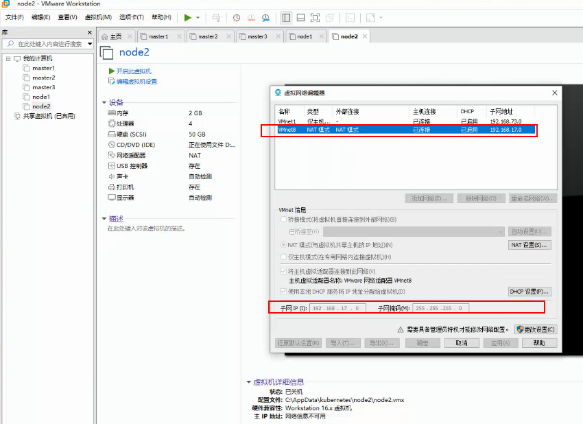

 

####  2、选择启动centos 安装

语言选择简体中文

 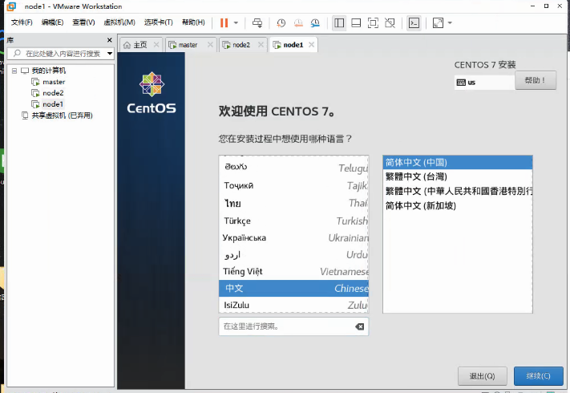

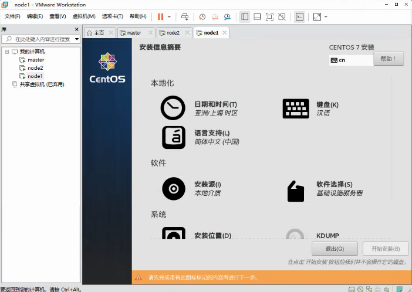

 软件选择：基础设施服务器

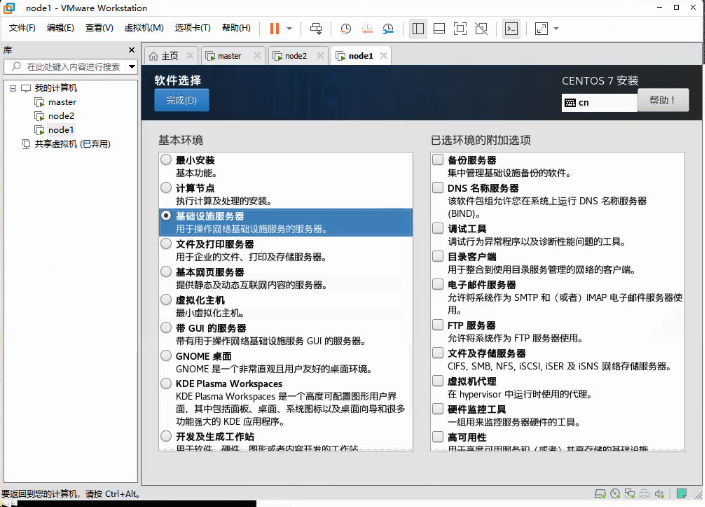

 网络和主机名：打开以太网开关

 修改主机名，与我们规划虚拟机名一致，方便管理

 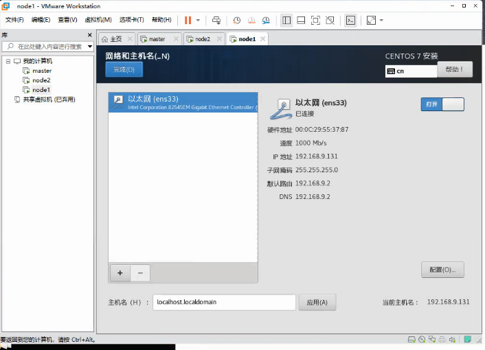

 配置网络，添加地址与子掩码、网关、DNS服务器，文章开头有标注

 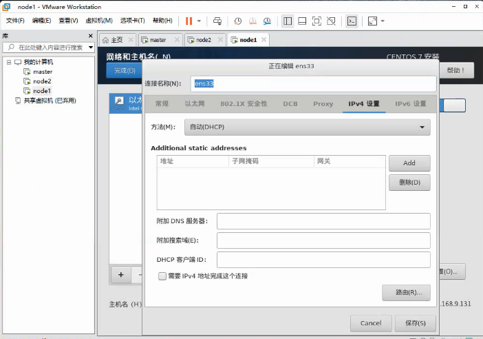

 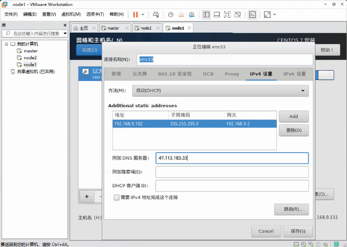

 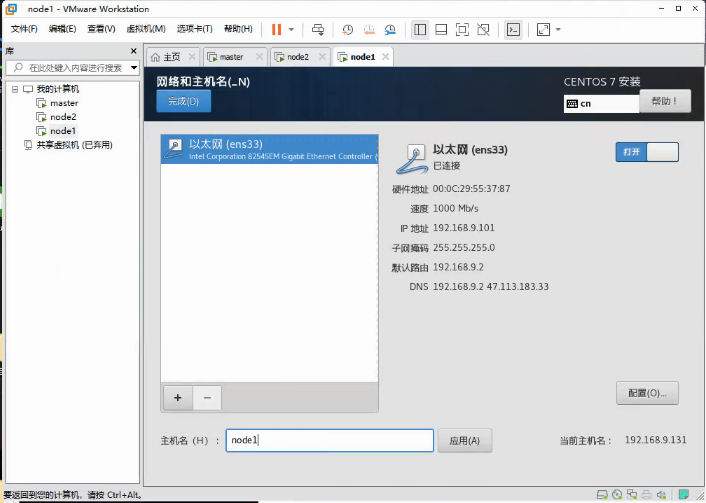

 设置root密码

 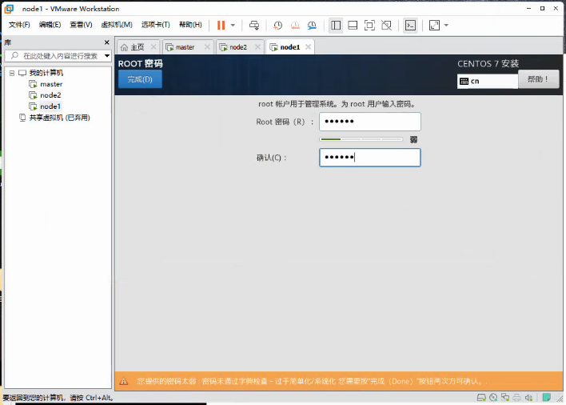

### 三、环境初始化（五台虚拟机相同操作）

查看系统发行版本

 cat /etc/redhat-release

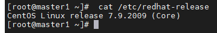

#### 1、设置主机域名解析

[](javascript:void(0);)

```
#主机名解析
vim /etc/hosts
#添加内容
192.168.17.101 master1
192.168.17.102 master2
192.168.17.103 master3
192.168.17.104 node1
192.168.17.105 node2
```

[](javascript:void(0);)

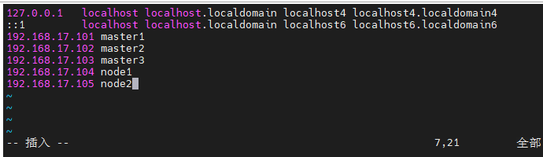

#### 2、启动时间同步

```
#启动chrony服务
systemctl start chronyd
#开机自启
systemctl enable chronyd
#date
```

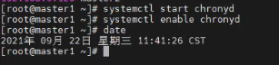

#### 3、禁用iptable和firewalld服务

```
systemctl stop firewalld && systemctl disable firewalld
systemctl stop iptables && systemctl disable iptables
```

 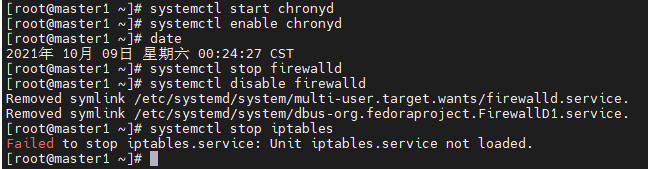

#### 4、禁用selinux,将SELINUX改为disabled

```
vim /etc/selinux/config
```

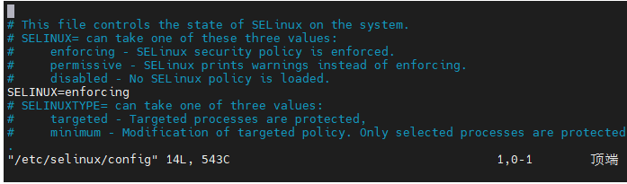

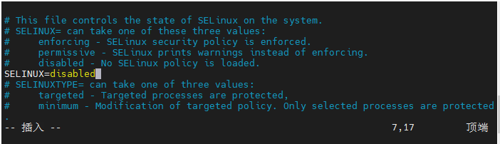

#### 5、禁用swap分区,注释掉/dev/mapper/centos-swap swap 

```
vim /etc/fstab
#/dev/mapper/centos-swap swap 
```

 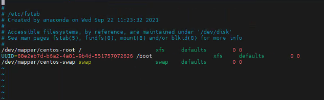

 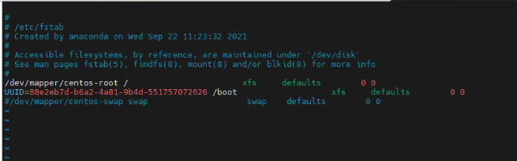

#### 6、修改内核参数，新建文件

```
vim /etc/sysctl.d/kubernetes.conf
```

\#添加内容

```
net.bridge.bridge-nf-call-ip6tables  = 1
net.bridge.bridge-nf-call-iptables  = 1 
net.ipv4.ip_forward =1
```

[](javascript:void(0);)

```
#重新加载配置
sysctl -p
#加载网桥过滤模块
modprobe br_netfilter
#查看网桥过滤模块是否加载成功
lsmod | grep br_netfilter
```

[](javascript:void(0);)

 

#### 7、配置ipvs功能

```
yum install ipset ipvsadm -y
```


[](javascript:void(0);)

```
cat <<EOF > /etc/sysconfig/modules/ipvs.modules
#!/bin/bash
modprobe -- ip_vs
modprobe -- ip_vs_rr
modprobe -- ip_vs_wrr
modprobe -- ip_vs_sh
modprobe -- nf_conntrack_ipv4
EOF
```

[](javascript:void(0);)

 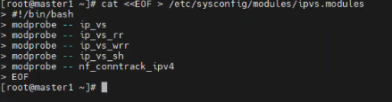

[](javascript:void(0);)

```
 #为脚本添加执行权限
chmod +x /etc/sysconfig/modules/ipvs.modules
#执行脚本
/bin/bash /etc/sysconfig/modules/ipvs.modules
#查看模块是否加载成功
lsmod |grep -e ip_vs -e nf_conntrack_ipv4
```

[](javascript:void(0);)

 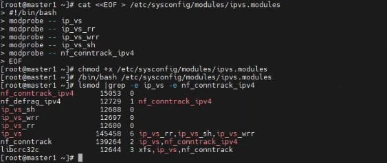

#### 8、重启服务器

```
reboot
```

###  四、kubernetes高可用集群搭建

#### 1、docker 安装

切换镜像

```
wget https://mirrors.aliyun.com/docker-ce/linux/centos/docker-ce.repo -O /etc/yum.repos.d/docker-ce.repo
```

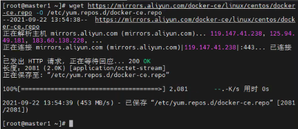

```
#查看当前镜像源中支持的docker版本
yum list docker-ce --showduplicates
#安装最新版本docker-ce
yum install  docker-ce
```

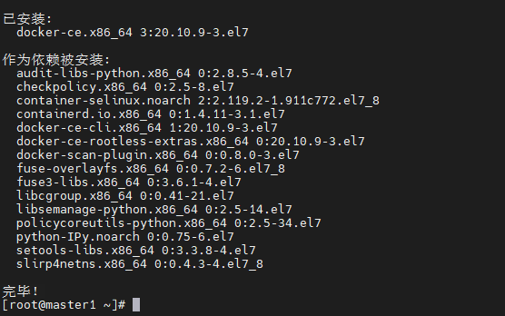

[](javascript:void(0);)

```
#添加配置文件
mkdir /etc/docker
cat <<EOF > /etc/docker/daemon.json
{
   "registry-mirrors": ["https://eeu0s9el.mirror.aliyuncs.com"],
   "exec-opts": ["native.cgroupdriver=systemd"]
}
EOF
```

[](javascript:void(0);)

 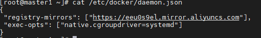

```
#启动docker，设置开机自启
systemctl restart docker
systemctl enable docker
```

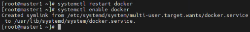

```
#检查版本
docker version
```

 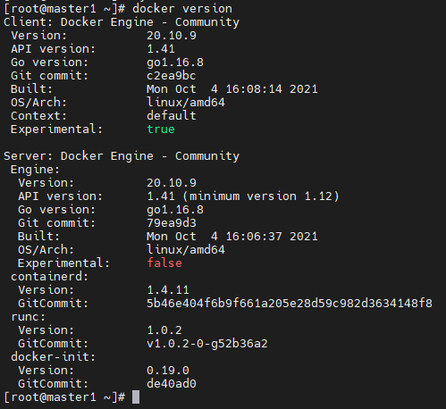

####  2、kubernetes 镜像准备

##### ①添加阿里云的YUM软件源

[](javascript:void(0);)

```
cat > /etc/yum.repos.d/kubernetes.repo << EOF
[kubernetes]
name=Kubernetes
baseurl=https://mirrors.aliyun.com/kubernetes/yum/repos/kubernetes-el7-x86_64
enabled=1
gpgcheck=0
repo_gpgcheck=0
gpgkey=https://mirrors.aliyun.com/kubernetes/yum/doc/yum-key.gpg 
　　　　 https://mirrors.aliyun.com/kubernetes/yum/doc/rpm-package-key.gpg
EOF
```

[](javascript:void(0);)

##### ②安装kubeadm、kubelet和kubectl

```
yum install -y kubelet kubeadm kubectl

# 为了实现Docker使用的cgroup drvier和kubelet使用的cgroup drver一致，建议修改"/etc/sysconfig/kubelet"文件的内容：
vim /etc/sysconfig/kubelet
# 修改为以下内容
KUBELET_CGROUP_ARGS="--cgroup-driver=systemd"
KUBE_PROXY_MODE="ipvs"


# 设置为开机启动即可
systemctl enable kubelet

```

##### ③查看kubeadm建议软件版本、拉取镜像

```
kubeadm config images list
```

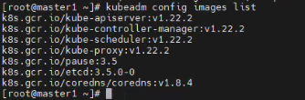

[](javascript:void(0);)

```
images=( 
     kube-apiserver:v1.22.2
     kube-controller-manager:v1.22.2
     kube-scheduler:v1.22.2
     kube-proxy:v1.22.2
     pause:3.5
     etcd:3.5.0-0
)
```

[](javascript:void(0);)

```
for imageName in ${images[@]} ; do
   docker pull registry.cn-hangzhou.aliyuncs.com/google_containers/$imageName
   docker tag registry.cn-hangzhou.aliyuncs.com/google_containers/$imageName k8s.gcr.io/$imageName
   docker rmi registry.cn-hangzhou.aliyuncs.com/google_containers/$imageName
done
docker pull coredns/coredns:1.8.4
docker images
docker tag coredns/coredns:1.8.4 k8s.gcr.io/coredns/coredns:v1.8.4
docker rmi coredns/coredns:1.8.4
docker images
```

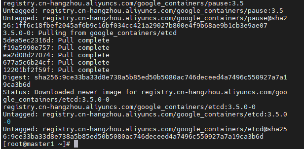

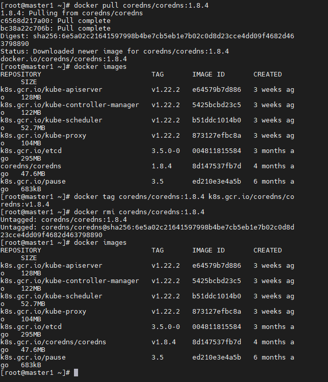

#### 3、所有master节点安装keepalived haproxy

##### ①安装 keepalived

```
yum install -y keepalived
```

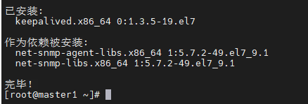

不同master节点创建不同配置。

 master1 配置：

[](javascript:void(0);)

```
cat > /etc/keepalived/keepalived.conf <<EOF
! Configuration File for keepalived

global_defs {        #全局定义部分
   router_id master #Keepalived服务器的路由标识，自定义
}
vrrp_script check-haproxy { #定义vrrp脚本
    #检查所在节点的 haproxy 进程是否正常。如果异常则将权重减少3
    script "killall -0 haproxy" #要执行的命令
    interval 5                  #脚本调用时间
    weight -3                   #根据权重值调整vrrp实例的优先级，默认为0
    fall 10                     #需要失败多少次，vrrp才进行角色状态切换(从正常切换为fault)
    rise 2                      #需要成功多少次，vrrp才进行角色状态切换(从fault切换为正常)
}
vrrp_instance VI_1 {
    state MASTER      #指定Master或者BACKUP，必须大写
    interface ens33   #监听的实际网口,VIP所在接口
    dont_track_primary
    virtual_router_id 10  #VIP末段
    priority 100          #权重值，数字越大优先级越高，谁的优先级高谁就是master，该项取值范围是1-255（在此范围之外会被识别成默认值100）
    advert_int 3          #发送组播包的间隔时间，默认为1秒
    track_script {
        check-haproxy
    }
    virtual_ipaddress {
        192.168.17.10/24  #vip地址
    }
}
EOF
```

[](javascript:void(0);)

 master2 配置：

[](javascript:void(0);)

```
cat > /etc/keepalived/keepalived.conf <<EOF
! Configuration File for keepalived
global_defs {
   router_id master
}
vrrp_script check-haproxy {
    script "killall -0 haproxy"
    interval 5
    weight -3
    fall 10
    rise 2
}
vrrp_instance VI_1 {
    state BACKUP
    interface ens33
    virtual_router_id 10
    dont_track_primary
    priority 99
    advert_int 3
    track_script {
        check-haproxy
    }
    virtual_ipaddress {
        192.168.17.10/24
    }
}
EOF
```

[](javascript:void(0);)

 master3 配置：

[](javascript:void(0);)

```
cat > /etc/keepalived/keepalived.conf <<EOF
! Configuration File for keepalived
global_defs {
   router_id master
}
vrrp_script check-haproxy {
    script "killall -0 haproxy"
    interval 5
    weight -3
    fall 10
    rise 2
}
vrrp_instance VI_1 {
    state BACKUP
    interface ens33
    virtual_router_id 10
    dont_track_primary
    priority 98
    advert_int 3
    track_script {
        check-haproxy
    }
    virtual_ipaddress {
        192.168.17.10/24
    }
}
EOF
```

[](javascript:void(0);)

所有master节点执行开机自启设置

```
systemctl start keepalived && systemctl enable keepalived
```

查看是否生效

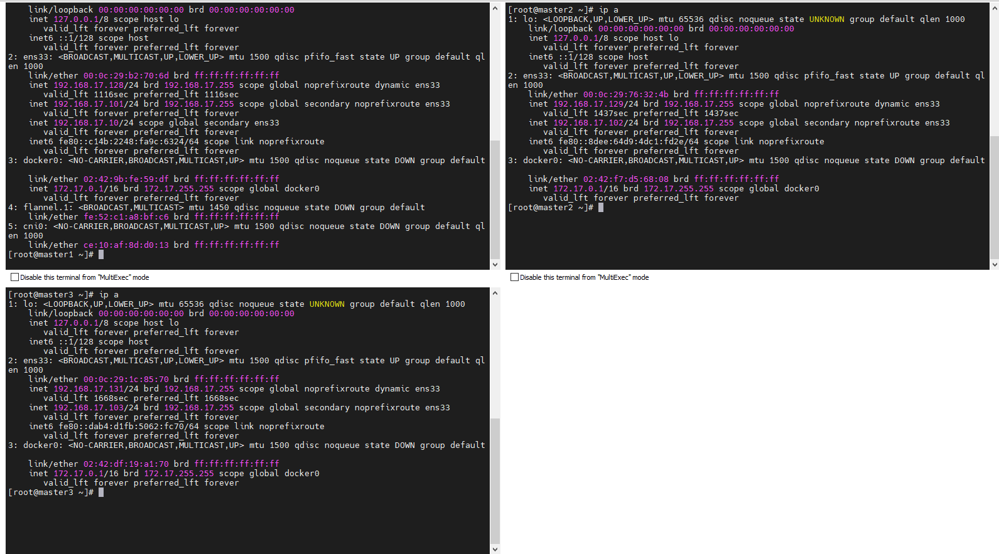

 

 

 看到此vip后，尝试停掉master1的keepalived服务，查看vip是否能漂移到master2，并且重新启动master1的keepalived服务，查看vip是否能正常漂移回来，能漂移回来，证明配置没有问题

##### ② 安装 haproxy

```
yum install -y haproxy
```

创建配置文件：

[](javascript:void(0);)

```
cat > /etc/haproxy/haproxy.cfg <<EOF
global
    log /dev/log    local0
    log /dev/log    local1 notice
    chroot /var/lib/haproxy
    stats socket /var/run/haproxy-admin.sock mode 660 level admin
    stats timeout 30s
    user haproxy
    group haproxy
    daemon
    nbproc 1

defaults
    log     global
    timeout connect 5000
    timeout client  10m
    timeout server  10m

listen  admin_stats
    bind 0.0.0.0:10080
    mode http
    log 127.0.0.1 local0 err
    stats refresh 30s
    stats uri /status
    stats realm welcome login\ Haproxy
    stats auth admin:123456
    stats hide-version
    stats admin if TRUE

listen kube-master
    bind 0.0.0.0:8443
    mode tcp
    option tcplog
    balance source
    server 192.168.17.101 192.168.17.101:6443 check inter 2000 fall 2 rise 2 weight 1
    server 192.168.17.102 192.168.17.102:6443 check inter 2000 fall 2 rise 2 weight 1
    server 192.168.17.103 192.168.17.103:6443 check inter 2000 fall 2 rise 2 weight 1
EOF
```

[](javascript:void(0);)

```
#设置开机自启
systemctl enable haproxy && systemctl restart haproxy
#查看是否启动完成
netstat -lntup|grep haproxy
```

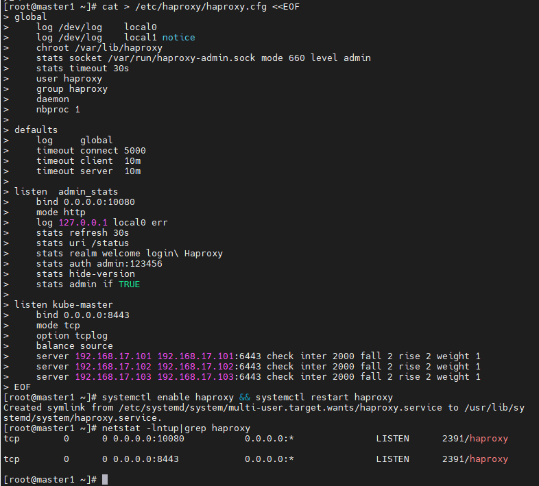

#### 4、`初始化集群`

##### ①创建配置文件`（在具有vip的master上操作，这里为master1）`

[](javascript:void(0);)

```
cat > kubeadm-config.yaml << EOF
apiVersion: kubeadm.k8s.io/v1beta3
kind: ClusterConfiguration
kubernetesVersion: v1.22.2
apiServer:
  certSANs:
  - 192.168.17.101  #master1
  - 192.168.17.102  #master2
  - 192.168.17.103  #master3
  - 192.168.17.10   #VIP
  extraArgs:
    authorization-mode: Node,RBAC
  timeoutForControlPlane: 4m0s
#vip地址
controlPlaneEndpoint: 192.168.17.10:6443
#已预拉镜像，初始化可不指定
#imageRepository: registry.cn-hangzhou.aliyuncs.com/google_containers

networking:
  podSubnet: 10.244.0.0/16
  serviceSubnet: 10.96.0.0/12

EOF
```

[](javascript:void(0);)

##### ②初始化集群`（在具有vip的master上操作，这里为master1）`

```
kubeadm init --config=kubeadm-config.yaml --upload-certs
# 在master1节点执行，这里的命令是kubeadm init命令执行后，提示出来的
mkdir -p $HOME/.kube
sudo cp -i /etc/kubernetes/admin.conf $HOME/.kube/config
sudo chown $(id -u):$(id -g) $HOME/.kube/config
```

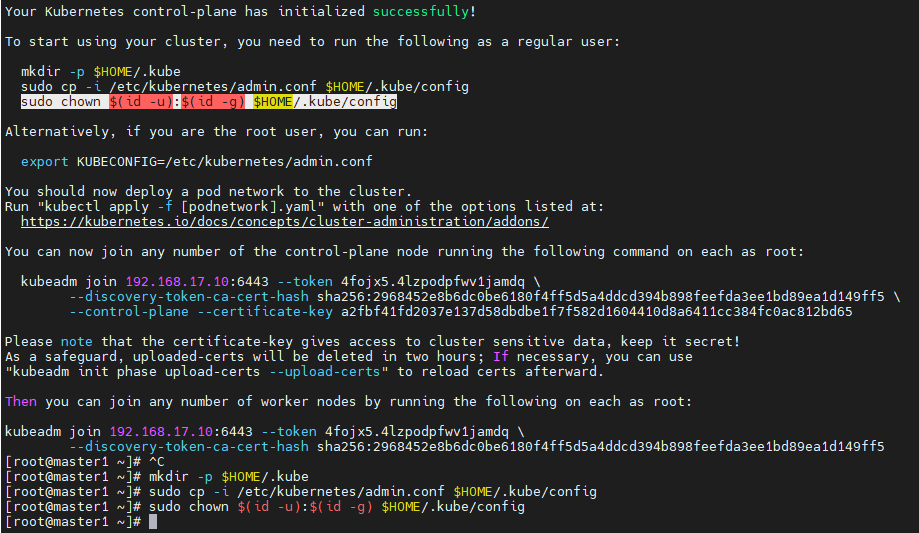 

##### ③部署CNI网络插件flannel`（在具有vip的master上操作，这里为master1）`

```
kubectl apply -f https://raw.githubusercontent.com/coreos/flannel/master/Documentation/kube-flannel.yml
```

若访问拒绝可使用使用以下载修改过镜像地址的kube-flannel.yml

 View Code

##### ④ master2，master3执行第一条join 命令， node1 node2执行第二条join命令加入集群

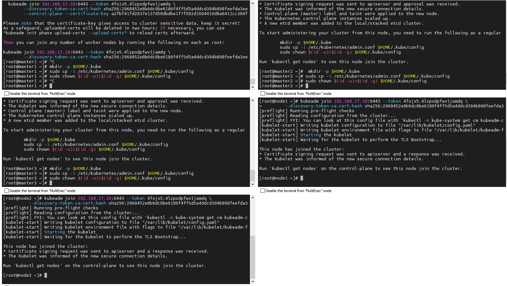

 ⑤ 查看系统pod 和节点状态

```
# 查看部署CNI网络插件运行状态
kubectl get pods -n kube-system
# 在状态都为Running时，查看节点状态
kubectl get nodes
```

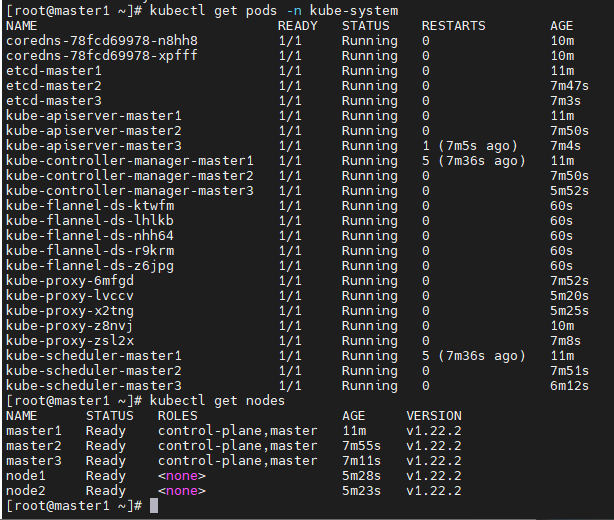

### 五、测试

[](javascript:void(0);)

```
#创建测试命名空间
kubectl create ns dev
#部署nginx
kubectl create deployment  nginx --image=nginx:1.17.1 -n dev
#暴露端口
kubectl expose deployment nginx -n dev --port=80 --type=NodePort
#查看服务状态
kubectl get pods,svc -n dev
```

[](javascript:void(0);)

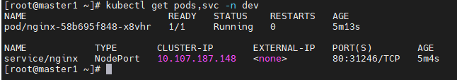

 浏览器访问VIP地址与31246端口，能访问到则部署成功

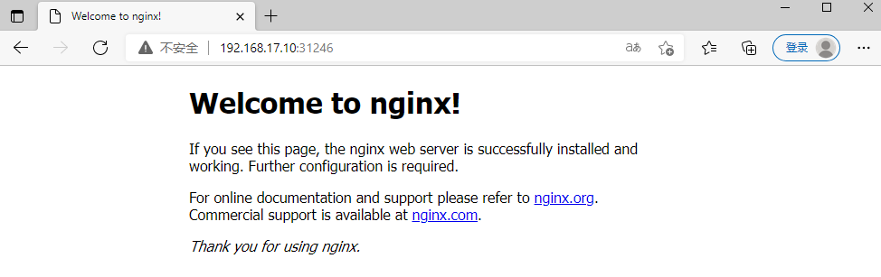

 

 

 

### 六、所遇问题解决

#### 1、如图所示，如果coredns一直处于Pending状态，查看网络插件是否安装完成flannel

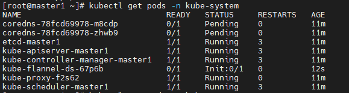

#### 2、当node节点超过24小时再加入，可再master节点使用以下命令生成

```
kubeadm token create --print-join-command
```


####  3、环境还原

```
#如果环境出现问题，尽最大努力还原通过 'kubeadm init' 或者 'kubeadm join' 操作对主机所做的更改
kubeadm reset
rm -rf $HOME/.kube
```

#### 4、虚拟机所有节点挂起，宿主机关机，再次开机vip丢失，master1节点重启即可

 