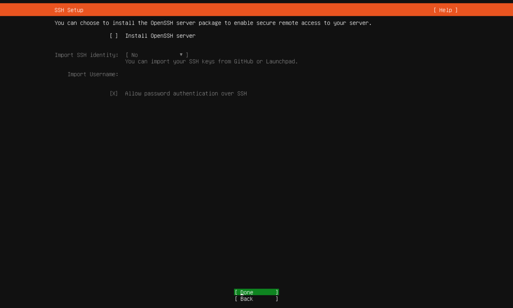
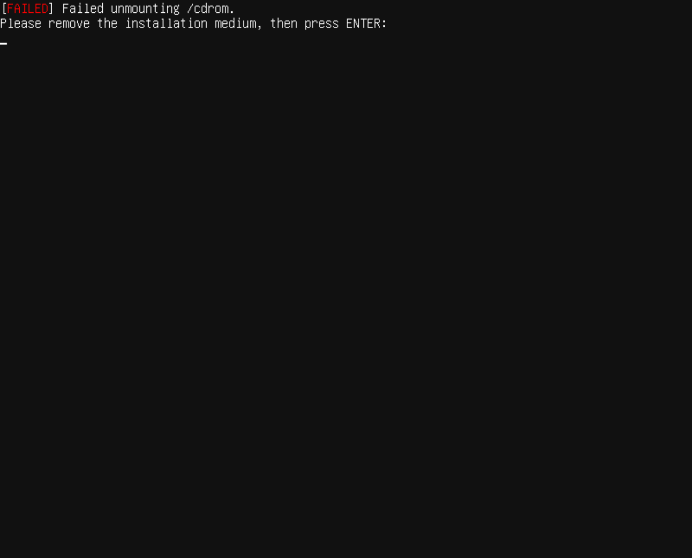

## 在vmware上安装ubuntu系统

下载ubuntu镜像文件

https://ubuntu.com/


服务器版

https://mirrors.bupt.edu.cn/ubuntu-releases/22.04.3/ubuntu-22.04.3-live-server-amd64.iso

桌面版

https://mirrors.bupt.edu.cn/ubuntu-releases/22.04.3/ubuntu-22.04.3-desktop-amd64.iso


这里使用服务器版


开始安装系统


https://mirrors.aliyun.com/ubuntu/


tom / 123456

服务器名根据规划设置 : k8s-master01








做系统快照 1 : os_installed


## 3 配置root远程登录

登录 tom / 123456


设置root密码

```bash
sudo passwd root
```

第一次输入当前账号的密码

然后输入两次为root账号设置的密码 123456

```bash
exit
```

用root账号登录

root / 123456


设置ssh

```bash
apt install -y openssh-server
```

修改允许远程登录：

将 /etc/ssh/sshd_config 中的配置行 PermitRootLogin prohibit-password 修改为  PermitRootLogin yes

```shell
sudo vi /etc/ssh/sshd_config
```

或者

```shell
sudo sed -i 's/#PermitRootLogin prohibit-password/PermitRootLogin yes/' /etc/ssh/sshd_config
```

重启ssh:

```bash
sudo systemctl restart ssh
```


通过 ssh工具连接ubuntu


做系统快照 2 : ssh


使用shell工具连接所有节点


## 4 配置 host 信息

所有节点 查看 hostname 

```shell
hostname
```

如果由于某些原因在系统安装是没有设置好指定的hostname, 可以通过下面的指令修改, 例如将设置第一个主节点的 hostname, 其他所有节点类似,根据节点规划设置 hostname :

```shell
sudo hostnamectl set-hostname k8s-master01
```

编辑hosts文件

```shell
 vi /etc/hosts
```

注意如果在上面修改了hostname, 在这里也需要做更新 127.0.0.1 对应的域名为更新后的 hostname

```shell
127.0.0.1 localhost
127.0.1.1 k8s-master01

# The following lines are desirable for IPv6 capable hosts
::1     ip6-localhost ip6-loopback
fe00::0 ip6-localnet
ff00::0 ip6-mcastprefix
ff02::1 ip6-allnodes
ff02::2 ip6-allrouters
```

所有节点都在 hosts文件中的最后添加下面的内容

```shell
192.168.0.151 k8s-master01
192.168.0.152 k8s-master02
192.168.0.153 k8s-master03
192.168.0.161 k8s-worker01
192.168.0.162 k8s-worker02
192.168.0.163 k8s-worker03
192.168.0.250 k8s-loadbalancer
```

所有节点都执行测试:

```shell
ping -c 4 k8s-master01
ping -c 4 k8s-master02
ping -c 4 k8s-master03
ping -c 4 k8s-worker01
ping -c 4 k8s-worker02
ping -c 4 k8s-worker03
ping -c 4 k8s-loadbalancer
```

确保所有节点都相互可以ping通


## 5 SSH远程免密登录


集群的各个服务器之间，可以相互信任，设置免密登录

1 生成密钥对

在所有节点执行

```shell
ssh-keygen -t rsa
```

按照默认设置, 输入三次enter即可生成密钥对


2 授权
授权的过程其实就是将A服务器的公钥分别给自己、B、C都拷贝一份。使用命令

```
ssh-copy-id k8s-master01
ssh-copy-id k8s-master02
ssh-copy-id k8s-master03
ssh-copy-id k8s-worker01
ssh-copy-id k8s-worker02
ssh-copy-id k8s-worker03
ssh-copy-id k8s-loadbalancer
```


```bash
ssh-copy-id 192.168.0.151
ssh-copy-id 192.168.0.152
ssh-copy-id 192.168.0.153
ssh-copy-id 192.168.0.161
ssh-copy-id 192.168.0.162
ssh-copy-id 192.168.0.163
ssh-copy-id 192.168.0.250
```


命令执行期间根据提示输入目标节点的 root 密码 和 yes


测试, 所有节点依次执行下列命令

```bash
ssh root@k8s-master01
ssh root@k8s-master02
ssh root@k8s-master03
ssh root@k8s-worker01
ssh root@k8s-worker02
ssh root@k8s-worker03
ssh root@k8s-loadbalancer

ssh root@192.168.0.151
ssh root@192.168.0.152
ssh root@192.168.0.153
ssh root@192.168.0.161
ssh root@192.168.0.162
ssh root@192.168.0.163
ssh root@192.168.0.250
```

每次正确进入目标节点后执行

```shell
exit
```

退出即可