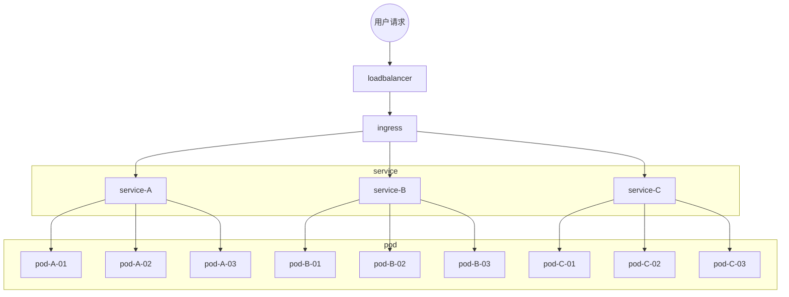

## k8s-ingress

https://kubernetes.github.io/ingress-nginx/

https://kubernetes.io/docs/concepts/services-networking/ingress/

https://zhuanlan.zhihu.com/p/499462908


ingress 是入口的意思，k8s希望ingress是整个集群的入口。所有的流量先经过ingress，ingress再将流量分发给各个service。**ingress是service的统一网关入口**


ingress底层是基于nginx，可以根据不同的规则将请求转发给不同的服务，比如：

order.my-company.com转给 order服务，order服务再将请求负载均衡到pod

user.my-company.com转给 user服务，order服务再将请求负载均衡到pod

my-company.com/product 转给 product 服务，product 服务再将请求负载均衡到pod


### 安装ingress

https://github.com/kubernetes/ingress-nginx

https://kubernetes.github.io/ingress-nginx/deploy/

```bash
kubectl apply -f https://raw.githubusercontent.com/kubernetes/ingress-nginx/controller-v1.8.0/deploy/static/provider/baremetal/deploy.yaml
```

无法下载就使用浏览器下载


### 安装nerdctl

https://github.com/containerd/nerdctl

https://github.com/containerd/nerdctl/releases

https://blog.csdn.net/catoop/article/details/128033743

nerdctl 是用于 containerd 并且 兼容 docker cli 习惯的管理工具，主要适用于刚从 docker 转到 containerd 的用户，操作 containerd 的命令行工具 ctr 和 crictl 不怎么好用，所以就有了 nerdctl。要特别说明的是：nerdctl 操作的是 containerd 而非 docker，所以 nerdctl images 和 docker images 看到的内容不同，它只是用法保持了 docker cli 的习惯，实质上操作的是 containerd。

下载nerdctl

https://github.com/containerd/nerdctl/releases

https://github.com/containerd/nerdctl/releases/download/v1.4.0/nerdctl-1.4.0-linux-amd64.tar.gz

上传到服务器后执行：

```bash
tar Cxzvvf /usr/local/bin nerdctl-1.4.0-linux-amd64.tar.gz
```

```bash
-rwxr-xr-x root/root  24379392 2023-05-20 22:30 nerdctl
-rwxr-xr-x root/root     21622 2023-05-20 22:29 containerd-rootless-setuptool.sh
-rwxr-xr-x root/root      7187 2023-05-20 22:29 containerd-rootless.sh
```

查看版本：

```bash
nerdctl --version
```

```bash
root@k8s-master01:~# nerdctl --version
nerdctl version 1.4.0
```


查看名称空间

```bash
nerdctl namespace ls
```

```bash
root@k8s-master01:~# nerdctl namespace ls
NAME      CONTAINERS    IMAGES    VOLUMES    LABELS
k8s.io    34            27        0
```


列出k8s.io名称空间下的镜像

```bash
nerdctl -n <namespace-name> images
```

没有  -n 参数默认为 default

```bash
root@k8s-master01:~# nerdctl -n k8s.io images
REPOSITORY                                                         TAG        IMAGE ID        CREATED         PLATFORM       SIZE         BLOB SIZE
flannel/flannel-cni-plugin                                         v1.1.2     bf4b62b13166    22 hours ago    linux/amd64    8.2 MiB      3.7 MiB
flannel/flannel-cni-plugin                                         <none>     bf4b62b13166    22 hours ago    linux/amd64    8.2 MiB      3.7 MiB
flannel/flannel                                                    v0.22.0    5f83f1243057    22 hours ago    linux/amd64    69.7 MiB     25.6 MiB
flannel/flannel                                                    <none>     5f83f1243057    22 hours ago    linux/amd64    69.7 MiB     25.6 MiB
registry.aliyuncs.com/google_containers/coredns                    v1.10.1    a0ead06651cf    22 hours ago    linux/amd64    51.1 MiB     15.4 MiB
registry.aliyuncs.com/google_containers/coredns                    <none>     a0ead06651cf    22 hours ago    linux/amd64    51.1 MiB     15.4 MiB
registry.aliyuncs.com/google_containers/etcd                       3.5.7-0    51eae8381dcb    22 hours ago    linux/amd64    285.8 MiB    96.9 MiB
registry.aliyuncs.com/google_containers/etcd                       <none>     51eae8381dcb    22 hours ago    linux/amd64    285.8 MiB    96.9 MiB
registry.aliyuncs.com/google_containers/kube-apiserver             v1.27.3    fd03335dd2e7    22 hours ago    linux/amd64    118.9 MiB    31.8 MiB
registry.aliyuncs.com/google_containers/kube-apiserver             <none>     fd03335dd2e7    22 hours ago    linux/amd64    118.9 MiB    31.8 MiB
registry.aliyuncs.com/google_containers/kube-controller-manager    v1.27.3    1ad8df2b525e    22 hours ago    linux/amd64    111.1 MiB    29.5 MiB
registry.aliyuncs.com/google_containers/kube-controller-manager    <none>     1ad8df2b525e    22 hours ago    linux/amd64    111.1 MiB    29.5 MiB
registry.aliyuncs.com/google_containers/kube-proxy                 v1.27.3    fb2bd59aae95    22 hours ago    linux/amd64    72.1 MiB     22.8 MiB
registry.aliyuncs.com/google_containers/kube-proxy                 <none>     fb2bd59aae95    22 hours ago    linux/amd64    72.1 MiB     22.8 MiB
registry.aliyuncs.com/google_containers/kube-scheduler             v1.27.3    77b8db7564e3    22 hours ago    linux/amd64    59.5 MiB     17.4 MiB
registry.aliyuncs.com/google_containers/kube-scheduler             <none>     77b8db7564e3    22 hours ago    linux/amd64    59.5 MiB     17.4 MiB
registry.aliyuncs.com/google_containers/pause                      3.9        7031c1b28338    22 hours ago    linux/amd64    732.0 KiB    314.0 KiB
registry.aliyuncs.com/google_containers/pause                      <none>     7031c1b28338    22 hours ago    linux/amd64    732.0 KiB    314.0 KiB
<none>                                                             <none>     fd03335dd2e7    22 hours ago    linux/amd64    118.9 MiB    31.8 MiB
<none>                                                             <none>     5f83f1243057    22 hours ago    linux/amd64    69.7 MiB     25.6 MiB
<none>                                                             <none>     77b8db7564e3    22 hours ago    linux/amd64    59.5 MiB     17.4 MiB
<none>                                                             <none>     fb2bd59aae95    22 hours ago    linux/amd64    72.1 MiB     22.8 MiB
<none>                                                             <none>     bf4b62b13166    22 hours ago    linux/amd64    8.2 MiB      3.7 MiB
<none>                                                             <none>     1ad8df2b525e    22 hours ago    linux/amd64    111.1 MiB    29.5 MiB
<none>                                                             <none>     51eae8381dcb    22 hours ago    linux/amd64    285.8 MiB    96.9 MiB
<none>                                                             <none>     7031c1b28338    22 hours ago    linux/amd64    732.0 KiB    314.0 KiB
<none>                                                             <none>     a0ead06651cf    22 hours ago    linux/amd64    51.1 MiB     15.4 MiB
```


通过配置文件来生成默认的名称空间

```bash
cd /etc
mkdir nerdctl
cd nerdctl
vi nerdctl.toml
```

输入：

```bash
namespace="k8s.io"
```

保存即可。


然后再通过指令查看镜像

```bash
nerdctl images
```

可以显示出k8s.io命名空间下的镜像就说明默认命名空间已经改为了 k8s.io


在ingress的yaml文件中搜索`image:` 找到所需要的镜像，

```yaml
image: registry.k8s.io/ingress-nginx/controller:v1.8.0@sha256:744ae2afd433a395eeb13dc03d3313facba92e96ad71d9feaafc85925493fee3

image: registry.k8s.io/ingress-nginx/kube-webhook-certgen:v20230407@sha256:543c40fd093964bc9ab509d3e791f9989963021f1e9e4c9c7b6700b02bfb227b

image: registry.k8s.io/ingress-nginx/kube-webhook-certgen:v20230407@sha256:543c40fd093964bc9ab509d3e791f9989963021f1e9e4c9c7b6700b02bfb227b
```

在dockerhub上搜索

https://hub.docker.com/r/dyrnq/kube-webhook-certgen/tags

https://hub.docker.com/r/dyrnq/ingress-nginx-controller/tags

可以看到这两个镜像符合需求。

手动下载镜像，将`docker pull`  替换为 `nerdctl pull` 即可

```bash
nerdctl pull dyrnq/kube-webhook-certgen:v20230407
nerdctl pull dyrnq/ingress-nginx-controller:v1.8.0
```

下载完成后修改镜像的tag为ingress安装yaml文件中的tag

```bash
nerdctl tag dyrnq/kube-webhook-certgen:v20230407 registry.k8s.io/ingress-nginx/kube-webhook-certgen:v20230407
```

```bash
nerdctl tag dyrnq/ingress-nginx-controller:v1.8.0 registry.k8s.io/ingress-nginx/controller:v1.8.0
```

删除ingress配置文件yaml中的镜像地址后的校验码，将

```yaml
image: registry.k8s.io/ingress-nginx/controller:v1.8.0@sha256:744ae2afd433a395eeb13dc03d3313facba92e96ad71d9feaafc85925493fee3

image: registry.k8s.io/ingress-nginx/kube-webhook-certgen:v20230407@sha256:543c40fd093964bc9ab509d3e791f9989963021f1e9e4c9c7b6700b02bfb227b

image: registry.k8s.io/ingress-nginx/kube-webhook-certgen:v20230407@sha256:543c40fd093964bc9ab509d3e791f9989963021f1e9e4c9c7b6700b02bfb227b
```

修改为

```yaml
image: registry.k8s.io/ingress-nginx/controller:v1.8.0

image: registry.k8s.io/ingress-nginx/kube-webhook-certgen:v20230407

image: registry.k8s.io/ingress-nginx/kube-webhook-certgen:v20230407
```

修改完成后将文件上传至master节点，执行

```bash
kubectl apply -f deploy.yaml
```

即可完成安装。安装完成之后查看pod

```text
kubectl get pod -n ingress-nginx
```

```bash
root@k8s-master01:~# kubectl get pod -n ingress-nginx
NAME                                        READY   STATUS      RESTARTS   AGE
ingress-nginx-admission-create-kd82p        0/1     Completed   0          9m8s
ingress-nginx-admission-patch-xbcq4         0/1     Completed   0          9m8s
ingress-nginx-controller-5d6b74cf5c-td4c5   1/1     Running     0          9m8s
```

注意看到 `ingress-nginx-controller`的状态为`Running` 说明已经正常运行了。

查看生成的服务：

```bash
kubectl get service -n ingress-nginx
```

```bash
root@k8s-master01:~# kubectl get service -n ingress-nginx
NAME                                 TYPE        CLUSTER-IP     EXTERNAL-IP   PORT(S)                      AGE
ingress-nginx-controller             NodePort    10.96.24.153   <none>        80:32477/TCP,443:32448/TCP   9m44s
ingress-nginx-controller-admission   ClusterIP   10.96.12.230   <none>        443/TCP                      9m44s
```

注意到这里ingress开启了服务

```bash
ingress-nginx-controller             NodePort    10.96.24.153   <none>        80:32477/TCP,443:32448/TCP   9m44s
```

并且通过NodePort开启了2个端口 32477(http)、32448(https)。如果系统有防火墙注意要将这两个端口开放，这样外部才能正常访问。

浏览器上访问任意节点

```bash
http://192.168.0.112:32477/
http://192.168.0.113:32477/
http://192.168.0.114:32477/
```

由于还没有配置被代理的服务，所以都是返回404


### 测试ingress

创建下面的配置文件：

```yaml
vi ingress-test.yaml
```

输入：

```yaml
apiVersion: apps/v1
kind: Deployment
metadata:
  name: hello-server
spec:
  replicas: 2
  selector:
    matchLabels:
      app: hello-server
  template:
    metadata:
      labels:
        app: hello-server
    spec:
      containers:
      - name: hello-server
        image: registry.cn-hangzhou.aliyuncs.com/lfy_k8s_images/hello-server
        ports:
        - containerPort: 9000
---
apiVersion: apps/v1
kind: Deployment
metadata:
  labels:
    app: nginx-demo
  name: nginx-demo
spec:
  replicas: 2
  selector:
    matchLabels:
      app: nginx-demo
  template:
    metadata:
      labels:
        app: nginx-demo
    spec:
      containers:
      - image: nginx
        name: nginx
---
apiVersion: v1
kind: Service
metadata:
  labels:
    app: nginx-demo
  name: nginx-demo
spec:
  selector:
    app: nginx-demo
  ports:
  - port: 8000
    protocol: TCP
    targetPort: 80
---
apiVersion: v1
kind: Service
metadata:
  labels:
    app: hello-server
  name: hello-server
spec:
  selector:
    app: hello-server
  ports:
  - port: 8000
    protocol: TCP
    targetPort: 9000
```


创建部署和服务

```bash
kubectl apply -f ingress-test.yaml
```

```
root@k8s-master01:~# kubectl apply -f ingress-test.yaml
deployment.apps/hello-server created
deployment.apps/nginx-demo created
service/nginx-demo created
service/hello-server created
```

```bash
root@k8s-master01:~# kubectl get pod
NAME                            READY   STATUS    RESTARTS   AGE
hello-server-78fbfb5466-5td2f   1/1     Running   0          2m13s
hello-server-78fbfb5466-hvg5x   1/1     Running   0          2m13s
my-dep-5688dd958f-hmh8f         1/1     Running   0          16h
my-dep-5688dd958f-j57l5         1/1     Running   0          16h
my-dep-5688dd958f-zrf5p         1/1     Running   0          15h
nginx-demo-7c7dd79bb7-2v6jd     1/1     Running   0          2m13s
nginx-demo-7c7dd79bb7-hrtwr     1/1     Running   0          2m13s
```

可以看到这次部署产生了2个 hello-server 的pod和2个 nginx-demo 的 pod

```bash
root@k8s-master01:~# kubectl get service
NAME           TYPE        CLUSTER-IP     EXTERNAL-IP   PORT(S)          AGE
hello-server   ClusterIP   10.96.122.30   <none>        8000/TCP         2m34s
kubernetes     ClusterIP   10.96.0.1      <none>        443/TCP          23h
my-dep         NodePort    10.96.1.122    <none>        8000:31736/TCP   14h
nginx-demo     ClusterIP   10.96.154.69   <none>        8000/TCP         2m34s
```

此次部署产生了2个服务

```bash
hello-server   ClusterIP   10.96.122.30   <none>        8000/TCP         2m34s
nginx-demo     ClusterIP   10.96.154.69   <none>        8000/TCP         2m34s
```

可以在节点上通过IP：PORT进行访问这2个service

```bash
root@k8s-master01:~# curl 10.96.122.30:8000
Hello World!
```

```bash
root@k8s-master01:~# curl 10.96.154.69:8000
<!DOCTYPE html>
<html>
<head>
<title>Welcome to nginx!</title>
<style>
html { color-scheme: light dark; }
body { width: 35em; margin: 0 auto;
font-family: Tahoma, Verdana, Arial, sans-serif; }
</style>
</head>
<body>
<h1>Welcome to nginx!</h1>
<p>If you see this page, the nginx web server is successfully installed and
working. Further configuration is required.</p>

<p>For online documentation and support please refer to
<a href="http://nginx.org/">nginx.org</a>.<br/>
Commercial support is available at
<a href="http://nginx.com/">nginx.com</a>.</p>

<p><em>Thank you for using nginx.</em></p>
</body>
</html>
```


流量规划：

`hello.test.com` 访问 `hello-server`

`demo.test.com` 访问 `nginx-demo`

创建访问规则：

```bash
vi ingress-rule.yaml
```

```yaml
apiVersion: networking.k8s.io/v1
kind: Ingress  
metadata:
  name: ingress-host-rule
spec:
  ingressClassName: nginx
  rules:
  - host: "hello.test.com"
    http:
      paths:
      - pathType: Prefix
        path: "/"
        backend:
          service:
            name: hello-server
            port:
              number: 8000
  - host: "demo.test.com"
    http:
      paths:
      - pathType: Prefix
        path: "/"
        backend:
          service:
            name: nginx-demo
            port:
              number: 8000
```

说明：

```yaml
metadata:
  name: ingress-host-rule
```

规则名称，可自定义

```yaml
rules:
# 域名需要匹配 hello.test.com
  - host: "hello.test.com"
    http:
      paths:
      # 路径前缀匹配 / ,即 hello.test.com/ 下的请求
      - pathType: Prefix
        path: "/"
        backend:
	      # 匹配的请求转发到 名为 hello-server 的service，端口为 8000
          service:
            name: hello-server
            port:
              number: 8000
```

创建规则

```bash
root@k8s-master01:~# kubectl apply -f ingress-rule.yaml
ingress.networking.k8s.io/ingress-host-rule created
```

查看创建的ingress访问规则：

```bash
root@k8s-master01:~# kubectl get ingress
NAME                CLASS   HOSTS                          ADDRESS         PORTS   AGE
ingress-host-rule   nginx   hello.test.com,demo.test.com   192.168.0.113   80      16m
```


在宿主机配置hosts

```bash
192.168.0.112 hello.test.com
192.168.0.112 demo.test.com
```

任意选取一个节点配置域名解析，这里选择的是 192.168.0.112

在浏览器访问 http://hello.test.com:32477/ 返回

```bash
Hello World!
```

访问 http://demo.test.com:32477/，返回 nginx首页

```bash
Welcome to nginx!
If you see this page, the nginx web server is successfully installed and working. Further configuration is required.

For online documentation and support please refer to nginx.org.
Commercial support is available at nginx.com.

Thank you for using nginx.
```


可以修改访问规则， 希望 `demo.test.com/nginx` 访问 `nginx-demo`,可以直接修改ingress访问规则：

```bash
kubectl edit ingress ingress-host-rule
```

将：

```yaml
  - host: demo.test.com
    http:
      paths:
      - backend:
          service:
            name: nginx-demo
            port:
              number: 8000
        path: /
        pathType: Prefix
```

修改为：

```yaml
  - host: demo.test.com
    http:
      paths:
      - backend:
          service:
            name: nginx-demo
            port:
              number: 8000
        path: /nginx
        pathType: Prefix
```

将path由 / 修改为  /nginx，保存退出

```bash
root@k8s-master01:~# kubectl edit ingress ingress-host-rule
ingress.networking.k8s.io/ingress-host-rule edited
```

此时再访问  http://demo.test.com:32477/  会返回404

```bash
404 Not Found
nginx
```

注意此时的 404 是ingress返回的，没有版本号， 再访问 http://demo.test.com:32477/nginx 也会返回404

```bash
404 Not Found
nginx/1.25.1
```

这个404是由服务 nginx-demo  返回的，带版本号。由于 nginx-demo 的nginx没有 /nginx 资源，所以返回404，可以通过dashboard分别进入2个pod，在容器内创建资源：

```bash
echo 1111 > /usr/share/nginx/html/nginx  
echo 2222 > /usr/share/nginx/html/nginx  
```

再访问 http://demo.test.com:32477/nginx 就会自动下载成名为 `nginx` 的文件，内容是 1111 或者 2222


### 路径重写

https://kubernetes.github.io/ingress-nginx/

https://kubernetes.github.io/ingress-nginx/user-guide/nginx-configuration/annotations/#rewrite

https://kubernetes.github.io/ingress-nginx/examples/rewrite/


实际开发中，通常后端的请求的地址为  http://xxx.test.com/api/product/xxx 这样的格式，经过ingress后希望能将路径上的 /api 删除，这时就需要使用 `ingress`的路径重写 `rewrite` 功能。官方示例：

```yaml
apiVersion: networking.k8s.io/v1
kind: Ingress
metadata:
  annotations:
    nginx.ingress.kubernetes.io/use-regex: "true"
    nginx.ingress.kubernetes.io/rewrite-target: /$2
  name: rewrite
  namespace: default
spec:
  ingressClassName: nginx
  rules:
  - host: rewrite.bar.com
    http:
      paths:
      - path: /something(/|$)(.*)
        pathType: Prefix
        backend:
          service:
            name: http-svc
            port: 
              number: 80
```

```
[Captured groups](https://www.regular-expressions.info/refcapture.html) are saved in numbered placeholders, chronologically, in the form `$1`, `$2` ... `$n`. These placeholders can be used as parameters in the `rewrite-target` annotation.
```

```bash
In this ingress definition, any characters captured by (.*) will be assigned to the placeholder $2, which is then used as a parameter in the rewrite-target annotation.

For example, the ingress definition above will result in the following rewrites:

rewrite.bar.com/something rewrites to rewrite.bar.com/
rewrite.bar.com/something/ rewrites to rewrite.bar.com/
rewrite.bar.com/something/new rewrites to rewrite.bar.com/new
```


要启用高级功能，如路径重写，只需要在规则配置文件中 metadata 部分添加 annotations 即可，如：

```yaml
apiVersion: networking.k8s.io/v1
kind: Ingress  
metadata:
  # 添加注解
  annotations:
    # 添加路径重写，使用 $2 作为路径
    nginx.ingress.kubernetes.io/rewrite-target: /$2
  name: ingress-host-rule
spec:
  ingressClassName: nginx
  rules:
  - host: "hello.test.com"
    http:
      paths:
      - pathType: Prefix
        path: "/"
        backend:
          service:
            name: hello-server
            port:
              number: 8000
  - host: "demo.test.com"
    http:
      paths:
      - pathType: Prefix
        # 捕获规则
        path: "/nginx(/|$)(.*)"
        backend:
          service:
            name: nginx-demo
            port:
              number: 8000
```

更新文件：

```bash
vi ingress-rule.yaml
```

将上述内容覆盖，保存退出后执行

```bash
kubectl apply -f ingress-rule.yaml
Warning: path /nginx(/|$)(.*) cannot be used with pathType Prefix
ingress.networking.k8s.io/ingress-host-rule configured
```

再访问 http://demo.test.com:32477/nginx 又会返回nginx首页

```bash
Welcome to nginx!
If you see this page, the nginx web server is successfully installed and working. Further configuration is required.

For online documentation and support please refer to nginx.org.
Commercial support is available at nginx.com.

Thank you for using nginx.
```

原因就是请求路径中的 /nginx 被改写为了  / ，所有访问的还是nginx主页。


### 流量限制

https://kubernetes.github.io/ingress-nginx/user-guide/nginx-configuration/annotations/#rate-limiting

示例：

```yaml
vi ingress-limit-rate.yaml
```

```
apiVersion: networking.k8s.io/v1
kind: Ingress
metadata:
  name: ingress-limit-rate
  annotations:
    nginx.ingress.kubernetes.io/limit-rps: "1"
spec:
  ingressClassName: nginx
  rules:
  - host: "limit.test.com"
    http:
      paths:
      - pathType: Exact
        path: "/"
        backend:
          service:
            name: nginx-demo
            port:
              number: 8000
```

```bash
kubectl apply -f ingress-limit-rate.yaml
```

这里 - pathType: Exact 表示精确匹配，必须是  limit.test.com/ 才会应用这个规则。在宿主机配置hosts

```bash
192.168.0.112 limit.test.com
```

浏览器访问 http://limit.test.com:32477/ 第一次访问返回：

```bash
Welcome to nginx!
If you see this page, the nginx web server is successfully installed and working. Further configuration is required.

For online documentation and support please refer to nginx.org.
Commercial support is available at nginx.com.

Thank you for using nginx.
```

使用 ctrl+F5 快速刷新则可以看到被限流

```bash
503 Service Temporarily Unavailable
nginx
```


k8s的网络模型



