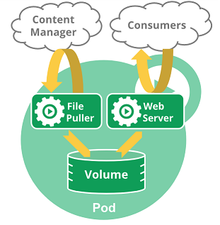
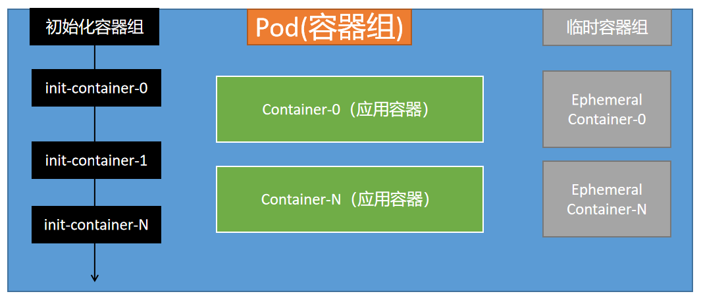

# kubernetes pod

1、什么是 Pod

Pod 是一组（一个或多个） 容器（docker容器）的集合 （就像在豌豆荚中）；这些容器共享存储、网络、以及怎样运行这些容器的声明。


我们一般不直接创建Pod，而是创建一些工作负载由他们来创建Pod  


Pod的形式

Pod对容器有自恢复能力（Pod自动重启失败的容器）

Pod自己不能恢复自己，Pod被删除就真的没了（100，MySQL、Redis、Order）还是希望k8s集群能自己在其他地方再启动这个

Pod

单容器Pod

多容器协同Pod。我们可以把另外的容器称为 SideCar（为应用赋能） 

Pod 天生地为其成员容器提供了两种共享资源：网络和 存储


一个Pod由一个Pause容器设置好整个Pod里面所有容器的网络、名称空间等信息

systemctl status可以观测到。Pod和容器进程关系

kubelet启动一个Pod，准备两个容器，一个是Pod声明的应用容器（nginx），另外一个是Pause。Pause给当前应用容器设置好网络空间各种的。




编写yaml测试：多容器协同  


2、Pod使用  

可以编写deploy等各种工作负载的yaml文件，最终创建出pod，也可以直接创建  

Pod的模板如下  

```yaml
apiVersion: v1
kind: Pod
metadata:
  name: my-pod
spec:
  containers:
  - name: hello
    image: busybox
    command: ['sh', '-c', 'echo "Hello, Kubernetes!" && sleep 3600']
  restartPolicy: OnFailure
```


3、Pod生命周期  



Pod启动，会先依次执行所有初始化容器，有一个失败，则Pod 不能启动

接下来启动所有的应用容器（每一个应用容器都必须能一直运行起来），Pod开始正式工作，一个启动失败就会尝试重启Pod内的这个容器，Pod只要是NotReady，Pod就不对外提供服务了


编写yaml 测试生命周期

应用容器生命周期钩子

初始化容器（也可以有钩子）


临时容器：线上排错。

有些容器基础镜像。线上没法排错。使用临时容器进入这个Pod。临时容器共享了Pod的所有。临时容器有Debug的一些命令，拍错完成以后，只要exit 退出容器，临时容器自动删除


Java：dump， jre 50mb。jdk 150mb 

jre 50mb。: jdk作为临时容器


临时容器需要开启特性门控 --feature-gates="EphemeralContainers=true"在所有组件，api-server、kubelet、scheduler、controller-manager都得配置  

1.21.0： 生产环境 .5  


使用临时容器的步骤：

1、声明一个临时容器。准备好json文件


声明一个临时容器。准备好json

文件

```json
{
  "apiVersion": "v1",
  "kind": "EphemeralContainers",
  "metadata": {
    "name": "my-nginx666"
  },
  "ephemeralContainers": [
    {
      "command": [
        "sh"
      ],
      "image": "busybox",
      "imagePullPolicy": "IfNotPresent",
      "name": "debugger",
      "stdin": true,
      "tty": true,
      "terminationMessagePolicy": "File"
    }
  ]
}
```


2、使用临时容器，应用一下即可  

```shell
kubectl replace --raw /api/v1/namespaces/default/pods/my-nginx666【pod名】/ephemeralcontainers -f ec.json  
```


4、静态Pod  

在 /etc/kubernetes/manifests 位置放的所有Pod.yaml文件，机器启动kubelet自己就把他启动起来。静态Pod一直守护在他的这个机器上  


5、Probe 探针机制（健康检查机制）  

每个容器三种探针（Probe）


启动探针**（后来才加的）** 一次性成功探针。 只要启动成功了

kubelet 使用启动探针，来检测应用是否已经启动。如果启动就可以进行后续的探测检查。慢容器一定指定启动探针。一直在等待启动

启动探针 成功以后就不用了，剩下存活探针和就绪探针持续运行


存活探针

kubelet 使用存活探针，来检测容器是否正常存活。（有些容器可能产生死锁【应用程序在运行，但是无法继续执行后面的步骤】）， 如果检测失败就会**重新启动这个容器 ** 

initialDelaySeconds： 3600（长了导致可能应用一段时间不可用） 5（短了陷入无限启动循环）


就绪探针

kubelet 使用就绪探针，来检测容器是否准备好了可以接收流量。当一个 Pod 内的所有容器都准备好了，才能把这个 Pod 看作就绪了。用途就是：Service后端负载均衡多个Pod，如果某个Pod还没就绪，就会从service负载均衡里面剔除


谁利用这些探针探测

kubelet会主动按照配置给Pod里面的所有容器发送响应的探测请求


Probe配置项  

initialDelaySeconds ：容器启动后要等待多少秒后存活和就绪探测器才被初始化，默认是 0 秒，最小值是 0。这是针对以前没有

periodSeconds ：执行探测的时间间隔（单位是秒）。默认是 10 秒。最小值是 1。

successThreshold ：探测器在失败后，被视为成功的最小连续成功数。默认值是 1。

存活和启动探针的这个值必须是 1。最小值是 1。


failureThreshold ：当探测失败时，Kubernetes 的重试次数。 存活探测情况下的放弃就意味着重新启动容器。 就绪探测情况下的放弃 Pod 会被打上未就绪的标签。默认值是 3。最小值是 1。


timeoutSeconds ：探测的超时后等待多少秒。默认值是 1 秒。最小值是 1。


https://kubernetes.io/zh/docs/tasks/configure-pod-container/configure-liveness-readiness-startup-probes/#configure-probes  


exec、httpGet、tcpSocket 【那种方式探测】


failureThreshold

initialDelaySeconds

periodSeconds

successThreshold

terminationGracePeriodSeconds

timeoutSeconds <integer>


编写yaml测试探针机制  

```yaml
apiVersion: v1
kind: Pod
metadata:
  name: "nginx-start-probe02"
  namespace: default
  labels:
    app: "nginx-start-probe02"
spec:
  volumes:
  - name: nginx-vol
    hostPath:
      path: /app
  - name: nginx-html
    hostPath:
      path: /html
  containers:
  - name: nginx
    image: "nginx"
    ports:
    - containerPort: 80
    volumeMounts:
      - name: nginx-vol
        mountPath: /app
      - name: nginx-html
        mountPath: /usr/share/nginx/html
    startupProbe:
      exec:
        command: ["/bin/sh","-c","cat /app/abc"] ## 返回不是0，那就是探测失败
        # initialDelaySeconds: 20 ## 指定的这个秒以后才执行探测
      ## 每隔几秒来运行这个
      periodSeconds: 5
      ##探测超时，到了超时时间探测还没返回结果说明失败
      timeoutSeconds: 5
      ## 成功阈值，连续几次成才算成功
      successThreshold: 1
      ## 失败阈值，连续几次失败才算真失败
      failureThreshold: 3 
    
    ## nginx容器有没有 /abc.html，就绪探针
    livenessProbe: 
      # httpGet:
      # host: 127.0.0.1
      # path: /abc.html
      # port: 80
      # scheme: HTTP
      # periodSeconds: 5 ## 每隔几秒来运行这个
      # successThreshold: 1 ## 成功阈值，连续几次成才算成功
      # failureThreshold: 5 ## 失败阈值，连续几次失败才算真失败
      exec:
        ## 返回不是0，那就是探测失败
        command: ["/bin/sh","-c","cat /usr/share/nginx/html/abc.html"]
  
      # initialDelaySeconds: 20 ## 指定的这个秒以后才执行探测
      ## 每隔几秒来运行这个
      periodSeconds: 5
      ##探测超时，到了超时时间探测还没返回结果说明失败
      timeoutSeconds: 5
      ## 成功阈值，连续几次成才算成功
      successThreshold: 1
      ## 失败阈值，连续几次失败才算真失败
      failureThreshold: 3
    readinessProbe: ##就绪检测，都是http
      httpGet:
        # host: 127.0.0.1 ###不行
        path: /abc.html ## 给容器发请求
        port: 80
        scheme: HTTP ## 返回不是0，那就是探测失败  
      ## 指定的这个秒以后才执行探测
      initialDelaySeconds: 2
      ## 每隔几秒来运行这个
      periodSeconds: 5
      ##探测超时，到了超时时间探测还没返回结果说明失败
      timeoutSeconds: 5
      ## 成功阈值，连续几次成才算成功
      successThreshold: 3
      ## 失败阈值，连续几次失败才算真失败
      failureThreshold: 5 
    # livenessProbe:
      # exec: ["/bin/sh","-c","sleep 30;abc "] ## 返回不是0，那就是探测失败
      # initialDelaySeconds: 20 ## 指定的这个秒以后才执行探测
      # periodSeconds: 5 ## 每隔几秒来运行这个
      # timeoutSeconds: 5 ##探测超时，到了超时时间探测还没返回结果说明失败
      # successThreshold: 5 ## 成功阈值，连续几次成才算成功
      # failureThreshold: 5 ## 失败阈值，连续几次失败才算真失败
```


微服务。 /health  


K8S检查当前应用的状态；connection refuse；

SpringBoot 优雅停机：gracefulShowdown: true 

pod.spec.terminationGracePeriodSeconds = 30s 优雅停机；给一个缓冲时间


健康检查+优雅停机 = 0宕机

start完成以后，liveness和readness并存。 liveness失败导致重启。readness失败导致不给Service负载均衡网络中加，不接受流量。 kubectl exec -it 就进不去。Kubectl describe 看看咋了。


