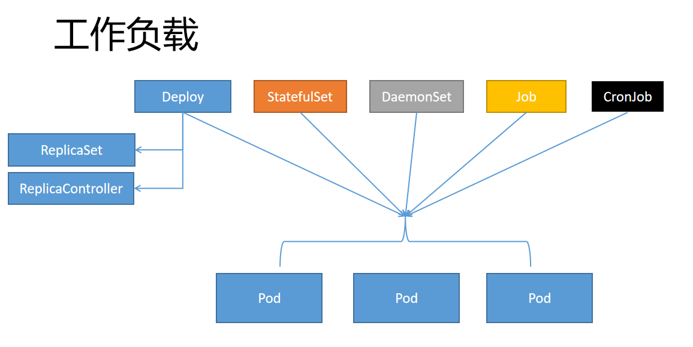

Kubernetes 工作负载 

总：Workloads  

什么是工作负载（Workloads）

工作负载是运行在 Kubernetes 上的一个应用程序。

一个应用很复杂，可能由单个组件或者多个组件共同完成。无论怎样我们可以用一组Pod来表示一个应用，也就是一个工作负载

Pod是一组容器（Containers）

所以关系又像是这样

工作负载（Workloads）控制一组Pod 

Pod控制一组容器（Containers）

比如Deploy（工作负载） 3个副本的nginx（3个Pod），每个nginx里面是真正的nginx容器（container）

工作负载能让Pod 能拥有自恢复能力。

会写 Pod。研究不同的工作负载怎么控制Pod的行为

