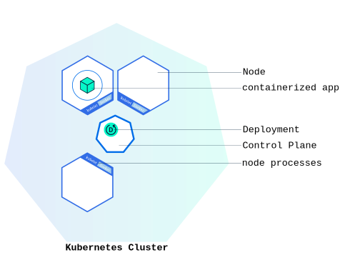

# kubernetes deployment


1、什么是Deployment

一个 Deployment 为 Pods 和 ReplicaSets 提供声明式的更新能力。

你负责描述 Deployment 中的 目标状态 ，而 Deployment 控制器（Controller） 以受控速率更改实际状态， 使其变为期望状态；控制循环。 

```shell
for(){ 
	xxx controller.spec()
}
```


不要管理 Deployment 所拥有的 ReplicaSet


我们部署一个应用一般不直接写Pod，而是部署一个Deployment


Deploy编写规约 https://kubernetes.io/zh/docs/concepts/workloads/controllers/deployment/#writing-a-deployment-spec


**Deployment（部署）**

在k8s中，通过发布 Deployment，可以创建应用程序 (docker image) 的实例 (docker container)，这个实例会被包含在称为 **Pod** 的概念中，**Pod** 是 k8s 中最小可管理单元。

在 k8s 集群中发布 Deployment 后，Deployment 将指示 k8s 如何创建和更新应用程序的实例，master 节点将应用程序实例调度到集群中的具体的节点上。

创建应用程序实例后，Kubernetes Deployment Controller 会持续监控这些实例。如果运行实例的 worker 节点关机或被删除，则 Kubernetes Deployment Controller 将在群集中资源最优的另一个 worker 节点上重新创建一个新的实例。**这提供了一种自我修复机制来解决机器故障或维护问题。**

在容器编排之前的时代，各种安装脚本通常用于启动应用程序，但是不能够使应用程序从机器故障中恢复。通过创建应用程序实例并确保它们在集群节点中的运行实例个数，Kubernetes Deployment 提供了一种完全不同的方式来管理应用程序。

Deployment 处于 master 节点上，通过发布 Deployment，master 节点会选择合适的 worker 节点创建 Container（即图中的正方体），Container 会被包含在 Pod （即蓝色圆圈）里。



1、部署一个应用

```shell
# kubectl create 帮我们创建k8s集群中的一些对象
kubectl create --help

#Create a deployment named  my-nginx that runs the nginx image
kubectl create deployment my-nginx --image=nginx

# Create a deployment with command
kubectl create deployment my-nginx --image=nginx -- date

# Create a deployment named my-nginx that runs the nginx image with 3 replicas.
kubectl create deployment my-nginx --image=nginx --replicas=3

# Create a deployment named my-nginx that runs the nginx image and expose port 80.
kubectl create deployment my-nginx --image=nginx --port=80
```


2、Deployment创建

基本格式

.metadata.name 指定deploy名字

replicas 指定副本数量

selector 指定匹配的Pod模板。

template 声明一个Pod模板


编写一个Deployment的yaml赋予Pod自愈和故障转移能力。  


在检查集群中的 Deployment 时，所显示的字段有：  

| 字段       | 说明                                                         |
| ---------- | ------------------------------------------------------------ |
| NAME       | 列出了集群中 Deployment 的名称                               |
| READY      | 显示应用程序的可用的 副本 数。显示的模式是“就绪个数/期望个数” |
| UP-TO-DATE | 显示为了达到期望状态已经更新的副本数                         |
| AVAILABLE  | 显示应用可供用户使用的副本数                                 |
| AGE        | 显示应用程序运行的时间                                       |


ReplicaSet 输出中包含以下字段：

| 字段    | 说明                                                         |
| ------- | ------------------------------------------------------------ |
| NAME    | 列出名字空间中 ReplicaSet 的名称                             |
| DESIRED | 显示应用的期望副本个数，即在创建 Deployment 时所定义的值。 此为期望状态 |
| CURRENT | 显示当前运行状态中的副本个数                                 |
| READY   | 显示应用中有多少副本可以为用户提供服务                       |
| AGE     | 显示应用已经运行的时间长度                                   |

注意：

ReplicaSet 的名称始终被格式化为 [Deployment名称]-[随机字符串] 。 其中的随机字符串是使用 pod-template-hash 作为种子随机生成的。


一个Deploy产生三个产物

Deployment 资源

replicaset 资源

Pod 资源

 

Deployment控制RS，RS控制Pod的副本数

ReplicaSet：只提供了副本数量的控制功能

Deployment： 每部署一个新版本就会创建一个新的副本集，利用他记录状态，回滚也是直接让指定的rs生效


--- rs1: 4 abc

--- rs2: 4 def

--- rsN: 4 eee


nginx=111 nginx:v1=2222 nginx:v2=3333


3、Deployment 更新机制  

仅当 Deployment Pod 模板（即 .spec.template ）发生改变时，例如模板的标签或容器镜像被更新， 才会触发 Deployment 上线。 其他更新（如对 Deployment 执行扩缩容的操作）不会触发上线动作。


上线动作 原理： 创建新的rs，准备就绪后，替换旧的rs（此时不会删除，因为revisionHistoryLimit 指定了保留几个版本）


常用的kubectl 命令

更新

```shell
kubectl set image deployment资源名 容器名=镜像名
```

```shell
kubectl set image deployment.apps/nginx-deployment php-redis=tomcat:8 --record
```

yaml提取可更新的关键所有字段计算的hash。

web---- /hello

postman aservice- /hello

或者直接修改定义也行

```shell
kubectl edit deployment.v1.apps/nginx-deployment
```

查看状态

```shell
kubectl rollout status deployment.v1.apps/nginx-deployment
```


查看历史并回滚, 查看更新历史, 看看我们设置的历史总记录数是否生效了

```shell
kubectl rollout history deployment.v1.apps/nginx-deployment
```

回滚

```shell
kubectl rollout undo deployment.v1.apps/nginx-deployment --to-revision=2
```


累计更新

暂停记录版本

```shell
kubectl rollout pause deployment.v1.apps/nginx-deployment
```

多次更新操作

比如更新了资源限制

```shell
kubectl set resources deployment.v1.apps/nginx-deployment -c=nginx -- limits=cpu=200m,memory=512Mi
```

比如更新了镜像版本

```shell
kubectl set image deployment.apps/nginx-deployment php-redis=tomcat:8
```

在继续操作多次

看看历史版本有没有记录变化

```shell
kubectl rollout history deployment.v1.apps/nginx-deployment
```

让多次累计生效

```shell
kubectl rollout resume deployment.v1.apps/nginx-deployment
```


1、比例缩放（Proportional Scaling）

maxSurge（最大增量）：除当前数量外还要添加多少个实例。

maxUnavailable（最大不可用量）：滚动更新过程中的不可用实例数。


2、HPA（动态扩缩容）  

概念：https://kubernetes.io/zh/docs/tasks/run-application/horizontal-pod-autoscale/#scaling-policies

实战：https://kubernetes.io/zh/docs/tasks/run-application/horizontal-pod-autoscale-walkthrough/  


需要先安装metrics-server  

https://github.com/kubernetes-sigs/metrics-server  

安装步骤  

```yaml
apiVersion: v1
kind: ServiceAccount
metadata:
  labels:
    k8s-app: metrics-server
    name: metrics-server
    namespace: kube-system
---
apiVersion: rbac.authorization.k8s.io/v1
kind: ClusterRole
metadata:
  labels:
    k8s-app: metrics-server
    rbac.authorization.k8s.io/aggregate-to-admin: "true"
    rbac.authorization.k8s.io/aggregate-to-edit: "true"
    rbac.authorization.k8s.io/aggregate-to-view: "true"
  name: system:aggregated-metrics-reader
rules:
- apiGroups:
  - metrics.k8s.io
  resources:
  - pods
  - nodes
  verbs:
  - get
  - list
  - watch
---
apiVersion: rbac.authorization.k8s.io/v1
kind: ClusterRole
metadata:
  labels:
    k8s-app: metrics-server
  name: system:metrics-server
rules:
- apiGroups:
  - ""
  resources:
  - pods
  - nodes
  - nodes/stats
  - namespaces
  - configmaps
  verbs:
  - get
  - list
  - watch
---
apiVersion: rbac.authorization.k8s.io/v1
kind: RoleBinding
metadata:
  labels:
    k8s-app: metrics-server
    name: metrics-server-auth-reader
    namespace: kube-system
roleRef:
  apiGroup: rbac.authorization.k8s.io
  kind: Role
  name: extension-apiserver-authentication-reader
subjects:
- kind: ServiceAccount
  name: metrics-server
  namespace: kube-system
---
apiVersion: rbac.authorization.k8s.io/v1
kind: ClusterRoleBinding
metadata:
  labels:
    k8s-app: metrics-server
  name: metrics-server:system:auth-delegator
roleRef:
  apiGroup: rbac.authorization.k8s.io
  kind: ClusterRole
  name: system:auth-delegator
subjects:
- kind: ServiceAccount
  name: metrics-server
  namespace: kube-system
---
apiVersion: rbac.authorization.k8s.io/v1
kind: ClusterRoleBinding
metadata:
  labels:
    k8s-app: metrics-server
  name: system:metrics-server
roleRef:
  apiGroup: rbac.authorization.k8s.io
  kind: ClusterRole
  name: system:metrics-server
subjects:
- kind: ServiceAccount
  name: metrics-server
  namespace: kube-system
---
apiVersion: v1
kind: Service
metadata:
  labels:
    k8s-app: metrics-server
    name: metrics-server
    namespace: kube-system
spec:
  ports:
  - name: https
    port: 443
    protocol: TCP
    targetPort: https
  selector:
    k8s-app: metrics-server
---
apiVersion: apps/v1
kind: Deployment
metadata:
  labels:
    k8s-app: metrics-server
  name: metrics-server
  namespace: kube-system
spec:
  selector:
    matchLabels:
      k8s-app: metrics-server
  strategy:
    rollingUpdate:
      maxUnavailable: 0
  template:
    metadata:
      labels:
        k8s-app: metrics-server
    spec:
      containers:
      - args:
        - --cert-dir=/tmp
        - --kubelet-insecure-tls
        - --secure-port=4443
        - --kubelet-preferred-addresstypes=InternalIP,ExternalIP,Hostname
        - --kubelet-use-node-status-port
        image: registry.cnhangzhou.aliyuncs.com/lfy_k8s_images/metrics-server:v0.4.3
        imagePullPolicy: IfNotPresent
        livenessProbe:
          failureThreshold: 3
          httpGet:
            path: /livez
            port: https
            scheme: HTTPS
          periodSeconds: 10
        name: metrics-server
        ports:
          - containerPort: 4443
            name: https
            protocol: TCP
        readinessProbe:
          failureThreshold: 3
          httpGet:
            path: /readyz
            port: https
            scheme: HTTPS
          periodSeconds: 10
        securityContext:
          readOnlyRootFilesystem: true
          runAsNonRoot: true
          runAsUser: 1000
        volumeMounts:
        - mountPath: /tmp
          name: tmp-dir
      nodeSelector:
        kubernetes.io/os: linux
      priorityClassName: system-cluster-critical
      serviceAccountName: metrics-server
      volumes:
      - emptyDir: {}
        name: tmp-dir
---
apiVersion: apiregistration.k8s.io/v1
kind: APIService
metadata:
  labels:
    k8s-app: metrics-server
  name: v1beta1.metrics.k8s.io
spec:
  group: metrics.k8s.io
  groupPriorityMinimum: 100
  insecureSkipTLSVerify: true
  service:
    name: metrics-server
    namespace: kube-system
  version: v1beta1
  versionPriority: 100
```


kubectl apply 即可、  

全部runnning 用

```shell
kubectl top nodes --use-protocol-buwers 
```

```shell
kubectl top pods --use-protocol-buwers
```

配置hpa测试  

测试镜像 registry.cn-hangzhou.aliyuncs.com/lfy_k8s_images/php-hpa:latest  

应用的yaml已经做好  

```yaml
apiVersion: v1
kind: Service
metadata:
  name: php-apache
spec:
  ports:
  - port: 80
    protocol: TCP
    targetPort: 80
  selector:
    run: php-apache
---
apiVersion: apps/v1
kind: Deployment
metadata:
  labels:
    run: php-apache
  name: php-apache
spec:
  replicas: 1
  selector:
    matchLabels:
      run: php-apache
  template:
    metadata:
      creationTimestamp: null
      labels:
        run: php-apache
    spec:
      containers:
      - image: registry.cn-hangzhou.aliyuncs.com/lfy_k8s_images/php-hpa:latest
        name: php-apache
        ports:
          - containerPort: 80
        resources:
          requests:
            cpu: 200m
```


hpa配置 hpa.yaml

```yaml
apiVersion: autoscaling/v1
kind: HorizontalPodAutoscaler
metadata:
  name: php-apache
spec:
  maxReplicas: 10
  minReplicas: 1
  scaleTargetRef:
    apiVersion: apps/v1
    kind: Deployment
    name: php-apache
  targetCPUUtilizationPercentage: 50
```


3、进行压力测试

```shell
kubectl run -i --tty load-generator --image=busybox /bin/sh
```


回车然后敲下面的命令

```shell
kubectl run -i --tty load-generator --rm --image=busybox --restart=Never -- /bin/sh -c "while sleep 0.01; do wget -q -O- http://php-apache; done"
```


3、Canary（金丝雀部署）

1、蓝绿部署 VS 金丝雀部署

蓝绿部署


金丝雀部署 - 矿场


2、金丝雀的简单测试  

使用这个镜像测试registry.cn-hangzhou.aliyuncs.com/lfy_k8s_images/nginx-test 

这个镜像docker run 的时候 -e msg=aaaa，访问这个nginx页面就是看到 aaaa


步骤原理

准备一个 Service，负载均衡 Pod

准备版本v1的deploy，准备版本v2的 deploy


滚动发布的缺点？（同时存在两个版本都能接受流量）

没法控制流量 ； 6 4， 8 2 ，3 7

滚动发布短时间就直接结束，不能直接控制新老版本的存活时间。


用两个镜像：

registry.cn-hangzhou.aliyuncs.com/lfy_k8s_images/nginx-test:env-msg 默认输出11111

nginx： 默认输出 默认页；


4、Deployment状态与排错  

https://kubernetes.io/zh/docs/concepts/workloads/controllers/deployment/#deployment-status  

kubectl describe 描述一个资源（Pod、Service、Node、Deployment....）来进行排错  

Conditions以及Events需要注意  


