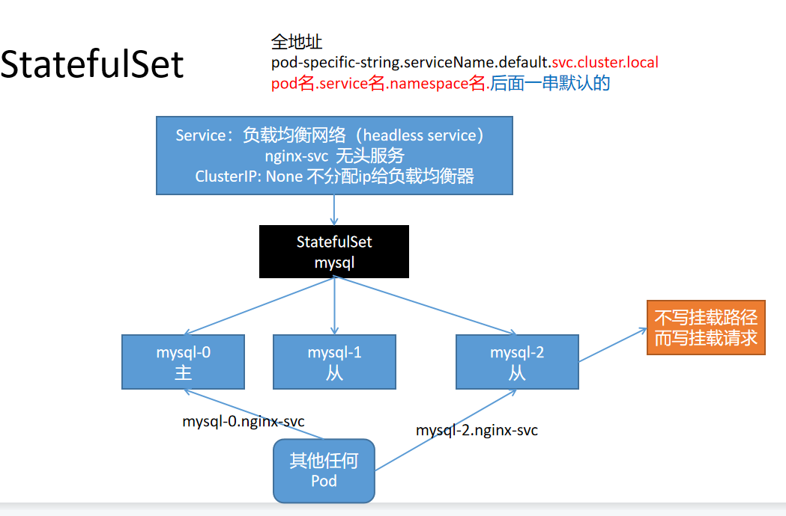

# kubernetes Stateful

Deployment 部署的应用我们一般称为无状态应用


StatefulSet 部署的应用我们一般称为有状态应用


无状态应用：网络可能会变，存储可能会变，顺序可能会变。场景就是业务代码（Deployment）

有状态应用：网络不变，存储不变，顺序不变。场景就是中间件（MySQL、Redis、MQ）


有状态副本集；Deployment等属于无状态的应用部署（stateless）

StatefulSet 使用场景；对于有如下要求的应用程序，StatefulSet 非常适用：

稳定、唯一的网络标识（dnsname）【必须配合Service】

StatefulSet通过与其相关的无头服务为每个pod提供DNS解析条目。假如无头服务的DNS条目为:"$(service name).$(namespace).svc.cluster.local"，那么pod的解析条目就是"$(pod name).$(service name).$(namespace).svc.cluster.local"，每个pod name也是唯一的。


稳定的、持久的存储；【每个Pod始终对应各自的存储路径（PersistantVolumeClaimTemplate）】


有序的、优雅的部署和缩放。【按顺序地增加副本、减少副本，并在减少副本时执行清理】有序的、自动的滚动更新。【按顺序自动地执行滚动更新】


限制  

给定 Pod 的存储必须由 PersistentVolume 驱动 基于所请求的 storage class 来提供，或者由管理员预先提供。

删除或者收缩 StatefulSet 并不会 删除它关联的存储卷。 这样做是为了保证数据安全，它通常比自动清除 StatefulSet 所有相关的资源更有价值。

StatefulSet 当前需要无头服务 来负责 Pod 的网络标识。你需要负责创建此服务。

当删除 StatefulSets 时，StatefulSet 不提供任何终止 Pod 的保证。 为了实现 StatefulSet 中的Pod 可以有序地且体面地终止，可以在删除之前将 StatefulSet 缩放为 0。

在默认 Pod 管理策略( OrderedReady ) 时使用 滚动更新，可能进入需要人工干预 才能修复的损坏状态。


如果一个应用程序不需要稳定的网络标识，或者不需要按顺序部署、删除、增加副本，就应该考虑使用Deployment 这类无状态（stateless）的控制器  

```yaml
# 定义一个负载均衡网络
apiVersion: v1
kind: Service
metadata:
  name: stateful-tomcat
  labels:
    app: stateful-tomcat
spec:
  ports:
  - port: 8123
    name: web
    targetPort: 8080
  # NodePort：任意机器+NodePort都能访问，
  # ClusterIP：集群内能用这个ip、service域名能访问，clusterIP:
  # None；不要分配集群ip。headless；无头服务。稳定的域名
  clusterIP: None
  selector:
    app: stateful-tomcat
---
#控制器
apiVersion: apps/v1
kind: StatefulSet
metadata:
  name: stateful-tomcat
spec:
  selector:
    matchLabels:
      # has to match .spec.template.metadata.labels
      app: stateful-tomcat
  #这里一定注意，必须提前有个service名字叫这个的
  serviceName: "stateful-tomcat"
  # by default is 1
  replicas: 3
  template:
    metadata:
      labels:
        app: stateful-tomcat # has to match .spec.selector.matchLabels
    spec:
      terminationGracePeriodSeconds: 10
      containers:
      - name: tomcat
        image: tomcat:7
        ports:
        - containerPort: 8080
          name: web
```

观察效果

删除一个，重启后名字，ip等都是一样的。保证了状态


细节

```
kubectl explain StatefulSet.spec
```

podManagementPolicy:

OrderedReady（按序）、Parallel（并发）


serviceName -required-

设置服务名，就可以用域名访问pod了。 pod-specific-string.serviceName.default.svc.cluster.local


测试

```shell
kubectl run -i --tty --image busybox dns-test --restart=Never --rm /bin/sh ping stateful-tomcat-0.stateful-tomcat
```


我们在这里没有加存储卷。如果有的话 

```shell
kubectl get pvc -l app=stateful-tomcat 
```

我们就能看到即使Pod删了再拉起，卷还是同样的。




DNS解析。整个状态kubelet（DNS内容同步到Pod）和kube-proxy（整个集群网络负责）会同步

curl nginx-svc： 负载均衡到sts部署的Pod上

curl mysql-0.nginx-svc： 直接访问指定Pod


1、和Deployment不同的字段  

1、podManagementPolicy： pod管理策略

podManagementPolicy : 控制Pod创建、升级以及扩缩容逻辑

```
podManagementPolicy controls how pods are created during initial scale up, when replacing pods on nodes, or when scaling down. The default policy is OrderedReady , where pods are created in increasing order (pod-0, then pod-1, etc) and the controller will wait until each pod is ready before continuing.When scaling down, the pods are removed in the opposite order. The alternative policy is Parallel which will create pods in parallel to match the desired scale without waiting, and on scale down will delete all pods at once.
```

默认是 OrderedReady : 有序启动

修改为 Parallel ： 同时创建启动，一般不用


2、updateStrategy： 更新策略

updateStrategy

updateStrategy indicates the StatefulSetUpdateStrategy that will be employed to update Pods in the StatefulSet when a revision is made to Template.


rollingUpdate

RollingUpdate is used to communicate parameters when Type is RollingUpdateStatefulSetStrategyType.

partition ：按分区升级


type

Type indicates the type of the StatefulSetUpdateStrategy. Default is RollingUpdate.


实验：

先部署一个sts

```yaml
### 有状态副本集
apiVersion: apps/v1
kind: StatefulSet 
metadata:
  name: stateful-nginx
  namespace: default
spec:
  selector:
    matchLabels:
      # has to match .spec.template.metadata.labels
      app: ss-nginx 
  serviceName: "nginx"
  # 三个副本
  replicas: 3 
  template:
    ## Pod模板
    metadata:
      labels:
        # has to match .spec.selector.matchLabels
        app: ss-nginx 
    spec:
      containers:
      - name: nginx
        ## 默认三个开始有序升级
        image: nginx 
```

在进行分区升级  

```yaml
### 有状态副本集
apiVersion: apps/v1
kind: StatefulSet
metadata:
  name: stateful-nginx
  namespace: default
spec:
  ## 所有Pod一起创建，OrderedReady：有序创建
  podManagementPolicy: OrderedReady
  ## 升级策略
  updateStrategy:
    rollingUpdate:
      ### 更新大于等于这个索引的pod
      partition: 1
  selector:
    matchLabels:
      app: ss-nginx # has to match .spec.template.metadata.labels
  serviceName: "nginx"
  replicas: 3 # 三个副本
  template: ## Pod模板
    metadata:
      labels:
        app: ss-nginx # has to match .spec.selector.matchLabels
    spec:
      containers:
      - name: nginx
        ## 默认三个开始有序升级
        image: tomcat
```

