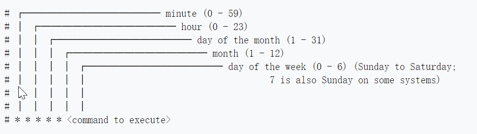

# kubernetes cronjob

CronJob创建Job-----Job启动Pod执行命令

CronJob 按照预定的时间计划（schedule）创建 Job（注意：启动的是Job不是Deploy，rs）。一个CronJob 对象类似于 crontab (cron table) 文件中的一行记录。该对象根据 Cron 格式定义的时间计划，周期性地创建 Job 对象。


Schedule

所有 CronJob 的 schedule 中所定义的时间，都是基于 master 所在时区来进行计算的。


一个 CronJob 在时间计划中的每次执行时刻，都创建 大约 一个 Job 对象。这里用到了 大约 ，是因为在少数情况下会创建两个 Job 对象，或者不创建 Job 对象。尽管 K8S 尽最大的可能性避免这种情况的出现，但是并不能完全杜绝此现象的发生。因此，Job 程序必须是 幂等的。1min 执行一次。


当以下两个条件都满足时，Job 将至少运行一次：

startingDeadlineSeconds 被设置为一个较大的值，或者不设置该值（默认值将被采纳）  

concurrencyPolicy 被设置为 Allow  


```shell
kubectl explain cronjob.spec
```

concurrencyPolicy：并发策略

"Allow" (允许，default):

"Forbid"(禁止): forbids；前个任务没执行完，要并发下一个的话，下一个会被跳过

"Replace"(替换): 新任务，替换当前运行的任务


failedJobsHistoryLimit：记录失败数的上限，Defaults to 1. 

successfulJobsHistoryLimit： 记录成功任务的上限。 Defaults to 3.

指定了 CronJob 应该保留多少个 completed 和 failed 的 Job 记录。将其设置为 0，则 CronJob 不会保留已经结束的 Job 的记录。


jobTemplate： job怎么定义（与前面我们说的job一样定义法）


schedule： cron 表达式；


startingDeadlineSeconds： 表示如果Job因为某种原因无法按调度准时启动，在spec.startingDeadlineSeconds时间段之内，CronJob仍然试图重新启动Job，如果在.spec.startingDeadlineSeconds时间之内没有启动成功，则不再试图重新启动。如果spec.startingDeadlineSeconds的值没有设置，则没有按时启动的任务不会被尝试重新启动。


suspend 暂停定时任务，对已经执行了的任务，不会生效； Defaults to false.

```yaml
apiVersion: batch/v1beta1
kind: CronJob
metadata:
  name: hello
spec:
  schedule: "*/1 * * * *" #分、时、日、月、周
  jobTemplate:
  spec:
    template:
      spec:
        containers:
        - name: hello
          image: busybox
          args:
          - /bin/sh
          - -c
          - date; echo Hello from the Kubernetes cluster
        restartPolicy: OnFailure
```




