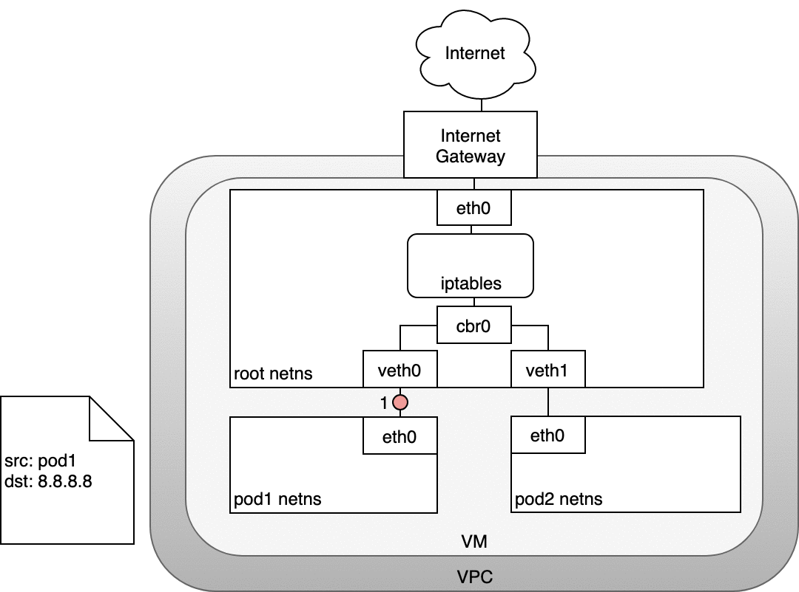
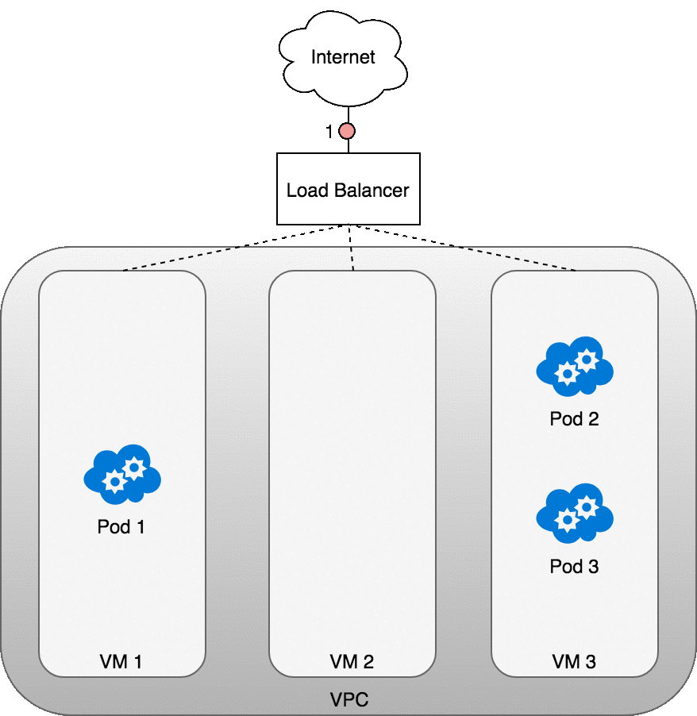

# Kubernetes网络

Kubernetes 网络解决四方面的问题：

- 一个 Pod 中的容器之间通过**本地回路（loopback）通信。**
- 集群网络在不同 pod 之间提供通信。Pod和Pod之间互通
- Service 资源允许你对外暴露 Pods 中运行的应用程序，以支持来自于集群外部的访问。Service和Pod要通
- 可以使用 Services 来发布仅供集群内部使用的服务。

## 1、k8s网络架构图

### 1、架构图


### 2、访问流程

门面。所有的零散层上再抽取一个聚合层。


## 2、网络连通原理

### 1、Container To Container


```sh
ip netns add ns1  #添加网络名称空间
ls /var/run/netns #查看所有网络名词空间
ip netns 		  #查看所有网络名词空间
# Linux 将所有的进程都分配到 root network namespace，以使得进程可以访问外部网络
# Kubernetes 为每一个 Pod 都创建了一个 network namespace
```

### 2、Pod To Pod

#### 1、同节点


#### 2、跨节点


### 3、Pod-To-Service

#### 1、Pod To Service


#### 2、Service-To-Pod


### 4、Internet-To-Service

#### 1、Pod-To-Internet




#### 2、Internet-To-Pod（LoadBalancer -- Layer4）




#### 3、Internet-To-Pod（Ingress-- Layer7）


