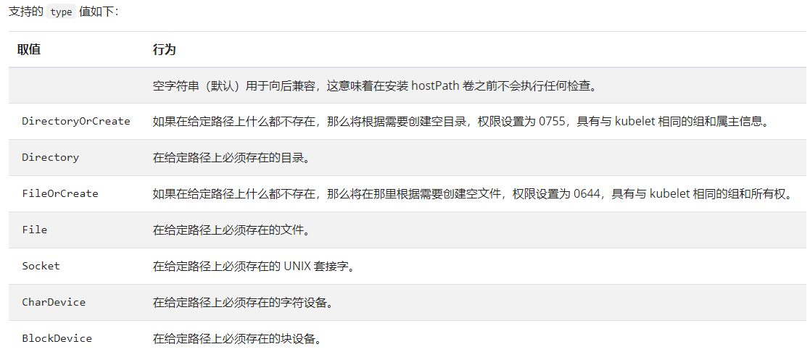

# 临时存储

## 1、几种临时存储

Kubernetes 为了不同的目的，支持几种不同类型的临时卷：

- [emptyDir](https://kubernetes.io/zh/docs/concepts/storage/volumes/#emptydir)： Pod 启动时为空，存储空间来自本地的 kubelet 根目录（通常是根磁盘）或内存
- [configMap](https://kubernetes.io/zh/docs/concepts/storage/volumes/#configmap)、 [downwardAPI](https://kubernetes.io/zh/docs/concepts/storage/volumes/#downwardapi)、 [secret](https://kubernetes.io/zh/docs/concepts/storage/volumes/#secret)： 将不同类型的 Kubernetes 数据注入到 Pod 中
- [CSI 临时卷](https://kubernetes.io/zh/docs/concepts/storage/volumes/#csi-ephemeral-volumes)： 类似于前面的卷类型，但由专门[支持此特性](https://kubernetes-csi.github.io/docs/drivers.html) 的指定 [CSI 驱动程序](https://github.com/container-storage-interface/spec/blob/master/spec.md)提供
- [通用临时卷](https://kubernetes.io/zh/docs/concepts/storage/ephemeral-volumes/#generic-ephemeral-volumes)： 它可以由所有支持持久卷的存储驱动程序提供


## 2、emptyDir

- 当 Pod 分派到某个 Node 上时，`emptyDir` 卷会被创建
- 在 Pod 在该节点上运行期间，卷一直存在。
- 卷最初是空的。 
- 尽管 Pod 中的容器挂载 `emptyDir` 卷的路径可能相同也可能不同，这些容器都可以读写 `emptyDir` 卷中相同的文件。 
- 当 Pod 因为某些原因被从节点上删除时，`emptyDir` 卷中的数据也会被永久删除。
- 存储空间来自本地的 kubelet 根目录（通常是根磁盘）或内存

```yaml
apiVersion: v1
kind: Pod
metadata:
  name: "multi-container-pod"
  namespace: default
  labels:
    app: "multi-container-pod"
spec:
  volumes:    ### 以后见到的所有名字 都应该是一个合法的域名方式
  - name: nginx-vol
    emptyDir: {}  ### docker匿名挂载，外部创建一个位置  /abc
  containers:  ## kubectl exec -it podName  -c nginx-container（容器名）-- /bin/sh
  - name: nginx-container
    image: "nginx"
    volumeMounts:  #声明卷挂载  -v
      - name: nginx-vol
        mountPath: /usr/share/nginx/html
  - name: content-container
    image: "alpine"
    command: ["/bin/sh","-c","while true;do sleep 1; date > /app/index.html;done;"]
    volumeMounts: 
      - name: nginx-vol
        mountPath: /app
```


## 3、扩展-hostPath

https://kubernetes.io/zh/docs/concepts/storage/volumes/#hostpath




```yaml
apiVersion: v1
kind: Pod
metadata:
  name: test-pd
spec:
  containers:
  - image: k8s.gcr.io/test-webserver
    name: test-container
    volumeMounts:
    - mountPath: /test-pd
      name: test-volume
  volumes:
  - name: test-volume
    hostPath:
      # 宿主上目录位置
      path: /data
      # 此字段为可选
      type: Directory
```


```yaml
apiVersion: v1
kind: Pod
metadata:
  name: test-webserver
spec:
  containers:
  - name: test-webserver
    image: k8s.gcr.io/test-webserver:latest
    volumeMounts:
    - mountPath: /var/local/aaa
      name: mydir
    - mountPath: /var/local/aaa/1.txt
      name: myfile
  volumes:
  - name: mydir
    hostPath:
      # 确保文件所在目录成功创建。
      path: /var/local/aaa
      type: DirectoryOrCreate
  - name: myfile
    hostPath:
      path: /var/local/aaa/1.txt
      type: FileOrCreate
```


> 典型应用
>
> 解决容器时间问题

```yaml
apiVersion: v1
kind: Pod
metadata:
  name: busy-box-test
  namespace: default
spec:
  restartPolicy: OnFailure
  containers:
  - name: busy-box-test
    image: busybox
    imagePullPolicy: IfNotPresent
    volumeMounts:
    - name: date-config
      mountPath: /etc/localtime
    command: ["sleep", "60000"]
  volumes:
  - name: date-config
    hostPath:
      path: /etc/localtime
```


#  