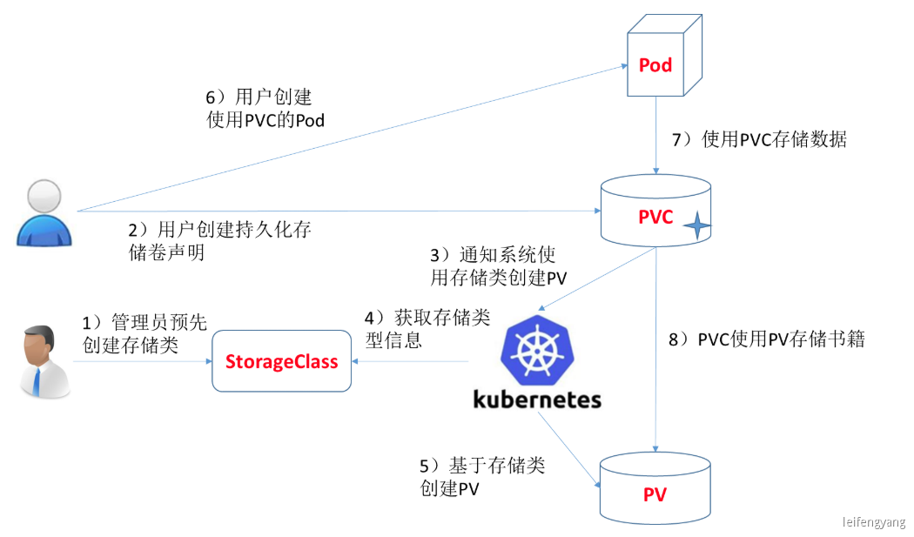

# kubernetes pv pvc StorageClass

### 1、基础概念

- **存储的管理**是一个与**计算实例的管理**完全不同的问题。
- PersistentVolume 子系统为用户 和管理员提供了一组 API，将存储如何供应的细节从其如何被使用中抽象出来。 
- 为了实现这点，我们引入了两个新的 API 资源：PersistentVolume 和 PersistentVolumeClaim。

**持久卷（PersistentVolume ）：**

- 持久卷（PersistentVolume，PV）是集群中的一块存储，可以由管理员事先供应，或者 使用[存储类（Storage Class）](https://kubernetes.io/zh/docs/concepts/storage/storage-classes/)来动态供应。
- 持久卷是集群资源，就像节点也是集群资源一样。PV 持久卷和普通的 Volume 一样，也是使用 卷插件来实现的，只是它们拥有独立于使用他们的Pod的生命周期。
- 此 API 对象中记述了存储的实现细节，无论其背后是 NFS、iSCSI 还是特定于云平台的存储系统。

**持久卷申请（PersistentVolumeClaim，PVC）：**

- 表达的是用户对存储的请求
- 概念上与 Pod 类似。 Pod 会耗用节点资源，而 PVC 申领会耗用 PV 资源。
- Pod 可以请求特定数量的资源（CPU 和内存）；同样 PVC 申领也可以请求特定的大小和访问模式 （例如，可以要求 PV 卷能够以 ReadWriteOnce、ReadOnlyMany 或 ReadWriteMany 模式之一来挂载，参见[访问模式](https://kubernetes.io/zh/docs/concepts/storage/persistent-volumes/#access-modes)）。

**存储类（Storage Class）**:

- 尽管 PersistentVolumeClaim 允许用户消耗抽象的存储资源，常见的情况是针对不同的 问题用户需要的是具有不同属性（如，性能）的 PersistentVolume 卷。
- 集群管理员需要能够提供不同性质的 PersistentVolume，并且这些 PV 卷之间的差别不 仅限于卷大小和访问模式，同时又不能将卷是如何实现的这些细节暴露给用户。
- 为了满足这类需求，就有了 *存储类（StorageClass）* 资源。

### 2、实战

https://kubernetes.io/zh/docs/tasks/configure-pod-container/configure-persistent-volume-storage/

### 3、细节

#### 1、访问模式

https://kubernetes.io/zh/docs/concepts/storage/persistent-volumes/#access-modes

#### 2、回收策略

https://kubernetes.io/zh/docs/concepts/storage/persistent-volumes/#reclaim-policy

#### 3、阶段

https://kubernetes.io/zh/docs/concepts/storage/persistent-volumes/#phase

## 3、动态供应

静态供应：

- 集群管理员创建若干 PV 卷。这些卷对象带有真实存储的细节信息，并且对集群 用户可用（可见）。PV 卷对象存在于 Kubernetes API 中，可供用户消费（使用）

动态供应：

- 集群自动根据PVC创建出对应PV进行使用

### 1、设置nfs动态供应

https://github.com/kubernetes-retired/external-storage/tree/master/nfs-client

按照文档部署，并换成 registry.cn-hangzhou.aliyuncs.com/lfy_k8s_images/nfs-subdir-external-provisioner:v4.0.2 镜像即可

#### 2、测试nfs动态供应

