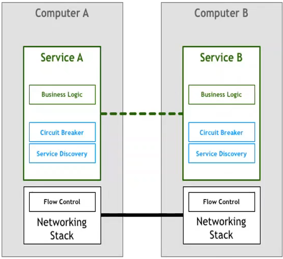
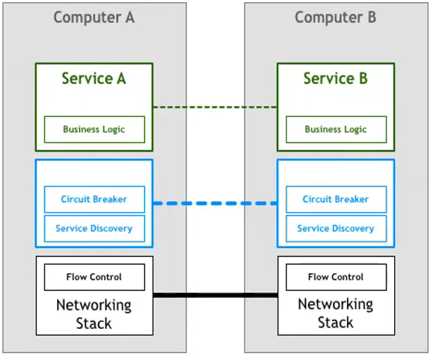
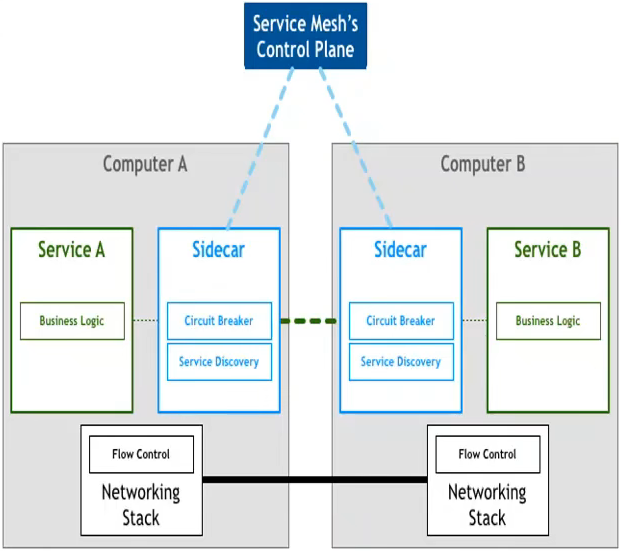
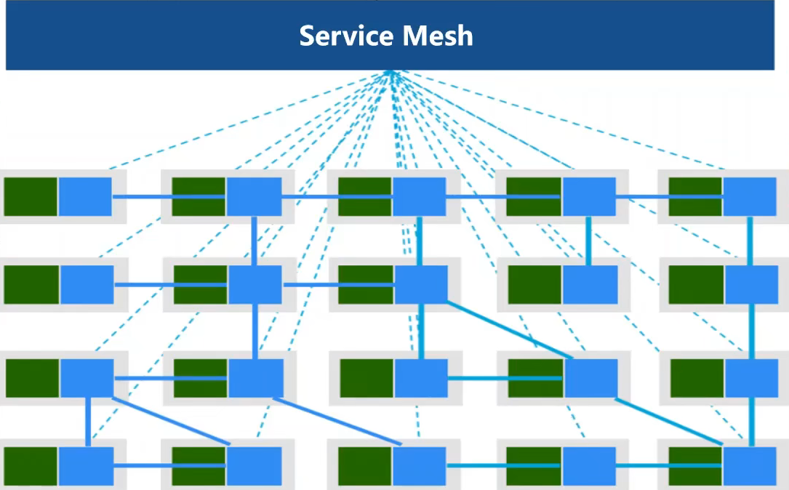
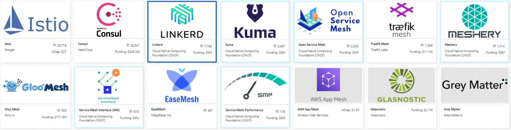

# ServiceMesh入门

微服务架构越来越复杂

服务发现/负载均衡/故障恢复/监控/AB测试/灰度部署/速度限制/身份验证/端到端加密

分布式应用之间的组件关系

控制服务与服务之间的数据传递与路由

### 1 微服务概念回顾

高度可维护和可测试性

松耦合

独立部署

围绕业务能力进行组织

### 2 传统微服务架构面临的挑战

SpringCloud/Dubbo/Tars

过于绑定特定技术栈

多语言支持受限

代码侵入度过高

老旧系统难维护

### 3 service mesh 概念与架构

对服务框架进行进一步抽象,与应用层解耦,可以独立于业务服务进部署维护和升级

传统微服务框架, 基础设施功能成为sdk,与业务代码进行解耦

服务治理的相关组件是否能继续下沉?

由于服务治理本身不是操作系统的范畴, 而且在操作系统层开发网络栈难度很大,因此这个方案不可行

side car 模式

本质上将 side car 就是网络代理,业务的流入流出的网络请求首先由 side car 进行拦截,经过处理后再经过网络层尽心发送, side car 模式实现对业务模式的0入侵, 并且与开发语言和技术栈无关, 实现了完全的隔离, 为部署和升级带来了便利, 真正的做到了基础设施与业务逻辑的彻底解耦, 当把side car 模式应用到庞大的微服务系统中, 为每一个应用配套一个 side car ,完成服务间的复杂通信, 最后得到一个网络结构, 这就是 `ServiceMesh` ,也就是 `服务网格`

服务网格是用于处理服务间通信的专用基础设施, 负责通过包含现代云原生应用程序的复杂服务网络来可靠的传递请求. 实际上, 服务网格通常通过一组轻量级网络代理来实现,这些代理与应用代码一起部署,而不需要感知应用程序本身.

服务网格通过将微服务间的通信下沉到基础设施, 这样就屏蔽了微服务处理各种通信的复杂度, 形成了服务与服务之间抽象的协议, 开发者无需再关心通信层的具体实现, 像服务发现/负载均衡/流量治理/监控统计这样的细节全部交给ServiceMesh来完成.

功能上ServiceMesh并没有提供任何新的特性或者能力,服务网格提供的所有的通信和服务治理能力都是在传统的微服务架构中可以找到的. 比如SpringCloud中就提供了完善的微服务通信的治理能力. 服务网格改变的是通讯和服务治理能力提供的方式, 通过将这些能力从各个语言业务中实现解耦, 下沉到基础设施层,以一种更加通用和标准化的方式来提供,这样就屏蔽了不同语言, 不同平台差异, 使得业务实现更加方便

CNCF基金会下ServiceMesh产品

