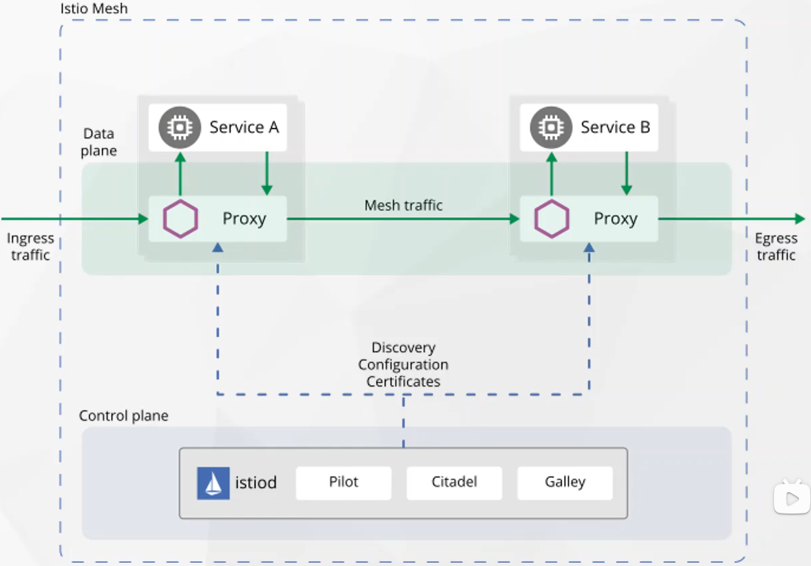

## Istio核心架构

流量管理

istio的流量理由规则可以控制服务之间的流量管理以及API调用, 简化了断路器/超时重试等规则配置, 并且是AB测试/灰度发布等分阶段部署变得更加容易

可观测性

istio为服务网格内的所有通讯生成了详细的遥测数据,通过遥测信息提供的数据指标,分布式追踪和访问日志等, 可以让运维人员轻松的排查故障,维护和优化应用. 并且不会为开发人员带来额外的负担. 

安全性能

为了满足微服务中安全性需求,istio提供了强大的认证授权和TLS加密等保护策略

istio由控制面 ( Control plane ) 和数据面 ( Data plane ) 

Data plane 

基于 istio-envoy 的网络代理, 在k8s集群中以side car的模式与业务容器运行在相同的pod中, 同时也支持运行在虚拟机上, 数据平面式业务与业务之间通讯的平面, 负责了 服务发现/健康检测/流量路由等相关功能的具体实现

Control plane 

负责服务发现, 配置规则的配置下发与管理, 同时负责安全认证/授权/证书管理等相关功能, 并且控制面可以与 istio 底层的平台进行解耦

