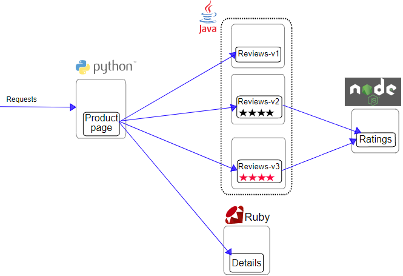
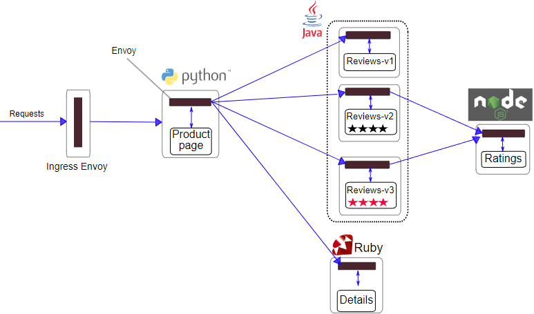
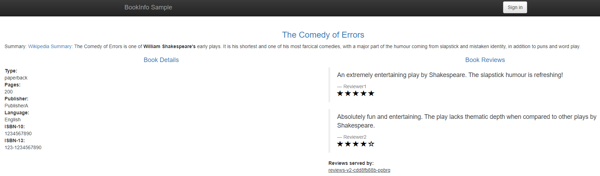
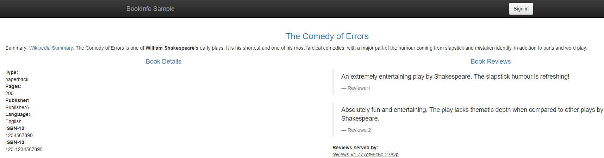
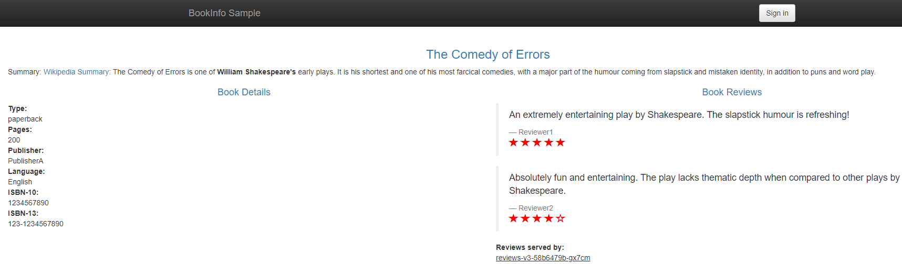
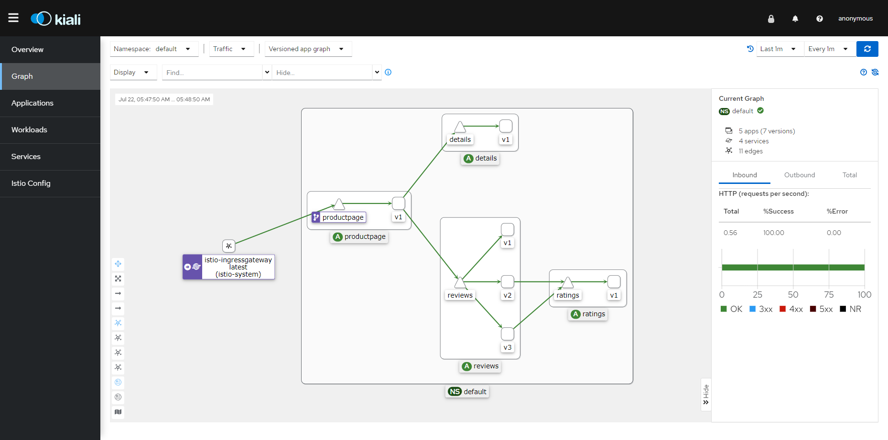

## Istio部署BookInfo示例项目

BookInfo项目简介

https://github.com/istio/istio/tree/master/samples/bookinfo

https://istio.io/latest/docs/examples/bookinfo/


Bookinfo项目模拟了一个在线书店, 项目结构如下:







各个模块使用不同的语言开发,模块有:

前端

​	ProductPage


后端

​	Review

​	Ratings

​	Detail


### 1 打标签

istio自带了一个bookinfo的demo项目, 部署项目前还需要在 default namespace 下打一个标签

```bash
kubectl label namespace default istio-injection=enabled
```

注意取值为 **enabled** , **不是 enable** 有了这个标签, 在指定的namespace 为 default 下的所有部署的服务都会自动注入istio的代理服务 ( side car ) .


### 2 部署项目

部署bookinfo示例项目:

```bash
kubectl apply -f samples/bookinfo/platform/kube/bookinfo.yaml
```

```bash
root@k8s-master01:/app/istio/istio-1.18.1# kubectl apply -f samples/bookinfo/platform/kube/bookinfo.yaml
service/details created
serviceaccount/bookinfo-details created
deployment.apps/details-v1 created
service/ratings created
serviceaccount/bookinfo-ratings created
deployment.apps/ratings-v1 created
service/reviews created
serviceaccount/bookinfo-reviews created
deployment.apps/reviews-v1 created
deployment.apps/reviews-v2 created
deployment.apps/reviews-v3 created
service/productpage created
serviceaccount/bookinfo-productpage created
deployment.apps/productpage-v1 created
```


查看default命名空间下的资源

```bash
kubectl get all
```

```bash
root@k8s-master01:/app/istio/istio-1.18.1# kubectl get all
NAME                                  READY   STATUS    RESTARTS   AGE
pod/details-v1-7d4d9d5fcb-mqjlq       2/2     Running   0          17s
pod/loki-0                            1/1     Running   0          58m
pod/productpage-v1-7b4dbf9c75-bjc4g   2/2     Running   0          16s
pod/ratings-v1-85cc46b6d4-5fp5h       2/2     Running   0          17s
pod/reviews-v1-777df99c6d-278vp       2/2     Running   0          16s
pod/reviews-v2-cdd8fb88b-ppbrq        2/2     Running   0          16s
pod/reviews-v3-58b6479b-gx7cm         2/2     Running   0          16s

NAME                      TYPE        CLUSTER-IP      EXTERNAL-IP   PORT(S)             AGE
service/details           ClusterIP   10.233.3.178    <none>        9080/TCP            17s
service/kubernetes        ClusterIP   10.233.0.1      <none>        443/TCP             2d4h
service/loki              ClusterIP   10.233.20.118   <none>        3100/TCP,9095/TCP   58m
service/loki-memberlist   ClusterIP   None            <none>        7946/TCP            58m
service/productpage       ClusterIP   10.233.30.210   <none>        9080/TCP            16s
service/ratings           ClusterIP   10.233.31.113   <none>        9080/TCP            17s
service/reviews           ClusterIP   10.233.20.25    <none>        9080/TCP            17s

NAME                             READY   UP-TO-DATE   AVAILABLE   AGE
deployment.apps/details-v1       1/1     1            1           17s
deployment.apps/productpage-v1   1/1     1            1           16s
deployment.apps/ratings-v1       1/1     1            1           17s
deployment.apps/reviews-v1       1/1     1            1           16s
deployment.apps/reviews-v2       1/1     1            1           16s
deployment.apps/reviews-v3       1/1     1            1           16s

NAME                                        DESIRED   CURRENT   READY   AGE
replicaset.apps/details-v1-7d4d9d5fcb       1         1         1       17s
replicaset.apps/productpage-v1-7b4dbf9c75   1         1         1       16s
replicaset.apps/ratings-v1-85cc46b6d4       1         1         1       17s
replicaset.apps/reviews-v1-777df99c6d       1         1         1       16s
replicaset.apps/reviews-v2-cdd8fb88b        1         1         1       16s
replicaset.apps/reviews-v3-58b6479b         1         1         1       16s

NAME                    READY   AGE
statefulset.apps/loki   1/1     58m
```

注意 pod 信息

```bash
pod/ratings-v1-85cc46b6d4-5fp5h       2/2     Running   0          17s
```

2/2 说明pod中运行着2个容器, 一个是应用程序的容器, 另一个是 sidecar


### 3 测试

执行指令进行测试

```bash
kubectl exec "$(kubectl get pod -l app=ratings -o jsonpath='{.items[0].metadata.name}')" -c ratings -- curl -s productpage:9080/productpage | grep -o "<title>.*</title>"
```

输出

```bash
root@k8s-master01:/app/istio/istio-1.18.1# kubectl exec "$(kubectl get pod -l app=ratings -o jsonpath='{.items[0].metadata.name}')" -c ratings -- curl -s productpage:9080/productpage | grep -o "<title>.*</title>"
<title>Simple Bookstore App</title>
```

返回的内容有

```xml
<title>Simple Bookstore App</title>
```

说明部署成功, 可以正常访问


以details服务为例, 查看pod的详细信息

```bash
kubectl get pod details-v1-7d4d9d5fcb-mqjlq -o yaml
```

输出:

```yaml
apiVersion: v1
kind: Pod
metadata:
  annotations:
    cni.projectcalico.org/containerID: 43d0a05359d2064adba83a56d381296913af92f604d011a559b32aa266ea6154
    cni.projectcalico.org/podIP: 10.233.117.97/32
    cni.projectcalico.org/podIPs: 10.233.117.97/32
    istio.io/rev: default
    kubectl.kubernetes.io/default-container: details
    kubectl.kubernetes.io/default-logs-container: details
    prometheus.io/path: /stats/prometheus
    prometheus.io/port: "15020"
    prometheus.io/scrape: "true"
    sidecar.istio.io/status: '{"initContainers":["istio-init"],"containers":["istio-proxy"],"volumes":["workload-socket","credential-socket","workload-certs","istio-envoy","istio-data","istio-podinfo","istio-token","istiod-ca-cert"],"imagePullSecrets":null,"revision":"default"}'
  creationTimestamp: "2023-07-21T20:12:25Z"
  generateName: details-v1-7d4d9d5fcb-
  labels:
    app: details
    pod-template-hash: 7d4d9d5fcb
    security.istio.io/tlsMode: istio
    service.istio.io/canonical-name: details
    service.istio.io/canonical-revision: v1
    version: v1
  name: details-v1-7d4d9d5fcb-mqjlq
  namespace: default
  ownerReferences:
  - apiVersion: apps/v1
    blockOwnerDeletion: true
    controller: true
    kind: ReplicaSet
    name: details-v1-7d4d9d5fcb
    uid: b505d46f-f647-46cf-bd0f-8105f000155f
  resourceVersion: "114098"
  uid: 225c6bb8-f16d-495d-aa49-beeccf7379a9
spec:
  containers:
  - image: docker.io/istio/examples-bookinfo-details-v1:1.17.0
    imagePullPolicy: IfNotPresent
    name: details
    ports:
    - containerPort: 9080
      protocol: TCP
    resources: {}
    securityContext:
      runAsUser: 1000
    terminationMessagePath: /dev/termination-log
    terminationMessagePolicy: File
    volumeMounts:
    - mountPath: /var/run/secrets/kubernetes.io/serviceaccount
      name: kube-api-access-w6f72
      readOnly: true
  - args:
    - proxy
    - sidecar
    - --domain
    - $(POD_NAMESPACE).svc.cluster.local
    - --proxyLogLevel=warning
    - --proxyComponentLogLevel=misc:error
    - --log_output_level=default:info
    env:
    - name: JWT_POLICY
      value: third-party-jwt
    - name: PILOT_CERT_PROVIDER
      value: istiod
    - name: CA_ADDR
      value: istiod.istio-system.svc:15012
    - name: POD_NAME
      valueFrom:
        fieldRef:
          apiVersion: v1
          fieldPath: metadata.name
    - name: POD_NAMESPACE
      valueFrom:
        fieldRef:
          apiVersion: v1
          fieldPath: metadata.namespace
    - name: INSTANCE_IP
      valueFrom:
        fieldRef:
          apiVersion: v1
          fieldPath: status.podIP
    - name: SERVICE_ACCOUNT
      valueFrom:
        fieldRef:
          apiVersion: v1
          fieldPath: spec.serviceAccountName
    - name: HOST_IP
      valueFrom:
        fieldRef:
          apiVersion: v1
          fieldPath: status.hostIP
    - name: ISTIO_CPU_LIMIT
      valueFrom:
        resourceFieldRef:
          divisor: "0"
          resource: limits.cpu
    - name: PROXY_CONFIG
      value: |
        {}
    - name: ISTIO_META_POD_PORTS
      value: |-
        [
            {"containerPort":9080,"protocol":"TCP"}
        ]
    - name: ISTIO_META_APP_CONTAINERS
      value: details
    - name: ISTIO_META_CLUSTER_ID
      value: Kubernetes
    - name: ISTIO_META_NODE_NAME
      valueFrom:
        fieldRef:
          apiVersion: v1
          fieldPath: spec.nodeName
    - name: ISTIO_META_INTERCEPTION_MODE
      value: REDIRECT
    - name: ISTIO_META_WORKLOAD_NAME
      value: details-v1
    - name: ISTIO_META_OWNER
      value: kubernetes://apis/apps/v1/namespaces/default/deployments/details-v1
    - name: ISTIO_META_MESH_ID
      value: cluster.local
    - name: TRUST_DOMAIN
      value: cluster.local
    image: docker.io/istio/proxyv2:1.18.1
    imagePullPolicy: IfNotPresent
    name: istio-proxy
    ports:
    - containerPort: 15090
      name: http-envoy-prom
      protocol: TCP
    readinessProbe:
      failureThreshold: 30
      httpGet:
        path: /healthz/ready
        port: 15021
        scheme: HTTP
      initialDelaySeconds: 1
      periodSeconds: 2
      successThreshold: 1
      timeoutSeconds: 3
    resources:
      limits:
        cpu: "2"
        memory: 1Gi
      requests:
        cpu: 10m
        memory: 40Mi
    securityContext:
      allowPrivilegeEscalation: false
      capabilities:
        drop:
        - ALL
      privileged: false
      readOnlyRootFilesystem: true
      runAsGroup: 1337
      runAsNonRoot: true
      runAsUser: 1337
    terminationMessagePath: /dev/termination-log
    terminationMessagePolicy: File
    volumeMounts:
    - mountPath: /var/run/secrets/workload-spiffe-uds
      name: workload-socket
    - mountPath: /var/run/secrets/credential-uds
      name: credential-socket
    - mountPath: /var/run/secrets/workload-spiffe-credentials
      name: workload-certs
    - mountPath: /var/run/secrets/istio
      name: istiod-ca-cert
    - mountPath: /var/lib/istio/data
      name: istio-data
    - mountPath: /etc/istio/proxy
      name: istio-envoy
    - mountPath: /var/run/secrets/tokens
      name: istio-token
    - mountPath: /etc/istio/pod
      name: istio-podinfo
    - mountPath: /var/run/secrets/kubernetes.io/serviceaccount
      name: kube-api-access-w6f72
      readOnly: true
  dnsPolicy: ClusterFirst
  enableServiceLinks: true
  initContainers:
  - args:
    - istio-iptables
    - -p
    - "15001"
    - -z
    - "15006"
    - -u
    - "1337"
    - -m
    - REDIRECT
    - -i
    - '*'
    - -x
    - ""
    - -b
    - '*'
    - -d
    - 15090,15021,15020
    - --log_output_level=default:info
    image: docker.io/istio/proxyv2:1.18.1
    imagePullPolicy: IfNotPresent
    name: istio-init
    resources:
      limits:
        cpu: "2"
        memory: 1Gi
      requests:
        cpu: 10m
        memory: 40Mi
    securityContext:
      allowPrivilegeEscalation: false
      capabilities:
        add:
        - NET_ADMIN
        - NET_RAW
        drop:
        - ALL
      privileged: false
      readOnlyRootFilesystem: false
      runAsGroup: 0
      runAsNonRoot: false
      runAsUser: 0
    terminationMessagePath: /dev/termination-log
    terminationMessagePolicy: File
    volumeMounts:
    - mountPath: /var/run/secrets/kubernetes.io/serviceaccount
      name: kube-api-access-w6f72
      readOnly: true
  nodeName: k8s-worker02
  preemptionPolicy: PreemptLowerPriority
  priority: 0
  restartPolicy: Always
  schedulerName: default-scheduler
  securityContext: {}
  serviceAccount: bookinfo-details
  serviceAccountName: bookinfo-details
  terminationGracePeriodSeconds: 30
  tolerations:
  - effect: NoExecute
    key: node.kubernetes.io/not-ready
    operator: Exists
    tolerationSeconds: 300
  - effect: NoExecute
    key: node.kubernetes.io/unreachable
    operator: Exists
    tolerationSeconds: 300
  volumes:
  - emptyDir: {}
    name: workload-socket
  - emptyDir: {}
    name: credential-socket
  - emptyDir: {}
    name: workload-certs
  - emptyDir:
      medium: Memory
    name: istio-envoy
  - emptyDir: {}
    name: istio-data
  - downwardAPI:
      defaultMode: 420
      items:
      - fieldRef:
          apiVersion: v1
          fieldPath: metadata.labels
        path: labels
      - fieldRef:
          apiVersion: v1
          fieldPath: metadata.annotations
        path: annotations
    name: istio-podinfo
  - name: istio-token
    projected:
      defaultMode: 420
      sources:
      - serviceAccountToken:
          audience: istio-ca
          expirationSeconds: 43200
          path: istio-token
  - configMap:
      defaultMode: 420
      name: istio-ca-root-cert
    name: istiod-ca-cert
  - name: kube-api-access-w6f72
    projected:
      defaultMode: 420
      sources:
      - serviceAccountToken:
          expirationSeconds: 3607
          path: token
      - configMap:
          items:
          - key: ca.crt
            path: ca.crt
          name: kube-root-ca.crt
      - downwardAPI:
          items:
          - fieldRef:
              apiVersion: v1
              fieldPath: metadata.namespace
            path: namespace
status:
  conditions:
  - lastProbeTime: null
    lastTransitionTime: "2023-07-21T20:12:30Z"
    status: "True"
    type: Initialized
  - lastProbeTime: null
    lastTransitionTime: "2023-07-21T20:12:31Z"
    status: "True"
    type: Ready
  - lastProbeTime: null
    lastTransitionTime: "2023-07-21T20:12:31Z"
    status: "True"
    type: ContainersReady
  - lastProbeTime: null
    lastTransitionTime: "2023-07-21T20:12:25Z"
    status: "True"
    type: PodScheduled
  containerStatuses:
  - containerID: containerd://b02b33f47af8904772cc32dc2c76cde6dbd968f2375ddd968974b7fc9d74baee
    image: docker.io/istio/examples-bookinfo-details-v1:1.17.0
    imageID: docker.io/istio/examples-bookinfo-details-v1@sha256:2b081e3c86dd8105040ea1f2adcc94cb473f41249dc9c91ebc1c2885ddd56c13
    lastState: {}
    name: details
    ready: true
    restartCount: 0
    started: true
    state:
      running:
        startedAt: "2023-07-21T20:12:30Z"
  - containerID: containerd://d6bd973f2bde27262db8af8c0735950d218bf3a64a35ef447054f10cf2554f55
    image: docker.io/istio/proxyv2:1.18.1
    imageID: docker.io/istio/proxyv2@sha256:7d1f3b4876e1652b344be6681ab9a62e454828503eecae59a94a406ea86be1fd
    lastState: {}
    name: istio-proxy
    ready: true
    restartCount: 0
    started: true
    state:
      running:
        startedAt: "2023-07-21T20:12:30Z"
  hostIP: 192.168.0.162
  initContainerStatuses:
  - containerID: containerd://609653bf2ae1a142acf8392ecf7f4d2f7814e78afbb12809705d525369e17dc5
    image: docker.io/istio/proxyv2:1.18.1
    imageID: docker.io/istio/proxyv2@sha256:7d1f3b4876e1652b344be6681ab9a62e454828503eecae59a94a406ea86be1fd
    lastState: {}
    name: istio-init
    ready: true
    restartCount: 0
    state:
      terminated:
        containerID: containerd://609653bf2ae1a142acf8392ecf7f4d2f7814e78afbb12809705d525369e17dc5
        exitCode: 0
        finishedAt: "2023-07-21T20:12:29Z"
        reason: Completed
        startedAt: "2023-07-21T20:12:29Z"
  phase: Running
  podIP: 10.233.117.97
  podIPs:
  - ip: 10.233.117.97
  qosClass: Burstable
  startTime: "2023-07-21T20:12:26Z"
```


可以在

```yaml
metadata:
  annotations:
	# ...
    sidecar.istio.io/status: '{"initContainers":["istio-init"],"containers":["istio-proxy"],"volumes":["workload-socket","credential-socket","workload-certs","istio-envoy","istio-data","istio-podinfo","istio-token","istiod-ca-cert"],"imagePullSecrets":null,"revision":"default"}'
```

可以看到 istio-init 和 istio-proxy 容器, 普通的业务容器信息:

```yaml
spec:
  containers:
  - image: docker.io/istio/examples-bookinfo-details-v1:1.17.0
```

istio的两个容器都是通过webhook注入到pod中的


### 4 开启外部访问

#### 4.1 查看gateway定义

此时外部还不能访问bookinfo服务, 要开放访问还需要ingress的gateway, 先查看一下demo的gateway定义

```bash
cat samples/bookinfo/networking/bookinfo-gateway.yaml
```

```yaml
apiVersion: networking.istio.io/v1alpha3
kind: Gateway
metadata:
  name: bookinfo-gateway
spec:
  # The selector matches the ingress gateway pod labels.
  # If you installed Istio using Helm following the standard documentation, this would be "istio=ingress"
  selector:
    istio: ingressgateway # use istio default controller
  servers:
  - port:
      number: 80
      name: http
      protocol: HTTP
    hosts:
    - "*"
---
apiVersion: networking.istio.io/v1alpha3
kind: VirtualService
metadata:
  name: bookinfo
spec:
  hosts:
  - "*"
  gateways:
  - bookinfo-gateway
  http:
  - match:
    - uri:
        exact: /productpage
    - uri:
        prefix: /static
    - uri:
        exact: /login
    - uri:
        exact: /logout
    - uri:
        prefix: /api/v1/products
    route:
    - destination:
        host: productpage
        port:
          number: 9080
```

这个yaml分为2个部分, 上面部分定义了一个gateway, 名为 bookinfo-gateway , 监听 host 为 * , 可以接收任意hostname的请求 . 下半部分定义了一个 VirtualService ,这个 VirtualService 会关联上面的 bookinfo gateway , 当请求进入ingress service之后, 就会对路由进行相关匹配, 如果有相关的url可以匹配, 那请求就会被转发到相关的service上 .


#### 4.2 创建gateway

执行

```bash
kubectl apply -f samples/bookinfo/networking/bookinfo-gateway.yaml
```

```bash
root@k8s-master01:/app/istio/istio-1.18.1# kubectl apply -f samples/bookinfo/networking/bookinfo-gateway.yaml
gateway.networking.istio.io/bookinfo-gateway created
virtualservice.networking.istio.io/bookinfo created
```


#### 4.3 查看访问端口

查看路由

```bash
kubectl -n istio-system get service istio-ingressgateway
```

```bash
root@k8s-master01:/app/istio/istio-1.18.1# kubectl -n istio-system get service istio-ingressgateway
NAME                   TYPE           CLUSTER-IP     EXTERNAL-IP   PORT(S)                                                                      AGE
istio-ingressgateway   LoadBalancer   10.233.4.197   <pending>     15021:32033/TCP,80:30223/TCP,443:30395/TCP,31400:32168/TCP,15443:30284/TCP   4h33m
```

由于没有安装loadbalancer插件,没有办法直接申请外部IP地址, 下面使用NodePort方式访问 ingress gateway service


查看服务信息

```bash
kubectl -n istio-system get service istio-ingressgateway -o json
```

输出

```json
{
    "apiVersion": "v1",
    "kind": "Service",
    "metadata": {
        "annotations": {
            "kubectl.kubernetes.io/last-applied-configuration": "{\"apiVersion\":\"v1\",\"kind\":\"Service\",\"metadata\":{\"annotations\":{},\"labels\":{\"app\":\"istio-ingressgateway\",\"install.operator.istio.io/owning-resource\":\"unknown\",\"install.operator.istio.io/owning-resource-namespace\":\"istio-system\",\"istio\":\"ingressgateway\",\"istio.io/rev\":\"default\",\"operator.istio.io/component\":\"IngressGateways\",\"operator.istio.io/managed\":\"Reconcile\",\"operator.istio.io/version\":\"1.18.1\",\"release\":\"istio\"},\"name\":\"istio-ingressgateway\",\"namespace\":\"istio-system\"},\"spec\":{\"ports\":[{\"name\":\"status-port\",\"port\":15021,\"protocol\":\"TCP\",\"targetPort\":15021},{\"name\":\"http2\",\"port\":80,\"protocol\":\"TCP\",\"targetPort\":8080},{\"name\":\"https\",\"port\":443,\"protocol\":\"TCP\",\"targetPort\":8443},{\"name\":\"tcp\",\"port\":31400,\"protocol\":\"TCP\",\"targetPort\":31400},{\"name\":\"tls\",\"port\":15443,\"protocol\":\"TCP\",\"targetPort\":15443}],\"selector\":{\"app\":\"istio-ingressgateway\",\"istio\":\"ingressgateway\"},\"type\":\"LoadBalancer\"}}\n"
        },
        "creationTimestamp": "2023-07-21T16:36:00Z",
        "labels": {
            "app": "istio-ingressgateway",
            "install.operator.istio.io/owning-resource": "unknown",
            "install.operator.istio.io/owning-resource-namespace": "istio-system",
            "istio": "ingressgateway",
            "istio.io/rev": "default",
            "operator.istio.io/component": "IngressGateways",
            "operator.istio.io/managed": "Reconcile",
            "operator.istio.io/version": "1.18.1",
            "release": "istio"
        },
        "name": "istio-ingressgateway",
        "namespace": "istio-system",
        "resourceVersion": "86384",
        "uid": "0bdcc624-366b-4198-93d9-9154f8477d92"
    },
    "spec": {
        "allocateLoadBalancerNodePorts": true,
        "clusterIP": "10.233.4.197",
        "clusterIPs": [
            "10.233.4.197"
        ],
        "externalTrafficPolicy": "Cluster",
        "internalTrafficPolicy": "Cluster",
        "ipFamilies": [
            "IPv4"
        ],
        "ipFamilyPolicy": "SingleStack",
        "ports": [
            {
                "name": "status-port",
                "nodePort": 32033,
                "port": 15021,
                "protocol": "TCP",
                "targetPort": 15021
            },
            {
                "name": "http2",
                "nodePort": 30223,
                "port": 80,
                "protocol": "TCP",
                "targetPort": 8080
            },
            {
                "name": "https",
                "nodePort": 30395,
                "port": 443,
                "protocol": "TCP",
                "targetPort": 8443
            },
            {
                "name": "tcp",
                "nodePort": 32168,
                "port": 31400,
                "protocol": "TCP",
                "targetPort": 31400
            },
            {
                "name": "tls",
                "nodePort": 30284,
                "port": 15443,
                "protocol": "TCP",
                "targetPort": 15443
            }
        ],
        "selector": {
            "app": "istio-ingressgateway",
            "istio": "ingressgateway"
        },
        "sessionAffinity": "None",
        "type": "LoadBalancer"
    },
    "status": {
        "loadBalancer": {}
    }
}
```

通过jsonpath过滤出端口

```bash
kubectl -n istio-system get service istio-ingressgateway -o jsonpath='{.spec.ports[?(@.name=="http2")].nodePort}'
```

其中jsonpath为

```bash
{.spec.ports[?(@.name=="http2")].nodePort}
```

在.spec.ports中找到name=="http2"的元素下标, 取出元素中的 nodePort 的值

```bash
root@k8s-master01:/app/istio/istio-1.18.1# kubectl -n istio-system get service istio-ingressgateway -o jsonpath='{.spec.ports[?(@.name=="http2")].nodePort}'
30223
```

端口号为 30223 


#### 4.4 访问测试

在本机使用浏览器访问 

http://192.168.0.151:30223/productpage








默认情况下使用负载均衡策略, 持续访问可以看到返回3个版本的结果


### 5 查看流量信息

在Kiali服务中可以以图形化的方式展示访问流量信息, 在浏览器中打开 http://192.168.0.151:30001

刚开始看不到流量信息, 在 http://192.168.0.151:30223/productpage 页面连续刷新几次之后再次打开




