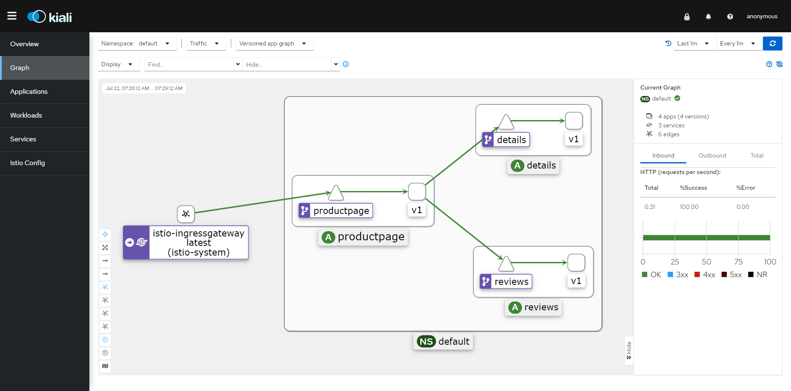

## istio流量控制

### 1 istio微服务治理主要的概念

1 虚拟服务

2 目标规则

3 网关

4 服务入口

5 Sidecar


### 2 istio 流量治理的2个核心概念

1 虚拟服务

2 目标规则


#### 2.1 虚拟服务

配置了服务网格内网络请求到目标请求的路由规则,路由的目标地址既可以是同一个服务的不同版本, 也可以是完全不同的服务

配置示例:

VirtualService :

```yaml
apiversion: networking.istio.io/v1alpha3
kind: VirtualService
metadata:
	name: reviews
spec:
	hosts:
	- reviews
	http:
	- match:
		- headers:
			end-user:
				exact: jason
		route:
		- destination:
			host: reviews
			subset: v2
	- route:
		- destination:
			host: reviews
			subset: v3
```

spec.hosts 字段是客户端向服务发送请求时所使用的地址,这个地址可以是虚拟服务的IP地址, 或DNS名称

在host字段下就是路由规则, 这个示例中使用了基于http头的匹配规则, 这个规则表明, 当header中含有 end-user == jason 的字段值的时候, 请求将会路由到 v2版本

route中的 destination 字段由两部分组成, 在k8s中, host通常为k8s服务的名称, subset则由 destination rule 进行定义, 


#### 2.2 目标规则

DestinationRule :

```yaml
apiversion: networking.istio.io/v1alpha3
kind: DestinationRule
metadata:
	name: reviews-destination-rule
spec:
	host: reviews
	trafficPolicy:
		loadBalancer:
			simple: RANDOM
	subset:
	- name: v1
	  labels:
      	version: v1
    - name: v2
      labels:
      	version: v2
      trafficPolicy:
      	loadBalancer:
      		simple: ROUND_ROBIN
    - name: v3
      labels:
        version: v3
```

在 destination rule 中可以通过定义 subset 控制服务的流量到不同的服务实例中. 在k8s集群中,通常使用 label 标签选择器选择服务的 pod 实例

除了定义子集外, 目标规则还可以设置默认的流量规则, 比如设置 loadbalancer 所使用的负载均衡策略


### 3 流量控制

#### 3.1 v1版本

在bookinfo示例中, 包含了4个独立的微服务, 每个服务包含一个或多个版本, 例如 review 服务就包含3个不同的版本同时运行 . 刷新页面时可以看到3个不同版本的页面展示, 这时因为没有指定默认的路由规则 

查看bookinfo中包含的deployment及其label

```bash
kubectl get deployments.apps --show-labels
```

```bash
root@k8s-master01:/app/istio/istio-1.18.1# kubectl get deployments.apps --show-labels
NAME             READY   UP-TO-DATE   AVAILABLE   AGE    LABELS
details-v1       1/1     1            1           127m   app=details,version=v1
productpage-v1   1/1     1            1           127m   app=productpage,version=v1
ratings-v1       1/1     1            1           127m   app=ratings,version=v1
reviews-v1       1/1     1            1           127m   app=reviews,version=v1
reviews-v2       1/1     1            1           127m   app=reviews,version=v2
reviews-v3       1/1     1            1           127m   app=reviews,version=v3
```

需要为不同的服务版本定义不同的目标规则 ( Destination Rule ) , 这里直接使用 bookinfo 项目中的yaml文件定义

```bash
kubectl apply -f samples/bookinfo/networking/destination-rule-all.yaml
```

```bash
root@k8s-master01:/app/istio/istio-1.18.1# kubectl apply -f samples/bookinfo/networking/destination-rule-all.yaml
destinationrule.networking.istio.io/productpage created
destinationrule.networking.istio.io/reviews created
destinationrule.networking.istio.io/ratings created
destinationrule.networking.istio.io/details created
```


以 review service 为例, 查看已经创建出来的 destination rule

```bash
kubectl get destinationrule.networking.istio.io/reviews -o yaml
```

```yaml
apiVersion: networking.istio.io/v1beta1
kind: DestinationRule
metadata:
  annotations:
    kubectl.kubernetes.io/last-applied-configuration: |
      {"apiVersion":"networking.istio.io/v1alpha3","kind":"DestinationRule","metadata":{"annotations":{},"name":"reviews","namespace":"default"},"spec":{"host":"reviews","subsets":[{"labels":{"version":"v1"},"name":"v1"},{"labels":{"version":"v2"},"name":"v2"},{"labels":{"version":"v3"},"name":"v3"}]}}
  creationTimestamp: "2023-07-21T22:22:20Z"
  generation: 1
  name: reviews
  namespace: default
  resourceVersion: "141330"
  uid: 3a4de37f-c17c-429a-b0af-45ff9bf05577
spec:
  host: reviews
  subsets:
  - labels:
      version: v1
    name: v1
  - labels:
      version: v2
    name: v2
  - labels:
      version: v3
    name: v3
```

可以看到定义了 v1 v2 v3 3个版本,并且使用 label 选择器, 使得能够与 deployment 相对应, 在应用了目标规则后,就可以在 VirtualService 中引用这些目标规则了, 假设当前的目标是希望将所有的流量路由到微服务的v1版本 ,继续使用示例中的 virtual-service 配置文件

```bash
kubectl apply -f samples/bookinfo/networking/virtual-service-all-v1.yaml
```

```bash
root@k8s-master01:/app/istio/istio-1.18.1# kubectl apply -f samples/bookinfo/networking/virtual-service-all-v1.yaml
virtualservice.networking.istio.io/productpage created
virtualservice.networking.istio.io/reviews created
virtualservice.networking.istio.io/ratings created
virtualservice.networking.istio.io/details created
```

应用这个配置文件创建了4个 virtualbox service , 都指向了 destinaton-rule 中的 v1 版本 .

```bash
kubectl get virtualservice.networking.istio.io
```

```bash
root@k8s-master01:/app/istio/istio-1.18.1# kubectl get virtualservice.networking.istio.io
NAME          GATEWAYS               HOSTS             AGE
bookinfo      ["bookinfo-gateway"]   ["*"]             108m
details                              ["details"]       25m
productpage                          ["productpage"]   25m
ratings                              ["ratings"]       25m
reviews                              ["reviews"]       25m
```

以reviews服务为例,继续查看 virtual service 的定义

```bash
kubectl get virtualservice.networking.istio.io reviews -o yaml
```

```yaml
apiVersion: networking.istio.io/v1beta1
kind: VirtualService
metadata:
  annotations:
    kubectl.kubernetes.io/last-applied-configuration: |
      {"apiVersion":"networking.istio.io/v1alpha3","kind":"VirtualService","metadata":{"annotations":{},"name":"reviews","namespace":"default"},"spec":{"hosts":["reviews"],"http":[{"route":[{"destination":{"host":"reviews","subset":"v1"}}]}]}}
  creationTimestamp: "2023-07-21T22:30:02Z"
  generation: 1
  name: reviews
  namespace: default
  resourceVersion: "142970"
  uid: 73db7c7b-ab61-4a17-bca8-3cb125272f2f
spec:
  hosts:
  - reviews
  http:
  - route:
    - destination:
        host: reviews
        subset: v1
```

可以看到当前的 virtual service 全部指向了 reviews service 的 v1 版本, 定义好了 virtual service 之后, 再次使用浏览器访问 

http://192.168.0.151:30223/productpage 快速多次刷新, 可以看到页面始终是 v1 版本的

在kiali中查看流量




#### 3.2 基于用户的流量控制

接下来修改一下路由规则, 实现一个基于用户的路由规则, 将来自 jason 这个用户的所有流量路由到 reviews 服务的 v2 版本, 这个需要前端页面的支持, 在 bookinfo 的页面中, 如果用户点击了登录按钮, 那么所有到reviews服务的http请求中都会添加一个 end-user 的请求头, 在 virtual-service 中将以这个请求头作为匹配规则, 应用bookinfo 示例中的 review-service 的v2版本

```bash
kubectl apply -f samples/bookinfo/networking/virtual-service-reviews-test-v2.yaml
```

```bash
root@k8s-master01:/app/istio/istio-1.18.1# kubectl apply -f samples/bookinfo/networking/virtual-service-reviews-test-v2.yaml
virtualservice.networking.istio.io/reviews configured
```

创建成功之后查看 virtual service 的定义

```bash
kubectl get virtualservice.networking.istio.io/reviews -o yaml
```

输出:

```yaml
apiVersion: networking.istio.io/v1beta1
kind: VirtualService
metadata:
  annotations:
    kubectl.kubernetes.io/last-applied-configuration: |
      {"apiVersion":"networking.istio.io/v1alpha3","kind":"VirtualService","metadata":{"annotations":{},"name":"reviews","namespace":"default"},"spec":{"hosts":["reviews"],"http":[{"match":[{"headers":{"end-user":{"exact":"jason"}}}],"route":[{"destination":{"host":"reviews","subset":"v2"}}]},{"route":[{"destination":{"host":"reviews","subset":"v1"}}]}]}}
  creationTimestamp: "2023-07-21T22:30:02Z"
  generation: 2
  name: reviews
  namespace: default
  resourceVersion: "156768"
  uid: 73db7c7b-ab61-4a17-bca8-3cb125272f2f
spec:
  hosts:
  - reviews
  http:
  - match:
    - headers:
        end-user:
          exact: jason
    route:
    - destination:
        host: reviews
        subset: v2
  - route:
    - destination:
        host: reviews
        subset: v1
```

可以看到有一条匹配规则 headers 匹配 end-user == jason 转到 v2 版本, 在浏览器中打开页面 http://192.168.0.151:30223/productpage 

未登录时:


是v1版本的页面, 点击右上角登录, 账号输入 jason ,密码任意,点击登录之后


可以看到此时页面是v2版本的
