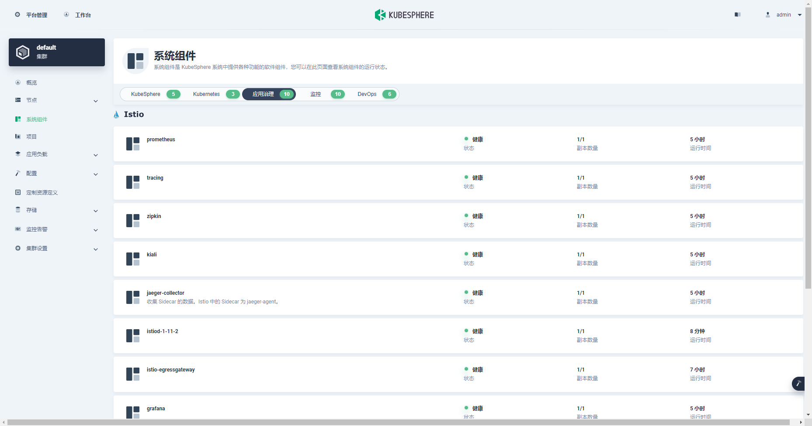
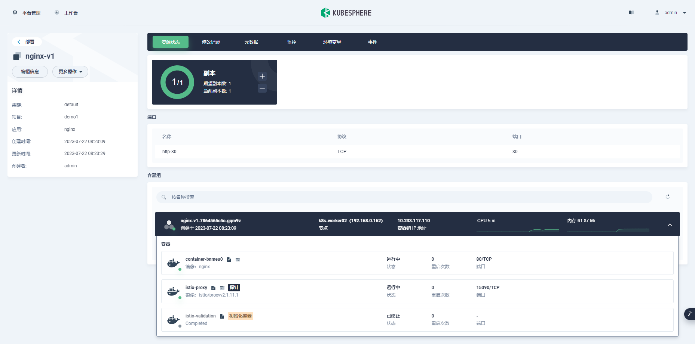
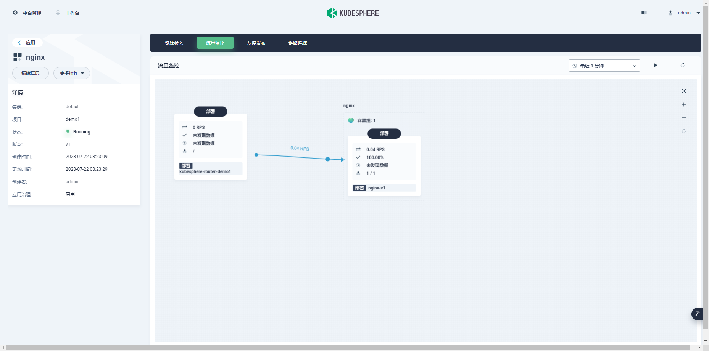
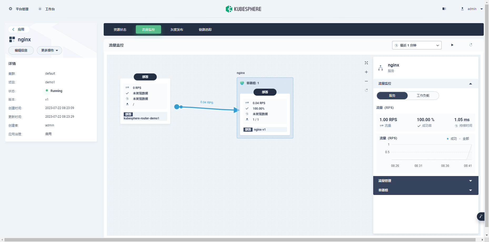
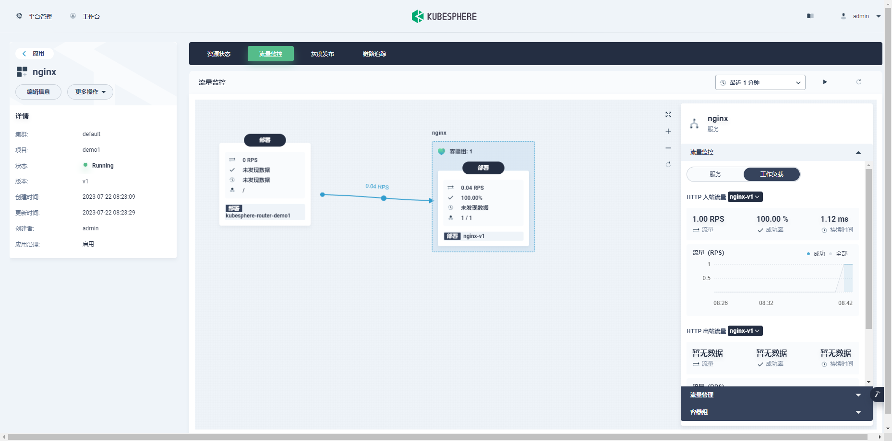

## KubeSphere平台中启用istio服务治理

[toc]

在 KubeSphere 平台中可视化的配置 Istio 的服务治理的相关功能, KubeSphere的服务网格功能基于Istio构建, 在istio的基础上提供了一个可视化的,也更为简单易用的微服务治理平台 .

前提要求: 

k8s集群

KubeSphere集群环境

已安装istioctl


### 1 启用 istio

登录kubesphere工作台, 点击右下角工具箱, 打开kubectl

```bash
kubectl -n kubesphere-system edit cc ks-installer
```

找到

```yaml
  servicemesh:
    enabled: false
    istio:
      components:
        cni:
          enabled: false
        ingressGateways:
        - enabled: false
          name: istio-ingressgateway
```

修改为

```yaml
servicemesh:
    enabled: true # 将“false”更改为“true”。
    istio:
      components:
        ingressGateways:
        - name: istio-ingressgateway # 将服务暴露至服务网格之外。默认不开启。
          enabled: false
        cni:
          enabled: false # 启用后，会在 Kubernetes pod 生命周期的网络设置阶段完成 Istio 网格的 pod 流量转发设置工作。
```

将 enabled 设置为 true, 保存退出后 ks-installer 会自动完成相关组件的安装, Customizing the istio installation configuration, refer to https://istio.io/latest/docs/setup/additional-setup/customize-installation/

```bash
root@k8s-master01:/app/istio/istio-1.18.1# kubectl -n kubesphere-system edit cc ks-installer
clusterconfiguration.installer.kubesphere.io/ks-installer edited
```

查看安装状态信息

```bash
kubectl logs -n kubesphere-system $(kubectl get pod -n kubesphere-system -l 'app in (ks-install, ks-installer)' -o jsonpath='{.items[0].metadata.name}') -f
```

当ks-installer完成组件安装后,可以在KubeSphere平台的集群管理中找到相关组件的状态



在应用治理中可以看到 istio 相关组件的状态


### 2 创建新的演示项目

#### 2.1 创建企业空间

创建 test-com 企业空间


#### 2.2 创建项目

创建项目 project-test


#### 2.3 创建网关

进入项目空间, 在 项目设置-网关设置 中点击开启网关, 创建网关可以暴露集群内部的服务, 方便测试

```bash
访问模式: NodePort
链路追踪: 启用
```


#### 2.4 创建应用

##### 创建自制应用

完成之后在 应用负载-应用-自制应用 点击创建

```bash
名称: app-nginx
版本: v1
应用治理: 开启
描述: 
```

下一步 


##### 创建服务

无状态服务

```bash
名称: service-nginx
别名:
版本: v1
描述:
```

下一步

容器镜像 nginx

使用默认端口

注意: 端口设置中指定协议为 HTTP ,这样istio就可以感知协议,进而进一步使用各种策略,点击完成, 勾选同步主机时区

下一步 ...

创建


##### 路由设置

创建完服务后点击下一步, 进入路由设置

点击添加路由规则

```bash
域名: service-nginx.app-nginx.test.com
协议: HTTP
路径:
	路径: /
	服务: service-nginx
	端口: 80
```

在本机(windows)的 hosts文件中添加规则

```bash
192.168.0.151 service-nginx.app-nginx.test.com
```

在k8s-master01中添加 hosts规则

```bash
vi /etc/hosts
```

添加

```bash
192.168.0.151 service-nginx.app-nginx.test.com
```

注: 自动生成为域名 <服务名称>.<项目名称>.<网关地址>.nip.io 在这里是 nginx.demo1.192.1687.0.151.nip.io


点击创建, 稍等一下服务就可以创建成功


### 3 测试

在 应用负载-应用-自制应用 的服务列表中点击刚创建的 nginx 应用, 进入应用详情页, 点击右侧的 `访问服务` ,会自动自动打开浏览器访问  http://nginx.demo1.test.com:31439/  ,显示为 nginx 首页 , 说明 nginx 服务部署成功

在应用详情页, 点击工作负载中的 nginx ,进入 部署详情页, 点击容器组中 nginx 容器组



即可看到nginx服务中自动注入了 istio-proxy 容器, 这时在 k8s-master01 节点上使用watch命令结合curl模拟连续请求

```bash
watch -n 1 curl http://nginx.demo1.test.com:31439/
```



点击 nginx 容器可以在右侧看到当前的并发数



以及流量和成功率等信息




链路追踪


灰度发布

