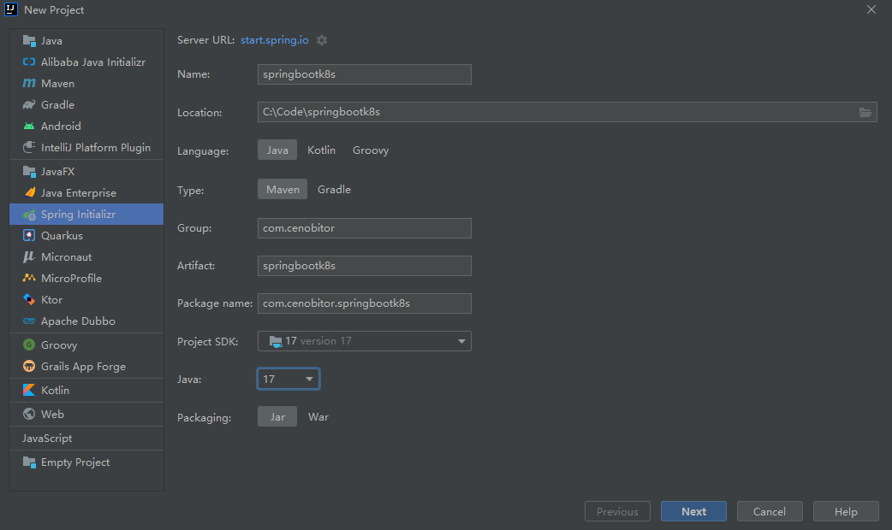
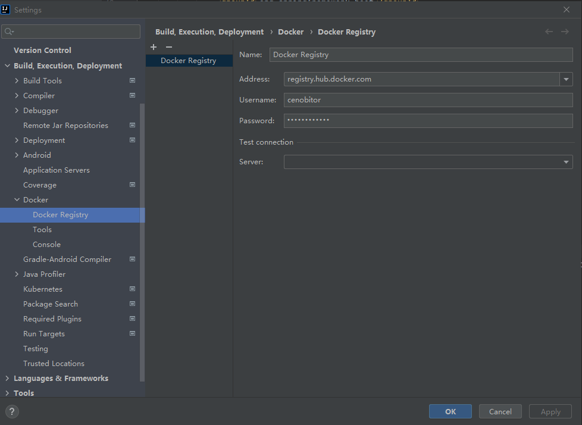
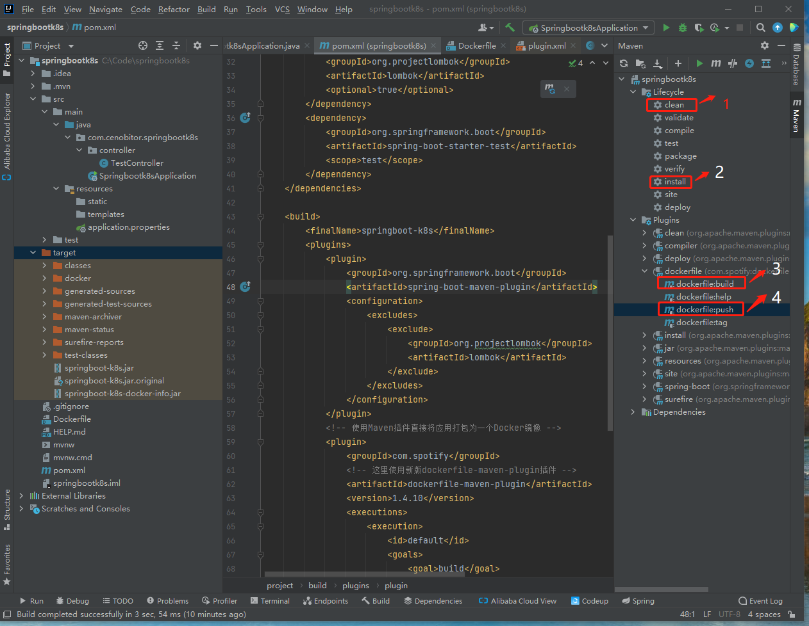
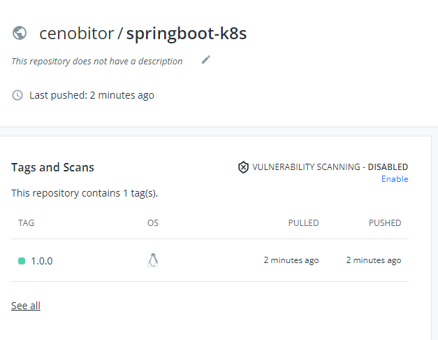
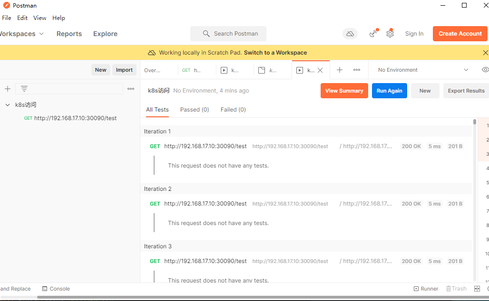
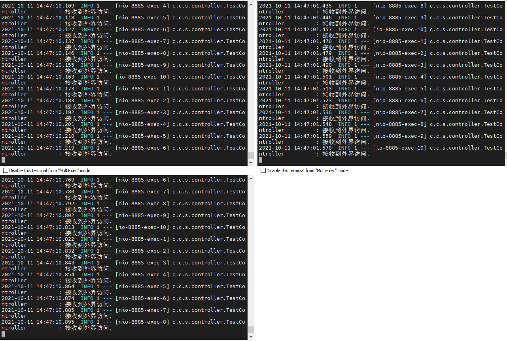

# SpringBoot打包部署到K8s示例


### 一、前提条件

有Kubenertes集群可用，docker环境、docker hub上创建了私有仓库；

集群搭建可参考我一篇笔记：https://www.cnblogs.com/gdwkong/p/15253215.html

### 二、新建springboot示例工程

#### 1、使用IDEA开发工具创建一个简单的WEB



#### 2、编写pom.xml镜像打包插件

[](javascript:void(0);)

```
<build>
        <finalName>springboot-k8s</finalName>
        <plugins>
            <plugin>
                <groupId>org.springframework.boot</groupId>
                <artifactId>spring-boot-maven-plugin</artifactId>
                <configuration>
                    <excludes>
                        <exclude>
                            <groupId>org.projectlombok</groupId>
                            <artifactId>lombok</artifactId>
                        </exclude>
                    </excludes>
                </configuration>
            </plugin>
            <!-- 使用Maven插件直接将应用打包为一个Docker镜像 -->
            <plugin>
                <groupId>com.spotify</groupId>
                <!-- 这里使用新版dockerfile-maven-plugin插件 -->
                <artifactId>dockerfile-maven-plugin</artifactId>
                <version>1.4.10</version>
                <executions>
                    <execution>
                        <id>default</id>
                        <goals>
                            <goal>build</goal>
                            <goal>push</goal>
                        </goals>
                    </execution>
                </executions>
                <configuration>
                    <!-- Dockerfile目录指定 根目录下-->
                    <dockerfile>Dockerfile</dockerfile>
                    <!--远程仓库名 -->
                    <repository>cenobitor/${project.build.finalName}</repository>
                    <!-- 生成镜像标签 如不指定 默认为latest -->
                    <tag>${project.version}</tag>
                    <buildArgs>
                        <!-- 理论上这里定义的参数可以传递到Dockerfile文件中，目前未实现 -->
                        <JAR_FILE>${project.build.finalName}.jar</JAR_FILE>
                    </buildArgs>
                </configuration>
            </plugin>
        </plugins>
    </build>
```

[](javascript:void(0);)

#### 3、指定开放端口

在application.properties指定开放端口

```
#指定开放端
server.port=8885
```

#### 4、编写一个简单接口

[](javascript:void(0);)

```
package com.cenobitor.springbootk8s.controller;

import lombok.extern.slf4j.Slf4j;
import org.springframework.web.bind.annotation.GetMapping;
import org.springframework.web.bind.annotation.RestController;

@Slf4j
@RestController
public class TestController {

      @GetMapping("/test")
      public String test(){
          log.info("接收到外界访问.");
          return "欢迎访问K8s中的springboot项目";
      }

}
```

[](javascript:void(0);)

### 三、编写DockerFile 文件

[](javascript:void(0);)

```
#基础镜像，如果本地仓库没有，会从远程仓库拉取
FROM openjdk:17
#暴露端口
EXPOSE 8885
#容器中创建目录
RUN mkdir -p /usr/local/cenobitor
#编译后的jar包copy到容器中创建到目录内
COPY target/springboot-k8s.jar /usr/local/cenobitor/app.jar
#指定容器启动时要执行的命令
ENTRYPOINT ["java","-jar","/usr/local/cenobitor/app.jar"]
```

[](javascript:void(0);)

### 四、打包上传镜像

#### 1、设置镜像仓库地址



####  2、镜像打包推送到私有仓库

依次执行指定操作，1、2、3、4



镜像仓库可以看到该镜像



### 五、Kubenertes部署

#### 1、创建部署文件springboot-k8s.yaml

[](javascript:void(0);)

```
apiVersion: v1
kind: Service
metadata:
  name: springboot-k8s
  namespace: dev
  labels:
    app: springboot-k8s
spec:
  type: NodePort
  ports:
    - port: 8885
      nodePort: 30090 #service对外开放端口
  selector:
    app: springboot-k8s
---
apiVersion: apps/v1
kind: Deployment #对象类型
metadata:
  name: springboot-k8s #名称
  namespace: dev
  labels:
    app: springboot-k8s #标注
spec:
  replicas: 3 #运行容器的副本数，修改这里可以快速修改分布式节点数量
  selector:
    matchLabels:
      app: springboot-k8s
  template:
    metadata:
      labels:
        app: springboot-k8s
    spec:
      containers: #docker容器的配置
        - name: springboot-k8s
          image: docker.io/cenobitor/springboot-k8s:1.0.0 # pull镜像的地址 ip:prot/dir/images:tag
          imagePullPolicy: IfNotPresent #pull镜像时机，
          ports:
            - containerPort: 8885 #容器对外开放端口,需与springboot配置文件一致
      #从私有仓库拉取镜像凭证
      imagePullSecrets:
        - name: regcred
```

[](javascript:void(0);)

#### 2、配置私有仓库拉取镜像凭证

参考：https://kubernetes.io/zh/docs/tasks/configure-pod-container/pull-image-private-registry/#registry-secret-existing-credentials

#### 3、创建命名空间

```
kubectl create ns dev
```

#### 4、部署应用

```
kubectl create -f springboot-k8s.yaml
```

#### 5、查看部署及查看pod日志

\# 实时查看指定pod的日志

 

kubectl logs -f <pod_name> -n <namespace>

[](javascript:void(0);)

```
[root@master1 ~]# kubectl get pod -n dev -o wide
NAME                             READY   STATUS    RESTARTS   AGE   IP             NODE    NOMINATED NODE   READINESS GATES
springboot-k8s-bb9bc44cd-9r879   1/1     Running   0          25m   10.244.4.18    node1   <none>           <none>
springboot-k8s-bb9bc44cd-c54sb   1/1     Running   0          25m   10.244.4.17    node1   <none>           <none>
springboot-k8s-bb9bc44cd-fsmkt   1/1     Running   0          25m   10.244.3.114   node2   <none>           <none>
[root@master1 ~]# kubectl logs -f springboot-k8s-bb9bc44cd-9r879 -n dev
```

[](javascript:void(0);)

#### 7、Postman访问循环访问2000次

 

#### 7、日志情况



### 六、所遇问题及解决方法

部署时发生错误：failed to set bridge addr: "cni0" already has an IP address different from 10.244.1.1/24

原因：所在节点服务器重启，flannel文件丢失，cni0网卡地址flannel1不在同一网段；

解决方法：首先停用网络，然后删除配置

```
ifconfig cni0 down    
ip link delete cni0
```

重新部署应用，具体可参考一位大神的文章：https://blog.csdn.net/Wuli_SmBug/article/details/104712653

 