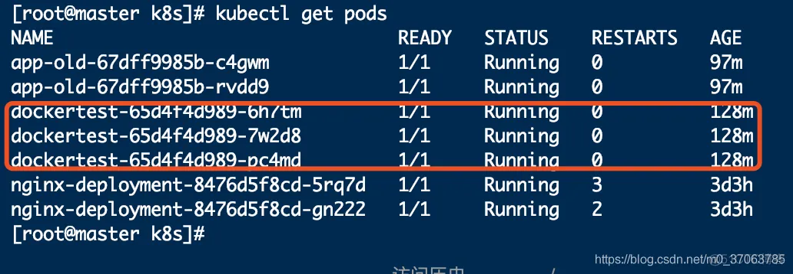
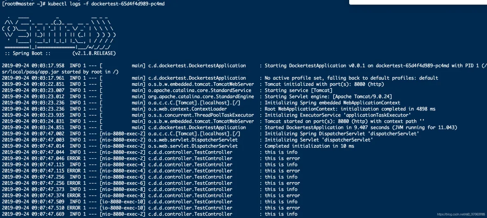
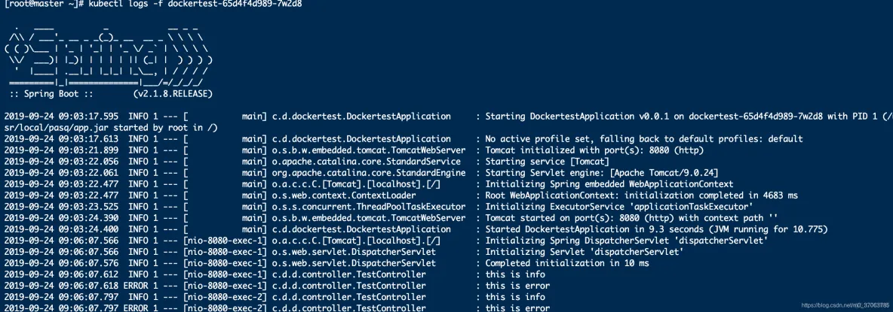
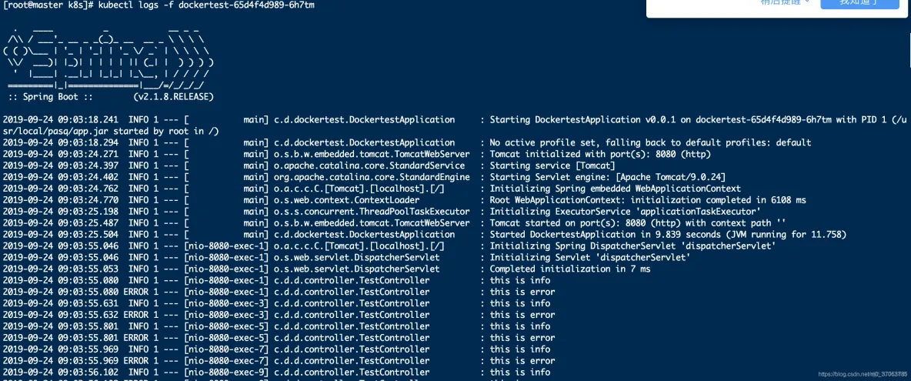

# Kubernetes集群部署SpringBoot项目常见配置及常用处理方式

部分内容参考地址：
CSDN：

- ：[ Spring Boot 项目转容器化 K8S 部署实用经验分享](https://blog.51cto.com/u_6207455/3350590)

一、必要条件

1. K8S环境机器做部署用，推荐一主双从。[ 推荐安装文档](https://kuboard.cn/install/install-k8s.html#from_org_cn)
2. Docker Harbor私有仓库，准备完成后在需要使用仓库的机器docker login。
3. 开发机器需要Docker环境，build及push使用

二、项目配置

## 2.1 maven配置

### 1. properties配置

```xml
 <properties>
     <docker.image.prefix>pasq</docker.image.prefix>
     <!-- docker harbor地址 -->
     <docker.repostory>192.168.1.253:8081</docker.repostory>
 </properties>
```

### 2. plugins配置

```xml
  <properties>
  	 	<docker.repostory>192.168.0.10:1180</docker.repostory>
        <docker.registry.name>test</docker.registry.name>
        <docker.image.tag>1.0.0</docker.image.tag>
        <docker.maven.plugin.version>1.4.10</docker.maven.plugin.version>
  </properties>

<build>
  		<finalName>test-starter</finalName>
		<plugins>
            <plugin>
			    <groupId>org.springframework.boot</groupId>
			    <artifactId>spring-boot-maven-plugin</artifactId>
			</plugin>
			
			<!-- docker的maven插件，官网：https://github.com/spotify/docker‐maven‐plugin -->
			<!-- Dockerfile maven plugin -->
			<plugin>
			    <groupId>com.spotify</groupId>
			    <artifactId>dockerfile-maven-plugin</artifactId>
			    <version>${docker.maven.plugin.version}</version>
			    <executions>
			        <execution>
			        <id>default</id>
			        <goals>
			            <!--如果package时不想用docker打包,就注释掉这个goal-->
			            <goal>build</goal>
			            <goal>push</goal>
			        </goals>
			        </execution>
			    </executions>
			    <configuration>
			    	<contextDirectory>${project.basedir}</contextDirectory>
			        <!-- harbor 仓库用户名及密码-->
			        <useMavenSettingsForAuth>useMavenSettingsForAuth>true</useMavenSettingsForAuth>
			        <repository>${docker.repostory}/${docker.registry.name}/${project.artifactId}</repository>
			        <tag>${docker.image.tag}</tag>
			        <buildArgs>
			            <JAR_FILE>target/${project.build.finalName}.jar</JAR_FILE>
			        </buildArgs>
			    </configuration>
			</plugin>

        </plugins>
        
		<resources>
			<!-- 指定 src/main/resources下所有文件及文件夹为资源文件 -->
			<resource>
				<directory>src/main/resources</directory>
				<targetPath>${project.build.directory}/classes</targetPath>
				<includes>
					<include>**/*</include>
				</includes>
				<filtering>true</filtering>
			</resource>
		</resources>
	</build>
```

## 2.2 服务镜像相关配置

镜像可以分为基础镜像和应用镜像。

### 1. 基础镜像

基础镜像要求体积尽量小，方便拉取，同时安装一些必要的软件，方便后期进入容器内排查问题，我们需要准备好服务运行的底层系统镜像，比如 Centos、Ubuntu 等常见 Linux 操作系统，然后基于该系统镜像，构建服务运行需要的环境镜像，比如一些常见组合：`Centos + Jdk`、`Centos + Jdk + Tomcat`、`Centos + nginx` 等，由于不同的服务运行依赖的环境版本不一定一致，所以还需要制作不同版本的环境镜像，例如如下基础镜像版本。

- **Centos6.5 + Jdk1.8**: `registry.docker.com/baseimg/centos-jdk:6.5_1.8`
- **Centos7.5 + Jdk1.8**: `registry.docker.com/baseimg/centos-jdk:7.5_1.8`
- **Centos7.5 + Jdk1.7**: `registry.docker.com/baseimg/centos-jdk:7.5_1.7`
- **Centos7 + Tomcat8 + Jdk1.8**: `registry.docker.com/baseimg/centos-tomcat-jdk:7.5_8.5_1.8`
- **Centos7 + Nginx**: `registry.docker.com/baseimg/centos-tomcat-jdk:7.5_1.10.2`
- **…**

这样，就可以标识该基础镜像的系统版本及软件版本，方便后边选择对应的基础镜像来构建应用镜像。基础镜像的制作方法之一，可以参考[ 使用 febootstrap 制作自定义基础镜像](https://blog.51cto.com/u_6207455/3347151) 方式。

### 2. 应用镜像

有了上边的基础镜像后，就很容易构建出对应的应用镜像了，例如一个简单的应用镜像 Dockerfile 如下：

```bash
FROM registry.docker.com/baseimg/centos-jdk:7.5_1.8

COPY app-name.jar /opt/project/app.jar
EXPOSE 8080
ENTRYPOINT ["/java", "-jar", "/opt/project/app.jar"]
```

当然，这里我建议使用另一种方式来启动服务，将启动命令放在统一 `shell` 启动脚本执行，例如如下Dockerfile 示例：

```bash
#基础镜像，如果本地仓库没有，会从远程仓库拉取
FROM registry.docker.com/baseimg/centos-jdk:7.5_1.8
#编译后的jar包copy到容器中创建到目录内
COPY app-name.jar /opt/project/app.jar
COPY entrypoint.sh /opt/project/entrypoint.sh
EXPOSE 8080
#指定容器启动时要执行的命令
ENTRYPOINT ["/bin/sh", "/opt/project/entrypoint.sh"]
```

将服务启动命令配置到 `entrypoint.sh`，这样我们可以扩展做很多事情，比如启动服务前做一些初始化操作等，还可以向容器传递参数到脚本执行一些特殊操作，而且这里变成脚本来启动，这样后续构建镜像基本不需要改 Dockerfile 了。

```bash
#!/bin/bash
# do other things here
java -jar $JAVA_OPTS /opt/project/app.jar $1  > /dev/null 2>&1
```

上边示例中，我们就注入 `$JAVA_OPTS` 环境变量，来优化 `JVM` 参数，还可以传递一个变量，这个变量大家应该就猜到了，就是服务启动加载哪个配置文件参数，例如：`--spring.profiles.active=prod` 那么，在 Deployment 中就可以通过如下方式配置了：

```yaml
...
spec:
  containers:
    - name: project-name
      image: registry.docker.com/project/app:v1.0.0
      args: ["--spring.profiles.active=prod"]
      env:
	   - name: JAVA_OPTS
	     value: "-XX:PermSize=512M -XX:MaxPermSize=512M -Xms1024M -Xmx1024M..."
...
```

是不是很方便，这里可扩展做的东西还很多，根据项目需求来配置。

## 2.3 构建镜像并推送

1. 构建镜像，执行如下命令
   
   构建镜像日志如下
   
2. 完成后`docker images`可以查看打包的镜像
   
3. 命令窗口执行`docker push REPOSITORY`推送至docker harbor
   
   docker harbor可以查看到推送的镜像
   

## 2.4 Jenkins配置发布项目

定位到Jenkins的“构建模块”，使用Execute Shell来构建发布项目到K8S集群。

执行的命令依次如下所示。

```bash
#删除本地原有的镜像,不会影响Harbor仓库中的镜像
docker rmi 192.168.0.10:1180/test/test-starter:1.0.0
#使用Maven编译、构建Docker镜像，执行完成后本地Docker容器中会重新构建镜像文件
/usr/local/maven-3.6.3/bin/mvn -f ./pom.xml clean install -Dmaven.test.skip=true
#登录 Harbor仓库
docker login 192.168.0.10:1180 -u binghe -p Binghe123
#上传镜像到Harbor仓库
docker push 192.168.0.10:1180/test/test-starter:1.0.0
#停止并删除K8S集群中运行的
/usr/bin/kubectl delete -f test.yaml
#将Docker镜像重新发布到K8S集群
/usr/bin/kubectl apply -f test.yaml
```

## 2.5 服务日志输出处理

对于日志处理，之前我们一般会使用 `Log4j` 或 `Logstash` 等日志框架将日志输出到服务器指定目录，容器化部署后，日志会生成到容器内某个配置的目录上，外部是没法访问的，所以需要将容器内日志挂载到宿主机某个目录 (例如：`/opt/logs` 目录)，这样方便直接查看，或者配置 `Filebeat`、`Fluent` 等工具抓取到 `Elasticsearch` 来提供日志查询分析。在 Deployment 配置日志挂载方式也很简单，配置如下：

```yaml
...
    volumeMounts:
    - name: app-log
      mountPath: /data/logs/serviceA  #log4j 配置日志输出到指定目录
...
	volumes:
    - name: app-log
      hostPath:
        path: /opt/logs #宿主机指定目录
```

这里有个地方需要特别注意一下：服务日志要关闭 Console 输出，避免直接输出到控制台。默认 Docker 会记录控制台日志到宿主机指定目录，日志默认输出到 `/var/lib/docker/containers/<container_id>/<container_id>-json.log`，为了避免出现日志太多，占用磁盘空间，需要关闭 Console 输出并定期清理日志文件。

三、K8S部署

当准备好镜像文件后，要部署到`Kubernetes`就非常容易了，只需要一个`yaml`格式的文件即可，这个文件能描述你所需要的组件，如`Deployment`、`Service`、`Ingress`等。

### 部署前的一些准备工作(可设置docker harbor远程登录并docker login)

K8S 在部署服务前，需要做一些准备工作，例如提前创建好对应的 Namespace，避免首次直接创建 Deployment 出现 Namespace 不存在而创建失败。如果我们使用的私有镜像仓库，那么还需要生成 Docker Repository 登录认证 Secret，用来注入到 Pod 内拉取镜像时认证需要。

```yaml
# 包含登录认证信息的 Secret
apiVersion: v1
kind: Secret
metadata:
  name: docker-regsecret
type: kubernetes.io/dockerconfigjson
data:
  .dockerconfigjson: InN1bmRhbmRhbjE4MDUyOEBjcmVkaXRoYdfe3JhdXRocyI6eyJyZWdpc3RyeS1pb

# Deployment 中注入该 Secret
	imagePullSecrets:
    - name: docker-regsecret
```

## 3.1 创建springboot.yaml文件如下

```yaml
apiVersion: v1
kind: Service   # Kind类型有:`Deployment`、`Service`、`Pod`、`Ingress`等
metadata:
  name: springboot
  namespace: default   # 命名空间，默认default
  labels:
    app: springboot
spec:
  type: NodePort
  ports:
  - port: 8080
    name: springboot
    protocol: TCP
    targetPort: 8080
    nodePort: 30090 # service对外开放端口
  selector:
    app: springboot
---
apiVersion: apps/v1
kind: Deployment  # 对象类型
metadata:
  name: springboot # 名称
  labels:
    app: springboot # 标注 
spec:
  replicas: 3 # 运行容器的副本数，修改这里可以快速修改分布式节点数量
  selector:
    matchLabels:
      app: springboot
  template:
    metadata:
      labels:
        app: springboot
    spec:
      containers: # docker容器的配置
        - name: springboot
        image: 192.168.1.253:8081/pasq/dockertest:0.0.1 # pull镜像的地址 ip:prot/dir/images:tag
        imagePullPolicy: IfNotPresent # pull镜像时机，
        ports:
          - containerPort: 8080 # 容器对外开放端口
```

`Kind`：类型，有`Deployment`、`Service`、`Pod`、`Ingress`等，非常丰富；

`metadata`：用于定义一些组件信息，如名字、标签等；

`labels`：标签功能，非常有用，用于选择关联；但`label`不提供唯一性，可以使用组合来选择；

`nodePort`：对于需要给外部暴露的服务，有三种方式：`NodePorts`、`LoadBalancer`、`Ingress`，这里使用`NodePorts`；需要注意的是，默认它的端口范围是`[3000-32767]`，需要其它范围则需要修改相关参数。

## 3.2 运行`kubectl create -f springboot.yaml`创建Deployment

```bash
kubectl create -f springboot.yaml
1.
```

完成后执行`kubectl get pods`如下图，可以看到启动了三个pod


通过命令检查是否启动成功：

```bash
kubectl get deployment

kubectl get service

kubectl get pod
1.2.3.4.5.
```

## 3.3 运行`kubectl logs -f podsname`查看日志

```bash
kubectl logs -f springboot
1.
```

新开窗口分别查看3个pod的日志，然后访问`k8s master节点IP+service对外开放端口`访问springboot应用，我这里使用`http://192.168.1.250:30090/test/test`, 多刷新几次可以看到pod直接做了负载，如下图：
pods1:

pods2:

pods3:

运行`kubectl delete -f dockertest.yaml`可以删除pods与service
修改dockertest.ymal 中replicas数量后，运行`kubectl apply -f dockertest.yaml`可以扩容或收缩副本数量

## 3.4 结束一个pod

`Kubernetes`最小管理元素并不是容器，而是`Pod`。

```bash
$ kubectl delete pod pkslow-springboot-deployment-68dffc6795-89xww
pod "pkslow-springboot-deployment-68dffc6795-89xww" deleted

$ kubectl get pod
NAME                                            READY   STATUS    RESTARTS   AGE
pkslow-springboot-deployment-68dffc6795-874tp   1/1     Running   0          13m
pkslow-springboot-deployment-68dffc6795-gpw67   1/1     Running   0          46s
```

可以发现，删除了其它一个`Pod`后，会自动为我们新生成一个`Pod`，这样能提高整个服务的高可用。

## 3.5 杀死一个容器

探索一下如果杀死一个容器实例，会有什么反应。

```bash
$ docker ps
$ docker rm -f 57869688a226
57869688a226

$ docker ps
```

经实验，杀死一个容器后，也会自动为我们重新生成一个容器实例。而`Pod`并不会变化，也不会重新生成。

## 3.6 快速扩容

用户请求突增，服务要撑不住了，这时需要增加`Pod`的个数。只需要修改`yaml`配置文件的`replicas`，将它更新为`replicas: 4`。然后执行以下命令：

```bash
$ kubectl apply -f pksow-springboot.yaml
```

查看`Dashboard`，在原有两个`Pod`的基础上，增加了两个。

四、容器服务访问处理

首先需要提供容器服务需要暴露的目标端口号，例如 `Http`、`Https`、`Grpc` 等服务端口，创建 Service 时需要指定匹配的容器端口号，Deployment 中配置容器暴露端口配置如下：

```yaml
	ports:
    - containerPort: 8080
      name: http
      protocol: TCP
    - containerPort: 443
      name: https
      protocol: TCP
    - containerPort: 18989
      name: dubbo
      protocol: TCP
```

### 4.2、服务对内对外访问方式选择

K8S Service 暴露服务类型有三种：`ClusterIP`、`NodePort`、`LoadBalancer`，三种类型分别有不同的应用场景。

- **对内服务发现**，可以使用 `ClusterIP` 方式对内暴露服务，因为存在 Service 重新创建 IP 会更改的情况，所以不建议直接使用分配的 `ClusterIP` 方式来内部访问，可以使用 K8S DNS 方式解析，DNS 命名规则为：`<svc_name>.<namespace_name>.svc.cluster.local`，按照该方式可以直接在集群内部访问对应服务。
- **对外服务暴露**，可以采用 `NodePort`、`LoadBalancer` 方式对外暴露服务，`NodePort` 方式使用集群固定 `IP`，但是端口号是指定范围内随机选择的，每次更新 Service 该 `Port` 就会更改，不太方便，当然也可以指定固定的 `NodePort`，但是需要自己维护 `Port` 列表，也不方便。`LoadBalancer` 方式使用集群固定 `IP` 和 `NodePort`，会额外申请申请一个负载均衡器来转发到对应服务，但是需要底层平台支撑。如果使用 `Aliyun`、`GCE` 等云平台商，可以使用该种方式，他们底层会提供 `LoadBalancer` 支持，直接使用非常方便。

以上方式或多或少都会存在一定的局限性，所以建议如果在公有云上运行，可以使用 `LoadBalancer`、 `Ingress` 方式对外提供服务，私有云的话，可以使用 `Ingress` 通过域名解析来对外提供服务。`Ingress` 配置使用，可以参考 [ 初试 Kubernetes 暴漏服务类型之 Nginx Ingress](https://blog.51cto.com/lovebetterworld/2842652) 文章。

五、服务健康监测配置

K8s 提供存活探针和就绪探针，来实时检测服务的健康状态，如果健康检测失败，则会自动重启该 Pod 服务，检测方式支持 `exec`、`httpGet`、`tcpSocket` 三种。对于 Spring Boot 后端 API 项目，建议采用 `httpGet` 检测接口的方式，服务提供特定的健康检测接口，如果服务正常则返回 `200` 状态码，一旦检测到非 `200` 则会触发自动重启机制。K8S 健康监测配置示例如下：

```yaml
 livenessProbe: # 是否存活检测
    failureThreshold: 3
    httpGet:
      path: /api/healthz
      port: 8080
      scheme: HTTP
    initialDelaySeconds: 300
    periodSeconds: 60
    successThreshold: 1
    timeoutSeconds: 2
  readinessProbe: # 是否就绪检测
    failureThreshold: 1
    httpGet:
      path: /api/healthz
      port: 8080
      scheme: HTTP
    periodSeconds: 5
    successThreshold: 1
    timeoutSeconds: 2 
```

六、服务 CPU & Mem 请求/最大值配置

K8S 在部署 Deployment 时，可以为每个容器配置最小及最大 CPU & Mem 资源限制，这个是很有必要的，因为不配置资源限制的话，那么默认该容器服务可以无限制使用系统资源，这样如果服务异常阻塞或其他原因，导致占用系统资源过多而影响其他服务的运行，同时 K8S 集群资源不足时，会优先干掉那些没有配置资源限制的服务。当然，请求资源量和最大资源量要根据服务启动实际需要来配置，如果不清楚需要配置多少，可以先将服务部署到 K8S 集群中，看正常调用时监控页面显示的请求值，在合理配置。

```yaml
resources:
  limits:
    cpu: "1000m"
    memory: "1024Mi"
  requests:
    cpu: "500m"
    memory: "512Mi"
```

七、K8S集群部署其他注意事项

### 灵活使用 ConfigMap 资源类型

K8S 提供 ConfigMap 资源类型来方便灵活控制配置信息，我们可以将服务需要的一些 `ENV` 信息或者配置信息放到 ConfigMap 中，然后注入到 Pod 中即可使用，非常方便。ConfigMap 使用方式有很多种，这里建议大家可以将一些经常更改的配置放到 ConfigMap 中，例如我在实际操作中，就发现有的项目 `nginx.conf` 配置，还有配置的 `ENV` 环境变量信息经常变动，那么就可以放在 ConfigMap 中配置，这样 Deployment 就不需要重新部署了。

```yaml
# 包含 nginx.conf 配置的 ConfigMap
apiVersion: v1
kind: ConfigMap
metadata:
  name: nginx-conf-configmap
  data:
    www.conf: |
      server {
        listen 80;
        server_name 127.0.0.1

        root /opt/project/nginx/html/;
        error_page 405 =200 $uri;

        access_log  /opt/project/nginx/logs/http_accesss.log  main;
        error_log   /opt/project/nginx/logs/http_error.log;
      }

# 将 ConfigMap 挂载到容器指定目录
volumes:
- name: nginx-config
  configMap:
    defaultMode: 420
    name: nginx-conf-configmap
```

这里有一个使用 ConfigMap 优雅加载 Spring Boot 配置文件实现方式的示例

### Deployment 资源部署副本数及滚动更新策略

K8S 建议使用 Deployment 资源类型启动服务，使用 Deployment 可以很方便的进行滚动更新、扩缩容/比例扩容、回滚、以及查看更新版本历史记录等。所以建议副本数至少 2 个，保证服务的可用性，要根据服务实际访问量，来合理配置副本数，过多造成资源浪费，过少造成服务负荷高响应慢的问题，当然也可以根据服务访问量，灵活扩缩容副本数。

Deployment 更新策略有 `Recreate` 和 `RollingUpdate` 两种，`Recreate` 方式在创建出新的 Pod 之前会先杀掉所有已存在的 Pod，这种方式不友好，会存在服务中断，中断的时间长短取决于新 Pod 的启动就绪时间。`RollingUpdate` 滚动更新方式，通过配合指定 `maxUnavailable` 和 `maxSurge` 参数来控制更新过程，使用该策略更新时会新启动 `replicas` 数量的 Pod，新 Pod 启动完毕后，在干掉旧 Pod，如果更新过程中，新 Pod 启动失败，旧 Pod 依旧可以提供服务，直到启动完成，服务才会切到新 Pod，保证服务不会中断，建议使用该策略。

```yaml
replicas: 2
strategy:
  rollingUpdate:
    maxSurge: 1  #也可以按比例配置，例如：20%
    maxUnavailable: 0 #也可以按比例配置，例如：20%
  type: RollingUpdate
```

### 要保证 K8S 资源 CPU & Mem & Disk 资源够用

要时刻关注 K8S 集群资源使用情况，保证系统资源够集群使用，否则会出现因为 CPU 、Mem、Disk 不够用导致 Deployment 调度失败的情况。

### K8S 集群配置项优化

K8S 集群创建每个 Namespaces 时默认会创建一个名称为 `default` 的 ServiceAccount，该 ServiceAccount 包含了名称为 `default-token-xxxx` 的 Secret，该 Secret 包含集群 api-server 使用的根 `CA` 证书以及认证用的令牌 `Token`，而且默认新创建 Pod 时会自动将该 ServiceAccount 包含的信息自动注入到 Pod 中，在 Pod 中可以直接使用这些认证信息连接集群执行 api 相关操作，这样会存在一定的风险，所以建议使用 `automountServiceAccountToken: false` 配置来关闭自动注入。

另一个配置 `progressDeadlineSeconds`，该配置用来指定在升级或部署时，由于各种原因导致卡住（还没有表明升级或部署失败），等待的 deadline 秒数，如果超过该 deadline 时间，那么将上报并标注 Deployment 状态为 False 并注明失败原因，然后 Deployment 继续执行后续操作。默认为 `600` 秒，如果觉得改时间太长，可以按照可接受的时间来修改配置，例如配置为 120 秒 `progressDeadlineSeconds: 120`。