# 云原生架构之Spring Cloud+Kubernetes配置中心方案


## 一 方案概述

利用Kubernetes原生configmap/secret 资源作为[配置中心](https://so.csdn.net/so/search?q=配置中心&spm=1001.2101.3001.7020)，不用关注服务可用性，即网络问题，同时也不用引入新的组建，造成运维成本。

## 二 SpringCloudKubernetes 配置中心方案

### 2.1 方案介绍

2.1.1 spring-cloud-[starter](https://so.csdn.net/so/search?q=starter&spm=1001.2101.3001.7020)-kubernetes-config

spring-cloud-starter-kubernetes-config是spring-cloud-starter-kubernetes下的一个库，作用是将kubernetes的configmap与SpringCloud Config结合起来。 `spring-boot-actuator` / `spring-boot-actuator-autoconfigure` 两个包的引入，使得应用可以进行热更新，当configmap/secret发生变更的时候，可以不重启Pod或进程进行热变更配置。

2.1.2 功能简介

SpringCloud Kubernetes Config 组件主要提供以下几种功能：

- 实时监控 ConfigMap、Secret 配置变化从而更新服务配置。
- 定时轮询加载 ConfigMap、Secret 配置从而更新服务配置。

### 2.2 配置发现过程

本质上配置管理利用了etcd的存储，首先是应用调用 spring-cloud-kubernetes-config 包，其调用了底层java实现的kubernetes-client，通过调用k8s api来实现从etcd中获取configmap和secret资源信息。

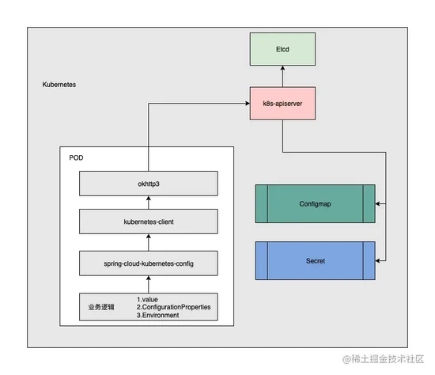

### 2.3 方案特点

- 优点：
  - 使用K8s内置资源，无需考虑引入配置中心服务，不用考虑配置中心服务高可用。
  - 云原生架构，配置中心下沉至基础设施层，无需业务代码耦合，减少成本。
- 不足：
  - dev/test 环境也需要上K8s，确保环境一致性。
  - 需要将配置资源configmap/secret引入到GitOps流程中。

## 三 实战

新建 bootstrap.yml 配置文件，最终的application.yaml 使用k8s 的configmap/secret资源。

```yaml
spring:
  profiles:
    ## 如果 PROFILE 为空，则使用dev
    active: ${PROFILE:dev}
    
  application:
    name: springboot-config
    
  cloud:
    # 监控k8s configmap/secret api获取配置
    kubernetes:
      reload:
        #自动更新配置的开关设置为打开
        enabled: true
        #更新配置信息的模式：polling是主动拉取，event是事件通知
        mode: polling
        #主动拉取的间隔时间是500毫秒
        period: 500
        #是否监控 Secret 的更改来执行更新
        monitoring-secrets: true
      config:
        namespace: springconfig
        name: ${spring.application.name}-cm
      # 模式仅启动configmap获取，启用secret使用enable-api
      secrets:
        enable-api: true
        namespace: springconfig
        name: ${spring.application.name}-secret
        #labels:                  #指定 Label 标签名词，根据这个标签筛选 Secret，读取其中配置
        #  secret: enabled        #自定义的 Label
management:
  endpoint:
    restart:
      enabled: true
    health:
      enabled: true
    info:
      enabled: true
```

在此模拟三种获取配置方式：

```cobol
ConfigurationProperties
Environment
```

### 3.1 Configmap

3.1.1 value方式

```java
// -----------------value configmap-----------------
@Value("${config.applicationVersion}")
private String applicationVersion;

@Value("${config.app.domain}")
private String domain;

// configmap value
@RequestMapping("/value")
public String value() {
    return applicationVersion + "|" + domain;
}
```

3.1.2 ConfigurationProperties

```java
@Data
@ConfigurationProperties(prefix = "config")
@Component
public class SpringBootConfigProperties {
    private String applicationVersion;
    public String getApplicationVersion() {
        return applicationVersion;
    }
}

// -----------------properties configmap-----------------
@Autowired
private SpringBootConfigProperties springBootConfigProperties;

// configmap properties
@RequestMapping("/properties")
public String propertie() {
    return springBootConfigProperties.getApplicationVersion();
}
```

3.1.3 Environment

```java
// -----------------env configmap & secret-----------------
@Autowired
private Environment environment;

// configmap env
@RequestMapping("/env")
public String env() {
    return environment.getProperty("config.applicationVersion") + "|" + environment.getProperty("config.app.domain");
}
```

### 3.2 Secret

3.2.1 value

```java
// -----------------value secret-----------------
@Value("${secret.username}")
private String username;

@Value("${secret.password}")
private String password;

// secret value
@RequestMapping("/valuesecret")
public String values() {
    return username + "|" + password;
}
```

3.2.2 ConfigurationProperties

```java
@ConfigurationProperties("secret")
@Component
@Data
public class SpringBootConfigPropertiesSecret {
    private String username;
    private String password;
}

// -----------------properties secret-----------------
@Autowired
private SpringBootConfigPropertiesSecret springBootConfigPropertiesSecret;

// secret properties
@RequestMapping("/propertiessecret")
public String properties() {
    return springBootConfigPropertiesSecret.getUsername() + "|" + springBootConfigPropertiesSecret.getPassword();
}
```

3.2.3 Environment

```java
// -----------------env configmap & secret-----------------
@Autowired
private Environment environment;

// secret env
@RequestMapping("/envsecret")
public String envs() {
    return environment.getProperty("secret.username") + "|" + environment.getProperty("secret.password");
}
```

### 3.3 项目目录结构

### 3.4 K8s部署文件

3.4.1 Deployment

在此模拟一个简单的springboot web应用，提供web接口，将获取的configmap/secret 内容返回。

```yaml
apiVersion: apps/v1
kind: Deployment
metadata:
  namespace: springconfig
  name: springboot-config
  labels:
    app: springboot-config
spec:
  replicas: 1
  selector:
    matchLabels:
      app: springboot-config
  template:
    metadata:
      labels:
        app: springboot-config
    spec:
      containers:
        - name: springboot-config
          image: ccr.ccs.tencentyun.com/xxxxxxxxxxxxxops-dev/springbootconfig:img_v2
          imagePullPolicy: IfNotPresent
          # 在此制定使用那个变量，用于指定配置文件
          env:
            - name: PROFILE
              value: prod
          ports:
            - containerPort: 8080
              protocol: TCP
          livenessProbe:
            httpGet:
              port: 8080
              path: /actuator/health
            periodSeconds: 10
            initialDelaySeconds: 3
            terminationGracePeriodSeconds: 10
            failureThreshold: 5
            timeoutSeconds: 10
          readinessProbe:
            httpGet:
              port: 8080
              path: /actuator/health
            initialDelaySeconds: 5
            periodSeconds: 10
            failureThreshold: 5
            timeoutSeconds: 10
```

3.4.2 Configmap

创建configmap 资源，内部包含dev/test/prod环境内容，具体使用那个配置，在deployment中 PROFILE 环境变量传入。

```yaml
kind: ConfigMap
apiVersion: v1
metadata:
  name: springboot-config-cm
  namespace: springconfig
data:
  application.yml: |-
    spring:
      profiles: dev
    config:
      applicationVersion: dev-0.0.1
      app:
        domain: dev.web.app.com
        api-domain: devapi.web.app.com
        auth-callback-api: https://dev.web.app.com/dev/wx/bind-callback
        aws-proxy-host: 192.168.9.82
        aws-proxy-port: 8118
        cors-allowed-origins: http://local.web.app.com, https://dev.web.app.com
    ---
    spring:
      profiles: test
    config:
      applicationVersion: test-0.0.1
      app:
        domain: test.web.app.com
        api-domain: testapi.web.app.com
        auth-callback-api: https://test.web.app.com/dev/wx/bind-callback
        aws-proxy-host: 192.168.9.82
        aws-proxy-port: 8118
        cors-allowed-origins: http://local.web.app.com, https://test.web.app.com
    ---
    spring:
      profiles: prod
    config:
      applicationVersion: prod-0.0.1
      app:
        domain: web.app.com
        api-domain: api.web.app.com
        auth-callback-api: https://web.app.com/dev/wx/bind-callback
        aws-proxy-host: 192.168.9.82
        aws-proxy-port: 8118
        cors-allowed-origins: http://web.app.com, https://web.app.com
```

3.4.3 Secret

secret存储相对敏感的信息（尽管K8s中的secret使用的是 base64加密，后期可以配合vault 配合解决K8s配置安全性问题）

```yaml
apiVersion: v1
kind: Secret
type: Opaque
metadata:
  name: springboot-config-secret
  namespace: springconfig
  labels:
    secret: enabled
data:
  secret.username: YWRtaW4NCg==
  secret.password: MTIzNDU2
```

3.4.4 Service

由于是web应用，提供servie暴露接口。

```yaml
apiVersion: v1
kind: Service
metadata:
  name: springbootconfig
  namespace: springconfig
  labels:
    app: springboot-config
spec:
  ports:
    - port: 8080
      protocol: TCP
      targetPort: 8080
  type: ClusterIP
  selector:
    app: springboot-config
```

### 3.5 项目源码

项目位置： [github.com/redhatxl/cl…](https://link.juejin.cn/?target=https://github.com/redhatxl/cloudnative-java)

### 3.6 配置参数

3.6.1 ConfigMap 可配置参数

| 参数名称                                 | 类型    | 默认值                     | 参数描述                                            |
| :--------------------------------------- | :------ | :------------------------- | :-------------------------------------------------- |
| spring.cloud.kubernetes.config.enabled   | Boolean | true                       | 是否启动 Config 动态配置                            |
| spring.cloud.kubernetes.config.name      | String  | ${spring.application.name} | 设置要查找的 ConfigMap 的名称                       |
| spring.cloud.kubernetes.config.namespace | String  | Client名称空间             | 设置在哪个 Kubernetes Namespace 查找 ConfigMap 资源 |
| spring.cloud.kubernetes.config.paths     | List    | null                       | 设置ConfigMap装入实例的路径                         |
| spring.cloud.kubernetes.config.enableApi | Boolean | true                       | ConfigMap通过API 启用或禁用使用实例                 |

3.6.2 Secret 可配置参数

| 参数名称                                  | 类型    | 默认值                     | 参数描述                                         |
| :---------------------------------------- | :------ | :------------------------- | :----------------------------------------------- |
| spring.cloud.kubernetes.secrets.enabled   | Boolean | true                       | 是否启动 Secret 动态配置                         |
| spring.cloud.kubernetes.secrets.name      | String  | ${spring.application.name} | 设置要查找的 Secret 的名称                       |
| spring.cloud.kubernetes.secrets.namespace | String  | Client名称空间             | 设置在哪个 Kubernetes Namespace 查找 Secret 资源 |
| spring.cloud.kubernetes.secrets.labels    | Map     | null                       | 设置用于查找 Secret 的标签                       |
| spring.cloud.kubernetes.secrets.paths     | List    | null                       | 设置安装 Secret 的路径                           |
| spring.cloud.kubernetes.secrets.enableApi | Boolean | false                      | 启用或禁用通过 API 监听 Secret                   |

3.6.3 Reload 可配置参数

| 参数名称                                              | 类型     | 默认值  | 参数描述                                                     |
| :---------------------------------------------------- | :------- | :------ | :----------------------------------------------------------- |
| spring.cloud.kubernetes.reload.enabled                | Boolean  | false   | 启动动态配置监控                                             |
| spring.cloud.kubernetes.reload.monitoring-config-maps | Boolean  | true    | 允许监视 ConfigMap 中的更改                                  |
| spring.cloud.kubernetes.reload.monitoring-secrets     | Boolean  | false   | 允许监控 Secret 的变化                                       |
| spring.cloud.kubernetes.reload.strategy               | Enum     | refresh | 配置更新策略： – refresh(更新) – restart_context(重启Spring容器) – shutdown(杀死应用使Kubernetes对其重启)) |
| spring.cloud.kubernetes.reload.mode                   | Enum     | event   | 指定监听策略： – event：配置发生变化就执行更新 – polling：定时检测配置变化从而更新配置 |
| spring.cloud.kubernetes.reload.period                 | Duration | 15s     | 使用 polling 策略时检测间隔时间                              |

## 四 测试

服务部署完毕在springconfig 名称空间下

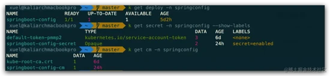

### 4.1 Configmap

- 查看value

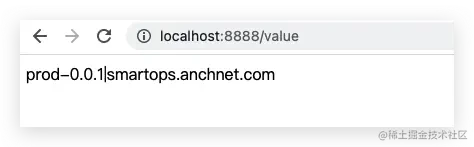

- 查看properties

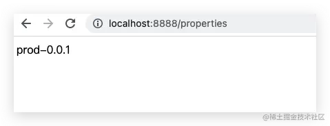

- 查看env

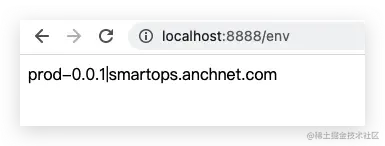

修改cm内容( `k edit cm -n springconfig springboot-config-cm` )，查看内容

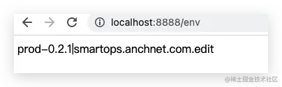

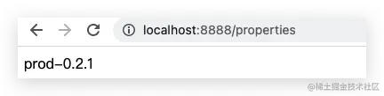

结论：value 使用pull模式，无法完成内容变更，使用env/properties方式获取内容，都会随着cm修改，根据pull周期理解生效。

### 4.2 Secret

- 查看value

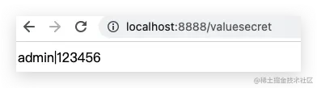

- 查看properties

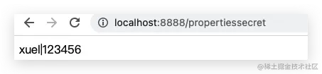

- 查看env

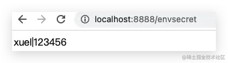

修改secret内容(k edit secret -n springconfig springboot-config-secret)

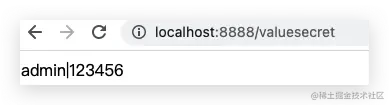


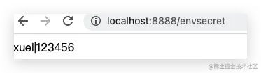

- 结论：value 使用pull模式，无法完成内容变更，使用env/properties方式获取内容，都会随着cm修改，根据pull周期理解生效。

## 五 其他

还是需要根据业务场景选择pull模式及拉去频率，以及是否需要重启IOC容器，控制影响范围。

文章知识点与官方知识档案匹配，可进一步学习相关知识

[Java技能树](https://edu.csdn.net/skill/java/?utm_source=csdn_ai_skill_tree_blog)[首页](https://edu.csdn.net/skill/java/?utm_source=csdn_ai_skill_tree_blog)[概览](https://edu.csdn.net/skill/java/?utm_source=csdn_ai_skill_tree_blog)123439 人正在系统学习中