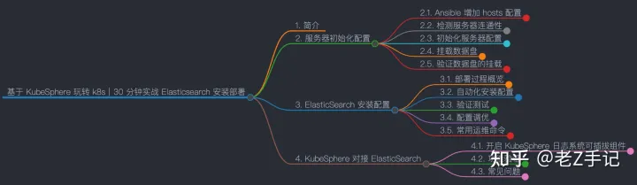
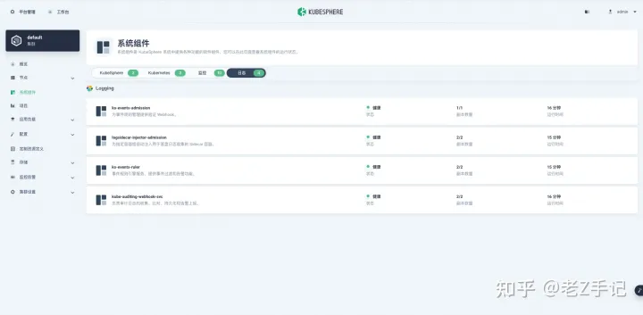
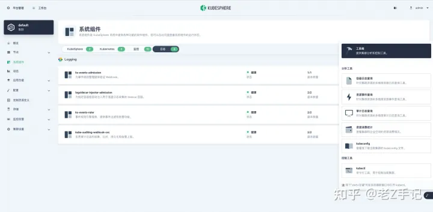

# 基于 KubeSphere 玩转 k8s｜30 分钟实战 Elasticsearch 安装部署

## **1. 简介**

日志采集、存储、分析是运维工作中必不可少的，我们使用 KubeSphere 和 Kubernetes 时产生的各种日志该如何存储和展示的？

KubeSphere 为日志收集、查询和管理提供了一个强大的、全面的、易于使用的日志系统。它涵盖了不同层级的日志，包括租户、基础设施资源和应用。用户可以从项目、工作负载、容器组和关键字等不同维度对日志进行搜索。与 Kibana 相比，KubeSphere 基于租户的日志系统中，每个租户只能查看自己的日志，从而可以在租户之间提供更好的隔离性和安全性。

KubeSphere 使用可插拔组件，实现在 KubeSphere 管理的 Kubernetes 集群上自动安装配置 Elasticsearch，具体可以参考官方文档**[KubeSphere 日志系统](https://link.zhihu.com/?target=https%3A//kubesphere.com.cn/docs/v3.3/pluggable-components/logging/)**。

但是在生产环境，内置的 Elasticsearch 可能存在性能和扩展性的问题，建议使用外部的 Elasticsearch，KubeSphere 也支持对接外部部署的 Elasticsearch，本文将带你详细了解 KubeSphere 对接外部启用 HTTP 认证的 Elasticsearch 的流程和方法。同时，还会涉及自动化安装配置 Elasticsearch。

> **导图**



Elasticsearch-mind

> **知识量**

- 阅读时长：10 分
- 行：460
- 单词：2400+
- 字符：13400+
- 图片：6 张

> **知识点**

- 定级：**入门级**
- ElasticSearch 安装配置
- KubeSphere 启用可插拔日志事件系统
- KubeSphere 使用外部 ElasticSearch

> **演示服务器配置**

| 主机名          | IP           | CPU  | 内存 | 系统盘 | 数据盘  | 用途                                  |
| --------------- | ------------ | ---- | ---- | ------ | ------- | ------------------------------------- |
| zdeops-master   | 192.168.9.9  | 2    | 4    | 40     | 200     | Ansible 运维控制节点                  |
| ks-k8s-master-0 | 192.168.9.91 | 4    | 16   | 40     | 200+200 | KubeSphere/k8s-master/k8s-worker/Ceph |
| ks-k8s-master-1 | 192.168.9.92 | 4    | 16   | 40     | 200+200 | KubeSphere/k8s-master/k8s-worker/Ceph |
| ks-k8s-master-2 | 192.168.9.93 | 4    | 16   | 40     | 200+200 | KubeSphere/k8s-master/k8s-worker/Ceph |
| storage-node-0  | 192.168.9.95 | 2    | 8    | 40     | 200+200 | ElasticSearch/GlusterFS               |
| storage-node-0  | 192.168.9.96 | 2    | 8    | 40     | 200+200 | ElasticSearch/GlusterFS               |
| storage-node-0  | 192.168.9.97 | 2    | 8    | 40     | 200+200 | ElasticSearch/GlusterFS               |
| harbor          | 192.168.9.89 | 2    | 8    | 40     | 200     | Harbor                                |
| 合计            | 8            | 22   | 84   | 320    | 2800    |                                       |

> **演示环境涉及软件版本信息**

- 操作系统：**CentOS-7.9-x86_64**
- Ansible：**2.8.20**
- KubeSphere：**3.3.0**
- Kubernetes：**v1.24.1**
- Rook：**v1.9.7**
- Ceph： **v16.2.9**
- GlusterFS：**9.5.1**
- ElasticSearch：**7.17.5**
- Harbor：**2.5.1**

## **2. 服务器初始化配置**

### **2.1. Ansible 增加 hosts 配置**

**本系列文档中演示用的 ElasticSearch 和 GlusterFS 服务器复用，有条件的用户可以分开部署，注意调整 hosts 配置。**

- 修改现有 hosts 文件配置，主要增加 es

```text
...
[es]
es-node-0 ansible_ssh_host=192.168.9.95 host_name=es-node-0
es-node-1 ansible_ssh_host=192.168.9.96 host_name=es-node-1
es-node-2 ansible_ssh_host=192.168.9.97 host_name=es-node-2

[servers:children]
k8s
es

[servers:vars]
ansible_connection=paramiko
ansible_ssh_user=root
ansible_ssh_pass=password
```

### **2.2. 检测服务器连通性**

利用 ansible 检测服务器的连通性。

```text
[root@zdevops-master /]# cd /data/ansible/ansible-zdevops/inventories/dev/
[root@zdevops-master dev]# source /opt/ansible2.8/bin/activate
(ansible2.8) [root@zdevops-master dev]# ansible -m ping es
```

### **2.3. 初始化服务器配置**

利用 ansible-playbook 初始化服务器配置。

```text
(ansible2.8) [root@zdevops-master dev]# ansible-playbook -l es ../../playbooks/init-base.yaml
```

### **2.4. 挂载数据盘**

**本文使用磁盘 /dev/sdc, 格式化后挂载点为 /data，作为 ElasticSearch 的数据存储目录，实际中请注意修改 ansible-playbook 的变量配置**。

利用 ansible-playbook 格式化数据盘。

重点注意，**一定要加 -l 参数指定 es 主机 利用 -e 参数替换默认的 playbook 的盘符和挂载点**。

```text
(ansible2.8) [root@zdevops-master dev]# ansible-playbook -l es -e data_disk=sdc -e data_disk_path="/data" ../../playbooks/init-disk.yaml
```

### **2.5. 验证数据盘的挂载**

- 验证数据盘是否格式化并挂载

```text
(ansible2.8) [root@zdevops-master dev]# ansible es -m shell -a 'df -h'
```

- 验证数据盘是否配置自动挂载

```text
(ansible2.8) [root@zdevops-master dev]# ansible es -m shell -a 'tail -1  /etc/fstab'
```

## **3. ElasticSearch 安装配置**

### **3.1. 部署过程概览**

- 配置 YUM 源
- 安装 ElasticSearch
- 编辑 ElasticSearch 配置文件
- 创建 ElasticSearch 数据文件目录
- 生成 instances 文件用来配置证书
- 生成证书
- 配置 keystore-开启认证
- 启动服务

### **3.2. 自动化安装配置**

利用 ansible-playbook 自动化安装配置 ElasticSearch。

```text
(ansible2.8) [root@zdevops-master dev]# ansible-playbook ../../playbooks/deploy-elasticsearch.yaml 
```

### **3.3. 验证测试**

```text
$ curl -uzdevops:'P@88w0rd' 192.168.9.95:9200/_cat/nodes?
192.168.9.95 43 32 2 0.00 0.05 0.11 cdfhilmrstw * es-node-0
192.168.9.96 58 31 2 0.08 0.08 0.10 cdfhilmrstw - es-node-1
192.168.9.97 62 32 2 0.00 0.06 0.10 cdfhilmrstw - es-node-2
```

### **3.4. 配置调优**

- 增加索引分片数量

```text
# ES7 默认设置的索引分片数是每个数据节点1000
# 查询默认配置
$ curl -uzdevops:'P@88w0rd' 192.168.9.95:9200/_cluster/settings?pretty
{
  "persistent" : { },
  "transient" : { }
}

# 增加永久变更配置
$ curl -uzdevops:'P@88w0rd' -H "Content-Type: application/json" -X PUT  192.168.9.95:9200/_cluster/settings -d '{"persistent" : {"cluster.max_shards_per_node":"1000000"} }'

# 验证结果
$ curl -uzdevops:'P@88w0rd' 192.168.9.95:9200/_cluster/settings?pretty
{
  "persistent" : {
    "cluster" : {
      "max_shards_per_node" : "1000000"
    }
  },
  "transient" : { }
}
```

- thread_pool 优化

```text
# 将以下参数写入每一个节点的 /etc/elasticsearch/elasticsearch.yml, 并重启服务
thread_pool.write.size: 9
thread_pool.write.queue_size: 1000
thread_pool.search.size: 13
thread_pool.search.queue_size: 500
thread_pool.search.min_queue_size: 8
thread_pool.search.max_queue_size: 800
thread_pool.search.auto_queue_frame_size: 1500
thread_pool.search.target_response_time: 3s
```

- 未完待补充 ...

### **3.5. 常用运维命令**

```text
# 查看服务状态
systemctl status elasticsearch.service

# 启动服务
systemctl start elasticsearch.service

# 停止服务
systemctl stop elasticsearch.service

# 查看简略的服务日志
journalctl -u elasticsearch.service

# 查看详细的服务日志
/data/elasticsearch/logs

# 查看gc日志
/var/log/elasticsearch
```

## **4. KubeSphere 对接 ElasticSearch**

### **4.1. 开启 KubeSphere 日志系统可插拔组件**

- 以 admin 登录 KubeSphere 控制台，点击左上角的「平台管理」-「集群管理」。
- 点击「定制资源定义」，在搜索栏中输入 `clusterconfiguration`。
- 在**自定义资源**中，点击 `ks-installer` 右侧的「三个竖点」，选择**编辑 YAML**。
- 在 YAML 文件中，搜索 **logging，auditing，events**，并将 **enabled** 的 **false** 改为 **true**。

```text
logging:
  containerruntime: containerd
  enabled: true
  logsidecar:
    enabled: true
    replicas: 2
 
events:
  enabled: true
 
auditing:
  enabled: true
```

- 在 YAML 文件中，搜索 **es**，将 **enabled** 的 **false** 改为 **true**。并修改外部的 es 服务器的信息。

```text
es:
  basicAuth:
    enabled: true
    password: 'P@88w0rd'
    username: 'zdevops'
  elkPrefix: logstash
  externalElasticsearchHost: '192.168.9.95'
  externalElasticsearchPort: '9200'
  logMaxAge: 7
```

- 所有配置完成后，点击右下角的确定，保存配置。

- 在 kubectl 中执行以下命令检查安装过程，安装过程大约 5-10 分钟。

- kubectl logs -n kubesphere-system $(kubectl get pod -n kubesphere-system -l 'app in (ks-install, ks-installer)' -o jsonpath='{.items[0].metadata.name}') -f

  

- 看到如下状态，说明安装成功。

```text
PLAY RECAP *********************************************************************
localhost                  : ok=26   changed=14   unreachable=0    failed=0    skipped=12   rescued=0    ignored=0   
Start installing monitoring
Start installing multicluster
Start installing openpitrix
Start installing network
Start installing auditing
Start installing events
Start installing logging
**************************************************
Waiting for all tasks to be completed ...
task openpitrix status is successful  (1/7)
task network status is successful  (2/7)
task multicluster status is successful  (3/7)
task auditing status is successful  (4/7)
task events status is successful  (5/7)
task logging status is successful  (6/7)
task monitoring status is successful  (7/7)
**************************************************
Collecting installation results ...
#####################################################
###              Welcome to KubeSphere!           ###
#####################################################

Console: http://192.168.9.91:30880
Account: admin
Password: P@88w0rd

NOTES：
  1. After you log into the console, please check the
     monitoring status of service components in
     "Cluster Management". If any service is not
     ready, please wait patiently until all components 
     are up and running.
  2. Please change the default password after login.

#####################################################
https://kubesphere.io             2022-07-19 15:58:28
#####################################################
```

- 在控制台中验证**日志系统组件**安装结果。
- 登录控制台，**「平台管理」**-**「集群管理」**-**「系统组件」**，检查是否 **日志** 标签页中的所有组件都处于**健康**状态。如果是，表明组件安装成功。



kubesphere3.3-clusters-components-logging

- 点击控制台右下角的**工具箱**按钮，多出几个分析工具的菜单。



kubesphere3.3-clusters-components-logging-2

- 在 kubectl 工具中验证组件的安装结果。

```text
bash-5.1# kubectl get pod -n kubesphere-logging-system
NAME                                            READY   STATUS    RESTARTS   AGE
fluent-bit-672dg                                1/1     Running   0          24m
fluent-bit-mpzl9                                1/1     Running   0          24m
fluent-bit-psgtt                                1/1     Running   0          24m
fluentbit-operator-647fb54c47-xrl8b             1/1     Running   0          24m
ks-events-exporter-fdf5988f-7vdfj               2/2     Running   0          20m
ks-events-operator-f475b765-xnfsq               1/1     Running   0          21m
ks-events-ruler-786fdc99d-45n2f                 2/2     Running   0          20m
ks-events-ruler-786fdc99d-gx7gm                 2/2     Running   0          20m
kube-auditing-operator-69d7846b8b-nn2vk         1/1     Running   0          21m
kube-auditing-webhook-deploy-57b8cd6d49-7bnz7   1/1     Running   0          21m
kube-auditing-webhook-deploy-57b8cd6d49-hkg5l   1/1     Running   0          21m
logsidecar-injector-deploy-84669c8785-5qpf8     2/2     Running   0          20m
logsidecar-injector-deploy-84669c8785-dcmsw     2/2     Running   0          20m
```

- 上面的操作完成后，正常情况下配置就成功完成了，如果有问题可以参考下面的常见问题。

### **4.2. 功能验证**

> **查看 ElasticSearch 中的信息**

- 查看 ElasticSearch 索引分片信息。

```text
[root@ks-k8s-master-0 ~]# curl -uzdevops:'P@88w0rd' 192.168.9.95:9200/_cat/indices?v
health status index                           uuid                   pri rep docs.count docs.deleted store.size pri.store.size
green  open   .geoip_databases                X5z3ZGEiR3eJQdb3_PKxFg   1   1         40            0     75.3mb         37.6mb
green  open   ks-logstash-log-2022.07.19      2YLUrp96TPaQN-kTTxppCg   1   1       9313            0      5.7mb            3mb
green  open   ks-logstash-auditing-2022.07.19 3Dm8mHZ6SHe_geJ8xdn3bA   1   1          1            0     33.7kb         16.8kb
green  open   ks-logstash-events-2022.07.19   TQxBctTMQpSQVrD5v9q3tA   1   1        268            0    599.4kb        299.7kb
```

> **在「控制台」查看「工具箱」中的分析工具**

- 容器日志查询


kubesphere3.3-toolbox-analysis-tools-container

- 资源事件查询


kubesphere3.3-toolbox-analysis-tools-event

- 审计日志查询


kubesphere3.3-toolbox-analysis-tools-audit

### **4.3. 常见问题**

- es 认证信息写错或是忘记开启了，在资源定义文件中重新配置，有可能不生效，需要修改下面的文件。

```text
$ kubectl edit output -n kubesphere-logging-system es -o yaml
```

> 添加如下内容，在 spec.es 下

```text
spec:
  es:
    httpPassword:
      valueFrom:
        secretKeyRef:
          key: password
          name: elasticsearch-credentials
    httpUser:
      valueFrom:
        secretKeyRef:
          key: username
          name: elasticsearch-credentials
```

## **5. 结束语**

本系列文档是我在云原生技术领域的学习和运维实践的手记，**用输出倒逼输入**是一种高效的学习方法，能够快速积累经验和提高技术，只有把学到的知识写出来并能够让其他人理解，才能说明真正掌握了这项知识。

> **本系列文档内容涵盖 (但不限于) 以下技术领域：**

- **KubeSphere**
- **Kubernetes**
- **Ansible**
- **自动化运维**
- **CNCF 技术栈**

**如果你喜欢本文，请分享给你的小伙伴！**

> **Get 文档**

- Github [https://github.com/devops/z-notes](https://link.zhihu.com/?target=https%3A//github.com/devops/z-notes)
- Gitee [https://gitee.com/zdevops/z-notes](https://link.zhihu.com/?target=https%3A//gitee.com/zdevops/z-notes)
- 知乎 https://www.zhihu.com/people/zdevops/

> **Get 代码**

- Github [https://github.com/devops/ansible-zdevops](https://link.zhihu.com/?target=https%3A//github.com/devops/ansible-zdevops)
- Gitee [https://gitee.com/zdevops/ansible-zdevops](https://link.zhihu.com/?target=https%3A//gitee.com/zdevops/ansible-zdevops)

> **Get 视频 B 站**

- **[老 Z 手记](https://link.zhihu.com/?target=https%3A//space.bilibili.com/1039301316)**[https://space.bilibili.com/1039301316](https://link.zhihu.com/?target=https%3A//space.bilibili.com/1039301316)

> **版权声明**

- 所有内容均属于原创，整理不易，感谢收藏，转载请标明出处。

> **About Me**

- 昵称：老 Z
- 坐标：山东济南
- 职业：运维架构师 / 高级运维工程师 = **运维**
- 微信：zdevops(公号输入框回复"w"即可)
- 关注的领域：云计算 / 云原生技术运维，自动化运维
- 技能标签：OpenStack、Ansible、K8S、Python、Go、DevOps、CNCF