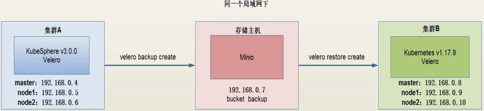
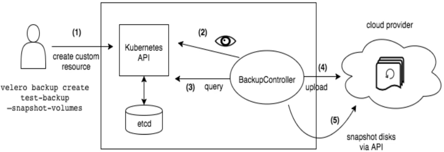

# K8s集群备份与恢复


## 1 目标

备份源环境的多节点k8s集群A, 在目标环境上恢复这个多节点k8s集群


## 2 前提

源集群A(masterA/node1/node2) 已部署KubeSphere 3.0.0

目标集群B(masterA/node1/node2) 已部署k8s 1.17.9

独立的对象存储 minio

操作系统centos7


## 3 简介

### 3.1 备份与恢复架构图



流程 

1 集群A中的velero创建一个集群的备份文件,把备份文件上传到minio

2 集群B中velero从minio中下载备份文件,恢复集群

velero和minio是官方推荐的备份组件


### 3.2 velero备份原理图




### 3.3 Velero简介

velero提供了备份和回复Kubenetes集群资源和持久卷的工具,可以在云端或者本地运行.velero可对集群进行备份与恢复,以防止数据丢失,也可以将集群资源迁移到其他集群,如将生产集群复制到备份集群 / 开发集群 / 测试集群


restic 是velero的开源备份组件,用于备份和回复Kubernetes卷,备份前,卷必须被注释,备份pv数据时,不支持卷类型为hostpath


verelo-plugin-for-asw:v1.1.0 是阿里云插件,后端只要支持兼容s3的存储, 这里使用minio对位对象存储


### 3.4 minio简介

minio是一个基于Apache License 2.0开源协议的对象存储服务,兼容亚马逊s3云存储服务接口,非常适合于存储大容量非结构化数据,例如图片/视频/日志文件/备份数据和容器/虚拟机镜像等,而一个对象文件可以是任意大小,从几KB到最大5T不等.

minio是一个非常轻量级的服务,可以很简单的其他应用结合, 类似于 Nodejs/redis或者mysql


## 4 操作流程

1 配置对象存储minio

2 在集群A B 上部署velero

3 部署验证服务(wordpress)

4 备份KubeSphere集群 A

5 在集群B还原KubeSphere

6 验证服务


### 4.1 配置对象存储minio

在AB集群之外单独的一台服务器上部署minio,但是和AB在同一个局域网下,minio用于存储velero的备份文件, 在局域网内恢复备份集群,速度很快,相对于公有云的对象存储(如阿里云OSS, 七牛云OSS)更有优势


#### 4.1.1 安装并启动docker

```bash
yum install docker-ce -y && systemctl enable docker && service docker start
```

####  4.1.2 新建挂载目录

```bash
mkdir -p /private/mnt/data
```

#### 4.1.3 运行minio容器

```bash
docker run -p 9000:9000 \
--name minio1 \
-v /private/mnt/data:/data \
-e "MINIO_ACCESS_KEY=minio" \
-e "MINIO_SECRET_KEY=minio123" \
minio/minio server /data &
```

#### 4.1.4 创建bucket

访问minio http://192.168.0.108:9000  使用账号 minio / minio123 登录


点击右下角 + 按钮 - `Create bucket` 输入

Bucket Name : backup  ,按enter键生效,就可以上在上面看到新创建的名为 backup 的 Bucket


### 4.2 在集群A B 上部署velero

#### 4.2.1 下载velero

https://github.com/vmware-tanzu/velero/releases

https://github.com/vmware-tanzu/velero/releases/download/v1.10.3/velero-v1.10.3-linux-arm64.tar.gz

上传到集群A的master,解压

```bash
tar -zxvf velero-v1.10.3-linux-arm64.tar.gz
```

复制到本地bin目录

```bash
cp velero-v1.10.3-linux-arm64/velero /usr/local/bin
```

#### 4.2.2 创建minio凭证

```bash
cat > credentials-velero << EOF
[default]
aws_access_key_id = minio
aws_secret_access_key = minio123
EOF
```

#### 4.2.3 安装

```bash
velero install \
--provider aws \
--bucket backup \
--use-restic \
--secret-file ./credentials-velero \
--use-volume-snapshots=false \
--plugins velero/velero-plugin-for-aws:v1.1.0 \
--backup-location-config region=minio,s3ForcePathStyle="true",s3Url=http://192.168.0.108:9000
```

指定了 minio服务地址 / minio凭证 / 使用的bucket名称,使用了 velero-plugin-for-aws 插件,所以提供者是aws `--provider aws`

minio兼容s3 ,同样支持s3的还有阿里云OSS等公有云的OSS服务.

如果使用 阿里云OSS, 参数 region=minio 就表示使用的服务的区域 , 比如 西南一区 / 华南二区等.这里备份到本地局域网内,所以不存在备份区域,region设置为minio即可(也可以是其他自定义的名称).


velero也可以用于给k8s集群中的pv做快照,需要使用云厂商提供的插件. 这里不做快照, 所以设置 use-volume-snapshots 为false

安装完成后查看velero

```bash
kubectl get pod -n velero
```

```bash

```


#### 4.2.4 在集群B的master节点上以相同的方式部署velero

略


### 4.3 部署验证服务(wordpress)

登录集群A的KubeSphere平台

创建企业空间 test

创建项目 test

部署wordpress

```bash
helm repo add bitnami https://charts.bitnami.com/bitnami
helm install wordpress bitnami/wordpress -n test --set service.type=NordPort --set-wordpressUsername=admin --set-wordpressPassword=Pass@Word
```

查看服务

```bash
kubectl get svc -n test
```

```


```

访问wordpress

http://192.168.0.151:30080/admin 使用账号 admin / Pass@Word 登录

添加一篇文章

Posts - `Add New`

title : test

content: this is a test

点击 publish


### 4.4 备份KubeSphere集群 A

在集群A的master节点

备份存储对象文件,因为还原集群的时候不会生成存储对象

```bash
kubectl get sc local -o yaml > openebs-sc.yaml
```

把存储对象文件复制到集群B的 master 节点

```bash
scp -r openebs-sc.yaml root@192.168.0.8:/root/
```


查看master节点的污点

```bash
kubectl describe node master | grep Taint
```

备份集群的时候,会备份master节点的pv数据, 取消master的污点

```bash
kubectl taint nodes master-cluster node-role.kubernetes.io/master:NoSchedule-
```

注释pv,只有被注释的才能被 restic 备份,查看pv

```bash
kubectl get pv -A
```

```bash

```

在列表中的所有的相关的pod以及pod挂载的pv都要注释,比如pod  prometheus-k8s-0 ,查看这个pod的详情,获取所有的挂载pv

```bash
kubectldescribe pod prometheus-k8s-0 -n kubesphere-monitoring-system
```

```
Volumes:
	prometheus-k8s-db:
	  ...
	config:
	  ...
	tls-assets:
	  ...
	config-out:
	  ...
	prometheus-k8s-rulefiles-0:
	  ...
	secret-kube-etcd-client-certs:
	  ...
	// 这个不用备份,集群恢复的时候会动生成token,这里就不要注释这个了
	prometheus-k8s-token-xxxxx:
	  ...
```

加上注释 ,  注意 prometheus-k8s-token-xxxxx 不需要备份,不用注释,下面所有的pv也是类似

```bash
kubectl -n kubesphere-monitoring-system annotate pod prometheus-k8s-0 backup.velero.io/backup-volumes=prometheus-k8s-db,config,tls-assets,config-out,prometheus-k8s-rulefiles-0,secret-kube-etcd-client-certs
```


安装上面的方法,把所有的pod都添加注释

查看数据卷

```bash
kubectl describe pod wordpress-mariadb-0 -n test
```

```yaml
...
```

添加注释 , 注意 wordpress-mariadb-token-xxxx 不需要备份,不用注释,下面所有的pv也是类似

```bash
kubectl -n test annotate pod wordpress-mariadb-0 backup.velero.io/backup-volumes=data,config
```


```bash
kubectl describe pod wordpress-xxxxxxx-xxxxx -n test
```

```bash
kubectl -n test annotate pod wordpress-xxxxxxx-xxxxx backup.velero.io/backup-volumes=wordpress-data
```

其他所有的pod都是类似的操作, 确保所有的pv都被注释


备份名称空间

备份所有的名称空间

```bash
velero backup create kube-system-bak --include-namespace kube-system
velero backup create kubesphere-controls-system-bak --include-namespace kubesphere-controls-system
velero backup create kubesphere-monitoring-system-bak --include-namespace kubesphere-monitoring-system
velero backup create kubesphere-system --include-namespace kubesphere-system
velero backup create test-bak --include-namespace test
```


获取备份状态信息

```bash
velero get backup
```

备份过程中 , 集群中新创建的资源是不能备份的. 等所有的任务的 status 为 completed 的时候任务完成 . 

备份完成后可以在minio web页面中看到备份完成的数据, restic 是pv的备份, backups 里是名称空间的备份 . 


### 4.5 在集群B还原KubeSphere

在集群B的 master 节点操作

查看集群信息

```bash
kubectl get node,pod -A
```


查看备份数据

```bash
velero get backup
```

```bash
velero get backup | grep -w bak
```


恢复集群数据

注意还原数据需要安装顺序执行

1 还原 kube-system

```bash
velero restore create --from-backup kube-system-bak
```

查看还原状态

```bash
velero restore get
```

状态为 completed 表示还原成功

查看pod

```bash
kubectl get pod -A
```

还原的时候不会创建存储对象,因此需要手动创建存储对象

```bash
kubectl apply -f openebs-sc.yaml
```

查看service

```bash
kuebctl get sc
```

可以看到已经生成本地默认存储对象

注意查看pod的状态, 等待名称空间 kube-system 中的所有的pod都已经正常运行之后,再执行后续的还原


2 还原 kubesphere

取消master的污点

```bash
kubectl taint nodes master-restore node-role.kubernetes.io/master:NoSchedule-
```

还原 kubesphere-system 名称空间的数据的时候,需要在 master 节点上创建pv数据


还原 kubesphere-system 名称空间的数据

```bash
velero restore create --from-backup kubesphere-system-bak
```

还原 kubesphere-controls-system

```bash
velero restore create --from-backup kubesphere-controls-system-bak
```

还原 kubesphere-monitoring-system 

```bash
velero restore create --from-backup kubesphere-monitoring-system-bak
```


3 还原 test

还原 test

```bash
velero restore create --from-backup test-bak
```


4 查看还原状态

```bash
velero get restore
```

经过一段时间后 , 所有的 pod 启动成功


### 4.6 验证服务

登录集群B的KubeSphere平台, 进入之后只有一个工作空间 system-workspace , 需要创建一个 workspace : test ,创建完成后,名称空间就会自动关联恢复的资源.  进入这个工作空间就可以看到恢复的 test 项目了.

查看wordpress的NodePort, 登录wordpress

http://192.168.0.151:31981/admin  使用账号 admin / Pass@Word 登录


