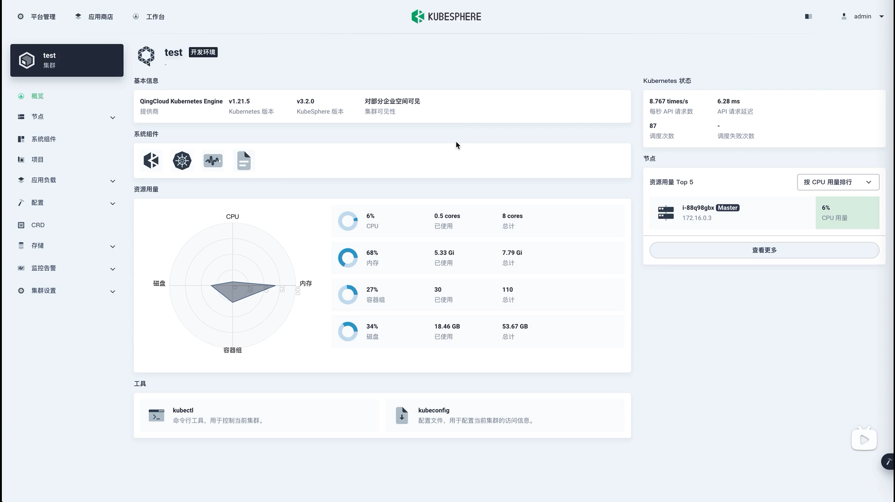
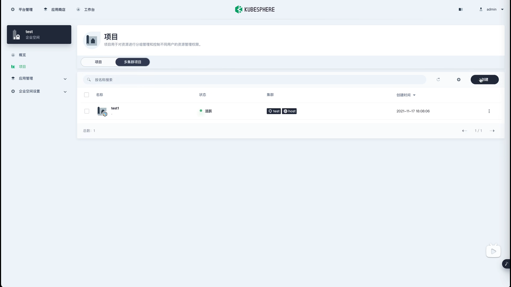

# KubeSphere多集群


## Kubernetets多集群简介

Kubernetes从1.8版本起就声明单集群最多支持5000个节点和15W个pod,实际上很少情况会使用这么庞大的单集群,很多情况下因为各种原因可能会部署多个集群,但是又想要把这些集群都进行统一的管理,这个时候就需要用到集群联邦( Federation )


使用场景:

高可用: 在多个集群上部署, 可以最大限度减少集群故障带来的影响

避免厂商锁定: 可以将应用负载分布在多个厂商的集群上并在有需要的时候迁移到其他的厂商

故障隔离: 拥有对个小集群比单个集群更利于故障隔离


Host集群与Member集群


Host集群指的是安装了Kubefed的集群,属于 Control Plane (控制平面) 

Member集群指的是被管控的集群, 

Host集群与Member集群之间属于联邦关系


## Kubernetes Federation 

Federation v1  已被废弃, 社区提出了新的联邦集群架构: Feferation V2 . 

V2版本利用CRD实现了整体的功能,通过定义多种资源(CR) ,从而省掉了 V1 中的 API server , V2版本由2个部分组成:

admission-webhook 提供了准入控制

controller-manager 处理自动义资源以及协调不同集团间状态


v2版本中要创建一个联邦资源的大致流程 : 

```bash
kubectl apply -f federrated_resource.yml
```


将 Federated Resource 创建到 Host 集群的 API Server 中 , 之后 controller-manager 会介入, 将相应的资源分发到不同的集群, 分发的规则等都写在了这个 Federated Resource 对象里面

Federation V2 分为2个部分, configuration(配置) 和 propagation(分发)

configuration 主要包含两个配置 Cluster Configuration 和 Type Configuration


Cluster Configuration :


集群配置主要保存被联邦托管集群的 API 认证信息, 可以通过 kubefedctl 命令来加入( join ) 和删除( unjoin )集群 , 集群加入之后就会建立一个 KebeFedCluster 的CR(自定义资源), 来存储集群相关的信息. 集群相关信息主要是3个:

apiEndpoint : 被联邦托管的集群的地址

caBundle : 证书的信息

secretRef : token信息, 访问 api server 的凭证


Type Configuration


如果要新增一种要被联邦托管的资源, 就需要建立一个新的 FederatedXXX 的CRD, 用来描述对应资源的结构和分发策略( 需要被分发到哪些集群上 ) 

Federated Resource CRD 主要包括三个部分:

Templates : 用于描述被联邦的资源

Placement : 用于描述被部署的集群, 若没有配置, 则不会分发到任何集群

Overrides : 用于对部分集群的部分资源进行覆盖 , 可以对子集群进行差异化的配置


KubeSphere多集群管理


在这里用户可以统一管理多个集群和添加新的集群


导入集群

在导入集群的时候, KubeSphere提供了2种方式:


直接连接 : 

要求Host到Member集群网络可达, 只需要提供一个kubeconfig文件可直接把集群加入联邦管理


代理连接 : 

当Host集群到Member集群网络不可达, 目前Kubefed不能做到联邦, 因此需要使用KubeSphere开源的 Tower 组件, 实现私有云场景下的联邦管理, 用户只需要在私有集群创建一个agent就可以实现集群联邦


这里展示了Tower的工作流程, 在Member集群内部起了一个agent以后, Member集群会去连接Host集群的Tower Server, Server 收到这个连接请求后会直接监听一个Controller预先分配好的端口,建立一个隧道,这样就可以通过这个隧道从host往member集群分发资源.





3 跨多集群的应用发布


在KubeSphere中企业空间时最小的租户单元, 企业空间提供了跨集群,跨项目共享资源的能力, 企业空间中的成员可以在授权集群中创建项目,并通过邀请授权的方式参与项目协同.

用户是kubeSphere的账户实例,可以被设置为平台层面的管理员参与集群的管理,也可以被添加到企业空间中参与项目协同

多级的权限控制和资源配额限制是kubesphere中资源隔离的基础,奠定了多租户最基本的形态


创建好企业空间之后, 再创建联邦资源(可以跨多个集群的资源 ) ,创建方法和普通的资源是一样的, 区别只有可以选择要部署的集群


KubeSphere的状态聚合功能


实际操作:


企业空间时KubeSphere中租户的概念, 项目是K8s中namespace 的概念





