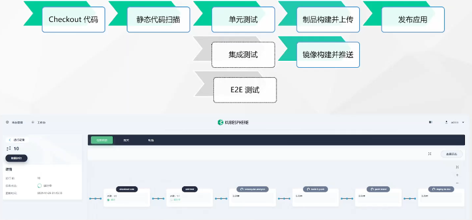

## DevOps入门

[toc]

### 1 概述

DevOps 是一系列做法和工具，可以使 IT 和软件开发团队之间的流程实现自动化。其中，随着敏捷软件开发日趋流行，**持续集成 (CI)** 和**持续交付 (CD)** 已经成为该领域一个理想的解决方案。在 CI/CD 工作流中，每次集成都通过自动化构建来验证，包括编码、发布和测试，从而帮助开发者提前发现集成错误，团队也可以快速、安全、可靠地将内部软件交付到生产环境。

不过，传统的 Jenkins Controller-Agent 架构（即多个 Agent 为一个 Controller 工作）有以下不足。

- 如果 Controller 宕机，整个 CI/CD 流水线会崩溃。
- 资源分配不均衡，一些 Agent 的流水线任务 (Job) 出现排队等待，而其他 Agent 处于空闲状态。
- 不同的 Agent 可能配置环境不同，并需要使用不同的编码语言。这种差异会给管理和维护带来不便。

#### 1.1 了解 KubeSphere DevOps

KubeSphere DevOps 项目支持源代码管理工具，例如 GitHub、Git 和 SVN。用户可以通过图形编辑面板 (Jenkinsfile out of SCM) 构建 CI/CD 流水线，或者从代码仓库 (Jenkinsfile in SCM) 创建基于 Jenkinsfile 的流水线。

#### 1.2 功能

KubeSphere DevOps 系统为您提供以下功能：

- 独立的 DevOps 项目，提供访问可控的 CI/CD 流水线。
- 开箱即用的 DevOps 功能，无需复杂的 Jenkins 配置。
- 支持 [Source-to-image (S2I)](https://www.kubesphere.io/zh/docs/v3.3/project-user-guide/image-builder/source-to-image/) 和 [Binary-to-image (B2I)](https://www.kubesphere.io/zh/docs/v3.3/project-user-guide/image-builder/binary-to-image/)，快速交付镜像。
- [基于 Jenkinsfile 的流水线](https://www.kubesphere.io/zh/docs/v3.3/devops-user-guide//how-to-use/pipelines/create-a-pipeline-using-jenkinsfile)，提供一致的用户体验，支持多个代码仓库。
- [图形编辑面板](https://www.kubesphere.io/zh/docs/v3.3/devops-user-guide/how-to-use/pipelines/create-a-pipeline-using-graphical-editing-panel/)，用于创建流水线，学习成本低。
- 强大的工具集成机制，例如 [SonarQube](https://www.kubesphere.io/zh/docs/v3.3/devops-user-guide/how-to-integrate/sonarqube/)，用于代码质量检查。

#### 1.3 KubeSphere CI/CD 流水线工作流

KubeSphere CI/CD 流水线基于底层 Kubernetes Jenkins Agent 而运行。这些 Jenkins Agent 可以动态扩缩，即根据任务状态进行动态供应或释放。Jenkins Controller 和 Agent 以 Pod 的形式运行在 KubeSphere 节点上。Controller 运行在其中一个节点上，其配置数据存储在一个持久卷声明中。Agent 运行在各个节点上，但可能不会一直处于运行状态，而是根据需求动态创建并自动删除。

当 Jenkins Controller 收到构建请求，会根据标签动态创建运行在 Pod 中的 Jenkins Agent 并注册到 Controller 上。当 Agent 运行完任务后，将会被释放，相关的 Pod 也会被删除。

#### 1.4 动态供应 Jenkins Agent

动态供应 Jenkins Agent 有以下优势：

**资源分配合理**：KubeSphere 动态分配已创建的 Agent 至空闲节点，避免因单个节点资源利用率高而导致任务排队等待。

**高可扩缩性**：当 KubeSphere 集群因资源不足而导致任务长时间排队等待时，您可以向集群新增节点。

**高可用性**：当 Jenkins Controller 故障时，KubeSphere 会自动创建一个新的 Jenkins Controller 容器，并将持久卷挂载至新创建的容器，保证数据不会丢失，从而实现集群高可用。

#### 1.5 CI/CD

持续集成：**C**ontinuous **I**ntegration CI ，包括代码的构建（Build），代码的测试（Test），代码的合并（merge），这个过程应该是持续化自动化的。

持续交付：自动化地把代码制品（包，镜像等），自动发布到仓库里。

持续部署：代码变动后，通过系统集成测试，代码自动合并后，制作镜像推送到代码仓库后，接下来就可以自动化的部署到k8s平台上。

最终的效果是：只要代码一变更，最终就能在云平台自动看到更新后的效果。这样开发和运维直接的协同可以交给这些自动化的流程链路来完成。

这一套流程典型的实现方案如下所示：

1 需求发布，开发期间通过**团队协作平台**，如 Jira ，发布需求和提交bug

2 代码开发，使用vscode、eclipse或者idea等IDE或者编辑器

3 代码托管，代码开发完成，将代码通过git推送到github/getlab/gitee等代码托管平台

4 代码构建，代码推送到托管平台后，对代码进行打包，构建，编译等。例如对于java项目可以使用maven。整体的流程控制使用jenkins来进行管理。

5 静态分析，代码构建完成后，使用sonarQube等工具对代码的质量进行检测，并且提交代码质量报告。

6 单元测试，代码质量分析完成后，需要对代码进行单元测试。比如java项目可以使用junit等。测试完成后会生成测试报告。

7 构建制品，测试通过后，就可以将代码制作成产品，也就是制品，Artifact，例如java项目的产品是jar包，可以将这些jar包保存到maven仓库，如nexus服务器中，或者是公开的maven服务。也可以同时产生制品的构建报告。

8 构建镜像，制品完成后，就可以制作docker镜像，制作好了docker镜像后可以推送到docker镜像仓库如dockerhub、私有harbor服务器等。

9 云上部署， 镜像制作并且推送到镜像仓库之后，既可以自动化将镜像部署到k8s集群中了。

10 运行监控，部署到云平台之后，就可以对项目的各个运行指标、日志进行监控，如果有故障、bug、需求更新，那么就这些需求提给**团队协作平台**。

KubeSphere在devops落地上做了很多的工作，最重要的就是KubeShpere集成了Jenkins。KubeSphere采用动态供应的方式集成jenkins，就是jenkins的实例是动态伸缩的。要在KubeSphere启用devops平台，需要在安装KubeSphere开启devops选项。

DevOps流程:

参考：

概述

https://www.kubesphere.io/zh/docs/v3.3/devops-user-guide/devops-overview/overview/

