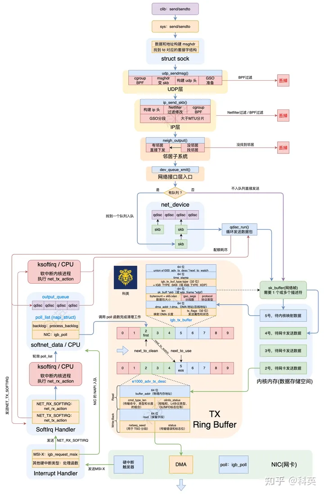
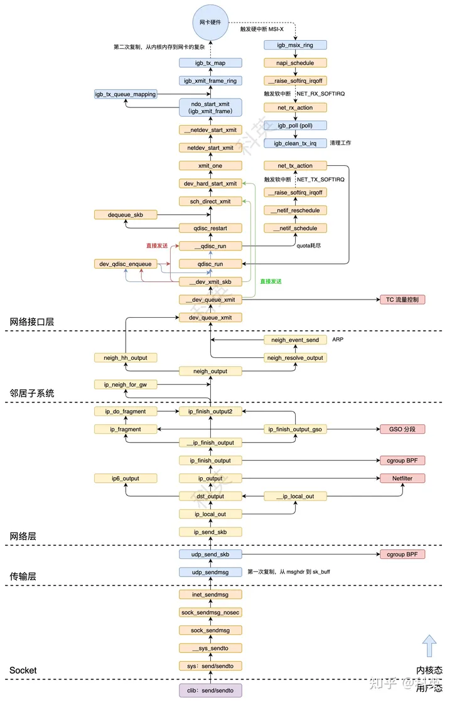
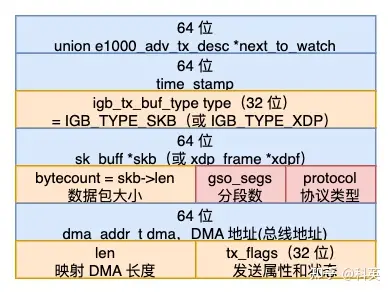
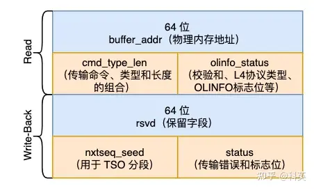

# 发包

## 一、概述

Linux 中的网络包发送过程大致如下：

1. 应用层：应用程序通过调用`send`、`sendto`和`write`函数发送数据到 Socket 发送缓冲区里；
2. 套接字：执行 `send` / `sendto` 系统调用、构建 `msghdr` 和获取 `socket`；
3. 传输层：执行 `cgroup BPF` 程序判断是否允许发送；获取路由信息和构建 `sk_buff`，然后构建并填充 UDP 头部；处理 GSO（如果开启）相关的情况；
4. 网络层：构建 IP 包，然后经过 NetFilter 和 BPF 的过滤与修改、GSO 和分片处理后发给邻居子系统；
5. 邻居子系统：检查是否存在邻居缓存，有直接发给邻居，否则查找（ARP）后再发送；
6. 网络接口层：内核将封装好的数据包发送给网络接口驱动程序。驱动程序负责将数据包传递给硬件设备以便发送；
7. 硬件发送：网络接口驱动程序将数据包传递给物理网络接口，通过物理链路发送到目标主机。



图1 完整流程图



图2 完整调用链

## 二、应用层

应用程序通过调用`send`、`sendto`和`write`函数发送数据到 Socket 发送缓冲区里。`send`和`sendto`函数的区别与`recv`和`recvfrom`类似，就是是否不指定目的地址。`write`就是把`socket`当作文件描述符使用。

## 三、Socket

### 3.1 概述

1. 应用层调用发送函数会执行 `send`/`sendto` 系统调用；
2. 将用户空间的数据和地址导入（非拷贝）到内核空间（ `msghdr`）;
3. 根据文件描述符找到对应的套接字 (`socket`)；
4. 根据协议类型选择 `TCP` / `UDP` 发送函数入口；

### 3.2 系统调用

**3.2.1 用户调用 send/sendto 函数发送数据（用户态）**

当应用程序调用`clib`的`send`或`sendto`函数接收数据时，通过`strace`命令可以跟踪到分别执行了`send`和`sendto`系统调用。

```c
std::string data = "123";
// send
int ret = send(fd, data.c_str(), data.size(), MSG_NOSIGNAL);

// sendto
struct sockaddr_in serverAddr;
serverAddr.sin_family = AF_INET;
serverAddr.sin_addr.s_addr = inet_addr("172.17.0.2");
serverAddr.sin_port = htons(20000);

int ret = sendto(fd, data.c_str(), data.size(), MSG_DONTWAIT,
                (struct sockaddr*)&serverAddr, sizeof(serverAddr));
```

**3.2.2** [send](https://elixir.bootlin.com/linux/v6.0/source/net/socket.c%23L2136)**/**[sendto](https://elixir.bootlin.com/linux/v6.0/source/net/socket.c%23L2125) **系统调用（内核态）**

```c
SYSCALL_DEFINE4(send, int, fd, void __user *, buff, size_t, len,
        unsigned int, flags)
{
    return __sys_sendto(fd, buff, len, flags, NULL, 0);
}

SYSCALL_DEFINE6(sendto, int, fd, void __user *, buff, size_t, len,
        unsigned int, flags, struct sockaddr __user *, addr,
        int, addr_len)
{
    return __sys_sendto(fd, buff, len, flags, addr, addr_len);
}
```

`send`和`sendto`系统调用的主要逻辑都封装在 [__sys_sendto](https://elixir.bootlin.com/linux/v6.0/source/net/socket.c%23L2085) 函数中。

### 3.3 构建 msghdr 和获取 socket

**3.3.1** [__sys_sendto](https://elixir.bootlin.com/linux/v6.0/source/net/socket.c%23L2085) **函数**

```c
int __sys_sendto(int fd, void __user *buff, size_t len, unsigned int flags,
        struct sockaddr __user *addr,  int addr_len)
{
    struct socket *sock;
    struct sockaddr_storage address;
    int err;
    struct msghdr msg;
    struct iovec iov;
    int fput_needed;
    // 将用户空间的数据区域导入到内核空间，并检查数据区域是否可读。
    err = import_single_range(WRITE, buff, len, &iov, &msg.msg_iter);
    if (unlikely(err))
        return err;
    // 查找给定文件描述符对应的套接字 (socket)，并返回该套接字的引用。
    sock = sockfd_lookup_light(fd, &err, &fput_needed);
    if (!sock)
        goto out;
    // 初始化 msghdr 结构体
    msg.msg_name = NULL;
    msg.msg_control = NULL;
    msg.msg_controllen = 0;
    msg.msg_namelen = 0;
    msg.msg_ubuf = NULL;
    if (addr) {
        // 将用户空间的地址结构体移动到内核空间
        err = move_addr_to_kernel(addr, addr_len, &address);
        if (err < 0)
            goto out_put;
        msg.msg_name = (struct sockaddr *)&address;
        msg.msg_namelen = addr_len;
    }
    // 如果套接字的文件标志包含 O_NONBLOCK 标志，将 flags 的 MSG_DONTWAIT 标志位置为1。
    if (sock->file->f_flags & O_NONBLOCK)
        flags |= MSG_DONTWAIT;
    msg.msg_flags = flags;
    // 将套接字 (sock) 和消息 (msg) 作为参数发送数据。
    err = sock_sendmsg(sock, &msg);

out_put:
    // 释放套接字的引用。
    fput_light(sock->file, fput_needed);
out:
    return err;
}
```

其主要逻辑有四：

- 定义 `msghdr` 结构体，将用户空间的数据区域导入（非拷贝）到内核空间（`msghdr`），并检查数据区域是否可读；
- 查找给定文件描述符对应的套接字 (`socket`)，并返回该套接字的引用；
- 将用户空间的地址结构体移动到内核空间(`msghdr`)；
- 调用 [sock_sendmsg](https://elixir.bootlin.com/linux/v6.0/source/net/socket.c%23L729) 函数将套接字 (sock) 和消息 (msg) 作为参数发送数据。

### 3.4 安全检查和选择传输层发送函数

**3.4.1** [sock_sendmsg](https://elixir.bootlin.com/linux/v6.0/source/net/socket.c%23L729) **函数**

```c
int sock_sendmsg(struct socket *sock, struct msghdr *msg)
{
    // 将套接字和消息传递给安全性模块 (LSM) 进行安全性检查。
    int err = security_socket_sendmsg(sock, msg, msg_data_left(msg));
    /* ?: 表示三元运算符，如果 err 为0（表示没有错误），
     * 则继续执行 sock_sendmsg_nosec 函数；否则，直接返回 err。
     */
    return err ?: sock_sendmsg_nosec(sock, msg);
}
```

其主要逻辑有二：

- 将套接字和消息传递给安全性模块 (LSM) 进行安全性检查；
- 如果没有错误，那么调用 [sock_sendmsg_nosec](https://elixir.bootlin.com/linux/v6.0/source/net/socket.c%23L712) 函数继续处理。

**3.4.2** [sock_sendmsg_nosec](https://elixir.bootlin.com/linux/v6.0/source/net/socket.c%23L712) **函数**

```c
static inline int sock_sendmsg_nosec(struct socket *sock, struct msghdr *msg)
{
    int ret = INDIRECT_CALL_INET(sock->ops->sendmsg, 
                                 inet6_sendmsg, inet_sendmsg, 
                                 sock, msg, msg_data_left(msg));
    BUG_ON(ret == -EIOCBQUEUED);
    return ret;
}
```

在收包中讲过 Socket 在创建初始化时指定了 `ops`，如下：

```c
const struct proto_ops inet_stream_ops = {
    .sendmsg        = inet_sendmsg,// 发送数据
    .recvmsg        = inet_recvmsg,// 接收数据
};
```

对于 IPv4，[sock_sendmsg_nosec](https://elixir.bootlin.com/linux/v6.0/source/net/socket.c%23L712) 调用的是 [inet_sendmsg](https://elixir.bootlin.com/linux/v6.0/source/net/ipv4/af_inet.c%23L812) 函数继续处理。

**3.4.3** [inet_sendmsg](https://elixir.bootlin.com/linux/v6.0/source/net/ipv4/af_inet.c%23L812) **函数**

```c
int inet_sendmsg(struct socket *sock, struct msghdr *msg, size_t size)
{
    struct sock *sk = sock->sk;
    if (unlikely(inet_send_prepare(sk)))
        return -EAGAIN;
    return INDIRECT_CALL_2(sk->sk_prot->sendmsg, 
                           tcp_sendmsg, udp_sendmsg,
                           sk, msg, size);
}
```

同样，在收包中讲过 Socket 在创建初始化时根据传输层协议类型指定了 `proto`，如下：

```c
struct proto tcp_prot = {
    .name           = "TCP",
    .recvmsg        = tcp_recvmsg,// 接收数据
    .sendmsg        = tcp_sendmsg,// 发送数据
};

struct proto udp_prot = {
    .name           = "UDP",
    .sendmsg        = udp_sendmsg,// 发送数据
    .recvmsg        = udp_recvmsg,// 接收数据
};
```

对于 UDP，[inet_sendmsg](https://elixir.bootlin.com/linux/v6.0/source/net/ipv4/af_inet.c%23L812) 调用的是 [udp_sendmsg](https://elixir.bootlin.com/linux/v6.0/source/net/ipv4/udp.c%23L1045) 函数继续处理。

## 四、传输层（UDP）

### 4.1 概述

1. 各种检查，获取和验证目标地址；
2. 执行 `cgroup BPF` 程序；
3. 获取路由信息和构建 `sk_buff`；
4. 创建并填充 UDP 头部；
5. 如果启用了 GSO，则处理 GSO 相关的情况；
6. 调用 [ip_send_skb](https://elixir.bootlin.com/linux/v6.0/source/net/ipv4/ip_output.c%23L1585) 函数进入网络层；

### 4.2 详细过程

**4.2.1** [udp_sendmsg](https://elixir.bootlin.com/linux/v6.0/source/net/ipv4/udp.c%23L1045) **函数**

```c
int udp_sendmsg(struct sock *sk, struct msghdr *msg, size_t len)
{
    struct inet_sock *inet = inet_sk(sk);
    struct udp_sock *up = udp_sk(sk);
    DECLARE_SOCKADDR(struct sockaddr_in *, usin, msg->msg_name);
    struct flowi4 fl4_stack;
    struct flowi4 *fl4;
    int ulen = len;
    struct ipcm_cookie ipc;
    struct rtable *rt = NULL;
    int free = 0;
    int connected = 0;
    __be32 daddr, faddr, saddr;
    __be16 dport;
    u8  tos;
    int err, is_udplite = IS_UDPLITE(sk);
    int corkreq = READ_ONCE(up->corkflag) || msg->msg_flags&MSG_MORE;
    int (*getfrag)(void *, char *, int, int, int, struct sk_buff *);
    struct sk_buff *skb;
    struct ip_options_data opt_copy;
    // 检查数据长度是否超过最大限制（65535 字节）。
    if (len > 0xFFFF)
        // 如果超过，则返回错误码 -EMSGSIZE 表示消息大小超过限制。
        return -EMSGSIZE;
    /* 检查消息的标志位中是否包含 MSG_OOB。如果包含，表示请求发送带外数据，
     * 但由于 UDP 不支持带外数据传输，因此返回错误码 -EOPNOTSUPP 表示不支持操作。
     */
    if (msg->msg_flags & MSG_OOB) /* Mirror BSD error message compatibility */
        return -EOPNOTSUPP;
    /* 根据 is_udplite 变量的值，选择相应的函数指针赋值给 getfrag。
     * 如果 is_udplite 为真，表示使用 UDPLite 协议，赋值为 udplite_getfrag 函数指针，
     * 否则赋值为 ip_generic_getfrag 函数指针。
     */
    getfrag = is_udplite ? udplite_getfrag : ip_generic_getfrag;
    // 如果存在挂起的数据包，表示套接字已经被挂起，锁定套接字并检查挂起数据包的类型。
    fl4 = &inet->cork.fl.u.ip4;
    if (up->pending) {
        lock_sock(sk);
        if (likely(up->pending)) {
            if (unlikely(up->pending != AF_INET)) {
                // 如果类型不是AF_INET，则返回错误码 `-EINVAL`。
                release_sock(sk);
                return -EINVAL;
            }
            goto do_append_data;
        }
        release_sock(sk);
    }
    // 将 ulen 增加一个 UDP 头部的大小
    ulen += sizeof(struct udphdr);
    // 检查是否提供了目标地址结构体指针 usin。如果存在，表示用户指定了目标地址。
    if (usin) {
        // 检查提供的目标地址结构体的长度是否大于等于 struct sockaddr_in 的大小
        if (msg->msg_namelen < sizeof(*usin))
            // 如果小于，则返回错误码 -EINVAL 表示参数无效。
            return -EINVAL;
        // 检查提供的目标地址结构体的协议簇字段 (sin_family) 是否为 AF_INET。
        if (usin->sin_family != AF_INET) {
            // 如果不是 AF_INET，则检查是否为 AF_UNSPEC。
            if (usin->sin_family != AF_UNSPEC)
                // 如果也不是，则返回错误码 -EAFNOSUPPORT 表示地址簇不受支持。
                return -EAFNOSUPPORT;
        }
        // 将目标地址和目标端口分别赋值为目标地址结构体中的值。
        daddr = usin->sin_addr.s_addr;
        dport = usin->sin_port;
        // 如果目标端口为0，表示目标端口无效，返回错误码 -EINVAL 表示参数无效。
        if (dport == 0)
            return -EINVAL;
    } else {
        // 如果没有提供目标地址结构体指针 usin，则检查套接字状态 (sk->sk_state) 是否为 TCP_ESTABLISHED。
        if (sk->sk_state != TCP_ESTABLISHED)
            // 如果不是已建立连接状态，则返回错误码 -EDESTADDRREQ 表示目标地址未指定。
            return -EDESTADDRREQ;
        // 将目标地址和目标端口分别赋值为套接字 inet 中的目标地址和目标端口。
        daddr = inet->inet_daddr;
        dport = inet->inet_dport;
        // 在这种情况下，表示为已连接套接字，将 connected 置为1。
        connected = 1;
    }
    // 初始化 ipc 变量，设置 ipc 的字段，包括 opt 和 gso_size。
    ipcm_init_sk(&ipc, inet);
    ipc.gso_size = READ_ONCE(up->gso_size);
    // 判断消息的控制信息长度 (msg_controllen) 是否大于 0。
    if (msg->msg_controllen) {
        // 如果是，则调用 udp_cmsg_send 函数和 ip_cmsg_send 函数来处理控制信息。
        err = udp_cmsg_send(sk, msg, &ipc.gso_size);
        if (err > 0)
            err = ip_cmsg_send(sk, msg, &ipc, sk->sk_family == AF_INET6);
        // 如果处理控制信息时出现错误 (err < 0)，释放 ipc.opt 内存，并返回错误码。
        if (unlikely(err < 0)) {
            kfree(ipc.opt);
            return err;
        }
        // 如果 ipc.opt 不为空，将 free 置为 1，表示需要释放内存。
        if (ipc.opt)
            free = 1;
        // 将 connected 置为 0，表示不是已连接套接字。
        connected = 0;
    }
    // 如果 ipc.opt 为空，则尝试从 inet->inet_opt 获取选项信息。
    if (!ipc.opt) {
        struct ip_options_rcu *inet_opt;
        rcu_read_lock();
        inet_opt = rcu_dereference(inet->inet_opt);
        /* 如果 inet_opt 不为空，则将 inet_opt 的内容复制到 opt_copy 中，
         * 并将 ipc.opt 设置为指向 opt_copy.opt 的指针。
         */
        if (inet_opt) {
            memcpy(&opt_copy, inet_opt,
                    sizeof(*inet_opt) + inet_opt->opt.optlen);
            ipc.opt = &opt_copy.opt;
        }
        rcu_read_unlock();
    }
    // 如果启用了 cgroup BPF，并且不是已连接套接字，则运行 cgroup BPF 程序来检查是否允许发送消息。
    if (cgroup_bpf_enabled(CGROUP_UDP4_SENDMSG) && !connected) {
        // 函数 BPF_CGROUP_RUN_PROG_UDP4_SENDMSG_LOCK 用于执行 cgroup BPF 程序。
        err = BPF_CGROUP_RUN_PROG_UDP4_SENDMSG_LOCK(sk,
                        (struct sockaddr *)usin, &ipc.addr);
        // 如果执行 cgroup BPF 程序时返回错误 (err != 0)，则释放内存并返回错误码。
        if (err)
            goto out_free;
        // 如果存在目标地址结构体指针 usin，则进一步检查目标端口是否为0。
        if (usin) {
            // 如果为0，表示 BPF 程序设置了无效的目标端口，返回错误码 -EINVAL 表示参数无效。
            if (usin->sin_port == 0) {
                err = -EINVAL;
                goto out_free;
            }
            // 将目标地址和目标端口分别赋值为目标地址结构体中的值 
            daddr = usin->sin_addr.s_addr;
            dport = usin->sin_port;
        }
    }
    // 将本地地址 saddr 设置为 ipc.addr，同时将 ipc.addr 设置为目标地址 daddr。
    saddr = ipc.addr;
    ipc.addr = faddr = daddr;
    // 如果 ipc.opt 存在且 ipc.opt->opt.srr 字段为真，则进一步检查目标地址是否为空。
    if (ipc.opt && ipc.opt->opt.srr) {
        if (!daddr) {
            // 如果为空，表示无效的目标地址，返回错误码 -EINVAL 表示参数无效。
            err = -EINVAL;
            goto out_free;
        }
        // 将 faddr 设置为 ipc.opt->opt.faddr，表示使用源路由选项中的第一个中间地址。
        faddr = ipc.opt->opt.faddr;
        connected = 0;
    }
    // 根据 ipc 和 inet 计算并返回服务类型（TOS）。
    tos = get_rttos(&ipc, inet);
    // 套接字标志 (sk_flag) ，消息标志 (msg_flags) 
    if (sock_flag(sk, SOCK_LOCALROUTE) ||
        (msg->msg_flags & MSG_DONTROUTE) ||
        (ipc.opt && ipc.opt->opt.is_strictroute)) {
        tos |= RTO_ONLINK;
        connected = 0;
    }
    // 如果目标地址是多播地址，则进一步检查 ipc.oif 是否为空或者是否为 L3 主设备的索引。
    if (ipv4_is_multicast(daddr)) {
        if (!ipc.oif || netif_index_is_l3_master(sock_net(sk), ipc.oif))
            // 如果满足条件，则将 ipc.oif 设置为 inet 中的多播索引 (inet->mc_index)。
            ipc.oif = inet->mc_index;
        if (!saddr)
            // 如果本地地址 saddr 为空，则将其设置为 inet 中的多播地址 (inet->mc_addr)。
            saddr = inet->mc_addr;
        connected = 0;
    } else if (!ipc.oif) {
        // 如果 ipc.oif 为空，则将其设置为 inet 中的非多播索引 (inet->uc_index)。
        ipc.oif = inet->uc_index;
    } else if (ipv4_is_lbcast(daddr) && inet->uc_index) {
        /* 如果目标地址是本地广播地址，且 inet 中的非多播索引 (inet->uc_index) 不为0，
         * 则进一步检查 ipc.oif 是否等于 inet->uc_index，且 ipc.oif 是 L3 主设备索引的一部分。
         */
        if (ipc.oif != inet->uc_index &&
            ipc.oif == l3mdev_master_ifindex_by_index(sock_net(sk),
                    inet->uc_index)) {
            // 如果满足条件，则将 ipc.oif 设置为 inet->uc_index。
            ipc.oif = inet->uc_index;
        }
    }
    /* 如果是已连接套接字，则通过 sk_dst_check 函数检查是否存在路由缓存（路由表项），并将结果赋值给 rt。
     * 如果存在，则表示该缓存可用于发送数据。
     */
    if (connected)
        rt = (struct rtable *)sk_dst_check(sk, 0);
    // 如果没有路由缓存，则根据参数计算出 flowi4 并进行路由查找。
    if (!rt) {
        struct net *net = sock_net(sk);
        __u8 flow_flags = inet_sk_flowi_flags(sk);

        fl4 = &fl4_stack;
        /* 使用 flowi4_init_output 函数初始化 fl4 变量，设置了 flowi4 的各个字段，
         * 如出接口 (ipc.oif)、流标记 (ipc.sockc.mark)、服务类型 (tos)、
         * 作用域 (RT_SCOPE_UNIVERSE)、套接字协议 (sk->sk_protocol)、
         * 流标志 (flow_flags)、源地址 (saddr)、目标地址 (faddr)、目标端口 (dport)、
         * 源端口 (inet->inet_sport) 和用户 ID (sk->sk_uid)。
         */
        flowi4_init_output(fl4, ipc.oif, ipc.sockc.mark, tos,
                    RT_SCOPE_UNIVERSE, sk->sk_protocol,
                    flow_flags,
                    faddr, saddr, dport, inet->inet_sport,
                    sk->sk_uid);
        // 调用 security_sk_classify_flow 函数对套接字进行安全性分类。
        security_sk_classify_flow(sk, flowi4_to_flowi_common(fl4));
        // 调用 ip_route_output_flow 函数根据 fl4 查找路由，并将结果赋值给 rt。
        rt = ip_route_output_flow(net, fl4, sk);
        if (IS_ERR(rt)) {
            // 如果查找失败，返回的错误码存储在 err 中，并在出现 -ENETUNREACH 错误时增加相应的统计数据。
            err = PTR_ERR(rt);
            rt = NULL;
            if (err == -ENETUNREACH)
                IP_INC_STATS(net, IPSTATS_MIB_OUTNOROUTES);
            goto out;
        }
        err = -EACCES;
        // 检查路由表项的 rt_flags 是否包含 RTCF_BROADCAST 标志，并且套接字的 SOCK_BROADCAST 标志未设置。
        if ((rt->rt_flags & RTCF_BROADCAST) &&
            !sock_flag(sk, SOCK_BROADCAST))
            // 如果满足条件，表示不允许广播发送，返回错误码 -EACCES。
            goto out;
        // 如果是已连接套接字，将套接字的目标地址设置为路由缓存的克隆（dst_clone(&rt->dst)）。
        if (connected)
            sk_dst_set(sk, dst_clone(&rt->dst));
    }
    // 如果消息的标志位中包含 MSG_CONFIRM，则跳转到标签 do_confirm 处处理确认。
    if (msg->msg_flags&MSG_CONFIRM)
        goto do_confirm;
back_from_confirm:
    // 将本地地址 saddr 设置为 fl4->saddr 的值。
    saddr = fl4->saddr;
    // 如果 ipc.addr 为空，则将目标地址 daddr 和 ipc.addr 设置为 fl4->daddr 的值。
    if (!ipc.addr)
        daddr = ipc.addr = fl4->daddr;
    // 在非延迟发送的情况下，使用 ip_make_skb 函数创建一个 sk_buff 结构体，并调用 udp_send_skb 函数发送数据。
    if (!corkreq) {
        struct inet_cork cork;
        skb = ip_make_skb(sk, fl4, getfrag, msg, ulen,
                    sizeof(struct udphdr), &ipc, &rt,
                    &cork, msg->msg_flags);
        err = PTR_ERR(skb);
        if (!IS_ERR_OR_NULL(skb))
            err = udp_send_skb(skb, fl4, &cork);
        goto out;
    }
    // 如果需要延迟发送，则锁定套接字，并检查套接字是否已经被延迟发送。
    lock_sock(sk);
    if (unlikely(up->pending)) {
        // 如果套接字已经被延迟发送，则释放套接字锁，返回错误码 -EINVAL，并打印警告消息。
        release_sock(sk);
        net_dbg_ratelimited("socket already corked\n");
        err = -EINVAL;
        goto out;
    }
    // 设置 fl4（路由信息）中的字段为目标地址和源地址等信息。
    fl4 = &inet->cork.fl.u.ip4;
    fl4->daddr = daddr;
    fl4->saddr = saddr;
    fl4->fl4_dport = dport;
    fl4->fl4_sport = inet->inet_sport;
    up->pending = AF_INET;

do_append_data:
    // 将待发送数据的长度加上数据的长度。
    up->len += ulen;
    // 将数据追加到 sk_buff 中，并根据参数设置进行处理。
    err = ip_append_data(sk, fl4, getfrag, msg, ulen,
                    sizeof(struct udphdr), &ipc, &rt,
                    corkreq ? msg->msg_flags|MSG_MORE : msg->msg_flags);
    // 如果发送数据时发生错误，则清空已排队的帧。
    if (err)
        udp_flush_pending_frames(sk);
    else if (!corkreq)
        // 如果不需要延迟发送，则调用 udp_push_pending_frames 函数将已排队的帧发送出去。
        err = udp_push_pending_frames(sk);
    else if (unlikely(skb_queue_empty(&sk->sk_write_queue)))
        // 如果排队的帧为空，则将 up->pending 置为0。
        up->pending = 0;
    // 释放套接字锁。
    release_sock(sk);

out:
    // 释放路由表项 (rt)。
    ip_rt_put(rt);
out_free:
    // 如果需要释放内存，则释放 ipc.opt 的内存。
    if (free)
        kfree(ipc.opt);
    // 如果没有错误发生，则返回数据的长度。
    if (!err)
        return len;
    // 当err是-ENOBUFS(no kernel mem)或包含SOCK_NOSPACE(no sndbuf space)标志，增加统计数据。
    if (err == -ENOBUFS || test_bit(SOCK_NOSPACE, &sk->sk_socket->flags)) {
        UDP_INC_STATS(sock_net(sk), UDP_MIB_SNDBUFERRORS, is_udplite);
    }
    return err;

do_confirm:
    if (msg->msg_flags & MSG_PROBE)
        dst_confirm_neigh(&rt->dst, &fl4->daddr);
    if (!(msg->msg_flags&MSG_PROBE) || len)
        goto back_from_confirm;
    err = 0;
    goto out;
}
```

这个是用于发送 UDP 消息的主要函数，其主要逻辑如下：

1. 处理消息长度和标志；
2. 获取和验证目标地址；
3. 存储选项和路由信息；
4. 处理消息的控制信息；
5. 运行 cgroup BPF 程序来检查是否允许发送消息；
6. 处理源地址和目的地址；
7. 计算服务类型（TOS）;
8. 设置输出接口索引（oif）和源地址（saddr）;
9. 如果不存在路由缓存（路由表项），则根据目标地址和其他参数进行路由查找；
10. 如果消息标志包含 `MSG_CONFIRM` ，则进行确认处理；
11. 如果需要延迟发送，挂起数据并标记套接字为挂起状态；
12. 如果不需要延迟发送，在非延迟发送的情况下，使用 [ip_make_skb](https://elixir.bootlin.com/linux/v6.0/source/net/ipv4/ip_output.c%23L1632) 函数创建一个 `sk_buff` 结构体（这是第一次复制，从 msghdr 到 sk_buff 的复制）并调用 [udp_send_skb](https://elixir.bootlin.com/linux/v6.0/source/net/ipv4/udp.c%23L894) 函数发送数据；
13. 检查是否有错误发生，增加相应的统计数据。

> `MSG_CONFIRM` 标志用于 UDP（用户数据报协议）套接字。当设置了此标志时，它告诉内核需要确认远程对等方是否成功接收了发送的数据报。它通常与 `sendto()` 或 `sendmsg()` 系统调用一起使用。工作原理如下： 1. 当在 `sendto()` 或 `sendmsg()` 的 `msg_flags` 参数中设置了 `MSG_CONFIRM` 标志时，表示应用程序想要发送数据报，但同时希望知道远程对等方是否成功接收了数据报。 2. 在发送数据报后，`sendto()` 或 `sendmsg()` 系统调用不会立即返回，而是会阻塞并等待来自远程对等方的确认（ACK）或错误消息（ICMP 错误）。 3. 当收到远程对等方的确认或错误消息后，`sendto()` 或 `sendmsg()` 系统调用将解除阻塞并返回相应的结果，应用程序可以据此了解数据报是否成功到达目标。

**4.2.2** [udp_send_skb](https://elixir.bootlin.com/linux/v6.0/source/net/ipv4/udp.c%23L894) **函数**

```c
static int udp_send_skb(struct sk_buff *skb, struct flowi4 *fl4,
        struct inet_cork *cork)
{
    /* fl4 是IPv4的路由信息。cork 是 inet_cork 结构体，
     * 用于处理GSO（Generic Segmentation Offload）和校验和等相关选项。
     */
    struct sock *sk = skb->sk;
    struct inet_sock *inet = inet_sk(sk);
    struct udphdr *uh;
    int err;
    int is_udplite = IS_UDPLITE(sk);
    int offset = skb_transport_offset(skb);
    int len = skb->len - offset;
    int datalen = len - sizeof(*uh);
    __wsum csum = 0;

    // 创建UDP头部，uh 指向 skb 中的UDP头部位置。
    uh = udp_hdr(skb);
    // 将UDP头部的源端口 (source) 和目标端口 (dest) 设置为套接字的源端口和 fl4 结构体中的目标端口。
    uh->source = inet->inet_sport;
    uh->dest = fl4->fl4_dport;
    // 将UDP头部的长度 (len) 设置为数据报的总长度，并将字节序转换为网络字节序（大端序）。
    uh->len = htons(len);
    // 将UDP头部的校验和 (check) 初始化为0。
    uh->check = 0;
    // 如果启用了GSO（Generic Segmentation Offload），则处理GSO相关的情况。
    if (cork->gso_size) {
        // hlen 是数据包的网络层头部长度和UDP头部的长度之和。
        const int hlen = skb_network_header_len(skb) + sizeof(struct udphdr);
        // 检查UDP头部和GSO大小是否超过了片段大小 (cork->fragsize)，如果超过则释放 skb 并返回错误码 -EINVAL。
        if (hlen + cork->gso_size > cork->fragsize) {
            kfree_skb(skb);
            return -EINVAL;
        }
        // 检查有效负载的长度是否超过了允许的GSO大小乘以最大UDP段数 (UDP_MAX_SEGMENTS)。
        if (datalen > cork->gso_size * UDP_MAX_SEGMENTS) {
            // 如果超过则释放 skb 并返回错误码 -EINVAL。
            kfree_skb(skb);
            return -EINVAL;
        }
        // 检查套接字是否禁用了校验和 (sk->sk_no_check_tx)。
        if (sk->sk_no_check_tx) {
            // 如果禁用则释放 skb 并返回错误码 -EINVAL。
            kfree_skb(skb);
            return -EINVAL;
        }
        /* 检查数据报的校验和类型，如果不是部分校验和 (CHECKSUM_PARTIAL)，
         * 或者是UDP-Lite协议，或者经过了转发处理（dst_xfrm(skb_dst(skb))），
         * 则释放 skb 并返回错误码 -EIO。
         */
        if (skb->ip_summed != CHECKSUM_PARTIAL || is_udplite ||
            dst_xfrm(skb_dst(skb))) {
            kfree_skb(skb);
            return -EIO;
        }
        // 如果需要拆分GSO，设置skb_shinfo(skb)结构体中的GSO信息，并跳转到csum_partial标签处。
        if (datalen > cork->gso_size) {
            skb_shinfo(skb)->gso_size = cork->gso_size;
            skb_shinfo(skb)->gso_type = SKB_GSO_UDP_L4;
            skb_shinfo(skb)->gso_segs = DIV_ROUND_UP(datalen,
                                    cork->gso_size);
        }
        goto csum_partial;
    }
    // 根据是否是UDP-Lite协议，选择计算UDP校验和的方法：
    if (is_udplite)/* UDP-Lite */
        // 如果是UDP-Lite协议，则调用udplite_csum函数计算UDP-Lite校验和并将结果存储在csum中。
        csum = udplite_csum(skb);
    else if (sk->sk_no_check_tx) {/* UDP csum off */
        // 如果套接字禁用了校验和，则将数据报的校验和类型设置为CHECKSUM_NONE，表示不需要进行校验和。
        skb->ip_summed = CHECKSUM_NONE;
        goto send;
    } else if (skb->ip_summed == CHECKSUM_PARTIAL) {
        /* 如果数据报的校验和类型为部分校验和 (CHECKSUM_PARTIAL)，
         * 则调用udp4_hwcsum函数计算硬件卸载的校验和，并跳转到send标签处。
         */
csum_partial:
        udp4_hwcsum(skb, fl4->saddr, fl4->daddr);
        goto send;

    } else
        // 否则，调用udp_csum函数计算UDP校验和，并将结果存储在csum中。
        csum = udp_csum(skb);
    // 在计算完UDP校验和后，使用csum_tcpudp_magic函数添加协议相关的伪首部（pseudo-header），并计算最终的UDP校验和。
    uh->check = csum_tcpudp_magic(fl4->saddr, fl4->daddr, len,
                        sk->sk_protocol, csum);
    // 如果最终的UDP校验和值为0，则将其设置为CSUM_MANGLED_0，以避免零校验和。
    if (uh->check == 0)
        uh->check = CSUM_MANGLED_0;

send:
    // 调用ip_send_skb函数将数据报发送出去，并将发送结果保存在err中。
    err = ip_send_skb(sock_net(sk), skb);
    if (err) {
        /* 如果发送出现错误，并且错误码是-ENOBUFS，并且接收错误信息的标志 (inet->recverr) 未启用，
         * 则将发送缓冲区错误统计数增加，并将err设置为0表示忽略错误。
         */
        if (err == -ENOBUFS && !inet->recverr) {
            UDP_INC_STATS(sock_net(sk),
                        UDP_MIB_SNDBUFERRORS, is_udplite);
            err = 0;
        }
    } else
        // 如果发送成功，则增加发送数据报统计数。
        UDP_INC_STATS(sock_net(sk), UDP_MIB_OUTDATAGRAMS, is_udplite);
    return err;
}
```

其主要逻辑如下：

1. 获取套接字 (`sk`) 和与套接字关联的 `inet_sock` 结构体 (`inet`)；
2. 计算数据报的长度，UDP 头部的偏移量，有效负载长度和校验和值 (`csum`)；
3. 创建一个 UDP 头部 (`uh`)，填充 UDP 头部的源端口 (`source`)、目标端口 (`dest`)、长度 (`len`) 和校验和 (`check`) 字段；
4. 如果启用了 GSO (Generic Segmentation Offload)，则进行 GSO 处理，将数据报拆分为多个片段并进行相关校验；
5. 计算校验和相关处理；
6. 对于 UDP-Lite 协议，计算 UDP-Lite 校验和并将其存储在`csum`变量中；
7. 对于禁用校验和 (`sk_no_check_tx`) 的情况，将数据报的校验和字段设置为`CHECKSUM_NONE`，表示不需要校验和；
8. 对于使用硬件卸载校验和的情况，调用`udp4_hwcsum`函数计算硬件校验和；
9. 对于其他情况，计算UDP校验和并存储在`csum`变量中。
10. 添加伪首部，并计算最终的 UDP 校验和。如果校验和值为0，则设置为`CSUM_MANGLED_0`，以避免零校验和；
11. 调用 [ip_send_skb](https://elixir.bootlin.com/linux/v6.0/source/net/ipv4/ip_output.c%23L1585) 函数进行实际的发送数据报；
12. 根据发送是否成功，增加统计信息。

## 五、传输层（TCP）

敬请期待！

## 六、网络层（IP）

### 6.1 概述

1. 数据包来到网络层，初始化 IP 头信息；
2. 数据包经过 `Netfilter` 过滤和修改；
3. 根据协议类型（IPv4 或 IPv6）调用相应的网络输出函数；
4. 并再次经过 `Netfilter` 过滤和修改；
5. 执行 `cgroup egress BPF` 对数据包进行过滤：
6. 如果 `skb` 是 GSO 数据包，则使用特定函数处理；
7. 如果 `skb` 长度大于 MTU 或者有分片信息，则进行分片处理；
8. 做进入下一层`邻居子系统`前的处理。

### 6.2 网络层目标出口

**6.2.1** [ip_send_skb](https://elixir.bootlin.com/linux/v6.0/source/net/ipv4/ip_output.c%23L1585) **函数**

```c
int ip_send_skb(struct net *net, struct sk_buff *skb)
{
    int err;
    // 调用ip_local_out函数将skb发送到IP层
    err = ip_local_out(net, skb->sk, skb);
    if (err) {
        // 如果err为正数，转换为负数表示出错
        if (err > 0)
            err = net_xmit_errno(err);
        // 如果发送出错，则增加IP层的输出丢弃统计数
        if (err)
            IP_INC_STATS(net, IPSTATS_MIB_OUTDISCARDS);
    }

    return err;
}
```

其主要逻辑有二：

- 首先调用 [ip_local_out](https://elixir.bootlin.com/linux/v6.0/source/net/ipv4/ip_output.c%23L120) 函数，将数据包 skb 发送到IP层；
- 如果发送出现错误，将错误码转换为负数，并增加相应的 IP 层的输出丢弃统计计数(`IPSTATS_MIB_OUTDISCARDS`)。

**6.2.2** [ip_local_out](https://elixir.bootlin.com/linux/v6.0/source/net/ipv4/ip_output.c%23L120) **函数**

```c
int ip_local_out(struct net *net, struct sock *sk, struct sk_buff *skb)
{
    int err;
    // 调用 __ip_local_out 函数将 skb 发送到本地IP层
    err = __ip_local_out(net, sk, skb);
    // 如果 __ip_local_out 返回值为1，表示数据包还未发送到目标，继续处理
    if (likely(err == 1))
        err = dst_output(net, sk, skb);
    // 返回发送的结果，可能是错误码或者是1（数据包还未发送到目标）
    return err;
}
```

其主要逻辑有二：

- 首先调用 [__ip_local_out](https://elixir.bootlin.com/linux/v6.0/source/net/ipv4/ip_output.c%23L99) 函数，将数据包 `skb` 发送到本地 IP 层进行处理；
- 如果返回值为 1，表示数据包还未发送到目标，然后调用 [dst_output](https://elixir.bootlin.com/linux/v6.0/source/include/net/dst.h%23L449) 函数将数据包继续传递到`目标出口`。

**6.2.3** [__ip_local_out](https://elixir.bootlin.com/linux/v6.0/source/net/ipv4/ip_output.c%23L99) **函数**

```c
int __ip_local_out(struct net *net, struct sock *sk, struct sk_buff *skb)
{
    struct iphdr *iph = ip_hdr(skb);
    // 设置IPv4首部的总长度字段（total length），将skb的长度转换为网络字节序（大端序）
    iph->tot_len = htons(skb->len);
    // 计算IPv4首部的校验和字段（checksum）
    ip_send_check(iph);
    // 将skb传递给L3 master设备（例如路由器或虚拟路由器）的处理程序进行处理，例如 VLAN 网络和虚拟路由。
    skb = l3mdev_ip_out(sk, skb);
    // 如果skb为NULL，表示已经被处理，无需继续传递，直接返回0
    if (unlikely(!skb))
        return 0;
    // 设置skb的协议字段为IPv4协议（ETH_P_IP）
    skb->protocol = htons(ETH_P_IP);
    // 调用网络过滤钩子（Netfilter hook）处理数据包
    return nf_hook(NFPROTO_IPV4, NF_INET_LOCAL_OUT,
                   net, sk, skb, NULL, skb_dst(skb)->dev,
                   dst_output);
}
```

其主要逻辑有五：

1. 设置 IPv4 首部的总长度字段（`tot_len`），将 `skb` 的长度转换为网络字节序（大端序）;
2. 计算 IPv4 首部的校验和字段（`checksum`），并将其填充到 `iph` 结构体中。
3. 将 `skb` 传递给 `l3mdev_ip_out` 函数进行处理。如果 `skb` 为 `NULL`，表示已经被处理，无需继续传递，直接返回 0;
4. 设置 `skb` 的协议字段为 IPv4 协议（`ETH_P_IP`）;
5. 最后，调用网络过滤钩子（Netfilter hook）`nf_hook` 处理数据包。`nf_hook` 函数负责在数据包传递过程中调用注册的网络过滤钩子函数，以便进行数据包处理和转发。它将IPv4的本地输出数据包（`NFPROTO_IPV4`）传递给注册的 `NF_INET_LOCAL_OUT` 钩子函数，然后继续传递给目标设备的输出函数 [dst_output](https://elixir.bootlin.com/linux/v6.0/source/include/net/dst.h%23L449)，进行数据包的处理和发送。

**6.2.4** [dst_output](https://elixir.bootlin.com/linux/v6.0/source/include/net/dst.h%23L449) **函数**

```c
static inline int dst_output(struct net *net, struct sock *sk, 
        struct sk_buff *skb)
{
    // 根据协议类型调用对应的网络输出函数
    return INDIRECT_CALL_INET(skb_dst(skb)->output,
                              ip6_output, ip_output,
                              net, sk, skb);
}
```

通过 `skb_dst(skb)->output` 获取数据包对应的网络输出函数指针，并根据协议类型（IPv4 或 IPv6）调用相应的网络输出函数，实现数据包的发送。这样，数据包就会继续在网络层传递，并最终发送到目标地址。

IPv4 对应的处理函数是 [ip_output](https://elixir.bootlin.com/linux/v6.0/source/net/ipv4/ip_output.c%23L421)。

### 6.3 数据包过滤和修改

**6.3.1** [ip_output](https://elixir.bootlin.com/linux/v6.0/source/net/ipv4/ip_output.c%23L421) **函数**

```c
int ip_output(struct net *net, struct sock *sk, struct sk_buff *skb)
{
    struct net_device *dev = skb_dst(skb)->dev, *indev = skb->dev;
    // 更新IPv4协议统计信息中的发送数据包数量
    IP_UPD_PO_STATS(net, IPSTATS_MIB_OUT, skb->len);
    // 设置skb的输出网络设备和协议类型
    skb->dev = dev;
    skb->protocol = htons(ETH_P_IP);
    // 调用网络过滤钩子（Netfilter hook）处理数据包
    return NF_HOOK_COND(NFPROTO_IPV4, NF_INET_POST_ROUTING,
                        net, sk, skb, indev, dev,
                        ip_finish_output,
                        !(IPCB(skb)->flags & IPSKB_REROUTED));
}
```

其主要逻辑有三：

1. 设置 `skb` 的输出网络设备和协议类型，以便将数据包发送到指定的物理设备;
2. 调用网络过滤钩子（Netfilter hook）`NF_HOOK_COND` 处理数据包；
3. 然后调用 [ip_finish_output](https://elixir.bootlin.com/linux/v6.0/source/net/ipv4/ip_output.c%23L309) 函数继续发送数据包到指定的物理设备。

**6.3.2** [ip_finish_output](https://elixir.bootlin.com/linux/v6.0/source/net/ipv4/ip_output.c%23L309) **函数**

```c
static int ip_finish_output(struct net *net, struct sock *sk, struct sk_buff *skb)
{
    int ret;
    // 调用BPF_CGROUP_RUN_PROG_INET_EGRESS函数进行BPF过滤
    ret = BPF_CGROUP_RUN_PROG_INET_EGRESS(sk, skb);
    // 根据BPF过滤的结果进行处理
    switch (ret) {
    case NET_XMIT_SUCCESS:
        // 如果BPF过滤结果为 NET_XMIT_SUCCESS，则继续进行IP输出处理
        return __ip_finish_output(net, sk, skb);
    case NET_XMIT_CN:
        // 如果BPF过滤结果为 NET_XMIT_CN，则继续进行IP输出处理，或者返回 NET_XMIT_CN
        return __ip_finish_output(net, sk, skb) ? : ret;
    default:
        // 如果BPF过滤结果为其他值，则释放数据包，并返回过滤结果
        kfree_skb_reason(skb, SKB_DROP_REASON_BPF_CGROUP_EGRESS);
        return ret;
    }
}
```

其主要逻辑有二：

1. 调用 `BPF_CGROUP_RUN_PROG_INET_EGRESS` 函数对数据包进行 BPF 过滤；
2. 根据 BPF 过滤的结果（`ret`），进行相应的处理：
3. 如果过滤结果为 `NET_XMIT_SUCCESS`，表示允许数据包继续进行 IP 输出处理，调用 [__ip_finish_output](https://elixir.bootlin.com/linux/v6.0/source/net/ipv4/ip_output.c%23L288) 函数继续处理；
4. 如果过滤结果为 `NET_XMIT_CN`，表示需要继续进行IP输出处理，或者返回 `NET_XMIT_CN`，表示控制网络；
5. 如果过滤结果为其他值，表示不允许数据包继续发送，释放数据包，并返回 BPF 过滤的结果。

该函数的主要目的是在IP层最终输出数据包之前，通过BPF过滤对数据包进行额外的处理或决策。

### 6.4 GSO和分片

**6.4.1** [__ip_finish_output](https://elixir.bootlin.com/linux/v6.0/source/net/ipv4/ip_output.c%23L288) **函数**

```c
static int __ip_finish_output(struct net *net, struct sock *sk, struct sk_buff *skb)
{
    unsigned int mtu;
    // 如果skb绑定了XFRM（安全传输模块），表示需要进行策略查找，重新路由
#if defined(CONFIG_NETFILTER) && defined(CONFIG_XFRM)
    if (skb_dst(skb)->xfrm) {
        IPCB(skb)->flags |= IPSKB_REROUTED;
        return dst_output(net, sk, skb);
    }
#endif
    // 获取IP协议层的MTU（最大传输单元）
    mtu = ip_skb_dst_mtu(sk, skb);
    // 如果skb是GSO（Generic Segmentation Offload）数据包，则使用特定函数处理
    if (skb_is_gso(skb))
        return ip_finish_output_gso(net, sk, skb, mtu);
    // 如果skb长度大于MTU或者有分片信息（IPCB(skb)->frag_max_size），则进行分片处理
    if (skb->len > mtu || IPCB(skb)->frag_max_size)
        return ip_fragment(net, sk, skb, mtu, ip_finish_output2);

    // 否则直接进行IP输出处理
    return ip_finish_output2(net, sk, skb);
}
```

其主要逻辑有五：

1. 首先检查是否需要进行策略查找和重新路由。如果 `skb` 绑定了 XFRM（安全传输模块），表示需要进行策略查找，重新路由，将 `IPCB(skb)->flags` 设置为 `IPSKB_REROUTED`，然后调用 `dst_output` 函数继续处理数据包；
2. 接着，获取 IP 协议层的 MTU（最大传输单元），以便后续处理；
3. 如果 `skb` 是 GSO（Generic Segmentation Offload）数据包，则调用 `ip_finish_output_gso` 函数进行特定处理；
4. 如果 `skb` 长度大于 MTU 或者有分片信息（`IPCB(skb)->frag_max_size`），则调用 `ip_fragment` 函数进行分片处理；
5. 否则，直接调用 [ip_finish_output2](https://elixir.bootlin.com/linux/v6.0/source/net/ipv4/ip_output.c%23L194) 函数进行IP输出处理。

`ip_finish_output_gso` 函数和 `ip_fragment` 函数最后也都是调用了 [ip_finish_output2](https://elixir.bootlin.com/linux/v6.0/source/net/ipv4/ip_output.c%23L194) 函数继续处理。

### 6.5 数据包发给邻居

**6.5.1** [ip_finish_output2](https://elixir.bootlin.com/linux/v6.0/source/net/ipv4/ip_output.c%23L194) **函数**

```c
static int ip_finish_output2(struct net *net, struct sock *sk, struct sk_buff *skb)
{
    struct dst_entry *dst = skb_dst(skb);
    struct rtable *rt = (struct rtable *)dst;
    struct net_device *dev = dst->dev;
    unsigned int hh_len = LL_RESERVED_SPACE(dev);
    struct neighbour *neigh;
    bool is_v6gw = false;
    // 更新IPv4协议统计信息中的多播数据包或广播数据包的数量
    if (rt->rt_type == RTN_MULTICAST) {
        IP_UPD_PO_STATS(net, IPSTATS_MIB_OUTMCAST, skb->len);
    } else if (rt->rt_type == RTN_BROADCAST)
        IP_UPD_PO_STATS(net, IPSTATS_MIB_OUTBCAST, skb->len);
    // 检查是否需要扩展数据包头部空间，并进行扩展
    if (unlikely(skb_headroom(skb) < hh_len && dev->header_ops)) {
        skb = skb_expand_head(skb, hh_len);
        if (!skb)
            return -ENOMEM;
    }
    // 检查是否需要进行隧道传输，并进行隧道传输处理
    if (lwtunnel_xmit_redirect(dst->lwtstate)) {
        int res = lwtunnel_xmit(skb);
        if (res < 0 || res == LWTUNNEL_XMIT_DONE)
            return res;
    }
    // 通过路由表查找下一跳的邻居，并向邻居发送数据包
    rcu_read_lock_bh();
    neigh = ip_neigh_for_gw(rt, skb, &is_v6gw);
    if (!IS_ERR(neigh)) {
        int res;
        sock_confirm_neigh(skb, neigh);
        // 调用 neigh_output 函数向邻居发送数据包
        res = neigh_output(neigh, skb, is_v6gw);
        rcu_read_unlock_bh();
        return res;
    }
    rcu_read_unlock_bh();
    // 如果找不到下一跳的邻居，则释放数据包，并返回错误
    net_dbg_ratelimited("%s: No header cache and no neighbour!\n",
                        __func__);
    kfree_skb_reason(skb, SKB_DROP_REASON_NEIGH_CREATEFAIL);
    return -EINVAL;
}
```

其主要逻辑有四：

1. 首先，根据路由表 `rt` 中的类型（RTN_MULTICAST 或 RTN_BROADCAST）更新 IPv4 协议统计信息中的多播数据包或广播数据包的数量;
2. 然后，检查是否需要扩展数据包头部空间，如果需要则进行扩展。这是为了确保数据包能够存放下目标网络设备的链路层（MAC）头部；
3. 接着，检查是否需要进行隧道传输，如果需要则调用 `lwtunnel_xmit` 函数进行隧道传输处理；
4. 最后，通过路由表查找数据包的下一跳邻居，并调用 [neigh_output](https://elixir.bootlin.com/linux/v6.0/source/include/net/neighbour.h%23L538) 函数向邻居发送数据包。如果找不到下一跳的邻居，则释放数据包，并返回错误。

该函数的主要目的是确保数据包能够正确发送到下一跳，以便进行最终的物理设备发送，或者通过隧道传输发送。

## 七、邻居子系统（Neighbor）

这一层属于网络层，但单独拿出一节介绍是因为其逻辑相对独立。

### 7.1 概述

1. 检查邻居的状态和缓存是否有效；
2. 如果有状态和缓存都满足，则直接将数据包发给邻居；
3. 如果不满足，则需要先获取邻居（`ARP`），然后再把数据包发给邻居。

### 7.2 详细过程

**7.2.1** [neigh_output](https://elixir.bootlin.com/linux/v6.0/source/include/net/neighbour.h%23L538) **函数**

```c
static inline int neigh_output(struct neighbour *n, struct sk_buff *skb, bool skip_cache)
{
    const struct hh_cache *hh = &n->hh;
    // 检查邻居的状态（NUD_CONNECTED）以及缓存是否有效（hh_len），如果缓存有效则直接发送数据包。
    if (!skip_cache && (READ_ONCE(n->nud_state) & NUD_CONNECTED) && READ_ONCE(hh->hh_len))
        return neigh_hh_output(hh, skb);
    // 否则调用邻居的输出函数（output）发送数据包
    return n->output(n, skb);
}
```

其主要逻辑有二：

1. 首先检查邻居的状态和缓存是否有效。如果邻居状态为 `NUD_CONNECTED`，且缓存有效（`hh_len` 非零），则直接调用 [neigh_hh_output](https://elixir.bootlin.com/linux/v6.0/source/include/net/neighbour.h%23L498) 函数向邻居发送数据包。[neigh_hh_output](https://elixir.bootlin.com/linux/v6.0/source/include/net/neighbour.h%23L498) 函数是专门用于向邻居发送数据包的函数，它使用缓存中的信息直接发送数据包，避免了再次查找邻居的过程，提高了发送效率。
2. 如果缓存无效或者需要跳过缓存，则直接调用邻居的输出函数 `n->output`（实际指向的是 [neigh_resolve_output](https://elixir.bootlin.com/linux/v6.0/source/net/core/neighbour.c%23L1532) 函数，内部可能有 arp 请求）发送数据包。后面会介绍 [neigh_resolve_output](https://elixir.bootlin.com/linux/v6.0/source/net/core/neighbour.c%23L1532) 函数。

该函数是网络层向邻居发送数据包的一个重要环节，通过有效利用缓存可以提高发送效率，避免重复查找邻居的过程。

**7.2.2** [neigh_hh_output](https://elixir.bootlin.com/linux/v6.0/source/include/net/neighbour.h%23L498) **函数**

这是一个用于向邻居（Neighbor）发送数据包并利用硬件头部缓存（hh_cache）的函数，主要逻辑如下：

```c
static inline int neigh_hh_output(const struct hh_cache *hh, struct sk_buff *skb)
{
    unsigned int hh_alen = 0;
    unsigned int seq;
    unsigned int hh_len;
    // 在读取 hh_cache 前获取锁并检查数据长度
    do {
        seq = read_seqbegin(&hh->hh_lock);
        hh_len = READ_ONCE(hh->hh_len);
        if (likely(hh_len <= HH_DATA_MOD)) {
            hh_alen = HH_DATA_MOD;
            // 检查是否有足够的 headroom 来存放硬件头部缓存的数据
            if (likely(skb_headroom(skb) >= HH_DATA_MOD)) {
                // 从硬件头部缓存复制数据到 sk_buff 的头部
                memcpy(skb->data - HH_DATA_MOD, hh->hh_data, HH_DATA_MOD);
            }
        } else {
            hh_alen = HH_DATA_ALIGN(hh_len);
            // 检查是否有足够的 headroom 来存放硬件头部缓存的数据
            if (likely(skb_headroom(skb) >= hh_alen)) {
                // 从硬件头部缓存复制数据到 sk_buff 的头部
                memcpy(skb->data - hh_alen, hh->hh_data, hh_alen);
            }
        }
    } while (read_seqretry(&hh->hh_lock, seq));
    // 检查 headroom 是否足够来存放硬件头部缓存的数据
    if (WARN_ON_ONCE(skb_headroom(skb) < hh_alen)) {
        // 如果 headroom 不足，释放 sk_buff，并返回 NET_XMIT_DROP 错误码
        kfree_skb(skb);
        return NET_XMIT_DROP;
    }
    // 将 sk_buff 的数据指针前移 hh_len 字节，即设置正确的数据头部
    __skb_push(skb, hh_len);

    // 将 sk_buff 发送出去
    return dev_queue_xmit(skb);
}
```

其主要逻辑有四：

1. 首先，通过读取 `hh_cache`（硬件头部缓存）的数据长度，并获取锁来保证读取的一致性。根据硬件头部缓存的数据长度，确定数据的对齐方式和长度；
2. 然后，检查是否有足够的 `sk_buff` headroom 来存放硬件头部缓存的数据。如果有足够的 headroom，则将硬件头部缓存的数据复制到 `sk_buff` 的头部；
3. 接着，检查 headroom 是否足够来存放硬件头部缓存的数据。如果 headroom 不足，则释放 `sk_buff`，并返回 `NET_XMIT_DROP` 错误码；
4. 最后，将 `sk_buff` 的数据指针前移 `hh_len` 字节，即设置正确的数据头部。然后通过调用 [dev_queue_xmit](https://elixir.bootlin.com/linux/v6.0/source/include/linux/netdevice.h%23L3006) 函数将 `sk_buff` 发送出去。

该函数的主要目的是尽可能地利用硬件头部缓存（hh_cache）来向邻居（Neighbor）发送数据包，避免了重复查找邻居的过程，从而提高了发送效率。

**7.2.3** [neigh_resolve_output](https://elixir.bootlin.com/linux/v6.0/source/net/core/neighbour.c%23L1532) **函数**

```c
int neigh_resolve_output(struct neighbour *neigh, struct sk_buff *skb)
{
    int rc = 0;
    // 如果邻居没有处于事件队列中，则发送邻居事件
    if (!neigh_event_send(neigh, skb)) {
        int err;
        struct net_device *dev = neigh->dev;
        unsigned int seq;
        // 如果网络设备有头部缓存且硬件头部缓存长度为0，则初始化硬件头部缓存
        if (dev->header_ops->cache && !READ_ONCE(neigh->hh.hh_len))
            neigh_hh_init(neigh);
        // 移动 sk_buff 的网络层偏移，即准备数据部分
        __skb_pull(skb, skb_network_offset(skb));
        // 获取邻居硬件地址锁，并在获取硬件地址前获取邻居硬件地址
        seq = read_seqbegin(&neigh->ha_lock);
        err = dev_hard_header(skb, dev, ntohs(skb->protocol), 
                              neigh->ha, NULL, skb->len);
        // 检查获取硬件地址时是否发生了竞态条件
        while (read_seqretry(&neigh->ha_lock, seq));
        // 如果获取硬件地址成功，则将 sk_buff 发送出去
        if (err >= 0)
            rc = dev_queue_xmit(skb);
        else
            // 如果获取硬件地址失败，则释放 sk_buff 并返回错误码
            goto out_kfree_skb; 
    }

out:
    return rc;

out_kfree_skb:
    rc = -EINVAL;
    kfree_skb(skb);
    goto out;
}
```

其主要逻辑有四：

1. 首先，检查邻居是否处于事件队列中。如果邻居不在事件队列中，则调用 `neigh_event_send` 函数发送邻居事件（ARP 请求），以便进行邻居缓存的更新或解析；
2. 接着，检查网络设备是否支持硬件头部缓存，并检查邻居的硬件头部缓存长度。如果硬件头部缓存长度为0，则调用 `neigh_hh_init` 函数初始化硬件头部缓存，用于后续的硬件头部处理；
3. 然后，移动 `sk_buff` 的网络层偏移，即准备数据部分，以便进行硬件头部处理。接着，获取邻居硬件地址锁，并在获取硬件地址前获取邻居硬件地址。在获取硬件地址时，使用 `dev_hard_header` 函数填充硬件头部，并进行硬件地址的解析；
4. 最后，检查是否成功获取硬件地址。如果获取硬件地址成功，则调用 [dev_queue_xmit](https://elixir.bootlin.com/linux/v6.0/source/include/linux/netdevice.h%23L3006) 函数将 `sk_buff` 发送出去。如果获取硬件地址失败，则释放 `sk_buff` 并返回错误码。

该函数是网络层向邻居发送数据包的一个重要环节，它根据目标邻居的状态、地址等信息选择合适的网络设备和物理链路，解析邻居硬件地址并进行硬件头部处理，最后确保数据包能够正确发送到目标邻居。

[neigh_hh_output](https://elixir.bootlin.com/linux/v6.0/source/include/net/neighbour.h%23L498) 函数和 [neigh_resolve_output](https://elixir.bootlin.com/linux/v6.0/source/net/core/neighbour.c%23L1532) 函数最后都调用了 [dev_queue_xmit](https://elixir.bootlin.com/linux/v6.0/source/include/linux/netdevice.h%23L3006) 函数继续处理，进入网络接口层。

## 八、网络接口层

### 8.1 概述

1. 系统调用发送过程（sy）
2. 软件中断发送过程（si）
3. 软件中断清理过程（si）

### 8.2 系统调用发送过程（sy）

**8.2.1** [dev_queue_xmit](https://elixir.bootlin.com/linux/v6.0/source/include/linux/netdevice.h%23L3006) **函数**

```c
static inline int dev_queue_xmit(struct sk_buff *skb)
{
    return __dev_queue_xmit(skb, NULL);
}
```

该函数的实现非常简洁，它只是将 `skb` 数据包传递给 `__dev_queue_xmit` 函数，而真正的数据包发送和处理逻辑是在 `__dev_queue_xmit` 函数中完成的。

**8.2.2** [__dev_queue_xmit](https://elixir.bootlin.com/linux/v6.0/source/net/core/dev.c%23L4162) **函数**

```c
int __dev_queue_xmit(struct sk_buff *skb, struct net_device *sb_dev)
{
    struct net_device *dev = skb->dev;
    struct netdev_queue *txq = NULL;
    struct Qdisc *q;
    int rc = -ENOMEM;
    bool again = false;
    // 重置数据包的 MAC 头指针，以准备进行硬件头部的填充
    skb_reset_mac_header(skb);
    // 检查数据包的长度是否正确，如果长度错误，则可能导致发送错误
    skb_assert_len(skb);
    // 检查数据包是否需要进行时间戳处理
    if (unlikely(skb_shinfo(skb)->tx_flags & SKBTX_SCHED_TSTAMP))
        __skb_tstamp_tx(skb, NULL, NULL, skb->sk, SCM_TSTAMP_SCHED);
    // 禁用软中断，保护下面的各种锁
    rcu_read_lock_bh();
    // 更新数据包的优先级
    skb_update_prio(skb);

    qdisc_pkt_len_init(skb);
#ifdef CONFIG_NET_CLS_ACT
    skb->tc_at_ingress = 0;
#endif
#ifdef CONFIG_NET_EGRESS // 如果支持出口（egress）处理，执行 egress 处理
    if (static_branch_unlikely(&egress_needed_key)) {
        if (nf_hook_egress_active()) {
            skb = nf_hook_egress(skb, &rc, dev);
            if (!skb)
                goto out;
        }

        netdev_xmit_skip_txqueue(false);

        nf_skip_egress(skb, true);
        skb = sch_handle_egress(skb, &rc, dev);
        if (!skb)
            goto out;
        nf_skip_egress(skb, false);

        if (netdev_xmit_txqueue_skipped())
            txq = netdev_tx_queue_mapping(dev, skb);
    }
#endif
    if (dev->priv_flags & IFF_XMIT_DST_RELEASE)
        skb_dst_drop(skb);
    else
        skb_dst_force(skb);
    // 选择一个发送队列
    if (!txq)
        txq = netdev_core_pick_tx(dev, skb, sb_dev);
    // 获取设备的发送队列
    q = rcu_dereference_bh(txq->qdisc);
    // 打印调试信息，跟踪数据包的发送过程
    trace_net_dev_queue(skb);
    // 如果设备有发送队列（q->enqueue 存在），则执行发送队列的发送函数 __dev_xmit_skb
    if (q->enqueue) {
        rc = __dev_xmit_skb(skb, q, dev, txq);
        goto out;
    }
    // 如果设备没有队列，则直接执行硬件发送函数，例如回环、隧道等设备
    if (dev->flags & IFF_UP) {
        int cpu = smp_processor_id(); /* ok because BHs are off */
        if (READ_ONCE(txq->xmit_lock_owner) != cpu) {
            if (dev_xmit_recursion())
                goto recursion_alert;

            skb = validate_xmit_skb(skb, dev, &again);
            if (!skb)
                goto out;

            HARD_TX_LOCK(dev, txq, cpu);

            if (!netif_xmit_stopped(txq)) {
                dev_xmit_recursion_inc();
                skb = dev_hard_start_xmit(skb, dev, txq, &rc);
                dev_xmit_recursion_dec();
                if (dev_xmit_complete(rc)) {
                    HARD_TX_UNLOCK(dev, txq);
                    goto out;
                }
            }
            HARD_TX_UNLOCK(dev, txq);
            net_crit_ratelimited("Virtual device %s asks to queue packet!\n",
                            dev->name);
        } else {

recursion_alert:
            net_crit_ratelimited("Dead loop on virtual device %s, fix it urgently!\n",
                            dev->name);
        }
    }

    rc = -ENETDOWN;
    rcu_read_unlock_bh();

    dev_core_stats_tx_dropped_inc(dev);
    kfree_skb_list(skb);
    return rc;
out:
    // 释放锁和资源，并根据结果返回适当的错误码
    rcu_read_unlock_bh();
    return rc;
}
```

其主要逻辑如下：

1. 数据包的准备和处理：

- 重置数据包的 MAC 头指针，以准备进行硬件头部的填充；
- 检查数据包的长度是否正确，如果长度错误，则可能导致发送错误；
- 检查数据包是否需要进行时间戳处理。

\2. 准备发送：

- 锁定读取以避免竞争条件；
- 更新数据包的优先级；
- 一些其他处理，如处理 egress 策略、选择适当的发送队列等。

\3. 发送处理：

- 如果设备有发送队列（q->enqueue 存在），则执行 [__dev_xmit_skb](https://elixir.bootlin.com/linux/v6.0/source/net/core/dev.c%23L3791) 函数将数据包传递给发送队列；
- 如果设备没有队列，直接执行硬件发送函数 [dev_hard_start_xmit](https://elixir.bootlin.com/linux/v6.0/source/net/core/dev.c%23L3596)，例如回环、隧道等设备；
- 对于没有队列的情况，为避免死锁，会检查设备是否上线，并检查是否发生递归调用。

\4. 最后完成的处理：

- 释放锁和资源，并根据结果返回适当的错误码。

该函数将数据包添加到网络设备的发送队列，并将其排队，通过设备的底层驱动程序发送到网络上。其功能包括数据包的预处理，选择适当的发送队列和排队，以及将数据包传递给适当的网络设备的硬件发送函数。

**8.2.3** [__dev_xmit_skb](https://elixir.bootlin.com/linux/v6.0/source/net/core/dev.c%23L3791) **函数**

```c
static inline int __dev_xmit_skb(struct sk_buff *skb, struct Qdisc *q,
        struct net_device *dev,
        struct netdev_queue *txq)
{
    spinlock_t *root_lock = qdisc_lock(q);
    struct sk_buff *to_free = NULL;
    bool contended;
    int rc;
    // 计算数据包的长度，并设置 skb 的 pkt_len 字段
    qdisc_calculate_pkt_len(skb, q);
    // 检查队列是否不需要加锁 (TCQ_F_NOLOCK) 的情况
    if (q->flags & TCQ_F_NOLOCK) {
        if (q->flags & TCQ_F_CAN_BYPASS && nolock_qdisc_is_empty(q) &&
                qdisc_run_begin(q)) {
            // 队列支持跳过锁定，并且队列为空，直接发送数据包
            if (unlikely(!nolock_qdisc_is_empty(q))) {
                rc = dev_qdisc_enqueue(skb, q, &to_free, txq);
                __qdisc_run(q);
                qdisc_run_end(q);

                goto no_lock_out;
            }

            qdisc_bstats_cpu_update(q, skb);
            if (sch_direct_xmit(skb, q, dev, txq, NULL, true) &&
                !nolock_qdisc_is_empty(q))
                __qdisc_run(q);

            qdisc_run_end(q);
            return NET_XMIT_SUCCESS;
        }
        // 将数据包插入队列，并进行发送
        rc = dev_qdisc_enqueue(skb, q, &to_free, txq);
        qdisc_run(q);

no_lock_out:
        // 在不加锁的情况下，如果需要释放内存，则进行释放
        if (unlikely(to_free))
            kfree_skb_list_reason(to_free,
                            SKB_DROP_REASON_QDISC_DROP);
        return rc;
    }
    // 加锁，进入临界区
    contended = qdisc_is_running(q) || IS_ENABLED(CONFIG_PREEMPT_RT);
    if (unlikely(contended))
        spin_lock(&q->busylock);

    spin_lock(root_lock);
    if (unlikely(test_bit(__QDISC_STATE_DEACTIVATED, &q->state))) {
        // 队列已被 deactive，直接丢弃数据包
        __qdisc_drop(skb, &to_free);
        rc = NET_XMIT_DROP;
    } else if ((q->flags & TCQ_F_CAN_BYPASS) && !qdisc_qlen(q) &&
            qdisc_run_begin(q)) {
        // 队列可以绕过，且队列为空，直接发送数据包
        qdisc_bstats_update(q, skb);
        if (sch_direct_xmit(skb, q, dev, txq, root_lock, true)) {
            if (unlikely(contended)) {
                spin_unlock(&q->busylock);
                contended = false;
            }
            __qdisc_run(q);
        }
        qdisc_run_end(q);
        rc = NET_XMIT_SUCCESS;
    } else {
        // 将数据包插入队列，并进行发送
        rc = dev_qdisc_enqueue(skb, q, &to_free, txq);
        if (qdisc_run_begin(q)) {
            if (unlikely(contended)) {
                spin_unlock(&q->busylock);
                contended = false;
            }
            __qdisc_run(q);
            qdisc_run_end(q);
        }
    }
    spin_unlock(root_lock);
    // 在加锁的情况下，如果需要释放内存，则进行释放
    if (unlikely(to_free))
        kfree_skb_list_reason(to_free, SKB_DROP_REASON_QDISC_DROP);
    if (unlikely(contended))
        spin_unlock(&q->busylock);
    return rc;
}
```

该函数是核心函数，也比较复杂，主要功能是根据不同情况，选择调用 [sch_direct_xmit](https://elixir.bootlin.com/linux/v6.0/source/net/sched/sch_generic.c%23L314) 函数直接发送数据，还是通过 `dev_qdisc_enqueue` 函数把 skb 加入发送队列后调用 [__qdisc_run](https://elixir.bootlin.com/linux/v6.0/source/net/sched/sch_generic.c%23L410) 或 [qdisc_run](https://elixir.bootlin.com/linux/v6.0/source/include/net/pkt_sched.h%23L123) 函数继续处理。

**8.2.4** [qdisc_run](https://elixir.bootlin.com/linux/v6.0/source/include/net/pkt_sched.h%23L123) **函数**

```c
static inline void qdisc_run(struct Qdisc *q)
{
    if (qdisc_run_begin(q)) {
        __qdisc_run(q);
        qdisc_run_end(q);
    }
}
```

该函数用于运行队列调度器（`Qdisc`）。其主要逻辑如下：

- 首先，通过 `qdisc_run_begin(q)` 判断是否可以开始运行队列调度器；
- 如果条件满足，则调用 [__qdisc_run](https://elixir.bootlin.com/linux/v6.0/source/net/sched/sch_generic.c%23L410) 函数来实际运行队列调度器；
- 最后，通过 `qdisc_run_end(q)` 结束队列调度器的运行。

**8.2.5** [__qdisc_run](https://elixir.bootlin.com/linux/v6.0/source/net/sched/sch_generic.c%23L410) **函数**

```c
void __qdisc_run(struct Qdisc *q)
{
    int quota = READ_ONCE(dev_tx_weight);
    int packets;
    // 循环从队列取出一个 skb 并发送
    while (qdisc_restart(q, &packets)) {
        // 根据权重减少配额
        quota -= packets;
        if (quota <= 0) {
            // 如果达到权重配额限制，根据队列是否支持无锁运行，进行不同的处理
            if (q->flags & TCQ_F_NOLOCK)
                set_bit(__QDISC_STATE_MISSED, &q->state);
            else
                __netif_schedule(q);

            break;
        }
    }
}
```

该函数通过循环调用 [qdisc_restart](https://elixir.bootlin.com/linux/v6.0/source/net/sched/sch_generic.c%23L388) 函数，从队列 `Qdisc q` 中每次取出一个数据包并进行处理，它尽量处理队列中的数据包，以避免过多的数据包在队列中堆积。

在处理的过程中，它会逐渐减少配额 `quota`。当 `quota` 小于等于 0 时，说明达到了配额的限制，此时需要根据队列是否支持无锁运行进行不同的处理：

- 如果队列支持无锁运行 (`TCQ_F_NOLOCK`)，则设置队列状态为 `__QDISC_STATE_MISSED`，表示队列可能需要在未来的时间点继续处理未完成的数据包;
- 如果队列不支持无锁运行，则调用 `__netif_schedule(q)` 将队列放入网络设备的调度列表中，以便稍后继续在软中断中处理队列中的数据包。这样做是为了避免队列处理过程中长时间持有锁而导致其他任务无法执行。这是导致 NET_RX_SOFTIRQ 比 NET_TX_SOFTIRQ 多的第一个原因。

下面先介绍 [qdisc_restart](https://elixir.bootlin.com/linux/v6.0/source/net/sched/sch_generic.c%23L388) 函数及其后面的调用链，然后再介绍配额 `quota` 耗尽触发软中断的情况（[8.3](https://zhuanlan.zhihu.com/p/645347804/edit#83-软件中断发送过程si)）。

**8.2.6** [qdisc_restart](https://elixir.bootlin.com/linux/v6.0/source/net/sched/sch_generic.c%23L388) **函数**

```c
static inline bool qdisc_restart(struct Qdisc *q, int *packets)
{
    spinlock_t *root_lock = NULL;
    struct netdev_queue *txq;
    struct net_device *dev;
    struct sk_buff *skb;
    bool validate;

    // 从 qdisc 中取出一个待发送的 skb
    skb = dequeue_skb(q, &validate, packets);
    if (unlikely(!skb))
        return false;

    if (!(q->flags & TCQ_F_NOLOCK))
        root_lock = qdisc_lock(q);

    dev = qdisc_dev(q);
    txq = skb_get_tx_queue(dev, skb);

    return sch_direct_xmit(skb, q, dev, txq, root_lock, validate);
}
```

其主要逻辑如下：

1. 首先，从调度队列 `q` 中尝试出队一个数据包。如果队列为空，则返回 `false`，表示队列为空或者受限制（例如队列处于 throttled 状态）；
2. 如果成功出队一个数据包，那么先获取数据包对应的发送队列 `txq`，再调用 [sch_direct_xmit](https://elixir.bootlin.com/linux/v6.0/source/net/sched/sch_generic.c%23L314) 尝试直接发送数据包。如果队列允许直接发送，则将数据包发送出去，并返回 `true` 表示队列不为空，可以继续处理。

**8.2.7** [sch_direct_xmit](https://elixir.bootlin.com/linux/v6.0/source/net/sched/sch_generic.c%23L314) **函数**

`sch_direct_xmit()` 函数用于直接发送一个数据包（可能为多个 skbs），并根据发送状态来处理返回值。

```c
bool sch_direct_xmit(struct sk_buff *skb, struct Qdisc *q,
        struct net_device *dev, struct netdev_queue *txq,
        spinlock_t *root_lock, bool validate)
{
    // 初始化返回状态，默认为 NETDEV_TX_BUSY，表示发送队列忙碌
    int ret = NETDEV_TX_BUSY;
    // again 用于指示是否需要重新发送数据包
    bool again = false;
    if (root_lock)
        // 如果有队列 q 的锁，先释放锁。这是为了在发送之前，可以先对数据包进行验证操作。
        spin_unlock(root_lock);
    if (validate)
        // 如果需要进行验证操作（GSO、校验和等），则对数据包进行验证
        skb = validate_xmit_skb_list(skb, dev, &again);

#ifdef CONFIG_XFRM_OFFLOAD
    if (unlikely(again)) {
        if (root_lock)
            // 验证操作中发现数据包需要重新发送，则重新获取队列 q 的锁
            spin_lock(root_lock);
        // 将数据包重新加入队列 q
        dev_requeue_skb(skb, q);
        // 返回 false 表示数据包需要重新发送
        return false;
    }
#endif

    if (likely(skb)) {
        // 获取设备的发送队列锁，保证发送操作是原子操作
        HARD_TX_LOCK(dev, txq, smp_processor_id());
        // 检查设备的发送队列是否被冻结或停止
        if (!netif_xmit_frozen_or_stopped(txq))
            // 发送数据包，并获取发送状态
            skb = dev_hard_start_xmit(skb, dev, txq, &ret);
        else
            // 清除发送队列的丢失标志
            qdisc_maybe_clear_missed(q, txq);
        // 释放设备的发送队列锁
        HARD_TX_UNLOCK(dev, txq);
    } else {
        if (root_lock)
            // 获取队列 q 的锁，如果之前释放过，则重新获取锁
            spin_lock(root_lock);
        return true;
    }

    if (root_lock)
        // 获取队列 q 的锁，如果之前释放过，则重新获取锁
        spin_lock(root_lock);

    if (!dev_xmit_complete(ret)) {
        /* Driver returned NETDEV_TX_BUSY - requeue skb */
        if (unlikely(ret != NETDEV_TX_BUSY))
            // 打印警告信息
            net_warn_ratelimited("BUG %s code %d qlen %d\n",
                                 dev->name, ret, q->q.qlen);
        // 将数据包重新加入队列 q
        dev_requeue_skb(skb, q);
        // 返回 false 表示数据包需要重新发送
        return false;
    }
    // 发送操作成功，返回 true 表示可以继续发送更多的数据包
    return true;
}
```

其主要逻辑如下：

1. 首先，释放队列 `q` 的锁（如果有）。这是因为函数需要对数据包进行验证操作，而验证操作可能需要持续较长的时间，为了避免其他线程在等待队列 `q` 的锁时被阻塞，可以先释放锁，执行数据包的验证操作，再重新获取锁；
2. 如果需要对数据包进行验证操作，验证操作可能包括检查数据包的 GSO（Generic Segmentation Offload）和校验和等；
3. 如果验证操作中发现数据包需要重新发送，则调用 `dev_requeue_skb` 函数将数据包重新加入队列 `q`，并返回 `false`；
4. 否则，调用 [dev_hard_start_xmit](https://elixir.bootlin.com/linux/v6.0/source/net/core/dev.c%23L3596) 函数对数据包进行发送操作，通过获取发送队列的锁来保证数据包的发送是原子操作，不会被其他线程干扰。如果发送操作成功，则会返回 `NETDEV_TX_BUSY` 或其他指示发送状态的返回值，保存在变量 `ret` 中；
5. 检查发送状态是否为 `NETDEV_TX_BUSY`，如果是，则表示发送队列已满或硬件队列被冻结，需要将数据包重新加入队列 `q`，并返回 `false`；
6. 如果发送状态不是 `NETDEV_TX_BUSY`，则表示数据包已经成功发送，不需要重新加入队列 `q`，返回 `true` 表示可以继续发送更多的数据包。

**8.2.8** [dev_hard_start_xmit](https://elixir.bootlin.com/linux/v6.0/source/net/core/dev.c%23L3596) **函数**

```c
/* first: 这是一个 sk_buff 链表的第一个 sk_buff，将从这个 sk_buff 开始发送。
 * dev: 这是目标网络设备。
 * txq: 这是网络设备的发送队列。
 * ret: 这是一个整数指针，用于存储函数的返回值（发送结果）。
 */
struct sk_buff *dev_hard_start_xmit(struct sk_buff *first, struct net_device *dev,
        struct netdev_queue *txq, int *ret)
{
    // 当前要发送的 sk_buff，函数通过一个循环逐个处理链表中的 sk_buff，直到链表结束或者发送队列被停止。
    struct sk_buff *skb = first;
    int rc = NETDEV_TX_OK;

    while (skb) {
        struct sk_buff *next = skb->next;
        // 用于标记当前的 sk_buff 不再位于发送队列上，这样可以确保在发送过程中不会重复处理同一个 sk_buff。
        skb_mark_not_on_list(skb);
        // 实际发送一个 sk_buff 到网络设备，并返回发送结果。next != NULL 参数用于指示是否还有下一个 sk_buff。
        rc = xmit_one(skb, dev, txq, next != NULL);
        // 判断发送结果是否需要终止整个发送过程。
        if (unlikely(!dev_xmit_complete(rc))) {
            /* 如果 `rc` 表示发送失败（例如 `NETDEV_TX_BUSY`），则跳出循环，
             * 并将 `skb->next` 设置为下一个要处理的 sk_buff。
             */
            skb->next = next;
            goto out;
        }
        // 这个语句将 `skb` 更新为下一个要处理的 sk_buff。
        skb = next;
        // 检查发送队列是否被停止，并且还有待发送的 sk_buff。
        if (netif_tx_queue_stopped(txq) && skb) {
            // 如果满足条件，说明发送队列已满，需要停止继续发送，并将 `rc` 设置为 `NETDEV_TX_BUSY`。
            rc = NETDEV_TX_BUSY;
            break;
        }
    }

// 这个标签用于跳出循环后进行清理操作。
out:
    // 将发送结果赋值给指针 `ret`，用于返回给调用者。
    *ret = rc;
    // 返回最后一个处理的 sk_buff，以便调用者继续处理剩余的 sk_buff。
    return skb;
}
```

该函数遍历 `sk_buff` 链表，调用 [xmit_one](https://elixir.bootlin.com/linux/v6.0/source/net/core/dev.c%23L3579) 函数逐一将数据包发送到网络设备。

**8.2.9** [xmit_one](https://elixir.bootlin.com/linux/v6.0/source/net/core/dev.c%23L3579) **函数**

```c
/* skb: 这是要发送的 sk_buff。
 * dev: 这是目标网络设备。
 * txq: 这是网络设备的发送队列。
 * more: 这是一个布尔值，用于指示是否还有更多的 sk_buff 等待发送。
 */
static int xmit_one(struct sk_buff *skb, struct net_device *dev,
        struct netdev_queue *txq, bool more)
{
    unsigned int len;
    int rc;
    // 检查是否启用了 NIT（Network Interface Tap）功能。
    if (dev_nit_active(dev))
        // 如果启用了 NIT，将会通过 `dev_queue_xmit_nit` 函数将 sk_buff 发送给 NIT。
        dev_queue_xmit_nit(skb, dev);
    // 保存 sk_buff 的长度，以便后续跟踪。
    len = skb->len;
    // 跟踪 sk_buff 开始发送的事件。
    trace_net_dev_start_xmit(skb, dev);
    // 实际将 sk_buff 发送到网络设备，并返回发送结果。
    rc = netdev_start_xmit(skb, dev, txq, more);
    // 跟踪 sk_buff 发送完成的事件，并传递发送结果和之前保存的长度信息。
    trace_net_dev_xmit(skb, rc, dev, len);

    // 返回发送结果给调用者。
    return rc;
}
```

该函数调用 [netdev_start_xmit](https://elixir.bootlin.com/linux/v6.0/source/include/linux/netdevice.h%23L4827) 函数将单个 sk_buff 发送到网络设备，并跟踪发送和完成事件，然后返回发送结果。

**8.2.10** [netdev_start_xmit](https://elixir.bootlin.com/linux/v6.0/source/include/linux/netdevice.h%23L4827) **函数**

```c
/*
 * skb: 这是要发送的 sk_buff。
 * dev: 这是目标网络设备。
 * txq: 这是网络设备的发送队列。
 * more: 这是一个布尔值，用于指示是否还有更多的 sk_buff 等待发送。
 */
static inline netdev_tx_t netdev_start_xmit(struct sk_buff *skb, struct net_device *dev,
        struct netdev_queue *txq, bool more)
{
    // 获取目标网络设备的操作函数结构体，其中包含了发送函数的指针。
    const struct net_device_ops *ops = dev->netdev_ops;
    netdev_tx_t rc;
    // 调用了网络设备的发送函数，将 sk_buff 发送到目标网络设备，并返回发送结果。
    rc = __netdev_start_xmit(ops, skb, dev, more);
    // 检查发送结果是否为 NETDEV_TX_OK。
    if (rc == NETDEV_TX_OK)
        // 如果是的话，就调用 txq_trans_update 函数更新发送队列的传输计数器。
        txq_trans_update(txq);

    // 返回发送结果给调用者。
    return rc;
}
```

其主要逻辑有二：

1. 获取目标网络设备的操作函数结构体，其中包含了发送函数的指针；
2. 调用 [__netdev_start_xmit](https://elixir.bootlin.com/linux/v6.0/source/include/linux/netdevice.h%23L4814) 函数将 sk_buff 发送到目标网络设备，并返回发送结果。

**8.2.11** [__netdev_start_xmit](https://elixir.bootlin.com/linux/v6.0/source/include/linux/netdevice.h%23L4814) **函数**

```c
/* ops: 这是目标网络设备的操作函数结构体，其中包含了发送函数的指针。
 * skb: 这是要发送的 sk_buff。
 * dev: 这是目标网络设备。
 * more: 这是一个布尔值，用于指示是否还有更多的 sk_buff 等待发送。
 */
static inline netdev_tx_t __netdev_start_xmit(const struct net_device_ops *ops,
        struct sk_buff *skb, struct net_device *dev,
        bool more)
{
    /* 将当前 CPU 的 softnet_data 结构体中的 xmit.more 字段设置为 more，
     * 用于记录是否还有更多的 sk_buff 等待发送。
     */
    __this_cpu_write(softnet_data.xmit.more, more);
    /* 调用网络设备的发送函数，将 sk_buff 发送到目标网络设备，并返回发送结果。
     * 函数指针 ops->ndo_start_xmit 指向了目标网络设备的具体发送函数。
     */
    return ops->ndo_start_xmit(skb, dev);
}
```

该函数执行 `ops->ndo_start_xmit`，对于`igb` 驱动程序来说 `ndo_start_xmit` 函数指针指向的是 [igb_xmit_frame](https://elixir.bootlin.com/linux/v6.0/source/drivers/net/ethernet/intel/igb/igb_main.c%23L6473)，由它具体发送到网卡，并返回发送结果。

```c
static const struct net_device_ops igb_netdev_ops = {
    .ndo_open           = igb_open,
    .ndo_stop           = igb_close,
    .ndo_start_xmit     = igb_xmit_frame,
    ...
};
```

**8.2.12** [igb_xmit_frame](https://elixir.bootlin.com/linux/v6.0/source/drivers/net/ethernet/intel/igb/igb_main.c%23L6473) **函数**

```c
/* skb: 这是要发送的 sk_buff 数据帧。
 * netdev: 这是网络设备结构体，代表 Intel Gigabit Ethernet 网络设备。
 * adapter: netdev_priv(netdev) 将从网络设备的私有数据指针中获取指向 struct igb_adapter 的指针。
 * struct igb_adapter 是 igb 驱动程序的适配器结构体，包含了与网络设备相关的信息和状态。
 */
static netdev_tx_t igb_xmit_frame(struct sk_buff *skb,
        struct net_device *netdev)
{
    struct igb_adapter *adapter = netdev_priv(netdev);
    /* 检查是否需要将 skb 填充（pad）到最小数据包大小（17 字节）。
     * 在 Intel Gigabit Ethernet 驱动程序中，设置了 `TCTL.PSP` 寄存器时，数据包的最小大小是 17 字节，
     * 如果小于这个值，驱动程序会填充空白数据，使其达到最小大小。
     */
    if (skb_put_padto(skb, 17))
        // 如果填充成功，说明 skb 长度小于 17 字节，此时函数直接返回 NETDEV_TX_OK 表示发送成功。
        return NETDEV_TX_OK;
    /* 调用 igb_xmit_frame_ring 函数，该函数负责将数据帧放入指定的发送队列中。
     * igb_tx_queue_mapping 函数用于确定数据包应该发送到哪个发送队列。
     * 函数最终返回发送结果。
     */
    return igb_xmit_frame_ring(skb, igb_tx_queue_mapping(adapter, skb));
}
```

该函数是 Intel Gigabit Ethernet (igb) 驱动程序中用于发送数据帧的函数。其主要逻辑有：

- 检查 skb 的数据包大小，如果小于 17 字节，填充到 17 字节。这样做的目的可能是简化代码，因为当数据包太小而被填充时，实际上并没有数据需要被发送，直接返回成功可以避免额外的处理；
- 如果数据包大于等于 17 字节，先调用 [igb_tx_queue_mapping](https://elixir.bootlin.com/linux/v6.0/source/drivers/net/ethernet/intel/igb/igb_main.c%23L6462) 函数选择一个发送 Ring Buffer，然后调用 [igb_xmit_frame_ring](https://elixir.bootlin.com/linux/v6.0/source/drivers/net/ethernet/intel/igb/igb_main.c%23L6374) 函数将数据包挂到该 Ring Buffer 中。

> 17 字节是因为 Intel Gigabit 以太网驱动程序设置了数据包的最小大小为 17 字节。在网络通信中，以太网数据帧（Ethernet Frame）有一个最小的长度要求，以确保网络的正常运行和数据传输的有效性。 在早期的以太网规范中，最小帧大小是64字节。然而，随着技术的发展和新的以太网标准的引入，最小帧大小得到了改变。对于Intel Gigabit以太网驱动程序，通过设置`TCTL.PSP`寄存器，最小帧大小被设置为17字节。 填充`skb`（sk_buff）到最小数据包大小是为了满足驱动程序的要求，确保数据包的最小长度不低于17字节。这样做的目的是避免出现过小的数据包，因为在某些情况下，过小的数据包可能会引起网络问题，例如在链路层上造成碎片化。 需要注意的是，17字节并不是通用的以太网最小帧大小，不同的以太网标准和硬件设备可能具有不同的最小帧大小要求。因此，这里的17字节是特定于Intel Gigabit以太网驱动程序的设置。其他以太网驱动程序和网络设备可能有不同的设置和要求。

**8.2.13** [igb_tx_queue_mapping](https://elixir.bootlin.com/linux/v6.0/source/drivers/net/ethernet/intel/igb/igb_main.c%23L6462) **函数**

```c
/* adapter 是指向 igb_adapter 结构体的指针，表示 Intel Gigabit Ethernet 驱动的适配器数据结构。
 * skb 是指向 sk_buff 结构体的指针，表示要发送的网络数据包。
 */
static inline struct igb_ring *igb_tx_queue_mapping(
        struct igb_adapter *adapter,
        struct sk_buff *skb)
{
    // 获取 sk_buff 的队列映射索引，即将该数据包发送到哪个发送队列的索引。
    unsigned int r_idx = skb->queue_mapping;
    // 检查队列映射索引是否大于或等于适配器的发送队列数量。
    if (r_idx >= adapter->num_tx_queues)
        // 如果队列映射索引大于等于发送队列数量，则对发送队列数量取模，使得索引在合法范围内。
        r_idx = r_idx % adapter->num_tx_queues;
    // 返回适配器 adapter 中相应的发送队列 igb_ring。这样，数据包将被映射到正确的发送队列上，以便进行发送。
    return adapter->tx_ring[r_idx];
}
```

该函数根据 `skb->queue_mapping` 对 `adapter->num_tx_queues` 取模，找到对应的 `Ring Buffer` 并返回。

这段代码是一个内联函数 `igb_tx_queue_mapping`，用于根据数据包 `skb` 的队列映射索引 `skb->queue_mapping`，来确定将该数据包发送到哪个发送队列的发送环（Ring）。

函数的逻辑如下：

1. 首先，获取数据包 `skb` 的队列映射索引 `r_idx`，该索引表示该数据包应该发送到哪个发送队列。
2. 接着，检查队列映射索引是否大于或等于适配器 `adapter` 的发送队列数量 `adapter->num_tx_queues`。
3. 如果队列映射索引大于等于发送队列数量，则对发送队列数量取模，使得索引在合法范围内，确保数据包映射到正确的发送队列上。
4. 最后，函数返回适配器 `adapter` 中相应的发送队列 `igb_ring`，这样数据包将被映射到正确的发送队列上，以便进行发送。

这个函数的目的是确保数据包按照队列映射索引分配到适配器的不同发送队列上，从而实现多队列发送，提高网络性能和吞吐量。多队列发送可以充分利用多核处理器的并行能力，同时减少发送队列的竞争，提高网络性能。

**8.2.14** [igb_xmit_frame_ring](https://elixir.bootlin.com/linux/v6.0/source/drivers/net/ethernet/intel/igb/igb_main.c%23L6374) **函数**

```c
netdev_tx_t igb_xmit_frame_ring(struct sk_buff *skb,
        struct igb_ring *tx_ring)
{
    struct igb_tx_buffer *first;
    int tso;
    u32 tx_flags = 0;
    unsigned short f;
    u16 count = TXD_USE_COUNT(skb_headlen(skb));
    __be16 protocol = vlan_get_protocol(skb);
    u8 hdr_len = 0;

    /* need: 1 descriptor per page * PAGE_SIZE/IGB_MAX_DATA_PER_TXD,
     *  + 1 desc for skb_headlen/IGB_MAX_DATA_PER_TXD,
        //额外需要一个描述符来处理头部数据（skb_headlen），因为头部可能不完整，需要额外的描述符来处理。
     *  + 2 desc gap to keep tail from touching head,
        //为了避免尾部（tail）指针碰到头部（head）指针，通常在环形缓冲区中保留一定数量的描述符空间作为间隔，这里是 2 个描述符的间隔。
     *  + 1 desc for context descriptor,
        //最后，还需要一个描述符用于上下文描述。在某些网络设备中，需要在发送队列的起始位置设置一个上下文描述符，用于指定发送数据包的相关信息。
     * otherwise try next time
     */
    // 计算需要的描述符数量 count：根据 sk_buff 的头部长度计算需要的描述符数量，并加上每个分片的描述符数量。
    for (f = 0; f < skb_shinfo(skb)->nr_frags; f++)
        count += TXD_USE_COUNT(skb_frag_size(
                        &skb_shinfo(skb)->frags[f]));
    // 如果发送环可用的描述符不足，通过调用 igb_maybe_stop_tx 函数尝试暂停发送。
    if (igb_maybe_stop_tx(tx_ring, count + 3)) {
        // 如果暂停成功则返回 NETDEV_TX_BUSY。
        return NETDEV_TX_BUSY;
    }
    // 记录第一个描述符的位置：将 sk_buff 的信息记录在发送环的第一个描述符中。
    first = &tx_ring->tx_buffer_info[tx_ring->next_to_use];
    first->type = IGB_TYPE_SKB;
    first->skb = skb;
    first->bytecount = skb->len;
    first->gso_segs = 1;
    /* 处理时间戳相关逻辑：如果 sk_buff 的标志中包含 SKBTX_HW_TSTAMP， 
     * 则表示需要进行硬件时间戳记录，如果满足条件，则记录相关的时间戳信息。
     */
    if (unlikely(skb_shinfo(skb)->tx_flags & SKBTX_HW_TSTAMP)) {
        struct igb_adapter *adapter = netdev_priv(tx_ring->netdev);

        if (adapter->tstamp_config.tx_type == HWTSTAMP_TX_ON &&
            !test_and_set_bit_lock(__IGB_PTP_TX_IN_PROGRESS,
                        &adapter->state)) {
            skb_shinfo(skb)->tx_flags |= SKBTX_IN_PROGRESS;
            tx_flags |= IGB_TX_FLAGS_TSTAMP;

            adapter->ptp_tx_skb = skb_get(skb);
            adapter->ptp_tx_start = jiffies;
            if (adapter->hw.mac.type == e1000_82576)
                schedule_work(&adapter->ptp_tx_work);
        } else {
            adapter->tx_hwtstamp_skipped++;
        }
    }
    // 处理 VLAN 相关逻辑：如果 sk_buff 中包含 VLAN 标签，将 VLAN 相关信息填充到发送描述符的标志字段中。
    if (skb_vlan_tag_present(skb)) {
        tx_flags |= IGB_TX_FLAGS_VLAN;
        tx_flags |= (skb_vlan_tag_get(skb) << IGB_TX_FLAGS_VLAN_SHIFT);
    }
    // 记录初始标志和协议
    first->tx_flags = tx_flags;
    first->protocol = protocol;
    // 调用 igb_tso 函数进行 TSO (TCP Segmentation Offloading) 处理：如果支持 TSO，将会在这一步完成。
    tso = igb_tso(tx_ring, first, &hdr_len);
    if (tso < 0)
        goto out_drop;
    else if (!tso)
        igb_tx_csum(tx_ring, first);
    // 最后调用 igb_tx_map 函数，将 sk_buff 映射到发送描述符，进行真正的数据帧发送。
    if (igb_tx_map(tx_ring, first, hdr_len))
        // 如果在上述过程中出现错误，将会进行相应的清理操作，并返回 NETDEV_TX_OK 表示发送成功。
        goto cleanup_tx_tstamp;

    return NETDEV_TX_OK;

out_drop:
    dev_kfree_skb_any(first->skb);
    first->skb = NULL;
    cleanup_tx_tstamp:
    if (unlikely(tx_flags & IGB_TX_FLAGS_TSTAMP)) {
        struct igb_adapter *adapter = netdev_priv(tx_ring->netdev);

        dev_kfree_skb_any(adapter->ptp_tx_skb);
        adapter->ptp_tx_skb = NULL;
        if (adapter->hw.mac.type == e1000_82576)
            cancel_work_sync(&adapter->ptp_tx_work);
        clear_bit_unlock(__IGB_PTP_TX_IN_PROGRESS, &adapter->state);
    }

    return NETDEV_TX_OK;
}
```

这段代码是一个网络驱动程序中的函数 `igb_xmit_frame_ring`，用于将数据包 `skb` 发送到指定的发送环（Ring）`tx_ring` 中。

该函数的主要作用是在发送数据包之前，先检查发送环的可用描述符数量是否足够，以及处理一些数据包标志和特性，最后将数据包映射到发送描述符并进行真正的数据帧发送。

具体流程如下：

1. 计算数据包需要的描述符数量 `count`：根据数据包的头部长度计算需要的描述符数量，并加上每个分片的描述符数量；
2. 如果发送环可用的描述符不足，通过调用 `igb_maybe_stop_tx` 函数尝试暂停发送队列。如果暂停成功则返回 `NETDEV_TX_BUSY`，表示发送队列已满，稍后重试；
3. 记录数据包信息到发送环的第一个描述符 `first` 中，并设置相关标志；
4. 处理硬件时间戳相关逻辑：如果数据包的标志中包含 `SKBTX_HW_TSTAMP`，表示需要进行硬件时间戳记录，如果满足条件，则记录相关的时间戳信息。如果不满足条件或者时间戳处理失败，则跳转到标签 `out_drop` 进行清理操作；
5. 处理 VLAN 相关逻辑：如果数据包中包含 VLAN 标签，将 VLAN 相关信息填充到发送描述符的标志字段中；
6. 调用 `igb_tso` 函数进行 TSO（TCP Segmentation Offloading）处理：如果支持 TSO，将在这一步完成。否则，将调用 `igb_tx_csum` 函数处理数据包的校验和；
7. 最后，调用 [igb_tx_map](https://elixir.bootlin.com/linux/v6.0/source/drivers/net/ethernet/intel/igb/igb_main.c%23L6121) 函数，将数据包 `skb` 映射到发送描述符，进行真正的数据帧发送。如果在上述过程中出现错误，将会进行相应的清理操作，并返回 `NETDEV_TX_OK` 表示发送成功。

**8.2.15** [igb_tx_map](https://elixir.bootlin.com/linux/v6.0/source/drivers/net/ethernet/intel/igb/igb_main.c%23L6121) **函数**

```c
static int igb_tx_map(struct igb_ring *tx_ring,
        struct igb_tx_buffer *first,
        const u8 hdr_len)
{
    // 局部变量 skb，并将其初始化为 first->skb。
    struct sk_buff *skb = first->skb;
    // 用于后续遍历 sk_buff 分片时保存当前分片所对应的发送缓冲区。
    struct igb_tx_buffer *tx_buffer;
    // 用于指向当前处理的发送描述符。
    union e1000_adv_tx_desc *tx_desc;
    // 用于遍历 sk_buff 的分片。
    skb_frag_t *frag;
    // 用于保存 DMA 映射的物理地址。
    dma_addr_t dma;
    // 分别用于保存 sk_buff 数据部分的长度和当前处理的分片的长度。
    unsigned int data_len, size;
    // 用于保存当前 sk_buff 的发送标志。
    u32 tx_flags = first->tx_flags;
    // 用于保存发送描述符的命令类型，通过调用 igb_tx_cmd_type 函数获取。
    u32 cmd_type = igb_tx_cmd_type(skb, tx_flags);
    // 用于保存当前处理的发送描述符的索引，初始值为 tx_ring->next_to_use。
    u16 i = tx_ring->next_to_use;

    // 获取 tx_ring 环中索引为 i 的发送描述符的地址。
    tx_desc = IGB_TX_DESC(tx_ring, i);
    /* 填充发送描述符的 olinfo_status 字段。olinfo_status 字段包含了一些发送相关的标志，
     * 通过调用 igb_tx_cmd_type 函数和指定的 hdr_len 计算并设置。
     */
    igb_tx_olinfo_status(tx_ring, tx_desc, tx_flags, skb->len - hdr_len);
    // 保存 sk_buff 头的长度。skb_headlen 函数返回 sk_buff 头的长度，即不包含数据部分。
    size = skb_headlen(skb);
    // 保存 sk_buff 的总数据长度，包含所有分片的数据长度。
    data_len = skb->data_len;
    // 将 skb->data 中的数据映射到 DMA 地址空间，并将映射后的物理地址保存在 dma 中。
    // 疑问：为啥使用 size（头部长度）？线索：头部要单独使用一个描述符。
    dma = dma_map_single(tx_ring->dev, skb->data, size, DMA_TO_DEVICE);
    // 将 tx_buffer 初始化为 first，表示当前正在处理第一个发送缓冲区。
    tx_buffer = first;

    // 进入一个循环，遍历 sk_buff 的分片。此循环用于将 sk_buff 的所有分片映射到相应的发送描述符中，并进行切割和填充。
    for (frag = &skb_shinfo(skb)->frags[0];; frag++) {
        // 使用 dma_mapping_error 函数检查 DMA 映射是否成功。
        if (dma_mapping_error(tx_ring->dev, dma))
            // 若出现错误，则跳转到 dma_error 标签进行错误处理。
            goto dma_error;
        // 设置 tx_buffer 的 DMA 映射长度和 DMA 映射物理地址。
        dma_unmap_len_set(tx_buffer, len, size);
        dma_unmap_addr_set(tx_buffer, dma, dma);
        // 将发送描述符的 buffer_addr 字段设置为当前分片的 DMA 地址。
        tx_desc->read.buffer_addr = cpu_to_le64(dma);
        // 使用一个内部循环，切割并填充发送描述符，直到处理完所有数据。
        while (unlikely(size > IGB_MAX_DATA_PER_TXD)) {
            // 在内部循环中，将发送描述符的 cmd_type_len 字段设置为当前切割片段的大小。
            tx_desc->read.cmd_type_len =
                cpu_to_le32(cmd_type ^ IGB_MAX_DATA_PER_TXD);
            // 递增 i，并将 tx_desc 指针指向下一个发送描述符。
            i++;
            tx_desc++;
            // 若 i 达到环的容量 tx_ring->count，则将 tx_desc 指针指向环的开头。
            if (i == tx_ring->count) {
                tx_desc = IGB_TX_DESC(tx_ring, 0);
                i = 0;
            }
            // 将 tx_desc->read.olinfo_status 字段清零，表示当前发送描述符的状态为初始状态。
            tx_desc->read.olinfo_status = 0;
            // 更新 dma，使其指向下一个切割片段的 DMA 地址。
            dma += IGB_MAX_DATA_PER_TXD;
            // 减少 size，使其等于剩余未处理数据的大小。
            size -= IGB_MAX_DATA_PER_TXD;
            // 将 tx_desc->read.buffer_addr 字段设置为下一个切割片段的 DMA 地址。
            tx_desc->read.buffer_addr = cpu_to_le64(dma);
        }
        // 若 data_len 等于 0，则表示所有数据都已处理完毕，退出外部循环。
        if (likely(!data_len))
            break;
        // 否则，将发送描述符的 cmd_type_len 字段设置为当前剩余数据的大小。
        tx_desc->read.cmd_type_len = cpu_to_le32(cmd_type ^ size);
        // 递增 i，并将 tx_desc 指针指向下一个发送描述符。
        i++;
        tx_desc++;
        if (i == tx_ring->count) {
            // 若 i 达到环的容量 tx_ring->count，则将 tx_desc 指针指向环的开头。
            tx_desc = IGB_TX_DESC(tx_ring, 0);
            i = 0;
        }
        // 将 tx_desc->read.olinfo_status 字段清零，表示当前发送描述符的状态为初始状态。
        tx_desc->read.olinfo_status = 0;
        // 更新 size 为当前分片的大小。
        size = skb_frag_size(frag);
        // 减少 data_len，使其等于剩余未处理数据的大小。
        data_len -= size;
        // 将 dma 初始化为当前分片的 DMA 地址。
        dma = skb_frag_dma_map(tx_ring->dev, frag, 0,
                        size, DMA_TO_DEVICE);
        // 更新 tx_buffer 为指向下一个发送缓冲区。
        tx_buffer = &tx_ring->tx_buffer_info[i];
    }
    // 将发送描述符的 cmd_type 字段进行设置，添加片段的大小和结束标志 IGB_TXD_DCMD。
    cmd_type |= size | IGB_TXD_DCMD;
    // 将 tx_desc->read.cmd_type_len 字段设置为当前描述符的 cmd_type 值。
    tx_desc->read.cmd_type_len = cpu_to_le32(cmd_type);
    // 将当前发送缓冲区的数据长度添加到环的发送队列中。
    netdev_tx_sent_queue(txring_txq(tx_ring), first->bytecount);
    // 将当前发送缓冲区的时间戳设置为当前时间，通过调用 jiffies 函数实现。
    first->time_stamp = jiffies;
    // 使用 skb_tx_timestamp 函数设置 sk_buff 的时间戳信息。
    skb_tx_timestamp(skb);
    /* 强制内存写入在让硬件知道有新描述符可获取之前完成
     * （仅适用于弱序内存模型的架构，如 IA-64）。
     * 我们还需要此内存屏障，以确保在写入 next_to_watch 值之前，所有状态位都已更新。
     */
    // 使用 dma_wmb 内存屏障，确保内存写入完成，以防止硬件在获取新描述符前读取不正确的状态。
    dma_wmb();
    // 设置 first->next_to_watch，指向当前发送描述符，表示有数据包等待发送。
    first->next_to_watch = tx_desc;
    // 递增 i，并将 tx_ring->next_to_use 更新为 i，表示指向下一个可用的发送描述符。
    i++;
    if (i == tx_ring->count)
        i = 0;
    tx_ring->next_to_use = i;
    // 使用 igb_maybe_stop_tx 函数，检查发送环的剩余描述符是否足够，以确保环中有足够的空间来发送更多数据。
    igb_maybe_stop_tx(tx_ring, DESC_NEEDED);
    // 如果网络接口处于停止状态，或者没有更多数据需要发送，则将 i 的值写入环的寄存器 tx_ring->tail，告诉硬件从指定描述符开始发送数据。
    if (netif_xmit_stopped(txring_txq(tx_ring)) || !netdev_xmit_more()) {
        writel(i, tx_ring->tail);
    }
    // 表示发送成功。
    return 0;

// 跳转到 dma_error 标签，表示 DMA 映射失败。
dma_error:
    // 使用 dev_err 函数输出错误消息。
    dev_err(tx_ring->dev, "TX DMA map failed\n");
    // 将 tx_buffer 指针设置为指向 first，表示从第一个发送缓冲区开始处理。
    tx_buffer = &tx_ring->tx_buffer_info[i];
    // 清除失败的 tx_buffer_info 映射的 dma 映射
    while (tx_buffer != first) {
        if (dma_unmap_len(tx_buffer, len))
            // 在循环中，使用 dma_unmap_page 函数，取消之前成功映射的数据页。
            dma_unmap_page(tx_ring->dev,
                        dma_unmap_addr(tx_buffer, dma),
                        dma_unmap_len(tx_buffer, len),
                        DMA_TO_DEVICE);
        // 在循环中，设置之前映射的长度为 0。
        dma_unmap_len_set(tx_buffer, len, 0);
        // 若 i 减到小于 0，则加上环的容量 tx_ring->count，使其回到环的末尾。
        if (i-- == 0)
            i += tx_ring->count;
        // 更新 tx_buffer 为指向前一个发送缓冲区。
        tx_buffer = &tx_ring->tx_buffer_info[i];
    }

    if (dma_unmap_len(tx_buffer, len))
        // 取消最后一个成功映射的数据页。
        dma_unmap_single(tx_ring->dev,
                    dma_unmap_addr(tx_buffer, dma),
                    dma_unmap_len(tx_buffer, len),
                    DMA_TO_DEVICE);
    // 设置之前映射的长度为 0。
    dma_unmap_len_set(tx_buffer, len, 0);
    // 使用 dev_kfree_skb_any 函数释放之前处理的发送缓冲区的 sk_buff。
    dev_kfree_skb_any(tx_buffer->skb);
    // 将当前处理的发送缓冲区指针 tx_buffer->skb 设置为 NULL，表示该发送缓冲区已无效。
    tx_buffer->skb = NULL;
    // 更新 tx_ring->next_to_use，使其等于 i，以确保环从失败的描述符开始发送。
    tx_ring->next_to_use = i;
    // 返回 -1，表示发送失败。
    return -1;
}
```

该函数用于将 sk_buff 映射到发送描述符，并填充发送描述符的相关字段，以便进行数据帧的发送。其主要逻辑如下：

1. 初始化一些局部变量，如 `skb` 表示要发送的 sk_buff 数据包，`tx_buffer` 用于遍历发送缓冲区，`tx_desc` 表示当前处理的发送描述符等；
2. 调用 [dma_map_single](https://elixir.bootlin.com/linux/v6.0/source/include/linux/dma-mapping.h%23L411) 函数将 `skb->data` 映射到 DMA 地址空间，并将映射后的物理地址保存在 `dma` 中；
3. 进入一个循环，先把头部信息单独填充到一个发送描述符，然后每次循环，调用 `skb_frag_dma_map` 将 `sk_buff` 的分片映射到 DMA 地址空间，并填充到一个或多个发送描述符，一个 `skb` 可以映射到多个发送描述符；
4. 填充发送描述符中的相关片段的大小、结束标志 IGB_TXD_DCMD 和时间戳信息；
5. 将 `next_to_watch` 值设置为指向最后一个发送描述符，并将 `next_to_use` 值更新为下一个可用的发送描述符;
6. 如果网络接口处于停止状态，或者没有更多数据需要发送，则将 `i` 的值写入环的寄存器 `tx_ring->tail`，告诉硬件从指定描述符开始发送数据。

后面就交给网卡设备了，网卡设备通过 DMA 读取待发送的数据包，发送到网络上。这是第二次复制，从内核内存到网卡设备的复制。

> [dma_map_single](https://elixir.bootlin.com/linux/v6.0/source/include/linux/dma-mapping.h%23L411) 函数涉及的操作并不涉及传统的内存拷贝（memcpy）。它是用于将一个单个的内存数据块映射到 DMA（Direct Memory Access）地址空间的函数。

**8.2.16 发送描述符**

发送 Ring Buffer 中有两个环形数组，一个是 [igb_tx_buffer](https://elixir.bootlin.com/linux/v6.0/source/drivers/net/ethernet/intel/igb/igb.h%23L263)[] 供内核使用，另有一个是 `e1000_adv_tx_desc[]` 供网卡设备使用。两个数组的元素类型分别定义如下：

```c
/* wrapper around a pointer to a socket buffer,
 * so a DMA handle can be stored along with the buffer
 */
struct igb_tx_buffer {
    // 指向下一个要观察的发送描述符的指针，用于跟踪缓冲区的发送状态。
    union e1000_adv_tx_desc *next_to_watch;
    // 时间戳，用于记录缓冲区最后发送的时间。
    unsigned long time_stamp;
    // 缓冲区类型的枚举，表示缓冲区所包含的数据类型。
    enum igb_tx_buf_type type;
    // 使用联合体，可以将 `skb` 或者 `xdpf` 两种类型的指针存储在同一个位置。这里用于存储指向套接字缓冲区（`sk_buff`）或者 XDP 帧的指针。
    union {
        struct sk_buff *skb;
        struct xdp_frame *xdpf;
    };
    // 缓冲区中的字节数，表示套接字缓冲区的有效数据大小。
    unsigned int bytecount;
    // GSO（Generic Segmentation Offload）分段的段数，表示 GSO 分段的个数。
    u16 gso_segs;
    // 16 位网络协议类型，用于存储套接字缓冲区中的网络协议。
    __be16 protocol;
    // 定义 DMA 映射地址，用于存储与缓冲区相关的 DMA 地址。
    DEFINE_DMA_UNMAP_ADDR(dma);
    // 定义 DMA 映射长度，用于存储与缓冲区相关的 DMA 长度。
    DEFINE_DMA_UNMAP_LEN(len);
    // 用于存储缓冲区的发送标志，表示缓冲区的发送属性和状态。
    u32 tx_flags;
};
/* Transmit Descriptor - Advanced */
union e1000_adv_tx_desc {
    // 定义了读取操作的传输描述符结构。它包含以下字段：
    struct {
        // 描述符数据缓冲区的地址（指向数据的物理内存地址）。
        __le64 buffer_addr;    /* Address of descriptor's data buf */
        // 传输命令、类型和长度的组合。
        __le32 cmd_type_len;
        // 描述符中的多个字段，包括校验和计算、L4协议类型、OLINFO标志位和其他状态信息。
        __le32 olinfo_status;
    } read;
    // 定义了写回（Write-Back）操作的传输描述符结构。它包含以下字段：
    struct {
        // 保留字段，暂未使用。
        __le64 rsvd;       /* Reserved */
        // 传输描述符中的下一个传输序列值和种子（用于 TSO 分段）。
        __le32 nxtseq_seed;
        // 描述符中的状态信息，包括传输错误和其他标志位。
        __le32 status;
    } wb;
};
```



igb_tx_buffer



e1000_adv_tx_desc

### 8.3 软件中断发送过程（si）

在前面 [8.2.5](https://zhuanlan.zhihu.com/p/645347804/edit#825-__qdisc_run-函数) 中提到过，当配额 `quota` 耗尽并且队列不支持无锁运行，则调用 [__netif_schedule](https://elixir.bootlin.com/linux/v6.0/source/net/core/dev.c%23L3082) 将队列 `Qdisc` 放入网络设备的调度列表中，以便稍后继续在软中断中处理队列中的数据包。这样做是为了避免队列处理过程中长时间持有锁而导致其他任务无法执行。

**8.3.1** [__netif_schedule](https://elixir.bootlin.com/linux/v6.0/source/net/core/dev.c%23L3082) **函数**

```c
void __netif_schedule(struct Qdisc *q)
{
    if (!test_and_set_bit(__QDISC_STATE_SCHED, &q->state))
        __netif_reschedule(q);
}
```

该函数用于将队列 `q` 放入网络设备的调度列表中，以便稍后执行网络设备的调度任务。其主要逻辑如下：

- 尝试获取队列的状态位 `__QDISC_STATE_SCHED`，如果该状态位之前未被设置，则通过 `test_and_set_bit` 设置该状态位，并且调用 [__netif_reschedule](https://elixir.bootlin.com/linux/v6.0/source/net/core/dev.c%23L3068) 函数将队列加入网络设备的调度列表中；
- 如果之前已经设置了 `__QDISC_STATE_SCHED`，则说明该队列已经在调度列表中，无需重复操作。确保每个队列在调度列表中只会被添加一次，避免不必要的重复操作。

**8.3.2** [__netif_reschedule](https://elixir.bootlin.com/linux/v6.0/source/net/core/dev.c%23L3068) **函数**

```c
static void __netif_reschedule(struct Qdisc *q)
{
    struct softnet_data *sd;
    unsigned long flags;

    local_irq_save(flags);
    sd = this_cpu_ptr(&softnet_data);
    q->next_sched = NULL;
    *sd->output_queue_tailp = q;
    sd->output_queue_tailp = &q->next_sched;
    raise_softirq_irqoff(NET_TX_SOFTIRQ);
    local_irq_restore(flags);
}
```

该函数用于将队列 `q` 添加到网络设备的调度队列中，并触发网络数据发送的软中断 `NET_TX_SOFTIRQ`。其主要逻辑如下：

1. 禁用本地中断，这是为了确保在添加队列 `q` 到调度队列时，不会被其他中断打断，从而保持操作的原子性和可靠性；
2. 获取当前 CPU 的软中断数据结构 `struct softnet_data`，其中存储了与软中断相关的一些信息，例如软中断的处理队列；
3. 将队列 `q` 添加到当前 CPU 的软中断处理队列中。这是通过修改当前 CPU 的 `output_queue_tailp` 指向指向队列 `q`，并将队列 `q` 的 `next_sched` 指针置为 `NULL` 来实现的。这样，队列 `q` 就被添加到软中断队列的末尾；
4. 通过调用 `raise_softirq_irqoff(NET_TX_SOFTIRQ)` 来触发软中断 `NET_TX_SOFTIRQ`。对应的软中断处理程序 [net_tx_action](https://elixir.bootlin.com/linux/v6.0/source/net/core/dev.c%23L5015) 将在后续执行，继续发送 `Qdisc` 队列中的数据包。

**8.3.3** [net_tx_action](https://elixir.bootlin.com/linux/v6.0/source/net/core/dev.c%23L5015) **函数**

```c
static __latent_entropy void net_tx_action(struct softirq_action *h)
{
    struct softnet_data *sd = this_cpu_ptr(&softnet_data);
    /* 这部分代码处理发送队列中的已完成的数据包。
     * 如果 sd->completion_queue 不为空（即有完成的数据包），
     * 则从发送队列中移除这些数据包并执行相应的回调函数。
     */
    if (sd->completion_queue) {
        struct sk_buff *clist;
        // local_irq_disable 和 local_irq_enable 用于禁止和恢复本地中断，确保在处理数据包期间不会被中断。
        local_irq_disable();
        clist = sd->completion_queue;
        sd->completion_queue = NULL;
        local_irq_enable();
        // 循环遍历完成队列中的数据包，并根据数据包的状态执行相应的操作。
        while (clist) {
            struct sk_buff *skb = clist;
            clist = clist->next;
            WARN_ON(refcount_read(&skb->users));
            if (likely(get_kfree_skb_cb(skb)->reason == SKB_REASON_CONSUMED))
                // 如果数据包被成功发送并成功接收，则通过 trace_consume_skb 进行追踪记录；
                trace_consume_skb(skb);
            else
                //否则，通过 trace_kfree_skb 记录数据包的释放信息。
                trace_kfree_skb(skb, net_tx_action,
                        SKB_DROP_REASON_NOT_SPECIFIED);
            // 根据数据包是否可克隆，调用相应的释放函数 __kfree_skb 或 __kfree_skb_defer 进行数据包的释放。
            if (skb->fclone != SKB_FCLONE_UNAVAILABLE)
                __kfree_skb(skb);
            else
                __kfree_skb_defer(skb);
        }
    }
    /* 这部分代码处理输出队列中的队列调度器（Qdisc）。
     * 如果 sd->output_queue 不为空（即有队列调度器需要运行），则遍历输出队列中的所有队列调度器，
     * 并运行它们的 qdisc_run 函数。
     */
    if (sd->output_queue) {
        struct Qdisc *head;

        local_irq_disable();
        head = sd->output_queue;
        sd->output_queue = NULL;
        sd->output_queue_tailp = &sd->output_queue;
        local_irq_enable();
        // 需要获取队列调度器的锁。
        rcu_read_lock();

        while (head) {
            struct Qdisc *q = head;
            spinlock_t *root_lock = NULL;

            head = head->next_sched;
            /* 在执行前需要确保在设置 __QDISC_STATE_SCHED 标志之前，先读取 head->next_sched，
             * 以避免在无锁队列调度器中出现数据竞争。
             */
            smp_mb__before_atomic();

            if (!(q->flags & TCQ_F_NOLOCK)) {
                /* 如果队列调度器的 flags 中没有设置 TCQ_F_NOLOCK（即不是无锁队列调度器），
                 * 则通过 qdisc_lock(q) 获取锁，并在执行后通过 spin_unlock(root_lock) 释放锁。
                 */
                root_lock = qdisc_lock(q);
                spin_lock(root_lock);
            } else if (unlikely(test_bit(__QDISC_STATE_DEACTIVATED,
                                &q->state))) {
                /* 如果队列调度器的 flags 中设置了 TCQ_F_NOLOCK，则说明是无锁队列调度器。
                 * 如果队列调度器的 state 中设置了 __QDISC_STATE_DEACTIVATED 标志，
                 * 说明队列调度器已经被停用，此时直接清除 __QDISC_STATE_SCHED 标志并继续下一个队列调度器的处理。
                 */
                clear_bit(__QDISC_STATE_SCHED, &q->state);
                continue;
            }

            clear_bit(__QDISC_STATE_SCHED, &q->state);
            qdisc_run(q);
            if (root_lock)
                spin_unlock(root_lock);
        }
        // 最后，释放读取锁并继续处理下一个队列调度器。
        rcu_read_unlock();
    }
    /* 这部分代码调用 xfrm_dev_backlog 函数，处理 IPsec 的后处理队列，即处理解密和验证等操作。
     * 该函数负责在软中断上下文中完成 IPsec 后处理任务。
     */
    xfrm_dev_backlog(sd);
}
```

该函数是 Linux 内核网络层的软中断处理函数，它在软中断上下文中运行，其主要逻辑如下：

1. 如果 `sd->completion_queue` 不为空（即有发送完成的数据包），则从发送队列中移除这些数据包并执行相应的回调函数；
2. 如果 `sd->output_queue` 不为空（即有队列调度器需要运行），则遍历 `sd->output_queue` 中的所有 `Qdisc` 队列，并运行 [qdisc_run](https://elixir.bootlin.com/linux/v6.0/source/include/net/pkt_sched.h%23L123) 函数（[8.2.4 qdisc_run 函数](https://zhuanlan.zhihu.com/p/645347804/edit#824-qdisc_run-函数)），从而完成网络数据包的发送。

### 8.4 软件中断清理过程（si）

当网卡设备发送完数据后，会触发硬中断 `MSI-X`，硬中断处理函数是 [igb_msix_ring](https://elixir.bootlin.com/linux/v6.0/source/drivers/net/ethernet/intel/igb/igb_main.c%23L6997)。与网络收包过程类似，详细过程参考[《十年码农内功：收包》](https://zhuanlan.zhihu.com/p/645347804/edit)的第三章。最后会触发软中断 `NET_RX_SOFTIRQ`，在`ksoftirqd`内核进程执行软中断处理函数 [net_rx_action](https://elixir.bootlin.com/linux/v6.0/source/net/core/dev.c%23L6664)。

清理发送完成的数据包触发的竟然是 `NET_RX_SOFTIRQ` 软中断类型，这是导致 NET_RX_SOFTIRQ 比 NET_TX_SOFTIRQ 多的第二个原因。

[net_rx_action](https://elixir.bootlin.com/linux/v6.0/source/net/core/dev.c%23L6664) 函数遍历当前 CPU 队列中的 NAPI 列表，依次取出列表中的 NAPI 结构对其进行 [napi_poll](https://elixir.bootlin.com/linux/v6.0/source/net/core/dev.c%23L6568) 操作，`poll` 函数中调用 [igb_clean_tx_irq](https://elixir.bootlin.com/linux/v6.0/source/drivers/net/ethernet/intel/igb/igb_main.c%23L8165) 函数。

**8.4.1** [igb_clean_tx_irq](https://elixir.bootlin.com/linux/v6.0/source/drivers/net/ethernet/intel/igb/igb_main.c%23L8165) **函数**

```c
/**
 *  igb_clean_tx_irq - Reclaim resources after transmit completes
 *  @q_vector: pointer to q_vector containing needed info
 *  @napi_budget: Used to determine if we are in netpoll
 *
 *  returns true if ring is completely cleaned
 **/
static bool igb_clean_tx_irq(struct igb_q_vector *q_vector, int napi_budget)
{
    struct igb_adapter *adapter = q_vector->adapter;
    struct igb_ring *tx_ring = q_vector->tx.ring;
    struct igb_tx_buffer *tx_buffer;
    union e1000_adv_tx_desc *tx_desc;
    unsigned int total_bytes = 0, total_packets = 0;
    unsigned int budget = q_vector->tx.work_limit;
    unsigned int i = tx_ring->next_to_clean;

    // 检查网络设备是否已关闭。
    if (test_bit(__IGB_DOWN, &adapter->state))
        // 如果是，则返回 true 并退出 igb_clean_tx_irq。
        return true;
    // tx_buffer 初始化为 tx_ring->next_to_clean 对应的指针
    tx_buffer = &tx_ring->tx_buffer_info[i];
    // tx_desc 初始化为tx_ring->next_to_clean 对应的描述符指针
    tx_desc = IGB_TX_DESC(tx_ring, i);
    // i 减去 TX Queue 的大小
    i -= tx_ring->count;

    do {
        /* eop_desc（eop = end of packet）设置为 tx_buffer 的 next_to_watch，
         * 后者是igb_tx_map中设置的。
         */
        union e1000_adv_tx_desc *eop_desc = tx_buffer->next_to_watch;
        // 如果 eop_desc 为 NULL，则表示没有清理工作
        if (!eop_desc)
            break;
        /* prevent any other reads prior to eop_desc */
        smp_rmb();
        // 如果 eop_desc 的状态位 E1000_TXD_STAT_DD 未设置，则表示发送尚未完成，因此跳出循环
        if (!(eop_desc->wb.status & cpu_to_le32(E1000_TXD_STAT_DD)))
            break;
        // 清除 next_to_watch 以防止错误挂起。驱动中的 watchdog 定时器将监视此字段来判断发送是否被挂起。清除此字段将不会触发 watchdog。
        tx_buffer->next_to_watch = NULL;
        // 统计发送的总字节数和包数
        total_bytes += tx_buffer->bytecount;
        total_packets += tx_buffer->gso_segs;
        /* free the skb */
        if (tx_buffer->type == IGB_TYPE_SKB)
            napi_consume_skb(tx_buffer->skb, napi_budget);
        else
            xdp_return_frame(tx_buffer->xdpf);
        /* unmap skb header data */
        dma_unmap_single(tx_ring->dev,
                    dma_unmap_addr(tx_buffer, dma),
                    dma_unmap_len(tx_buffer, len),
                    DMA_TO_DEVICE);

        /* clear tx_buffer data */
        dma_unmap_len_set(tx_buffer, len, 0);
        // 内层循环遍历每个发送描述符，直到 tx_desc 等于 eop_desc，清除最后一个 DMA 位置并取消映射剩余缓冲区。
        /* clear last DMA location and unmap remaining buffers */
        while (tx_desc != eop_desc) {
            tx_buffer++;
            tx_desc++;
            i++;
            if (unlikely(!i)) {
                i -= tx_ring->count;
                tx_buffer = tx_ring->tx_buffer_info;
                tx_desc = IGB_TX_DESC(tx_ring, 0);
            }
            /* unmap any remaining paged data */
            if (dma_unmap_len(tx_buffer, len)) {
                dma_unmap_page(tx_ring->dev,
                            dma_unmap_addr(tx_buffer, dma),
                            dma_unmap_len(tx_buffer, len),
                            DMA_TO_DEVICE);
                dma_unmap_len_set(tx_buffer, len, 0);
            }
        }
        /* move us one more past the eop_desc for start of next pkt */
        tx_buffer++;
        tx_desc++;
        i++;
        if (unlikely(!i)) {
            i -= tx_ring->count;
            tx_buffer = tx_ring->tx_buffer_info;
            tx_desc = IGB_TX_DESC(tx_ring, 0);
        }
        /* issue prefetch for next Tx descriptor */
        prefetch(tx_desc);
        /* update budget accounting */
        budget--;
    } while (likely(budget));
    // 这是的 DQL API 的一部分。如果处理了足够的发送完成，这可能会重新启用 TX Queue
    netdev_tx_completed_queue(txring_txq(tx_ring),
                    total_packets, total_bytes);
    // 更新各种统计信息，以便用户查询
    i += tx_ring->count;
    tx_ring->next_to_clean = i;
    u64_stats_update_begin(&tx_ring->tx_syncp);
    tx_ring->tx_stats.bytes += total_bytes;
    tx_ring->tx_stats.packets += total_packets;
    u64_stats_update_end(&tx_ring->tx_syncp);
    q_vector->tx.total_bytes += total_bytes;
    q_vector->tx.total_packets += total_packets;

    /* 检查是否设置了 IGB_RING_FLAG_TX_DETECT_HANG 标志。
     * 每次运行 watchdog 定时器回调函数时都会设置此标志，以强制定期检查 TX 队列。
     */
    if (test_bit(IGB_RING_FLAG_TX_DETECT_HANG, &tx_ring->flags)) {
        // 如果该标志被设置，则检查 TX Queue 是否被挂起。
        struct e1000_hw *hw = &adapter->hw;
        /* Detect a transmit hang in hardware, this serializes the
         * check with the clearing of time_stamp and movement of i
         */
        clear_bit(IGB_RING_FLAG_TX_DETECT_HANG, &tx_ring->flags);
        if (tx_buffer->next_to_watch &&
            time_after(jiffies, tx_buffer->time_stamp +
                    (adapter->tx_timeout_factor * HZ)) &&
            !(rd32(E1000_STATUS) & E1000_STATUS_TXOFF)) {
            // 如果这三个条件满足，则会打印一个错误，表明 Tx unit 已检测到挂起。
            dev_err(tx_ring->dev,
                "Detected Tx Unit Hang\n"
                "  Tx Queue             <%d>\n"
                "  TDH                  <%x>\n"
                "  TDT                  <%x>\n"
                "  next_to_use          <%x>\n"
                "  next_to_clean        <%x>\n"
                "buffer_info[next_to_clean]\n"
                "  time_stamp           <%lx>\n"
                "  next_to_watch        <%p>\n"
                "  jiffies              <%lx>\n"
                "  desc.status          <%x>\n",
                tx_ring->queue_index,
                rd32(E1000_TDH(tx_ring->reg_idx)),
                readl(tx_ring->tail),
                tx_ring->next_to_use,
                tx_ring->next_to_clean,
                tx_buffer->time_stamp,
                tx_buffer->next_to_watch,
                jiffies,
                tx_buffer->next_to_watch->wb.status);
            // 关闭发送队列
            netif_stop_subqueue(tx_ring->netdev,
                        tx_ring->queue_index);
            /* we are about to reset, no point in enabling stuff */
            return true;
        }
    }

#define TX_WAKE_THRESHOLD (DESC_NEEDED * 2)
    if (unlikely(total_packets &&
        netif_carrier_ok(tx_ring->netdev) &&
        igb_desc_unused(tx_ring) >= TX_WAKE_THRESHOLD)) {
        /* Make sure that anybody stopping the queue after this
         * sees the new next_to_clean.
         */
        smp_mb();
        // 队列停止了 && 设备未关闭
        if (__netif_subqueue_stopped(tx_ring->netdev, tx_ring->queue_index) 
                && !(test_bit(__IGB_DOWN, &adapter->state))) {
            // 唤醒 TX 队列
            netif_wake_subqueue(tx_ring->netdev, tx_ring->queue_index);
            u64_stats_update_begin(&tx_ring->tx_syncp);
            tx_ring->tx_stats.restart_queue++;
            u64_stats_update_end(&tx_ring->tx_syncp);
        }
    }

    return !!budget;
}
```

其主要逻辑如下：

1. 首先初始化一些变量，其中变量 `budget`（预算）初始化为 `tx.work_limit`。在 igb 驱动程序中，`tx.work_limit` 的值为固定的 `IGB_DEFAULT_TX_WORK`（128）；
2. `eop_desc`（`eop = end of packet`）设置为 `tx_buffer->next_to_watch`，后者是 igb_tx_map 中设置的；
3. 如果 `eop_desc` 为 NULL，则表示没有清理工作；
4. 如果 `eop_desc` 的状态位 `E1000_TXD_STAT_DD` 未设置，则表示发送尚未完成，因此跳出循环；
5. 清除 `next_to_watch` 以防止发送队列错误挂起；
6. 统计发送的总字节数和包数，释放 `skb`，取消 `skb` 头部 DMA 映射；
7. 循环遍历每个发送描述符，直到 `tx_desc` 等于 `eop_desc`，清除最后一个 DMA 位置并取消映射剩余缓冲区；
8. 判断发送队列是否挂起，以及唤醒发送队列操作。

## 九、参考

- [25 张图，一万字，拆解 Linux 网络包发送过程](https://cloud.tencent.com/developer/article/1964476?areaSource=106007)
- [[译\] Linux 网络栈监控和调优：发送数据（2017）](http://arthurchiao.art/blog/tuning-stack-tx-zh/)