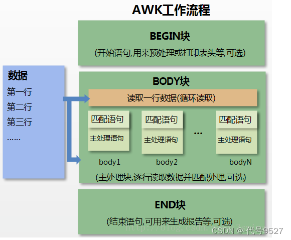
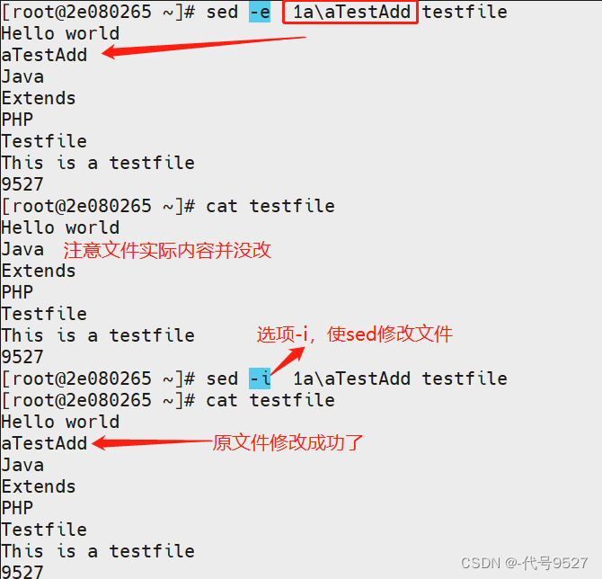
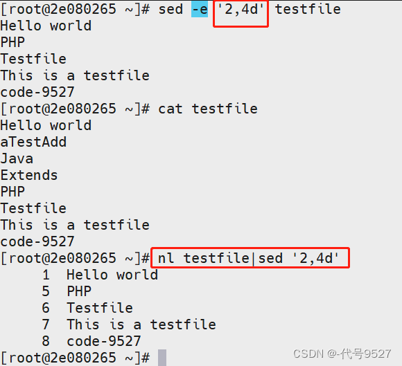
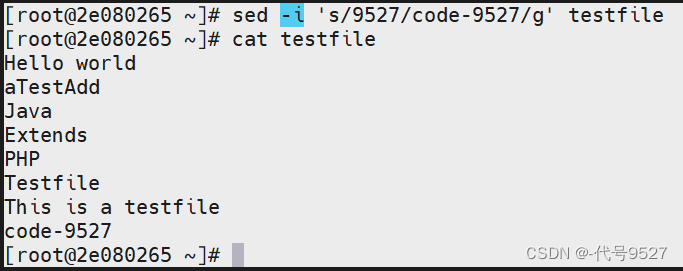

<center>
    <h1>
        Linux文本处理-grep awk sed
    </h1>
</center>

grep、awk、sed是Linux的三个文本操作指令。grep侧重单纯的查找与筛选，awk侧重格式化文本，sed侧重编辑匹配到的文本。

# 1、grep

Global Regular Expression Print，表示全局正则表达式。

语法

```shell
grep [参数] 样式 文件
```


参数
参数	含义
-A	后跟数字，除了符合样式的一行，并显示该行下面的n行
-B	后跟数字，除了符合样式的一行，并显示该行上面的n行
-C	后跟数字，除了符合样式的一行，并显示该行上下的n行
-c	返回匹配的行数
-e	实现逻辑or
-E	匹配多个样式，与-e相似
-f	后跟文件名，即把文件内容作为要匹配的样式
-F	将样式视为固定字符串
-i	忽略大小写
-n	显示匹配行的行号
-o	仅返回匹配到的字符串，而不是整行
-q	静默，不输出任何信息，用于脚本中
-v	反选
-w	匹配整个单词，而不是包含样式字符串就行

用法举例
经典用法---管道后的筛选

```shell
//用于管道后的筛选

ps -ef |grep -i redis
kubectl get po -A|grep -vi run
```


单独执行---查找匹配

```shell
//参数用法举例

> cat 1.txt
aaaaaa
bbbbbb
--------------------------------------
//-e与-E
> grep -e aa -e bb 1.txt
aaaaaa
bbbbbb
> grep -E "aa|bb" 1.txt
aaaaaa
bbbbbb

--------------------------------------
//有-F，aa*是一个固定字符串，而非匹配
> grep 'aa*' 1.txt
aaaaaa
> grep -F 'aa*' 1.txt
//空

> grep -f file.txt 1.txt  //file.txt内容为a
aaaaaa
--------------------------------------
//-w匹配整个单词
> grep aaa 1.txt
aaaaaa
> grep -w aaa 1.txt
//空
```


# 2、awk

awk，即awk指令的三个作者的Family Name 的首字符。

语法

```shell
awk [参数] ‘script’ var=value file
```

```shell
awk [参数] -f scriptfile var=value file
```

精髓是：`awk '{/条件/ 动作}' 文件名`

- **参数**

| 参数 | 含义                                |
| ---- | ----------------------------------- |
| -F   | 指定分隔符，默认是空格，如-F：      |
| -v   | 定义一个变量，如-v a=1              |
| -f   | 后跟脚本名，从脚本文件中读取awk指令 |

用法举例

```shell
//测试文件
> cat 1.txt
2 this is a test
3 Do you like awk
This's a test
10 There are orange,apple,mongo
```


用法1：格式化输出

```shell
> awk '{print $1,$4}' 1.txt
 ---------------------------------------------
 2 a
 3 like
 This's
 10 orange,apple,mongo
每行按空格或TAB分割，输出文本中的1、4列
```


用法2：-F指定分隔符

```shell
-F和使用内建变量FS的等价写法
> awk -F, '{print $1,$2}'   1.txt
> awk 'BEGIN{FS=","} {print $1,$2}'     1.txt

指定多个分隔符
> awk -F '[ ,]'  '{print $1,$2,$5}'   1.txt
 ---------------------------------------------
 2 this test
 3 Are awk
 This's a
 10 There apple
 -F '[ ,]'即先用空格分隔，对分隔结果在用逗号分隔
```


用法3：awk -v设置变量

```shell
> awk -va=1 '{print $1,$1+a}' 1.txt
 ---------------------------------------------
 2 3
 3 4
 This's 1
 10 11
 

//注意二者的区别,下面这个是输出第一列和第1+a列
> awk -va=1 '{print $1,$(1+a)}' 1.txt
```

用法4：从awk脚本中取awk指令

```shell
awk -f {awk脚本} {文件名}

> awk -f deploy.awk 1.txt
```


用法5：正则表达式匹配

```shell
1>匹配有re的行，并打印全行，以下三种写法等价
---------------------------------
awk '/re/' 1.txt
awk '/re/ {print}' 1.txt
awk '/re/ {print $0}' 1.txt

2>匹配有re的行，打印第二列和第四列
--------------------------------- 
awk '/re/ {print $2,$4}' 1.txt

3>匹配第二列有re的行，打印第二列和第四列
---------------------------------
awk '$2 ~ /re/ {print $2,$4}' 1.txt

4> 匹配严格以This开头的行
awk '/^This/' 1.txt
```


用法6：取反

```shell
awk '!/th/ {print}' 1.txt
awk '$2 !~ /th/ {print $2,$4}' 1.txt
```


用法7：忽略大小写

```shell
awk 'BEGIN{IGNORECASE=1} /this/' 1.txt
---------------------------------------------
2 this is a test
This's a test
```



BEGIN{ 这里面放的是执行前的语句 }
END {这里面放的是处理完所有的行后要执行的语句 }
{这里面放的是处理每一行时要执行的语句}


有关awk的常用组合指令：

#打印出网卡名和IP

```shell
ip a|awk '/glo/ {print $NF ":\n" $2}'
```

/glo/是去匹配包含glo字样的行，因为有配置IP地址的网口，必定IP的那一行是会有global字样的。最后一列是网卡名，第二列是IP地址。

#K8s相关

```shell
kubectl logs -f $(kubectl get po -A|awk ‘/pod-xxx/{print $2}’) -n namespace
```

```shell
kubectl delete pod ${kubectl get -A|awk ‘/pending/{print $2}’) -n namespace
```


# 3、sed

依照脚本处理文件。

语法

```shell
sed [-e script语句] [-f script文件] [文本文件]
```

参数
-e：说明用脚本语句处理文件
-f：说明用脚本文件处理文件

| 动作符号 | 含义                                       |
| -------- | ------------------------------------------ |
| a        | 新增，后跟字符串，新字符串在指定行的下一行 |
| c        | 取代                                       |
| d        | 删除                                       |
| i        | 插入，后跟字符串，新字符串在指定行的上一行 |
| p        | 打印                                       |
| s        | 取代                                       |

用法举例

```shell
//测试文件

>cat testfile
Hello world
Java
Extends
PHP
Testfile
This is a testfile
9527
```

```shell
// a新增
sed 行号a\新加内容 文件名

> sed -e 1a\aTestAdd testfile
```

结果：



```shell
// d删除

//删除第2-4行，没加-i，不改原文件
> sed '2,4d' testfile
```

结果：



经典用法–查找与替换

```shell
sed 's/要被取代的字串/新的字串/g'
```

```shell
sed -i 's/9527/code-9527/g' testfile
```



同样的注意，不加-i，只是输出到控制台的被修改了，实际文件没变


