# logback快速入门

## 1 logback基本概念与语法

### 1.1 日志级别

Logger 分为TRACE, DEBUG, INFO, WARN, ERROR五个等级，各级别的优先级由低到高排序为：TRACE < DEBUG < INFO < WARN < ERROR。

我们打印日志时，相应的也有每个级别的方法：

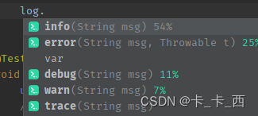

打印日志时，也适用上面的日志级别，如果日志记录请求的级别高于或等于Logger的级别才能打印。

官网上如下表格很好的说明了这个问题：

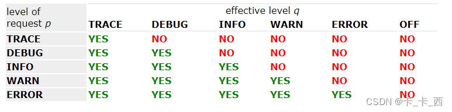

### 测试日志级别

默认日志级别
下面我们测试下日志打印与日志级别的关系：

新建UserService类：

```java
@Service
public class UserService {
    private static final Logger logger = LoggerFactory.getLogger(UserService.class);
 
    public void testLevel(){
        logger.trace(" --- trace --- ");
        logger.debug(" --- debug --- ");
        logger.info(" --- info --- ");
        logger.warn(" --- warn --- ");
        logger.error(" --- error --- ");
    }
}
```

测试类中添加测试方法：

```java
@SpringBootTest
class LogbackApplicationTests {
    @Autowired
    private UserService userService;
 
    @Test
    void testLevel() {
        userService.testLevel();
    }
}
```

方法testLevel()执行结果如下：

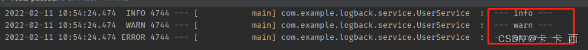

如上，打印出了info及info级别以上的日志，可推断Springboot的默认日志级别为INFO，我们看下源码中的默认配置：

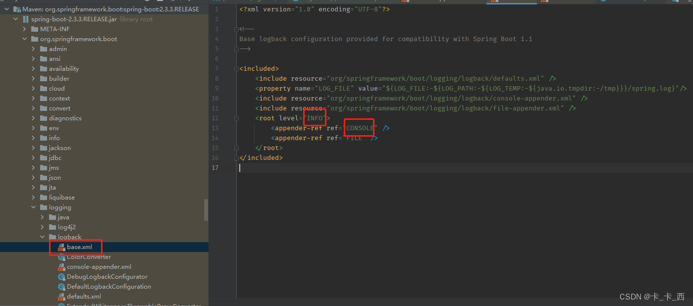

### 修改日志级别

我们可以在在配置文件中修改默认的日志级别：

```yaml
logging:
  level:
    com.example.logback.service: debug  // 包路径: 日志级别
```

再次运行上面的测试方法：testLevel()，执行结果如下：

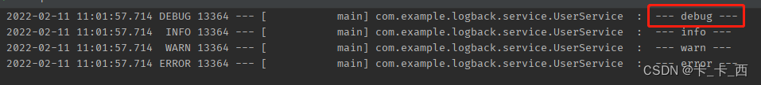

如上，可以看到这次把debug也打印了出来，说明自定义记日志级别生效。

注意： 上面配置日志级别的时候，debug和前面的包路径后的:后要加空格，形如： 包路径: 空格 日志级别。

没有空格的话执行会报如下错误：

```shell
Caused by: org.springframework.boot.context.properties.bind.BindException: Failed to bind properties under 'logging.level' to java.util.Map<java.lang.String, org.springframework.boot.logging.LogLevel>
```


### 参数化日志

形式
上面我们打印日志的时候都是使用形如下面这种方式打印的：

```java
logger.info(" --- info --- ");
```

上面这种方式一般也只会在测试的时候用到，正式环境中是不推荐这样记录日志的。

我们可以使用以下这种使用 `{}` 进行日志的记录：

```java
logger.debug("The entry is {}", entry);
```

上面这种使用 `{}` 占位符记录变量进行日志打印的方式就是参数化日志。

如果打印的参数太多，可以采用如下的形式：

```java
Object[] paramArray = {newVal, below, above};
logger.debug("Value {} was inserted between {} and {}.", paramArray);
```

#### 好处

使用参数化日志主要是为了**提高性能**。

我们以下面一组日志记录语句来说明一下参数化日志是怎么提高性能的，如下：

```java
logger.debug("The new entry is " + entry);
logger.debug("The new entry is {}", entry);
```

先看**第一个**打印语句：这种打印日志的方式无论日志级别是什么，总要先执行 "The new entry is " + entry 这段字符串的拼接操作，尽管logger设置的日志级别比 debug 高的时候，debug级别的信息不会被打印出来，显然，字符串的拼接是不必要的，这还只是字符串拼接，如果在有大量的计算、类型转换等操作，并且项目中很频繁的记录日志，这无疑会带来很大的性能浪费。


再看**第二个**打印语句：这种使用 {} 占位符记录日志的方式，只有在需要打印debug信息的时候，才会执行字符串的拼接，将 {} 替换为 entry，也就是说在这种情况下，如果设置的日志级别比debug高，就不会有字符串拼接的操作，从而提高服务整体性能。

在网上看到过一个测试报告，上面有这样一句话：下面两行输出的结果是一样的，但是一旦禁止日志打印，第二个变量的性能至少比第一个变量好上 30 倍。


### 日志级别的继承性

如果一个给定的 logger 没有指定一个层级，那么它就会继承离它最近的一个祖先的层级。

root logger 作为 logger 层次结构的最高层。它是一个特殊的 logger，并且在logback框架中为了确保所有的 logger 都有一个层级，root logger 会有一个默认层级 --- DEBUG。

但是在springboot中默认的logback日志级别为INFO，看下springboot中logging包下对logback的配置如下，我用的boot版本是2.3.3.RELEASE，其它版本不知是否有不同。

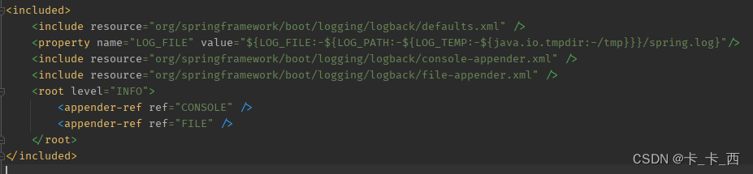

关于日志级别的继承看下官方文档中的几个例子：

Example 1

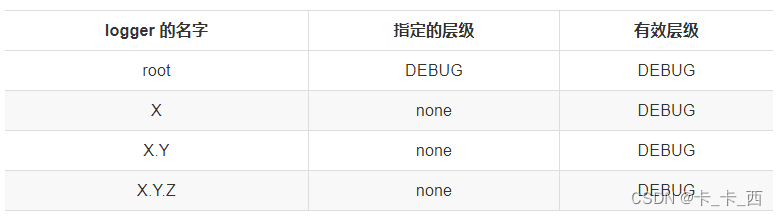

在这个例子中，只有 root logger 被指定了层级，所以 logger X，X.Y，X.Y.Z 的有效层级都是 DEBUG。

Example 2

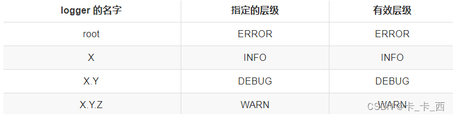

在这个例子中，每个 logger 都分配了层级，所以有效层级就是指定的层级。

Example 3

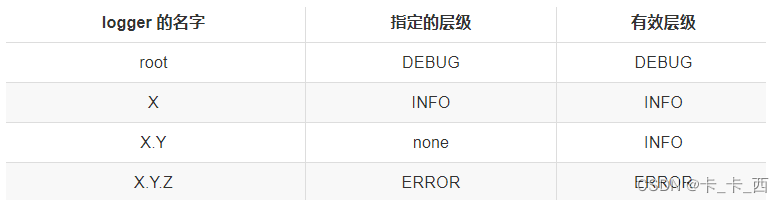

在这个例子中，logger root，X，X.Y.Z 都分别分配了层级。logger X.Y 继承它的父级 logger X。

Example 4

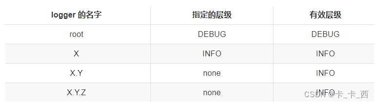

在这个例子中，logger root，X 都分配了层级。logger X.Y，X.Y.Z 的层级继承它们最近的父级 X。

配置文件加载顺序
根据不同的日志系统，按照指定的规则组织配置文件名，并放在resources目录下，就能自动被SpringBoot加载：

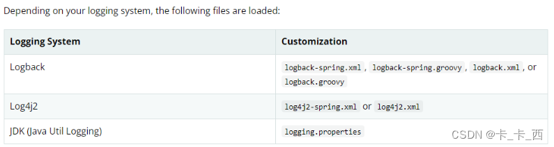

关于配置文件的命名，官方建议：如果可能，我们建议您在日志配置中使用-spring变量(例如，logback-spring.xml而不是logback.xml)。

以下我不按照官网建议来，依然使用logback.xml作为文件名。


### 配置文件语法

#### 基本结构

配置文件的最基本结构如下：

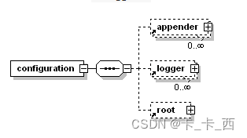

如上，配置文件的最基本结构可以描述为`<configuration>`标签，包含零个或多个`<appender>`标签，然后是零个或多个`<logger>`标签，最多包含一个`<root>`标签。


#### 关于标签大小写

从 Logback 版本 0.9.17 开始，与显式规则有关的标记名称不区分大小写。例如，`<logger>`，`<Logger>`和`<LOGGER>`是有效的配置元素。但是，XML 格式规则仍然适用，如果以`<xyz>`的形式打开标签，则必须以`</xyz>`的形式将其关闭，而`</XyZ>`将不起作用。


#### SimpleDateFormat约定

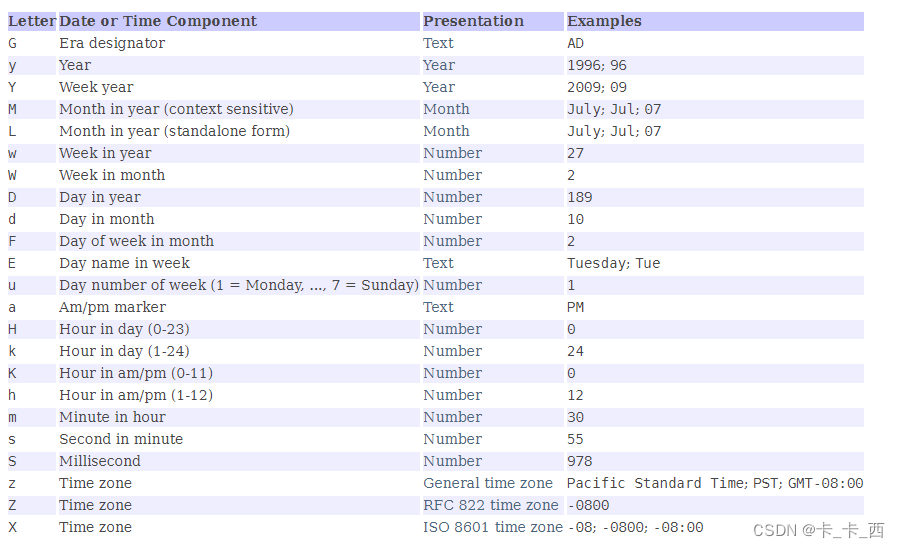


#### logger标签

`<logger>`用来设置某一个包或者具体的某一个类的日志打印级别、以及指定`<appender>`。

`<logger>`仅有一个必选的name属性，一个可选的level和一个可选的addtivity属性。

| 属性      | 是否必填 | 作用                                               |
| :-------- | :------- | :------------------------------------------------- |
| name      | 是       | 用来指定受此logger约束的某一个包或者具体的某一个类 |
| level     | 否       | 来设置打印级别，大小写无关                         |
| addtivity | 否       | 是否向上级logger传递打印信息，默认是true           |

具体说明一下：

name：用来指定受此logger约束的某一个包或者具体的某一个类。

level：用来设置打印级别，大小写无关：TRACE, DEBUG, INFO, WARN, ERROR, ALL 和 OFF，还有一个特殊值INHERITED或者同义词NULL，代表强制执行上级的级别，如果未设置此属性，那么当前logger将会继承上级的级别。

addtivity：是否向上级logger传递打印信息。默认是true。

<logger>(包括<root>)可以通过附加(<appender-ref ref="" />)到本身的 appender 输出日志，同样的也可以附加到其祖先的身上，并输出日志。因此，如果同一个 appender 附加到多个 logger 身上，那么就导致日志重复打印，你可以设置 additivity = false禁止向上级传递打印信息。

示例：

```xml
<logger name="com.example.logback.service.UserService" additivity="false">
    <!-- 引用自定义的appender -->
    <appender-ref ref="user_log"/>
    <!-- 这里也引用控制台appender，才能在控制台中看到我们的日志 -->
    <appender-ref ref="CONSOLE"/>
</logger>
```


#### root标签

<root>用来指定最基础的日志输出级别，只有一个level属性,<root> 元素可以包含 0 或多个 <appender-ref> 元素。

level 属性的值可以是不区分大小写的字符串 TRACE，DEBUG，INFO，WARN，ERROR，ALL 或 OFF 之一。请注意，根 Logger 的级别不能设置为 INHERITED 或 NULL。


#### appender标签

<appender>元素可以包含零个或一个<layout>元素，零个或多个<encoder>元素和零个或多个<filter>元素，以及一些滚动策略等配置。

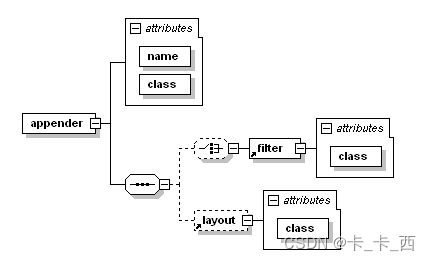

示例：  

```xml
<appender name="CONSOLE" class="ch.qos.logback.core.ConsoleAppender">
    <encoder>
        <pattern>%msg%n</pattern>
    </encoder>
</appender>
```


#### filter标签

Logback的过滤器基于三值逻辑（ternary logic），允许把它们组装或成链，从而组成任意的复合过滤策略，过滤器的返回值只能是ACCEPT、DENY和NEUTRAL的其中一个。

DENY：那么记录事件立即被抛弃，不再经过剩余过滤器。

NEUTRAL：那么有序列表里的下一个过滤器会接着处理记录事件。

ACCEPT：那么记录事件被立即处理，不再经过剩余过滤器。


过滤器被添加到<Appender> 中，为<Appender> 添加一个或多个过滤器后，可以用任意条件对日志进行过滤。<Appender> 有多个过滤器时，按照配置顺序执行。

常用的过滤器是LevelFilter：

LevelFilter 基于级别来过滤日志事件。如果事件的级别与配置的级别相等，过滤器会根据配置的 onMatch 与 onMismatch 属性，接受或者拒绝事件，它有以下子节点：

<level>：设置过滤级别。

<onMatch>：用于配置符合过滤条件的操作。

<onMismatch>：用于配置不符合过滤条件的操作。

示例：

```xml
<configuration>
  <appender name="CONSOLE" class="ch.qos.logback.core.ConsoleAppender">
    <filter class="ch.qos.logback.classic.filter.LevelFilter">
      <level>INFO</level>
      <onMatch>ACCEPT</onMatch>
      <onMismatch>DENY</onMismatch>
    </filter>
    <encoder>
      <pattern>
        %-4relative [%thread] %-5level %logger{30} - %msg%n
      </pattern>
    </encoder>
  </appender>
</configuration>
```

它的含义是：将过滤器的日志级别配置为INFO，所有INFO级别的日志交给appender处理，非INFO级别的日志，被过滤掉。

比如如下两条打印语句，就只会打印info级别的一条。

```java
logger.debug("DEBUG级别---");
logger.info("INFO级别---");
```

encoder标签
负责两件事，一是把日志信息转换成字节数组，二是把字节数组写入到输出流。encoder中最重要就是pattern节点，它负责控制输出日志的格式。

示例：

```xml
<pattern>%d{yyyy-MM-dd HH:mm:ss.SSS} %-5level %-40.40logger{39} --- [%15.15(%thread)]  : %msg%n</pattern>
```

结果示例：

```shell
2022-02-11 15:14:42.519 DEBUG com.example.logback.service.UserService  --- [           main]  :  --- debug ---
```

解释一下：

%d：表示日期，默认yyyy-MM-dd。

```shell
％d 转换说明符可以包含java.text.SimpleDateFormat类指定的日期和时间模式。如果省略了日期和时间模式，则采用默认模式 yyyy-MM-dd 。
```

%-5level：日志级别。

%thread：表示线程名。

%logger：输出日志的类名。

logger{length}：对输出日志的类名缩写展示。

length为整数，比如实际输出日志的类名为 com.example.logback.service.UserService 那么logger{10}时，我们发现UserService为11字符，已经超过10，那么类名的最后一个单词将原样展示，之前的包路径首字母缩写展示，最终展示为 c.e.l.s.UserService 。官网示例及规则如下：

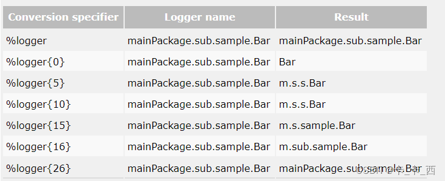

%msg：日志输出内容。

%n：换行符。

-：减号修饰符是**左对齐**标志，它可以配合十进制数字控制输出的最大最小宽度。


默认输出日志时右对齐左填充的，可以使用左对齐标志修改它，通常指定一个十进制的数字来表示输出是的最小最大宽度。

如果输出数据的字符长度小于指定的最小宽度，则在左侧或者右侧使用空格进行填充。

如果输出数据的字符长度大于指定的最小宽度，此时设置的最小宽度值失效，将按照实际的长度进行输出。

也可以设置最大宽度，通过 .(点号)+十进制数字指定。

如果输出数据的字符长度大于指定的最大宽度，那么多余的字符将删除，默认截取数据项的前几个字符，可以通过在点号后加减号的方式，表示为从数据项的结尾截取。


以下为官网关于对齐方式和截取的示例：

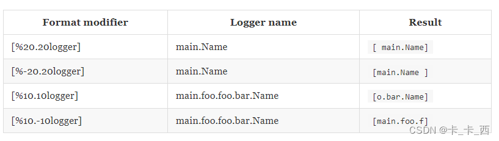

您可能只想打印 T，D，W，I 和 E，而不是为该级别打印 TRACE，DEBUG，WARN，INFO 或 ERROR。此时可以使用格式修饰符实现，如：%.-1level。


#### 日志颜色

withJansi设置为true将启用 Jansi 库对 ANSI 颜色代码的解释，常用颜色包括：％red、％green、％yellow、％blue等。

示例：

```xml
<configuration debug="true">
  <appender name="STDOUT" class="ch.qos.logback.core.ConsoleAppender">
    <withJansi>true</withJansi>
    <encoder>
      <pattern>[%thread] %red(%-5level) - %msg %n</pattern>
    </encoder>
  </appender>
  <root level="DEBUG">
    <appender-ref ref="STDOUT" />
  </root>
</configuration>
```


#### contextName标签

当多个应用输出日志到同一个目的地，设置 logger contextName 可以更好的区分。

示例：

```xml
<configuration>
  <contextName>myAppName</contextName>
  <appender name="STDOUT" class="ch.qos.logback.core.ConsoleAppender">
    <encoder>
      <pattern>%d %contextName [%t] %level %logger{36} - %msg%n</pattern>
    </encoder>
  </appender>
 
  <root level="debug">
    <appender-ref ref="STDOUT" />
  </root>
</configuration>
```


#### timestamp标签

元素具有两个必需属性 key 和 datePattern。 key属性定义一个标识，下面可以通过此标识进行变量引用， datePattern 属性表示用于将当前时间(解析配置文件)转换为字符串的日期模式。日期模式应遵循SimpleDateFormat中定义的约定。

如下，我们使用timestamp 来实现一个唯一命名的文件(按时间戳记)

示例：

```xml
<configuration>
  <!-- Insert the current time formatted as "yyyyMMdd'T'HHmmss" under
       the key "bySecond" into the logger context. This value will be
       available to all subsequent configuration elements. -->
  <timestamp key="bySecond" datePattern="yyyyMMdd'T'HHmmss"/>
 
  <appender name="FILE" class="ch.qos.logback.core.FileAppender">
    <!-- use the previously created timestamp to create a uniquely
         named log file -->
    <file>log-${bySecond}.txt</file>
    <encoder>
      <pattern>%logger{35} - %msg%n</pattern>
    </encoder>
  </appender>
 
  <root level="DEBUG">
    <appender-ref ref="FILE" />
  </root>
</configuration>
```


#### 变量定义`<property>`

使用 <property> 定义变量，定义的变量可以使用 ${} 进行引用。

方式一：

示例：

```xml
<configuration>
  <property name="USER_HOME" value="/home/sebastien" />
 
  <appender name="FILE" class="ch.qos.logback.core.FileAppender">
    <file>${USER_HOME}/myApp.log</file>
    <encoder>
      <pattern>%msg%n</pattern>
    </encoder>
  </appender>
 
  <root level="debug">
    <appender-ref ref="FILE" />
  </root>
</configuration>
```


方式二：

除了直接定义在日志配置文件中，还可以定义在spring的配置文件中。

比如，我们在配置文件 application.yml 中有如下配置：

```yaml
logging:
  file:
    path: d:/logs
```


在 logback.xml 中如下配置：

```xml
<?xml version="1.0" encoding="UTF-8"?>
<configuration>
 
    <appender name="FILE" class="ch.qos.logback.core.FileAppender">
        <file>${LOG_PATH}/myApp.log</file>
        <encoder>
            <pattern>%msg%n</pattern>
        </encoder>
    </appender>
 
    <root level="debug">
        <appender-ref ref="FILE" />
    </root>
</configuration>
```


方式三：

将这些变量放到一个单独的文件中。如在test.properties文件中定义一个变量USER_HOME=/data/logs，然后通过<property>标签的file属性指定这个文件的路径，在使用的时候同样可以通过${}引用，通常我们在 classpath 下定义配置文件。

归档日志文件命名 %d、%i
示例：

```xml
<fileNamePattern>mylog-%d{yyyy-MM-dd}_%i.txt</fileNamePattern>
<maxFileSize>100MB</maxFileSize>  
```

%d：表示日志的后缀，上面精确到天，即一天一个日志文件。如：mylog-2022-01-01.txt。

%i：表示如果这一天中文件大小超过了100MB，将重新记录一个文件。如：mylog-2022-01-01_1.txt。

springProfile 多环境配置
先贴一张官网右键翻译的截图：

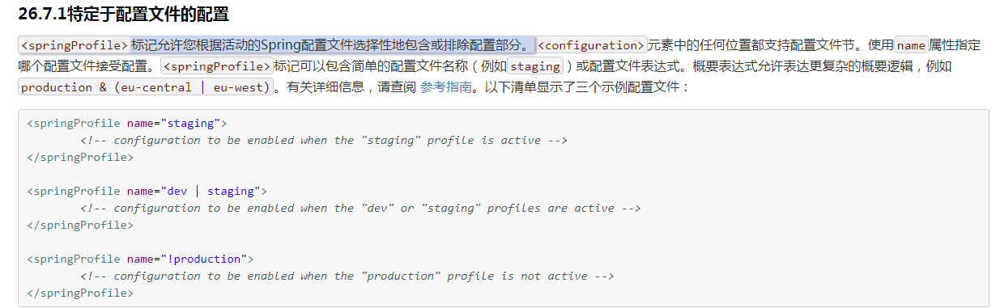

<springProfile>的name属性可以指定多个，如：name="prod,test",也可以这样：name="!dev"等。

从这三个官方示例可以看出<springProfile>标签可以指定某段配置只在某个环境下生效。例如：平时我们开发用的是开发环境配配置文件，上线后使用生成环境的配置文件，开发环境为了方便调试，可能会启用debug级别的日志记录，而生成环境我们只需要记录error级别的日志，毕竟主要是要记录错误信息进行错误定位，这时候就可以使用<springProfile>标签分别指定每个环境下用的日志配置。

测试多环境配置前先新增application-dev.yml和application-prod.yml两个配置文件，并在application.yml文件中指定prod文件生效，<springProfile>标签可以写在任何地方，如下测试例子：

```xml
    <!-- 日志输出格式 -->
    <property name="log.pattern"
              value="%d{HH:mm:ss.SSS} [%thread] %-5level %logger{20} - [%method,%line] - %msg%n"/>
    <!-- 日志输出格式1 -->
    <property name="prod.pattern"
              value="%d{yyyy-MM-dd}--->[%thread]--->%-5level %logger{20} - [%method,%line] - %msg%n"/>   
 <appender name="console" class="ch.qos.logback.core.ConsoleAppender">
        <springProfile name="dev">
            <encoder>
                <pattern>${log.pattern}</pattern>
            </encoder>
        </springProfile>
        <springProfile name="prod">
            <encoder>
                <pattern>${prod.pattern}</pattern>
            </encoder>
        </springProfile>
    </appender>
```

解释一下这个配置：我想dev环境下控制台日志的输出格式为log.pattern，prod环境下控制台日志的输出格式为prod.pattern，测试下贴一下结果：

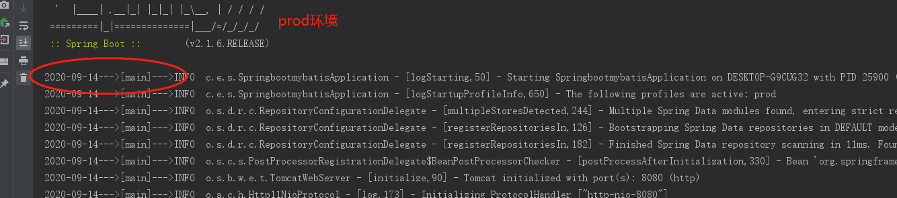

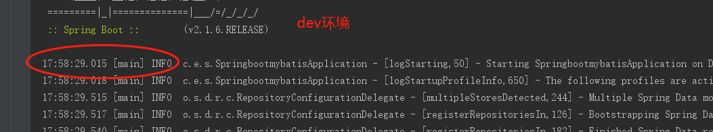


### 常用Appender

#### OutputStreamAppender

OutputStreamAppender将事件附加到 java.io.OutputStream。此类为某些appender的超类。

| 属性           | 类型    | 描述                                           |
| :------------- | :------ | :--------------------------------------------- |
| encoder        | Encoder | 确定将事件写入基础OutputStreamAppender的方式。 |
| immediateFlush | boolean | 详情看下面。                                   |

immediateFlush:默认情况下，每个日志事件都会立即刷新到底层输出流。这种默认方法更安全，因为在应用程序没有正确关闭appender就退出的情况下，日志记录事件不会丢失。但是，为了显著增加日志记录吞吐量，您可能希望将immediateFlush属性设置为false。


#### ConsoleAppender

把日志添加到控制台。

示例：

```xml
<configuration>
 
    <appender name="STDOUT" class="ch.qos.logback.core.ConsoleAppender">
        <!-- encoders are assigned the type
             ch.qos.logback.classic.encoder.PatternLayoutEncoder by default -->
        <encoder>
            <pattern>%-4relative [%thread] %-5level %logger{35} - %msg %n</pattern>
        </encoder>
    </appender>
 
    <root level="DEBUG">
        <appender-ref ref="STDOUT" />
    </root>
</configuration>
```


#### FileAppender

将日志事件附加到文件中。目标文件由“file”选项指定，如果文件已经存在，则根据 append 属性的值将其追加或截断。

| 属性           | 类型    | 描述                                                         |
| :------------- | :------ | :----------------------------------------------------------- |
| append         | boolean | 如果为真，则将事件追加到现有文件的末尾。否则，如果append为false，则任何现有文件将被截断。append选项默认设置为true。 |
| encoder        | Encoder |                                                              |
| file           | String  | 要写入的文件的名称。如果该文件不存在，则创建它。             |
| immediateFlush | boolean | 日志事件是否立即刷新到底层输出流。                           |

在 Windows 平台上，用户经常忘记转义反斜杠。例如，值c：\ temp\test.log 中'\ t'可能被当做转义符解释(解释为单个制表符( u0009))。正确的值可以指定为 c：/temp/test.log，也可以指定为 c:\\temp\\test.log。 File 选项没有默认值。

如果文件的父目录不存在，FileAppender将自动创建它，包括任何必要但不存在的父目录。


#### RollingFileAppender

RollingFileAppender扩展了FileAppender的功能，可以滚动生成日志文件。

比如：RollingFileAppender类负责将日志输出到 log.txt 文件，在满足了特定的条件之后，将日志输出到log1.txt文件。

与RollingFileAppender交互的有两个重要的子组件 ：

RollingPolicy：负责执行过渡所需的操作，比如文件移动、重命名。

TriggeringPolicy：将确定是否以及何时准确发生翻转。

也就是说，RollingPolicy负责什么，TriggeringPolicy负责when。

为了发挥作用，RollingFileAppender必须同时设置RollingPolicy和TriggeringPolicy，如果它的RollingPolicy也实现了TriggeringPolicy接口，则仅需指定RollingPolicy。

RollingFileAppender的可用属性：

| 属性             | 类型             | 描述                                                         |
| :--------------- | :--------------- | :----------------------------------------------------------- |
| file             | String           | 要写入文件的名称。如果文件不存在，则新建。                   |
| append           | boolean          | 如果为真，则将事件追加到现有文件的末尾。否则，如果append为false，则任何现有文件将被截断。append选项默认设置为true。 |
| encoder          | Encoder          | 通过配置pattern节点来指定日志输出格式。                      |
| rollingPolicy    | RollingPolicy    | 当轮转发生时，指定 RollingFileAppender 的行为，比如使用SizeAndTimeBasedRollingPolicy轮转策略。 |
| triggeringPolicy | TriggeringPolicy | 指定 RollingFileAppender何时进行轮转。                       |


#### RollingFileAppender滚动策略 - TimeBasedRollingPolicy

它基于时间定义了过渡策略。例如按天或按月。

TimeBasedRollingPolicy实现了TriggeringPolicy接口，所以我们使用的时候只需要配置rollingPolicy节点即可。

TimeBasedRollingPolicy的属性如下：

| 属性                | 类型    | 描述                                                         |
| :------------------ | :------ | :----------------------------------------------------------- |
| fileNamePattern     | String  | 定义了过渡(存档)日志文件的名称。                             |
| maxHistory          | int     | 设置日志文件的保存时间，超时的删除。                         |
| totalSizeCap        | int     | 所有存档文件的总大小。当超过总大小上限时，最早的 Files 将被异步删除。 |
| cleanHistoryOnStart | boolean | 如果设置为 true，则在启动附加程序时将执行归档删除。默认情况下，此属性设置为 false。 |

官网示例：

```xml
<configuration>
  <appender name="FILE" class="ch.qos.logback.core.rolling.RollingFileAppender">
    <file>logFile.log</file>
    <rollingPolicy class="ch.qos.logback.core.rolling.TimeBasedRollingPolicy">
      <!-- daily rollover -->
      <fileNamePattern>logFile.%d{yyyy-MM-dd}.log</fileNamePattern>
      <!-- keep 30 days' worth of history capped at 3GB total size -->
      <maxHistory>30</maxHistory>
      <totalSizeCap>3GB</totalSizeCap>
    </rollingPolicy>
    <encoder>
      <pattern>%-4relative [%thread] %-5level %logger{35} - %msg%n</pattern>
    </encoder>
  </appender> 
  <root level="DEBUG">
    <appender-ref ref="FILE" />
  </root>
</configuration>
```

以上日志的保存时间为30天，超过30天的文件将删除，所有存档文件的总大小超过3GB时，最早的 Files 将被异步删除。


**补充下：**

maxHistory的保存时长与fileNamePattern设置有关，如果保存格式为yyyyMMddHHmm，那maxHistory的时间单位就是分钟，如果保存格式为yyyyMMdd，那maxHistory的时间单位就是天。

通常在过渡期间执行归档删除。但是，某些应用程序的生存时间可能不足以触发翻转。由此可见，对于这样短暂的应用程序，归档删除可能永远不会有执行的机会。通过将 cleanHistoryOnStart 设置为 true，将在附加程序启动时执行归档删除。

TimeBasedRollingPolicy支持自动文件压缩。如果 fileNamePattern 选项的值以.gz 或 .zip 结尾，则启用此功能。

由于各种技术原因，文件轮转不是由时钟驱动的，而是取决于日志记录事件的到达。

例如，在 2002 年 3 月 8 日，假设 fileNamePattern 设置为yyyy-MM-dd (每日翻转)，则文件轮转发生在午夜后第一个事件到达时，比如在00:23:47秒来了一个记录日志的实践，那么实际上文件将在在 2002 年 3 月 9 日 00:23:47轮转，而非2002 年 3 月 9 日 00:00:00。


#### RollingFileAppender滚动策略 - SizeAndTimeBasedRollingPolicy

基于大小和时间的滚动策略。

上面TimeBasedRollingPolicy已经可以限制归档日志文件的时间和总文件的大小，如果希望限制每个日志文件的大小可以使用SizeAndTimeBasedRollingPolicy。

官网示例：

```xml
<configuration>
  <appender name="ROLLING" class="ch.qos.logback.core.rolling.RollingFileAppender">
    <file>mylog.txt</file>
    <rollingPolicy class="ch.qos.logback.core.rolling.SizeAndTimeBasedRollingPolicy">
      <!-- rollover daily -->
      <fileNamePattern>mylog-%d{yyyy-MM-dd}.%i.txt</fileNamePattern>
       <!-- each file should be at most 100MB, keep 60 days worth of history, but at most 20GB -->
       <maxFileSize>100MB</maxFileSize>    
       <maxHistory>60</maxHistory>
       <totalSizeCap>20GB</totalSizeCap>
    </rollingPolicy>
    <encoder>
      <pattern>%msg%n</pattern>
    </encoder>
  </appender>
  <root level="DEBUG">
    <appender-ref ref="ROLLING" />
  </root>
 
</configuration>
```

请注意，除了“％d”外，还包括“％i”转换令牌。 **％i 和％d 标记都是必需的**. 每次当前日志文件在当前时间段结束之前达到 maxFileSize 时，它将以从 0 开始的递增索引进行归档。

RollingFileAppender触发策略 - SizeBasedTriggeringPolicy
SizeBasedTriggeringPolicy查看当前活动文件的大小。如果它增长到大于指定的大小将触发现有活动文件的翻转。

仅接受一个参数，即 maxFileSize，默认值为 10 MB。

可通过*KB、MB 和 GB 指定 maxFileSize 单位。

官网示例：

```xml
<configuration>
  <appender name="FILE" class="ch.qos.logback.core.rolling.RollingFileAppender">
    <file>test.log</file>
    <rollingPolicy class="ch.qos.logback.core.rolling.FixedWindowRollingPolicy">
      <fileNamePattern>test.%i.log.zip</fileNamePattern>
      <minIndex>1</minIndex>
      <maxIndex>3</maxIndex>
    </rollingPolicy>
 
    <triggeringPolicy class="ch.qos.logback.core.rolling.SizeBasedTriggeringPolicy">
      <maxFileSize>5MB</maxFileSize>
    </triggeringPolicy>
    <encoder>
      <pattern>%-4relative [%thread] %-5level %logger{35} - %msg%n</pattern>
    </encoder>
  </appender>
	
  <root level="DEBUG">
    <appender-ref ref="FILE" />
  </root>
</configuration>
```

如上，RollingFileAppender结合SizeBasedTriggeringPolicy在日志文件大小达到 5MB 时触发翻转。

FixedWindowRollingPolicy官网强烈建议不要不使用，感兴趣看官网。


#### SiftingAppender

可用于根据给定的运行时属性来分离(或筛选)日志记录。

比如，生产环境上很多业务流程很长，日志文件都打进一个log里查询定位很不方便。因而就希望按不同的业务，每个业务生成一个独立的业务文件。

再比如，我们可以根据用户会话将日志记录事件分开，以便将不同用户生成的日志放入不同的日志文件中，每个用户一个日志；或者我们在同一个类中打印的日志不想记录到同一个文件中，也可以使用SiftingAppender来实现。

SiftingAppender 的可用属性：

| 属性             | 类型     | 描述                                                         |
| :--------------- | :------- | :----------------------------------------------------------- |
| timeout          | Duration | 超时持续时间内未访问的嵌套追加器被认为是过时的，超时的附加程序已关闭，并且`SiftingAppender`未对其进行引用。超时的默认值为 30 分钟。 |
| maxAppenderCount | integer  | 可以创建和跟踪嵌套的追加程序`SiftingAppender`的最大数量。 maxAppenderCount 的默认值为 Integer.MAX_VALUE。 |

SiftingAppender通过动态创建嵌套的追加程序来实现上面说的功能。嵌套的附加程序是根据SiftingAppender本身的配置(包含在<sift>元素内)中指定的模板创建的。

处理日志记录事件时，SiftingAppender将选择一个子附加程序委托给它。选择标准是在运行时由鉴别器计算的。用户可以在Discriminator的帮助下指定选择标准。


#### AsyncAppender

AsyncAppender并不处理日志，只是将日志缓冲到一个BlockingQueue里面去，并在内部创建一个工作线程从队列头部获取日志，之后将获取的日志循环记录到附加的其他appender上去，从而达到不阻塞主线程的效果。因此AsynAppender仅仅充当事件转发器，必须引用另一个appender来做事。

默认情况下，AsyncAppender会在队列满80%的情况下删除TRACE、DEBUG和INFO级别的事件。这种策略以事件损失为代价，对性能有惊人的有利影响。

由于使用了BlockingQueue来缓存日志，因此就会出现队列满的情况，默认情况下，AsyncAppender会在队列满80%的情况下删除TRACE、DEBUG和INFO级别的事件。这种策略以事件损失为代价，对性能有惊人的有利影响。

| 属性                | 类型    | 描述                                                         |
| :------------------ | :------ | :----------------------------------------------------------- |
| queueSize           | int     | BlockingQueue的最大容量，默认情况下，大小为256。             |
| discardingThreshold | int     | 默认情况下，当BlockingQueue还有20%容量，他将丢弃TRACE、DEBUG和INFO级别的event，只保留WARN和ERROR级别的event。为了保持所有的events，设置该值为0。 |
| includeCallerData   | boolean | 为了提升性能，默认情况下为false。                            |
| maxFlushTime        | int     | 刷新队列的超时时间单位毫秒，无法在此窗口内处理的事件将被丢弃。 |
| neverBlock          | boolean | morenfalse，当队列满了时，会阻塞业务线程，此时异步处理会变成同步等待。 |

**queueSize**：blockingQueue长度决定了队列能放多少信息，在默认的配置下，如果blockingQueue放满了，后续想要输出日志的线程会被阻塞，直到Worker线程处理掉队列中的信息为止。根据实际情况适当调整队列长度，可以防止线程被阻塞。

**discardingThreshold**：为了提高性能，默认情况下，当事件添加到事件队列时，不会提取与事件关联的调用者数据。默认情况下，只复制像线程名和MDC这样的“廉价”数据。您可以通过将inclecallerdata属性设置为true来引导这个appender包含调用者数据。

**maxFlushTime**：根据队列深度和被引用的appender的延迟，AsyncAppender可能会花费不可接受的时间来完全刷新队列。当LoggerContext停止时，AsyncAppender stop方法将等待工作线程完成此超时。使用maxFlushTime指定以毫秒为单位的最大队列刷新超时。无法在此窗口内处理的事件将被丢弃。该值的语义与Thread.join(long)相同。

**neverBlock**：如果为false(默认值)，代表在队列放满的情况下是否卡住线程，不会丢失消息。当队列满了时，会阻塞业务线程，此时异步处理会变成同步等待；只有队列有可用容量时，业务线程才从阻塞状态恢复。如果配置neverBlock=true，当队列满了之后，后面阻塞的线程想要输出的消息就直接被丢弃，从而线程不会阻塞。


#### DBAppender

可以将日志记录到数据库中。

按照官网说需要提前件三张表：logging_event、logging_event_property、logging_event_exception，建表的脚本在 logback-classic/src/main/java/ch/qos/logback/classic/db/script 目录下，看了下GitHub，最新的版本中已经找不到建表语句，可以往前翻一下历史版本，比如：


logback/logback-classic/src/main/java/ch/qos/logback/classic/db at v_1.0.9 · qos-ch/logback · GitHub

https://github.com/qos-ch/logback/tree/v_1.0.9/logback-classic/src/main/java/ch/qos/logback/classic/db


我在这个版本中就发现有建表语句的。

每个表的字段含义官网中也有说明，这里就不记录了，详情查看官网：Chapter 4: Appenders 。

日志事件可以以相当快的速度创建。为了跟上必须插入数据库的事件流，建议对DBAppender使用连接池。 实验表明，将连接池与DBAppender一起使用可显着提高性能。据官网说，使用连接池后性能提升了10倍。

终于结束啦，下一篇将使用Springboot整合logback对工作中常用的使用场景进行代码演示，比如

按照业务功能生成独立的日志文件、每个用户生成独立的日志文件、使用AsyncAppender提高日志效率、使用DBAppender将日志直接入库等，敬请期待！
