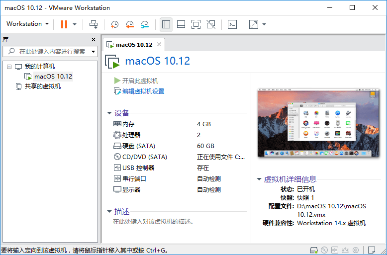
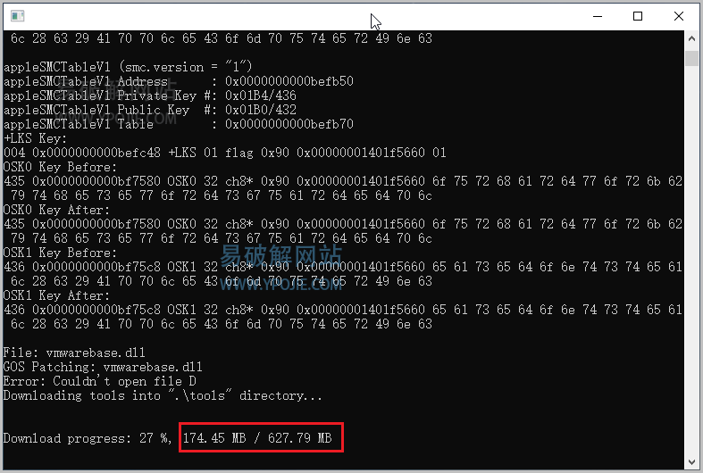
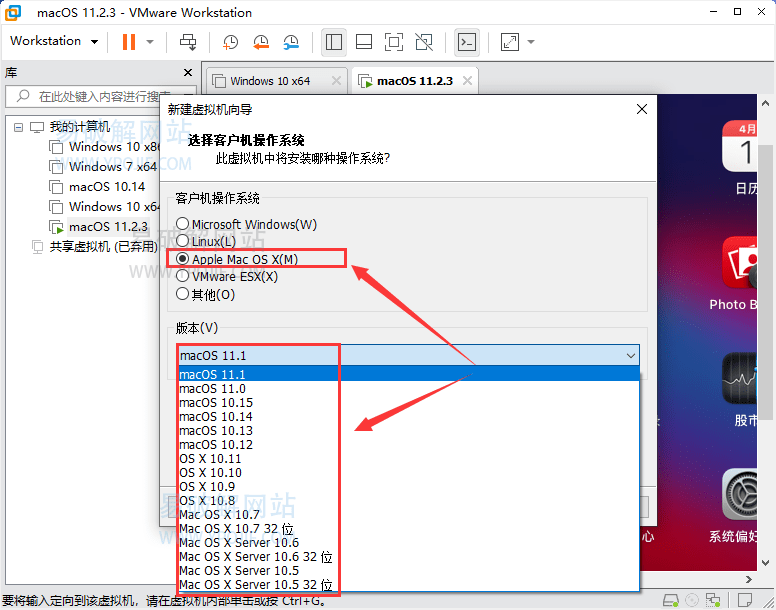

# 虚拟机VMware软件Mac解锁工具

Auto Unlocker v2.0.0 

Auto Unlocker 是一款强大的VMware 虚拟机软件Mac系统解锁工具，由于之前的 [Unlocker](https://www.ypojie.com/738.html) 后续不在更新了，今天有同学在亿破姐网站留言说有了新的VMware 虚拟机软件Mac os系统解锁工具，这不亿破姐马上就来为大家发布更新了吗，Auto Unlocker 有C++语言开发，软件只有不到1M的体积，运行后在线联网下载相关解锁文件，亿破姐的 VM 16 虚拟机就下载了 627M的解锁文件，Auto Unlocker 支持目前所有版本的 VMware 虚拟机Mac系统解锁，并且还支持Windows / Linux 版本。

Auto Unlocker 的使用方法也很简单，没有之前那个解锁工具麻烦，下载后直接运行 Auto Unlocker 软件，它会自动杀死并且终结你所有的 VM 虚拟机的进程，然后再联网下载解锁文件

需要注意的是，如果网络不佳的话，安装解锁文件需要很多时间，首次运行会出现一窜英文 Killing services and backing up files… 翻译过来的意思就是”正在终止服务并正在备份文件…”

所有请耐心等待即可，解锁文件安装完成，软件会自动退出，然后打开VMware Workstation新建虚拟机即可看到Apple Mac的选项。

注意事项

必须使用管理员身份运行，运行后没有MAC选项请查看是不是运行时被杀毒软件拦截导致失败

软件官方开源地址 https://github.com/paolo-projects/auto-unlocker

软件官方开源地址 https://github.com/paolo-projects/auto-unlocker/releases