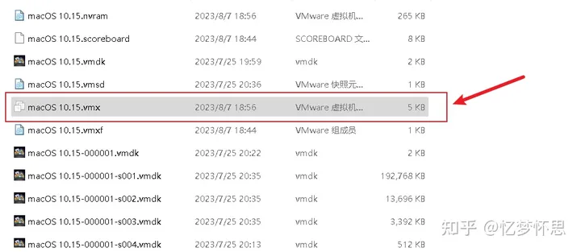
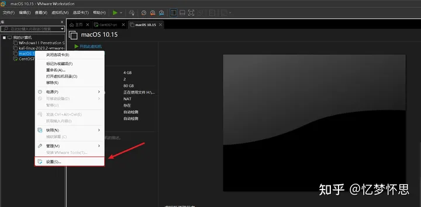
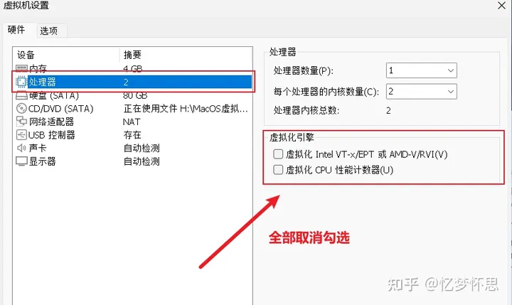
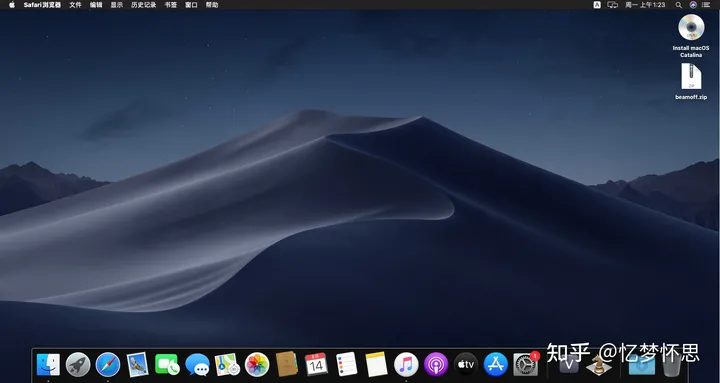

# vmware 装mac虚拟机 提示客户机操作系统已禁用cup 请关闭或重置虚拟机 怎么办 ？

在我们直接导入macOS镜像到VMware，准备打开运行macOS虚拟机时突然抱错，说[客户机](https://www.zhihu.com/search?q=客户机&search_source=Entity&hybrid_search_source=Entity&hybrid_search_extra={"sourceType":"answer"%2C"sourceId":3164035494})操作系统已禁用 CPU，请关闭或重置[虚拟机](https://so.csdn.net/so/search?q=%E8%99%9A%E6%8B%9F%E6%9C%BA&spm=1001.2101.3001.7020)。这一下搞糊涂了，怎么按平常安装步骤来操作，拖入虚拟机镜像后应该就能正常打开并运行虚拟机，到了安装macOS虚拟机这里打开就会报错呢。

但解决这个报错问题也不难，首先打开安装macOS镜像的目录，找到.[vmx](https://www.zhihu.com/search?q=vmx&search_source=Entity&hybrid_search_source=Entity&hybrid_search_extra={"sourceType":"answer"%2C"sourceId":3164035494})后缀名的文件，右键用[记事本](https://www.zhihu.com/search?q=记事本&search_source=Entity&hybrid_search_source=Entity&hybrid_search_extra={"sourceType":"answer"%2C"sourceId":3164035494})打开，一直翻到最下面，添加配置一些内容。



在末尾添加如下内容

```text
smc.version = "0"
cpuid.0.eax = "0000:0000:0000:0000:0000:0000:0000:1011"
cpuid.0.ebx = "0111:0101:0110:1110:0110:0101:0100:0111"
cpuid.0.ecx = "0110:1100:0110:0101:0111:0100:0110:1110"
cpuid.0.edx = "0100:1001:0110:0101:0110:1110:0110:1001"
cpuid.1.eax = "0000:0000:0000:0001:0000:0110:0111:0001"
cpuid.1.ebx = "0000:0010:0000:0001:0000:1000:0000:0000"
cpuid.1.ecx = "1000:0010:1001:1000:0010:0010:0000:0011"
cpuid.1.edx = "0000:0111:1000:1011:1111:1011:1111:1111"
featureCompat.enable = "TRUE"
```

添加完毕后，Ctrl+S保存内容。把 .vmx文件直接拖到VMware里，先不要急着打开虚拟机，右键，选择设置





找到处理器，将右边的[虚拟机引擎](https://www.zhihu.com/search?q=虚拟机引擎&search_source=Entity&hybrid_search_source=Entity&hybrid_search_extra={"sourceType":"answer"%2C"sourceId":3164035494})的两个选项全部取消勾选。完成后点击确定。

这是就能成功打开macOS虚拟机了，不会再出现客户机操作系统已禁用 CPU，请关闭或重置[虚拟机](https://so.csdn.net/so/search?q=%E8%99%9A%E6%8B%9F%E6%9C%BA&spm=1001.2101.3001.7020)这种报错。这里就能看到macOS的加载条，证明能够成功运行macOS，并且开机没有没问题了。


最终的完成效果如下。



谢谢观看，希望能帮助到大家！

