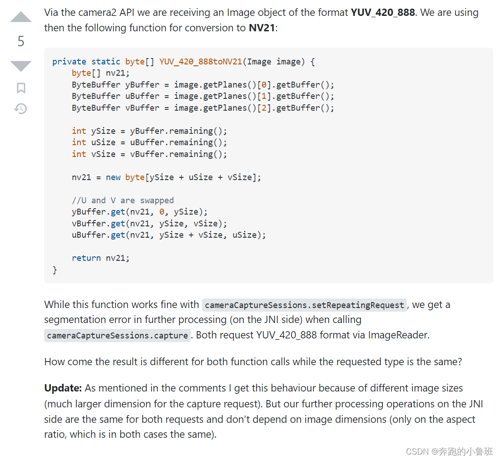
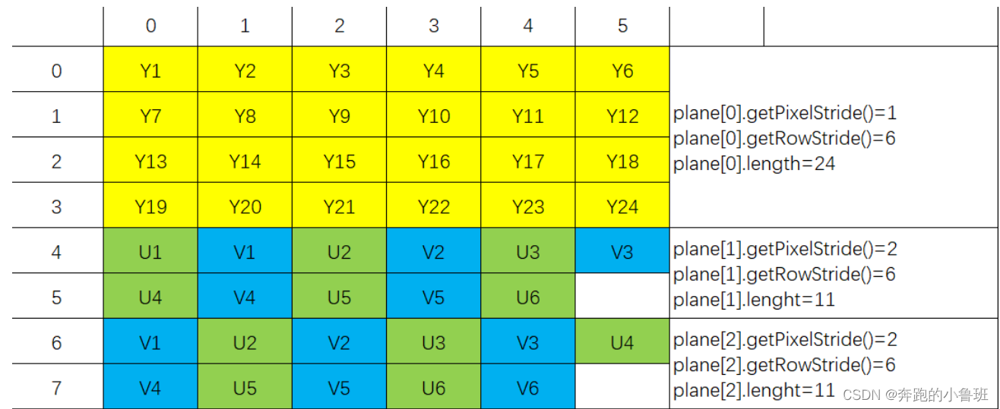
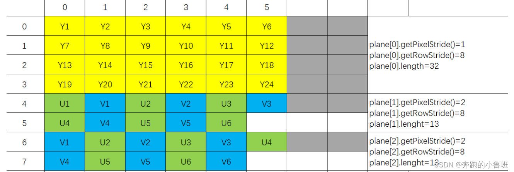
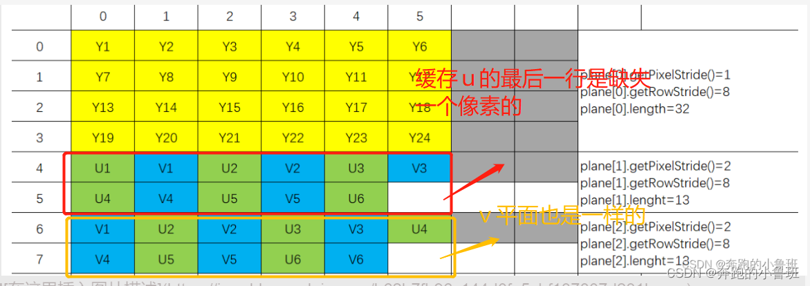

# 【Android Camera2】彻底弄清图像数据YUV420_888转NV21问题/良心教学/避坑必读!


前言
  只要是使用Android Camera2开发相机相关功能的小伙伴，必然会和相机数据打交道吧。本文不讲解相机相关的操作，只是详细地讲解得到相机图像后，如何将图像Image转成NV21/NV12的数据的。
  你可能会说，这个问题很普通了，网上都有现成的代码，拿过来直接用就行了~然而网上的代码大多数（最少我找到的）都是存在一定错误（或者是性能过低）。你是否存在如下问题？
  是否遇到转成的NV21数据转成RGB可用，但是在使用OpenGL绘制图像时得不到正确纹理？转成的NV21数据在Java里可用，在Jni里却挂掉了？
  是否遇到图像数据用的好好的，换一个图像分辨率代码就失效了？
  这些都是我遇到的一些坑了，肯定有小伙伴也遇到了相同的问题，就比如这个老外兄弟（他的提问下采纳的答案其实还是有问题的，本文会在后面讲解）：




  直接说结论：网上的很多YUV_420_888转NV21的代码是错误的~有一些没有考虑图像的padding，导致图像分辨率改变，得到的NV21数据就不适用了。有的代码得到的NV21数据多了w*h/4 字节的数据，导致在一些算法中处理该数据会有越界的问题。因为我做项目的过程中，最开始也是拿来主义，直接在网上copy现成的代码。虽然刚开始没问题，但是程序遇到问题，反过来排查才发现其实得到的NV21数据是不正确的。经过自己修改，得到了一个性能和正确性都没问题的算法。
  为了知道网上的一些代码错在哪里，何时有问题，就要彻底了解NV21以及YUV_420_888图像的格式的原理，然后读懂代码，最后得到最优的正确的代码。本文就按这个思路：首先讲解NV21以及YUV_420_888图像的格式的原理，然后去看网上流传的代码，他们为何不对？最后给出自己的代码。如果只想要正确代码的朋友直接请拖到文末~


## YUV420888图像格式以及NV21图像格式讲解

  为什么要讲解这两个格式呢？因为Android camera2 Api主推的图像格式就是这两种，在调用相机的过程，首先通过函数注册：

```
 mImageReader = ImageReader.newInstance(mPreviewSize.getWidth(), mPreviewSize.getHeight(),
                        ImageFormat.YUV_420_888, 2);
```

  然后在相机的回调函数中就得到了数据类型为YUV420888的Image。Android中对图像数据的处理一般都是用NV21的，所以此时就需要将YUV420888类型的Image转成NV21类型的byte数组了。


### YUV_420_888格式说明

  YUV_420_888这种图像的格式使用3个独立的Buffer表示，这三个Plane分别是代表Y，U，V三个平面，每个平面还有rowStride、pixelStride对应的属性。要读懂代码，必须了解这些属性的含义~

####   (1) pixelStride（通过getPixelStride()获得）

  像素步长，有可能是1、有可能是2。它代表的是行内连续两个颜色值之间的距离(步长)。
  这里还有个重要的点：假如是步长为2，意味索引间隔的原色才是有效的元素，中间间隔的元素其实是没有意义的。而Android中确实也是这么做的，比如某个plane[1]（U分量）的步长是2，那么数组下标0,2,4,6,…的数据就是U分量的，而中间间隔的元素Android会补上V分量，也就是会是UVUVUV…这样去分布。但是当最后一个U分量出现后，最后一个没有意义的元素Android就不补了，也就是最后的V分量就不会补了，即是这样分布：UVUVUV…UVUVU。

####   (2) rowStride（通过getRowStride()获得）

  存储这个图像时，每行数据的宽度。这个和图像的宽不是一回事。由于系统的硬件等各方面的原因，存储数据的时候可能需要对齐，比如图像的宽为98字节，但是实际存储的过程中一行图像数据可能用了100字节。那么此时image.rowStride=100,而image.getWidth=98。我们并不能断定图像的宽一定等于rowStride!有些算法就是基于这个前提去处理，所以导致某些分辨率的图像转成NV21数组就不正确了，这个我们后文会有讲解。

  YUV_420_888的存储又分YUV420分为Planar格式（P）和Semi-Planar格式（SP）两大类，最主要的区别是：
  Planar格式（P）按平面分开放，先把U存放完后，再存放V。U是连续的，V也是连续的
即：YYYYYUUUUUVVVV
  Semi-Planar格式（SP）只有Y数据一个平面，UV数据合用一个平面。
即：YYYYYUVUVUV…
  注意这一点，在使用Android Api以下函数时，得到的平面式SP格式的：

```
 mImageReader = ImageReader.newInstance(mPreviewSize.getWidth(), mPreviewSize.getHeight(),
                        ImageFormat.YUV_420_888, 2);
```

  对于SP格式，得到的图像有两种典型类型：rowStride = Width的，（以6*4的图像进行说明）即：



  另一种是rowStride != Width的，即：



  图片来自另一个博主，链接在后面，大家可以过去看一下哦，他写的很好~


### NV21图像数组

  我们现在了解了YUV_420_888图像的格式，现在我们要将它转换成NV21的byte数组。NV21的数组有什么特点呢，简单的说就是一个byte数组，先依次保存图像所有像素点的Y值，再交替保存V值和U值。以64的图像进行说明，NV21图像由64个Y值，6个V值和6个U值，一共有36个值。（不要以为看图像以为数组有48个值，上图表示的是Y，U，V三个平面是如何存放的，其中U平面和V平面是数据有重复，当我们提取数组时，是要去掉重复的数据部分的）。严格的NV21图像数据的长度为图像的 (长×宽×3/2),所以如果你的算法得出的数组长度都不满足，那这个数据一定是不正确的（有时候可能把不正确的数据拿去处理效果还是正确的，那是因为算法可能没有使用到你给到的冗余数据，但是在其它算法中，这个数组可能会导致程序异常）！
  所以我们目标很明确了对吧，要将Image通过上述的api，提取处它的y,u,v分量，然后把他们按照nv21的格式组成数组就可以了！（小伙伴们可以自己在网上了解一下NV21以及YV420数据的格式的更具体的讲解，这里就不赘述了~）


### 代码分析

  下面开始代码分析，列举网上你最容易搜到的yuv420转NV21的代码，告诉你它们为什么不正确。
  首先是这一段代码，来自YUV_420_888toNV21代码一，这个代码很多地方都能搜到。

错误代码一

```
private static byte[] YUV_420_888toNV21(Image image) {
    byte[] nv21;
    ByteBuffer yBuffer = image.getPlanes()[0].getBuffer();
    ByteBuffer uBuffer = image.getPlanes()[1].getBuffer();
    ByteBuffer vBuffer = image.getPlanes()[2].getBuffer();

    int ySize = yBuffer.remaining();
    int uSize = uBuffer.remaining();
    int vSize = vBuffer.remaining();

    //错误点一，nv21数组大小不对。
    nv21 = new byte[ySize + uSize + vSize];

    //错误点二，没有考虑padding的情况。
    yBuffer.get(nv21, 0, ySize);
    vBuffer.get(nv21, ySize, vSize);
    uBuffer.get(nv21, ySize + vSize, uSize);

    return nv21;
}
```

  首先说错误点一：nv21数组的大小不对。首先nv21图像数组的长度一定是长×宽×3/2，其中y数据的大小是长×宽（因为每个像素都有一个y值），接着所有像素的u,v值总共有(长×宽×1/2)个。我们通过image.getPlanes()[1].getBuffer()得到的Plane就是一个包含像素所有u,v值的缓存区域，它的大小就是长×宽×1/2，明白了吗？所以nv21的数据大小其实就是ySize + uSize,当然也可以是ySize+vSize。这里数据大小不对。代码中uBuffer.get(nv21, ySize + vSize, uSize)是多余的。vBuffer已经代表是像素中所有像素按照v,u,v,u,排序的结果了，我们直接将它放在y数据后边就是nv21的数据了。所以这一步多余且导致数组大小多了长×宽×1/2个值。
  错误点二，在图像没有padding的情况下，我们只用通过这两步就ok可以得到结果，但是如果数据有padding呢？这样的话数据不但多了长×宽×1/2的数据，还多了padding的数据？大家能明白吗？这个yBuffer，vBuffer和uBuffer是一组可能包含了padding的数据，我们要根据去判断rowStride是否等于Width来处理，如果等于，那么没问题；如果不等于，那么你要去除掉padding,得到真正的buffer，再进行处理。

```
    yBuffer.get(nv21, 0, ySize);
    vBuffer.get(nv21, ySize, vSize);
```


### 正确的伪代码

```
private static byte[] YUV_420_888toNV21_fix(Image image) {
    byte[] nv21;
    ByteBuffer yBuffer = yBufferWithoutPadding(image.getPlanes()[0].getBuffer());
    ByteBuffer vBuffer = uBufferWithoutPadding(image.getPlanes()[2].getBuffer());

    int ySize = yBuffer.remaining();
    int vSize = uBuffer.remaining();
    nv21 = new byte[ySize + vSize];
   
    yBuffer.get(nv21, 0, ySize);
    vBuffer.get(nv21, ySize, vSize);
    return nv21;
}
```

  所以如果是得到NV21的数据，我们不需要使用u平面（image.getPlanes()[1]），因为v平面就是包含了图像所有像素vuvuvu的一组buffer。此外，我们需要得到真正的，去掉padding的buffer。

  这段代码分析完了，其实已经有老哥遇到相同的问题，他就是使用这段代码，随后在某些地方遇到了问题，然后发帖求助了：使用以上代码会遇到的问题
  在这个帖子中，歪果小哥哥也很热心地帮他分析了，并给上了自己代码，我在这里贴出来！通过这个代码是可以得到正确的NV21的数组的。然而里面依然存在逻辑错误，并且它是逐像素处理的，对于一个1280*720的图像，在我的手机上尝试的，一帧图像的处理时间直接从2ms上升至14ms，这显然无法接受。下面贴一下他的代码。

错误代码二

```
private static byte[] YUV_420_888toNV21(Image image) {

    int width = image.getWidth();
    int height = image.getHeight(); 
    int ySize = width*height;
    int uvSize = width*height/4;

    byte[] nv21 = new byte[ySize + uvSize*2];

    ByteBuffer yBuffer = image.getPlanes()[0].getBuffer(); // Y
    ByteBuffer uBuffer = image.getPlanes()[1].getBuffer(); // U
    ByteBuffer vBuffer = image.getPlanes()[2].getBuffer(); // V

    int rowStride = image.getPlanes()[0].getRowStride();
    assert(image.getPlanes()[0].getPixelStride() == 1);

    int pos = 0;

	//part1: 判断了是否存在padding，然后相应地处理
    if (rowStride == width) { 
        yBuffer.get(nv21, 0, ySize);
        pos += ySize;
    }
    else {
        long yBufferPos = -rowStride;  
        for (; pos<ySize; pos+=width) {
            yBufferPos += rowStride;
            yBuffer.position(yBufferPos);
            yBuffer.get(nv21, pos, width);
        }
    }

    rowStride = image.getPlanes()[2].getRowStride();
    int pixelStride = image.getPlanes()[2].getPixelStride();

    assert(rowStride == image.getPlanes()[1].getRowStride());
    assert(pixelStride == image.getPlanes()[1].getPixelStride());
    
    //part2:判断是否有padding，对uv分量做处理。
    if (pixelStride == 2 && rowStride == width && uBuffer.get(0) == vBuffer.get(1)) {
        byte savePixel = vBuffer.get(1);
        try {
        //part2.1 判断uv两个buffer是否重叠，如果是重叠，就直接赋值：
            vBuffer.put(1, (byte)~savePixel);
            if (uBuffer.get(0) == (byte)~savePixel) {
                vBuffer.put(1, savePixel);
                vBuffer.position(0);
                uBuffer.position(0);
                 //part2.3 认为uv重叠，直接从缓存区赋值
                vBuffer.get(nv21, ySize, 1);
                uBuffer.get(nv21, ySize + 1, uBuffer.remaining());
                return nv21; 
            }
        }
        catch (ReadOnlyBufferException ex) {
        }
        vBuffer.put(1, savePixel);
    }

    //part2.3 判断uv两个buffer是否重叠，如果不重叠，就逐像素处理
    for (int row=0; row<height/2; row++) {
        for (int col=0; col<width/2; col++) {
            int vuPos = col*pixelStride + row*rowStride;
            nv21[pos++] = vBuffer.get(vuPos);
            nv21[pos++] = uBuffer.get(vuPos);
        }
    }

    return nv21;
}
```

  首先呢，闻到了什么code smell了吗？学习我这篇代码重构–代码臃肿的小伙伴，一看到这个代码就皱眉头吧，就很难读懂。代码中使用了过多的参数，有着基本类型偏执的问题。建议使用提炼函数法和以查询代替临时变量法减少一下参数和方法。（忍不住讲了一下代码重构，因为这样的代码看着确实不爽，有兴趣学习代码重构的小伙伴可以看我的代码重构系列教程）
  其实这个代码无非就是要判断存在padding，如果不等于，说明有padding,接着去除padding,再给nv21数组赋值接好了对吧。让我们一起看一下这一段代码的问题所在~

  首先看代码part1部分，如果所说，要先判断是否存在padding，然后做相应处理，它这里确实是判断了，如果存在了padding，就去除padding后把y分量的值赋给nv21数组。这里虽然啰嗦，单代码逻辑正确~
  首先看代码part2部分略微复杂。根据Android官方文档，其实u,v两个buffer中的数据就是uv数据交替的，我们在上面已经讲过了。但是这个博主显然忽略了这一点，它去判断u,v分量的缓存区是否重叠。也就是他在判断u[0]和v[1],v[0]和u[1]是不是同一块内存，他认为如果是同一块内存才说明uv交替，然后就可以直接赋值，否则他就逐像素区取u,v的值。
  然而实际情况是，u[0]和v[1]并不是同一块内存，但是他们的值是相同的，所以我们是没必要逐像素去做的。根据这个代码的逻辑，他的判断结果总是为false,所以他总是逐像素去做了。当然是可以得到正确的结果的，但是处理时间直接巨幅增加。
  再注意par2.3部分，虽然根据以上分析，他总是逐像素处理了，这里不会运行到，但是假设它运行到这里，他的处理逻辑也有问题？你有发现吗？他没有考虑padding的情况。对于y分量他都考虑了，对于uv分量他又忘记考虑了，如果是代码运行到这里，并且图像存在padding，程序会直接crash。


### 真正的核心部分啦~

  核心部分，就根据我上面的伪代码，给一个我最后的实现吧。

```java
  //Planar格式（P）的处理
  private static ByteBuffer getuvBufferWithoutPaddingP(ByteBuffer uBuffer,ByteBuffer vBuffer, int width, int height, int rowStride, int pixelStride){
        int pos = 0;
        byte []byteArray = new byte[height*width/2];
        for (int row=0; row<height/2; row++) {
            for (int col=0; col<width/2; col++) {
                int vuPos = col*pixelStride + row*rowStride;
                byteArray[pos++] = vBuffer.get(vuPos);
                byteArray[pos++] = uBuffer.get(vuPos);
            }
        }
        ByteBuffer bufferWithoutPaddings=ByteBuffer.allocate(byteArray.length);
        // 数组放到buffer中
        bufferWithoutPaddings.put(byteArray);
        //重置 limit 和postion 值否则 buffer 读取数据不对
        bufferWithoutPaddings.flip();
        return bufferWithoutPaddings;
    }
   //Semi-Planar格式（SP）的处理和y通道的数据
 private static ByteBuffer getBufferWithoutPadding(ByteBuffer buffer, int width, int rowStride, int times,boolean isVbuffer){
        if(width == rowStride) return buffer;  //没有buffer,不用处理。
        int bufferPos = buffer.position();
        int cap = buffer.capacity();
        byte []byteArray = new byte[times*width];
        int pos = 0;
        //对于y平面，要逐行赋值的次数就是height次。对于uv交替的平面，赋值的次数是height/2次
        for (int i=0;i<times;i++) {
            buffer.position(bufferPos);
            //part 1.1 对于u,v通道,会缺失最后一个像u值或者v值，因此需要特殊处理，否则会crash
            if(isVbuffer && i==times-1){
                width = width -1;
            }
            buffer.get(byteArray, pos, width);
            bufferPos+= rowStride;
            pos = pos+width;
        }

        //nv21数组转成buffer并返回
        ByteBuffer bufferWithoutPaddings=ByteBuffer.allocate(byteArray.length);
        // 数组放到buffer中
        bufferWithoutPaddings.put(byteArray);
        //重置 limit 和postion 值否则 buffer 读取数据不对
        bufferWithoutPaddings.flip();
        return bufferWithoutPaddings;
    }

    private static byte[] YUV_420_888toNV21(Image image) {
        int width =  image.getWidth();
        int height = image.getHeight();
        ByteBuffer yBuffer = getBufferWithoutPadding(image.getPlanes()[0].getBuffer(), image.getWidth(), image.getPlanes()[0].getRowStride(),image.getHeight(),false);
        ByteBuffer vBuffer;
        //part1 获得真正的消除padding的ybuffer和ubuffer。需要对P格式和SP格式做不同的处理。如果是P格式的话只能逐像素去做，性能会降低。
       if(image.getPlanes()[2].getPixelStride()==1){ //如果为true，说明是P格式。
            vBuffer = getuvBufferWithoutPaddingP(image.getPlanes()[1].getBuffer(), image.getPlanes()[2].getBuffer(),
                                                 width,height,image.getPlanes()[1].getRowStride(),image.getPlanes()[1].getPixelStride());
        }else{
            vBuffer = getBufferWithoutPadding(image.getPlanes()[2].getBuffer(), image.getWidth(), image.getPlanes()[2].getRowStride(),image.getHeight()/2,true);
        }

        //part2 将y数据和uv的交替数据（除去最后一个v值）赋值给nv21
        int ySize = yBuffer.remaining();
        int vSize = vBuffer.remaining();
        byte[] nv21;
        int byteSize = width*height*3/2;
        nv21 = new byte[byteSize];
        yBuffer.get(nv21, 0, ySize);
        vBuffer.get(nv21, ySize, vSize);

        //part3 最后一个像素值的u值是缺失的，因此需要从u平面取一下。
        ByteBuffer uPlane = image.getPlanes()[1].getBuffer();
        byte lastValue = uPlane.get(uPlane.capacity() - 1);
        nv21[byteSize - 1] = lastValue;
        return nv21;
    }
```


  首先函数的主体是YUV_420_888toNV21,其实主要就是包含三个部分，代码中的注释已经给出了：
  part 1： 获得真正的消除padding的ybuffer和ubuffer。
  part 2： 将y数据和uv的交替数据（除去最后一个v值）赋值给nv21。
  part 3： 最后一个像素值的u值是缺失的，因此需要从u平面取一下。
  part 1部分的part1.1部分解释一下， 是因为我们逐行取出带有padding的缓存图像的时候，对于ubffer和vbuffer的最后一行，它是缺失掉一个像素点的。我上文也提到了：**“但是当最后一个U分量出现后，最后一个没有意义的元素Android就不补了，也就是最后的V分量就不会补了”**从我上面给的图中也能看出：



  所以在part1.1赋值的地方，对于vbuffer的最后一行赋值的width要减1，否则是会数组越界的。

  part2部分没什么要说的。

  part3和part1.1部分呼应，因为我们对于vbuffer的最后一行赋值的时候是缺失一个点的，所以我们这里要从ubuffer取出这个点，然后补充进去。当然你不补也没关系，默认是0。对于一个图像，这一个点显得微不足道。

  如我的代码重构教程所说，好的代码必须配合测试用例。我这里的测试用例就是获取到的相机支持的分辨率列表，大概有17个。经过本人测试，都可以通过这一段代码得到正确的nv21数据。另外，我这一段代码中我认为还是有很多基本数据类型，犯了基本数据类型偏执错误的，是可以进行重构的。日后我回来重构一下~

结束语
  其实YUV420_888转NV21看似简单，但是实际需要处理一些边界情况。网上的代码参差不齐，有的只是“看似”正确，实际可能会出各种问题。我写这个文章首先是帮大家避免一下坑吧，毕竟有可能自己在网上找到了这个代码，却不知道代码存在问题。另一个目的也就是希望大家能够自己理解这两种数据格式，读懂代码，这样才能在遇到问题和变化的时候从容应对。
————————————————
版权声明：本文为CSDN博主「奔跑的鲁班七号」的原创文章，遵循CC 4.0 BY-SA版权协议，转载请附上原文出处链接及本声明。
原文链接：https://blog.csdn.net/weixin_41937380/article/details/127758173