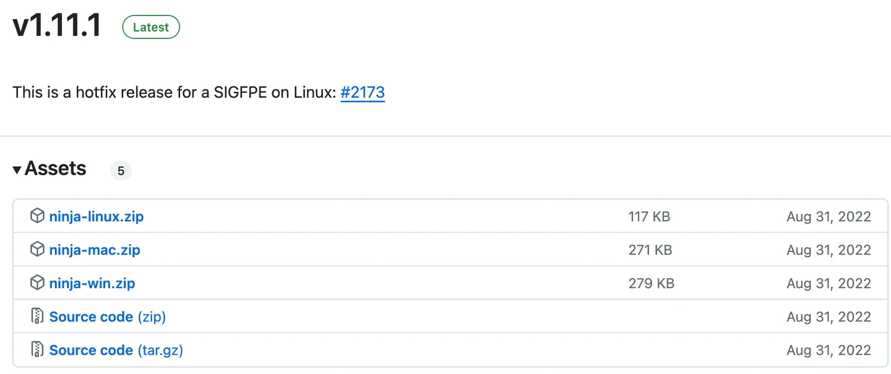
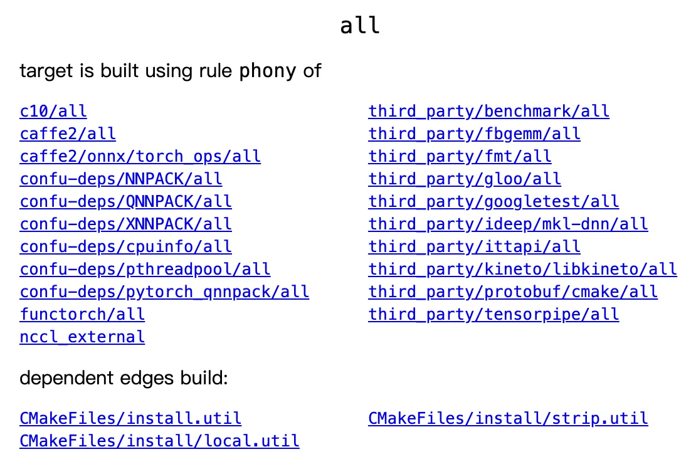

# 一文读懂ninja构建系统

很多大型项目（例如PyTorch）都采用了ninja作为构建系统的一部分，为了阅读并了解这些大型项目，有必要对ninja有初步理解。

## **ninja简单介绍**

**[ninja](https://link.zhihu.com/?target=https%3A//ninja-build.org/)**是一种构建工具，用来调用各种工具（代码生成器、编译器、链接器等）来编译大型项目。与`cmake`/`make`等工具不同，`ninja`在设计之初就**不是给人写的**，只是用于作为其它程序生成的目标。

`ninja`的设计哲学就是**避免任何模糊的内容**。比如makefile里面可能经常会用`dir/*.cpp`来表示源文件，但是这需要查询文件系统才能得到具体内容，是一个很慢而且很不确定的操作。`ninja`把这些模糊的操作都交给元构建系统（meta-build system，例如`cmake`），只留下真正需要编译的命令。

因此，本质上我们可以认为`ninja`就是一条一条地列出了具体要执行的命令，然后执行即可。

`ninja`会分析这一系列命令之间的依赖关系，并根据这个依赖关系实现两个重要特点：

- 并行编译：没有依赖的命令可以并行执行。`ninja`默认使用的并行数为CPU数量，一般不用手动设置并行数，除非想限制`ninja`使用的CPU数量（例如有其他任务在运行，只让`ninja`用一半CPU）。
- 增量编译：根据文件的时间戳进行分析，如果某个文件的时间戳发生了改变，则依赖于这个文件的命令以及其他依赖于这个命令的命令都会被重新执行，以此达到增量编译的效果（比如修改了一个文件之后重新编译）。

## **ninja 安装方式**

`ninja`是一个工具，而且体量很小。各个系统都有相关的安装方法，具体可参见**[文档](https://link.zhihu.com/?target=https%3A//github.com/ninja-build/ninja/wiki/Pre-built-Ninja-packages)**。总的来说，有三种安装方式：

- 系统级安装：例如Ubuntu上面的`apt-get install ninja-build`、MacOS上面的`brew install ninja`，安装后`ninja`就是一个系统命令，类似`ls/cat`等命令。
- 用户级安装：例如通过`pip`或者`conda`都可以安装`ninja`: `conda install ninja` / `pip install ninja`
- 自定义安装：在**[GitHub下载页面](https://link.zhihu.com/?target=https%3A//github.com/ninja-build/ninja/releases)**下载安装包并解压即可，或者下载源码自己编译。

`ninja`是个非常小的工具，从下面的下载页面可以看出，整个工具的压缩包也就一两百KB级别。



其实官方只通过GitHub来发布新版本，其它的安装方式都是社区自己搞的。比如`pip install ninja`，安装的是`scikit-build`社区维护的 [https://github.com/scikit-build/ninja-python-distributions](https://link.zhihu.com/?target=https%3A//github.com/scikit-build/ninja-python-distributions) ，他们把`ninja`包装成了一个`pip`包。很多人不知道他们下载的不是官方ninja，这个GitHub项目**才46个star，但是有二百五十万次下载**。`conda install ninja`也是一个类似的东西。

总之，**如果需要保证安全，可以通过`ninja`的GitHub release页面下载；如果图方便，可以用各种社区维护的安装方式**。


## **理解ninja文件**

`ninja`的构建配置文件一般叫`build.ninja`。虽然我们一般不写它，但是需要大致看懂它，以便调试或者理解构建过程。

下面以一个简单的例子来说明常见的`ninja`配置：

有两个头文件`a1.h`和`a2.h`，分别定义了一个变量`a`，但是有不同的值：

```text
// a1.h
int a = 1;

// a2.h
int a = 2;
```

一份源文件`a.cpp`里根据宏的不同来包含这两个文件中的某一个：

```text
// a.cpp
#include<iostream>

using namespace ::std;

#ifdef USE_A1
#include "a1.h"
#endif

#ifdef USE_A2
#include "a2.h"
#endif

int main()
{
    cout << "hello, world from " << a << "!\n";
}
```

一份`build.ninja`文件包含`ninja`的构建配置（**注意最后的换行，是必要的**）：

```text
# build.ninja
cxxflags = -DUSE_A1

rule compile
    description = compile with $cxxflags
    command = g++ -MM -MF $out.d -MT $out $cxxflags $in && g++ $cxxflags $in -o $out
    depfile = $out.d

build compile_with_default_cxxflags: compile a.cpp

build compile_with_shadow_cxxflags: compile a.cpp
    cxxflags = -DUSE_A2

default compile_with_default_cxxflags
```

这份配置里包含了以下常见内容：

- 注释（comment），`build.ninja`里用`#`开头的行表示注释，这个没什么好解释的。
- 变量（variable），`cxxflags = -DUSE_A1`定义了一个变量`cxxflags`，其值为`-DUSE_A1`。这个变量的值在后面的代码中都可以用，引用方式为`$cxxflags`。具体来说，`-DUSE_A1`就是在编译之前定义名为`USE_A1`的宏。
- 规则（rule），语法为`rule `加上规则的名字。这里我们定义了一个名为`compile`的规则。规则内有默认变量`$in`和`$out`，`$in`表示输入文件的列表，`$out`表示输出文件名。
- 规则的文字描述（description），用于在编译过程中展示并告诉用户目前在干什么。
- 规则的具体命令（command），写明具体的编译命令。
- 规则的依赖项记录文件（depfile），用于增量编译，详见后面的解释。
- 构建（build），语法为`build`加上构建的文件名，加上冒号`:`以及规则名、输入文件列表。本质上`build $out: $rule $in`就是把`$in`和`$out`传给`$rule`，然后运行它的`command`命令。
- 构建里的局部变量，在`build`下面的任意变量，在本次构建命令中覆盖全局的变量。具体来说，`build compile_with_shadow_cxxflags`里定义的`cxxflags`会覆盖本次`compile`命令用到的`cxxflags`。
- 默认构建目标（default）。可以存在多行`default`，最后的默认构建目标就是它们的并集。如果没有任何`default`，则默认构建全部的`build`条目。

有了这份`build.ninja`，我们可以通过`ninja`或者`ninja compile_with_default_cxxflags`来构建默认的代码，得到可执行文件`compile_with_default_cxxflags`（执行后输出`hello, world from 1!`）；也可以通过`ninja compile_with_shadow_cxxflags`得到可执行文件`compile_with_shadow_cxxflags`（执行后输出`hello, world from 2!`）。我们也可以修改`a1.h`或者`a2.h`，观察`ninja`是否会重新编译。

## **理解`ninja`的增量编译**

这份`build.ninja`里的大部分内容简单易懂，唯一难以理解的就是用于增量编译的`depfile = $out.d`。

首先，`$out`是`ninja`的默认变量，表示构建的目标文件名。所以`$out.d`就是目标文件名加上`.d`。比如`build compile_with_default_cxxflags`里，`depfile`就是`compile_with_default_cxxflags.d`。

然后我们需要理解增量构建的目标：我们的`build compile_with_default_cxxflags`构建条目中，只传入了`a.cpp`这一个文件，但是实际上我们的代码里面包含了`a1.h`或者`a2.h`。如何能够让`ninja`知道增量构建的时候需要检查`a1.h`或者`a2.h`呢？这就需要编译器的支持了：`g++`的`-MM -MF $out.d`参数会将文件与头文件的依赖关系输出到`$out.d`中，下次`ninja`就会通过这个文件的内容来判断具体需要检查发生改变的文件。

例如，`compile_with_default_cxxflags.d`文件里，就有以下内容：

```text
compile_with_default_cxxflags: a.cpp a1.h
```

下次`ninja`再`build compile_with_default_cxxflags`的时候，就会检查这个文件，然后查看`a.cpp`与`a1.h`的修改时间，如果任何一个文件被修改了，就重新编译。另外，如果`compile_with_default_cxxflags`文件不在了，`ninja`也会重新编译（这个很好理解）。

## **`ninja`进阶用法**

很多`ninja.build`里存在`phony`规则。这是一个内置规则，意思是“假冒的”，就是一个不存在规则的规则。我们可以理解为：

```text
rule phony
    command = : $in $out
```

其中冒号`:`是unix系统里的一个命令，不管参数是什么，永远正常退出。因此，`phony`规则不会做什么，但是**会在输入和输出之间建立依赖关系**。

不带参数的`ninja`命令会构建文件里的`default`构建目标。我们也可以用`ninja compile_with_shadow_cxxflags`来手动构建某个目标。

构建多个目标（比如PyTorch有上千个目标）的时候，`ninja`会展示一个进度条，进度条展现的内容就是`rule`下面的`description`字段的内容。

`ninja`的高级用法一般都在`ninja -t`下面，例如`ninja -t clean`可以清理全部生成文件、`ninja -t browse`可以打开一个网页浏览器查看文件之间的依赖图（默认查看的是名为`all`的依赖图）：



通过这个浏览器界面，我们可以很方便地查看什么文件依赖于什么文件。打开`http://localhost:8000/?libtorch.so`就可以看到完整的`libtorch.so`对应的依赖，再也不用对着`CMakeLists.txt`瞎猜了。（还可以通过`ninja -t graph`直接导出依赖图的dot graph文件，但是大型项目的依赖图一般都非常复杂，看起来不方便。）

最后，`ninja -t targets all`得到的是全部的构建目标，可以用于`grep`搜索想要的内容；`ninja -C /path/to/dir -f /path/to/file`可以让`ninja`切换到`/path/to/dir`去执行命令、并读取`/path/to/file`配置文件来执行。`-f`的默认参数是`build.ninja`，`-C`的默认参数为`.`，也就是当前路径。一般来说`-f`参数用得很少，`-C`参数用得比较多。

## **总结**

本文简单介绍了`ninja`的一些原理及用法。虽然简单，但依然起了个“一文读懂ninja构建系统”的标题，就是因为`ninja`真的很小，它的**[全部文档](https://link.zhihu.com/?target=https%3A//ninja-build.org/manual.html)**差不多也就这些值得我们关心的内容。

发布于 2024-01-08 21:23・IP 属地北京