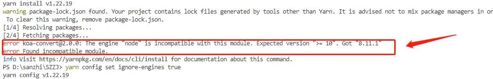

# The engine “node“ is incompatible with this module. Expected version问题解决

好不容易配好[yarn](https://links.jianshu.com/go?to=https://so.csdn.net/so/search?q=yarn&spm=1001.2101.3001.7020)后，运行yarn install后报错：




 解决方案（2个）

[方案1：卸载](https://www.jianshu.com/p/4a738fbbb86a)[node](https://links.jianshu.com/go?to=https://so.csdn.net/so/search?q=node&spm=1001.2101.3001.7020)重装指定版本范围的

自行百度nodejs官网安装相应版本

方案2：忽略错误后重新

```bash
yarn install
```

执行

```bash
yarn config set ignore-engines true
```


为了省事，我采用的是方案2