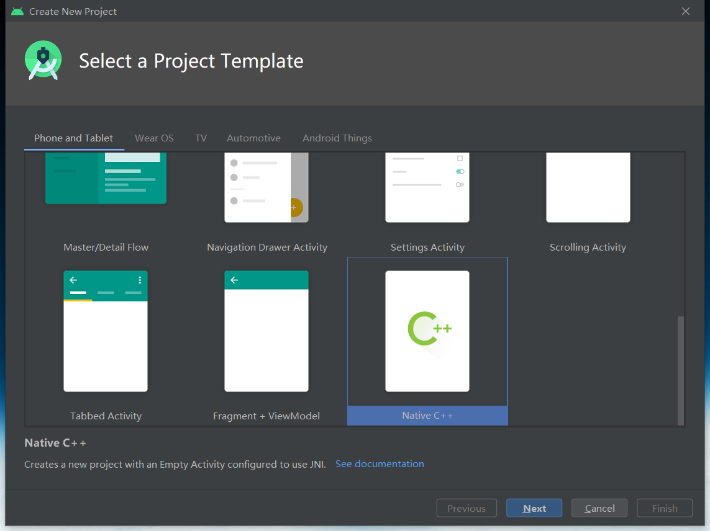
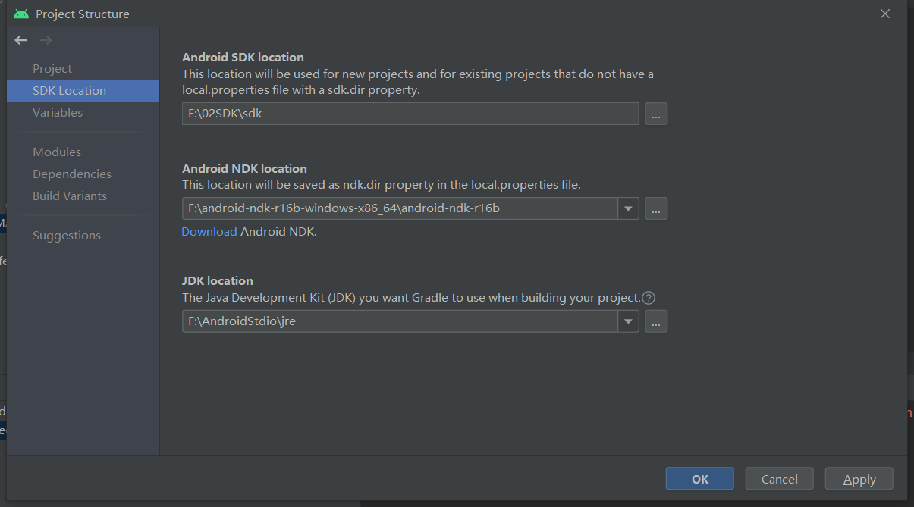
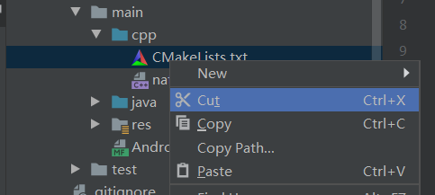
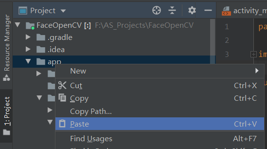
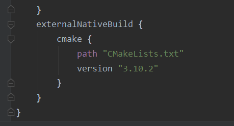
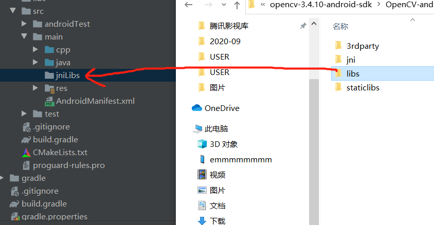
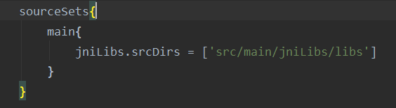
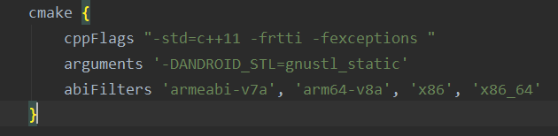
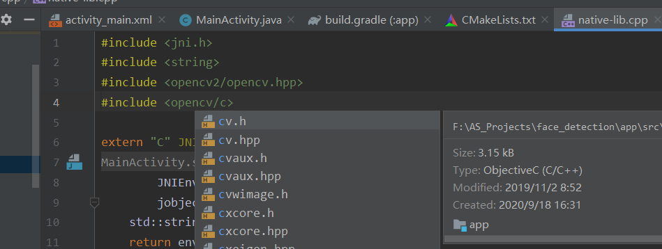

## ANDROIDSTDIO在C++中配置OPENCV（搭建OPENCV环境）

标签： [AndroidStdio](https://www.freesion.com/tag/AndroidStdio/) [OpenCV](https://www.freesion.com/tag/OpenCV/) [c++](https://www.freesion.com/tag/c%2B%2B/) [java](https://www.freesion.com/tag/java/) [android](https://www.freesion.com/tag/android/) [opencv](https://www.freesion.com/tag/opencv/)

# 前言

本人是大一新生小白，算是自学了三个月的Androidstdio，走了不少弯路，现在整理了一些资料，分享出来，只是初略口语化介绍操作，非专业语言，如有错误，还请各位大佬指出，emmmm有什么大家可以一起交流呀，QQ是750198189。在上一章分享了[如何在java中配置OpenCV](https://blog.csdn.net/havit777/article/details/108637222)，接下来为大家介绍如何在c++中配置OpenCV。

搭建环境：
Androidstdio4.0
cmake3.1.0（这个缺少的话在androidstdio里会提醒下载，不用特意去官网下载）
NDK（我用的是16，这个可以自行去官网下载）

# 1.1、首先创建一个新的项目




# 2.1、在PROJECT STRUCTURE中导入NDK



# 3.1、修改CMAKE的位置

这个是我认为非常关键的一步，对于我这种读不懂cmake的小白，之前一直照搬大佬们cmake里的代码，旧版本的Android的cmake都是在app的目录下面的，新版本的是在cpp目录下，所以导致后面路径的错误。


接着在app中修改cmake的位置


# 3.2、然后导入OPENCV的库和头文件（把文件夹里的INCLUDE和LIB复制进去就好）



在build.gradle（app）中也增加libs的资源，还有适应的架构

把代码build.gradle(app)的代码也贴上

```java
apply plugin: 'com.android.application'

android {
    compileSdkVersion 30
    buildToolsVersion "30.0.2"

    defaultConfig {
        applicationId "com.widget.face_detection"
        minSdkVersion 14
        targetSdkVersion 30
        versionCode 1
        versionName "1.0"

        testInstrumentationRunner "androidx.test.runner.AndroidJUnitRunner"
        externalNativeBuild {
            cmake {
                cppFlags "-std=c++11 -frtti -fexceptions "
                arguments '-DANDROID_STL=gnustl_static'
                abiFilters 'armeabi-v7a', 'arm64-v8a', 'x86', 'x86_64'
            }
        }
    }

    buildTypes {
        release {
            minifyEnabled false
            proguardFiles getDefaultProguardFile('proguard-android-optimize.txt'), 'proguard-rules.pro'
        }
    }
    externalNativeBuild {
        cmake {
            path "CMakeLists.txt"
            version "3.10.2"
        }
    }
    sourceSets{
        main{
            jniLibs.srcDirs = ['src/main/jniLibs/libs']
        }
    }
}
1234567891011121314151617181920212223242526272829303132333435363738394041
```

# 4.1、最后贴上CMAKE的代码

```cpp
# For more information about using CMake with Android Studio, read the
# documentation: https://d.android.com/studio/projects/add-native-code.html

# Sets the minimum version of CMake required to build the native library.

cmake_minimum_required(VERSION 3.4.1)#cmake的最低版本需求是VERSION（版本） 3.4.1

# Creates and names a library, sets it as either STATIC（静态）
# or SHARED（动态）, and provides the relative paths to its source code.
# You can define multiple libraries, and CMake builds them for you.
# Gradle automatically packages shared libraries with your APK.
# 添加opencv的头文件目录
add_library( # Sets the name of the library.
        native-lib

        # Sets the library as a shared library.
        SHARED

        # Provides a relative path to your source file(s).
        src/main/cpp/native-lib.cpp)

include_directories(${CMAKE_SOURCE_DIR}/src/main/cpp/include)#加入opencv的头文件，include_directories包含目录，${CMAKE_SOURCE_DIR}cmake的根路径，

# 导入opencv的so
#加入OpenCV库的
add_library(libopencv_java3
        SHARED
        IMPORTED)
#IMPORTED入口
#set_target_properties设立目标的属性,
set_target_properties(libopencv_java3
        PROPERTIES#属性
        IMPORTED_LOCATION ${CMAKE_SOURCE_DIR}/src/main/jniLibs/libs/${ANDROID_ABI}/libopencv_java3.so)
#${ANDROID_ABI}适应各种不同的架构
# Searches for a specified prebuilt library and stores the path as a
# variable. Because CMake includes system libraries in the search path by
# default, you only need to specify the name of the public NDK library
# you want to add. CMake verifies that the library exists before
# completing its build.#搜索指定的预构建库，并将路径存储为#变量。
#因为cMake在搜索路径中默认包含系统库，所以你只需要指定你想要添加的公共NDK库的名称。

find_library( # Sets the name of the path variable.
        log-lib

        # Specifies the name of the NDK library that
        # you want CMake to locate.
        log )

# Specifies libraries CMake should link to your target library. You
# can link multiple libraries, such as libraries you define in this
# build script, prebuilt third-party libraries, or system libraries.
#指定cMake应该链接到目标库的库。您可以链接多个库，例如在这个# build脚本中定义的库、预构建的第三方库或系统库。
#目标链接库
target_link_libraries( # Specifies the target library.指定链接库
        native-lib
        libopencv_java3
        # Links the target library to the log library
        # included in the NDK.
        ${log-lib} )
1234567891011121314151617181920212223242526272829303132333435363738394041424344454647484950515253545556575859
```

# 5.0、验证一下，OK



# 总结

本文只能提供如何操作在c++中搭建OpenCV，对其中的知识却没有过多提及，还请广大网友自行百度，下一章是在搭建好OpenCV的基础上java和c++混合编程进行人脸检测的应用。