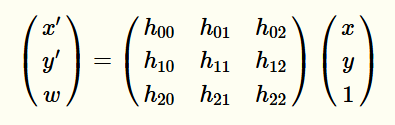

# OpenCV（透视变换）

OpenCV中的透视变换（Perspective Transformation）是一种几何变换，用于将图像从一个平面映射到另一个平面。它通过4个对应点之间的映射关系来变换图像，使得变换后的图像看起来像从不同角度观看。透视变换常用于图像校正、投影变换等场景，例如将倾斜的纸张矫正成正面视角或对物体进行视角转换。

### 1. 透视变换的基本原理

透视变换是一种射影变换（Projective Transformation），它会保持直线的性质，即变换前的直线在变换后依然是直线。透视变换的核心原理是找到两个图像平面上4个点之间的映射关系。

#### 1.1 数学公式

透视变换由以下矩阵方程描述：




其中：

- (x,y) 是原始图像中的点的坐标。
- (x′,y′) 是变换后的图像中的点的坐标。
- hij 是3x3的变换矩阵的元素。
- w 是归一化参数，它通常用于将透视变换后的坐标归一化，使其变为实际坐标值。


### 2. 透视变换矩阵的计算

透视变换的3x3矩阵可以通过OpenCV的函数 `cv::getPerspectiveTransform()` 计算。该函数需要输入两个平面上的四个点的对应关系：

- 源图像的四个点。
- 目标图像上的四个点。

例如，如果你有一张透视变形的纸张照片，你可以选择纸张的四个角点作为源点，然后将这四个角点映射到目标图像上的矩形区域。通过这些点，OpenCV可以计算出变换矩阵。

```cpp
cv::Mat getPerspectiveTransform(const cv::Point2f src[], const cv::Point2f dst[]);
```

该函数返回一个3x3的透视变换矩阵，随后可以使用 `cv::warpPerspective()` 函数应用该矩阵进行图像变换。

### 3. 图像变换

有了透视变换矩阵后，可以通过 `cv::warpPerspective()` 函数将原图像变换为目标图像。

```cpp
void warpPerspective(InputArray src, OutputArray dst, InputArray M, Size dsize);
```

参数：

- `src`：原图像。
- `dst`：输出图像。
- `M`：透视变换矩阵（3x3）。
- `dsize`：输出图像的尺寸。

透视变换会将输入图像中的每个像素映射到输出图像的对应位置，生成变换后的结果。

### 4. 使用示例

假设你有一个带有透视失真的文档图片，你可以通过选择文档的四个角点，将其映射到一个平整的矩形区域，从而纠正透视失真。

```cpp
#include <opencv2/opencv.hpp>
using namespace cv;

int main() {
    Mat src = imread("document.jpg");
    
    Point2f srcPts[4] = { Point2f(50, 50), Point2f(200, 50), Point2f(50, 200), Point2f(200, 200) };
    Point2f dstPts[4] = { Point2f(0, 0), Point2f(300, 0), Point2f(0, 400), Point2f(300, 400) };
    
    Mat M = getPerspectiveTransform(srcPts, dstPts);
    
    Mat dst;
    warpPerspective(src, dst, M, Size(300, 400));
    
    imshow("Warped Image", dst);
    waitKey(0);
    return 0;
}
```

### 5. 实际应用

透视变换在很多场景中应用广泛：

- **图像校正**：矫正倾斜的物体，比如书籍扫描、投影幕布校正。
- **车道检测**：在自动驾驶和高级驾驶辅助系统（ADAS）中，用于将车道线从透视变形的视角变换到鸟瞰视角，从而更好地检测车道。
- **图像拼接**：在全景图拼接中，透视变换可以将多个图像的不同视角统一到一个平面上。
- **增强现实（AR）**：通过透视变换，可以将虚拟物体正确地投影到实际图像中，使其看起来与场景自然结合。

透视变换的核心在于理解图像平面之间的几何关系，通过适当的点映射，变换可以实现任意角度的视图转换。