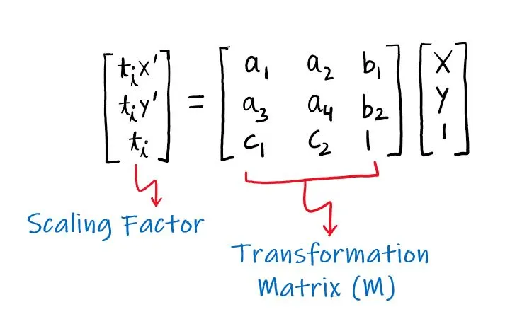
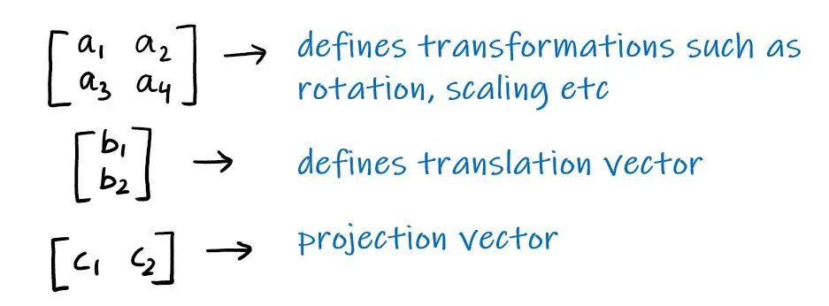
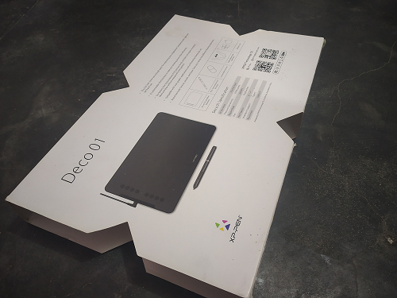
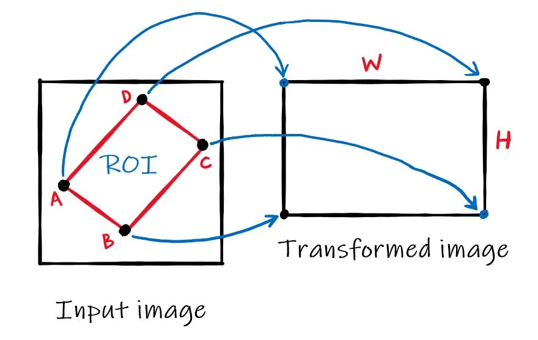
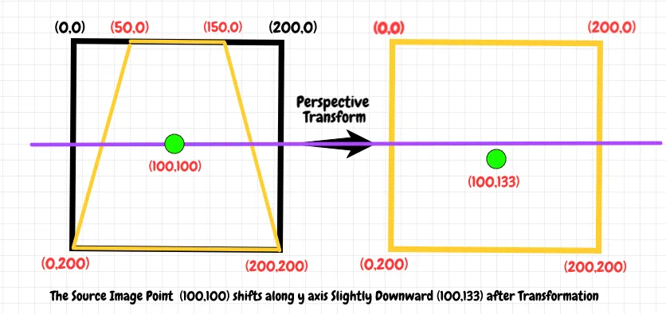
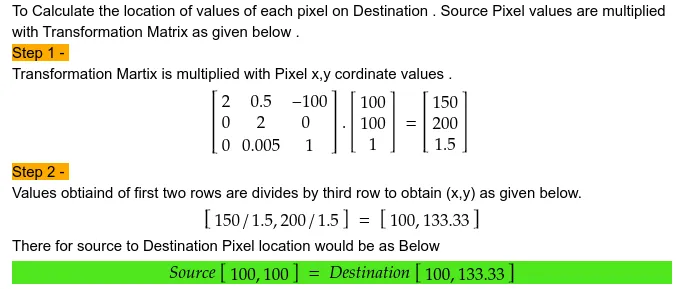
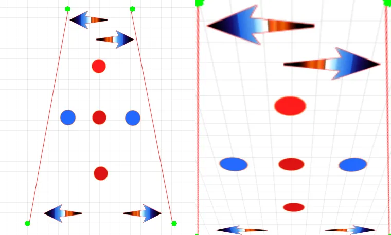

# 透视变换（Perspective Transformation）

https://theailearner.com/2020/11/06/perspective-transformation/

https://zhuanlan.zhihu.com/p/641970591

在本博客中，我们将讨论什么是透视变换以及如何使用 OpenCV-Python 执行此变换。那么，让我们开始吧。

## **什么是透视变换？**

从名称中可以清楚地看出，透视变换研究是坐标变化之间的关系。这种类型的转换不保留信息的平行度、长度和角度。但它们确实保留了共线性和关联性。这意味着即使在变换之后直线仍将保持直线。

一般来说，透视变换可以表示为：



这里，(x', y') 是变换点，而 (x, y) 是输入点。变换矩阵 (M) 可以看作是以下的组合：



其中：

● a1，a2，a3，a4组成的矩阵定义旋转、缩放等变换；
● b1，b2定义了平移向量；
● c1，c2定义了投影向量。

对于仿射变换，投影向量等于0。因此，可以[仿射变换](https://theailearner.com/2020/11/04/affine-transformation/)被认为是透视变换的特例。

> 【补充】：透视变换和仿射变换
> 透视变换和仿射变换都是图像处理中常用的几何变换方法，但它们之间存在一些区别。
> 透视变换是一种非线性变换，它可以通过调整图像中物体的尺寸和位置关系，使其看起来更符合人眼的视觉感受。透视变换需要至少4个点来确定一个透视变换矩阵。
> 仿射变换是一种线性变换，它可以通过调整图像中物体的位置、旋转和缩放关系，来实现图像的变换。仿射变换需要至少3个点来确定一个仿射变换矩阵。
> 因此，透视变换和仿射变换虽然都可以实现图像的变换，但它们的应用场景和变换效果是不同的。透视变换主要用于处理**三维场景**中的透视投影问题，而仿射变换则更适用于处理**二维场景**中的平移、旋转和缩放等问题。

由于变换矩阵 (M) 由 8 个常数（自由度）定义，因此为了找到该矩阵，我们首先在输入图像中选择 4 个点，然后根据用途将这 4 个点映射到未知输出图像中的所需位置（这样我们将有 8 个方程和 8 个未知数，并且可以很容易地求解）。

一旦计算出变换矩阵，我们就可以将透视变换应用于整个输入图像以获得最终的变换图像。让我们看看如何使用 OpenCV-Python 来做到这一点。

## **OpenCV实现**

OpenCV 提供了一个函数 [cv2.getPerspectiveTransform](https://zhida.zhihu.com/search?content_id=230791172&content_type=Article&match_order=1&q=cv2.getPerspectiveTransform&zhida_source=entity)()，它将 4 对对应点作为输入并输出变换矩阵。基本语法如下所示。

```python3
transform_mat = cv2.getPerspectiveTransform(src, dst)

# src: coordinates in the source image
# dst: coordinates in the output image
```

计算出变换矩阵 (M) 后，将其传递给 cv2.warpPerspective() 函数，该函数将透视变换应用于图像。该函数的语法如下所示。

```text
dst = cv.warpPerspective(src, M, dsize[, dst[, flags[, borderMode[, borderValue]]]] )
 
# src: input image
# M: Transformation matrix
# dsize: size of the output image
# flags: interpolation method to be used
```

现在，让我们举一个非常经典的透视变换示例，以获得图像的自上而下的“鸟瞰图”。让我们逐步了解如何使用下图执行透视变换。



下图显示了我们将执行的基本想法。



首先，我们将为感兴趣区域（ROI）选择代表点（通常是角点）。这可以使用 matplotlib 手动完成，如下所示：

```text
import cv2
import numpy as np
import matplotlib.pyplot as plt
 
# To open matplotlib in interactive mode
%matplotlib qt5
 
# Load the image
img = cv2.imread('D:/downloads/deco.jpg') 
 
# Create a copy of the image
img_copy = np.copy(img)
 
# Convert to RGB so as to display via matplotlib
# Using Matplotlib we can easily find the coordinates
# of the 4 points that is essential for finding the 
# transformation matrix
img_copy = cv2.cvtColor(img_copy,cv2.COLOR_BGR2RGB)
 
plt.imshow(img_copy)
```

上面的代码打开了一个交互窗口。使用鼠标指针获取如下所示的 4 个角坐标。点按逆时针顺序排列，如上图所示。

```text
# All points are in format [cols, rows]
pt_A = [41, 2001]
pt_B = [2438, 2986]
pt_C = [3266, 371]
pt_D = [1772, 136]
```

然后，我们将根据用例将这 4 个点映射到未知输出图像中的所需位置。在这里，由于我们使用了角点，因此我们将从这 4 个点导出输出图像的宽度和高度，如下所示（您也可以手动指定映射）。下面我使用了L2范数。您也可以使用 L1。

```text
# Here, I have used L2 norm. You can use L1 also.
width_AD = np.sqrt(((pt_A[0] - pt_D[0]) ** 2) + ((pt_A[1] - pt_D[1]) ** 2))
width_BC = np.sqrt(((pt_B[0] - pt_C[0]) ** 2) + ((pt_B[1] - pt_C[1]) ** 2))
maxWidth = max(int(width_AD), int(width_BC))


height_AB = np.sqrt(((pt_A[0] - pt_B[0]) ** 2) + ((pt_A[1] - pt_B[1]) ** 2))
height_CD = np.sqrt(((pt_C[0] - pt_D[0]) ** 2) + ((pt_C[1] - pt_D[1]) ** 2))
maxHeight = max(int(height_AB), int(height_CD))
```

现在指定映射，如下图所示（与上图相同）：


```text
input_pts = np.float32([pt_A, pt_B, pt_C, pt_D])
output_pts = np.float32([[0, 0],
                        [0, maxHeight - 1],
                        [maxWidth - 1, maxHeight - 1],
                        [maxWidth - 1, 0]])
```

现在，使用 cv2.getPerspectiveTransform() 函数计算变换矩阵 (M)，如下所示：

```text
# Compute the perspective transform M
M = cv2.getPerspectiveTransform(input_pts,output_pts)
```

计算出变换矩阵后，将透视变换应用于整个输入图像以获得最终的变换图像。

```text
out = cv2.warpPerspective(img,M,(maxWidth, maxHeight),flags=cv2.INTER_LINEAR)
```


变换后的图片

## **透视变换的形象说明**

**注：以下内容来自博客《[OpenCv Perspective Transformation](https://medium.com/analytics-vidhya/opencv-perspective-transformation-9edffefb2143)》。**



图1 绿点表示的是变换前后像素点的坐标



图2 使用变换矩阵的详细计算过程



图3 透视变换在图像层面的形象说明