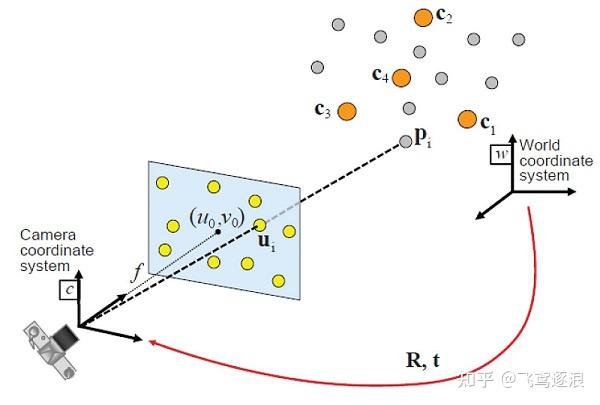
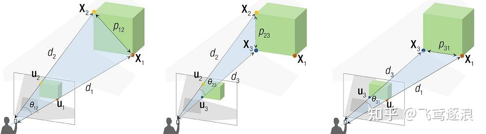
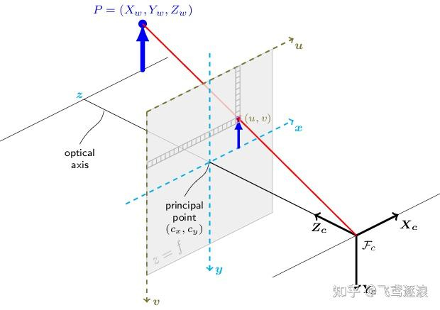
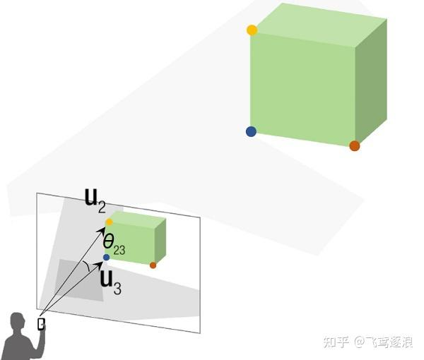
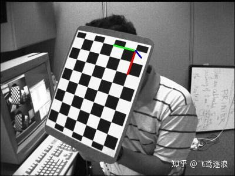
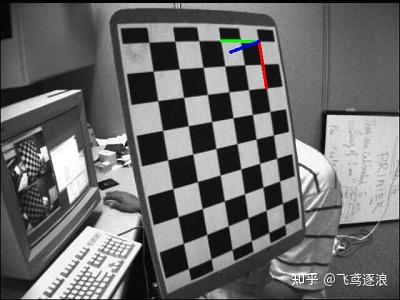
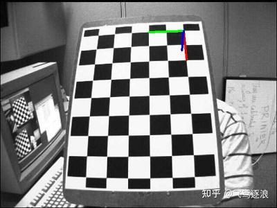
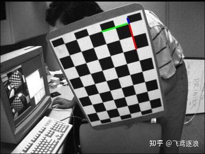
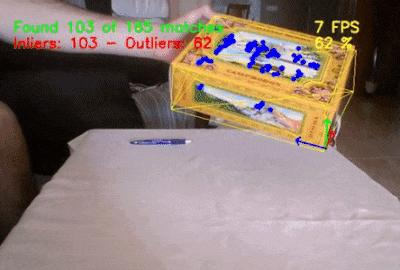

# OpenCV 之 透视 n 点问题

## 1 PnP 问题

## 1.1 定义

已知：相机的内参和畸变系数；世界坐标系中，n 个空间点坐标，以及投影在像平面上的像素坐标

求解：相机在世界坐标系下的位姿 R 和 t，即 {W} 到 {C} 的变换矩阵 ，如下图：



世界坐标系中的 3d 空间点，与投影到像平面的 2d 像素点，两者之间的关系为：


## 1.2 分类

根据给定空间点的数量，可将 PnP 问题分为两类：

第一类 3≤n≤5，选取的空间点较少，可通过联立方程组的方式求解，精度易受图像噪声影响，鲁棒性较差

第二类 n≥6，选取的空间点较多，可转化为求解超定方程的问题，一般侧重于鲁棒性和实时性的平衡


## 2 求解方法

## 2.1 [DLT 法](https://zhida.zhihu.com/search?content_id=178953033&content_type=Article&match_order=1&q=DLT+法&zhida_source=entity)

### 2.1.1 转化为 Ax=0

令 ， 为相机内参矩阵，则 PnP 问题可简化为：已知 n 组 3d-2d 对应点，求解 

DLT (Direct Linear Transformation，直接线性变换)，便是直接利用这 n 组对应点，构建线性方程组来求解


简化符号 为 ，展开得：


未知数有 11 个 ( 可约掉)，则至少需要 6 组对应点，写成矩阵形式如下：


因此，求解 便转化成了 的问题

### 2.1.2 SVD 求 R t

给定相机内参矩阵，则有 

考虑 符号无关，得 

SVD 分解 

和

## 2.2 P3P 法

当 n=3 时，PnP 即为 P3P，它有 4 个可能的解，求解方法是 余弦定理 + 向量点积

### 2.2.1 余弦定理

根据投影几何的消隐点和消隐线，构建 3d-2d 之间的几何关系，如下：




根据余弦定理，则有


只有 $d_1,\, d_2,\,d_3$ 是未知数，求解方程组即可

其中，有个关键的隐含点：给定相机内参，以及 3d-2d 的投影关系，则消隐线之间的夹角 是可计算得出的

### 2.2.2 向量点积

相机坐标系中，原点即为消隐点，原点到 3d-2d 的连线即为消隐线，如图所示：






如果知道 3d点 投影到像平面的 2d点，在相机坐标系中的坐标 ，则 

具体到运算，可视为 世界坐标系 {W} 和 相机坐标系 {C} 重合，且 ，则有


 可用增广矩阵求得，且 ，则有


记 ，则 ，以此类推 和 


## 3 OpenCV 函数

OpenCV 中解 PnP 的方法有 9 种，目前实现了 7 种，还有 2 种未实现，对应论文如下：

\- *SOLVEPNP_P3P* [Complete Solution Classification for the Perspective-Three-Point Problem](https://link.zhihu.com/?target=http%3A//www.mmrc.iss.ac.cn/tmp/papers/gao-ieee-pami.pdf)

\- *SOLVEPNP_AP3P* [An Efficient Algebraic Solution to the Perspective-Three-Point Problem](https://link.zhihu.com/?target=https%3A//openaccess.thecvf.com/content_cvpr_2017/papers/Ke_An_Efficient_Algebraic_CVPR_2017_paper.pdf)

\- *SOLVEPNP_ITERATIVE* 基于 L-M 最优化方法，求解重投影误差最小的位姿

\- *SOLVEPNP_EPNP* [EPnP: An Accurate O(n) Solution to the PnP Problem](https://link.zhihu.com/?target=https%3A//www.tugraz.at/fileadmin/user_upload/Institute/ICG/Images/team_lepetit/publications/lepetit_ijcv08.pdf)

\- *SOLVEPNP_SQPNP* [A Consistently Fast and Globally Optimal Solution to the Perspective-n-Point Problem](https://link.zhihu.com/?target=http%3A//www.ecva.net/papers/eccv_2020/papers_ECCV/papers/123460460.pdf)

\- *SOLVEPNP_IPPE* [Infinitesimal Plane-based Pose Estimation](https://link.zhihu.com/?target=http%3A//igt.ip.uca.fr/encov/publications/pubfiles/2014_Collins_etal_IJCV_plane.pdf) 输入的 3D 点需要共面且 n ≥ 4

\- *SOLVEPNP_IPPE_SQUARE* SOLVEPNP_IPPE 的一种特殊情况，要求输入 4 个共面点的坐标，并且按照特定的顺序排列

\- *SOLVEPNP_DLS* (未实现) [A Direct Least-Squares (DLS) Method for PnP](https://link.zhihu.com/?target=https%3A//www-users.cse.umn.edu/~stergios/papers/ICCV-11-DLS-PnP.pdf) 实际调用 SOLVEPNP_EPNP

\- *SOLVEPNP_UPLP* (未实现) [Exhaustive Linearization for Robust Camera Pose and Focal Length Estimation](https://link.zhihu.com/?target=https%3A//upcommons.upc.edu/bitstream/handle/2117/22931/1404-Exhaustive-linearization-for-robust-camera-pose-and-focal-length-estimation.pdf%3Bsequence%3D1) 实际调用 SOLVEPNP_EPNP

## 3.1 solveP3P()

solveP3P() 的输入是 3 组 3d-2d 对应点，定义如下：

```cpp
    // P3P has up to 4 solutions, and the solutions are sorted by reprojection errors(lowest to highest).
    int solveP3P (
        InputArray     objectPoints,     // object points, 3x3 1-channel or 1x3/3x1 3-channel. vector<Point3f> can be also passed
        InputArray      imagePoints,     // corresponding image points, 3x2 1-channel or 1x3/3x1 2-channel. vector<Point2f> can be also passed
        InputArray     cameraMatrix,     // camera intrinsic matrix
        InputArray       distCoeffs,     // distortion coefficients.If NULL/empty, the zero distortion coefficients are assumed.
        OutputArrayOfArrays   rvecs,     // rotation vectors
        OutputArrayOfArrays   tvecs,     // translation vectors
        int                   flags      // solving method
    ); 　　
```

## 3.2 solvePnP() 和 solvePnPGeneric()

solvePnP() 实际上调用的是 solvePnPGeneric()，内部实现如下：

```text
bool solvePnP(InputArray opoints, InputArray ipoints, InputArray cameraMatrix, InputArray distCoeffs, OutputArray rvec, OutputArray tvec, bool useExtrinsicGuess, int flags)
{
    CV_INSTRUMENT_REGION();

    vector<Mat> rvecs, tvecs;
    int solutions = solvePnPGeneric(opoints, ipoints, cameraMatrix, distCoeffs, rvecs, tvecs, useExtrinsicGuess, (SolvePnPMethod)flags, rvec, tvec);

    if (solutions > 0)
    {
        int rdepth = rvec.empty() ? CV_64F : rvec.depth();
        int tdepth = tvec.empty() ? CV_64F : tvec.depth();
        rvecs[0].convertTo(rvec, rdepth);
        tvecs[0].convertTo(tvec, tdepth);
    }

    return solutions > 0;
}　　
```

solvePnPGeneric() 除了求解相机位姿外，还可得到重投影误差，其定义如下：

```text
    bool solvePnPGeneric (
        InputArray         objectPoints,    // object points, Nx3 1-channel or 1xN/Nx1 3-channel, N is the number of points. vector<Point3d> can be also passed
        InputArray          imagePoints,    // corresponding image points, Nx2 1-channel or 1xN/Nx1 2-channel, N is the number of points. vector<Point2d> can be also passed
        InputArray         cameraMatrix,    // camera intrinsic matrix
        InputArray           distCoeffs,    // distortion coefficients
        OutputArrayOfArrays        rvec,    // rotation vector
        OutputArrayOfArrays        tvec,    // translation vector
        bool  useExtrinsicGuess = false,    // used for SOLVEPNP_ITERATIVE. If true, use the provided rvec and tvec as initial approximations, and further optimize them.
        SolvePnPMethod  flags = SOLVEPNP_ITERATIVE, // solving method
        InputArray               rvec = noArray(),  // initial rotation vector when using SOLVEPNP_ITERATIVE and useExtrinsicGuess is set to true
        InputArray               tvec = noArray(),  // initial translation vector when using SOLVEPNP_ITERATIVE and useExtrinsicGuess is set to true
        OutputArray reprojectionError = noArray()   // optional vector of reprojection error, that is the RMS error
    ); 　
```

## 3.3 solvePnPRansac()

solvePnP() 的一个缺点是鲁棒性不强，对异常点敏感，这在相机标定中问题不大，因为标定板的图案已知，并且特征提取较为稳定

然而，当相机拍摄实际物体时，因为特征难以稳定提取，会出现一些异常点，导致位姿估计的不准，因此，需要一种处理异常点的方法

RANSAC 便是一种高效剔除异常点的方法，对应 solvePnPRansac()，它是一个重载函数，共有 2 种参数形式，第 1 种形式如下：

```text
    bool solvePnPRansac (
        InputArray         objectPoints,    // object points, Nx3 1-channel or 1xN/Nx1 3-channel, N is the number of points. vector<Point3d> can be also passed
        InputArray          imagePoints,    // corresponding image points, Nx2 1-channel or 1xN/Nx1 2-channel, N is the number of points. vector<Point2d> can be also passed
        InputArray         cameraMatrix,    // camera intrinsic matrix
        InputArray           distCoeffs,    // distortion coefficients
        OutputArray                rvec,    // rotation vector
        OutputArray                tvec,    // translation vector
        bool  useExtrinsicGuess = false,    // used for SOLVEPNP_ITERATIVE. If true, use the provided rvec and tvec as initial approximations, and further optimize them.
        int       iterationsCount = 100,    // number of iterations
        float   reprojectionError = 8.0,    // inlier threshold value. It is the maximum allowed distance between the observed and computed point projections to consider it an inlier
        double        confidence = 0.99,    // the probability that the algorithm produces a useful result
        OutputArray inliers = noArray(),    // output vector that contains indices of inliers in objectPoints and imagePoints
        int  flags = SOLVEPNP_ITERATIVE     // solving method
    );　　
```

## 3.4 solvePnPRefineLM() 和 solvePnPRefineVVS()

OpenCV 中还有 2 个位姿细化函数：通过迭代不断减小重投影误差，从而求得最佳位姿，solvePnPRefineLM() 使用 L-M 算法，solvePnPRefineVVS() 则用虚拟视觉伺服 (Virtual Visual Servoing)

solvePnPRefineLM() 的定义如下：

```text
  void solvePnPRefineLM (
      InputArray      objectPoints,  // object points, Nx3 1-channel or 1xN/Nx1 3-channel, N is the number of points
      InputArray       imagePoints,  // corresponding image points, Nx2 1-channel or 1xN/Nx1 2-channel
      InputArray      cameraMatrix,  // camera intrinsic matrix
      InputArray        distCoeffs,  // distortion coefficients
      InputOutputArray      rvec,      // input/output rotation vector
      InputOutputArray      tvec,      // input/output translation vector      
      TermCriteria  criteria = TermCriteria(TermCriteria::EPS+TermCriteria::COUNT, 20, FLT_EPSILON) // Criteria when to stop the LM iterative algorithm
); 
```


## 4 应用实例

## 4.1 位姿估计 (静态+标定板)

当手持标定板旋转不同角度时，利用相机内参 + solvePnP()，便可求出相机相对标定板的位姿

```text
#include "opencv2/imgproc.hpp"
#include "opencv2/highgui.hpp"
#include "opencv2/calib3d.hpp"

using namespace std;
using namespace cv;

Size kPatternSize = Size(9, 6);
float kSquareSize = 0.025;
// camera intrinsic parameters and distortion coefficient
const Mat cameraMatrix = (Mat_<double>(3, 3) << 5.3591573396163199e+02, 0.0, 3.4228315473308373e+02,
                                                0.0, 5.3591573396163199e+02, 2.3557082909788173e+02,
                                                0.0, 0.0, 1.0);
const Mat distCoeffs = (Mat_<double>(5, 1) << -2.6637260909660682e-01, -3.8588898922304653e-02, 1.7831947042852964e-03,
                                              -2.8122100441115472e-04, 2.3839153080878486e-01);

int main()
{
    // 1) read image
    Mat src = imread("left07.jpg");
    if (src.empty())
        return -1;
    // prepare for subpixel corner
    Mat src_gray;
    cvtColor(src, src_gray, COLOR_BGR2GRAY);

    // 2) find chessboard corners and subpixel refining
    vector<Point2f> corners;
    bool patternfound = findChessboardCorners(src, kPatternSize, corners);
    if (patternfound) {
        cornerSubPix(src_gray, corners, Size(11, 11), Size(-1, -1), TermCriteria(TermCriteria::EPS + TermCriteria::MAX_ITER, 30, 0.1));
    }
    else {
        return -1;
    }

    // 3) object coordinates
    vector<Point3f> objectPoints;
    for (int i = 0; i < kPatternSize.height; i++)
    {
        for (int j = 0; j < kPatternSize.width; j++)
        {
            objectPoints.push_back(Point3f(float(j * kSquareSize), float(i * kSquareSize), 0));
        }
    }

    // 4) Rotation and Translation vectors
    Mat rvec, tvec;
    solvePnP(objectPoints, corners, cameraMatrix, distCoeffs, rvec, tvec);

    // 5) project estimated pose on the image 
    drawFrameAxes(src, cameraMatrix, distCoeffs, rvec, tvec, 2*kSquareSize);
    imshow("Pose estimation", src);
    waitKey();
}　　
```

当标定板旋转不同角度时，相机所对应的位姿如下：









## 4.2 位姿估计 (实时+任意物)

OpenCV 中有一个实时目标跟踪例程，位于 "opencv\samples\cpp\tutorial_code\calib3d\real_time_pose_estimation" 中，实现步骤如下：

1) 读取目标的三维模型和网格 -> 2) 获取视频流 -> 3) ORB 特征检测 -> 4) 3d-2d 特征匹配 -> 5) 相机位姿估计 -> 6) 卡尔曼滤波

例程中设计了一个 PnPProblem 类来实现位姿估计，其中 2 个重要的函数 estimatePoseRANSAC() 和 backproject3DPoint() 定义如下：

```text
  class PnPProblem
    {
    public:
        explicit PnPProblem(const double param[]);  // custom constructor
        virtual ~PnPProblem();

        cv::Point2f backproject3DPoint(const cv::Point3f& point3d);

        void estimatePoseRANSAC(const std::vector<cv::Point3f>& list_points3d, const std::vector<cv::Point2f>& list_points2d,
                                int flags, cv::Mat& inliers, int iterationsCount, float reprojectionError, double confidence);
        // ...
    }

    // Custom constructor given the intrinsic camera parameters
    PnPProblem::PnPProblem(const double params[])
    {
        // intrinsic camera parameters
        _A_matrix = cv::Mat::zeros(3, 3, CV_64FC1);   
        _A_matrix.at<double>(0, 0) = params[0];       //  [ fx   0  cx ]
        _A_matrix.at<double>(1, 1) = params[1];       //  [  0  fy  cy ]
        _A_matrix.at<double>(0, 2) = params[2];       //  [  0   0   1 ]
        _A_matrix.at<double>(1, 2) = params[3];
        _A_matrix.at<double>(2, 2) = 1;
        // rotation matrix, translation matrix, rotation-translation matrix
        _R_matrix = cv::Mat::zeros(3, 3, CV_64FC1);
        _t_matrix = cv::Mat::zeros(3, 1, CV_64FC1);
        _P_matrix = cv::Mat::zeros(3, 4, CV_64FC1);
    }

    // Estimate the pose given a list of 2D/3D correspondences with RANSAC and the method to use
    void PnPProblem::estimatePoseRANSAC (
        const std::vector<Point3f>& list_points3d,        // list with model 3D coordinates
        const std::vector<Point2f>& list_points2d,        // list with scene 2D coordinates
        int flags, Mat& inliers, int iterationsCount,     // PnP method; inliers container
        float reprojectionError, float confidence)        // RANSAC parameters
    {
        // distortion coefficients, rotation vector and translation vector 
        Mat distCoeffs = Mat::zeros(4, 1, CV_64FC1);
        Mat rvec = Mat::zeros(3, 1, CV_64FC1);          
        Mat tvec = Mat::zeros(3, 1, CV_64FC1);   
        // no initial approximations
        bool useExtrinsicGuess = false;           

        // PnP + RANSAC
        solvePnPRansac(list_points3d, list_points2d, _A_matrix, distCoeffs, rvec, tvec, useExtrinsicGuess, iterationsCount, reprojectionError, confidence, inliers, flags);
   
        // converts Rotation Vector to Matrix
        Rodrigues(rvec, _R_matrix);                   
        _t_matrix = tvec;                            // set translation matrix
        this->set_P_matrix(_R_matrix, _t_matrix);    // set rotation-translation matrix
    }

    // Backproject a 3D point to 2D using the estimated pose parameters
    cv::Point2f PnPProblem::backproject3DPoint(const cv::Point3f& point3d)
    {
        // 3D point vector [x y z 1]'
        cv::Mat point3d_vec = cv::Mat(4, 1, CV_64FC1);
        point3d_vec.at<double>(0) = point3d.x;
        point3d_vec.at<double>(1) = point3d.y;
        point3d_vec.at<double>(2) = point3d.z;
        point3d_vec.at<double>(3) = 1;

        // 2D point vector [u v 1]'
        cv::Mat point2d_vec = cv::Mat(4, 1, CV_64FC1);
        point2d_vec = _A_matrix * _P_matrix * point3d_vec;

        // Normalization of [u v]'
        cv::Point2f point2d;
        point2d.x = (float)(point2d_vec.at<double>(0) / point2d_vec.at<double>(2));
        point2d.y = (float)(point2d_vec.at<double>(1) / point2d_vec.at<double>(2));

        return point2d;
    }
```

PnPProblem 类的调用如下：实例化 -> estimatePoseRansac() 估计位姿 -> backproject3DPoint() 画出位姿

```text
// Intrinsic camera parameters: UVC WEBCAM
double f = 55;                     // focal length in mm
double sx = 22.3, sy = 14.9;       // sensor size
double width = 640, height = 480;  // image size
double params_WEBCAM[] = { width * f / sx,   // fx
                           height * f / sy,  // fy
                           width / 2,      // cx
                           height / 2 };   // cy
// instantiate PnPProblem class
PnPProblem pnp_detection(params_WEBCAM);

// RANSAC parameters
int iterCount = 500;        // number of Ransac iterations.
float reprojectionError = 2.0;    // maximum allowed distance to consider it an inlier.
float confidence = 0.95;          // RANSAC successful confidence.

// OpenCV requires solvePnPRANSAC to minimally have 4 set of points
if (good_matches.size() >= 4)
{
    // -- Step 3: Estimate the pose using RANSAC approach
    pnp_detection.estimatePoseRANSAC(list_points3d_model_match, list_points2d_scene_match,
        pnpMethod, inliers_idx, iterCount, reprojectionError, confidence);

    // ... ..
}

// ... ...　

float fp = 5;
vector<Point2f> pose2d;
pose2d.push_back(pnp_detect_est.backproject3DPoint(Point3f(0, 0, 0))); // axis center
pose2d.push_back(pnp_detect_est.backproject3DPoint(Point3f(fp, 0, 0))); // axis x
pose2d.push_back(pnp_detect_est.backproject3DPoint(Point3f(0, fp, 0))); // axis y
pose2d.push_back(pnp_detect_est.backproject3DPoint(Point3f(0, 0, fp))); // axis z

draw3DCoordinateAxes(frame_vis, pose2d); // draw axes

// ... ...
```

实时目标跟踪的效果如下：




### 参考资料

OpenCV-Python Tutorials / Camera Calibration and 3D Reconstruction / [Pose Estimation](https://link.zhihu.com/?target=https%3A//docs.opencv.org/master/d7/d53/tutorial_py_pose.html)

OpenCV Tutorials / Camera calibration and 3D reconstruction (calib3d module) / [Real time pose estimation of a textured object](https://link.zhihu.com/?target=https%3A//docs.opencv.org/master/dc/d2c/tutorial_real_time_pose.html)

[一种改进的 PnP 问题求解算法研究[J\]](https://link.zhihu.com/?target=http%3A//html.rhhz.net/yykj/html/201612019.htm)

[Perspective-n-Point, Hyun Soo Park](https://link.zhihu.com/?target=https%3A//www-users.cse.umn.edu/~hspark/csci5563_S2021/Lec15_PnP.pdf)