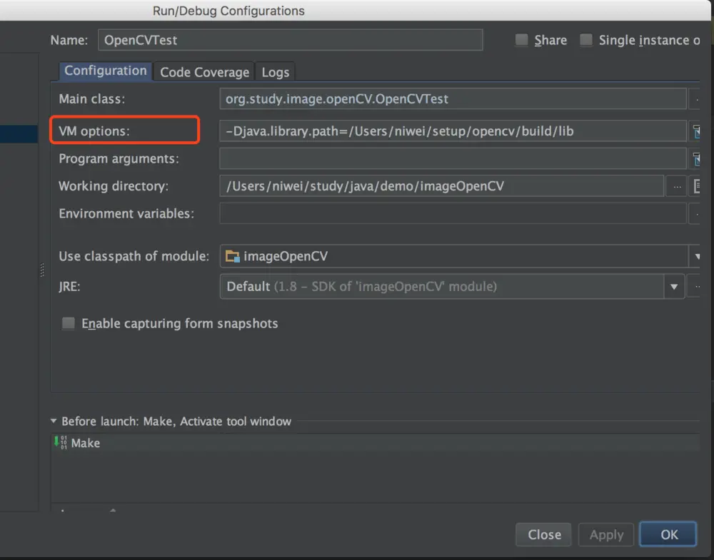

# 基于 OpenCV 的图像匹配（ Java 版）

[预流](https://juejin.cn/user/3104676567070968/posts)

2018-01-2414,106阅读8分钟

最近在做图像匹配的事，发现原来有个叫 OpenCV 的库，非常强大，跨平台、多语言接口、在计算机视觉和图像处理上提供了���个通用算法，应用的领域包括了物体识别、人脸识别、图像分割、机器视觉、运动分析。因为涉及了一些图像处理的概念和算法，对于常年做业务系统的程序员来说很少碰这领域，所以分享一下问题的处理过程。

# OpenCV 的安装

先看下这个库的安装，它是跨平台的，主流的操作系统都支持，以操作系统 OS X 、开发工具 IntelliJ IDEA 为例，看下这个库的安装和配置过程。

OpenCV 最新的版本是3.2.0，所以看这个版本的[安装说明](https://link.juejin.cn/?target=http%3A%2F%2Fdocs.opencv.org%2F3.2.0%2Fdf%2Fd65%2Ftutorial_table_of_content_introduction.html)，页面上有Linux、Windows、Android、iOS等不同平台的安装介绍，由于我用的是Java，所以直接看[ Introduction to Java Development ](https://link.juejin.cn/?target=http%3A%2F%2Fdocs.opencv.org%2F3.2.0%2Fd9%2Fd52%2Ftutorial_java_dev_intro.html)安装过程共分下面几步：

1. git 下载源码 选择一个目录，用 git 下载 OpenCV 的源代码

```
代码解读
复制代码git clone git://github.com/opencv/opencv.git
```

1. 切换 git 代码分支 进入 opencv 的目录下，切换分支

```
代码解读复制代码cd opencv
git checkout 2.4
```

1. 新建 build 目录 在 opencv 目录下新建 build 目录用于存放编译后的文件

```
代码解读复制代码mkdir build
cd build
```

1. 编译整个项目代码

```
代码解读
复制代码cmake -DBUILD_SHARED_LIBS=OFF ..
```

当控制台输出里有"To be built"这行，里面包含了"java"，则表示项目编译成功了。


5. build 整个项目


```
代码解读
复制代码make -j8
```

执行完 make 命令后看下 build 目录下的 bin 目录内容，如果有文件叫 opencv-2413.jar，则说明 opencv 已经编译安装好了。


以上步骤执行完，实际就具备了 java 接口访问 openCV 的能力了。而要在 IntelliJ IDEA 中访问 OpenCV ，还需要两部配置：

1. 给项目添加 jar 包 在项目的 Libraries 中添加上面 build 之后的 bin 目录下的 opencv-2413.jar

   

   之后选择 opencv-2413.jar 所在位置。

   

   

2. 写一个测试 OpenCV 环境的类

```
代码解读复制代码package org.study.image.openCV;

import org.opencv.core.Core;

public class OpenCVTest {
    public static void main(String[] args) {
        System.loadLibrary(Core.NATIVE_LIBRARY_NAME);
    }
}
```

这个类里面就一句话，加载本地的openCV库。

1. 配置 Java Application 的运行参数

此时运行这个类会报 UnsatisfiedLinkError 的错误，提示【no opencv_java2413 in java.library.path】：


所以需要配置 Java Application 的运行时参数，在 java.library.path 加上上面 OpenCV 编译之后的 build 目录下的 lib 目录：



这样就可以在 Java 环境中访问 OpenCV 库了。


# 问题描述

要解决的问题是判断一张图片是否在另一张图片之中，比如下面这两张图：


肉眼上能看出来下面的图片其实就是在上面图片的左下区域，可是用计算机如何给出这种判断来代替人工呢？

# 基于像素的模板匹配

最开始搜到的资料就是 OpenCV 里的模板匹配，其原理是通过一张模板图片去另一张图中找到与模板相似部分（以上面的例子来说模板就是上面的小图）。模板匹配算法是指通过滑窗的方式在待匹配的图像上滑动，通过比较模板与子图的相似度，找到相似度最大的子图。

所谓滑窗就是通过滑动图片，使得图像块一次移动一个像素（从左到右，从上往下）。在每一个位置，都进行一次度量计算来这个图像块和原图像的特定区域的像素值相似程度。当相似度足够高时，就认为找到了目标。显然，这里“相似程度”的定义依赖于具体的计算公式给出的结果，不同算法结果也不一样。

目前 OpenCV 里提供了六种算法：TM_SQDIFF（平方差匹配法）、TM_SQDIFF_NORMED（归一化平方差匹配法）、TM_CCORR（相关匹配法）、TM_CCORR_NORMED（归一化相关匹配法）、TM_CCOEFF（相关系数匹配法）、TM_CCOEFF_NORMED（归一化相关系数匹配法）。

下面是 Java 中使用 OpenCV 的模板匹配的代码：

```
代码解读复制代码package org.study.image.openCV;

import org.opencv.core.*;
import org.opencv.highgui.Highgui;
import org.opencv.imgproc.Imgproc;

public class OpenCVTest {
    public static void main(String[] args) {
        System.loadLibrary(Core.NATIVE_LIBRARY_NAME);
        Mat source, template;
        //将文件读入为OpenCV的Mat格式
        source = Highgui.imread("/Users/niwei/Downloads/原图.jpeg");
        template = Highgui.imread("/Users/niwei/Downloads/模板.jpeg");
        //创建于原图相同的大小，储存匹配度
        Mat result = Mat.zeros(source.rows() - template.rows() + 1, source.cols() - template.cols() + 1, CvType.CV_32FC1);
        //调用模板匹配方法
        Imgproc.matchTemplate(source, template, result, Imgproc.TM_SQDIFF_NORMED);
        //规格化
        Core.normalize(result, result, 0, 1, Core.NORM_MINMAX, -1);
        //获得最可能点，MinMaxLocResult是其数据格式，包括了最大、最小点的位置x、y
        Core.MinMaxLocResult mlr = Core.minMaxLoc(result);
        Point matchLoc = mlr.minLoc;
        //在原图上的对应模板可能位置画一个绿色矩形
        Core.rectangle(source, matchLoc, new Point(matchLoc.x + template.width(), matchLoc.y + template.height()), new Scalar(0, 255, 0));
        //将结果输出到对应位置
        Highgui.imwrite("/Users/niwei/Downloads/匹配结果.jpeg", source);
    }
}
```


匹配后的结果图片:


可以看到匹配结果图中已经用绿色矩形将该区域标识出来了，其实匹配结果能这么好是主要因为上面的模板图和原图实际上是从一张图片里面用同样的精度截取出来的，如果是这种情况用模板匹配算法是可行的。


但它的缺陷在于如果模板图片发生了旋转、缩放之后，这种通过滑窗的模板匹配方式就会失效，那又如何处理呢？

# 基于特征点的 SURF 匹配

要解决旋转缩放后的模板图片再匹配原图的问题，就用到了计算机视觉处理算法中的特征变换匹配算法。其思路是先找到图像中的一些“稳定点”，这些点不会因为视角的改变、光照的变化、噪音的干扰而消失，比如角点、边缘点、暗区域的亮点以及亮区域的暗点。这样如果两幅图中有相同的景物，那么稳定点就会在两幅图像的相同景物上同时出现，这样就能实现匹配。

OpenCV 中针对特征点匹配问题已经提供了很多算法，包括 FAST 、SIFT 、SURF 、ORB 等，这里不赘述这些算法之间的区别，直接以 SURF 为例，看下 OpenCV 里面如何应用的。

```
代码解读复制代码package com.zhiqu.image.recognition;

import org.opencv.calib3d.Calib3d;
import org.opencv.core.*;
import org.opencv.features2d.*;
import org.opencv.highgui.Highgui;

import java.util.LinkedList;
import java.util.List;

/**
 * Created by niwei on 2017/4/28.
 */
public class ImageRecognition {

    private float nndrRatio = 0.7f;//这里设置既定值为0.7，该值可自行调整

    private int matchesPointCount = 0;

    public float getNndrRatio() {
        return nndrRatio;
    }

    public void setNndrRatio(float nndrRatio) {
        this.nndrRatio = nndrRatio;
    }

    public int getMatchesPointCount() {
        return matchesPointCount;
    }

    public void setMatchesPointCount(int matchesPointCount) {
        this.matchesPointCount = matchesPointCount;
    }

    public void matchImage(Mat templateImage, Mat originalImage) {
        MatOfKeyPoint templateKeyPoints = new MatOfKeyPoint();
        //指定特征点算法SURF
        FeatureDetector featureDetector = FeatureDetector.create(FeatureDetector.SURF);
        //获取模板图的特征点
        featureDetector.detect(templateImage, templateKeyPoints);
        //提取模板图的特征点
        MatOfKeyPoint templateDescriptors = new MatOfKeyPoint();
        DescriptorExtractor descriptorExtractor = DescriptorExtractor.create(DescriptorExtractor.SURF);
        System.out.println("提取模板图的特征点");
        descriptorExtractor.compute(templateImage, templateKeyPoints, templateDescriptors);

        //显示模板图的特征点图片
        Mat outputImage = new Mat(templateImage.rows(), templateImage.cols(), Highgui.CV_LOAD_IMAGE_COLOR);
        System.out.println("在图片上显示提取的特征点");
        Features2d.drawKeypoints(templateImage, templateKeyPoints, outputImage, new Scalar(255, 0, 0), 0);

        //获取原图的特征点
        MatOfKeyPoint originalKeyPoints = new MatOfKeyPoint();
        MatOfKeyPoint originalDescriptors = new MatOfKeyPoint();
        featureDetector.detect(originalImage, originalKeyPoints);
        System.out.println("提取原图的特征点");
        descriptorExtractor.compute(originalImage, originalKeyPoints, originalDescriptors);

        List<MatOfDMatch> matches = new LinkedList();
        DescriptorMatcher descriptorMatcher = DescriptorMatcher.create(DescriptorMatcher.FLANNBASED);
        System.out.println("寻找最佳匹配");
        /**
         * knnMatch方法的作用就是在给定特征描述集合中寻找最佳匹配
         * 使用KNN-matching算法，令K=2，则每个match得到两个最接近的descriptor，然后计算最接近距离和次接近距离之间的比值，当比值大于既定值时，才作为最终match。
         */
        descriptorMatcher.knnMatch(templateDescriptors, originalDescriptors, matches, 2);

        System.out.println("计算匹配结果");
        LinkedList<DMatch> goodMatchesList = new LinkedList();

        //对匹配结果进行筛选，依据distance进行筛选
        matches.forEach(match -> {
            DMatch[] dmatcharray = match.toArray();
            DMatch m1 = dmatcharray[0];
            DMatch m2 = dmatcharray[1];

            if (m1.distance <= m2.distance * nndrRatio) {
                goodMatchesList.addLast(m1);
            }
        });

        matchesPointCount = goodMatchesList.size();
        //当匹配后的特征点大于等于 4 个，则认为模板图在原图中，该值可以自行调整
        if (matchesPointCount >= 4) {
            System.out.println("模板图在原图匹配成功！");

            List<KeyPoint> templateKeyPointList = templateKeyPoints.toList();
            List<KeyPoint> originalKeyPointList = originalKeyPoints.toList();
            LinkedList<Point> objectPoints = new LinkedList();
            LinkedList<Point> scenePoints = new LinkedList();
            goodMatchesList.forEach(goodMatch -> {
                objectPoints.addLast(templateKeyPointList.get(goodMatch.queryIdx).pt);
                scenePoints.addLast(originalKeyPointList.get(goodMatch.trainIdx).pt);
            });
            MatOfPoint2f objMatOfPoint2f = new MatOfPoint2f();
            objMatOfPoint2f.fromList(objectPoints);
            MatOfPoint2f scnMatOfPoint2f = new MatOfPoint2f();
            scnMatOfPoint2f.fromList(scenePoints);
            //使用 findHomography 寻找匹配上的关键点的变换
            Mat homography = Calib3d.findHomography(objMatOfPoint2f, scnMatOfPoint2f, Calib3d.RANSAC, 3);

            /**
             * 透视变换(Perspective Transformation)是将图片投影到一个新的视平面(Viewing Plane)，也称作投影映射(Projective Mapping)。
             */
            Mat templateCorners = new Mat(4, 1, CvType.CV_32FC2);
            Mat templateTransformResult = new Mat(4, 1, CvType.CV_32FC2);
            templateCorners.put(0, 0, new double[]{0, 0});
            templateCorners.put(1, 0, new double[]{templateImage.cols(), 0});
            templateCorners.put(2, 0, new double[]{templateImage.cols(), templateImage.rows()});
            templateCorners.put(3, 0, new double[]{0, templateImage.rows()});
            //使用 perspectiveTransform 将模板图进行透视变以矫正图象得到标准图片
            Core.perspectiveTransform(templateCorners, templateTransformResult, homography);

            //矩形四个顶点
            double[] pointA = templateTransformResult.get(0, 0);
            double[] pointB = templateTransformResult.get(1, 0);
            double[] pointC = templateTransformResult.get(2, 0);
            double[] pointD = templateTransformResult.get(3, 0);

            //指定取得数组子集的范围
            int rowStart = (int) pointA[1];
            int rowEnd = (int) pointC[1];
            int colStart = (int) pointD[0];
            int colEnd = (int) pointB[0];
            Mat subMat = originalImage.submat(rowStart, rowEnd, colStart, colEnd);
            Highgui.imwrite("/Users/niwei/Desktop/opencv/原图中的匹配图.jpg", subMat);

            //将匹配的图像用用四条线框出来
            Core.line(originalImage, new Point(pointA), new Point(pointB), new Scalar(0, 255, 0), 4);//上 A->B
            Core.line(originalImage, new Point(pointB), new Point(pointC), new Scalar(0, 255, 0), 4);//右 B->C
            Core.line(originalImage, new Point(pointC), new Point(pointD), new Scalar(0, 255, 0), 4);//下 C->D
            Core.line(originalImage, new Point(pointD), new Point(pointA), new Scalar(0, 255, 0), 4);//左 D->A

            MatOfDMatch goodMatches = new MatOfDMatch();
            goodMatches.fromList(goodMatchesList);
            Mat matchOutput = new Mat(originalImage.rows() * 2, originalImage.cols() * 2, Highgui.CV_LOAD_IMAGE_COLOR);
            Features2d.drawMatches(templateImage, templateKeyPoints, originalImage, originalKeyPoints, goodMatches, matchOutput, new Scalar(0, 255, 0), new Scalar(255, 0, 0), new MatOfByte(), 2);

            Highgui.imwrite("/Users/niwei/Desktop/opencv/特征点匹配过程.jpg", matchOutput);
            Highgui.imwrite("/Users/niwei/Desktop/opencv/模板图在原图中的位置.jpg", originalImage);
        } else {
            System.out.println("模板图不在原图中！");
        }

        Highgui.imwrite("/Users/niwei/Desktop/opencv/模板特征点.jpg", outputImage);
    }

    public static void main(String[] args) {
        System.loadLibrary(Core.NATIVE_LIBRARY_NAME);

        String templateFilePath = "/Users/niwei/Desktop/opencv/模板.jpeg";
        String originalFilePath = "/Users/niwei/Desktop/opencv/原图.jpeg";
        //读取图片文件
        Mat templateImage = Highgui.imread(templateFilePath, Highgui.CV_LOAD_IMAGE_COLOR);
        Mat originalImage = Highgui.imread(originalFilePath, Highgui.CV_LOAD_IMAGE_COLOR);

        ImageRecognition imageRecognition = new ImageRecognition();
        imageRecognition.matchImage(templateImage, originalImage);

        System.out.println("匹配的像素点总数：" + imageRecognition.getMatchesPointCount());
    }
}
```

代码解释见文中的注释，执行结果如下：


标签：

[Java](https://juejin.cn/tag/Java)[OpenCV](https://juejin.cn/tag/OpenCV)