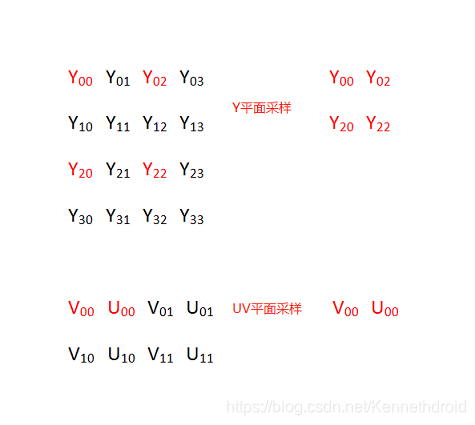

# YUV 图像的基本处理


## YUV 的由来

YUV 是一种色彩编码模型，也叫做 YCbCr，其中 “Y” 表示明亮度（Luminance），“U” 和 “V” 分别表示色度（Chrominance）和浓度（Chroma）。


YUV 色彩编码模型，其设计初衷为了解决彩色电视机与黑白电视的兼容问题，利用了人类眼睛的生理特性（对亮度敏感，对色度不敏感），允许降低色度的带宽，降低了传输带宽。

在计算机系统中应用尤为广泛，利用 YUV 色彩编码模型可以降低图片数据的内存占用，提高数据处理效率。

另外，YUV 编码模型的图像数据一般不能直接用于显示，还需要将其转换为 RGB（RGBA） 编码模型，才能够正常显示图像。


## YUV 几种常见采样方式


YUV 图像主流的采样方式有三种：

YUV 4：4：4，每一个 Y 分量对于一对 UV 分量，每像素占用 （Y + U + V = 8 + 8 + 8 = 24bits）3 字节
YUV 4：2：2，每两个 Y 分量共用一对 UV 分量，每像素占用 （Y + 0.5U + 0.5V = 8 + 4 + 4 = 16bits）2 字节
YUV 4：2：0，每四个 Y 分量共用一对 UV 分量，每像素占用 （Y + 0.25U + 0.25V = 8 + 2 + 2 = 12bits）1.5 字节

其中最常用的采样方式是 YUV422 和 YUV420 。

YUV 格式也可按照 YUV 三个分量的组织方式分为打包（Packed）格式和平面格式（Planar）。

打包（Packed）格式：每个像素点的 YUV 分量是连续交叉存储的，如 YUYV 格式；
平面格式（Planar）：YUV 图像数据的三个分量分别存放在不同的矩阵中，这种格式适用于采样，如 YV12、YU12 格式；


YUV 几种常用的格式
下面以一幅分辨率为 4x4 的 YUV 图为例，说明在不同 YUV 格式下的存储方式（括号内范围表示内存地址索引范围，默认以下不同格式图片存储使用的都是连续内存）。

YUYV （YUV422 采样方式）
YUYV 格式的存储格式

```
(0  ~  7)  Y00  U00  Y01  V00  Y02  U01   Y03  V01
(8  ~ 15)  Y10  U10  Y11  V10  Y12  U11   Y13  V11
(16 ~ 23)  Y20  U20  Y21  V20  Y22  U21   Y23  V21
(24 ~ 31)  Y30  U30  Y31  V30  Y32  U31   Y33  V31
```


一幅 720P (1280x720分辨率) 的图片，使用 YUV422 采样时占用存储大小为：

Y 分量：1280 * 720  = 921600 字节
U 分量：1280 * 720 * 0.5 = 460800 字节
V 分量：1280 * 720 * 0.5 = 460800 字节
总大小：Y 分量 + U 分量 + V 分量 = （1280 * 720 + 1280 * 720 * 0.5 * 2） / 1024 / 1024 = 1.76 MB 

由上面计算可以看出 YUV422 采样的图像比 RGB 模型图像节省了 1/3 的存储空间。，在传输时占用的带宽也会随之减小。

YV12/YU12 (YUV420 采样方式)
YV12/YU12 也属于 YUV420P ，即 YUV420 采样方式的平面模式，YUV 三个分量分别存储于 3 个不同的矩阵（平面）。


YV12 格式的存储方式

```
(0  ~  3) Y00  Y01  Y02  Y03  
(4  ~  7) Y10  Y11  Y12  Y13  
(8  ~ 11) Y20  Y21  Y22  Y23
(12 ~ 15) Y30  Y31  Y32  Y33

(16 ~ 17) V00  V01
(18 ~ 19) V10  V11

(20 ~ 21) U00  U01
(22 ~ 23) U10  U11
```


YU12（也称 I420） 格式的存储方式

```
(0  ~  3) Y00  Y01  Y02  Y03
(4  ~  7) Y10  Y11  Y12  Y13
(8  ~ 11) Y20  Y21  Y22  Y23
(12 ~ 15) Y30  Y31  Y32  Y33

(16 ~ 17) U00  U01
(18 ~ 19) U10  U11

(20 ~ 21) V00  V01
(22 ~ 23) V10  V11
```


一幅 720P (1280x720分辨率) 的图片，使用 YUV420 采样时（格式 YV12/YU12 ）占用存储大小为：

```
Y 分量：1280 * 720  = 921600 字节
U 分量：1280 * 720 * （1/4） = 230400 字节
V 分量：1280 * 720 * （1/4） = 230400 字节
总大小：Y 分量 + U 分量 + V 分量 = （1280 * 720 + 1280 * 720 * （1/4）* 2） / 1024 / 1024 = 1.32 MB 
```


由上面计算可以看出 YUV420 采样（格式 YV12/YU12 ）的图像比 RGB 模型图像节省了 1/2 的存储空间。

NV21/NV12 (YUV420 采样方式)
NV21/NV12 属于 YUV420SP ，YUV420SP 格式有 2 个平面，Y 分量存储于一个平面，UV 分量交错存储于另一个平面。


NV21 格式的存储方式

```
(0  ~  3) Y00  Y01  Y02  Y03  
(4  ~  7) Y10  Y11  Y12  Y13  
(8  ~ 11) Y20  Y21  Y22  Y23  
(12 ~ 15) Y30  Y31  Y32  Y33  

(16 ~ 19) V00  U00  V01  U01 
(20 ~ 23) V10  U10  V11  U11
```


NV12 格式的存储方式

```
(0  ~  3) Y00  Y01  Y02  Y03
(4  ~  7) Y10  Y11  Y12  Y13
(8  ~ 11) Y20  Y21  Y22  Y23
(12 ~ 15) Y30  Y31  Y32  Y33

(16 ~ 19) U00  V00  U01  V01 
(20 ~ 23) U10  V10  U11  V11
```


NV21 与 NV12 格式的区别仅在于 UV 分量排列的先后顺序不同。

一幅 720P (1280x720分辨率) 的图片，使用 YUV420 采样时（格式 NV21/NV12 ）占用存储大小为：

```
Y 分量：1280 * 720  = 921600 字节
UV 分量：1280 * 720 * （1/2） = 460800 字节
总大小：Y 分量 + UV 分量 = （1280 * 720 + 1280 * 720 * （1/2）） / 1024 / 1024 = 1.32 MB 
```


由上面计算可以看出 YUV420 采样（格式 NV21/NV12 ）的图像比 RGB 模型图像也节省了 1/2 的存储空间。


## YUV 图像的基本操作

下面以最常用的 NV21 图为例介绍其旋转、缩放和剪切的基本方法。

YUV 图片的定义、加载、保存及内存释放。

```c
//YUV420SP  NV21 or NV12 

typedef struct
{
	int width;                 // 图片宽
	int height;                // 图片高 
	unsigned char  *yPlane;    // Y 平面指针
	unsigned char  *uvPlane;   // UV 平面指针
} YUVImage;

void LoadYUVImage(const char *filePath, YUVImage *pImage)
{
	FILE *fpData = fopen(filePath, "rb+");
	if (fpData != NULL)
	{
		fseek(fpData, 0, SEEK_END);
		int len = ftell(fpData);
		pImage->yPlane = malloc(len);
		fseek(fpData, 0, SEEK_SET);
		fread(pImage->yPlane, 1, len, fpData);
		fclose(fpData);
		fpData = NULL;
	}
	pImage->uvPlane = pImage->yPlane + pImage->width * pImage->height;
}

void SaveYUVImage(const char *filePath, YUVImage *pImage)
{
	FILE *fp = fopen(filePath, "wb+");
	if (fp)
	{
		fwrite(pImage->yPlane, pImage->width * pImage->height, 1, fp);
		fwrite(pImage->uvPlane, pImage->width * (pImage->height >> 1), 1, fp);
	}
}

void ReleaseYUVImage(YUVImage *pImage)
{
	if (pImage->yPlane)
	{
		free(pImage->yPlane);
		pImage->yPlane = NULL;
		pImage->uvPlane = NULL;
	}
}
```


NV21 图片旋转
以顺时针旋转 90 度为例，Y 和 UV 两个平面分别从平面左下角进行纵向拷贝，需要注意的是每对 UV 分量作为一个整体进行拷贝。 以此类比，顺时针旋转 180 度时从平面右下角进行横向拷贝，顺时针旋转 270 度时从平面右上角进行纵向拷贝。


```
Y00  Y01  Y02  Y03              Y30  Y20  Y10  Y00
Y10  Y11  Y12  Y13    旋转90度   Y31  Y21  Y11  Y01
Y20  Y21  Y22  Y23    ----->    Y32  Y22  Y12  Y02
Y30  Y31  Y32  Y33              Y33  Y23  Y13  Y03

V00  U00  V01  U01    ----->    V10  U10  V00  U00
V10  U10  V11  U11              V11  U11  V01  U01
```


代码实现：

```c
//angle 90,  270, 180
void RotateYUVImage(YUVImage *pSrcImg, YUVImage *pDstImg, int angle)
{
	int yIndex = 0;
	int uvIndex = 0;
	switch (angle)
	{
	case 90:
	{
		// y plane
		for (int i = 0; i < pSrcImg->width; i++) {
			for (int j = 0; j < pSrcImg->height; j++) {
				*(pDstImg->yPlane + yIndex) = *(pSrcImg->yPlane + (pSrcImg->height - j - 1) * pSrcImg->width + i);
				yIndex++;
			}
		}

		//uv plane
		for (int i = 0; i < pSrcImg->width; i += 2) {
			for (int j = 0; j < pSrcImg->height / 2; j++) {
				*(pDstImg->uvPlane + uvIndex) = *(pSrcImg->uvPlane + (pSrcImg->height / 2 - j - 1) * pSrcImg->width + i);
				*(pDstImg->uvPlane + uvIndex + 1) = *(pSrcImg->uvPlane + (pSrcImg->height / 2 - j - 1) * pSrcImg->width + i + 1);
				uvIndex += 2;
			}
		}
	}
	break;
	case 180:
	{
		// y plane
		for (int i = 0; i < pSrcImg->height; i++) {
			for (int j = 0; j < pSrcImg->width; j++) {
				*(pDstImg->yPlane + yIndex) = *(pSrcImg->yPlane + (pSrcImg->height - 1 - i) * pSrcImg->width + pSrcImg->width - 1 - j);
				yIndex++;
			}
		}

		//uv plane
		for (int i = 0; i < pSrcImg->height / 2; i++) {
			for (int j = 0; j < pSrcImg->width; j += 2) {
				*(pDstImg->uvPlane + uvIndex) = *(pSrcImg->uvPlane + (pSrcImg->height / 2 - 1 - i) * pSrcImg->width + pSrcImg->width - 2 - j);
				*(pDstImg->uvPlane + uvIndex + 1) = *(pSrcImg->uvPlane + (pSrcImg->height / 2 - 1 - i) * pSrcImg->width + pSrcImg->width - 1 - j);
				uvIndex += 2;
			}
		}
	}
	break;
	case 270:
	{
		// y plane
		for (int i = 0; i < pSrcImg->width; i++) {
			for (int j = 0; j < pSrcImg->height; j++) {
				*(pDstImg->yPlane + yIndex) = *(pSrcImg->yPlane + j * pSrcImg->width + (pSrcImg->width - i - 1));
				yIndex++;
			}
		}

		//uv plane
		for (int i = 0; i < pSrcImg->width; i += 2) {
			for (int j = 0; j < pSrcImg->height / 2; j++) {
				*(pDstImg->uvPlane + uvIndex + 1) = *(pSrcImg->uvPlane + j * pSrcImg->width + (pSrcImg->width - i - 1));
				*(pDstImg->uvPlane + uvIndex) = *(pSrcImg->uvPlane + j * pSrcImg->width + (pSrcImg->width - i - 2));
				uvIndex += 2;
			}
		}
	}
	break;
	default:
		break;
	}
}
```


## NV21 图片缩放

将 2x2 的 NV21 图缩放成 4x4 的 NV21 图，原图横向每个像素的 Y 分量向右拷贝 1（放大倍数-1）次，纵向每列元素以列为单位向下拷贝 1（放大倍数-1）次.


将 4x4 的 NV21 图缩放成 2x2 的 NV21 图，实际上就是进行采样。



代码实现：

```c
void ResizeYUVImage(YUVImage *pSrcImg, YUVImage *pDstImg)
{
	if (pSrcImg->width > pDstImg->width)
	{
		//缩小
		int x_scale = pSrcImg->width / pDstImg->width;
		int y_scale = pSrcImg->height / pDstImg->height;

		for (size_t i = 0; i < pDstImg->height; i++)
		{
			for (size_t j = 0; j < pDstImg->width; j++)
			{
				*(pDstImg->yPlane + i*pDstImg->width + j) = *(pSrcImg->yPlane + i * y_scale *pSrcImg->width + j * x_scale);
			}
		}

		for (size_t i = 0; i < pDstImg->height / 2; i++)
		{
			for (size_t j = 0; j < pDstImg->width; j += 2)
			{
				*(pDstImg->uvPlane + i*pDstImg->width + j) = *(pSrcImg->uvPlane + i * y_scale *pSrcImg->width + j * x_scale);
				*(pDstImg->uvPlane + i*pDstImg->width + j + 1) = *(pSrcImg->uvPlane + i * y_scale *pSrcImg->width + j * x_scale + 1);
			}
		}
	}
	else
	{
		// 放大
		int x_scale = pDstImg->width / pSrcImg->width;
		int y_scale = pDstImg->height / pSrcImg->height;

		for (size_t i = 0; i < pSrcImg->height; i++)
		{
			for (size_t j = 0; j < pSrcImg->width; j++)
			{
				int yValue = *(pSrcImg->yPlane + i *pSrcImg->width + j);
				for (size_t k = 0; k < x_scale; k++)
				{
					*(pDstImg->yPlane + i * y_scale * pDstImg->width + j  * x_scale + k) = yValue;
				}
			}

			unsigned char  *pSrcRow = pDstImg->yPlane + i * y_scale * pDstImg->width;
			unsigned char  *pDstRow = NULL;
			for (size_t l = 1; l < y_scale; l++)
			{
				pDstRow = (pDstImg->yPlane + (i * y_scale + l)* pDstImg->width);
				memcpy(pDstRow, pSrcRow, pDstImg->width * sizeof(unsigned char ));
			}
		}

		for (size_t i = 0; i < pSrcImg->height / 2; i++)
		{
			for (size_t j = 0; j < pSrcImg->width; j += 2)
			{
				int vValue = *(pSrcImg->uvPlane + i *pSrcImg->width + j);
				int uValue = *(pSrcImg->uvPlane + i *pSrcImg->width + j + 1);
				for (size_t k = 0; k < x_scale * 2; k += 2)
				{
					*(pDstImg->uvPlane + i * y_scale * pDstImg->width + j  * x_scale + k) = vValue;
					*(pDstImg->uvPlane + i * y_scale * pDstImg->width + j  * x_scale + k + 1) = uValue;
				}
			}

			unsigned char  *pSrcRow = pDstImg->uvPlane + i * y_scale * pDstImg->width;
			unsigned char  *pDstRow = NULL;
			for (size_t l = 1; l < y_scale; l++)
			{
				pDstRow = (pDstImg->uvPlane + (i * y_scale + l)* pDstImg->width);
				memcpy(pDstRow, pSrcRow, pDstImg->width * sizeof(unsigned char ));
			}
		}
	}
}
```


## NV21 图片裁剪

图例中将 6x6 的 NV21 图按照横纵坐标偏移量为（2，2）裁剪成 4x4 的 NV21 图。


代码实现：

```c
// x_offSet ，y_offSet % 2 == 0
void CropYUVImage(YUVImage *pSrcImg, int x_offSet, int y_offSet, YUVImage *pDstImg)
{
    // 确保裁剪区域不存在内存越界
	int cropWidth = pSrcImg->width - x_offSet;
	cropWidth = cropWidth > pDstImg->width ? pDstImg->width : cropWidth;
	int cropHeight = pSrcImg->height - y_offSet;
	cropHeight = cropHeight > pDstImg->height ? pDstImg->height : cropHeight;
	
	unsigned char  *pSrcCursor = NULL;
	unsigned char  *pDstCursor = NULL;

	//crop yPlane
	for (size_t i = 0; i < cropHeight; i++)
	{
		pSrcCursor = pSrcImg->yPlane + (y_offSet + i) * pSrcImg->width + x_offSet;
		pDstCursor = pDstImg->yPlane + i * pDstImg->width;
		memcpy(pDstCursor, pSrcCursor, sizeof(unsigned char ) * cropWidth);
	}

	//crop uvPlane
	for (size_t i = 0; i < cropHeight / 2; i++)
	{
		pSrcCursor = pSrcImg->uvPlane + (y_offSet / 2 + i) * pSrcImg->width + x_offSet;
		pDstCursor = pDstImg->uvPlane + i * pDstImg->width;
		memcpy(pDstCursor, pSrcCursor, sizeof(unsigned char ) * cropWidth);
	}
}
```


## Sample 测试

原图


测试代码

```c
void main()
{
	YUVImage srcImg = { 0 };
	srcImg.width = 840;
	srcImg.height = 1074;
	LoadYUVImage("IMG_840x1074.NV21", &srcImg);

	YUVImage rotateDstImg = { 0 };
	rotateDstImg.width = 1074;
	rotateDstImg.height = 840;
	rotateDstImg.yPlane = malloc(rotateDstImg.width * rotateDstImg.height*1.5);
	rotateDstImg.uvPlane = rotateDstImg.yPlane + rotateDstImg.width * rotateDstImg.height;

	RotateYUVImage(&srcImg, &rotateDstImg, 270);

	SaveYUVImage("D:\\material\\IMG_1074x840_270.NV21", &rotateDstImg);

	RotateYUVImage(&srcImg, &rotateDstImg, 90);

	SaveYUVImage("D:\\material\\IMG_1074x840_90.NV21", &rotateDstImg);

	rotateDstImg.width = 840;
	rotateDstImg.height = 1074;
	RotateYUVImage(&srcImg, &rotateDstImg, 180);

	SaveYUVImage("D:\\material\\IMG_840x1074_180.NV21", &rotateDstImg);


	YUVImage resizeDstImg = { 0 };
	resizeDstImg.width = 420;
	resizeDstImg.height = 536;
	resizeDstImg.yPlane = malloc(resizeDstImg.width * resizeDstImg.height*1.5);
	resizeDstImg.uvPlane = resizeDstImg.yPlane + resizeDstImg.width * resizeDstImg.height;

	ResizeYUVImage(&srcImg, &resizeDstImg);

	SaveYUVImage("D:\\material\\IMG_420x536_Resize.NV21", &resizeDstImg);

	YUVImage cropDstImg = { 0 };
	cropDstImg.width = 300;
	cropDstImg.height = 300;
	cropDstImg.yPlane = malloc(cropDstImg.width * cropDstImg.height*1.5);
	cropDstImg.uvPlane = cropDstImg.yPlane + cropDstImg.width * cropDstImg.height;

	CropYUVImage(&srcImg, 100, 500, &cropDstImg);

	SaveYUVImage("D:\\material\\IMG_300x300_crop.NV21", &cropDstImg);

	ReleaseYUVImage(&srcImg);
	ReleaseYUVImage(&rotateDstImg);
	ReleaseYUVImage(&resizeDstImg);
	ReleaseYUVImage(&cropDstImg);
}
```

测试结果


参考
https://blog.csdn.net/leixiaohua1020/article/details/50534150
https://cloud.tencent.com/developer/article/1442041


## Camera2中NV21和NV12获取

1、Image介绍
2、YUV数据和格式理解
3、获取NV21格式数据
1、Image介绍
Image类允许应用通过一个或多个ByteBuffers直接访问Image的像素数据， ByteBuffer包含在Image.Plane类中，同时包含了这些像素数据的配置信息。因为是作为提供raw数据使用的，Image不像Bitmap类可以直接填充到UI上使用。

因为Image的生产消费是跟硬件直接挂钩的，所以为了效率起见，Image如果不被使用了应该尽快的被销毁掉。如果Image的数量到达了maxImages，不关闭之前老的Image，新的Image就不会继续生产。
image的data被存储在Image类里面，构造参数maxImages控制了最多缓存几帧，新的images通过ImageReader的surface发送给ImageReader，类似一个队列，需要通过acquireLatestImage()或者acquireNextImage()方法取出Image。如果ImageReader获取并销毁图像的速度小于数据源产生数据的速度，那么就会丢帧。

```c
...
          //构造一个ImageReader的实例，设置宽高，输出格式，缓存max数量
           mImageReader = ImageReader.newInstance(previewSize.getWidth(), previewSize.getHeight(), ImageFormat.JPEG, 2);
           mImageReader.setOnImageAvailableListener(mOnImageAvailableListener, mCameraHandler);
...
private ImageReader.OnImageAvailableListener mOnImageAvailableListener = new ImageReader.OnImageAvailableListener() {
        @Override
        public void onImageAvailable(ImageReader reader) {
            Image image = reader.acquireNextImage();
            ...
            image.close();
        }
    };
```


部分重要API:

acquireLatestImage() - 从ImageReader队列中获取最新的一帧Image，并且将老的Image丢弃，如果没有新的可用的Image则返回null。此操作将会从ImageReader中获取所有可获取到的Images，并且关闭除了最新的Image之外的Image。此功能大多数情况下比acquireNextImage更推荐使用，更加适用于视频实时处理。
需要注意的是maxImages应该至少为2，因为丢弃除了最新的之外的所有帧需要至少两帧。换句话说，(maxImages - currentAcquiredImages < 2)的情况下，丢帧将会不正常。
acquireNextImage() - 从ImageReader的队列中获取下一帧Image，如果没有新的则返回null。
Android推荐我们使用acquireLatestImage来代替使用此方法，因为它会自动帮我们close掉旧的Image，并且能让效率比较差的情况下能获取到最新的Image。acquireNextImage更推荐在批处理或者后台程序中使用，不恰当的使用本方法将会导致得到的images出现不断增长的延迟。
close() - 释放所有跟此ImageReader关联的资源。调用此方法后，ImageReader不会再被使用，再调用它的方法或者调用被acquireLatestImage或acquireNextImage返回的Image会抛出IllegalStateException，尝试读取之前Plane#getBuffer返回的ByteBuffers将会导致不可预测的行为。
newInstance(int width, int height, int format, int maxImages) - 创建新的reader以获取期望的size和format的Images。maxImages决定了ImageReader能同步返回的最大的Image的数量，申请越多的buffers会耗费越多的内存空间，使用合适的数量很重要。
format ：reader生产的Image的格式，必须是ImageFormat或PixelFormat中的常量，并不是所有的formats都会被支持，比如ImageFormat.NV21就是不支持的，Android一般都会支持ImageFormat_420_888。
maxImages：缓存的最大帧数，必须大于0。


## 2、YUV数据和格式理解

camera2设置为YUV420_888时可以得到ImageReader会得到三个Plane，分别对应y,u,v，每个Plane都有自己的规格。介绍两个Plane重要参数：

getRowStride
getRowStride是每一行数据相隔的间隔，存储图像每行数据的宽度。getRowStride并不一定等于camera预览的宽度，由于系统硬件等各方面的原因，存储数据时需要对齐，比如图像的宽为98字节，但是实际存储的过程中一行图像数据可能用100字节。此时image.rowStride=100，而image.getWidth=98。
getPixelStride
代表行内两个连续颜色值之间的距离，假如是步长为2，意味索引间隔的原色才是有效的元素，中间间隔的元素其实是没有意义的。而Android中确实也是这么做的，比如某个plane[1]（U分量）的步长是2，那么数组下标0,2,4,6,…的数据就是U分量的，而中间间隔的元素Android会补上V分量，也就是会是UVUVUV…这样去分布。但是当最后一个U分量出现后，最后一个没有意义的元素Android就不补了，也就是最后的V分量就不会补了，即是这样分布：UVUVUV…UVUVU。
YUV_420_888的存储又分YUV420分为Planar格式（P）和Semi-Planar格式（SP）两大类，最主要的区别是：
  Planar格式（P）按平面分开放，先把U存放完后，再存放V。U是连续的，V也是连续的
即：YYYYYUUUUUVVVV
  Semi-Planar格式（SP）只有Y数据一个平面，UV数据合用一个平面。
即：YYYYYUVUVUV…
在使用Android Api以下函数时，得到平面的SP格式:

```c
 mImageReader = ImageReader.newInstance(mPreviewSize.getWidth(), mPreviewSize.getHeight(),
                        ImageFormat.YUV_420_888, 2);
```

对于SP格式，得到的图像有两种典型类型：rowStride = Width的，（以6*4的图像进行说明）即：

另一种是rowStride != Width的，即


## 3、获取NV21格式数据

nv21图像数组的长度一定是长×宽×3/2，其中y数据的大小是长×宽（因为每个像素都有一个y值），接着所有像素的u,v值总共有(长×宽×1/2)个。
通过image.getPlanes()[1].getBuffer()得到的Plane就是一个包含像素所有u,v值的缓存区域，它的大小就是长×宽×1/2。
注意事项:

获得真正消除的padding的ybuffer和ubuffer。
将y数据和uv的交替数据(除去最后一个v值）赋值给nv21。
最后一个像素值的u值是缺失的，因此需要从u平面取一下。

```c
   public static byte[] YUVToNV21_NV12(Image image, String type) {
   		int w = image.getWidth(), h = image.getHeight();
   		byte[] nv21 = new byte[w * h * 3 / 2];
   		Image.Plane[] planes = image.getPlanes();
   		int remaining0 = planes[0].getBuffer().remaining();
        int remaining1 = planes[1].getBuffer().remaining();      
        int remaining2 = planes[2].getBuffer().remaining();
		int rowOffest = planes[2].getRowStride();
		//分别准备三个数组接收YUV分量
		byte[] yRawSrcBytes = new byte[remaining0];
        byte[] uRawSrcBytes = new byte[remaining1];
        byte[] vRawSrcBytes = new byte[remaining2];
        planes[0].getBuffer().get(yRawSrcBytes);
        planes[1].getBuffer().get(uRawSrcBytes);
        planes[2].getBuffer().get(vRawSrcBytes);

		//根据每个分量的size生成byte数组
		byte[] ySrcBytes = new byte[w * h];
        byte[] uSrcBytes = new byte[w * h / 2 - 1];
        byte[] vSrcBytes = new byte[w * h / 2 - 1];
        if (type.equals("NV12")) {
        	 for (int row = 0; row < h; row++) {
                  //源数组每隔 rowOffest 个bytes 拷贝 w 个bytes到目标数组
                  System.arraycopy(yRawSrcBytes, rowOffest * row, ySrcBytes, w * row, w);
                  //y执行两次，uv执行一次
                  if (row % 2 == 0) {
                      //最后一行需要减一
                       if (row == h - 2) {
                           System.arraycopy(uRawSrcBytes, rowOffest * row / 2, uSrcBytes, w * row / 2, w - 1);
                        } else {
                           System.arraycopy(uRawSrcBytes, rowOffest * row / 2, uSrcBytes, w * row / 2, w);
                        }
                  }
             }
             //yuv拷贝到一个数组里面
             System.arraycopy(ySrcBytes, 0, nv21, 0, w * h);
             System.arraycopy(uSrcBytes, 0, nv21, w * h, w * h / 2 - 1);
   	  	} else {
   	  		for (int row = 0; row < h; row++) {
                  //源数组每隔 rowOffest 个bytes 拷贝 w 个bytes到目标数组
                  System.arraycopy(yRawSrcBytes, rowOffest * row, ySrcBytes, w * row, w);
                  //y执行两次，uv执行一次
                  if (row % 2 == 0) {
                      //最后一行需要减一
                       if (row == h - 2) {
                           System.arraycopy(vRawSrcBytes, rowOffest * row / 2, vSrcBytes, w * row / 2, w - 1);
                        } else {
                           System.arraycopy(vRawSrcBytes, rowOffest * row / 2, vSrcBytes, w * row / 2, w);
                        }
                  }
             }
             //yuv拷贝到一个数组里面
             System.arraycopy(ySrcBytes, 0, nv21, 0, w * h);
             System.arraycopy(vSrcBytes, 0, nv21, w * h, w * h / 2 - 1);
   	  	}
   	  	return nv21;
 }
```

