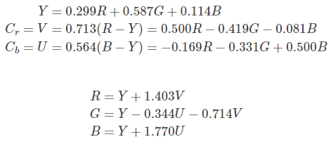

# NV21图像旋转，镜像，转rgba代码分析，性能优化


## 业务场景介绍

  最近也是在做Android相机这一块，使用的API是Android Camera2。熟悉Android 相机开发的小伙伴都知道Android Camera开发的过程和NV21打交道是必不可少的。上一篇文章相机NV21数据获取详细介绍了如何从将从相机得到的Image转换成NV21，得到了NV21数据后，当然就是要和它打交道了～
  举个例子，由于硬件系统，相机的Api，以及前后置相机的差异，我们得到数据有可能是需要调整的。比如从相机的前置摄像头拿到数据时，我们可能需要对相机进行镜像，又或者拿到的数据本身就是倒着的，我们要将它旋转９０°等。
  其实网上关于NV21数据的旋转，镜像和转换RGBA的数据大多数都有，但是我们很多情况不能使用拿来主义直接COPY。我们需要根据我们自己的场景，选择并修改代码，才能达到最好的效果。为什么呢？
  举例来说：当你只是需要对图像做镜像操作，那么你就应该使用我介绍的中心翻转法而不应该使用逐像素法，因为它的耗时比逐像素遍历法的一半；
  当你需要对图像旋转９０°再镜像时：你可能需要自己修改代码来达到性能的最佳。当然你也可以从网上找代码，首先对图像进行旋转９０°，再去做一个镜像，这样做只是效率大大折扣而已。
  如果直接拿网上的代码，并且不同原理，当你的适用场景变了的时候，你可能没法应对。另外更重要的一点，网上的代码不一定适合你的运用场景，直接拿过来用可能导致性能损耗。
  本文首先大致讲解各种操作的方法，以及它的性能。然后分析当需要组合操作时，我们应该如何修改代码来降低性能的损耗。最后对代码进行了一个汇总，对于各个场景给出一个应该使用的代码，如果不想看原理的同学可以直接去取（当然还是希望大家能够懂原理，能够自己去修改，这样才能够应对不同的场景）。本文会对关键的算法进行一个耗时的统计，使用的手机是小米12，图像的分辨率大小为1280*720.


## NV21数据旋转

  NV21数据的旋转，其实就是一个数组的旋转。就是类似于leetcode 48题 旋转图像，我们要将一个二维数据的数据进行旋转。不同的地方有两点：1、NV21数据的数据是nm形式的矩阵，而题中给出的数据是nn型的，因此官方题解中的原地旋转法和用翻转代替旋转法就不可以用了，我们只能使用逐像素遍历法了。2、对于NV21的数据来说，它是先由图像像素点的Y值排列，然后由像素点的UV序列排列而成的。我们旋转的时候需要分开来转，首先对Y序列旋转，然后将UV序列旋转，再将它们组合起来。
  对于我这里讲的不太明白的小伙伴可以先去看一下我上一篇文章相机NV21数据获取了解一下图像NV21的数据格式。这样有助于理解代码。


### 逐像素遍历法

  图像顺时针旋转90°。代码比较好理解，首先是对Y序列进行旋转，也就是对应着Rotate the Y luma部分。第二部分是对UV数据进行旋转，也就是对应着Rotate the U and V color components。将两个部分依次排列也就得到了最后旋转的结果。

```java
 private byte[] rotateYUVDegree90(byte[] data, int imageWidth, int imageHeight) {
        byte[] yuv = new byte[imageWidth * imageHeight * 3 / 2];
        // Rotate the Y luma
        int i = 0;
        for (int x = 0; x < imageWidth; x++) {
            for (int y = imageHeight - 1; y >= 0; y--) {
                yuv[i] = data[y * imageWidth + x];
                i++;
            }
        }
        // Rotate the U and V color components
        for (int x = 0; x < imageWidth; x = x + 2) {
            for (int y = imageHeight / 2 - 1; y >=0; y--) {
                yuv[i] = data[(imageWidth * imageHeight) + (y * imageWidth) + x];
                i++;
                yuv[i] = data[(imageWidth * imageHeight) + (y * imageWidth) + (x + 1)];
                i++;
            }
        }
        return yuv;
    }
```


## NV21数据镜像

### 逐像素遍历法

  逐像素遍历法，和前面图像的旋转90°思路一样的，只不过旋转前和旋转后图像对应的位置关系发生了变化。你可以看到，两个代码都是相似，都是先对y通道处理，在对uv通道处理，两次循环，不同的地方不过在于如何处理它们的映射关系罢了。也就是在 yuv[i] 的赋值语句中，data数组内的下标不同而已。此处代码用时1.82ms。

```java
    private byte[] MirrorYUV(byte[] data, int imageWidth, int imageHeight) {
        byte[] yuv = new byte[imageWidth * imageHeight * 3 / 2];
        // Mirror the Y luma
        int i = 0;

        for (int y = 0; y < imageHeight; y++) {
            for (int x = imageWidth-1; x >=0; x--) {
                yuv[i] = data[y * imageWidth + x];
                i++;
            }
        }
        // Rotate the U and V color components
        for (int y = 0; y < imageHeight/2; y++) {
            for (int x = imageWidth-1; x >=0; x= x-2) {
                yuv[i] = data[(imageWidth * imageHeight) + (y * imageWidth) + x - 1];
                i++;
                yuv[i] = data[(imageWidth * imageHeight) + (y * imageWidth) + x];
                i++;
            }
        }
        return yuv;
    }

```


### 中心翻转法

  由于镜像操作的特殊性，镜像后的图像和数据其实就是图像按照中心线进行了左右的对调。利用这一个特征，我们可以对算法进行简化，也就是只遍历图像的前半部分，然后让前半部分后后半部分进项交换，这样遍历的次数就少了一半。算法用时0.8ms。

```java
private byte[] NV21_mirror_center(byte[] nv21_data, int width, int height)
    {
        int i;
        int left, right;
        byte temp;
        int startPos = 0;
        // mirror Y
        for (i = 0; i < height; i++)
        {
            left  = startPos;
            right = startPos + width - 1;
            while (left < right) {
                temp = nv21_data[left];
                nv21_data[left]  = nv21_data[right];
                nv21_data[right] = temp;
                left ++;
                right--;
             }
            startPos += width;
        }
        // mirror U and V
        int offset = width * height;
        startPos = 0;
        for (i = 0; i < height / 2; i++)
        {
            left  = offset + startPos;
            right = offset + startPos + width - 2;
            while (left < right){
                temp = nv21_data[left ];
                nv21_data[left ] = nv21_data[right];
                nv21_data[right] = temp;
                left ++;
                right--;
                temp = nv21_data[left ];
                nv21_data[left ] = nv21_data[right];
                nv21_data[right] = temp;
                left ++;
                right--;
            }
            startPos += width;
        }
        return nv21_data;
    }

```


  显然我们可以看出，**当你只用对图像进行镜像操作时，你肯定不应该选择逐像素遍历法，而要使用中心翻转法，否则会让你的执行效率直接降低一半多。**


## NV21转RGB/RGBA数据

### 逐像素遍历法

  NV21图像转RGB图像，其实就是需要将每一个图像的像素点的RGB值通过NV21数组中的数据计算出来，然后排列成数组。所以算法要做的是遍历图像每一个像素点，找到像素点对应的n,u,v的值，根据rgb和nuv的转换公式计算出该像素点的rgb的值，然后赋给数组就行。具体图像yuv空间和Rgb空间的转换原理和公式可以看一下YUV 格式与 RGB 格式的相互转换公式及C++ 代码或者其它的文章。我将讲解简单写在代码注释里。

```java
 public void NV212BGRA(byte[]input , int width , int height , byte[]output, boolean isRGB)
  {
      int nvOff = width * height ;
      int  i, j, yIndex = 0;
      int y, u, v;
      int r, g, b, nvIndex = 0;
      //遍历图像每一个像素点，依次计算r,g,b的值。
      for(i = 0; i < height; i++){
          for(j = 0; j < width; j ++,++yIndex){
          //对于位置为i,j的像素，找到对应的y,u,v的值
              nvIndex = (i / 2)  * width + j - j % 2;
              y = input[yIndex] & 0xff;
              u = input[nvOff + nvIndex ] & 0xff;
              v = input[nvOff + nvIndex + 1] & 0xff;

              //对于位置为i,j的像素，根据其yuv的值计算出r,g,b的值
              r = y + ((351 * (v-128))>>8);  //r
              g = y - ((179 * (v-128) + 86 * (u-128))>>8); //g
              b = y + ((443 * (u-128))>>8); //b

            //要求的rgb值是byte类型，范围是0--255，消除越界的值。
              r = ((r>255) ?255 :(r<0)?0:r);
              g = ((g>255) ?255 :(g<0)?0:g);
              b = ((b>255) ?255 :(b<0)?0:b);
              // 对结果rgb/bgr的值赋值，a通道表示透明度，这里都给255（根据你自己的场景设置）
              //由于rgba格式和bgra格式只是r,g,b的顺序不同，因此这里通过bool值判断，既可以得到rgba的格式也可以得到bgra格式的数组。
              if(isRGB){
                  output[yIndex*4 + 0] = (byte) b;
                  output[yIndex*4 + 1] = (byte) g;
                  output[yIndex*4 + 2] = (byte) r;
                  output[yIndex*4 + 3] = (byte) 255;
              }else{
                  output[yIndex*4 + 0] = (byte) r;
                  output[yIndex*4 + 1] = (byte) g;
                  output[yIndex*4 + 2] = (byte) b;
                  output[yIndex*4 + 3] = (byte) 255;
              }
          }
      }
  }

```

 

## NV21组合操作（旋转，镜像，转RGB/RGBA）

  重点其实在于组合操作了。当你的图像需要将上述三个步骤结合起来的时候，会怎样呢？举个例子，你需要NV21的数据顺时针旋转90°然后转成RGB，你会怎么做呢？先旋转再转RGB？这样就有点愚笨了。其实你注意到了吗，旋转，镜像，转rgb都是可以逐像素去做的。这三种操作的组合，也是可以逐像素做的。不管是怎样的组合，你只要对像素所有点进行一次遍历即可。重点是找到变换前后像素的映射关系。下面讲两个操作，NV21数组顺时针转90度+转换RGBA数据和NV21数组顺时针转270度+镜像+转换成RGBA数据。这两个操作，一次遍历就可以了，不要分两步实现，并且代码几乎完全一样。

### NV21数组顺时针转90度+转换RGBA数据

```java
public void NV21rRotate90Degree2BGRA(byte[]input , int width , int height , byte[]output, boolean isRGB)
  {
      int nvOff = width * height ;
      int  i, j, yIndex = 0;
      int y, u, v;
      int r, g, b, nvIndex = 0;
      for(i = 0; i < height; i++){
          for(j = 0; j < width; j ++,++yIndex){
              nvIndex = (i / 2)  * width + j - j % 2;
              y = input[yIndex] & 0xff;
              u = input[nvOff + nvIndex ] & 0xff;
              v = input[nvOff + nvIndex + 1] & 0xff;
              // yuv to rgb
              r = y + ((351 * (v-128))>>8);  //r
              g = y - ((179 * (v-128) + 86 * (u-128))>>8); //g
              b = y + ((443 * (u-128))>>8); //b

              r = ((r>255) ?255 :(r<0)?0:r);
              g = ((g>255) ?255 :(g<0)?0:g);
              b = ((b>255) ?255 :(b<0)?0:b);
              int index = j*height+(height - i)-1;
              if(isRGB){
                  output[index*4 + 0] = (byte) b;
                  output[index*4 + 1] = (byte) g;
                  output[index*4 + 2] = (byte) r;
                  output[index*4 + 3] = (byte) 255;
              }else{
                  output[index*4 + 0] = (byte) r;
                  output[index*4 + 1] = (byte) g;
                  output[index*4 + 2] = (byte) b;
                  output[index*4 + 3] = (byte) 255;
              }
          }
      }
  }

```

### NV21数组顺时针转270度+镜像+转换RGBA数据

```java
public void NV21Rotate270Degree2BGRAandMirror(byte[]input , int width , int height , byte[]output, boolean isRGB)
 {
     int nvOff = width * height ;
     int  i, j, yIndex = 0;
     int y, u, v;
     int r, g, b, nvIndex = 0;
     for(i = 0; i < height; i++){
         for(j = 0; j < width; j ++,++yIndex){
             nvIndex = (i / 2)  * width + j - j % 2;
             y = input[yIndex] & 0xff;
             u = input[nvOff + nvIndex ] & 0xff;
             v = input[nvOff + nvIndex + 1] & 0xff;
             // yuv to rgb
             r = y + ((351 * (v-128))>>8);  //r
             g = y - ((179 * (v-128) + 86 * (u-128))>>8); //g
             b = y + ((443 * (u-128))>>8); //b

             r = ((r>255) ?255 :(r<0)?0:r);
             g = ((g>255) ?255 :(g<0)?0:g);
             b = ((b>255) ?255 :(b<0)?0:b);
             int index = (width-j-1)*height + (height-i-1);
             if(isRGB){
                 output[index*4 + 0] = (byte) b;
                 output[index*4 + 1] = (byte) g;
                 output[index*4 + 2] = (byte) r;
                 output[index*4 + 3] = (byte) 255;
             }else{
                 output[index*4 + 0] = (byte) r;
                 output[index*4 + 1] = (byte) g;
                 output[index*4 + 2] = (byte) b;
                 output[index*4 + 3] = (byte) 255;
             }
         }
     }
 }

```

  什么？你说NV21数组顺时针转90度+转换RGBA数据 和 NV21数组顺时针转270度+镜像+转换RGBA数据 和NV21转RGB/RGBA数据三个算法是一样的？哈哈，的确很像，但仔细看不同的地方在于index的值不同。Index的值这里的含义就是找到变换后的像素点和变换前的像素点的映射关系。如果你对一张图象先转90度再转RGBA需要耗时13.5ms；如果你直接用上面的代码需要耗时11ms。当然你的组合操作越多，这样一步到位省时就越多。


## 文章总结

  本文最重要的核心总结一句话：
  1、如果你只要对NV21数据进行镜像的话，使用中心旋转法而不要用逐像素处理法，这样你的处理效率会提高一倍以上。
  2、如果你要对图像进行多个操作的话，不要按照你的操作步骤一步一步转换，而是直接找到图像操作前和操作后的像素映射关系，采用逐像素法一步到位。即你要对数组旋转+镜像+转RGBA，不要一次运行我上面的三个代码，直接重写一个一步到位的代码，这样效率会极大提升。

### 代码获取

  图像的操作的组合方式很多，我不可能穷尽，更重要的是思想和思路。如果下面的代码没有你需要的操作，那么你需要自己去重新实现，当然，根据我上面讲的，代码是非常简单的，你几乎只用改一行代码。

### NV21数据向右旋转90°

```java
 private byte[] rotateYUVDegree90(byte[] data, int imageWidth, int imageHeight) {
        byte[] yuv = new byte[imageWidth * imageHeight * 3 / 2];
        // Rotate the Y luma
        int i = 0;
        for (int x = 0; x < imageWidth; x++) {
            for (int y = imageHeight - 1; y >= 0; y--) {
                yuv[i] = data[y * imageWidth + x];
                i++;
            }
        }
        // Rotate the U and V color components
        for (int x = 0; x < imageWidth; x = x + 2) {
            for (int y = imageHeight / 2 - 1; y >=0; y--) {
                yuv[i] = data[(imageWidth * imageHeight) + (y * imageWidth) + x];
                i++;
                yuv[i] = data[(imageWidth * imageHeight) + (y * imageWidth) + (x + 1)];
                i++;
            }
        }
        return yuv;
    }

```


NV21数据向右旋转270°
  恭喜你，你需要自己去实现~~~~~~~~~~~~~~~


### NV21数据镜像

```java
private byte[] NV21_mirror_center(byte[] nv21_data, int width, int height)
    {
        int i;
        int left, right;
        byte temp;
        int startPos = 0;
        // mirror Y
        for (i = 0; i < height; i++)
        {
            left  = startPos;
            right = startPos + width - 1;
            while (left < right) {
                temp = nv21_data[left];
                nv21_data[left]  = nv21_data[right];
                nv21_data[right] = temp;
                left ++;
                right--;
             }
            startPos += width;
        }
        // mirror U and V
        int offset = width * height;
        startPos = 0;
        for (i = 0; i < height / 2; i++)
        {
            left  = offset + startPos;
            right = offset + startPos + width - 2;
            while (left < right){
                temp = nv21_data[left ];
                nv21_data[left ] = nv21_data[right];
                nv21_data[right] = temp;
                left ++;
                right--;
                temp = nv21_data[left ];
                nv21_data[left ] = nv21_data[right];
                nv21_data[right] = temp;
                left ++;
                right--;
            }
            startPos += width;
        }
        return nv21_data;
    }

```


### NV21数据转RGBA数据

```
  public void NV212BGRA(byte[]input , int width , int height , byte[]output, boolean isRGB)
   {
       int nvOff = width * height ;
       int  i, j, yIndex = 0;
       int y, u, v;
       int r, g, b, nvIndex = 0;
       //遍历图像每一个像素点，依次计算r,g,b的值。
       for(i = 0; i < height; i++){
           for(j = 0; j < width; j ++,++yIndex){
           //对于位置为i,j的像素，找到对应的y,u,v的值
               nvIndex = (i / 2)  * width + j - j % 2;
               y = input[yIndex] & 0xff;
               u = input[nvOff + nvIndex ] & 0xff;
               v = input[nvOff + nvIndex + 1] & 0xff;

               //对于位置为i,j的像素，根据其yuv的值计算出r,g,b的值
               r = y + ((351 * (v-128))>>8);  //r
               g = y - ((179 * (v-128) + 86 * (u-128))>>8); //g
               b = y + ((443 * (u-128))>>8); //b

             //要求的rgb值是byte类型，范围是0--255，消除越界的值。
               r = ((r>255) ?255 :(r<0)?0:r);
               g = ((g>255) ?255 :(g<0)?0:g);
               b = ((b>255) ?255 :(b<0)?0:b);
               // 对结果rgb/bgr的值赋值，a通道表示透明度，这里都给255（根据你自己的场景设置）
               //由于rgba格式和bgra格式只是r,g,b的顺序不同，因此这里通过bool值判断，既可以得到rgba的格式也可以得到bgra格式的数组。
               if(isRGB){
                   output[yIndex*4 + 0] = (byte) b;
                   output[yIndex*4 + 1] = (byte) g;
                   output[yIndex*4 + 2] = (byte) r;
                   output[yIndex*4 + 3] = (byte) 255;
               }else{
                   output[yIndex*4 + 0] = (byte) r;
                   output[yIndex*4 + 1] = (byte) g;
                   output[yIndex*4 + 2] = (byte) b;
                   output[yIndex*4 + 3] = (byte) 255;
               }
           }
       }
   }
```

NV21向右旋转90+镜像
  恭喜你，你需要自己去实现~~~~~~~~~~~~

NV21向右旋转270+镜像
  恭喜你，你需要自己去实现~~~~~~~~~~~~


### NV21向右旋转90+转RGBA

```java
public void NV21rRotate90Degree2BGRA(byte[]input , int width , int height , byte[]output, boolean isRGB)
   {
       int nvOff = width * height ;
       int  i, j, yIndex = 0;
       int y, u, v;
       int r, g, b, nvIndex = 0;
       for(i = 0; i < height; i++){
           for(j = 0; j < width; j ++,++yIndex){
               nvIndex = (i / 2)  * width + j - j % 2;
               y = input[yIndex] & 0xff;
               u = input[nvOff + nvIndex ] & 0xff;
               v = input[nvOff + nvIndex + 1] & 0xff;
               // yuv to rgb
               r = y + ((351 * (v-128))>>8);  //r
               g = y - ((179 * (v-128) + 86 * (u-128))>>8); //g
               b = y + ((443 * (u-128))>>8); //b

               r = ((r>255) ?255 :(r<0)?0:r);
               g = ((g>255) ?255 :(g<0)?0:g);
               b = ((b>255) ?255 :(b<0)?0:b);
               int index = j*height+(height - i)-1;
               if(isRGB){
                   output[index*4 + 0] = (byte) b;
                   output[index*4 + 1] = (byte) g;
                   output[index*4 + 2] = (byte) r;
                   output[index*4 + 3] = (byte) 255;
               }else{
                   output[index*4 + 0] = (byte) r;
                   output[index*4 + 1] = (byte) g;
                   output[index*4 + 2] = (byte) b;
                   output[index*4 + 3] = (byte) 255;
               }
           }
       }
   }

```


### NV21数组顺时针转270度+镜像+转换RGBA数据

```java
public void NV21Rotate270Degree2BGRAandMirror(byte[]input , int width , int height , byte[]output, boolean isRGB)
 {
     int nvOff = width * height ;
     int  i, j, yIndex = 0;
     int y, u, v;
     int r, g, b, nvIndex = 0;
     for(i = 0; i < height; i++){
         for(j = 0; j < width; j ++,++yIndex){
             nvIndex = (i / 2)  * width + j - j % 2;
             y = input[yIndex] & 0xff;
             u = input[nvOff + nvIndex ] & 0xff;
             v = input[nvOff + nvIndex + 1] & 0xff;
             // yuv to rgb
             r = y + ((351 * (v-128))>>8);  //r
             g = y - ((179 * (v-128) + 86 * (u-128))>>8); //g
             b = y + ((443 * (u-128))>>8); //b

             r = ((r>255) ?255 :(r<0)?0:r);
             g = ((g>255) ?255 :(g<0)?0:g);
             b = ((b>255) ?255 :(b<0)?0:b);
             int index = (width-j-1)*height + (height-i-1);
             if(isRGB){
                 output[index*4 + 0] = (byte) b;
                 output[index*4 + 1] = (byte) g;
                 output[index*4 + 2] = (byte) r;
                 output[index*4 + 3] = (byte) 255;
             }else{
                 output[index*4 + 0] = (byte) r;
                 output[index*4 + 1] = (byte) g;
                 output[index*4 + 2] = (byte) b;
                 output[index*4 + 3] = (byte) 255;
             }
         }
     }
 }
```


# YUV 格式与 RGB 格式的相互转换公式及C++ 代码

YUV 格式与 RGB 格式的相互转换公式
最近在用的一个工业相机，输出的图像格式是 YUY2 格式。而在电脑上显示时需要 RGB 格式，所以就花了些时间在网上查了些相关的资料。说实话，网上关于 YUV 与 RGB 格式变换的文章挺多的，本来不需要我再多写这么一篇。但是网上那些文章中给出了各种各样的变换公式，公式的系数又各不相同，让人看了之后越看越糊涂。其实那些文章的公式基本都是对的，只不过因为作者忘记给出变换公式的定义域与值域，所以给读者使用造成了很大的麻烦。

为此我就写了这篇文章，来梳理一下各种网文中的各种公式。

在 Keith Jack’s 的书 “Video Demystified” (ISBN 1-878707-09-4) 给出的公式是这样的。

RGB to YUV


YUV to RGB


注意在上面的式子中，RGB 的范围是 ，Y 的范围是 ，UV 的范围是 。 如果计算结果超出这个范围就截断处理。

CCIR 601 定义的转换公式是：




这里 RGB 的取值范围是 。 Y 的范围是 ， Cr 和 Cb 的范围是 。

大家仔细看，这两个来源给出的公式系数有些细微的差别，如果将公式中的 YUV 和 RGB 的取值范围统一成相同的，计算出的结果也略有不同，但是差异很小，基本上眼睛看不出区别来。所以大家不用计较这两个公式的区别。

如果把 RGB 和YUV 的范围都放缩到 ，那么常用的转换公式是这样的。


RGB 到 YUV 的转换公式变化很小，只是VU 的值做了个平移。


上面的公式涉及到浮点运算，可以转换成整数运算来加速：

```
u = U - 128; 
v = V - 128;
R = qRound(0, Y + v + (v * 103) >> 8, 255);
G = qRound(0, Y – (u * 88) >> 8 – (v * 183) >> 8, 255);
B = qRound(0, Y + u + (u * 198) >> 8, 255);
```

这里的 qRound 是 Qt 里的函数，作用是将值域限制到 。

上面的公式用 C++ 来实现可以写成这样：

```c++
/**
 * @brief yuv2rgb
 * @param y [0, 255]
 * @param u [0, 255]
 * @param v [0, 255]
 * @return #ABGR
 */
inline QRgb yuv2rgb(uint8_t y, uint8_t u, uint8_t v)
{
    int R = qRound(y + 1.403 * (v - 128)); // 四舍五入到最近的整数
    int G = qRound( - 0.343 * (u - 128) - 0.714 * (v - 128));
    int B = qRound(y + 1.770 * (u - 128));

    R = qBound(0, R, 255);
    G = qBound(0, y + G, 255);
    B = qBound(0, B, 255);

    return qRgb(R, G, B);
}

/**
 * @brief rgb2yuv
 * @param rgb [0, 255]
 * @param y [0, 255]
 * @param u [0, 255]
 * @param v [0, 255]
 */
inline void rgb2yuv(QRgb rgb, uint8_t &y, uint8_t &u, uint8_t &v)
{
    int R = qRed(rgb);
    int B = qBlue(rgb);
    int G = qGreen(rgb);

    int Y, U, V;
    Y = 0.299 * R + 0.587 * G + 0.114 * B;
    U = -0.169 * R - 0.331 * G + 0.500 * B + 128;
    V = 0.500 * R - 0.419 * G - 0.081 * B + 128;

    y = qBound(0, Y, 255);
    u = qBound(0, U, 255);
    v = qBound(0, V, 255);
}

inline QRgb yuv2rgb_fast(uint8_t y, uint8_t u, uint8_t v)
{
    u = u - 128;
    v = v - 128;

    int r_dif = v + ((v * 103) >> 8);
    int g_dif = -((u * 88) >> 8) - ((v * 183) >> 8);
    int b_dif = u +((u * 198) >> 8);

    int R = y + r_dif;
    int G = y + g_dif;
    int B = y + b_dif;

    R = qBound(0, R, 255);
    G = qBound(0, G, 255);
    B = qBound(0, B, 255);

    return qRgb(R, G, B);
}

```


用移位运算代替浮点数乘法确实可以算的快一些。但是要求更高速度时还是略显的有点慢。这时可以用查表法。


从上式可以看出，要求出 R ，只需要 Y 和 V 的信息。这个计算结果可以事先算好存储在一个 的表格中。B 也类似，只需要 Y 和 U 的信息，也可以存储在一个 的表格中。

G 的计算稍微复杂点， 的计算结果可以存在一个 的表格中。这个表格中存放的数从 -135 到 134， 共有 270 个。因此，可以再用一个 的表格来存储 <script id="MathJax-Element-21" type="math/tex">Y</script> 和这个值的和。因此，G 的计算需要两层查表。即使这样，也比移位运算快得多。

这一部分的计算可以用个 C++ 的类来封装。

```c++
class YUV2RGBConverter
{
public:
    YUV2RGBConverter(); 
    QRgb yuv2rgb(uint8_t y, uint8_t u, uint8_t v);
    void yuy2(const uint8_t * yuy2, QRgb * rgb, size_t size);
    void vyuy(const uint8_t * yuy2, QRgb * rgb, size_t size);
    void yuv422(const uint8_t * yuv_y,
                const uint8_t * yuv_u,
                const uint8_t * yuv_v,
                QRgb * rgb,
                size_t size);
private:
    static uint8_t RYV[256][256];
    static uint8_t BYU[256][256];
    static uint16_t TUV[256][256];
    static uint8_t GYT[256][270];
    static bool m_table_init;
};

inline QRgb YUV2RGBConverter::yuv2rgb(uint8_t y, uint8_t u, uint8_t v)
{
    int R = RYV[y][v];
    int G = GYT[y][TUV[u][v]];
    int B = BYU[y][u];
    return qRgb(R, G, B);
}

bool YUV2RGBConverter::m_table_init = false;
uint8_t YUV2RGBConverter::RYV[256][256];
uint8_t YUV2RGBConverter::BYU[256][256];
uint16_t YUV2RGBConverter::TUV[256][256];
uint8_t YUV2RGBConverter::GYT[256][270];


YUV2RGBConverter::YUV2RGBConverter()
{
    int R, G, B, T;
    if(!m_table_init)
    {
        for(int y = 0; y < 256; y++)
        {
            for(int v = 0; v < 256; v++)
            {
                int u = v;
                R = qRound(y + 1.403 * (v - 128));
                B = qRound(y + 1.770 * (u - 128));
                RYV[y][v] = qBound(0, R, 255);
                BYU[y][u] = qBound(0, B, 255);
            }
        }
        for(int u = 0; u < 256; u++)
        {
            for(int v = 0; v < 256; v++)
            {
                T = qRound(-0.343 * (u - 128) - 0.714 * (v - 128));
                // T 的范围 [-134, 135]
                TUV[u][v] = qBound(0, T + 134, 269);
            }
        }
        for(int y = 0; y < 256; y++)
        {
            for(int t = 0; t < 270; t++)
            {
                G = y + (t - 134);
                GYT[y][t] = qBound(0, G, 255);
            }
        }

        m_table_init = true;
    }
}


void YUV2RGBConverter::yuy2(const uint8_t *yuy2, QRgb * rgb, size_t size)
{
    size_t i = 0;
    do
    {
        uint8_t y0 = *yuy2++;
        uint8_t u = *yuy2++;
        uint8_t y1 = *yuy2++;
        uint8_t v = *yuy2++;

        *rgb++ = yuv2rgb(y0, u, v);
        *rgb++ = yuv2rgb(y1, u, v);
        i += 2;
    }while(i < size);
}

void YUV2RGBConverter::vyuy(const uint8_t * yuy2, QRgb * rgb, size_t size)
{
    size_t i = 0;
    do
    {
        uint8_t v = *yuy2++;
        uint8_t y0 = *yuy2++;
        uint8_t u = *yuy2++;
        uint8_t y1 = *yuy2++;

        *rgb++ = yuv2rgb(y0, u, v);
        *rgb++ = yuv2rgb(y1, u, v);
        i += 2;
    }while(i < size);
}

void YUV2RGBConverter::yuv422(const uint8_t * yuv_y,
            const uint8_t * yuv_u,
            const uint8_t * yuv_v,
            QRgb * rgb,
            size_t size)
{
    size_t i = 0;
    do
    {
        uint8_t y0 = *yuv_y++;
        uint8_t y1 = *yuv_y++;
        uint8_t u = *yuv_u++;
        uint8_t v = *yuv_v++;

        *rgb++ = yuv2rgb(y0, u, v);
        *rgb++ = yuv2rgb(y1, u, v);
        i += 2;
    }while(i < size);
}
```


上面的代码中又出现了几种新名词：yuy2、vyuv 和 yuv422，这个是YUV 数据存放的几种常见格式。

YUY2是packed方式的。水平方向两个像素打包到一个DWORD，并且UV采样率只有Y的一半，这符合人的视觉特征能有效的压缩数据,具体布局为[Y0,U0,Y1,V0,Y2,U1,Y3,V1,Y4,U2,Y5,V2,…]。

vyuv 与 YUY2 很类似，只是排列顺序颠倒了：V,Y,U,Y,V,Y,U,Y,V,Y,U,Y,…..

yuv422 格式是把 YUV 这三个通道分开存储到三个数组。UV采样率还是只有Y的一半。
