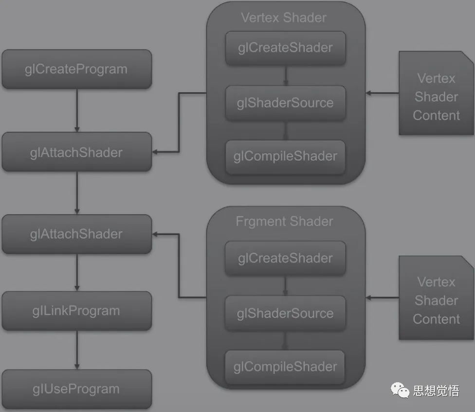

# Android使用OpenGL渲染ffmpeg解码的YUV数据

在《安卓使用SurfaceView绘制ffmpeg解码的视频数据》虽然我们成功地实现了视频的渲染，
但是在YUV转换成RGB的时候，我们调用了ffmpeg内部的转换函数，这里面包含大量的计算转换，
所以是很耗费CPU性能的。

今天我们来学习一下如何将YUV转换RGB的功能转换到GPU中去执行，减少CPU的计算工作量，达到性能优化的目的。

解决方案是使用OpenGL渲染，将YUV转换RGB的功能交由着色器去处理。


## Android中引入OpenGL

下面以OpenGL 2.0为例。

1、 引入库文件

在`CMakeLists.txt`引入`GLESv2`和`EGL`库（在ndk中内置）。
直接`target_link_libraries`加入即可：

```go
target_link_libraries(
                      ........
                       #引入opengl的相关库
                       GLESv2
                       EGL
                          )
```

2、 引入相关的头文件

需要引入的头文件

```go
#include <EGL/egl.h>
#include <GLES2/gl2.h>
```

至此，我们的安卓OpenGL环境就算引入成功了。

## OpenGL渲染环境搭建


1、 EGLDisplay 
OpenGL（移动端称作的是EGL）要知道把目标内容绘制在哪里。这就是EGLDisplay所需的功能。
EGLDisplay是一个封装系统物理屏幕的数据类型（可以理解为绘制目标的一个抽象），通常会调用eglGetDisplay方法返回EGLDisplay来作为OpenGL ES渲染的目标。然后通过eglInitialize初始化显示设备。

代码如下：

```go
//1 EGL display创建和初始化
    EGLDisplay display = eglGetDisplay(EGL_DEFAULT_DISPLAY);
    if (display == EGL_NO_DISPLAY) {
        LOGE("eglGetDisplay failed!");
        return;
    }
    if (EGL_TRUE != eglInitialize(display, 0, 0)) {
        LOGE("eglInitialize failed!");
        return;
    }
```


2、 EGLConfig 
EGL有了Display之后，它就可以将OpenGL ES的输出和设备的屏幕桥接起来，但是需要指定一些配置项，这时候EGLConfig就闪亮登场啦。

```go
//输出配置
    EGLConfig config;
    EGLint configNum;
    EGLint configSpec[] = {
            EGL_RED_SIZE, 8,
            EGL_GREEN_SIZE, 8,
            EGL_BLUE_SIZE, 8,
            EGL_SURFACE_TYPE, EGL_WINDOW_BIT, EGL_NONE
    };
    if (EGL_TRUE != eglChooseConfig(display, configSpec, &config, 1, &configNum)) {
        LOGE("eglChooseConfig failed!");
        return;
    }
```


3、 创建EGLSurface
有了显示设备，那么如何将设备的屏幕与EGL链接起来呢？EGLSurface粉墨登场。

```go
//获取原始窗口
//surface是外部的SurfaceView传递进来的
ANativeWindow *nwin = ANativeWindow_fromSurface(env, surface);
//创建surface
EGLSurface winsurface = eglCreateWindowSurface(display, config, nwin, 0);
    if (winsurface == EGL_NO_SURFACE) {
        LOGE("eglCreateWindowSurface failed!");
        return;
    }
```


4、 EGLContext
OpenGL所创建的资源, 其实对程序员可见的仅仅是ID而已, 要操作其中内容就需要依赖于EGLContext上下文。

```go
 //context 创建关联的上下文
    const EGLint ctxAttr[] = {
            EGL_CONTEXT_CLIENT_VERSION, 2, EGL_NONE
    };
    EGLContext context = eglCreateContext(display, config, EGL_NO_CONTEXT, ctxAttr);
    if (context == EGL_NO_CONTEXT) {
        LOGE("eglCreateContext failed!");
        return;
    }
    if (EGL_TRUE != eglMakeCurrent(display, winsurface, winsurface, context)) {
        LOGE("eglMakeCurrent failed!");
        return;
    }
```


4、 着色器
所有的渲染都需要位置信息与色彩信息这两个信息才能成功渲染处理。顶点着色器和片元着色器就完成了这两个功能。

顶点着色器：

```go
 attribute  vec4 aPosition; //顶点坐标，在外部获取传递进来
 
attribute vec2 aTexCoord; //材质（纹理）顶点坐标
 
varying vec2 vTexCoord;   //输出的材质（纹理）坐标，给片元着色器使用
 
void main() {
      //纹理坐标转换，以左上角为原点的纹理坐标转换成以左下角为原点的纹理坐标，
      // 比如以左上角为原点的（0，0）对应以左下角为原点的纹理坐标的（0，1）
      vTexCoord = vec2(aTexCoord.x, 1.0 - aTexCoord.y);
      gl_Position = aPosition;
    }
```


片元着色器：

```go
precision mediump float;    //精度
 
        varying vec2 vTexCoord;     //顶点着色器传递的坐标，相同名字opengl会自动关联
 
        uniform sampler2D yTexture; //输入的材质（不透明灰度，单像素）
 
        uniform sampler2D uTexture;
 
        uniform sampler2D vTexture;
        void main() {
            vec3 yuv;
            vec3 rgb;
            yuv.r = texture2D(yTexture, vTexCoord).r; // y分量
            // 因为UV的默认值是127，所以我们这里要减去0.5（OpenGLES的Shader中会把内存中0～255的整数数值换算为0.0～1.0的浮点数值）
            yuv.g = texture2D(uTexture, vTexCoord).r - 0.5; // u分量
            yuv.b = texture2D(vTexture, vTexCoord).r - 0.5; // v分量
            // yuv转换成rgb，两种方法，一种是RGB按照特定换算公式单独转换
            // 另外一种是使用矩阵转换
            rgb = mat3(1.0, 1.0, 1.0,
                       0.0, -0.39465, 2.03211,
                       1.13983, -0.58060, 0.0) * yuv;
            //输出像素颜色
            gl_FragColor = vec4(rgb, 1.0);
        }
```


着色器编写好之后如何使用呢？我们看一张图：



着色器编译关联

根据图片流程，我们很方便就创建编译并且链接好着色器。

```go
GLint InitShader(const char *code, GLint type) {
    //创建shader
    GLint sh = glCreateShader(type);
    if (sh == 0) {
        LOGE("glCreateShader %d failed!", type);
        return 0;
    }
    //加载shader
    glShaderSource(sh,
                   1,    //shader数量
                   &code, //shader代码
                   0);   //代码长度
    //编译shader
    glCompileShader(sh);
 
    //获取编译情况
    GLint status;
    glGetShaderiv(sh, GL_COMPILE_STATUS, &status);
    if (status == 0) {
        LOGE("glCompileShader failed!");
        return 0;
    }
    LOGE("glCompileShader success!");
    return sh;
}
 
........此处省略若干代码
 
    //顶点和片元shader初始化
    //顶点shader初始化
    GLint vsh = InitShader(vertexShader, GL_VERTEX_SHADER);
    //片元yuv420 shader初始化
    GLint fsh = InitShader(fragYUV420P, GL_FRAGMENT_SHADER);
 
 
    /
    //创建渲染程序
    GLint program = glCreateProgram();
    if (program == 0) {
        LOGE("glCreateProgram failed!");
        return;
    }
    //渲染程序中加入着色器代码
    glAttachShader(program, vsh);
    glAttachShader(program, fsh);
 
    //链接程序
    glLinkProgram(program);
    GLint status = 0;
    glGetProgramiv(program, GL_LINK_STATUS, &status);
    if (status != GL_TRUE) {
        LOGE("glLinkProgram failed!");
        return;
    }
    glUseProgram(program);
    LOGE("glLinkProgram success!");
    /
 
 
    //加入三维顶点数据 两个三角形组成正方形
    static float vers[] = {
            1.0f, -1.0f, 0.0f,
            -1.0f, -1.0f, 0.0f,
            1.0f, 1.0f, 0.0f,
            -1.0f, 1.0f, 0.0f,
    };
    GLuint apos = (GLuint) glGetAttribLocation(program, "aPosition");
    glEnableVertexAttribArray(apos);
    //传递顶点
    glVertexAttribPointer(apos, 3, GL_FLOAT, GL_FALSE, 12, vers);
 
    //加入材质坐标数据
    static float txts[] = {
            1.0f, 0.0f, //右下
            0.0f, 0.0f,
            1.0f, 1.0f,
            0.0, 1.0
    };
    GLuint atex = (GLuint) glGetAttribLocation(program, "aTexCoord");
    glEnableVertexAttribArray(atex);
    glVertexAttribPointer(atex, 2, GL_FLOAT, GL_FALSE, 8, txts);
 
    //材质纹理初始化
    //设置纹理层
    glUniform1i(glGetUniformLocation(program, "yTexture"), 0); //对于纹理第1层
    glUniform1i(glGetUniformLocation(program, "uTexture"), 1); //对于纹理第2层
    glUniform1i(glGetUniformLocation(program, "vTexture"), 2); //对于纹理第3层
 
    //创建opengl纹理
    GLuint texts[3] = {0};
    //创建三个纹理
    glGenTextures(3, texts);
 
    //设置纹理属性
    glBindTexture(GL_TEXTURE_2D, texts[0]);
    //缩小的过滤器
    glTexParameteri(GL_TEXTURE_2D, GL_TEXTURE_MIN_FILTER, GL_LINEAR);
    glTexParameteri(GL_TEXTURE_2D, GL_TEXTURE_MAG_FILTER, GL_LINEAR);
    //设置纹理的格式和大小
    glTexImage2D(GL_TEXTURE_2D,
                 0,           //细节基本 0默认
                 GL_LUMINANCE,//gpu内部格式 亮度，灰度图
                 width, height, //拉升到全屏
                 0,             //边框
                 GL_LUMINANCE,//数据的像素格式 亮度，灰度图 要与上面一致
                 GL_UNSIGNED_BYTE, //像素的数据类型
                 NULL                    //纹理的数据
    );
 
    //设置纹理属性
    glBindTexture(GL_TEXTURE_2D, texts[1]);
    //缩小的过滤器
    glTexParameteri(GL_TEXTURE_2D, GL_TEXTURE_MIN_FILTER, GL_LINEAR);
    glTexParameteri(GL_TEXTURE_2D, GL_TEXTURE_MAG_FILTER, GL_LINEAR);
    //设置纹理的格式和大小
    glTexImage2D(GL_TEXTURE_2D,
                 0,           //细节基本 0默认
                 GL_LUMINANCE,//gpu内部格式 亮度，灰度图
                 width / 2, height / 2, //拉升到全屏
                 0,             //边框
                 GL_LUMINANCE,//数据的像素格式 亮度，灰度图 要与上面一致
                 GL_UNSIGNED_BYTE, //像素的数据类型
                 NULL                    //纹理的数据
    );
 
    //设置纹理属性
    glBindTexture(GL_TEXTURE_2D, texts[2]);
    //缩小的过滤器
    glTexParameteri(GL_TEXTURE_2D, GL_TEXTURE_MIN_FILTER, GL_LINEAR);
    glTexParameteri(GL_TEXTURE_2D, GL_TEXTURE_MAG_FILTER, GL_LINEAR);
    //设置纹理的格式和大小
    glTexImage2D(GL_TEXTURE_2D,
                 0,           //细节基本 0默认
                 GL_LUMINANCE,//gpu内部格式 亮度，灰度图
                 width / 2, height / 2, //拉升到全屏
                 0,             //边框
                 GL_LUMINANCE,//数据的像素格式 亮度，灰度图 要与上面一致
                 GL_UNSIGNED_BYTE, //像素的数据类型
                 NULL                    //纹理的数据
    );
 
 
    //
    纹理的修改和显示
    unsigned char *buf[3] = {0};
    buf[0] = new unsigned char[width * height];
    buf[1] = new unsigned char[width * height / 4];
    buf[2] = new unsigned char[width * height / 4];
```


5、 传递数据
到了这一步，我们的渲染环境算是搭建完毕了，下面就是通过CPU传递数据到GPU进行渲染。简单地说就是获取在着色器中定义的变量并且对其赋值，然后调用绘制的API即可。 
主要代码：

```go
// 解码得到YUV数据
 
                    // 数据Y
                    buf[0] = frame->data[0];
 
                    memcpy(buf[0],frame->data[0],width*height);
                    // 数据U
                    memcpy(buf[1],frame->data[1],width*height/4);
 
                    // 数据V
                    memcpy(buf[2],frame->data[2],width*height/4);
 
                    //激活第1层纹理,绑定到创建的opengl纹理
                    glActiveTexture(GL_TEXTURE0);
                    glBindTexture(GL_TEXTURE_2D,texts[0]);
                    //替换纹理内容
                    glTexSubImage2D(GL_TEXTURE_2D,0,0,0,width,height,GL_LUMINANCE,GL_UNSIGNED_BYTE,buf[0]);
 
 
                    //激活第2层纹理,绑定到创建的opengl纹理
                    glActiveTexture(GL_TEXTURE0+1);
                    glBindTexture(GL_TEXTURE_2D,texts[1]);
                    //替换纹理内容
                    glTexSubImage2D(GL_TEXTURE_2D,0,0,0,width/2,height/2,GL_LUMINANCE,GL_UNSIGNED_BYTE,buf[1]);
 
 
                    //激活第2层纹理,绑定到创建的opengl纹理
                    glActiveTexture(GL_TEXTURE0+2);
                    glBindTexture(GL_TEXTURE_2D,texts[2]);
                    //替换纹理内容
                    glTexSubImage2D(GL_TEXTURE_2D,0,0,0,width/2,height/2,GL_LUMINANCE,GL_UNSIGNED_BYTE,buf[2]);
 
                    //三维绘制
                    glDrawArrays(GL_TRIANGLE_STRIP,0,4);
                    //窗口显示
                    eglSwapBuffers(display,winsurface);
```


至此，我们的渲染过程就完成了，与前面的ffmpeg解码为YUV数据联系起来，实现一边解码一边渲染数据。通过对比笔者很明显觉察到使用OpenGL渲染的视频画面流畅很多。而且对比两种渲染方式的CPU使用率也发现OpenGL的渲染方式确实使得CPU的使用率大大降低。

最后贴一下结合ffmpeg从解码到渲染全过程的完整代码：

```go
#include <jni.h>
#include <string>
 
 
#include "FlyLog.h"
 
#include <android/log.h>
#include <android/native_window.h>
#include <android/native_window_jni.h>
 
#include <android/native_window_jni.h>
#include <EGL/egl.h>
#include <GLES2/gl2.h>
 
// 因为ffmpeg是纯C代码，要在cpp中使用则需要使用 extern "C"
extern "C" {
#include "libavutil/avutil.h"
 
#include <libavformat/avformat.h>
 
#include <libswscale/swscale.h>
 
}
 
 
 
//顶点着色器glsl的宏
// 第二个#号的意思是自动链接字符串，而不用增加引号，参考ijkplayer的写法
 
#define GET_STR(x) #x
 
static const char *vertexShader = GET_STR(
 
        attribute  vec4 aPosition; //顶点坐标，在外部获取传递进来
 
        attribute vec2 aTexCoord; //材质（纹理）顶点坐标
 
        varying vec2 vTexCoord;   //输出的材质（纹理）坐标，给片元着色器使用
        void main() {
            //纹理坐标转换，以左上角为原点的纹理坐标转换成以左下角为原点的纹理坐标，
            // 比如以左上角为原点的（0，0）对应以左下角为原点的纹理坐标的（0，1）
            vTexCoord = vec2(aTexCoord.x, 1.0 - aTexCoord.y);
            gl_Position = aPosition;
        }
);
 
//片元着色器,软解码和部分x86硬解码解码得出来的格式是YUV420p
 
static const char *fragYUV420P = GET_STR(
 
        precision mediump float;    //精度
 
        varying vec2 vTexCoord;     //顶点着色器传递的坐标，相同名字opengl会自动关联
 
        uniform sampler2D yTexture; //输入的材质（不透明灰度，单像素）
 
        uniform sampler2D uTexture;
 
        uniform sampler2D vTexture;
        void main() {
            vec3 yuv;
            vec3 rgb;
            yuv.r = texture2D(yTexture, vTexCoord).r; // y分量
            // 因为UV的默认值是127，所以我们这里要减去0.5（OpenGLES的Shader中会把内存中0～255的整数数值换算为0.0～1.0的浮点数值）
            yuv.g = texture2D(uTexture, vTexCoord).r - 0.5; // u分量
            yuv.b = texture2D(vTexture, vTexCoord).r - 0.5; // v分量
            // yuv转换成rgb，两种方法，一种是RGB按照特定换算公式单独转换
            // 另外一种是使用矩阵转换
            rgb = mat3(1.0, 1.0, 1.0,
                       0.0, -0.39465, 2.03211,
                       1.13983, -0.58060, 0.0) * yuv;
            //输出像素颜色
            gl_FragColor = vec4(rgb, 1.0);
        }
);
 
GLint InitShader(const char *code, GLint type) {
    //创建shader
    GLint sh = glCreateShader(type);
    if (sh == 0) {
        LOGE("glCreateShader %d failed!", type);
        return 0;
    }
    //加载shader
    glShaderSource(sh,
                   1,    //shader数量
                   &code, //shader代码
                   0);   //代码长度
    //编译shader
    glCompileShader(sh);
 
    //获取编译情况
    GLint status;
    glGetShaderiv(sh, GL_COMPILE_STATUS, &status);
    if (status == 0) {
        LOGE("glCompileShader failed!");
        return 0;
    }
    LOGE("glCompileShader success!");
    return sh;
}
 
 
/**
 * 将数据转换成double类型的一个方法
 * @param r
 * @return
 */
static double r2d(AVRational r) {
    return r.num == 0 || r.den == 0 ? 0 : (double) r.num / (double) r.den;
}
 
extern "C"
JNIEXPORT void JNICALL
Java_com_flyer_ffmpeg_FlyPlayer_playVideoByOpenGL(JNIEnv *env, jobject thiz, jstring video_path,
                                                  jobject surface) {
 
 
    const char *path = env->GetStringUTFChars(video_path, 0);
 
    AVFormatContext *fmt_ctx;
    // 初始化格式化上下文
    fmt_ctx = avformat_alloc_context();
 
    // 使用ffmpeg打开文件
    int re = avformat_open_input(&fmt_ctx, path, nullptr, nullptr);
    if (re != 0) {
        LOGE("打开文件失败：%s", av_err2str(re));
        return;
    }
 
    //探测流索引
    re = avformat_find_stream_info(fmt_ctx, nullptr);
 
    if (re < 0) {
        LOGE("索引探测失败：%s", av_err2str(re));
        return;
    }
 
    //寻找视频流索引
    int v_idx = av_find_best_stream(
            fmt_ctx, AVMEDIA_TYPE_VIDEO, -1, -1, nullptr, 0);
 
    if (v_idx == -1) {
        LOGE("获取视频流索引失败");
        return;
    }
    //解码器参数
    AVCodecParameters *c_par;
    //解码器上下文
    AVCodecContext *cc_ctx;
    //声明一个解码器
    const AVCodec *codec;
 
    c_par = fmt_ctx->streams[v_idx]->codecpar;
 
    //通过id查找解码器
    codec = avcodec_find_decoder(c_par->codec_id);
 
    if (!codec) {
 
        LOGE("查找解码器失败");
        return;
    }
 
    //用参数c_par实例化编解码器上下文，，并打开编解码器
    cc_ctx = avcodec_alloc_context3(codec);
 
    // 关联解码器上下文
    re = avcodec_parameters_to_context(cc_ctx, c_par);
 
    if (re < 0) {
        LOGE("解码器上下文关联失败:%s", av_err2str(re));
        return;
    }
 
    //打开解码器
    re = avcodec_open2(cc_ctx, codec, nullptr);
 
    if (re != 0) {
        LOGE("打开解码器失败:%s", av_err2str(re));
        return;
    }
 
    // 获取视频的宽高,也可以通过解码器获取
    AVStream *as = fmt_ctx->streams[v_idx];
    int width = as->codecpar->width;
    int height = as->codecpar->height;
 
    LOGE("width:%d", width);
    LOGE("height:%d", height);
 
    //数据包
    AVPacket *pkt;
    //数据帧
    AVFrame *frame;
 
    //初始化
    pkt = av_packet_alloc();
    frame = av_frame_alloc();
 
    //1 获取原始窗口
    ANativeWindow *nwin = ANativeWindow_fromSurface(env, surface);
 
    
    ///EGL
    //1 EGL display创建和初始化
    EGLDisplay display = eglGetDisplay(EGL_DEFAULT_DISPLAY);
    if (display == EGL_NO_DISPLAY) {
        LOGE("eglGetDisplay failed!");
        return;
    }
    if (EGL_TRUE != eglInitialize(display, 0, 0)) {
        LOGE("eglInitialize failed!");
        return;
    }
    //2 surface
    //2-1 surface窗口配置
    //输出配置
    EGLConfig config;
    EGLint configNum;
    EGLint configSpec[] = {
            EGL_RED_SIZE, 8,
            EGL_GREEN_SIZE, 8,
            EGL_BLUE_SIZE, 8,
            EGL_SURFACE_TYPE, EGL_WINDOW_BIT, EGL_NONE
    };
    if (EGL_TRUE != eglChooseConfig(display, configSpec, &config, 1, &configNum)) {
        LOGE("eglChooseConfig failed!");
        return;
    }
    //创建surface
    EGLSurface winsurface = eglCreateWindowSurface(display, config, nwin, 0);
    if (winsurface == EGL_NO_SURFACE) {
        LOGE("eglCreateWindowSurface failed!");
        return;
    }
 
    //3 context 创建关联的上下文
    const EGLint ctxAttr[] = {
            EGL_CONTEXT_CLIENT_VERSION, 2, EGL_NONE
    };
    EGLContext context = eglCreateContext(display, config, EGL_NO_CONTEXT, ctxAttr);
    if (context == EGL_NO_CONTEXT) {
        LOGE("eglCreateContext failed!");
        return;
    }
    if (EGL_TRUE != eglMakeCurrent(display, winsurface, winsurface, context)) {
        LOGE("eglMakeCurrent failed!");
        return;
    }
 
    LOGE("EGL Init Success!");
 
    //顶点和片元shader初始化
    //顶点shader初始化
    GLint vsh = InitShader(vertexShader, GL_VERTEX_SHADER);
    //片元yuv420 shader初始化
    GLint fsh = InitShader(fragYUV420P, GL_FRAGMENT_SHADER);
 
 
    /
    //创建渲染程序
    GLint program = glCreateProgram();
    if (program == 0) {
        LOGE("glCreateProgram failed!");
        return;
    }
    //渲染程序中加入着色器代码
    glAttachShader(program, vsh);
    glAttachShader(program, fsh);
 
    //链接程序
    glLinkProgram(program);
    GLint status = 0;
    glGetProgramiv(program, GL_LINK_STATUS, &status);
    if (status != GL_TRUE) {
        LOGE("glLinkProgram failed!");
        return;
    }
    glUseProgram(program);
    LOGE("glLinkProgram success!");
    /
 
 
    //加入三维顶点数据 两个三角形组成正方形
    static float vers[] = {
            1.0f, -1.0f, 0.0f,
            -1.0f, -1.0f, 0.0f,
            1.0f, 1.0f, 0.0f,
            -1.0f, 1.0f, 0.0f,
    };
    GLuint apos = (GLuint) glGetAttribLocation(program, "aPosition");
    glEnableVertexAttribArray(apos);
    //传递顶点
    glVertexAttribPointer(apos, 3, GL_FLOAT, GL_FALSE, 12, vers);
 
    //加入材质坐标数据
    static float txts[] = {
            1.0f, 0.0f, //右下
            0.0f, 0.0f,
            1.0f, 1.0f,
            0.0, 1.0
    };
    GLuint atex = (GLuint) glGetAttribLocation(program, "aTexCoord");
    glEnableVertexAttribArray(atex);
    glVertexAttribPointer(atex, 2, GL_FLOAT, GL_FALSE, 8, txts);
 
    //材质纹理初始化
    //设置纹理层
    glUniform1i(glGetUniformLocation(program, "yTexture"), 0); //对于纹理第1层
    glUniform1i(glGetUniformLocation(program, "uTexture"), 1); //对于纹理第2层
    glUniform1i(glGetUniformLocation(program, "vTexture"), 2); //对于纹理第3层
 
    //创建opengl纹理
    GLuint texts[3] = {0};
    //创建三个纹理
    glGenTextures(3, texts);
 
    //设置纹理属性
    glBindTexture(GL_TEXTURE_2D, texts[0]);
    //缩小的过滤器
    glTexParameteri(GL_TEXTURE_2D, GL_TEXTURE_MIN_FILTER, GL_LINEAR);
    glTexParameteri(GL_TEXTURE_2D, GL_TEXTURE_MAG_FILTER, GL_LINEAR);
    //设置纹理的格式和大小
    glTexImage2D(GL_TEXTURE_2D,
                 0,           //细节基本 0默认
                 GL_LUMINANCE,//gpu内部格式 亮度，灰度图
                 width, height, //拉升到全屏
                 0,             //边框
                 GL_LUMINANCE,//数据的像素格式 亮度，灰度图 要与上面一致
                 GL_UNSIGNED_BYTE, //像素的数据类型
                 NULL                    //纹理的数据
    );
 
    //设置纹理属性
    glBindTexture(GL_TEXTURE_2D, texts[1]);
    //缩小的过滤器
    glTexParameteri(GL_TEXTURE_2D, GL_TEXTURE_MIN_FILTER, GL_LINEAR);
    glTexParameteri(GL_TEXTURE_2D, GL_TEXTURE_MAG_FILTER, GL_LINEAR);
    //设置纹理的格式和大小
    glTexImage2D(GL_TEXTURE_2D,
                 0,           //细节基本 0默认
                 GL_LUMINANCE,//gpu内部格式 亮度，灰度图
                 width / 2, height / 2, //拉升到全屏
                 0,             //边框
                 GL_LUMINANCE,//数据的像素格式 亮度，灰度图 要与上面一致
                 GL_UNSIGNED_BYTE, //像素的数据类型
                 NULL                    //纹理的数据
    );
 
    //设置纹理属性
    glBindTexture(GL_TEXTURE_2D, texts[2]);
    //缩小的过滤器
    glTexParameteri(GL_TEXTURE_2D, GL_TEXTURE_MIN_FILTER, GL_LINEAR);
    glTexParameteri(GL_TEXTURE_2D, GL_TEXTURE_MAG_FILTER, GL_LINEAR);
    //设置纹理的格式和大小
    glTexImage2D(GL_TEXTURE_2D,
                 0,           //细节基本 0默认
                 GL_LUMINANCE,//gpu内部格式 亮度，灰度图
                 width / 2, height / 2, //拉升到全屏
                 0,             //边框
                 GL_LUMINANCE,//数据的像素格式 亮度，灰度图 要与上面一致
                 GL_UNSIGNED_BYTE, //像素的数据类型
                 NULL                    //纹理的数据
    );
 
 
    //
    纹理的修改和显示
    unsigned char *buf[3] = {0};
    buf[0] = new unsigned char[width * height];
    buf[1] = new unsigned char[width * height / 4];
    buf[2] = new unsigned char[width * height / 4];
 
 
    while (av_read_frame(fmt_ctx, pkt) >= 0) {//持续读帧
        // 只解码视频流
        if (pkt->stream_index == v_idx) {
 
            //发送数据包到解码器
            avcodec_send_packet(cc_ctx, pkt);
 
            //清理
            av_packet_unref(pkt);
 
            //这里为什么要使用一个for循环呢？
            // 因为avcodec_send_packet和avcodec_receive_frame并不是一对一的关系的
            //一个avcodec_send_packet可能会出发多个avcodec_receive_frame
            for (;;) {
                // 接受解码的数据
                re = avcodec_receive_frame(cc_ctx, frame);
                if (re != 0) {
                    break;
                } else {
 
                    // 解码得到YUV数据
 
                    // 数据Y
                    buf[0] = frame->data[0];
 
                    memcpy(buf[0],frame->data[0],width*height);
                    // 数据U
                    memcpy(buf[1],frame->data[1],width*height/4);
 
                    // 数据V
                    memcpy(buf[2],frame->data[2],width*height/4);
 
                    //激活第1层纹理,绑定到创建的opengl纹理
                    glActiveTexture(GL_TEXTURE0);
                    glBindTexture(GL_TEXTURE_2D,texts[0]);
                    //替换纹理内容
                    glTexSubImage2D(GL_TEXTURE_2D,0,0,0,width,height,GL_LUMINANCE,GL_UNSIGNED_BYTE,buf[0]);
 
 
                    //激活第2层纹理,绑定到创建的opengl纹理
                    glActiveTexture(GL_TEXTURE0+1);
                    glBindTexture(GL_TEXTURE_2D,texts[1]);
                    //替换纹理内容
                    glTexSubImage2D(GL_TEXTURE_2D,0,0,0,width/2,height/2,GL_LUMINANCE,GL_UNSIGNED_BYTE,buf[1]);
 
 
                    //激活第2层纹理,绑定到创建的opengl纹理
                    glActiveTexture(GL_TEXTURE0+2);
                    glBindTexture(GL_TEXTURE_2D,texts[2]);
                    //替换纹理内容
                    glTexSubImage2D(GL_TEXTURE_2D,0,0,0,width/2,height/2,GL_LUMINANCE,GL_UNSIGNED_BYTE,buf[2]);
 
                    //三维绘制
                    glDrawArrays(GL_TRIANGLE_STRIP,0,4);
                    //窗口显示
                    eglSwapBuffers(display,winsurface);
 
                }
            }
 
        }
    }
    //关闭环境
    avcodec_free_context(&cc_ctx);
    // 释放资源
    av_frame_free(&frame);
    av_packet_free(&pkt);
 
    avformat_free_context(fmt_ctx);
 
    LOGE("播放完毕");
 
    env->ReleaseStringUTFChars(video_path, path);
 
}
```

## 遇到的问题

笔者测试了两个不同的视频发现一个能播放，另外一个花屏，看不出图像。

查找了一些资料至今仍找不到问题所在，两个视频使用SurfaceView渲染都是可以的，说明可能不是解码的问题，估计是渲染程序的问题。而且两个视频解码出来的YUV数据格式不一样，一个yuvj420p，这个可以正常使用OpenGL渲染，一个是yuv420p，这个就不能渲染，花屏。

恳亲大神不吝赐教。