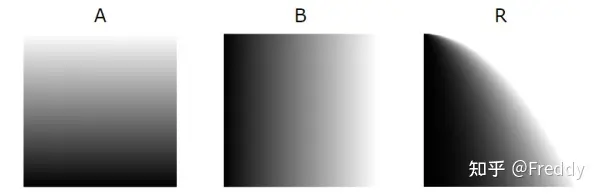
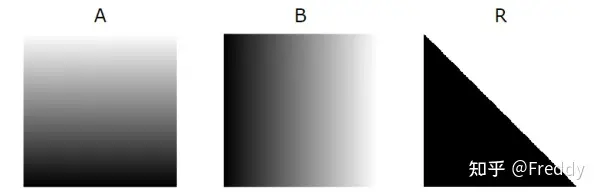
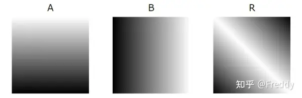
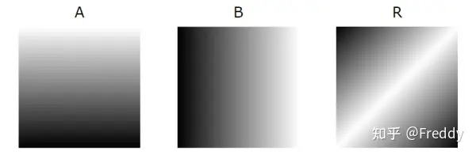
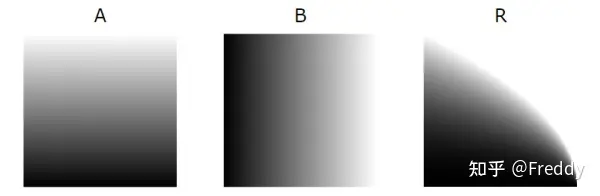
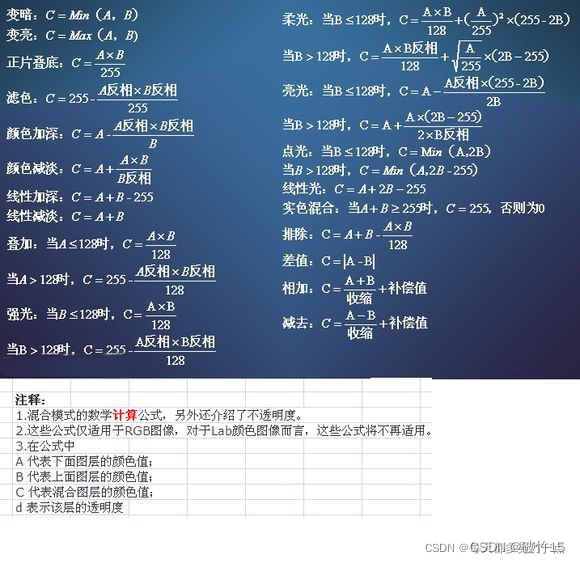
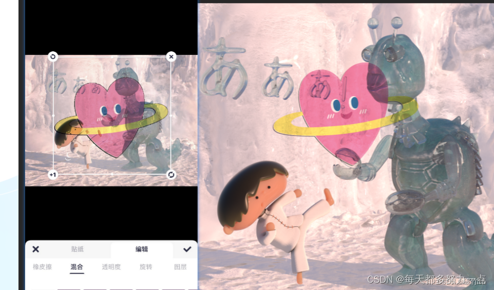
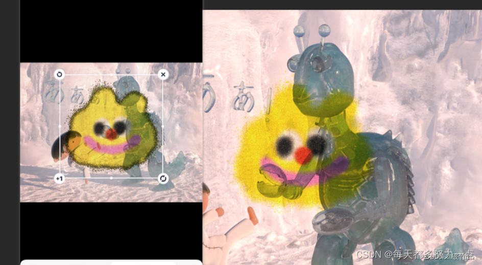
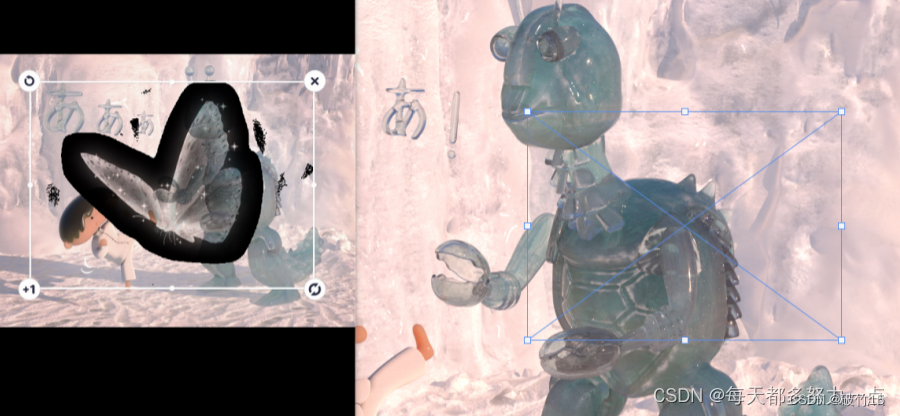

# Photoshop各种混合模式的代码

https://zhuanlan.zhihu.com/p/356634851?utm_campaign=shareopn&utm_medium=social&utm_psn=1751543603506319360&utm_source=wechat_session


最近在移植Photoshop种的各种功能到Unity中，刚好整理了一些资料。

PS中的图层混合模式是非常经典的了，把这些功能集成到游戏引擎中可以便于美术进行材质或后处理调节。理论上可以还原所有艺术家在PS中实现的非手绘操作。

几个比较新颖的混合模式增加了配图。

同步到这里方便大家复制粘贴，活学活用。

------

**ADD 相加**

```glsl
float blendAdd(float base, float blend) {
	return min(base+blend,1.0);
}

vec3 blendAdd(vec3 base, vec3 blend) {
	return min(base+blend,vec3(1.0));
}

vec3 blendAdd(vec3 base, vec3 blend, float opacity) {
	return (blendAdd(base, blend) * opacity + base * (1.0 - opacity));
}

#pragma glslify: export(blendAdd)
```

**AVERAGE 平均**

```glsl
vec3 blendAverage(vec3 base, vec3 blend) {
	return (base+blend)/2.0;
}

vec3 blendAverage(vec3 base, vec3 blend, float opacity) {
	return (blendAverage(base, blend) * opacity + base * (1.0 - opacity));
}

#pragma glslify: export(blendAverage)
```

**COLOR-BURN 颜色加深**

```glsl
float blendColorBurn(float base, float blend) {
	return (blend==0.0)?blend:max((1.0-((1.0-base)/blend)),0.0);
}

vec3 blendColorBurn(vec3 base, vec3 blend) {
	return vec3(blendColorBurn(base.r,blend.r),blendColorBurn(base.g,blend.g),blendColorBurn(base.b,blend.b));
}

vec3 blendColorBurn(vec3 base, vec3 blend, float opacity) {
	return (blendColorBurn(base, blend) * opacity + base * (1.0 - opacity));
}

#pragma glslify: export(blendColorBurn)
```

**COLOR-DODGE 颜色减淡**

```glsl
float blendColorDodge(float base, float blend) {
	return (blend==1.0)?blend:min(base/(1.0-blend),1.0);
}

vec3 blendColorDodge(vec3 base, vec3 blend) {
	return vec3(blendColorDodge(base.r,blend.r),blendColorDodge(base.g,blend.g),blendColorDodge(base.b,blend.b));
}

vec3 blendColorDodge(vec3 base, vec3 blend, float opacity) {
	return (blendColorDodge(base, blend) * opacity + base * (1.0 - opacity));
}

#pragma glslify: export(blendColorDodge)
```

**DARKEN 变暗**

```glsl
float blendDarken(float base, float blend) {
	return min(blend,base);
}

vec3 blendDarken(vec3 base, vec3 blend) {
	return vec3(blendDarken(base.r,blend.r),blendDarken(base.g,blend.g),blendDarken(base.b,blend.b));
}

vec3 blendDarken(vec3 base, vec3 blend, float opacity) {
	return (blendDarken(base, blend) * opacity + base * (1.0 - opacity));
}

#pragma glslify: export(blendDarken)
```

**DIFFERENCE 插值**

```glsl
vec3 blendDifference(vec3 base, vec3 blend) {
	return abs(base-blend);
}

vec3 blendDifference(vec3 base, vec3 blend, float opacity) {
	return (blendDifference(base, blend) * opacity + base * (1.0 - opacity));
}

#pragma glslify: export(blendDifference)
```

**EXCLUSION 排除**

```glsl
vec3 blendExclusion(vec3 base, vec3 blend) {
	return base+blend-2.0*base*blend;
}

vec3 blendExclusion(vec3 base, vec3 blend, float opacity) {
	return (blendExclusion(base, blend) * opacity + base * (1.0 - opacity));
}

#pragma glslify: export(blendExclusion)
```

**GLOW 辉光**



```glsl
#pragma glslify: blendReflect = require(./reflect)

vec3 blendGlow(vec3 base, vec3 blend) {
	return blendReflect(blend,base);
}

vec3 blendGlow(vec3 base, vec3 blend, float opacity) {
	return (blendGlow(base, blend) * opacity + base * (1.0 - opacity));
}

#pragma glslify: export(blendGlow)
```

**HARD-LIGHT 强光**

```glsl
#pragma glslify: blendOverlay = require(./overlay)

vec3 blendHardLight(vec3 base, vec3 blend) {
	return blendOverlay(blend,base);
}

vec3 blendHardLight(vec3 base, vec3 blend, float opacity) {
	return (blendHardLight(base, blend) * opacity + base * (1.0 - opacity));
}

#pragma glslify: export(blendHardLight)
```

**HARD-MIX 实色混合**



```glsl
#pragma glslify: blendVividLight = require(./vivid-light)

float blendHardMix(float base, float blend) {
	return (blendVividLight(base,blend)<0.5)?0.0:1.0;
}

vec3 blendHardMix(vec3 base, vec3 blend) {
	return vec3(blendHardMix(base.r,blend.r),blendHardMix(base.g,blend.g),blendHardMix(base.b,blend.b));
}

vec3 blendHardMix(vec3 base, vec3 blend, float opacity) {
	return (blendHardMix(base, blend) * opacity + base * (1.0 - opacity));
}

#pragma glslify: export(blendHardMix)
```

**LIGHTEN 变亮**

```glsl
float blendLighten(float base, float blend) {
	return max(blend,base);
}

vec3 blendLighten(vec3 base, vec3 blend) {
	return vec3(blendLighten(base.r,blend.r),blendLighten(base.g,blend.g),blendLighten(base.b,blend.b));
}

vec3 blendLighten(vec3 base, vec3 blend, float opacity) {
	return (blendLighten(base, blend) * opacity + base * (1.0 - opacity));
}

#pragma glslify: export(blendLighten)
```

**LINEAR-BURN 线性加深**

```glsl
float blendLinearBurn(float base, float blend) {
	// Note : Same implementation as BlendSubtractf
	return max(base+blend-1.0,0.0);
}

vec3 blendLinearBurn(vec3 base, vec3 blend) {
	// Note : Same implementation as BlendSubtract
	return max(base+blend-vec3(1.0),vec3(0.0));
}

vec3 blendLinearBurn(vec3 base, vec3 blend, float opacity) {
	return (blendLinearBurn(base, blend) * opacity + base * (1.0 - opacity));
}

#pragma glslify: export(blendLinearBurn)
```

**LINEAR-DODGE 线性减淡**

```glsl
float blendLinearDodge(float base, float blend) {
	// Note : Same implementation as BlendAddf
	return min(base+blend,1.0);
}

vec3 blendLinearDodge(vec3 base, vec3 blend) {
	// Note : Same implementation as BlendAdd
	return min(base+blend,vec3(1.0));
}

vec3 blendLinearDodge(vec3 base, vec3 blend, float opacity) {
	return (blendLinearDodge(base, blend) * opacity + base * (1.0 - opacity));
}

#pragma glslify: export(blendLinearDodge)
```

**LINEAR-LIGHT 线性光**

```glsl
#pragma glslify: blendLinearDodge = require(./linear-dodge)
#pragma glslify: blendLinearBurn = require(./linear-burn)

float blendLinearLight(float base, float blend) {
	return blend<0.5?blendLinearBurn(base,(2.0*blend)):blendLinearDodge(base,(2.0*(blend-0.5)));
}

vec3 blendLinearLight(vec3 base, vec3 blend) {
	return vec3(blendLinearLight(base.r,blend.r),blendLinearLight(base.g,blend.g),blendLinearLight(base.b,blend.b));
}

vec3 blendLinearLight(vec3 base, vec3 blend, float opacity) {
	return (blendLinearLight(base, blend) * opacity + base * (1.0 - opacity));
}

#pragma glslify: export(blendLinearLight)
```

**MULTIPLY 正片叠底**

```glsl
vec3 blendMultiply(vec3 base, vec3 blend) {
	return base*blend;
}

vec3 blendMultiply(vec3 base, vec3 blend, float opacity) {
	return (blendMultiply(base, blend) * opacity + base * (1.0 - opacity));
}

#pragma glslify: export(blendMultiply)
```

**NEGATION 反相**



```glsl
vec3 blendNegation(vec3 base, vec3 blend) {
	return vec3(1.0)-abs(vec3(1.0)-base-blend);
}

vec3 blendNegation(vec3 base, vec3 blend, float opacity) {
	return (blendNegation(base, blend) * opacity + base * (1.0 - opacity));
}

#pragma glslify: export(blendNegation)
```

**NORMAL 正常**

```glsl
vec3 blendNormal(vec3 base, vec3 blend) {
	return blend;
}

vec3 blendNormal(vec3 base, vec3 blend, float opacity) {
	return (blendNormal(base, blend) * opacity + base * (1.0 - opacity));
}

#pragma glslify: export(blendNormal)
```

**OVERLAY 叠加**

```glsl
float blendOverlay(float base, float blend) {
	return base<0.5?(2.0*base*blend):(1.0-2.0*(1.0-base)*(1.0-blend));
}

vec3 blendOverlay(vec3 base, vec3 blend) {
	return vec3(blendOverlay(base.r,blend.r),blendOverlay(base.g,blend.g),blendOverlay(base.b,blend.b));
}

vec3 blendOverlay(vec3 base, vec3 blend, float opacity) {
	return (blendOverlay(base, blend) * opacity + base * (1.0 - opacity));
}

#pragma glslify: export(blendOverlay)
```

**PHOENIX**



```glsl
vec3 blendPhoenix(vec3 base, vec3 blend) {
	return min(base,blend)-max(base,blend)+vec3(1.0);
}

vec3 blendPhoenix(vec3 base, vec3 blend, float opacity) {
	return (blendPhoenix(base, blend) * opacity + base * (1.0 - opacity));
}

#pragma glslify: export(blendPhoenix)
```

**PIN-LIGHT 点光**

```glsl
#pragma glslify: blendLighten = require(./lighten)
#pragma glslify: blendDarken = require(./darken)

float blendPinLight(float base, float blend) {
	return (blend<0.5)?blendDarken(base,(2.0*blend)):blendLighten(base,(2.0*(blend-0.5)));
}

vec3 blendPinLight(vec3 base, vec3 blend) {
	return vec3(blendPinLight(base.r,blend.r),blendPinLight(base.g,blend.g),blendPinLight(base.b,blend.b));
}

vec3 blendPinLight(vec3 base, vec3 blend, float opacity) {
	return (blendPinLight(base, blend) * opacity + base * (1.0 - opacity));
}

#pragma glslify: export(blendPinLight)
```

**REFLECT 反射**



```glsl
float blendReflect(float base, float blend) {
	return (blend==1.0)?blend:min(base*base/(1.0-blend),1.0);
}

vec3 blendReflect(vec3 base, vec3 blend) {
	return vec3(blendReflect(base.r,blend.r),blendReflect(base.g,blend.g),blendReflect(base.b,blend.b));
}

vec3 blendReflect(vec3 base, vec3 blend, float opacity) {
	return (blendReflect(base, blend) * opacity + base * (1.0 - opacity));
}

#pragma glslify: export(blendReflect)
```

**SCREEN 滤色**

```glsl
float blendScreen(float base, float blend) {
	return 1.0-((1.0-base)*(1.0-blend));
}

vec3 blendScreen(vec3 base, vec3 blend) {
	return vec3(blendScreen(base.r,blend.r),blendScreen(base.g,blend.g),blendScreen(base.b,blend.b));
}

vec3 blendScreen(vec3 base, vec3 blend, float opacity) {
	return (blendScreen(base, blend) * opacity + base * (1.0 - opacity));
}

#pragma glslify: export(blendScreen)
```

**SOFT-LIGHT 柔光**

```glsl
float blendSoftLight(float base, float blend) {
	return (blend<0.5)?(2.0*base*blend+base*base*(1.0-2.0*blend)):(sqrt(base)*(2.0*blend-1.0)+2.0*base*(1.0-blend));
}

vec3 blendSoftLight(vec3 base, vec3 blend) {
	return vec3(blendSoftLight(base.r,blend.r),blendSoftLight(base.g,blend.g),blendSoftLight(base.b,blend.b));
}

vec3 blendSoftLight(vec3 base, vec3 blend, float opacity) {
	return (blendSoftLight(base, blend) * opacity + base * (1.0 - opacity));
}

#pragma glslify: export(blendSoftLight)
```

**SUBTRACT 相减**

```glsl
float blendSubtract(float base, float blend) {
	return max(base+blend-1.0,0.0);
}

vec3 blendSubtract(vec3 base, vec3 blend) {
	return max(base+blend-vec3(1.0),vec3(0.0));
}

vec3 blendSubtract(vec3 base, vec3 blend, float opacity) {
	return (blendSubtract(base, blend) * opacity + base * (1.0 - opacity));
}

#pragma glslify: export(blendSubtract)
```

**VIVID-LIGHT 亮光**

```glsl
#pragma glslify: blendColorDodge = require(./color-dodge)
#pragma glslify: blendColorBurn = require(./color-burn)

float blendVividLight(float base, float blend) {
	return (blend<0.5)?blendColorBurn(base,(2.0*blend)):blendColorDodge(base,(2.0*(blend-0.5)));
}

vec3 blendVividLight(vec3 base, vec3 blend) {
	return vec3(blendVividLight(base.r,blend.r),blendVividLight(base.g,blend.g),blendVividLight(base.b,blend.b));
}

vec3 blendVividLight(vec3 base, vec3 blend, float opacity) {
	return (blendVividLight(base, blend) * opacity + base * (1.0 - opacity));
}

#pragma glslify: export(blendVividLight)
```


# 基于OpenGL实现PS部分混合模式


[破竹15](https://blog.csdn.net/qq_40500571)于 2022-06-09 15:04:45 发布

阅读量370 收藏 2

点赞数

分类专栏： [opengles](https://blog.csdn.net/qq_40500571/category_11786958.html) 文章标签： [OpenGLES](https://so.csdn.net/so/search/s.do?q=OpenGLES&t=all&o=vip&s=&l=&f=&viparticle=)

版权

[opengles专栏收录该内容](https://blog.csdn.net/qq_40500571/category_11786958.html)

5 篇文章0 订阅

订阅专栏

> 原文：https://blog.csdn.net/weixin_42407126/article/details/124253497

### 混合模式介绍

### 1.什么是混合模式?

为了让不同色彩的图片叠加后能够实现更多种色彩组合,从而渲染出各式各样的画面,PS 提供了各式各样规则的混合模式(这里就不具体一一介绍了,提供一个传送门,有兴趣的可自行了解:https://zhuanlan.zhihu.com/p/94081709)

### 2.如何实现混合模式?

我们知道,我们在使用 [OpenGL](https://so.csdn.net/so/search?q=OpenGL&spm=1001.2101.3001.7020) 进行图片效果开发时,将两张图片叠加,如果上层的图片是半透明的,如果我们想在不改变原图色彩的情况下透过上层图片看到底图,有两种实现方法,第一是使用opengl中为我们提供的混合模式的接口glBlendFunc(),第二是我们再片段着色器里使用 mix()函数,而这两种方法改变的都是图片的 alpha值(图片透明度), 可 ps 里的混合模式大多数是基于将两张图片的rgb 和 alpha做各种运算得出的,因此要在 OpenGL 中实现 PS的混合模式,更关键的是依赖图形相关算法,本文参照 Photoshop blend算法 ，介绍如何通过shader，在OpenGL中实现混合效果。

第一步,如何在OpenGL 中开启混合模式?

```cpp
glEnable( GL_BLEND ); // 开启混合
glDisable( GL_BLEND ); // 关闭混合
12
```

第二步,如何设置混合模式?

```cpp
glBlendFunc(GL_SRC_ALPHA, GL_ONE_MINUS_SRC_ALPHA);//对四通道统一进行混合操作
glBlendFuncSeparate(GL_SRC_ALPHA, GL_ONE_MINUS_SRC_ALPHA, GL_ONE, GL_ZERO);//为RGB和alpha通道分别设置不同的混合选项
glBlendEquation(GLenum mode)//设置混合的运算符,与上两个函数搭配
123
```

glBlendFunc(GLenum sfactor, GLenum dfactor)

函数接受两个参数，来设置源和目标因子。OpenGL为我们定义了很多个选项，我们将在下面列出大部分最常用的选项。注意常数颜色向量C¯constant可以通过glBlendColor函数来另外设置。

```cpp
GL_ZERO	因子等于0
GL_ONE	因子等于1
GL_SRC_COLOR	因子等于源颜色向量C¯source
GL_ONE_MINUS_SRC_COLOR	因子等于1−C¯source
GL_DST_COLOR	因子等于目标颜色向量C¯destination
GL_ONE_MINUS_DST_COLOR	因子等于1−C¯destination
GL_SRC_ALPHA	因子等于C¯source的alpha分量
GL_ONE_MINUS_SRC_ALPHA	因子等于1− C¯source的alpha分量
GL_DST_ALPHA	因子等于C¯destination的alpha分量
GL_ONE_MINUS_DST_ALPHA	因子等于1− C¯destination的alpha分量
GL_CONSTANT_COLOR	因子等于常数颜色向量C¯constant
GL_ONE_MINUS_CONSTANT_COLOR	因子等于1−C¯constant
GL_CONSTANT_ALPHA	因子等于C¯constant的alpha分量
GL_ONE_MINUS_CONSTANT_ALPHA	
1234567891011121314
```

glBlendEquation(GLenum mode):

```cpp
GL_FUNC_ADD：默认选项，将两个分量相加：C¯result=Src+Dst。
GL_FUNC_SUBTRACT：将两个分量相减： C¯result=Src−Dst。
GL_FUNC_REVERSE_SUBTRACT：将两个分量相减，但顺序相反：C¯result=Dst−Src。
123
```

通常我们都可以省略调用glBlendEquation，因为GL_FUNC_ADD对大部分的操作来说都是我们希望的混合方程，但如果你真的想打破主流，其它的方程也可能符合你的要求。

第三步,如何用 OpenGL 实现 PS 中的混合模式?

这里先给出一张网上收集来的 PS 算法公式图:


理论上来说,我们只要在片段[着色器](https://so.csdn.net/so/search?q=着色器&spm=1001.2101.3001.7020)里,根据如图所示的公式,将采样后的图片的 rgba 如法炮制进行变换是不是就可以如法炮制 ps 中各种花里胡哨的效果了呢?我一开始也是这么想的,但是坑就在这里!这种方式只能实现非透明图的效果混合,对于带透明度或者阴影的图片来说,会出现巨大的问题!(这里的坑被我踩爆了,研究了好久才知道没有想象的那么简单)

话不多说,先列出本次实现的共计九种混合模式算法,然后依次介绍实现:

1.正片叠底
2.叠加
3.线性减淡
4.线性加深
5.滤色
6.柔光
7.高光
8.线性光
9.差值

正片叠底:

理论上公式是 a * b 即可,本着control c+v的精神,我迅速实现了效果,代码如下

```cpp
vec4 result = blendColor * baseColor
1
```

上机一看,虽然对比 PS 有一些差别,但是看起来问题不大,内心开始暗自窃喜,原来这么简单(手动狗头),效果如图(左图为开发效果,右边为 PS 上效果对比图):


然而,当换了一张透明底图的贴纸之后,发现周围的黑边开始越来越重


于是我换了一张透明度更高的贴纸进行测试,却发现效果黑边更重了


此时,我的想法是,先将所有混合模式都试了下,己或许只有正片叠底会出现这种情况,其他的或许不会,结果好家伙,每个都会出现该问题!

此刻,我终于发现事情不对劲,开始思考导致问题的原因,在使用了各种类型的贴纸图片后,我发现,带 alpha 度的图片的黑边问题会更严重,我开始意识到应该是 alpha 度混合出现了问题

想到这里,我先是熟练的打开了谷歌浏览器,熟练的输入了如何用 opengl 实现带透明度的 PS 混合算法,然而我得到的所有答案,都是 a * b!没办法,看来白piao 的方式是行不通了,只能自己动手了,

首先我们需要分析一下产生黑边的原因

1.图片出现黑边的程度与图片自身的透明度有关,由此以正片叠加为例,结合目前实现方式可以推断出产生黑边的原因,是由于公式中使用的是 a*b,当图片周围的为透明时,该透明处的 rgba 均为 0,导致相乘后结果值为 0,而我在外部混合调用的是
glBlendFunc(GL_ONE, GL_ONE_MINUS_SRC_ALPHA);由于拿到的是结果图的 rgb 是 0,导致渲染上屏幕的这一块就是黑色,因此针对这一块的 alpha,需要进行改进,那么 alpha 该如何调整呢?调整的公式又是什么呢?
于是我开始不断推导公式,不断试错,开始观察 PS 上的具体效果变化,然后对正片叠底公式进行改进,得出如下结果:

```cpp
vec4 result = blendColor * baseColor + blendColor * (1.0 - baseColor.a) + baseColor * (1.0 - blendColor.a);
1
```

其他的模式不多做赘述,直接 po 出代码:

```cpp
//混合模式函数 总共9种
vec4 blendColor(int blendMode, vec4 baseColor, vec4 blendColor) {
    if (blendMode <= 0 || blendMode > 9) { //判空 返回贴纸素材
        return blendColor;
    } else if (blendMode == 1) { // 1.正片叠底 Multiply
            return  blendColor * baseColor + blendColor * (1.0 - baseColor.a) + baseColor * (1.0 - blendColor.a);
    } else if (blendMode == 2) { // 2.叠加 Overlay
            float ra;
            if (2.0 * baseColor.r < baseColor.a) {
                ra = 2.0 * blendColor.r * baseColor.r + blendColor.r * (1.0 - baseColor.a) + baseColor.r * (1.0 - blendColor.a);
            } else {
                ra = blendColor.a * baseColor.a - 2.0 * (baseColor.a - baseColor.r) * (blendColor.a - blendColor.r) + blendColor.r * (1.0 - baseColor.a) + baseColor.r * (1.0 - 				blendColor.a);
            }
           float ga;
            if (2.0 * baseColor.g < baseColor.a) {
                ga = 2.0 * blendColor.g * baseColor.g + blendColor.g * (1.0 - baseColor.a) + baseColor.g * (1.0 - blendColor.a);
            } else {
                ga = blendColor.a * baseColor.a - 2.0 * (baseColor.a - baseColor.g) * (blendColor.a - blendColor.g) + blendColor.g * (1.0 - baseColor.a) + baseColor.g * (1.0 - blendColor.a);
            }
           float ba;
            if (2.0 * baseColor.b < baseColor.a) {
                ba = 2.0 * blendColor.b * baseColor.b + blendColor.b * (1.0 - baseColor.a) + baseColor.b * (1.0 - blendColor.a);
            } else {
                ba = blendColor.a * baseColor.a - 2.0 * (baseColor.a - baseColor.b) * (blendColor.a - blendColor.b) + blendColor.b * (1.0 - baseColor.a) + baseColor.b * (1.0 - blendColor.a);
            }
            return vec4(ra, ga, ba, 1.0);
    } else if (blendMode == 3) { // 3. 线性减淡 Linear Dodage
            return  vec4(clamp((baseColor.rgb + baseColor.rgb * (1.0 - blendColor.a)+ blendColor.rgb * (1.0 - baseColor.a) + blendColor.rgb) , vec3(0.0), vec3(1.0)) , blendColor.a);
    } else if (blendMode == 4) { // 4.线性加深 Linear Burn
            return vec4(clamp(baseColor.rgb + blendColor.rgb  - vec3(1.0) * blendColor.a, vec3(0.0), vec3(1.0)), baseColor);
    } else if (blendMode == 5) { // 5.滤色 Screen
            vec4 whiteColor = vec4(1.0);
            return whiteColor - ((whiteColor - blendColor) * (whiteColor - baseColor));
    } else if (blendMode == 6) { // 6.柔光 SoftLight
            float alphaDivisor = baseColor.a + step(baseColor.a, 0.0);
            return baseColor * (blendColor.a * (baseColor / alphaDivisor) + (2.0 * blendColor * (1.0 - (baseColor / alphaDivisor)))) + blendColor * (1.0 - baseColor.a) + baseColor * (1.0 - blendColor.a);
    } else if (blendMode == 7) { // 7.亮光 Vivid Light
            return vec4(clamp(baseColor.rgb + baseColor.rgb * (1.0 - blendColor.a)+ blendColor.rgb * (1.0 - baseColor.a) + baseColor.rgb * (2.0*blendColor.rgb - vec3(1.0))/ (2.0*(vec3(1.0)-blendColor.rgb)),vec3(0.),vec3(1.)),blendColor.a);
    } else if (blendMode == 8) { // 8.线性光 Linear Light
            return vec4(clamp(baseColor.rgb  + baseColor.rgb * (1.0 - blendColor.a)+ blendColor.rgb * (1.0 - baseColor.a) + 2.0 * blendColor.rgb - vec3(1.0),vec3(0.0), vec3(1.0)),blendColor.a);
    } else if (blendMode == 9) { // 9.差值 Different
            return vec4(abs(clamp(blendColor.rgb + baseColor.rgb * (1.0 - blendColor.a)+ blendColor.rgb * (1.0 - baseColor.a) - baseColor.rgb,vec3(-1.),vec3(1.))),blendColor.a);
    }
}
1234567891011121314151617181920212223242526272829303132333435363738394041424344
```

每种效果改进的方式因具体实现公式而有部分变化,主要是要注意两点:

1.当向量进行相加减的时候,需要使用 clamp()函数进行限制
2.在 rgb 的值大于 0.5(即比灰度图亮)的时候需要进行公式变化
3.根据 公式原理判断结果图的明暗度,进行最后混合使用原图还是混合图的 alpha
4.每个公式其实都是由 blendColor * (1.0 - baseColor.a) + baseColor * (1.0 - blendColor.a)变换而来

改进之后对比竞品效果如图:

PS:
在这里插入图片描述
醒图:
在这里插入图片描述
我的效果:在这里插入图片描述
可以发现,我们开发的效果和 PS 上几乎是保持一致的,而醒图的效果由于 alpha 度没有处理好,导致曝光非常严重,严重影响效果