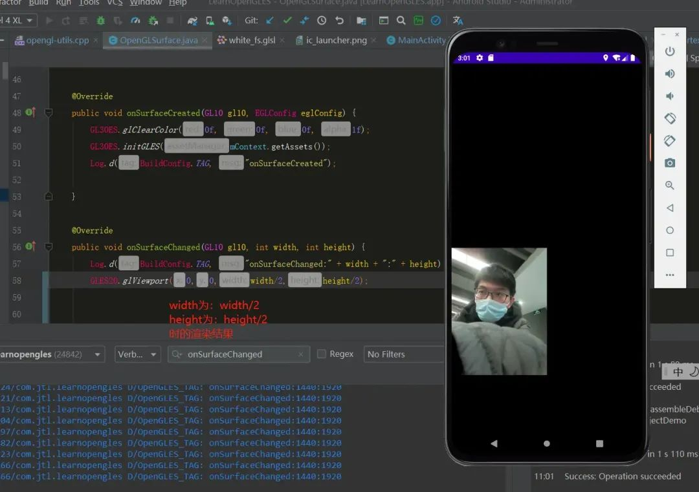

# OpenGL 学了那么久了，glViewport 你真的会用吗？

[字节流动](https://www.nxrte.com/user/23) • 2023年8月23日 上午10:29 • [技术文章](https://www.nxrte.com/category/jishu)

OpenGL中的 glViewport 函数用于定义视口（Viewport），即确定窗口中显示的区域。它的定义如下：

```
void glViewport(GLint x, GLint y, GLsizei width, GLsizei height);
```

参数解释：

- x：视口的左下角X坐标。
- y：视口的左下角Y坐标。
- width：视口的宽度。
- height：视口的高度。

glViewport函数的作用是将**正投影坐标（OpenGL的默认坐标系）映射到屏幕上实际显示的区域**。它将正投影坐标系中的点映射到屏幕上指定大小的矩形区域内。

在使用OpenGL进行绘图时，**我们通常需要先通过glViewport来设置视口，将整个窗口或窗口的一部分作为渲染区域**。这样，我们可以指定绘制的内容在窗口的哪个位置显示出来。

### **正常显示时的参数**

这里传入的参数为 *glViewport(0,0,width,height)*，此时数据可以正常渲染到屏幕上。

[](https://www.nxrte.com/wp-content/uploads/2023/08/2023082302223983.jpg)

### **只改变width参数**

这里传入的参数为 *glViewport(0,0,width/2,height)*，此时数据和正常时相比宽度变成了之前的一半。

由此可以说明右侧为x的正方向。且数据的宽是由x和width控制的。

[](https://www.nxrte.com/wp-content/uploads/2023/08/2023082302231759.jpg)

### **只改变 height 参数**

这里传入的参数为*glViewport(0,0,width,height/2)*，此时数据和正常时相比高度变成了之前的一半。

由此可以说明上方为y的正方向。且数据的高是由 y 和 height 控制的。

[](https://www.nxrte.com/wp-content/uploads/2023/08/2023082302234352.jpg)

### **同时改变 width 和 height 参数**

这里传入的参数为 *glViewport(0,0,width/2,height/2)*，此时数据和正常时相比宽度变成了之前的一半，高度也变成了之前的一半。

由此可以说明渲染到屏幕的数据具体大小，是x，y，width，height共同控制的（貌似是句废话）

[](https://www.nxrte.com/wp-content/uploads/2023/08/2023082302243248.jpg)

### **只改变 x 参数**

这里传入的参数为 *glViewport(width/2,0,width,height)*，此时数据和正常时相比。大小没有变化，整体向右偏移了width/2个像素。且超出部分没有显示

由此可以说明数据x轴的起始位置由x参数控制，如果 x+width>width 即超出了屏幕像素的宽，x方向超出部分将不显示。

[](https://www.nxrte.com/wp-content/uploads/2023/08/2023082302245682.jpg)

### **只改变 y 参数**

这里传入的参数为 *glViewport(0,height/2,width,height)*，此时数据和正常时相比。大小没有变化，整体向上偏移了height/2个像素。且超出部分没有显示

[](https://www.nxrte.com/wp-content/uploads/2023/08/2023082302252428.jpg)

### **同时改变x，y参数**

这里传入的参数为 *glViewport(width/2,height/2,width,height)*，此时数据和正常时相比。大小没有变化，整体向上偏移了height/2个像素，且超出部分没有显示。

由此可以说明数据y轴的起始位置由y参数控制，如果y+height>height即超出了屏幕像素的高，y方向超出的部分将不显示。

[](https://www.nxrte.com/wp-content/uploads/2023/08/2023082302255542.jpg)

### **同时改变x，y，width，height，参数**

这里传入的参数为 *glViewport(width/2,height/2,width/2,height/2)*。此时数据和正常时相比。起始位置为屏幕正中间（width/2,height/2），宽高分别为：width/2,height/2。

可以正常绘制，没有超出屏幕范围，且大小为正常渲染的四分之一。

[](https://www.nxrte.com/wp-content/uploads/2023/08/xyz.jpg)

### **glViewport() 作用总结**

为归一化坐标转换为屏幕坐标的接口。换言之将整张纹理上的数据，转换到屏幕上具体的像素点的接口。

x，y为以控件左下角为起始坐标，对应渲染纹理的左下角:

- 右为x轴的正方向。
- 上为y轴的正方向。

width，height是以x，y为起始位置的宽和高，用来确定渲染出的数据到屏幕的位置。

可以在屏幕上正常渲染出来的像素范围为x轴：0–width，y轴：0–height。超出部分将不显示。

用户可以通过该接口，控制数据渲染到屏幕的具体位置和范围。

如果超过该空间的屏幕像素，将不显示。但并不意味着OpengGL没有绘制超出显示部分的纹理数据。

**作者：TTLLong**

进技术交流群，扫码添加我的微信：Byte-Flow

[](https://www.nxrte.com/wp-content/uploads/2023/06/2023061901553342.jpg)

版权声明：本文内容转自互联网，本文观点仅代表作者本人。本站仅提供信息存储空间服务，所有权归原作者所有。如发现本站有涉嫌抄袭侵权/违法违规的内容， 请发送邮件至1393616908@qq.com 举报，一经查实，本站将立刻删除。