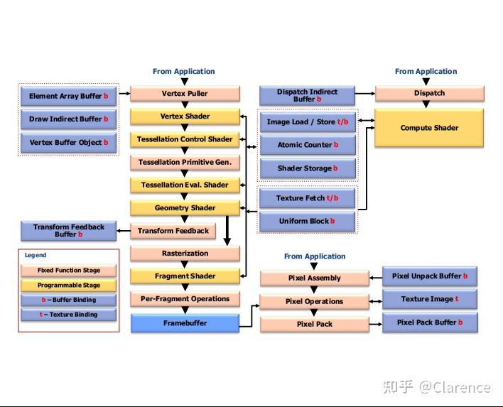

# OpenGL的数据流模型

## 正文 opengl spec46 core

OpenGL的结构图如上图所示，

有三类指令，第一类指令用来指定哪些几何对象将要被绘制，第二类是指定一个state，这个state将会去根据各种[状态控制](https://zhida.zhihu.com/search?content_id=219764250&content_type=Article&match_order=1&q=状态控制&zhida_source=entity)对象是如何处理的(specify state controlling how objects are handled by the various stages)，第三类是指定保存在纹理和[缓存对象](https://zhida.zhihu.com/search?content_id=219764250&content_type=Article&match_order=1&q=缓存对象&zhida_source=entity)中的文件。

指令将会有效的在处理流水线(processing pipeline)中传递，不同的pipeline状态信息包含在不同类型的buffer object中。（Different stages of the pipeline use data contained in different types of buffer objects）。

第一个状态会装配vertices到一个[几何图元](https://zhida.zhihu.com/search?content_id=219764250&content_type=Article&match_order=1&q=几何图元&zhida_source=entity)类型中，例如 点(Points)，线段(line segments)，以及多边形(polygons)。在下一个状态，[vertices](https://zhida.zhihu.com/search?content_id=219764250&content_type=Article&match_order=2&q=vertices&zhida_source=entity)将会被Transformed（[顶点](https://zhida.zhihu.com/search?content_id=219764250&content_type=Article&match_order=1&q=顶点&zhida_source=entity)变化，放大，缩小，平移之类的），这件事是在装配vertices到几何图元之后做的。

Tessellation([曲面细分](https://zhida.zhihu.com/search?content_id=219764250&content_type=Article&match_order=1&q=曲面细分&zhida_source=entity))以及Geometry(几何)[着色器](https://zhida.zhihu.com/search?content_id=219764250&content_type=Article&match_order=1&q=着色器&zhida_source=entity)会将比较单一的输入图元，转化生成多个图元。可选的，每一个[pipeline](https://zhida.zhihu.com/search?content_id=219764250&content_type=Article&match_order=4&q=pipeline&zhida_source=entity)的结果状态都可以反馈到buffer objects中，当你使用transform feedback相关的功能的时候。

曲面细分以及几何着色器处理之后的图元，将会被剪裁到剪裁容器（clip volume）中，为下一个阶段做准备 ---[光栅化](https://zhida.zhihu.com/search?content_id=219764250&content_type=Article&match_order=1&q=光栅化&zhida_source=entity)（rasterization）。光栅器（rasterizer）产生了一系列的framebuffer addresses以及数值（这些数据都使用二维的描述，例如point line segment 或者 polygon）[译注，这里是真正将3D数据转化为2D显示，在光栅化之前都是立体的3D顶点数据，光栅化之后将会使用一系列的2D结构来描述]，光栅化之后，会产生fragment的概念，会使用特定的光栅算法，将几个顶点填充为一个平面，使用fragment来填满由顶点围起来的平面，这些fragment将会被完全独立的处理(operations)，处理之后将会最终送到[framebuffer](https://zhida.zhihu.com/search?content_id=219764250&content_type=Article&match_order=2&q=framebuffer&zhida_source=entity)中去。这里所谓的处理(operations)包括，每个片元将会有条件的(conditional)更新到framebuffer中，这些条件包括

1，depth values [深度测试](https://zhida.zhihu.com/search?content_id=219764250&content_type=Article&match_order=1&q=深度测试&zhida_source=entity)，是否有片元挡在这个待画片元之前

2，blending，刚进来的片元颜色，和原先的片元颜色进行融合

3，masking,stenciling 以及其他的在片元数据上的逻辑操作(片元着色器自定义操作)

像素(Pixels)也可以从framebuffer中读回来或者复制到其他framebuffer中，这样的传递复制有可能需要decoding或者encoding。

最后，compute shaders可以对buffer objects进行读和写，可以相对独立的运行在pipeline中。

这个图只是想简单描述下GL，不是一个严格OPENGL实现的规则，我们绘制这个只是想说清楚每个GL操作的相互关系。

## 译注

这篇文章概述了整个GL的pipeline，从AP传入顶点数据，到根据AP指定的图元（点，线，三角形）把顶点数据装配为图元，再将较为单一的图元传入曲面细分着色器以及几何着色器产生更多的图元。到目前为止，图元都是一个个少数点的集合，接下来进入光栅化阶段，将少数顶点的集合光栅化为一个平面，这样就会产生更多的片元。这些片元将会根据一定的条件进入到framebuffer中去，这些条件包括，深度测试，模板测试以及片元着色器自定义的操作等等，当完全通过这些测试，每个片元将会进入到framebuffer中用作显示。

这是一个比较完整和经典的流水线过程！

用比较早期使用GL开发的游戏做题图吧，3D游戏划时代的作品之一！

